# TwoMillion
## Enumeration
- `nmap`
```
└─$ nmap -Pn -p- 10.10.11.221 -T4            
Starting Nmap 7.94 ( https://nmap.org ) at 2023-08-31 17:29 BST
Warning: 10.10.11.221 giving up on port because retransmission cap hit (6).
Nmap scan report for 10.10.11.221 (10.10.11.221)
Host is up (0.15s latency).
Not shown: 65530 closed tcp ports (conn-refused)
PORT      STATE    SERVICE
22/tcp    open     ssh
80/tcp    open     http
```
```
└─$ nmap -Pn -p22,80 -sC -sV 10.10.11.221 -T4
Starting Nmap 7.94 ( https://nmap.org ) at 2023-08-31 18:08 BST
Nmap scan report for 10.10.11.221 (10.10.11.221)
Host is up (0.15s latency).

PORT      STATE  SERVICE         VERSION
22/tcp    open   ssh             OpenSSH 8.9p1 Ubuntu 3ubuntu0.1 (Ubuntu Linux; protocol 2.0)
| ssh-hostkey: 
|   256 3e:ea:45:4b:c5:d1:6d:6f:e2:d4:d1:3b:0a:3d:a9:4f (ECDSA)
|_  256 64:cc:75:de:4a:e6:a5:b4:73:eb:3f:1b:cf:b4:e3:94 (ED25519)
80/tcp    open   http            nginx
|_http-title: Did not follow redirect to http://2million.htb/
```
- Web server


- `gobuster`
```
└─$ gobuster dir -u http://2million.htb/ -w /usr/share/seclists/Discovery/Web-Content/directory-list-2.3-medium.txt -t 50 -x txt,php --no-error --exclude-length 162
===============================================================
Gobuster v3.5
by OJ Reeves (@TheColonial) & Christian Mehlmauer (@firefart)
===============================================================
[+] Url:                     http://2million.htb/
[+] Method:                  GET
[+] Threads:                 50
[+] Wordlist:                /usr/share/seclists/Discovery/Web-Content/directory-list-2.3-medium.txt
[+] Negative Status codes:   404
[+] Exclude Length:          162
[+] User Agent:              gobuster/3.5
[+] Extensions:              php,txt
[+] Timeout:                 10s
===============================================================
2023/08/31 18:37:36 Starting gobuster in directory enumeration mode
===============================================================
/home                 (Status: 302) [Size: 0] [--> /]
/login                (Status: 200) [Size: 3704]
/register             (Status: 200) [Size: 4527]
/api                  (Status: 401) [Size: 0]
/logout               (Status: 302) [Size: 0] [--> /]
/404                  (Status: 200) [Size: 1674]
/Database.php         (Status: 200) [Size: 0]
/0404                 (Status: 200) [Size: 1674]
/invite               (Status: 200) [Size: 3859]
/Router.php           (Status: 200) [Size: 0]

```
- `vhosts`
```
└─$ ffuf -w /usr/share/seclists/Discovery/DNS/subdomains-top1million-20000.txt -u 'http://2million.htb/' -H 'Host: FUZZ.2million.htb' -fs 162

        /'___\  /'___\           /'___\       
       /\ \__/ /\ \__/  __  __  /\ \__/       
       \ \ ,__\\ \ ,__\/\ \/\ \ \ \ ,__\      
        \ \ \_/ \ \ \_/\ \ \_\ \ \ \ \_/      
         \ \_\   \ \_\  \ \____/  \ \_\       
          \/_/    \/_/   \/___/    \/_/       

       v2.0.0-dev
________________________________________________

 :: Method           : GET
 :: URL              : http://2million.htb/
 :: Wordlist         : FUZZ: /usr/share/seclists/Discovery/DNS/subdomains-top1million-20000.txt
 :: Header           : Host: FUZZ.2million.htb
 :: Follow redirects : false
 :: Calibration      : false
 :: Timeout          : 10
 :: Threads          : 40
 :: Matcher          : Response status: 200,204,301,302,307,401,403,405,500
 :: Filter           : Response size: 162
________________________________________________

:: Progress: [19966/19966] :: Job [1/1] :: 187 req/sec :: Duration: [0:01:10] :: Errors: 0 ::
```

## Foothold
- `http://2million.htb/invite`
  - We find `inviteapi.js` in the sources
  - Send it to https://beautifier.io/


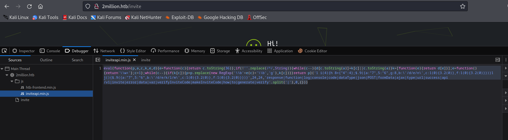


- Let's try calling `makeInviteCode()`
  - It returns message encrypted by `ROT13`
  - I used [CyberChef](https://gchq.github.io/CyberChef/) to decrypt it


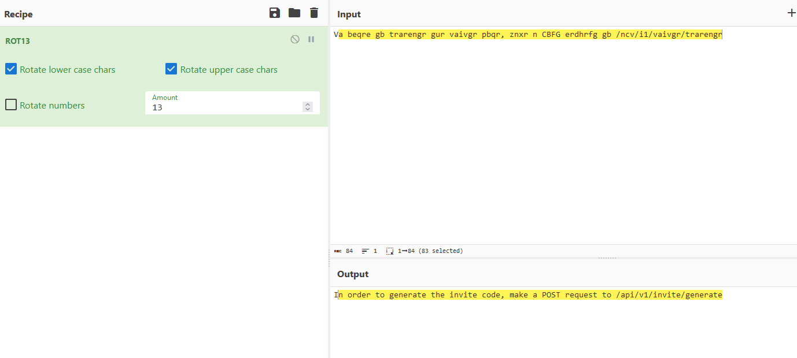

- Okay, now we know what we have to do as the next step
  - Send `POST` request to `/api/v1/invite/generate`
  - Sending `POST` message to specified `api` results in `base64` encoded code
  - Use it to register and log in


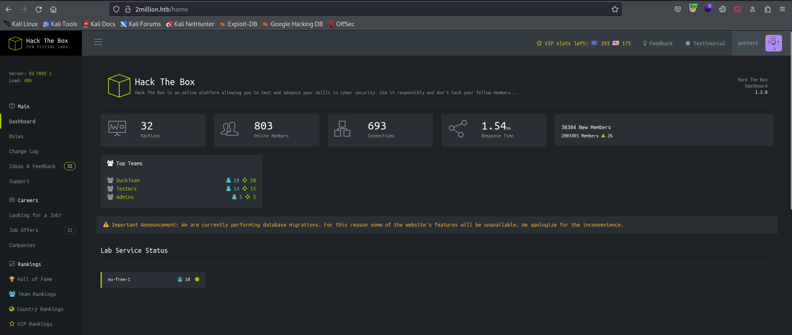

- We had `/api` endpoint from `gobuster` results which returned `401` code
  - Now we can see all `api` endpoints


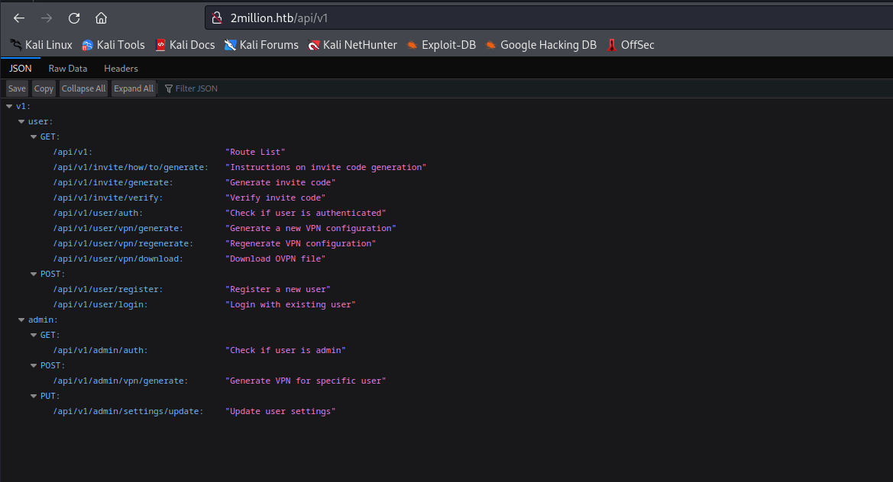

- We don't have `admin` privileges
  - Thus we can't generate `vpn` 


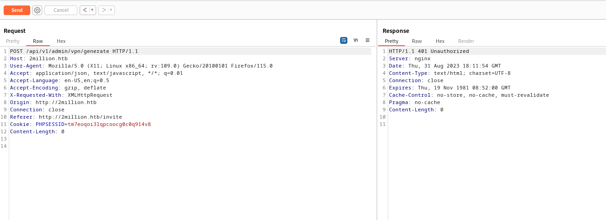

- But we receive `200` response code for `/api/v1/admin/settings/update`


- We change `Content-Type` to `application/json`
  - We receive error indicating that `email` parameter is missing


- We add `email` parameter
  - Another error with missing `is_admin` parameter

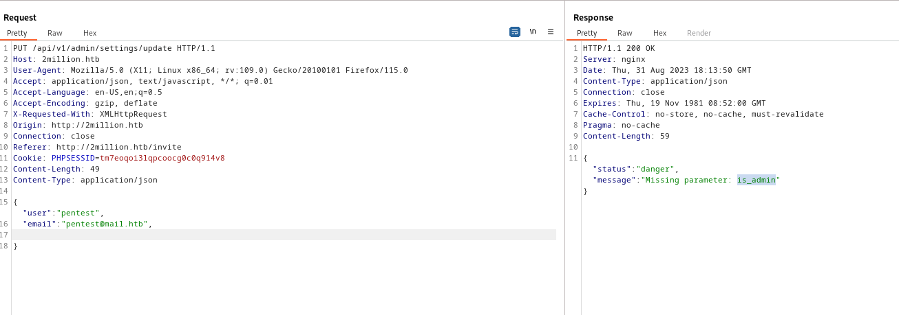

- We set `is_admin` to `true` 
  - But it says it has to be either `1` or `0`
  - So we set it to `1`

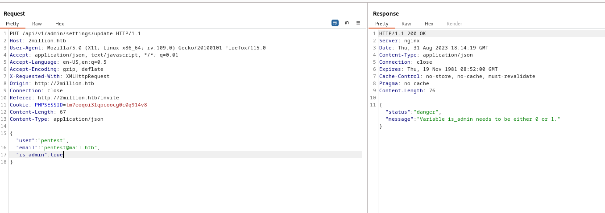

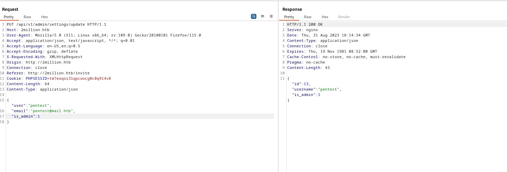

- It seems like it was succesfull
  - If we check again `/api/v1/admin/auth` route, it returns `true`

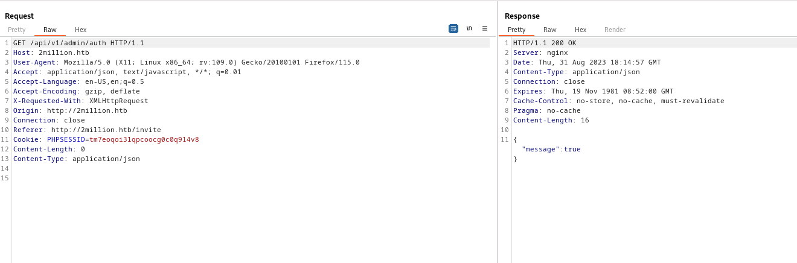

- Now let's generate a `vpn`
  - Just like before, it requires `Content-Type: application/json`
  - And `username` parameter


- If we did everything correctly, we receive response with our `vpn` file

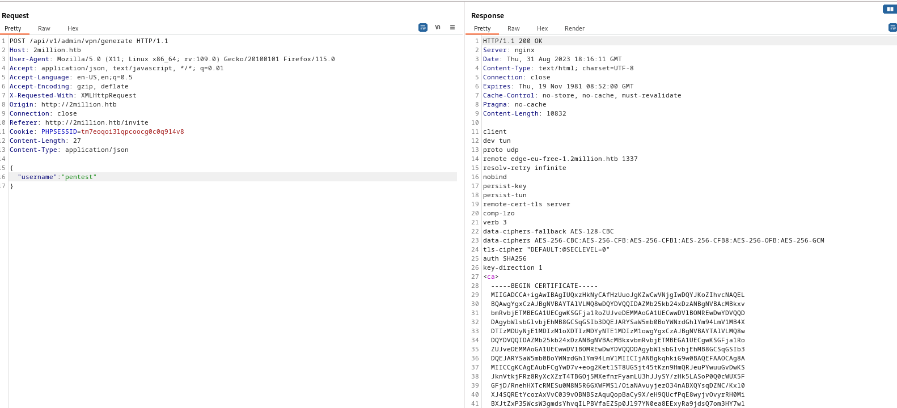

- Okay, here I simply tried `command injection` on `username` parameter and it worked
  - I thought they could generate `ovpn` file like in this [post](https://www.digitalocean.com/community/tutorials/how-to-set-up-and-configure-an-openvpn-server-on-ubuntu-20-04#step-12-generating-client-configurations) 
  - For example, `./make_config.sh <username>`
  - And `command injection` worked


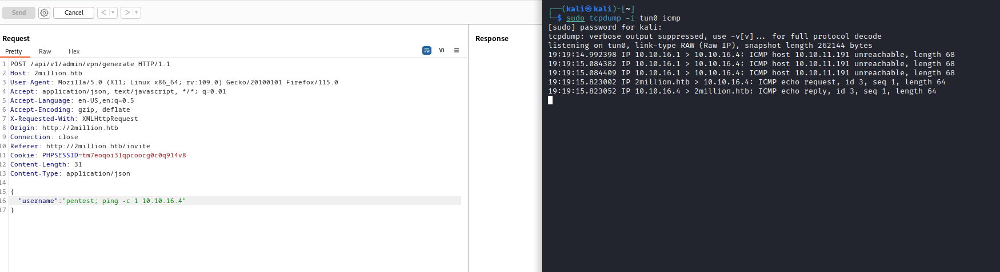

- Since we have `rce`, we got our reverse shell

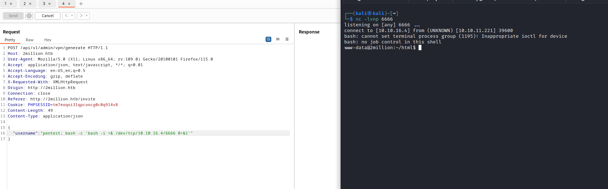

## User
- `admin` user
```
www-data@2million:~/html$ ls -lha /home
total 12K
drwxr-xr-x  3 root  root  4.0K Jun  6 10:22 .
drwxr-xr-x 19 root  root  4.0K Jun  6 10:22 ..
drwxr-xr-x  4 admin admin 4.0K Jun  6 10:22 admin
www-data@2million:~/html$ find / -user admin 2>/dev/null
/home/admin
/home/admin/.cache
/home/admin/.ssh
/home/admin/.profile
/home/admin/.bash_logout
/home/admin/.bashrc
/var/mail/admin
www-data@2million:~/html$ find / -user admin -ls 2>/dev/null
    80942      4 drwxr-xr-x   4 admin    admin        4096 Jun  6 10:22 /home/admin
    80949      4 drwx------   2 admin    admin        4096 Jun  6 10:22 /home/admin/.cache
    80948      4 drwx------   2 admin    admin        4096 Jun  6 10:22 /home/admin/.ssh
    80943      4 -rw-r--r--   1 admin    admin         807 May 26 22:53 /home/admin/.profile
    80944      4 -rw-r--r--   1 admin    admin         220 May 26 22:53 /home/admin/.bash_logout
    80945      4 -rw-r--r--   1 admin    admin        3771 May 26 22:53 /home/admin/.bashrc
      271      4 -rw-r--r--   1 admin    admin         540 Jun  2 23:20 /var/mail/admin

```

- Let's check `/var/mail/admin`
```
From: ch4p <ch4p@2million.htb>
To: admin <admin@2million.htb>
Cc: g0blin <g0blin@2million.htb>
Subject: Urgent: Patch System OS
Date: Tue, 1 June 2023 10:45:22 -0700
Message-ID: <9876543210@2million.htb>
X-Mailer: ThunderMail Pro 5.2

Hey admin,

I'm know you're working as fast as you can to do the DB migration. While we're partially down, can you also upgrade the OS on our web host? There have been a few serious Linux kernel CVEs already this year. That one in OverlayFS / FUSE looks nasty. We can't get popped by that.

HTB Godfather
```

- Let's also check `/var/www/html` for config files, in case there are credentials
```
www-data@2million:~/html$ grep -irl "password" .
./.env
./index.php
./js/htb-backend.min.js
./js/htb-frontpage.min.js
./js/htb-frontend.min.js
./views/register.php
./views/login.php
./controllers/AuthController.php
www-data@2million:~/html$ cat .env 
DB_HOST=127.0.0.1
DB_DATABASE=htb_prod
DB_USERNAME=admin
DB_PASSWORD=SuperDuperPass123
```
- `su` to `admin` using creds above works
  - We can also `ssh`
```
www-data@2million:~/html$ su admin
Password: 
To run a command as administrator (user "root"), use "sudo <command>".
See "man sudo_root" for details.

admin@2million:/var/www/html$ 
```
## Root
- We saw a hint from email
  - Let's get box info and then google
```
admin@2million:~$ uname -a
Linux 2million 5.15.70-051570-generic #202209231339 SMP Fri Sep 23 13:45:37 UTC 2022 x86_64 x86_64 x86_64 GNU/Linux
admin@2million:~$ cat /etc/*release
DISTRIB_ID=Ubuntu
DISTRIB_RELEASE=22.04
DISTRIB_CODENAME=jammy
DISTRIB_DESCRIPTION="Ubuntu 22.04.2 LTS"
PRETTY_NAME="Ubuntu 22.04.2 LTS"
NAME="Ubuntu"
VERSION_ID="22.04"
VERSION="22.04.2 LTS (Jammy Jellyfish)"
VERSION_CODENAME=jammy
ID=ubuntu
ID_LIKE=debian
HOME_URL="https://www.ubuntu.com/"
SUPPORT_URL="https://help.ubuntu.com/"
BUG_REPORT_URL="https://bugs.launchpad.net/ubuntu/"
PRIVACY_POLICY_URL="https://www.ubuntu.com/legal/terms-and-policies/privacy-policy"
UBUNTU_CODENAME=jammy
```
- Potential [CVE-2023-0386](https://securitylabs.datadoghq.com/articles/overlayfs-cve-2023-0386/)
  - Looks like it was fixed in `5.15.0-70.77`, which was published in `22 March 2023`
  - We have `5.15.70-051570-generic` compiled in `Sep 23 13:45:37 UTC 2022`
  - Worth trying


- We have a [POC](https://github.com/xkaneiki/CVE-2023-0386/tree/main) with instructions
  - Download the `zip`


- Unzip it and follow the instructions
  - The session hangs

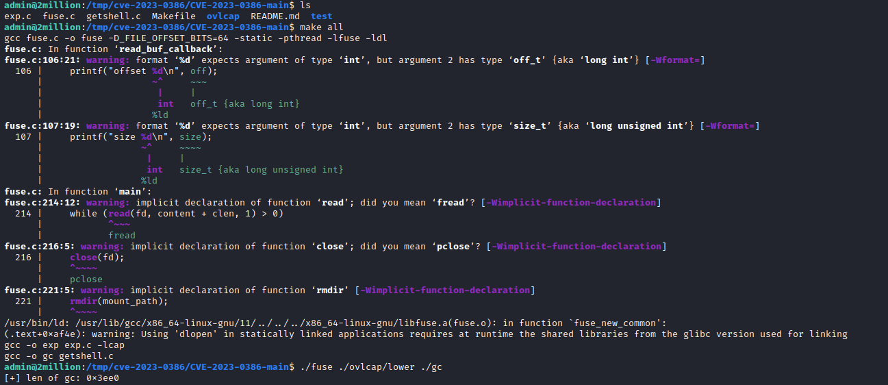


- Run exploit from another session
  - And we are `root`


