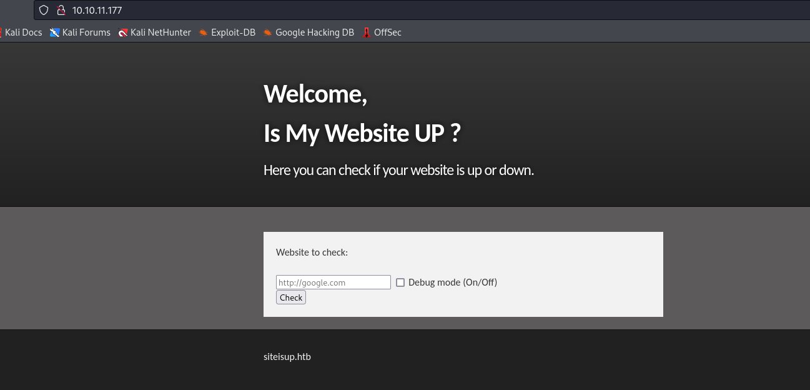
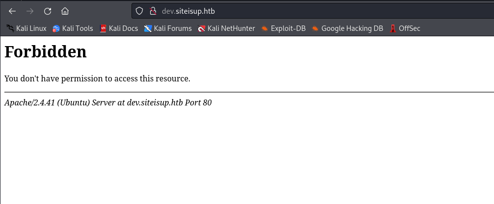
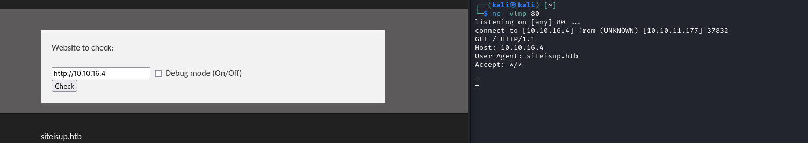

# Updown
## Enumeration
- `nmap`
```
└─$ nmap -Pn -p- 10.10.11.177 --min-rate 1000            
Starting Nmap 7.94 ( https://nmap.org ) at 2023-11-09 16:46 GMT
Warning: 10.10.11.177 giving up on port because retransmission cap hit (10).
Nmap scan report for 10.10.11.177 (10.10.11.177)
Host is up (0.19s latency).
Not shown: 64486 closed tcp ports (conn-refused), 1047 filtered tcp ports (no-response)
PORT   STATE SERVICE
22/tcp open  ssh
80/tcp open  http

Nmap done: 1 IP address (1 host up) scanned in 109.57 seconds

```
```
└─$ nmap -Pn -p22,80 -sC -sV 10.10.11.177 --min-rate 1000 
Starting Nmap 7.94 ( https://nmap.org ) at 2023-11-09 16:49 GMT
Nmap scan report for 10.10.11.177 (10.10.11.177)
Host is up (0.19s latency).

PORT   STATE SERVICE VERSION
22/tcp open  ssh     OpenSSH 8.2p1 Ubuntu 4ubuntu0.5 (Ubuntu Linux; protocol 2.0)
| ssh-hostkey: 
|   3072 9e:1f:98:d7:c8:ba:61:db:f1:49:66:9d:70:17:02:e7 (RSA)
|   256 c2:1c:fe:11:52:e3:d7:e5:f7:59:18:6b:68:45:3f:62 (ECDSA)
|_  256 5f:6e:12:67:0a:66:e8:e2:b7:61:be:c4:14:3a:d3:8e (ED25519)
80/tcp open  http    Apache httpd 2.4.41 ((Ubuntu))
|_http-server-header: Apache/2.4.41 (Ubuntu)
|_http-title: Is my Website up ?
Service Info: OS: Linux; CPE: cpe:/o:linux:linux_kernel

Service detection performed. Please report any incorrect results at https://nmap.org/submit/ .
Nmap done: 1 IP address (1 host up) scanned in 16.72 seconds

```

- Web Server 



- `gobuster`

```
└─$ gobuster dir -u http://10.10.11.177/ -w /usr/share/wordlists/dirbuster/directory-list-2.3-medium.txt -x txt,html,js,php --no-error  

===============================================================
Gobuster v3.6
by OJ Reeves (@TheColonial) & Christian Mehlmauer (@firefart)
===============================================================
[+] Url:                     http://10.10.11.177/
[+] Method:                  GET
[+] Threads:                 10
[+] Wordlist:                /usr/share/wordlists/dirbuster/directory-list-2.3-medium.txt
[+] Negative Status codes:   404
[+] User Agent:              gobuster/3.6
[+] Extensions:              txt,html,js,php
[+] Timeout:                 10s
===============================================================
Starting gobuster in directory enumeration mode
===============================================================
/index.php            (Status: 200) [Size: 1131]
/.html                (Status: 403) [Size: 277]
/.php                 (Status: 403) [Size: 277]
/dev                  (Status: 301) [Size: 310] [--> http://10.10.11.177/dev/]
```

- `vhosts`
```
└─$ wfuzz -u http://siteisup.htb/ -H 'Host: FUZZ.siteisup.htb' -w /usr/share/seclists/Discovery/DNS/subdomains-top1million-20000.txt --hw 93  
 /usr/lib/python3/dist-packages/wfuzz/__init__.py:34: UserWarning:Pycurl is not compiled against Openssl. Wfuzz might not work correctly when fuzzing SSL sites. Check Wfuzz's documentation for more information.
********************************************************
* Wfuzz 3.1.0 - The Web Fuzzer                         *
********************************************************

Target: http://siteisup.htb/
Total requests: 19966

=====================================================================
ID           Response   Lines    Word       Chars       Payload                                                                                                                                                                    
=====================================================================

000000019:   403        9 L      28 W       281 Ch      "dev"
```

- `dev.siteisup.htb`



- If I used only `directory-list-2.3-medium.txt`, I would've missed `.git` repo
  - Always use multiple wordlists
    - `raft-medium-words.txt` for example
```
└─$ gobuster dir -u http://siteisup.htb/dev/ -w /usr/share/seclists/Discovery/Web-Content/raft-medium-words.txt  -x txt,html,js,php --no-error -t 50
===============================================================
Gobuster v3.6
by OJ Reeves (@TheColonial) & Christian Mehlmauer (@firefart)
===============================================================
[+] Url:                     http://siteisup.htb/dev/
[+] Method:                  GET
[+] Threads:                 50
[+] Wordlist:                /usr/share/seclists/Discovery/Web-Content/raft-medium-words.txt
[+] Negative Status codes:   404
[+] User Agent:              gobuster/3.6
[+] Extensions:              txt,html,js,php
[+] Timeout:                 10s
===============================================================
Starting gobuster in directory enumeration mode
===============================================================
/.php                 (Status: 403) [Size: 277]
/index.php            (Status: 200) [Size: 0]
/.html.js             (Status: 403) [Size: 277]
/.htm.txt             (Status: 403) [Size: 277]
/.htm.html            (Status: 403) [Size: 277]
/.htm                 (Status: 403) [Size: 277]
/.htm.js              (Status: 403) [Size: 277]
/.htm.php             (Status: 403) [Size: 277]
/.html.html           (Status: 403) [Size: 277]
/.html                (Status: 403) [Size: 277]
/.html.php            (Status: 403) [Size: 277]
/.html.txt            (Status: 403) [Size: 277]
/.                    (Status: 200) [Size: 0]
/.htaccess.txt        (Status: 403) [Size: 277]
/.htaccess.html       (Status: 403) [Size: 277]
/.htaccess.php        (Status: 403) [Size: 277]
/.htaccess            (Status: 403) [Size: 277]
/.htaccess.js         (Status: 403) [Size: 277]
/.phtml               (Status: 403) [Size: 277]
/.htc.txt             (Status: 403) [Size: 277]
/.htc.html            (Status: 403) [Size: 277]
/.htc                 (Status: 403) [Size: 277]
/.htc.js              (Status: 403) [Size: 277]
/.htc.php             (Status: 403) [Size: 277]
/.html_var_DE.html    (Status: 403) [Size: 277]
/.html_var_DE.txt     (Status: 403) [Size: 277]
/.html_var_DE         (Status: 403) [Size: 277]
/.html_var_DE.php     (Status: 403) [Size: 277]
/.html_var_DE.js      (Status: 403) [Size: 277]
/.htpasswd            (Status: 403) [Size: 277]
/.htpasswd.html       (Status: 403) [Size: 277]
/.htpasswd.txt        (Status: 403) [Size: 277]
/.htpasswd.js         (Status: 403) [Size: 277]
/.htpasswd.php        (Status: 403) [Size: 277]
/.git                 (Status: 301) [Size: 315] [--> http://siteisup.htb/dev/.git/]

```
## Foothold
- `SSRF`



- But nothing interesting comes of it
  - Let's navigate to `http://10.10.11.177/dev/.git/`
  - We will use [git-dumper](https://github.com/arthaud/git-dumper)
    - `sudo pip3 install git-dumper` 
```
└─$ git-dumper http://10.10.11.177/dev/.git/ .
[-] Testing http://10.10.11.177/dev/.git/HEAD [200]
[-] Testing http://10.10.11.177/dev/.git/ [200]
<SNIP>
[-] Fetching http://10.10.11.177/dev/.git/logs/refs/remotes/origin/ [200]
[-] Fetching http://10.10.11.177/dev/.git/logs/refs/remotes/origin/HEAD [200]
[-] Running git checkout .
Updated 6 paths from the index
```

- We see why couldn't access `dev.siteisup.htb`
```
└─$ cat .htaccess                      
SetEnvIfNoCase Special-Dev "only4dev" Required-Header
Order Deny,Allow
Deny from All
Allow from env=Required-Header

```

- 