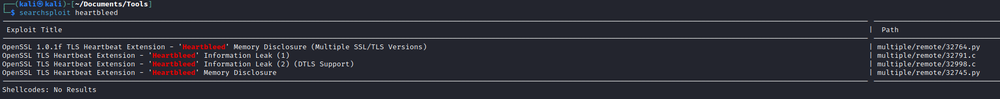

# Valentine
## Enumeration
- `nmap`
```
└─$ nmap -sC -sV 10.10.10.79    
Starting Nmap 7.93 ( https://nmap.org ) at 2023-06-07 19:16 BST
Nmap scan report for 10.10.10.79 (10.10.10.79)
Host is up (0.16s latency).
Not shown: 997 closed tcp ports (conn-refused)
PORT    STATE SERVICE  VERSION
22/tcp  open  ssh      OpenSSH 5.9p1 Debian 5ubuntu1.10 (Ubuntu Linux; protocol 2.0)
| ssh-hostkey: 
|   1024 964c51423cba2249204d3eec90ccfd0e (DSA)
|   2048 46bf1fcc924f1da042b3d216a8583133 (RSA)
|_  256 e62b2519cb7e54cb0ab9ac1698c67da9 (ECDSA)
80/tcp  open  http     Apache httpd 2.2.22 ((Ubuntu))
|_http-server-header: Apache/2.2.22 (Ubuntu)
|_http-title: Site doesn't have a title (text/html).
443/tcp open  ssl/http Apache httpd 2.2.22 ((Ubuntu))
| ssl-cert: Subject: commonName=valentine.htb/organizationName=valentine.htb/stateOrProvinceName=FL/countryName=US
| Not valid before: 2018-02-06T00:45:25
|_Not valid after:  2019-02-06T00:45:25
|_http-title: Site doesn't have a title (text/html).
|_http-server-header: Apache/2.2.22 (Ubuntu)
|_ssl-date: 2023-06-07T18:16:21+00:00; -29s from scanner time.
Service Info: OS: Linux; CPE: cpe:/o:linux:linux_kernel

Host script results:
|_clock-skew: -29s

Service detection performed. Please report any incorrect results at https://nmap.org/submit/ .
Nmap done: 1 IP address (1 host up) scanned in 42.31 seconds

```
- `gobuster`
```
└─$ gobuster dir -u http://10.10.10.79 -w  /usr/share/wordlists/dirbuster/directory-list-2.3-medium.txt -x php -t 50    
===============================================================
Gobuster v3.5
by OJ Reeves (@TheColonial) & Christian Mehlmauer (@firefart)
===============================================================
[+] Url:                     http://10.10.10.79
[+] Method:                  GET
[+] Threads:                 50
[+] Wordlist:                /usr/share/wordlists/dirbuster/directory-list-2.3-medium.txt
[+] Negative Status codes:   404
[+] User Agent:              gobuster/3.5
[+] Extensions:              php
[+] Timeout:                 10s
===============================================================
2023/06/07 20:00:19 Starting gobuster in directory enumeration mode
===============================================================
/index.php            (Status: 200) [Size: 38]
/index                (Status: 200) [Size: 38]
/dev                  (Status: 301) [Size: 308] [--> http://10.10.10.79/dev/]
/encode               (Status: 200) [Size: 554]
/encode.php           (Status: 200) [Size: 554]
/decode.php           (Status: 200) [Size: 552]
/decode               (Status: 200) [Size: 552]

```
## Foothold/User
- Both web server host same image and look identical
  - The picture suggests `heartbleed`
  - So googling resulted:
    - https://heartbleed.com/
    - https://xkcd.com/1354/
    - etc.


- Let's search for exploit



- Test the exploit 
  - We see that it's vulnerable
  - Let's remove zeros from output


- Now we need to dump the memory
  - Found a [script](https://gist.github.com/eelsivart/10174134)
  - 