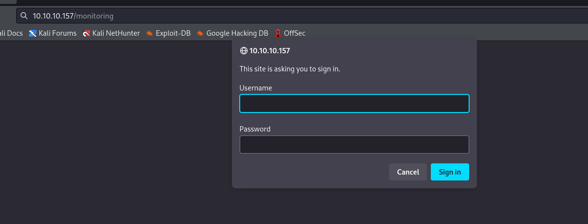

# Wall
## Enumeration
- `nmap`
```
└─$ nmap -Pn -p- 10.10.10.157 --min-rate 5000                                     
Starting Nmap 7.94 ( https://nmap.org ) at 2023-10-26 19:21 BST
Warning: 10.10.10.157 giving up on port because retransmission cap hit (10).
Nmap scan report for 10.10.10.157 (10.10.10.157)
Host is up (0.17s latency).
Not shown: 46442 filtered tcp ports (no-response), 19091 closed tcp ports (conn-refused)
PORT   STATE SERVICE
22/tcp open  ssh
80/tcp open  http

Nmap done: 1 IP address (1 host up) scanned in 119.61 seconds

```
```
└─$ nmap -Pn -p22,80 -sC -sV 10.10.10.157 --min-rate 5000
Starting Nmap 7.94 ( https://nmap.org ) at 2023-10-26 19:27 BST
Nmap scan report for 10.10.10.157 (10.10.10.157)
Host is up (0.19s latency).

PORT   STATE SERVICE VERSION
22/tcp open  ssh     OpenSSH 7.6p1 Ubuntu 4ubuntu0.3 (Ubuntu Linux; protocol 2.0)
| ssh-hostkey: 
|   2048 2e:93:41:04:23:ed:30:50:8d:0d:58:23:de:7f:2c:15 (RSA)
|   256 4f:d5:d3:29:40:52:9e:62:58:36:11:06:72:85:1b:df (ECDSA)
|_  256 21:64:d0:c0:ff:1a:b4:29:0b:49:e1:11:81:b6:73:66 (ED25519)
80/tcp open  http    Apache httpd 2.4.29 ((Ubuntu))
|_http-title: Apache2 Ubuntu Default Page: It works
|_http-server-header: Apache/2.4.29 (Ubuntu)
Service Info: OS: Linux; CPE: cpe:/o:linux:linux_kernel

Service detection performed. Please report any incorrect results at https://nmap.org/submit/ .
Nmap done: 1 IP address (1 host up) scanned in 16.57 seconds
```

- Web server



- `gobuster`
```
└─$ gobuster dir -u http://10.10.10.157 -w /usr/share/wordlists/dirbuster/directory-list-2.3-medium.txt -x txt,php,html -t 50
===============================================================
Gobuster v3.6
by OJ Reeves (@TheColonial) & Christian Mehlmauer (@firefart)
===============================================================
[+] Url:                     http://10.10.10.157
[+] Method:                  GET
[+] Threads:                 50
[+] Wordlist:                /usr/share/wordlists/dirbuster/directory-list-2.3-medium.txt
[+] Negative Status codes:   404
[+] User Agent:              gobuster/3.6
[+] Extensions:              txt,php,html
[+] Timeout:                 10s
===============================================================
Starting gobuster in directory enumeration mode
===============================================================
/.html                (Status: 403) [Size: 292]
/index.html           (Status: 200) [Size: 10918]
/.php                 (Status: 403) [Size: 291]
/aa.php               (Status: 200) [Size: 1]
/monitoring           (Status: 401) [Size: 459]
/panel.php            (Status: 200) [Size: 26]

```