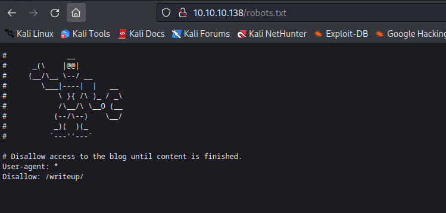
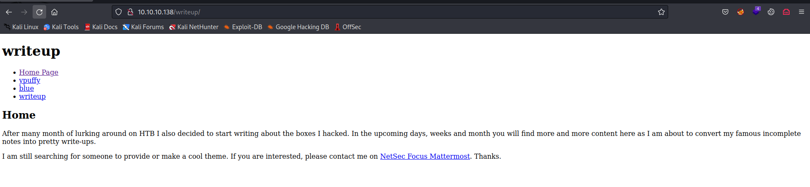
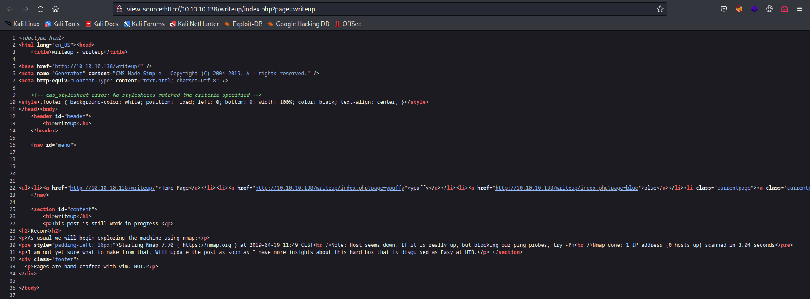
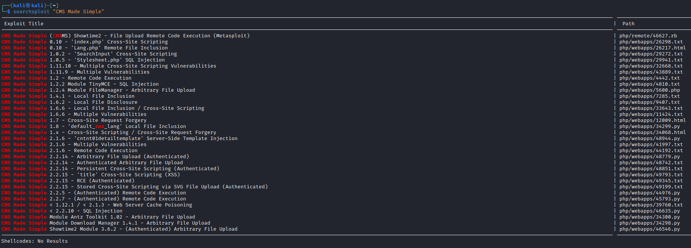
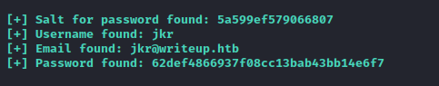
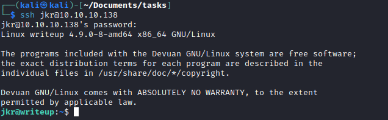
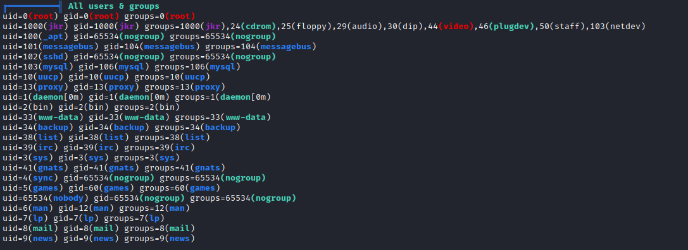
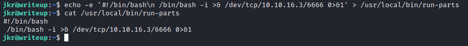
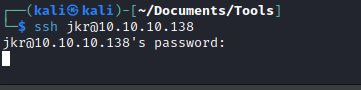

# Writeup
## Enumeration
- `nmap`
```'
└─$ nmap -Pn -sC -sV 10.10.10.138 -T4 
Starting Nmap 7.93 ( https://nmap.org ) at 2023-06-16 18:03 BST
Nmap scan report for 10.10.10.138 (10.10.10.138)
Host is up (0.10s latency).
Not shown: 998 filtered tcp ports (no-response)
PORT   STATE SERVICE VERSION
22/tcp open  ssh     OpenSSH 7.4p1 Debian 10+deb9u6 (protocol 2.0)
| ssh-hostkey: 
|   2048 dd5310700bd0470ae27e4ab6429823c7 (RSA)
|   256 372e1468aeb9c2342b6ed992bcbfbd28 (ECDSA)
|_  256 93eaa84042c1a83385b35600621ca0ab (ED25519)
80/tcp open  http    Apache httpd 2.4.25 ((Debian))
| http-robots.txt: 1 disallowed entry 
|_/writeup/
|_http-title: Nothing here yet.
Service Info: OS: Linux; CPE: cpe:/o:linux:linux_kernel

Service detection performed. Please report any incorrect results at https://nmap.org/submit/ .
Nmap done: 1 IP address (1 host up) scanned in 21.26 seconds
```
- Web server






## Foothold/User
- The site was generated by `CMS Made Simple`



- `Searchsploit`



- We don't know the version, but we can try exploits that cover majority of versions
  - [Post](https://packetstormsecurity.com/files/152356/CMS-Made-Simple-SQL-Injection.html)
  - [Python3 version of exploit](https://github.com/e-renna/CVE-2019-9053/blob/master/exploit.py)
  - `iconv -t UTF-8 -f iso-8859-1 /usr/share/wordlists/rockyou.txt > rockyou-utf8.txt` in case you want to crack using the script, but I suggest using `hashcat`
  - `python3 cms_exploit.py -u  http://10.10.10.138/writeup -w rockyou-utf8.txt`



- Let's crack the hash


- `ssh` to box



## Root
- Enumerate for privesc


- Automated tasks


- Groups 
  - `staff: Allows users to add local modifications to the system (/usr/local) without needing root privileges (note that executables in /usr/local/bin are in the PATH variable of any user, and they may "override" the executables in /bin and /usr/bin with the same name). Compare with group "adm", which is more related to monitoring/security.` - according to [wiki](https://wiki.debian.org/SystemGroups)




- We can only exploit that only via relative path
  - Let's find a way to exploit that
  - When I tried connecting again via `ssh` while `pspy` was on, we see `run-parts` is executed via relative path


- So let's create a script
  - Make it executable




- Setup listener
  - Connect via `ssh` again
  - And we have our `root`



