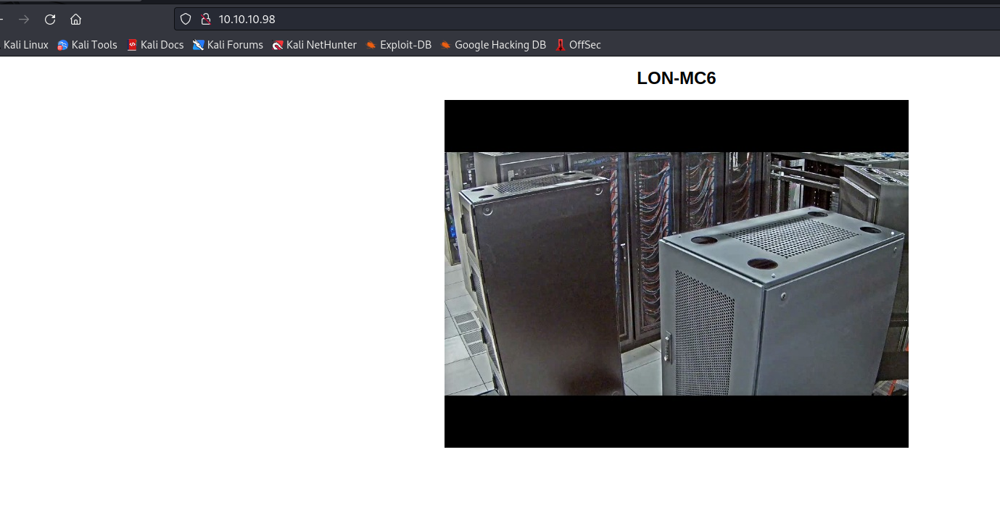

# Access
## Enumeration
- `nmap`
```
└─$ nmap -sC -sV 10.10.10.98    
Starting Nmap 7.93 ( https://nmap.org ) at 2023-06-11 14:20 BST
Nmap scan report for 10.10.10.98 (10.10.10.98)
Host is up (0.094s latency).
Not shown: 997 filtered tcp ports (no-response)
PORT   STATE SERVICE VERSION
21/tcp open  ftp     Microsoft ftpd
| ftp-anon: Anonymous FTP login allowed (FTP code 230)
|_Can't get directory listing: PASV failed: 425 Cannot open data connection.
| ftp-syst: 
|_  SYST: Windows_NT
23/tcp open  telnet  Microsoft Windows XP telnetd
| telnet-ntlm-info: 
|   Target_Name: ACCESS
|   NetBIOS_Domain_Name: ACCESS
|   NetBIOS_Computer_Name: ACCESS
|   DNS_Domain_Name: ACCESS
|   DNS_Computer_Name: ACCESS
|_  Product_Version: 6.1.7600
80/tcp open  http    Microsoft IIS httpd 7.5
|_http-title: MegaCorp
| http-methods: 
|_  Potentially risky methods: TRACE
|_http-server-header: Microsoft-IIS/7.5
Service Info: OSs: Windows, Windows XP; CPE: cpe:/o:microsoft:windows, cpe:/o:microsoft:windows_xp

Host script results:
|_clock-skew: -29s

Service detection performed. Please report any incorrect results at https://nmap.org/submit/ .
Nmap done: 1 IP address (1 host up) scanned in 20.22 seconds
```
- Web Server



## Foothold/User
