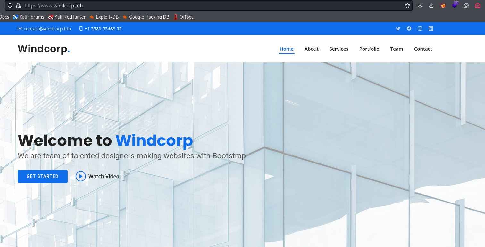

# Anubis
## Enumeration
- `nmap`
```
└─$ nmap -Pn -p- 10.10.11.102 --min-rate 10000                                                                   
Starting Nmap 7.94 ( https://nmap.org ) at 2023-10-07 18:21 BST
Nmap scan report for 10.10.11.102 (10.10.11.102)
Host is up (0.10s latency).
Not shown: 65530 filtered tcp ports (no-response)
PORT      STATE SERVICE
135/tcp   open  msrpc
443/tcp   open  https
445/tcp   open  microsoft-ds
593/tcp   open  http-rpc-epmap
49707/tcp open  unknown

Nmap done: 1 IP address (1 host up) scanned in 26.08 seconds
```
```
└─$ nmap -Pn -p135,443,445,593 -sC -sV 10.10.11.102 --min-rate 10000
Starting Nmap 7.94 ( https://nmap.org ) at 2023-10-07 18:22 BST
Nmap scan report for 10.10.11.102 (10.10.11.102)
Host is up (0.13s latency).

PORT    STATE SERVICE       VERSION
135/tcp open  msrpc         Microsoft Windows RPC
443/tcp open  ssl/http      Microsoft HTTPAPI httpd 2.0 (SSDP/UPnP)
|_ssl-date: 2023-10-07T18:21:55+00:00; +58m37s from scanner time.
| tls-alpn: 
|_  http/1.1
|_http-server-header: Microsoft-HTTPAPI/2.0
| ssl-cert: Subject: commonName=www.windcorp.htb
| Subject Alternative Name: DNS:www.windcorp.htb
| Not valid before: 2021-05-24T19:44:56
|_Not valid after:  2031-05-24T19:54:56
|_http-title: Not Found
445/tcp open  microsoft-ds?
593/tcp open  ncacn_http    Microsoft Windows RPC over HTTP 1.0
Service Info: OS: Windows; CPE: cpe:/o:microsoft:windows

Host script results:
| smb2-security-mode: 
|   3:1:1: 
|_    Message signing enabled and required
| smb2-time: 
|   date: 2023-10-07T18:21:22
|_  start_date: N/A
|_clock-skew: mean: 58m38s, deviation: 2s, median: 58m36s

Service detection performed. Please report any incorrect results at https://nmap.org/submit/ .
Nmap done: 1 IP address (1 host up) scanned in 55.88 seconds

```

- `smb`
```
└─$ smbclient -N -L //10.10.11.102
Anonymous login successful

        Sharename       Type      Comment
        ---------       ----      -------
Reconnecting with SMB1 for workgroup listing.
do_connect: Connection to 10.10.11.102 failed (Error NT_STATUS_IO_TIMEOUT)
Unable to connect with SMB1 -- no workgroup available

```

- `vhosts`
```
└─$ wfuzz -u https://10.10.11.102 -w /usr/share/seclists/Discovery/DNS/subdomains-top1million-20000.txt -H "Host: FUZZ.windcorp.htb" --hh 315
 /usr/lib/python3/dist-packages/wfuzz/__init__.py:34: UserWarning:Pycurl is not compiled against Openssl. Wfuzz might not work correctly when fuzzing SSL sites. Check Wfuzz's documentation for more information.
********************************************************
* Wfuzz 3.1.0 - The Web Fuzzer                         *
********************************************************

Target: https://10.10.11.102/
Total requests: 19966

=====================================================================
ID           Response   Lines    Word       Chars       Payload                                                                                                                                                                    
=====================================================================

000000001:   200        1007 L   3245 W     46774 Ch    "www"
000009532:   400        6 L      26 W       334 Ch      "#www"
000010581:   400        6 L      26 W       334 Ch      "#mail"

Total time: 527.0738
Processed Requests: 19966
Filtered Requests: 19963
Requests/sec.: 37.88084

```
- Web server



- `gobuster`
```
└─$ gobuster dir -u https://www.windcorp.htb -w /usr/share/wordlists/dirbuster/directory-list-lowercase-2.3-small.txt -t 50  -x asp,aspx,txt -k
===============================================================
Gobuster v3.6
by OJ Reeves (@TheColonial) & Christian Mehlmauer (@firefart)
===============================================================
[+] Url:                     https://www.windcorp.htb
[+] Method:                  GET
[+] Threads:                 50
[+] Wordlist:                /usr/share/wordlists/dirbuster/directory-list-lowercase-2.3-small.txt
[+] Negative Status codes:   404
[+] User Agent:              gobuster/3.6
[+] Extensions:              asp,aspx,txt
[+] Timeout:                 10s
===============================================================
Starting gobuster in directory enumeration mode
===============================================================
/services.asp         (Status: 200) [Size: 21308]
/assets               (Status: 301) [Size: 155] [--> https://www.windcorp.htb/assets/]
/forms                (Status: 301) [Size: 154] [--> https://www.windcorp.htb/forms/]
/test.asp             (Status: 200) [Size: 230]
/readme.txt           (Status: 200) [Size: 215]
/changelog.txt        (Status: 200) [Size: 1386]
/preview.asp          (Status: 200) [Size: 3515]
/save.asp             (Status: 302) [Size: 157] [--> https://www.windcorp.htb/preview.asp]
```