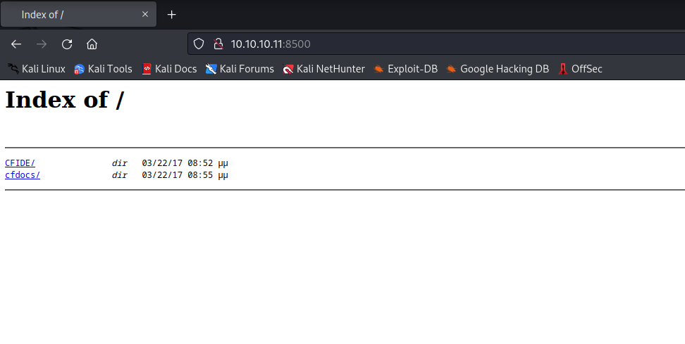
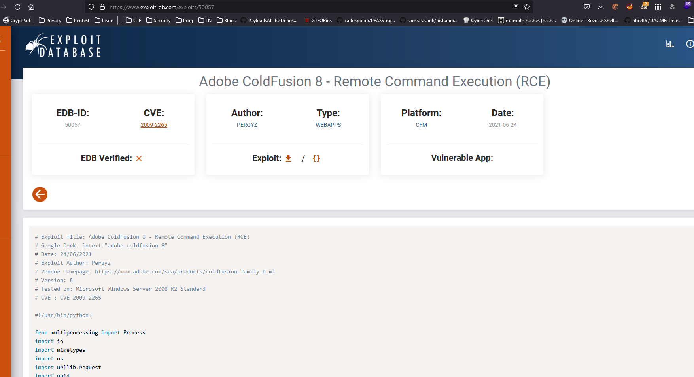
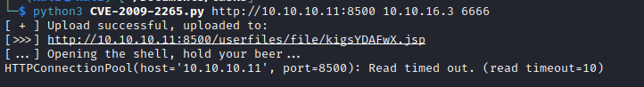
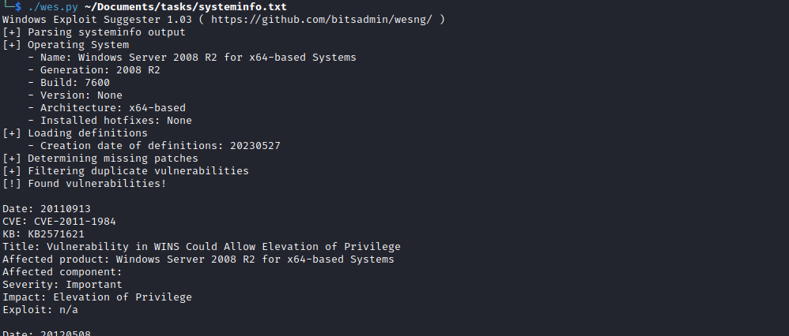
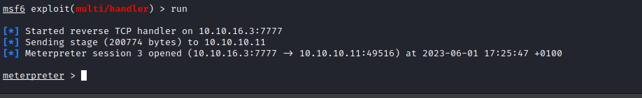
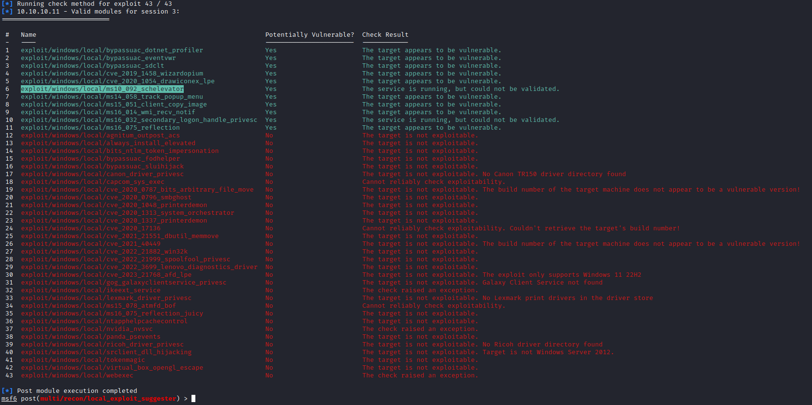
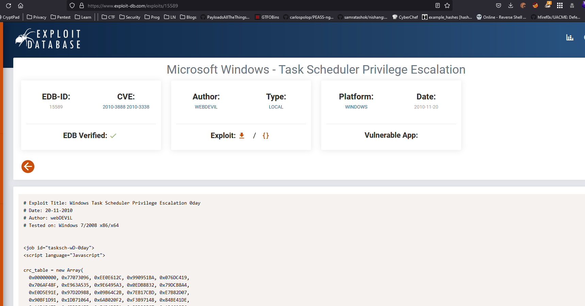

# Arctic
## Enumeration
- ```Nmap```
```
┌──(kali㉿kali)-[~]
└─$ nmap -Pn -sC -sV 10.10.10.11
Starting Nmap 7.93 ( https://nmap.org ) at 2023-06-01 16:05 BST
Nmap scan report for 10.10.10.11 (10.10.10.11)
Host is up (0.093s latency).
Not shown: 997 filtered tcp ports (no-response)
PORT      STATE SERVICE VERSION
135/tcp   open  msrpc   Microsoft Windows RPC
8500/tcp  open  fmtp?
49154/tcp open  msrpc   Microsoft Windows RPC
Service Info: OS: Windows; CPE: cpe:/o:microsoft:windows

Service detection performed. Please report any incorrect results at https://nmap.org/submit/ .
Nmap done: 1 IP address (1 host up) scanned in 148.92 seconds
```
- Only 3 ports are open
  - Let's check port `8500`
  - I opened using browser




- After scavenging through directories, we can see interesting `path`
  


- We see the version and the application running
  - After googling a bit, we can see there is a [vulnerability](https://www.exploit-db.com/exploits/50057) 



## Foothold/User
- So let's try exploiting application
  - I used [CVE-2009-2265](https://github.com/0xkasra/CVE-2009-2265), since provides a nice description of the exploit



- And we get a foothold and user


## Root
- Let's try escalating our privileges
  - There are different ways to approach this 
  - We can use [wesng](https://github.com/bitsadmin/wesng)
  - Beware of the huge output from the tool



- Or since it's an old box, I thought it was intended to be solved using metasploit
  - Maybe I am wrong 
  - Download meterpreter payload generated by `msfvenom`


- And get a meterpreter shell



- Then we run exploit suggester 



- We get a bunch of results
  - Then we try running each one with a hope that we get privileged access
  - Or you can try other kernel exploits available in this box



- But since it was an old box, I tried running [MS10-092](https://www.exploit-db.com/exploits/19930)
  - I had no success (even tried doing it manually), maybe it was metasploit version problem or something else (the box was laggy and I had connection issues)
  - You can check [ippsec's writeup](https://www.youtube.com/watch?v=e9lVyFH7-4o&t=0), who solved it using the same vulnerability with success