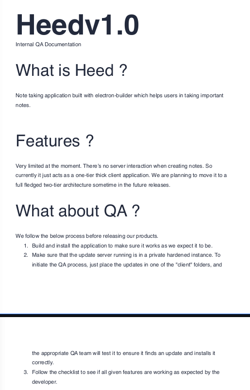
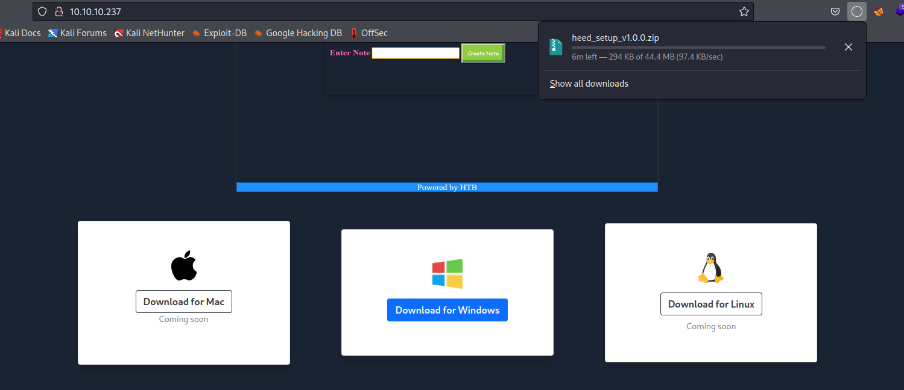
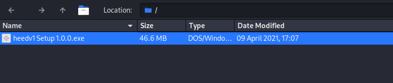

# Atom
## Enumeration
- `nmap`
```
└─$ nmap -Pn -p- 10.10.10.237 -T4                   
Starting Nmap 7.94 ( https://nmap.org ) at 2023-09-10 15:42 BST
Nmap scan report for 10.10.10.237 (10.10.10.237)
Host is up (0.094s latency).
Not shown: 65528 filtered tcp ports (no-response)
PORT     STATE SERVICE
80/tcp   open  http
135/tcp  open  msrpc
443/tcp  open  https
445/tcp  open  microsoft-ds
5985/tcp open  wsman
6379/tcp open  redis
7680/tcp open  pando-pub
```
```
└─$ nmap -Pn -p80,135,443,445,5985,6379,7680 -sC -sV 10.10.10.237 -T4 
Starting Nmap 7.94 ( https://nmap.org ) at 2023-09-10 16:01 BST
Nmap scan report for 10.10.10.237 (10.10.10.237)
Host is up (0.23s latency).

PORT     STATE    SERVICE   VERSION
80/tcp   open     http      Apache httpd 2.4.46 ((Win64) OpenSSL/1.1.1j PHP/7.3.27)
|_http-server-header: Apache/2.4.46 (Win64) OpenSSL/1.1.1j PHP/7.3.27
| http-methods: 
|_  Potentially risky methods: TRACE
|_http-title: Heed Solutions
135/tcp  open     msrpc     Microsoft Windows RPC
443/tcp  open     ssl/http  Apache httpd 2.4.46 ((Win64) OpenSSL/1.1.1j PHP/7.3.27)
|_http-server-header: Apache/2.4.46 (Win64) OpenSSL/1.1.1j PHP/7.3.27
| ssl-cert: Subject: commonName=localhost
| Not valid before: 2009-11-10T23:48:47
|_Not valid after:  2019-11-08T23:48:47
| tls-alpn: 
|_  http/1.1
| http-methods: 
|_  Potentially risky methods: TRACE
|_http-title: Heed Solutions
|_ssl-date: TLS randomness does not represent time
445/tcp  open     0�j�7V    Windows 10 Pro 19042 microsoft-ds (workgroup: WORKGROUP)
5985/tcp open     http      Microsoft HTTPAPI httpd 2.0 (SSDP/UPnP)
|_http-server-header: Microsoft-HTTPAPI/2.0
|_http-title: Not Found
6379/tcp open     redis     Redis key-value store
7680/tcp filtered pando-pub
Service Info: Host: ATOM; OS: Windows; CPE: cpe:/o:microsoft:windows

Host script results:
| smb-os-discovery: 
|   OS: Windows 10 Pro 19042 (Windows 10 Pro 6.3)
|   OS CPE: cpe:/o:microsoft:windows_10::-
|   Computer name: ATOM
|   NetBIOS computer name: ATOM\x00
|   Workgroup: WORKGROUP\x00
|_  System time: 2023-09-10T08:00:46-07:00
| smb2-security-mode: 
|   3:1:1: 
|_    Message signing enabled but not required
|_clock-skew: mean: 2h19m23s, deviation: 4h02m30s, median: -36s
| smb-security-mode: 
|   account_used: guest
|   authentication_level: user
|   challenge_response: supported
|_  message_signing: disabled (dangerous, but default)
| smb2-time: 
|   date: 2023-09-10T15:00:47
|_  start_date: N/A

Service detection performed. Please report any incorrect results at https://nmap.org/submit/ .
Nmap done: 1 IP address (1 host up) scanned in 63.43 seconds
                                                               
```
- `smb`
```
└─$ smbclient -N -L //10.10.10.237       

        Sharename       Type      Comment
        ---------       ----      -------
        ADMIN$          Disk      Remote Admin
        C$              Disk      Default share
        IPC$            IPC       Remote IPC
        Software_Updates Disk      
Reconnecting with SMB1 for workgroup listing.
do_connect: Connection to 10.10.10.237 failed (Error NT_STATUS_IO_TIMEOUT)
Unable to connect with SMB1 -- no workgroup available
```
```
└─$ smbclient -N //10.10.10.237/Software_Updates
Try "help" to get a list of possible commands.
smb: \> ls
  .                                   D        0  Sun Sep 10 16:53:06 2023
  ..                                  D        0  Sun Sep 10 16:53:06 2023
  client1                             D        0  Sun Sep 10 16:53:06 2023
  client2                             D        0  Sun Sep 10 16:53:06 2023
  client3                             D        0  Sun Sep 10 16:53:06 2023
  UAT_Testing_Procedures.pdf          A    35202  Fri Apr  9 12:18:08 2021

                4413951 blocks of size 4096. 1372464 blocks available
smb: \> 
```



- Web Server
  - We can download `heed_setup_v1.0.0.zip`





- `redis`
  - https://book.hacktricks.xyz/network-services-pentesting/6379-pentesting-redis#basic-information
```
└─$ redis-cli -h 10.10.10.237
10.10.10.237:6379> info
NOAUTH Authentication required.
10.10.10.237:6379> keys *
(error) NOAUTH Authentication required.
10.10.10.237:6379> 
```

## Foothold
- `heed_setup_v1.0.0.zip`




## User


## Root