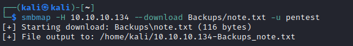
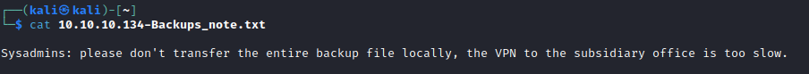
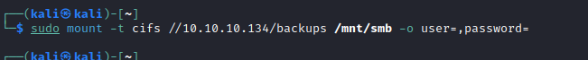
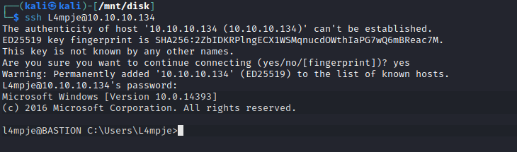
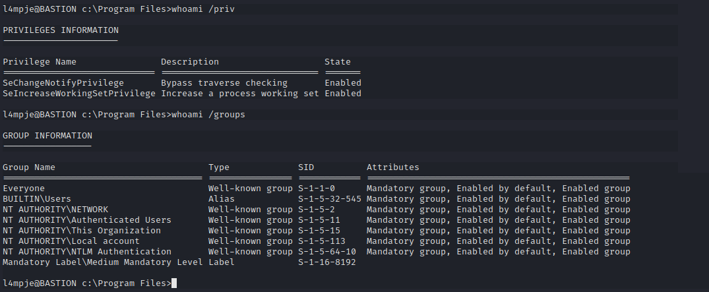
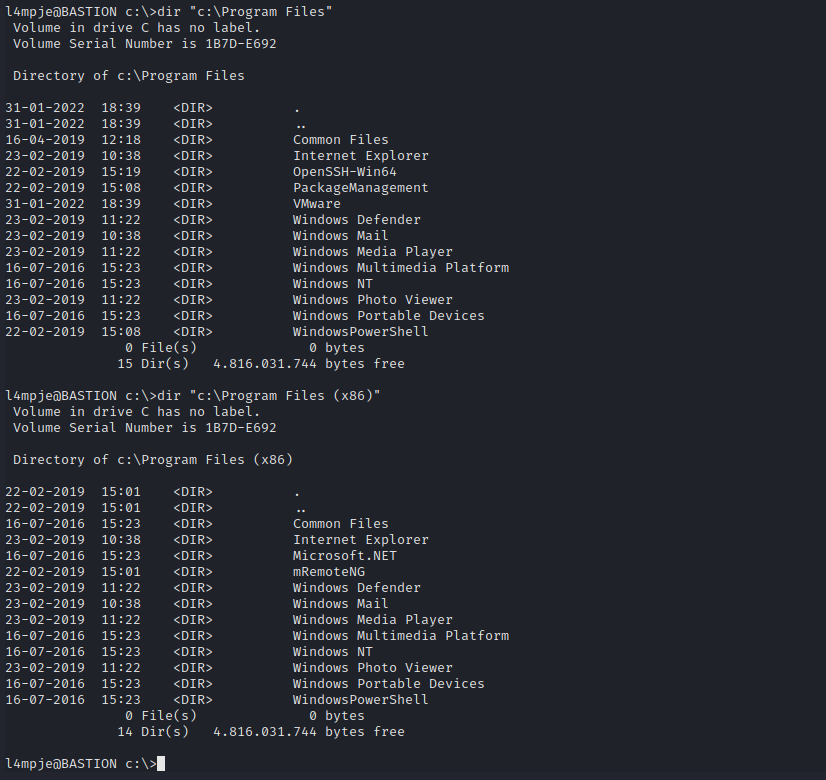
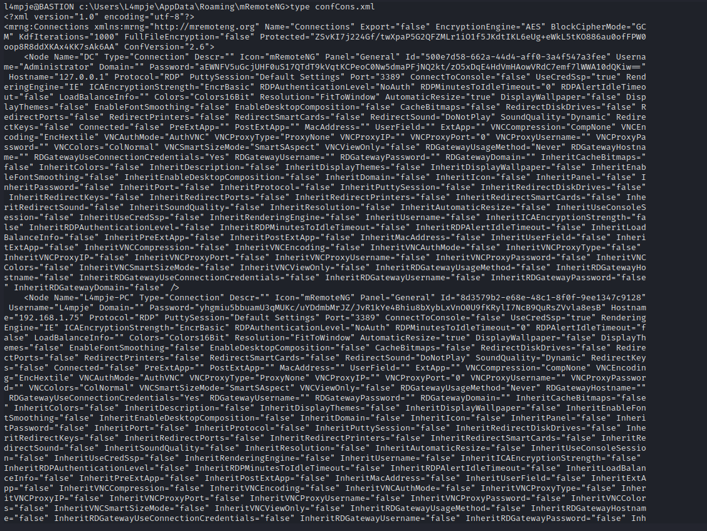

# Bastion
## Enumeration
- `nmap`
```
└─$ nmap -Pn -sC -sV 10.10.10.134 -T4
Starting Nmap 7.93 ( https://nmap.org ) at 2023-06-17 21:20 BST
Nmap scan report for 10.10.10.134 (10.10.10.134)
Host is up (0.13s latency).
Not shown: 996 closed tcp ports (conn-refused)
PORT    STATE SERVICE      VERSION
22/tcp  open  ssh          OpenSSH for_Windows_7.9 (protocol 2.0)
| ssh-hostkey: 
|   2048 3a56ae753c780ec8564dcb1c22bf458a (RSA)
|   256 cc2e56ab1997d5bb03fb82cd63da6801 (ECDSA)
|_  256 935f5daaca9f53e7f282e664a8a3a018 (ED25519)
135/tcp open  msrpc        Microsoft Windows RPC
139/tcp open  netbios-ssn  Microsoft Windows netbios-ssn
445/tcp open  microsoft-ds Windows Server 2016 Standard 14393 microsoft-ds
Service Info: OSs: Windows, Windows Server 2008 R2 - 2012; CPE: cpe:/o:microsoft:windows

Host script results:
| smb2-time: 
|   date: 2023-06-17T20:20:50
|_  start_date: 2023-06-17T18:27:22
| smb-security-mode: 
|   account_used: guest
|   authentication_level: user
|   challenge_response: supported
|_  message_signing: disabled (dangerous, but default)
|_clock-skew: mean: -40m29s, deviation: 1h09m15s, median: -30s
| smb2-security-mode: 
|   311: 
|_    Message signing enabled but not required
| smb-os-discovery: 
|   OS: Windows Server 2016 Standard 14393 (Windows Server 2016 Standard 6.3)
|   Computer name: Bastion
|   NetBIOS computer name: BASTION\x00
|   Workgroup: WORKGROUP\x00
|_  System time: 2023-06-17T22:20:49+02:00

Service detection performed. Please report any incorrect results at https://nmap.org/submit/ .
Nmap done: 1 IP address (1 host up) scanned in 40.14 seconds

```
- `smbmap`
```
└─$ smbmap -H 10.10.10.134 -R -u pentest
[+] Guest session       IP: 10.10.10.134:445    Name: 10.10.10.134                                      
[-] Work[!] Unable to remove test directory at \\10.10.10.134\Backups\UEQFPWNJOX, please remove manually
        Disk                                                    Permissions     Comment
        ----                                                    -----------     -------
        ADMIN$                                                  NO ACCESS       Remote Admin
        Backups                                                 READ, WRITE
        .\Backups\*
        dr--r--r--                0 Sun Jun 18 09:58:58 2023    .
        dr--r--r--                0 Sun Jun 18 09:58:58 2023    ..
        fw--w--w--              116 Tue Apr 16 12:43:19 2019    note.txt
        fr--r--r--                0 Fri Feb 22 12:43:28 2019    SDT65CB.tmp
        dr--r--r--                0 Sun Jun 18 09:58:58 2023    UEQFPWNJOX
        dr--r--r--                0 Fri Feb 22 12:44:02 2019    WindowsImageBackup
        .\Backups\WindowsImageBackup\*
        dr--r--r--                0 Fri Feb 22 12:44:02 2019    .
        dr--r--r--                0 Fri Feb 22 12:44:02 2019    ..
        dr--r--r--                0 Fri Feb 22 12:45:32 2019    L4mpje-PC
        .\Backups\WindowsImageBackup\L4mpje-PC\*
        dr--r--r--                0 Fri Feb 22 12:45:32 2019    .
        dr--r--r--                0 Fri Feb 22 12:45:32 2019    ..
        dr--r--r--                0 Fri Feb 22 12:45:32 2019    Backup 2019-02-22 124351
        dr--r--r--                0 Fri Feb 22 12:45:32 2019    Catalog
        fr--r--r--               16 Fri Feb 22 12:44:02 2019    MediaId
        dr--r--r--                0 Fri Feb 22 12:45:32 2019    SPPMetadataCache
        .\Backups\WindowsImageBackup\L4mpje-PC\Backup 2019-02-22 124351\*
        dr--r--r--                0 Fri Feb 22 12:45:32 2019    .
        dr--r--r--                0 Fri Feb 22 12:45:32 2019    ..
        fr--r--r--         37761024 Fri Feb 22 12:44:03 2019    9b9cfbc3-369e-11e9-a17c-806e6f6e6963.vhd
        fr--r--r--       5418299392 Fri Feb 22 12:45:32 2019    9b9cfbc4-369e-11e9-a17c-806e6f6e6963.vhd
        fr--r--r--             1186 Fri Feb 22 12:45:32 2019    BackupSpecs.xml
        fr--r--r--             1078 Fri Feb 22 12:45:32 2019    cd113385-65ff-4ea2-8ced-5630f6feca8f_AdditionalFilesc3b9f3c7-5e52-4d5e-8b20-19adc95a34c7.xml
        fr--r--r--             8930 Fri Feb 22 12:45:32 2019    cd113385-65ff-4ea2-8ced-5630f6feca8f_Components.xml
        fr--r--r--             6542 Fri Feb 22 12:45:32 2019    cd113385-65ff-4ea2-8ced-5630f6feca8f_RegistryExcludes.xml
        fr--r--r--             2894 Fri Feb 22 12:45:32 2019    cd113385-65ff-4ea2-8ced-5630f6feca8f_Writer4dc3bdd4-ab48-4d07-adb0-3bee2926fd7f.xml
        fr--r--r--             1488 Fri Feb 22 12:45:32 2019    cd113385-65ff-4ea2-8ced-5630f6feca8f_Writer542da469-d3e1-473c-9f4f-7847f01fc64f.xml
        fr--r--r--             1484 Fri Feb 22 12:45:32 2019    cd113385-65ff-4ea2-8ced-5630f6feca8f_Writera6ad56c2-b509-4e6c-bb19-49d8f43532f0.xml
        fr--r--r--             3844 Fri Feb 22 12:45:32 2019    cd113385-65ff-4ea2-8ced-5630f6feca8f_Writerafbab4a2-367d-4d15-a586-71dbb18f8485.xml
        fr--r--r--             3988 Fri Feb 22 12:45:32 2019    cd113385-65ff-4ea2-8ced-5630f6feca8f_Writerbe000cbe-11fe-4426-9c58-531aa6355fc4.xml
        fr--r--r--             7110 Fri Feb 22 12:45:32 2019    cd113385-65ff-4ea2-8ced-5630f6feca8f_Writercd3f2362-8bef-46c7-9181-d62844cdc0b2.xml
        fr--r--r--          2374620 Fri Feb 22 12:45:32 2019    cd113385-65ff-4ea2-8ced-5630f6feca8f_Writere8132975-6f93-4464-a53e-1050253ae220.xml
        .\Backups\WindowsImageBackup\L4mpje-PC\Catalog\*
        dr--r--r--                0 Fri Feb 22 12:45:32 2019    .
        dr--r--r--                0 Fri Feb 22 12:45:32 2019    ..
        fr--r--r--             5698 Fri Feb 22 12:45:32 2019    BackupGlobalCatalog
        fr--r--r--             7440 Fri Feb 22 12:45:32 2019    GlobalCatalog
        .\Backups\WindowsImageBackup\L4mpje-PC\SPPMetadataCache\*
        dr--r--r--                0 Fri Feb 22 12:45:32 2019    .
        dr--r--r--                0 Fri Feb 22 12:45:32 2019    ..
        fr--r--r--            57848 Fri Feb 22 12:45:32 2019    {cd113385-65ff-4ea2-8ced-5630f6feca8f}
        C$                                                      NO ACCESS       Default share
        IPC$                                                    READ ONLY       Remote IPC
        .\IPC$\*
        fr--r--r--                3 Sun Dec 31 23:58:45 1600    InitShutdown
        fr--r--r--                4 Sun Dec 31 23:58:45 1600    lsass
        fr--r--r--                3 Sun Dec 31 23:58:45 1600    ntsvcs
        fr--r--r--                3 Sun Dec 31 23:58:45 1600    scerpc
        fr--r--r--                1 Sun Dec 31 23:58:45 1600    Winsock2\CatalogChangeListener-2fc-0
        fr--r--r--                3 Sun Dec 31 23:58:45 1600    epmapper
        fr--r--r--                1 Sun Dec 31 23:58:45 1600    Winsock2\CatalogChangeListener-1e8-0
        fr--r--r--                3 Sun Dec 31 23:58:45 1600    LSM_API_service
        fr--r--r--                3 Sun Dec 31 23:58:45 1600    eventlog
        fr--r--r--                1 Sun Dec 31 23:58:45 1600    Winsock2\CatalogChangeListener-3b8-0
        fr--r--r--                3 Sun Dec 31 23:58:45 1600    atsvc
        fr--r--r--                4 Sun Dec 31 23:58:45 1600    wkssvc
        fr--r--r--                1 Sun Dec 31 23:58:45 1600    Winsock2\CatalogChangeListener-364-0
        fr--r--r--                3 Sun Dec 31 23:58:45 1600    trkwks
        fr--r--r--                3 Sun Dec 31 23:58:45 1600    spoolss
        fr--r--r--                1 Sun Dec 31 23:58:45 1600    Winsock2\CatalogChangeListener-66c-0
        fr--r--r--                3 Sun Dec 31 23:58:45 1600    W32TIME_ALT
        fr--r--r--                1 Sun Dec 31 23:58:45 1600    openssh-ssh-agent
        fr--r--r--                4 Sun Dec 31 23:58:45 1600    srvsvc
        fr--r--r--                1 Sun Dec 31 23:58:45 1600    vgauth-service
        fr--r--r--                1 Sun Dec 31 23:58:45 1600    Winsock2\CatalogChangeListener-5ec-0
        fr--r--r--                1 Sun Dec 31 23:58:45 1600    Winsock2\CatalogChangeListener-264-0
        fr--r--r--                1 Sun Dec 31 23:58:45 1600    Winsock2\CatalogChangeListener-26c-0
```
## Foothold
- Let's check the `note.txt`





- We see 2 `vhd` files, let's check them 
  - `apt install guestmount` - so we can mount `vhd`
  - `mount -t cifs //10.10.10.134/backups /mnt -o user=,password=`
  - `guestmount --add /mnt/smb/WindowsImageBackup/L4mpje-PC/Backup\ 2019-02-22\ 124351/9b9cfbc4-369e-11e9-a17c-806e6f6e6963.vhd --inspector --ro /mnt/disk`




- Go to `Windows/System32/config`
  - and dump the hashes


- Crack the hashes


- Connect to `ssh`



## Root
- Let's enumerate 



- Let's check installed software



- We see [mRemoteNG](https://github.com/mRemoteNG/mRemoteNG)
  - Let's find it's config file: `confCons.xml`
  - According to [docs](https://mremoteng.readthedocs.io/en/latest/troubleshooting.html) it should be located in `%AppData%\mRemoteNG`
  - 


- Let's open it



- Decypher the password using [mRemoteNG Decrypt](https://github.com/kmahyyg/mremoteng-decrypt)
  - And connect via `ssh`


